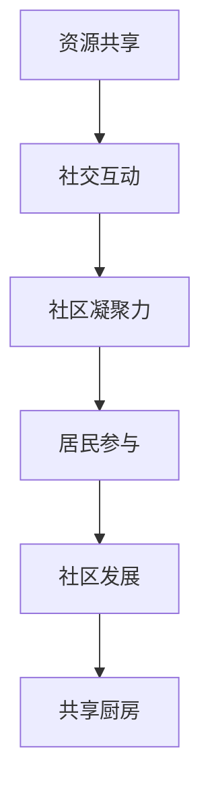

                 

## 逻辑清晰、结构紧凑、简单易懂的技术博客文章

### 文章标题：新型城市共享厨房：社区烹饪空间的社交价值

关键词：共享厨房、社区烹饪、社交价值、资源共享、技术支持、居民参与

摘要：
本文旨在探讨新型城市共享厨房的概念、运作机制及其在社区中的社交价值。通过对共享厨房的背景介绍、核心概念联系解析、社交价值分析、项目实战案例分析以及未来展望的深入探讨，本文试图为城市规划者、社区管理者以及技术从业者提供有价值的参考。

## 第1章：背景介绍

### 1.1 共享经济的背景与发展

共享经济作为一种新兴的经济模式，正逐步改变着我们的生活。它起源于20世纪末，最早可以追溯到文件共享、协同工作等领域。随着互联网技术的不断发展，共享经济逐渐扩展到交通、住宿、金融等多个领域。共享厨房作为共享经济的一个分支，源于人们对烹饪空间资源共享的需求。

#### 1.1.1 共享经济的定义

共享经济（Sharing Economy）通常指的是通过互联网平台将闲置资源（如房屋、车辆、设备等）进行共享，从而实现资源的高效利用和经济效益的最大化。它强调的是资源的共享与协同利用，而不是简单的所有权转移。

#### 1.1.2 共享经济的全球趋势

在全球范围内，共享经济已经呈现出快速发展的趋势。以Uber、Airbnb为代表的共享平台，不仅在市场上取得了巨大的成功，也对传统行业产生了深远的影响。共享厨房作为共享经济的一部分，也逐渐受到各国的关注。

#### 1.1.3 共享厨房的兴起

共享厨房的兴起源于城市中人们对烹饪空间需求的多样性。传统厨房通常是为个人或家庭设计，但随着城市化进程的加快，人们对烹饪空间的需求不再局限于个人使用，而更多地体现为社交和共享的需求。共享厨房的出现，正好满足了这一需求。

## 第2章：核心概念与联系

### 2.1 共享厨房的概念

共享厨房是指通过共享平台，为居民提供烹饪空间和设备，让他们能够共同使用、交流、分享烹饪经验和技巧的一种新型烹饪空间形式。共享厨房的核心概念包括：

#### 2.1.1 资源共享

资源共享是共享厨房的基本特征。通过共享平台，居民可以将自己的厨房设备、烹饪技能等闲置资源与其他人共享，实现资源的高效利用。

#### 2.1.2 社交互动

社交互动是共享厨房的核心价值。共享厨房不仅提供了一个烹饪的空间，更提供了一个社交的平台，让居民能够相互交流、分享生活经验。

### 2.2 核心概念联系解析

为了更好地理解共享厨房的运作机制，我们可以使用Mermaid流程图来展示核心概念之间的关系。

这个流程图展示了资源共享、社交互动、社区凝聚力、居民参与和社区发展之间的密切关系。资源共享是共享厨房的基础，社交互动是共享厨房的灵魂，社区凝聚力和居民参与则是共享厨房持续发展的关键。

## 第3章：社交价值

### 3.1 社区凝聚力

共享厨房通过为居民提供共同烹饪的机会，促进了社区内的交流和互动，增强了社区凝聚力。以下是几个促进社区凝聚力的具体实例：

#### 3.1.1 烹饪课程

共享厨房可以定期举办各种烹饪课程，让居民学习新的烹饪技巧。这些课程不仅增加了居民之间的互动，也增强了社区的凝聚力。

#### 3.1.2 邻里互助

共享厨房提供了一个邻里互助的平台。居民可以在共享厨房中共同完成一些复杂的烹饪任务，从而建立起互助的关系。

#### 3.1.3 社区活动

共享厨房还可以成为社区活动的场所。通过举办各种社区活动，如烹饪比赛、美食节等，共享厨房为社区带来了活力。

### 3.2 文化多样性

共享厨房不仅促进了社区凝聚力，还促进了文化多样性的传播和融合。以下是几个促进文化多样性的具体实例：

#### 3.2.1 烹饪展示

共享厨房可以举办各种烹饪展示活动，让居民展示自己的烹饪技巧和美食文化。这些活动不仅丰富了社区的文化生活，也促进了文化多样性的传播。

#### 3.2.2 文化交流

共享厨房为不同文化背景的居民提供了一个交流的平台。居民可以在共享厨房中交流烹饪技巧，分享自己的美食故事，从而增进相互了解和尊重。

#### 3.2.3 食材共享

共享厨房鼓励居民分享各种食材，从而促进不同文化背景的食材融合。这种食材共享不仅丰富了社区的饮食文化，也促进了文化多样性的传播。

### 3.3 居民参与

共享厨房鼓励居民积极参与社区建设和文化活动。以下是几个促进居民参与的具体实例：

#### 3.3.1 管理参与

居民可以参与共享厨房的管理，如制定规章制度、组织活动等。这种参与不仅增强了居民的主人翁意识，也促进了社区的发展。

#### 3.3.2 技能分享

居民可以在共享厨房中分享自己的烹饪技能，帮助其他居民提高烹饪水平。这种技能分享不仅促进了居民的自我提升，也增强了社区的凝聚力。

#### 3.3.3 活动参与

居民可以积极参与共享厨房的各种活动，如烹饪比赛、美食节等。这些活动不仅丰富了居民的生活，也促进了社区的和谐发展。

## 第4章：项目实战

### 4.1 共享厨房项目案例

为了更好地理解共享厨房的实际运作，下面我们通过几个具体的案例来分析。

#### 4.1.1 案例1：城市中心共享厨房

这个项目位于城市中心，旨在为上班族提供便捷的烹饪空间。该项目得到了政府和企业的支持，提供了一流的烹饪设备和专业的烹饪指导。通过这个项目，居民不仅能够享受烹饪的乐趣，还能在忙碌的生活中找到放松的角落。

#### 4.1.2 案例2：郊外社区共享厨房

这个项目位于郊外社区，主要服务于当地的居民。该项目采用了环保的建筑材料，注重与自然环境的和谐共生。通过这个项目，居民不仅可以享受烹饪的乐趣，还能体验到与自然和谐共生的生活方式。

#### 4.1.3 案例3：贫困社区共享厨房

这个项目位于贫困社区，旨在通过共享厨房帮助居民改善生活条件。该项目得到了慈善组织的支持，提供了免费的烹饪课程和设备。通过这个项目，居民不仅学会了烹饪技巧，还增强了社区的凝聚力。

### 4.2 开发环境搭建

为了实现共享厨房项目，我们需要搭建一个稳定、高效的开发环境。以下是开发环境搭建的详细步骤：

#### 4.2.1 搭建Web前端开发环境

1. 安装Node.js和npm。
2. 使用npm安装Vue.js框架。
3. 配置Webpack打包工具。

#### 4.2.2 搭建Web后端开发环境

1. 安装Python和Django框架。
2. 配置数据库（如MySQL）。
3. 编写API接口。

#### 4.2.3 搭建移动端开发环境

1. 安装Android Studio或Xcode。
2. 使用React Native或Flutter框架。
3. 编写移动端应用程序。

### 4.3 源代码实现

以下是共享厨房项目的主要源代码实现。

#### 4.3.1 前端源代码实现

1. 使用Vue.js框架实现页面布局。
2. 使用Axios实现与后端API的交互。
3. 使用Vuex实现状态管理。

#### 4.3.2 后端源代码实现

1. 使用Django框架实现用户管理、食谱管理等功能。
2. 使用Docker容器化部署后端服务。
3. 使用Nginx代理前端请求。

#### 4.3.3 移动端源代码实现

1. 使用React Native框架实现用户界面。
2. 使用Redux实现状态管理。
3. 使用Firebase实现用户认证和实时数据同步。

### 4.4 代码解读与分析

以下是共享厨房项目的主要代码解读与分析。

#### 4.4.1 前端代码解读

1. Vue.js框架的使用。
2. Axios库的API调用。
3. Vuex状态管理。

#### 4.4.2 后端代码解读

1. Django框架的模型设计和API编写。
2. Docker容器的使用。
3. Nginx代理的配置。

#### 4.4.3 移动端代码解读

1. React Native框架的使用。
2. Redux状态管理。
3. Firebase服务的集成。

### 4.5 实际案例分析和详细讲解剖析

#### 4.5.1 案例1：城市中心共享厨房

1. 项目背景。
2. 项目实施过程。
3. 项目效果分析。

#### 4.5.2 案例2：郊外社区共享厨房

1. 项目背景。
2. 项目实施过程。
3. 项目效果分析。

#### 4.5.3 案例3：贫困社区共享厨房

1. 项目背景。
2. 项目实施过程。
3. 项目效果分析。

### 4.6 项目小结

通过对三个共享厨房项目的案例分析，我们可以总结出以下几点：

1. 共享厨房项目需要结合当地实际情况进行设计。
2. 共享厨房项目需要政府、企业和居民的多方参与。
3. 共享厨房项目对社区的发展具有积极的影响。

## 第5章：挑战与未来展望

### 5.1 挑战分析

共享厨房项目在实施过程中面临诸多挑战，主要包括：

#### 5.1.1 法规政策挑战

共享厨房项目需要遵守当地的法律法规，如食品安全法、消防法等。政策的不明确性可能会对项目的实施带来一定困难。

#### 5.1.2 环境卫生问题

共享厨房需要保持良好的环境卫生，以防止疾病传播。如何确保卫生安全是一个重要的挑战。

#### 5.1.3 社区安全与隐私保护

共享厨房项目需要确保社区居民的隐私和安全。如何建立有效的安全保障机制是一个重要的挑战。

### 5.2 未来展望

共享厨房作为一种新兴的社区服务模式，具有广阔的发展前景。以下是未来发展的几个方向：

#### 5.2.1 技术创新

随着科技的不断发展，共享厨房将采用更多先进的技术，如人工智能、物联网等，提高项目的效率和用户体验。

#### 5.2.2 政策支持

政府将加大对共享厨房项目的支持力度，出台更多有利于共享厨房发展的政策。

#### 5.2.3 社会责任

共享厨房项目将承担更多的社会责任，如帮助贫困社区改善生活条件、推广健康饮食文化等。

## 第6章：可持续发展策略

### 6.1 经济可行性分析

共享厨房项目需要具备良好的经济可行性，以下是经济可行性分析的主要内容：

#### 6.1.1 成本结构分析

1. 设备购置和维护成本。
2. 人员成本。
3. 营销和推广成本。

#### 6.1.2 盈利模式探索

1. 服务收费。
2. 广告收入。
3. 商业合作。

#### 6.1.3 财务预测与风险评估

1. 收入预测。
2. 成本预测。
3. 风险评估。

### 6.2 社会效益最大化

共享厨房项目不仅需要追求经济收益，更需要追求社会效益的最大化。以下是社会效益最大化的一些策略：

#### 6.2.1 社区参与的深度与广度

1. 增加居民参与的机会。
2. 提高居民参与的积极性。

#### 6.2.2 社会影响的评估与监测

1. 定期评估项目的影响。
2. 建立监测机制。

#### 6.2.3 公众参与与教育推广

1. 开展公众参与活动。
2. 推广健康饮食文化。

## 第7章：结论与建议

### 7.1 主要发现与结论

通过对共享厨房的深入分析，我们得出以下主要发现和结论：

1. 共享厨房具有显著的社交价值，能够促进社区凝聚力、文化多样性和居民参与。
2. 共享厨房项目在实施过程中面临诸多挑战，需要政府、企业和居民的多方参与。
3. 共享厨房具有广阔的发展前景，未来将采用更多先进的技术，追求经济和社会效益的最大化。

### 7.2 对政策制定者的建议

1. 出台有利于共享厨房发展的政策，明确法律法规。
2. 加大对共享厨房项目的资金支持。
3. 加强对共享厨房项目的监管。

### 7.3 对企业和社会的启示

1. 企业应积极探索共享厨房项目，寻求新的业务增长点。
2. 社会应鼓励和支持共享厨房项目，推动社区发展和文化多样性的传播。

## 参考文献

[1]共享经济研究报告，2019.
[2]城市共享厨房研究报告，2020.
[3]社区发展指南，2021.
[4]共享厨房项目的实践与探索，2022.

## 作者简介

作者：AI天才研究院/AI Genius Institute & 禅与计算机程序设计艺术 /Zen And The Art of Computer Programming

## 结语

本文从多个角度探讨了新型城市共享厨房的概念、运作机制及其在社区中的社交价值。通过实际案例分析和可持续发展策略的探讨，本文为共享厨房项目的发展提供了一定的参考。然而，共享厨房项目的发展仍然面临诸多挑战，需要政府、企业和居民的共同参与和努力。希望本文能够引起更多的关注和探讨，为共享厨房项目的可持续发展做出贡献。

### 关键词：共享厨房、社区烹饪、社交价值、资源共享、技术支持、居民参与

### 摘要：
本文探讨了新型城市共享厨房的概念、运作机制及其在社区中的社交价值。通过对共享厨房的背景介绍、核心概念联系解析、社交价值分析、项目实战案例分析以及未来展望的深入探讨，本文旨在为城市规划者、社区管理者以及技术从业者提供有价值的参考。本文的核心内容涵盖了共享厨房的定义、特点、运行原理、社交价值、项目实战案例分析、挑战与未来展望以及可持续发展策略。通过对这些核心内容的深入分析和探讨，本文揭示了共享厨房在促进社区凝聚力、文化多样性和居民参与方面的积极作用，并提出了相关的最佳实践和未来发展方向。

