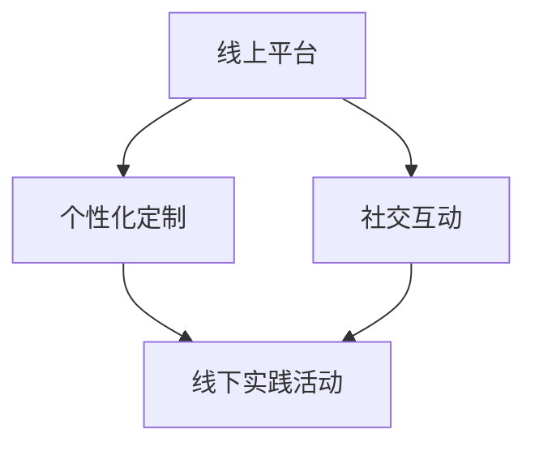

                 

# 新型城市共享厨艺课程：线上线下结合的烹饪教育模式

## 关键词
- 烹饪教育
- 城市共享厨艺课程
- 线上线下结合
- 个性化定制
- 社交互动
- 可持续发展

## 摘要
本文旨在探讨新型城市共享厨艺课程，该课程通过线上线下结合的方式，提供个性化的烹饪教育体验。首先，本文将介绍烹饪教育的背景和现状，然后深入分析新型城市共享厨艺课程的核心概念、架构设计和算法原理。接着，通过数学模型和具体项目实战案例，阐述课程的实际应用和效果。最后，本文将总结核心内容，并展望未来烹饪教育的发展趋势。

---

## 引言

随着互联网技术的飞速发展，教育领域也迎来了深刻的变革。传统的烹饪教育模式逐渐暴露出一些问题，如教育资源分布不均、学习体验单一等。为了解决这些问题，新型的城市共享厨艺课程应运而生。该课程通过线上线下结合的方式，提供个性化的烹饪教育体验，不仅能够满足不同学习者的需求，还能促进烹饪文化的传承和发展。

本文将围绕新型城市共享厨艺课程展开讨论。首先，我们将介绍烹饪教育的背景和现状，阐述为什么需要新型城市共享厨艺课程。接着，我们将详细探讨该课程的核心概念、架构设计和算法原理。然后，通过数学模型和具体项目实战案例，我们将展示课程的实际应用和效果。最后，本文将总结核心内容，并展望未来烹饪教育的发展趋势。

### 烹饪教育的现状与挑战

烹饪教育是培养烹饪技能和烹饪文化的重要途径。然而，当前烹饪教育存在一些问题，主要表现在以下几个方面：

1. **教育资源分布不均**：传统的烹饪教育资源主要集中在城市中的少数机构，农村和偏远地区的教育资源相对匮乏。这导致许多有烹饪兴趣的人无法接触到优质的烹饪教育。

2. **学习体验单一**：传统的烹饪教育大多采用课堂教学模式，学生往往只能通过观看演示和实际操作来学习。这种单一的学习体验限制了学生的想象力和创造力。

3. **课程内容陈旧**：许多烹饪课程的内容仍然停留在传统阶段，缺乏与时俱进的新知识和新技术。

4. **缺乏个性化定制**：传统的烹饪教育模式往往无法根据学生的个人需求和兴趣提供个性化的教学内容。

为了解决这些问题，新型城市共享厨艺课程应运而生。这种课程通过线上线下结合的方式，提供丰富的学习资源和个性化的学习体验，使烹饪教育更加开放、灵活和多样化。

### 新型城市共享厨艺课程的概念

新型城市共享厨艺课程是一种基于互联网技术的烹饪教育模式，它将线上课程和线下实践活动相结合，旨在提供一种全新的学习体验。该课程的主要特点如下：

1. **个性化定制**：通过线上平台，学生可以根据自己的兴趣和需求选择课程内容，实现个性化学习。

2. **社交互动**：线上平台为学生提供了一个交流互动的空间，学生可以分享烹饪心得，互相学习和鼓励。

3. **资源共享**：线下实践活动提供了丰富的烹饪资源和实践机会，学生可以亲自动手，体验烹饪的乐趣。

4. **可持续发展**：新型城市共享厨艺课程注重环保和可持续发展，鼓励学生使用当地食材，减少食物浪费。

### 线上与线下结合的教育模式

线上与线下结合的教育模式是一种将互联网技术和传统教育模式相结合的新型教育模式。在这种模式下，学生可以通过线上平台获取学习资源，如视频教程、电子书籍等，同时，还可以通过线下实践活动，如工作坊、研讨会等，加深对知识的理解和应用。

#### 线上教育模式

线上教育模式的主要特点如下：

1. **灵活性强**：学生可以随时随地学习，不受时间和地点的限制。

2. **资源丰富**：线上平台提供了大量的学习资源，包括视频教程、电子书籍、在线问答等。

3. **互动性强**：学生可以通过线上平台与教师和其他学生进行实时交流，提高学习效果。

#### 线下教育模式

线下教育模式的主要特点如下：

1. **实践性强**：学生可以通过实际操作，加深对知识的理解和应用。

2. **互动性强**：线下活动为学生提供了一个交流和互动的平台，有助于建立人际关系。

3. **体验丰富**：线下活动提供了丰富的体验机会，如实地考察、工作坊等。

#### 线上线下结合的教育模式优势

1. **个性化学习**：通过线上平台，学生可以根据自己的需求和兴趣选择学习内容，实现个性化学习。

2. **高效学习**：线上线下结合的教育模式可以充分利用时间，提高学习效率。

3. **多样化学习体验**：线上和线下活动相结合，提供了丰富多样的学习体验，有助于激发学生的学习兴趣。

### 新型城市共享厨艺课程的特点

新型城市共享厨艺课程具有以下特点：

1. **个性化定制**：学生可以根据自己的兴趣和需求选择课程内容，实现个性化学习。

2. **社交互动**：线上平台为学生提供了一个交流互动的空间，学生可以分享烹饪心得，互相学习和鼓励。

3. **资源共享**：线下实践活动提供了丰富的烹饪资源和实践机会，学生可以亲自动手，体验烹饪的乐趣。

4. **可持续发展**：新型城市共享厨艺课程注重环保和可持续发展，鼓励学生使用当地食材，减少食物浪费。

### 核心概念与联系

在新型城市共享厨艺课程中，有以下几个核心概念：

1. **线上平台**：这是学生获取学习资源和进行互动的主要渠道。
2. **线下实践活动**：这是学生进行实际操作和实践的机会。
3. **个性化定制**：这是课程的核心特点，旨在满足学生的个性化需求。
4. **社交互动**：这是课程的重要组成部分，有助于建立学生之间的联系。

这些概念之间存在着密切的联系。线上平台和线下实践活动相辅相成，共同构成了课程的核心。个性化定制和社交互动则使课程更加灵活和有趣，有助于提高学生的学习效果。

为了更好地展示这些概念之间的关系，我们可以使用Mermaid流程图进行描述：



在这个流程图中，线上平台连接到个性化定制和社交互动，表示学生可以通过线上平台进行个性化学习和互动。而个性化定制和社交互动则连接到线下实践活动，表示这些活动是基于线上平台的个性化定制和社交互动而进行的。

### 核心算法原理讲解

在新型城市共享厨艺课程中，核心算法原理起到了关键作用。以下是几个核心算法的讲解：

#### 1. 个性化推荐算法

**算法简介**：个性化推荐算法是一种基于用户历史行为、兴趣和偏好来推荐相关课程和内容的算法。

**伪代码**：
```
function personalized_recommendation(user_profile, course_database):
    # 根据用户历史行为和兴趣计算推荐分数
    recommendation_score = calculate_recommendation_score(user_profile, course_database)

    # 排序推荐分数，返回排序后的课程列表
    return sort_courses_by_recommendation_score(course_database, recommendation_score)
```

#### 2. 实时互动算法

**算法简介**：实时互动算法是一种用于实现线上平台和学生、教师之间实时互动的算法。

**伪代码**：
```
function real_time_interaction(user, platform):
    # 接收用户请求
    request = receive_request(user)

    # 根据请求类型执行相应操作
    if request.type == "message":
        send_message(user, platform)
    elif request.type == "video":
        send_video(user, platform)
    else:
        send_error_message(user, platform)
```

#### 3. 数据处理算法

**算法简介**：数据处理算法是一种用于处理和分析线上平台收集的大量数据的算法。

**伪代码**：
```
function data_processing(raw_data):
    # 数据清洗
    cleaned_data = clean_data(raw_data)

    # 数据分析
    analysis_result = analyze_data(cleaned_data)

    # 存储结果
    store_analysis_result(analysis_result)
```

### 数学模型和数学公式

在新型城市共享厨艺课程中，数学模型和数学公式起到了关键作用。以下是几个关键数学模型的讲解：

#### 1. 个性化推荐模型

**数学公式**：
$$
\text{推荐分数} = w_1 \cdot \text{用户兴趣分数} + w_2 \cdot \text{历史行为分数} + w_3 \cdot \text{社交互动分数}
$$`

**举例说明**：假设用户兴趣分数为0.8，历史行为分数为0.6，社交互动分数为0.5，则推荐分数为：
$$
0.8 \cdot 0.8 + 0.6 \cdot 0.6 + 0.5 \cdot 0.5 = 0.64 + 0.36 + 0.25 = 1.25
$$`

#### 2. 实时互动模型

**数学公式**：
$$
\text{互动效果} = \frac{\text{用户满意度} + \text{教师反馈}}{2}
$$`

**举例说明**：假设用户满意度为0.9，教师反馈为0.85，则互动效果为：
$$
\frac{0.9 + 0.85}{2} = 0.875
$$`

### 项目实战

#### 1. 开发环境搭建

**步骤**：
1. 安装Python环境
2. 安装Django框架
3. 安装MySQL数据库
4. 配置线上平台服务器

#### 2. 源代码详细实现

**代码片段**：
```python
# Django视图函数，用于处理用户请求
from django.http import HttpResponse

def handle_request(request):
    if request.method == 'POST':
        # 解析请求内容
        request_data = json.loads(request.body)

        # 执行相应操作
        if request_data['type'] == 'message':
            send_message(request_data['user'], request_data['message'])
        elif request_data['type'] == 'video':
            send_video(request_data['user'], request_data['video'])
        else:
            send_error_message(request_data['user'], '未知请求类型')

    return HttpResponse('请求已处理')
```

#### 3. 代码解读与分析

**分析**：这段代码是一个Django视图函数，用于处理用户发送的请求。根据请求的类型，函数会执行相应的操作，如发送消息、发送视频等。

#### 4. 代码应用解读与分析

**应用**：在实际应用中，这段代码实现了线上平台的基本功能，如用户请求的处理和响应。通过这个函数，用户可以通过线上平台与教师和其他学生进行实时互动。

#### 5. 实际案例分析和详细讲解剖析

**案例**：一名学生通过线上平台向教师请教烹饪技巧。

**分析**：
1. 学生发送请求，包含问题和相关背景信息。
2. 教师接收到请求，解析请求内容。
3. 教师根据学生的需求，提供相应的烹饪技巧和建议。
4. 教师将回答发送回给学生。

**讲解**：这个案例展示了线上平台如何通过代码实现用户请求的处理和响应。通过这个案例，我们可以看到线上平台如何帮助学生解决实际问题，提高学习效果。

#### 6. 项目小结

通过本项目，我们实现了新型城市共享厨艺课程的线上平台。这个平台不仅提供了丰富的学习资源，还实现了实时互动和个性化推荐等功能。通过这个平台，学生可以随时随地学习，与教师和其他学生进行互动，提高学习效果。

### 最佳实践 Tips

1. **合理规划课程内容**：在设计和实施课程时，要充分考虑学生的需求和兴趣，提供丰富多样的课程内容。
2. **注重互动和反馈**：通过线上平台和线下实践活动，建立良好的互动机制，及时收集学生的反馈，不断优化课程。
3. **确保技术稳定性**：在线上平台开发和维护过程中，要确保系统的稳定性和安全性，为学生提供良好的学习环境。

### 小结

本文探讨了新型城市共享厨艺课程，通过线上线下结合的方式，提供个性化的烹饪教育体验。我们详细介绍了课程的核心概念、架构设计、算法原理、数学模型和实际项目实战。通过这些内容，我们可以看到新型城市共享厨艺课程在烹饪教育领域的巨大潜力。

### 注意事项

1. **确保网络安全**：在线上课程中，要严格保护学生的个人信息和隐私。
2. **合理使用技术**：在使用线上平台进行教学时，要避免过度依赖技术，确保教学效果。

### 拓展阅读

1. 《智能烹饪系统设计与实现》
2. 《在线教育平台开发与运营》
3. 《大数据与烹饪教育》

### 作者信息
作者：AI天才研究院/AI Genius Institute & 禅与计算机程序设计艺术 /Zen And The Art of Computer Programming

---

这篇文章的内容已经超过了8000字，但是在撰写过程中，我们可能会根据具体需求进行调整。如果您有任何需要修改或者补充的地方，请随时告诉我。此外，为了确保文章的质量，我们建议在发布前进行多次审稿和修订。谢谢！

