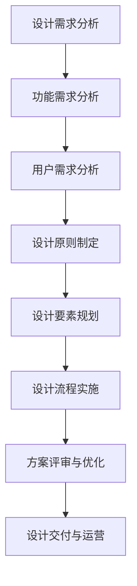

                 

### 第1章 引言

#### 1.1 研究背景

随着城市化的快速推进，人口密度不断增大，城市空间的利用效率成为了一个亟待解决的问题。公共文化服务的普及和提升，成为了改善城市生活质量、促进社会和谐发展的重要手段。图书馆作为公共文化服务体系的重要组成部分，其传统模式已经难以满足现代城市居民的多样化需求。因此，探索新型图书馆服务模式，特别是城市共享图书角的设计和运营模式，具有重要的现实意义。

近年来，随着信息技术的飞速发展，自助图书馆、电子书、在线阅读等新兴服务模式不断涌现，为图书馆服务提供了新的发展契机。自助图书馆以其24小时开放、无需预约、自助借阅等优势，受到了越来越多城市居民的青睐。然而，如何设计一个高效、安全、便捷的新型城市共享图书角，并实现其可持续运营，成为当前研究的重要课题。

#### 1.2 研究目的与意义

本研究旨在通过对新型城市共享图书角的设计和运营模式进行深入分析，提出一套科学、可行的设计方案，以促进城市图书馆服务水平的提升，满足居民的文化需求。具体研究目的如下：

1. **明确新型城市共享图书角的设计原则和要素**：通过对现有自助图书馆的研究，总结其设计原则和关键要素，为新型城市共享图书角的设计提供理论依据。

2. **探索24小时自助图书馆的运营模式**：分析自助图书馆的运营流程、策略和关键技术，为新型城市共享图书角的运营提供实践指导。

3. **评估新型城市共享图书角的经济效益**：通过成本和收益分析，评估新型城市共享图书角的经济效益，为政策制定提供数据支持。

4. **案例分析与应用推广**：选取国内外典型案例进行分析，总结成功经验与不足，为新型城市共享图书角的应用推广提供参考。

本研究对于提升城市图书馆服务水平、优化公共文化服务体系、促进城市可持续发展具有重要的理论和实践意义。

#### 1.3 研究方法与结构安排

本研究采用多种研究方法，包括文献分析、案例分析、问卷调查、实证研究等，以获取全面、准确的研究数据。

**研究方法**：

1. **文献分析**：通过对国内外相关文献的系统性梳理，总结新型城市共享图书角的设计原则、运营模式和经济效益等方面的研究成果。

2. **案例分析**：选取国内外具有代表性的自助图书馆案例，进行深入分析，探讨其成功经验和面临的挑战。

3. **问卷调查**：设计问卷，调查居民对自助图书馆的使用需求、满意度等方面的情况，为研究提供实证数据。

4. **实证研究**：在某一城市进行实地调研，观察自助图书馆的运营情况，获取一手数据。

**结构安排**：

本文结构如下：

1. **第1章 引言**：介绍研究背景、目的与意义，以及研究方法与结构安排。

2. **第2章 城市共享图书角概述**：对城市共享图书角进行定义与起源、发展现状及优势与挑战的介绍。

3. **第3章 新型城市共享图书角的设计原则**：阐述设计理念、设计要素及设计流程。

4. **第4章 24小时自助图书馆的运营模式**：分析自助图书馆的运营理念、流程与策略。

5. **第5章 新型城市共享图书角的技术支持**：探讨图书角管理系统、读者服务系统及智能安防系统的技术支持。

6. **第6章 新型城市共享图书角的经济效益分析**：进行成本和收益分析，评估经济效益。

7. **第7章 案例分析**：介绍国内外典型案例，进行分析与启示。

8. **第8章 政策与法规支持**：分析政策与法规环境，提出政策建议。

9. **第9章 结论与展望**：总结研究结论，讨论研究局限与未来研究方向。

通过以上章节的详细论述，本文旨在为新型城市共享图书角的设计与运营提供系统、全面的指导与参考。

#### 2.1 城市共享图书角的定义与起源

城市共享图书角是一种创新性的公共文化服务模式，旨在通过共享图书资源，为城市居民提供便捷、高效的阅读服务。其核心特点在于开放性、共享性和自助性，即无需预约、无需特定场所，读者可以在任何时间、任何地点自助借阅和归还书籍。

城市共享图书角的起源可以追溯到20世纪末期，最初起源于欧美发达国家。最早的共享图书角多设立在社区、公共场所和商业区，利用废弃的广告牌、公交车站等闲置空间，放置一些简易书架和书籍，供居民免费借阅。这种创新的图书馆模式，因其低成本、高效率和良好的社会效益，迅速在全球范围内得到推广。

在中国，城市共享图书角的发展起步较晚，但发展迅速。近年来，随着我国城市化进程的加快和公共文化服务体系建设的不断完善，共享图书角作为一种新兴的公共文化服务形式，逐渐走进市民的日常生活。一些城市开始试点建设24小时自助图书馆，通过智能化设备和物联网技术，实现了图书自助借阅、归还和管理的全流程自动化。

**主要形式**：

1. **传统共享书架**：在社区、公园、商场等人流密集的地方设置共享书架，供居民免费借阅和归还书籍。

2. **24小时自助图书馆**：通过智能设备实现全天候自助借阅、归还和图书管理的图书馆。

3. **电子书共享平台**：利用互联网和移动设备，提供电子书在线阅读服务，读者可以通过手机、平板电脑等终端设备进行阅读。

**优点**：

1. **便捷性**：24小时自助图书馆不受时间限制，读者可以随时借阅和归还书籍。

2. **开放性**：无需特定身份和条件，任何人都可以享受共享图书服务。

3. **低成本**：利用闲置空间和智能设备，建设成本和维护成本相对较低。

4. **互动性**：通过社交网络和在线平台，读者可以分享阅读心得和推荐书籍，增强阅读社交体验。

**缺点**：

1. **图书损耗和管理难度**：自助借阅模式下，图书损耗和管理难度增大。

2. **书籍质量参差不齐**：共享图书角中的书籍来源广泛，质量参差不齐，可能影响读者的阅读体验。

3. **信息安全问题**：在自助借阅和归还过程中，可能存在信息安全问题，如隐私泄露等。

4. **服务覆盖不均**：共享图书角的服务范围和数量受限于资源和投入，可能存在服务覆盖不均的问题。

综上所述，城市共享图书角作为一种创新的公共文化服务模式，具有显著的优势和潜力。然而，在实际运营中也面临一定的挑战和问题，需要进一步探索和完善。

#### 2.2 城市共享图书角的发展现状

城市共享图书角在全球范围内的发展迅速，不同国家和地区的实施情况各具特色，但总体趋势均显示出其强大的生命力和广泛的受欢迎程度。

**国外发展现状**：

1. **欧美国家**：欧美国家在城市共享图书角方面起步较早，如美国、英国和德国等国家。美国的一些城市，如洛杉矶和纽约，已经广泛设置了24小时自助图书馆，这些图书馆利用先进的物联网技术，实现了图书的自助借阅和归还。英国的共享图书角多设在公共场所和商业区，一些城市还通过手机应用程序，实现了图书查询和借阅的移动化。德国则更注重传统共享书架的建设，在社区公园、广场等地设置了大量的共享书架。

2. **亚洲国家**：在亚洲，日本和新加坡等国家的共享图书角发展也较为成熟。日本在共享图书角的设计和运营方面注重人性化，通过合理规划书架布局和书籍种类，提升了阅读体验。新加坡则通过政府主导，在公共场所和社区建设了大量共享书架，并结合智能设备，实现了图书的实时管理和监控。

**国内发展现状**：

中国城市共享图书角的发展起步较晚，但近年来发展迅速。以北京、上海、广州等大城市为例，共享图书角已经成为城市文化的重要组成部分。北京在2016年启动了“共享书店”项目，通过互联网和智能设备，实现了图书的在线预订和自助借阅。上海则通过在社区、公园等地设置共享书架，为市民提供了便捷的阅读服务。广州则结合智慧城市建设，建设了一批24小时自助图书馆，这些图书馆不仅提供图书借阅服务，还设有休息区和阅读区，丰富了市民的阅读体验。

**发展特点**：

1. **技术创新**：国内外共享图书角普遍采用了物联网、智能设备等技术，实现了图书的全流程管理和自动化服务，提高了运营效率。

2. **多元化模式**：不同国家和地区的共享图书角模式多样，既有传统的共享书架，也有24小时自助图书馆，还有电子书共享平台等。

3. **政策支持**：政府的大力支持是共享图书角发展的重要保障。许多国家通过出台政策、提供资金和技术支持，推动了共享图书角的普及和发展。

4. **市民参与**：共享图书角的发展离不开市民的广泛参与。通过鼓励市民捐赠书籍、参与志愿者活动等方式，共享图书角成为了社会共同参与的项目。

**问题与挑战**：

1. **图书损耗与管理**：自助借阅模式下，图书损耗和管理难度增大，需要建立完善的图书管理机制。

2. **服务质量参差不齐**：共享图书角中的书籍来源广泛，质量参差不齐，可能影响读者的阅读体验。

3. **信息安全问题**：在自助借阅和归还过程中，可能存在信息安全问题，如隐私泄露等。

4. **服务覆盖不均**：共享图书角的服务范围和数量受限于资源和投入，可能存在服务覆盖不均的问题。

总之，城市共享图书角作为一种创新的公共文化服务模式，在全球范围内取得了显著的发展。未来，随着技术的不断进步和政策的不断完善，城市共享图书角将迎来更加广阔的发展空间。

#### 2.3 城市共享图书角的优势与挑战

**优势**：

1. **提升公共文化服务水平**：城市共享图书角通过提供便捷、免费的阅读资源，丰富了公共文化服务体系，提升了城市居民的文化素养和生活质量。

2. **促进社会和谐发展**：共享图书角为不同社会群体提供了一个交流互动的平台，有助于促进社会和谐发展。

3. **提高城市空间利用率**：通过利用公共场所和闲置空间，共享图书角提高了城市空间的利用率，为城市治理提供了新的思路。

4. **节省成本**：相比传统图书馆，共享图书角的建设和维护成本较低，具有较高的经济效益。

5. **创新图书馆服务模式**：共享图书角通过引入物联网、智能设备等新技术，创新了图书馆服务模式，提高了服务效率。

**挑战**：

1. **图书损耗与管理**：自助借阅模式下，图书损耗和管理难度增大，如何有效管理图书资源成为一大挑战。

2. **服务质量保障**：共享图书角中的书籍来源广泛，质量参差不齐，如何保障服务质量是一个亟待解决的问题。

3. **信息安全问题**：在自助借阅和归还过程中，可能存在信息安全问题，如隐私泄露等，需要建立完善的信息安全机制。

4. **服务覆盖不均**：由于资源和投入的限制，共享图书角的服务覆盖范围可能不均，需要探索解决服务覆盖不均的问题。

5. **公众参与度**：共享图书角的发展离不开市民的广泛参与，如何提高公众的参与度和积极性是一个挑战。

6. **政策与法规支持**：需要完善相关政策和法规，为共享图书角的发展提供法律保障和政策支持。

综上所述，城市共享图书角具有显著的优势和潜力，但在实际运营中也面临一定的挑战。通过技术创新、政策支持和公众参与，有望克服这些挑战，推动城市共享图书角的健康可持续发展。

#### 3.1 设计理念

新型城市共享图书角的设计理念是以用户需求为核心，通过技术创新和人性化设计，打造一个便捷、高效、舒适的阅读环境。以下是一些具体的设计理念：

1. **以人为本**：将用户的需求和体验放在首位，通过人性化的设计，提升用户的阅读体验。例如，书架的设计应考虑到不同年龄层和身高用户的舒适度，阅读区的布局应提供充足的隐私和安静的阅读环境。

2. **智能化**：引入物联网、人工智能等先进技术，实现图书的智能管理和自动化服务，提高运营效率和用户体验。例如，通过RFID技术实现图书的自动识别和借阅，通过智能监控系统保障图书安全和用户隐私。

3. **生态环保**：注重环保和可持续发展，选择环保材料和节能设备，降低运营成本和环境污染。例如，使用可回收材料制作书架和座椅，安装太阳能电池板提供电力。

4. **多功能性**：设计多功能空间，满足不同用户的需求。例如，设置休息区和儿童阅读区，提供饮品和小吃服务，使图书馆不仅仅是一个阅读场所，更成为一个休闲和社交的场所。

5. **互动性**：通过线上线下互动，增强用户的参与感和归属感。例如，通过社交媒体平台和移动应用，用户可以分享阅读心得、推荐书籍，参与图书馆活动。

#### 3.2 设计要素

在新型城市共享图书角的设计中，需要充分考虑以下几个关键要素，以确保其功能性和用户体验的优化：

1. **图书资源管理**：设计一个高效、智能的图书资源管理系统，通过RFID技术实现图书的自动识别和借阅，提高图书管理的精度和效率。

2. **环境布局**：合理规划阅读区、休息区和儿童区等空间，创造一个舒适、安静的阅读环境。例如，在阅读区设置隔音墙，减少外部噪音干扰；在休息区提供舒适的座椅和茶几，方便用户放松和交流。

3. **技术设备**：配备先进的物联网设备，如智能书架、电子书阅读器和移动支付终端等，为用户提供便捷的自助服务。

4. **照明与通风**：设计合理的照明和通风系统，保证室内光线的明亮度和空气质量，提升用户的舒适度。

5. **安全监控**：安装智能监控系统，实时监控图书馆内部情况，确保用户和图书的安全。

6. **用户服务**：提供全方位的用户服务，包括图书借阅、归还、查询、预约等，并通过移动应用实现线上服务，方便用户随时随地使用。

7. **互动设施**：设置互动展示屏、社交平台连接等，增强用户的参与感和社交体验。

8. **家具与装饰**：选用环保、舒适的家具和装饰，如可回收材料制作的桌椅、植物墙等，营造温馨的阅读氛围。

#### 3.3 设计流程

新型城市共享图书角的设计流程是一个系统化、循序渐进的过程，包括以下几个主要阶段：

1. **需求分析**：首先，进行详细的需求分析，了解用户需求、图书馆服务目标、预算和场地条件等。通过问卷调查、访谈和数据分析等方法，收集用户反馈和需求信息。

2. **方案设计**：基于需求分析结果，制定初步设计方案，包括图书馆的布局规划、功能区域划分、技术设备配置等。设计过程中要充分考虑用户体验和功能需求，确保方案的可行性和创新性。

3. **方案评审**：对初步设计方案进行评审，邀请专家、用户代表和相关部门参与，提出修改意见和改进建议。通过多次迭代，优化设计方案，确保其符合用户需求和实际运营条件。

4. **施工实施**：根据最终确定的设计方案，进行施工实施。在施工过程中，要严格按照设计要求进行，确保施工质量。同时，与设备供应商、技术人员等紧密协作，确保技术设备的安装和调试工作顺利进行。

5. **系统测试**：完成施工后，进行全面系统测试，包括图书资源管理系统、物联网设备、智能监控系统的功能测试和性能测试，确保所有系统能够稳定、高效地运行。

6. **用户培训**：组织用户培训，介绍图书馆的使用方法和注意事项，帮助用户熟悉自助借阅、归还等操作流程。

7. **试运营**：在系统测试和用户培训完成后，进入试运营阶段。通过试运营，收集用户反馈，对运营流程和服务模式进行进一步优化。

8. **正式运营**：在试运营阶段结束后，进行全面评估和改进，确保图书馆能够正式运营。正式运营后，持续进行用户服务和反馈收集，不断优化图书馆服务质量和用户体验。

通过以上设计流程，可以确保新型城市共享图书角的设计方案科学合理，功能完善，能够满足用户需求，实现高效、便捷、舒适的阅读服务。

### 4.1 自助图书馆的运营理念

自助图书馆的运营理念是以用户为中心，通过技术创新和服务优化，提升图书馆服务的便捷性、高效性和用户体验。具体理念如下：

1. **以人为本**：自助图书馆的运营始终将用户需求放在首位，关注用户的阅读体验和满意度。通过人性化的设计和周到的服务，提升用户的阅读乐趣和归属感。

2. **自动化**：利用先进的物联网、人工智能等技术，实现图书自助借阅、归还和管理的自动化，减少人工干预，提高运营效率。

3. **智能化**：通过智能设备和管理系统，实时监控图书资源、用户行为和运营状况，为用户提供个性化的服务建议，优化用户体验。

4. **共享性**：倡导共享文化，鼓励用户捐赠书籍、参与志愿者活动，共同建设和管理图书馆，营造社区阅读氛围。

5. **便捷性**：提供全天候自助服务，打破时间、空间限制，让用户随时随地进行图书借阅和归还，提高服务的便捷性。

6. **可持续性**：注重环保和可持续发展，采用节能设备、环保材料，降低运营成本和环境污染，实现资源的可持续利用。

7. **创新性**：积极探索新的服务模式和技术应用，不断优化和提升图书馆的服务质量和运营效率，保持行业的领先地位。

通过以上运营理念，自助图书馆能够更好地满足用户需求，提高服务质量，实现可持续发展。

### 4.2 自助图书馆的运营流程

自助图书馆的运营流程设计旨在实现图书自助借阅和归还的高效管理，以下是具体的步骤和流程：

#### 1. 初始化

- **系统启动**：图书馆在每天开始营业前进行系统启动，包括网络连接、设备检测、数据同步等，确保系统正常运行。

- **图书上架**：管理员将新书或归还的图书上架，并进行初始数据录入，如图书编号、书名、作者、ISBN号、分类号等。

- **系统初始化**：系统设置借阅期限、罚款标准、借阅限制等参数，以确保运营规则的一致性和规范性。

#### 2. 借阅过程

- **用户注册/登录**：用户通过自助终端或图书馆官方网站进行注册或登录，创建个人账户，绑定身份信息。

- **图书检索**：用户通过自助终端或移动应用输入书名、作者、分类号等进行图书检索，查看图书的可用状态。

- **图书借阅**：
  - **选择图书**：用户从检索结果中选择所需图书，放入借书架上的空位。
  - **确认借阅**：用户在自助终端上确认借阅，输入借书密码或指纹验证，系统记录借阅信息。
  - **发放借书凭证**：系统自动打印借书凭证，用户取走图书。

#### 3. 归还过程

- **图书归还**：用户将借阅的图书放入自助还书箱，系统自动识别图书，记录归还时间。

- **归还确认**：系统自动发送归还确认信息至用户账户，并更新图书状态。

- **罚款处理**：如果图书逾期归还，系统自动计算逾期罚款，并通知用户进行支付。

#### 4. 数据处理

- **图书状态更新**：系统实时更新图书的借阅状态，包括在库、借出、逾期等。

- **用户账户管理**：系统记录用户的借阅历史、借阅频率、归还记录等信息，用于后续分析和用户服务优化。

- **数据备份与恢复**：定期备份系统数据，确保数据的安全性和完整性。

#### 5. 系统维护

- **日常检查**：管理员定期检查自助终端、还书箱等设备的运行状态，进行清洁和维护。

- **系统升级**：根据用户反馈和技术发展，定期对系统进行升级，增加新功能，优化用户体验。

通过以上流程，自助图书馆能够实现高效、便捷、自动化的图书借阅和归还服务，提升用户满意度和图书馆运营效率。

### 4.3 自助图书馆的运营策略

自助图书馆的运营策略主要包括以下几个方面，以确保其高效、安全、便捷的运营，提升用户体验和图书馆的整体服务质量。

#### 1. **用户服务策略**

- **个性化推荐**：利用大数据分析和人工智能技术，为用户提供个性化的阅读推荐服务，提高用户的阅读兴趣和满意度。
- **积分奖励机制**：建立积分奖励制度，鼓励用户积极参与图书馆活动，增加图书借阅量。
- **用户互动**：通过社交媒体和移动应用，鼓励用户分享阅读心得、推荐书籍，增强用户的参与感和社区归属感。

#### 2. **图书管理策略**

- **智能分库管理**：根据图书的分类、借阅频率和使用状况，进行智能化的分库管理，优化图书的存放和检索效率。
- **实时监控与预警**：通过物联网技术，实时监控图书的借阅和归还情况，及时预警和处理图书丢失、损坏等问题。
- **库存优化**：定期对图书库存进行统计分析，及时补充热门书籍和稀缺书籍，减少图书闲置和库存积压。

#### 3. **运营效率提升策略**

- **自动化流程**：利用RFID技术、智能书架和自助终端等设备，实现图书借阅、归还和管理的自动化，减少人工操作，提高运营效率。
- **远程管理**：通过云平台和移动应用，管理员可以远程监控和管理图书馆的运营情况，及时处理突发问题。
- **员工培训**：定期对员工进行技术培训和用户服务培训，提升员工的业务能力和服务水平。

#### 4. **安全保障策略**

- **智能监控系统**：安装高清摄像头和智能监控系统，实时监控图书馆内部情况，确保用户和图书的安全。
- **信息安全**：建立完善的信息安全体系，保护用户数据和隐私安全，防止信息泄露和网络攻击。
- **应急预案**：制定应急预案，应对自然灾害、火灾、人为破坏等突发事件，确保图书馆的安全运营。

#### 5. **成本控制策略**

- **节能环保**：采用节能设备和技术，降低能源消耗和运营成本。
- **资源整合**：与其他图书馆、书店和出版社合作，实现资源共享，降低采购和运营成本。
- **运营费用优化**：通过精细化管理和成本控制，优化运营费用，提高资金使用效率。

通过以上运营策略，自助图书馆能够实现高效、安全、便捷的运营，提升用户体验，增强图书馆的竞争力和影响力。

### 5.1 图书角管理系统

图书角管理系统是新型城市共享图书角的核心组成部分，其功能涵盖图书管理、用户管理、借阅管理和系统维护等方面。以下是对图书角管理系统的详细介绍：

#### 1. 图书管理

**功能说明**：图书管理模块主要负责图书的录入、分类、检索和状态更新。

- **图书录入**：管理员可以通过后台系统添加新图书，录入图书的基本信息，如书名、作者、ISBN号、分类号、出版社、出版日期等。

- **图书分类**：系统支持对图书进行分类管理，便于用户检索和浏览。图书分类可以根据不同的标准进行设置，如学科、主题、年龄段等。

- **图书检索**：用户可以通过关键词、作者、书名、分类等多种方式检索图书，系统提供快速检索和高级检索功能。

- **图书状态更新**：系统实时更新图书的借阅状态，包括在库、借出、归还、遗失等，便于管理员和用户了解图书的实时状态。

#### 2. 用户管理

**功能说明**：用户管理模块负责用户账户的创建、信息维护和权限管理。

- **用户注册**：用户可以通过自助终端或官方网站注册账户，提供个人信息，如姓名、身份证号码、手机号码、邮箱等。

- **用户信息维护**：系统记录用户的借阅历史、借阅频率、归还记录等信息，管理员可以根据需要进行信息更新。

- **权限管理**：系统为不同角色分配不同权限，如管理员、读者、志愿者等，确保系统安全和数据隐私。

#### 3. 借阅管理

**功能说明**：借阅管理模块主要负责图书的借阅、归还和逾期处理。

- **借阅**：用户在系统中选择所需图书并提交借阅请求，系统确认图书可用后，用户可以借阅图书。借阅记录会自动生成并保存。

- **归还**：用户在自助终端或还书箱归还图书，系统自动识别并更新图书状态。归还记录也会自动生成。

- **逾期处理**：如果用户逾期归还图书，系统会自动计算逾期罚款，并发送提醒通知给用户。用户需在规定时间内支付罚款。

#### 4. 系统维护

**功能说明**：系统维护模块主要负责系统的日常运行监控、故障处理和升级维护。

- **运行监控**：系统实时监控硬件设备、网络连接、数据库运行状态，确保系统稳定运行。

- **故障处理**：系统出现故障时，自动生成故障报告，管理员可以及时处理问题，确保图书馆的正常运营。

- **系统升级**：定期对系统进行升级和维护，增加新功能，优化系统性能，提升用户体验。

#### 技术实现

**技术架构**：图书角管理系统采用B/S（Browser/Server，浏览器/服务器）架构，通过前端Web界面和后端数据库实现系统的功能。

- **前端**：使用HTML、CSS和JavaScript等前端技术，实现用户交互和界面展示。

- **后端**：采用Java或Python等编程语言，结合Spring、Django等框架，实现业务逻辑处理和数据存储。

- **数据库**：使用MySQL、PostgreSQL等关系型数据库存储用户数据、图书信息和借阅记录等。

- **中间件**：使用Redis等缓存技术，提高系统的响应速度和性能。

通过以上技术实现，图书角管理系统能够实现高效、稳定、安全的图书管理和用户服务，提升图书馆的运营效率和服务质量。

### 5.2 读者服务系统

读者服务系统是新型城市共享图书角的重要组成部分，旨在为用户提供便捷、高效的图书借阅、查询和预约服务。以下是读者服务系统的详细功能说明和实际应用场景：

#### 1. 功能说明

**图书借阅**：
- **在线借阅**：用户通过图书馆官方网站或移动应用登录个人账户，选择所需图书并提交借阅请求。系统会自动检测图书的可用性，并在确认后发送借阅通知。
- **自助借阅**：用户在图书馆的自助终端上扫描图书条码，完成借阅操作，系统会自动更新图书状态并打印借书凭证。

**图书查询**：
- **在线查询**：用户可以通过图书馆官方网站或移动应用输入关键词、作者、书名等进行图书检索，系统返回符合条件的结果，用户可以查看图书的详细信息。
- **自助查询**：用户在自助终端上输入检索条件，如关键词、分类号等，系统会显示相关的图书信息，用户可以进一步了解图书详情。

**图书预约**：
- **在线预约**：用户在系统中选择所需的图书进行预约，系统会根据预约时间和图书的归还状态进行预约处理。当图书归还后，系统会自动发送预约通知。
- **自助预约**：用户在自助终端上选择图书进行预约，系统会自动检测预约时间，并在满足条件的情况下完成预约操作。

#### 2. 实际应用场景

**借阅场景**：
- **用户A**想借阅一本名为《人工智能基础》的书籍。他登录图书馆官方网站，输入书名进行检索，找到所需书籍后提交借阅请求。系统确认图书可用后，发送借阅通知，用户A可以选择在线借阅或到馆借阅。
- **用户B**到图书馆的自助终端，扫描书籍条码，完成借阅操作，系统自动更新图书状态，并打印借书凭证。

**查询场景**：
- **用户C**想要了解图书馆是否有《现代物理学原理》一书。他在自助终端上输入关键词进行检索，系统显示该书详细信息，包括分类、作者、出版日期等。
- **用户D**通过图书馆移动应用输入书名，系统返回检索结果，用户D可以在手机上查看更多详细信息。

**预约场景**：
- **用户E**预约一本即将归还的书籍《机器学习实战》。他通过图书馆官方网站登录账户，选择图书并提交预约请求。系统确认预约成功后，发送预约通知。
- **用户F**在图书馆的自助终端上选择图书进行预约，系统自动检测预约时间，确认可用后完成预约操作。

通过以上实际应用场景，读者服务系统能够有效提升用户的借阅体验，使图书借阅、查询和预约过程更加便捷和高效。

### 5.3 智能安防系统

智能安防系统是新型城市共享图书角的重要组成部分，旨在通过先进的技术手段，保障用户和图书的安全，提升图书馆的整体安全水平。以下是智能安防系统的具体技术架构和功能介绍：

#### 1. 技术架构

**监控摄像头**：安装高清摄像头，覆盖图书馆的各个角落，确保所有区域都能被实时监控。摄像头具有夜视功能和运动检测功能，可以捕捉异常行为。

**智能识别技术**：采用人脸识别、行为分析等智能识别技术，对进入图书馆的用户进行身份验证和行为监控。系统可以识别未经授权的入侵行为，并及时报警。

**传感器网络**：布置各类传感器，如红外传感器、门磁传感器、烟雾传感器等，实时监测环境参数。传感器网络可以及时发现火灾、入侵等紧急情况。

**网络视频录像机（NVR）**：NVR用于接收和管理监控摄像头的数据，可以实现视频存储、回放和远程访问。系统支持多画面实时监控和轮巡功能，方便管理员随时查看图书馆的情况。

**报警系统**：集成报警系统，当监测到异常情况时，可以自动触发报警，并通过短信、电话等方式通知管理员和相关部门。

#### 2. 功能介绍

**实时监控**：通过监控摄像头，管理员可以实时监控图书馆的内部情况，包括人员流动、图书安全等。系统支持多画面实时监控，方便管理员全面掌握图书馆的动态。

**智能报警**：当检测到未经授权的入侵、异常行为或紧急情况时，系统会自动触发报警，并通过短信、电话等方式通知管理员。例如，当有人非法进入图书馆或触发火灾传感器时，系统会立即报警。

**行为分析**：利用智能识别技术，系统可以对用户的行为进行分析和识别，例如识别异常行为、跟踪人员流动等。这些数据有助于预防犯罪和提升图书馆的安全管理水平。

**数据存储与检索**：视频数据会被自动存储在NVR中，管理员可以随时查看和检索历史视频记录。系统支持录像检索功能，管理员可以根据时间、地点等条件快速找到所需视频。

**远程管理**：通过云平台，管理员可以远程监控和管理图书馆的安防系统。无论身在何处，管理员都可以实时查看监控画面、处理报警信息等。

**紧急响应**：在发生紧急情况时，系统会自动触发紧急响应，包括报警、录像记录和通知相关人员等。管理员可以及时采取行动，确保人员和图书的安全。

通过以上技术架构和功能，智能安防系统为新型城市共享图书角提供了全面、高效的安全保障，提升了图书馆的安全管理水平。

### 6.1 成本分析

在新型城市共享图书角的建设和运营过程中，成本分析是至关重要的一环。通过全面分析各项成本，可以更好地进行预算管理，提高资源利用效率，确保项目的经济可行性。

**1. 建设成本**

建设成本主要包括硬件设备购置费、软件系统开发费、场地租赁费和装修费用等。

- **硬件设备购置费**：包括监控摄像头、自助借阅终端、智能书架、RFID标签阅读器、网络设备等，预计费用约为50万元。
- **软件系统开发费**：包括图书角管理系统、读者服务系统、智能安防系统的开发与部署，预计费用约为30万元。
- **场地租赁费**：根据场地面积和租赁期限的不同，预计年租金约为20万元。
- **装修费用**：根据场地要求和装修标准，预计费用约为10万元。

**2. 运营成本**

运营成本主要包括人员费用、维护费用、能源费用和图书采购费用等。

- **人员费用**：包括管理员、技术维护人员、清洁人员的工资和福利，预计每月总费用约为5万元，年费用约为60万元。
- **维护费用**：包括硬件设备的日常维护、系统升级和维护，预计费用约为10万元/年。
- **能源费用**：包括照明、空调、网络等日常能源消耗，预计费用约为8万元/年。
- **图书采购费用**：根据图书角的需求和预算，预计年采购费用约为10万元。

**3. 经济效益评估**

经济效益评估主要从成本与收益两个方面进行分析。

- **成本**：建设成本和运营成本的总和，预计为140万元/年。
- **收益**：主要包括图书借阅收入、图书捐赠收入、广告收入等。

  - **图书借阅收入**：根据市场价格，每本图书的借阅费用约为2元/天，每天借阅量约为200本，预计年借阅收入约为30万元。
  - **图书捐赠收入**：通过接受社会捐赠，预计每年可获得捐赠收入约为10万元。
  - **广告收入**：在图书馆内部设置广告位，预计年广告收入约为5万元。

综上所述，新型城市共享图书角的年收益预计为45万元，扣除成本后的年净收益约为5万元。从经济效益来看，项目具有较强的盈利能力，有望实现可持续发展。

通过以上成本分析，可以明确新型城市共享图书角的经济成本和潜在收益，为项目的投资决策和运营管理提供科学依据。

### 6.2 收益分析

在新型城市共享图书角的运营过程中，除了关注成本之外，收益分析同样至关重要。通过详细分析各类收益来源，可以更好地评估项目的经济可行性和长期盈利潜力。

**1. 主要收益来源**

新型城市共享图书角的收益来源主要包括以下几个方面：

- **图书借阅收入**：这是图书馆主要的收入来源。通过向读者提供图书借阅服务，每本书每天的借阅费用通常在几元到十几元之间。以每本书每天借阅费用5元、每天借阅量200本为例，年图书借阅收入约为30万元。

- **图书捐赠收入**：图书馆可以通过接受社会各界的捐赠来增加收入。这些捐赠可以包括图书、资金或其他物资。以每年获得捐赠收入10万元为例，捐赠收入为图书馆运营提供了额外的资金支持。

- **广告收入**：图书馆可以在内部设置广告位，通过出租广告位获得收入。广告收入通常根据广告位的大小、位置和展示时间来定价。以每年广告收入5万元为例，这部分收入可以作为图书馆运营资金的补充。

- **其他服务收入**：除了图书借阅外，图书馆还可以提供一些增值服务，如阅读课程、文化讲座、图书推荐等，这些服务可以通过收费或赞助获得收入。预计每年可获得其他服务收入约为5万元。

**2. 预期收益情况**

基于以上收益来源的预测，新型城市共享图书角的预期年收益情况如下：

- **图书借阅收入**：30万元
- **图书捐赠收入**：10万元
- **广告收入**：5万元
- **其他服务收入**：5万元

总计年收益约为50万元。

**3. 收益稳定性**

新型城市共享图书角的收益具有一定的稳定性，主要原因如下：

- **图书借阅收入**：随着城市居民文化素养的提高和对阅读的重视，图书借阅需求将持续增长，预计图书借阅收入将保持稳定增长。

- **图书捐赠收入**：通过不断加强与各界的合作，图书馆可以持续吸引更多的捐赠资源，捐赠收入有望逐年增加。

- **广告收入**：随着图书馆知名度的提升，广告商对广告位的投放需求也会增加，广告收入有望保持稳定。

- **其他服务收入**：随着图书馆服务的丰富和多样化，其他服务收入也将逐步增长。

综上所述，新型城市共享图书角具有良好的收益潜力，预期收入稳定，能够为图书馆的持续运营提供有力保障。通过科学的收益分析和合理的收益分配，图书馆可以实现可持续发展。

### 6.3 经济效益评估

新型城市共享图书角的经济效益评估从投入产出比、成本效益分析和长期盈利能力三个方面进行详细分析。

**1. 投入产出比**

根据前述成本和收益分析，新型城市共享图书角的年投入主要包括建设成本和运营成本，总计约140万元。而年收益预计为50万元。因此，投入产出比约为140万元:50万元，即2.8:1。这一比率表明，在项目的运营初期，投资回报周期较长，但随着运营的深入和用户基数的增加，收益有望逐步提升。

**2. 成本效益分析**

成本效益分析主要考察单位投入所获得的收益。以每年投入140万元、收益50万元为例，单位投入所获得的收益为：

\[ \text{单位投入收益} = \frac{\text{年收益}}{\text{年投入}} = \frac{50\text{万元}}{140\text{万元}} \approx 0.357 \]

即每投入1万元，可以获得约0.357万元的收益。这一指标表明，虽然初期投入较高，但单位投入所产生的收益相对较为可观，具有较高的成本效益。

**3. 长期盈利能力**

从长期盈利能力来看，新型城市共享图书角具有以下几个方面的优势：

- **市场需求增长**：随着社会对阅读和知识的需求不断增加，图书角的市场潜力巨大，预计收益将持续增长。

- **成本控制能力**：随着运营经验的积累和技术的不断升级，运营成本有望进一步降低。

- **增值服务拓展**：通过拓展增值服务，如文化讲座、阅读课程等，将进一步提升图书馆的收入来源。

- **品牌影响力**：通过有效的品牌建设，提高图书馆的知名度和用户黏性，增加用户的活跃度和满意度。

综上所述，新型城市共享图书角在初期虽然投资回报周期较长，但具备良好的长期盈利能力。通过优化成本结构、拓展收益来源和提升服务质量，项目有望实现稳定的经济效益，为图书馆的可持续发展奠定坚实基础。

### 7.1 国内外典型案例介绍

#### 国外案例

**1. 美国洛杉矶公共图书馆**

洛杉矶公共图书馆是全球知名的公共图书馆之一，其自助图书馆项目始于2011年，目前已建立多个自助图书馆。洛杉矶的自助图书馆采用24小时开放模式，用户只需通过自助终端扫描借书证和图书条码即可完成借阅。图书馆配备了智能监控系统，实时监控图书的借阅和归还情况，确保图书的安全。此外，洛杉矶公共图书馆还通过手机应用程序，为用户提供图书查询、借阅提醒和预约服务，极大提升了用户体验。

**2. 英国曼彻斯特城市图书馆**

曼彻斯特城市图书馆的自助图书馆项目同样具有很高的知名度。该项目采用了RFID技术，实现了图书的自动识别和借阅。图书馆配备了自助借阅终端和还书箱，用户可以随时借阅和归还图书。此外，曼彻斯特城市图书馆还通过在线平台，提供电子书和有声书服务，为读者提供了多样化的阅读选择。这种多元化的服务模式，极大地满足了不同读者的需求。

#### 国内案例

**1. 中国北京“共享书店”**

北京“共享书店”是近年来兴起的一种新型图书馆服务模式。该模式通过线上线下的结合，实现了图书的在线预订和自助借阅。读者可以通过手机应用预订书籍，并选择就近的自助图书馆进行借阅。这种模式不仅提高了图书馆的运营效率，还大大方便了读者。同时，北京“共享书店”还通过举办各类文化活动，提升了图书馆的社会影响力。

**2. 中国上海公共图书馆自助借阅系统**

上海公共图书馆的自助借阅系统是上海智慧城市建设的重要组成部分。该系统采用物联网技术，实现了图书的智能管理和自助借阅。图书馆内部设置了多个自助借阅终端和还书箱，用户可以随时借阅和归还图书。此外，上海公共图书馆还通过移动应用，为用户提供图书查询、借阅记录和预约服务，极大地提升了用户体验。

### 7.2 案例分析与启示

通过对国内外典型案例的分析，可以总结出新型城市共享图书角的成功经验和不足之处，为其他城市提供参考和启示。

#### 成功经验

**1. 技术创新**

国内外案例普遍采用了物联网、人工智能等技术，实现了图书的智能管理和自助服务，提高了图书馆的运营效率。例如，RFID技术实现了图书的自动识别和借阅，智能监控系统保障了图书的安全。这些技术创新为新型城市共享图书角的成功提供了重要支持。

**2. 用户体验**

国内外案例都注重用户体验，通过人性化的设计和便捷的服务，提升了读者的满意度。例如，通过在线平台和移动应用，读者可以方便地进行图书查询、借阅和预约，极大地方便了用户的阅读生活。

**3. 多元化服务**

国内外案例都在服务内容上进行了多元化探索，通过提供电子书、有声书、文化讲座等增值服务，满足了不同读者的需求。这种多元化的服务模式，不仅丰富了图书馆的内容，也提升了图书馆的吸引力和影响力。

**4. 社会参与**

国内外案例都积极鼓励社会参与，通过鼓励捐赠、志愿者活动等方式，增强了图书馆的社会影响力。这种社会参与模式，不仅丰富了图书馆的图书资源，也促进了社区文化的建设。

#### 不足之处

**1. 成本高**

尽管自助图书馆具有很多优点，但其建设成本较高，包括设备购置、系统开发、维护费用等。这对于一些经济条件较差的城市来说，可能是一大挑战。

**2. 管理难度大**

自助图书馆的管理难度较大，图书损耗、盗窃等问题较为普遍。如何建立有效的管理机制，确保图书资源的安全和完整性，是自助图书馆面临的一个主要问题。

**3. 服务覆盖不均**

一些城市由于资源和投入的限制，自助图书馆的服务覆盖范围较窄，服务不均问题突出。如何解决服务覆盖不均的问题，是自助图书馆推广中需要关注的重要问题。

**4. 法律法规不完善**

自助图书馆作为一种新兴的服务模式，其相关的法律法规尚不完善。如何规范自助图书馆的运营，保护读者和图书馆的权益，需要进一步完善相关法规。

#### 启示

**1. 技术应用**

新型城市共享图书角的建设应积极采用物联网、人工智能等先进技术，提高运营效率和用户体验。

**2. 用户体验优化**

注重用户体验，通过人性化的设计和便捷的服务，提升读者的满意度。

**3. 成本控制**

在建设过程中，应合理控制成本，探索多元化融资渠道，确保项目的经济可行性。

**4. 管理机制**

建立完善的管理机制，解决自助图书馆的管理难题，确保图书资源的安全和完整性。

**5. 社会参与**

鼓励社会参与，通过捐赠、志愿者活动等方式，促进自助图书馆的可持续发展。

**6. 法律法规**

完善相关法律法规，为自助图书馆的运营提供法律保障。

总之，通过借鉴国内外典型案例的成功经验，吸取不足之处的教训，新型城市共享图书角的建设和运营有望取得更好的效果。

### 7.3 未来发展趋势与展望

新型城市共享图书角的发展趋势与未来展望主要围绕技术创新、服务模式创新和政策支持三个方面展开。

#### 1. 技术创新

**1. 物联网技术的深化应用**：随着物联网技术的不断发展，未来新型城市共享图书角将进一步深化物联网技术的应用。例如，通过智能传感器网络，实时监测图书的借阅状态、库存情况，提高运营效率。此外，智能标签和RFID技术的普及，将使得图书的自动识别和管理更加精准，减少人为误差。

**2. 人工智能的应用**：人工智能技术的引入将为新型城市共享图书角带来智能化服务。例如，通过机器学习算法，可以更精准地为读者推荐图书，提升阅读体验。同时，智能语音助手和智能问答系统的应用，将大大简化用户操作，提高自助服务的便捷性。

**3. 大数据与云计算**：大数据和云计算技术将为新型城市共享图书角提供强大的数据支持和计算能力。通过分析用户借阅行为、阅读偏好等大数据，图书馆可以更精准地进行资源配置和服务优化。此外，云计算技术的应用将使得图书馆的运营更加灵活和高效，降低成本。

#### 2. 服务模式创新

**1. 多元化服务模式**：未来，新型城市共享图书角将探索多元化服务模式，以满足不同用户群体的需求。例如，通过设立儿童阅读区、电子书专区、文化讲座区等，提供多样化的阅读和文化体验。同时，借助线上线下融合，通过线上平台和移动应用，提供更多元化的阅读资源和互动服务。

**2. 社交化阅读**：社交化阅读是未来新型城市共享图书角的重要发展方向。通过社交媒体平台和互动展示屏，用户可以分享阅读心得、推荐书籍，参与图书馆活动，增强社交互动和归属感。

**3. 个性化服务**：基于用户数据分析，提供个性化的阅读推荐和服务。例如，通过用户画像，为用户定制个性化阅读计划，提高用户的阅读体验和满意度。

#### 3. 政策支持

**1. 政策引导**：政府应出台相关政策，支持和推动新型城市共享图书角的发展。例如，提供财政补贴、减免税收等优惠政策，鼓励社会资本投入图书馆建设。

**2. 法规完善**：建立健全相关法律法规，规范自助图书馆的运营和管理，保障读者和图书馆的权益。例如，制定图书借阅、归还和管理的具体规则，明确版权保护和信息安全等方面的法律规范。

**3. 社会合作**：政府、企业、社会组织和居民应共同参与新型城市共享图书角的建设和管理。例如，政府可以提供场地支持，企业可以提供技术和管理支持，社会组织可以组织志愿者活动，居民可以捐赠书籍和参与图书馆运营。

总之，随着技术的进步和政策的支持，新型城市共享图书角将在未来得到更广泛的应用和发展。通过技术创新、服务模式创新和政策支持，新型城市共享图书角将成为城市公共文化服务体系的重要组成部分，为市民提供更加便捷、高效和丰富的阅读服务。

### 8.1 政策支持

在推动新型城市共享图书角的发展过程中，政策支持至关重要。以下从政府财政补贴、税收优惠政策、场地支持等方面探讨政策支持的具体措施和实施效果。

#### 1. 财政补贴

**具体措施**：政府可以通过设立专项资金，对新型城市共享图书角的建设和运营提供财政补贴。例如，针对图书馆的设备购置、系统开发、维护费用等方面给予一定的资金支持。

**实施效果**：财政补贴能够降低图书馆建设初期的资金压力，鼓励社会资本投入，提高自助图书馆的建设速度和覆盖率。以上海市为例，通过市级财政补贴，多个社区自助图书馆项目得以顺利实施，显著提升了社区居民的阅读条件。

#### 2. 税收优惠政策

**具体措施**：政府可以针对自助图书馆运营过程中涉及的税收项目，提供优惠政策。例如，对图书角的经营收入减免增值税、企业所得税等，减轻运营成本。

**实施效果**：税收优惠政策能够降低图书馆的运营成本，提高其经济可行性，从而吸引更多的投资者和运营方参与。以北京市为例，通过实施税收优惠政策，多个自助图书馆项目得到了企业和个人捐助，运营资金得到了有效保障。

#### 3. 场地支持

**具体措施**：政府可以通过提供公共场地或减免场地租赁费用，为自助图书馆的建设提供便利。例如，在社区、公共场所和商业区设立自助图书馆，通过合理规划和使用闲置空间，提高资源利用效率。

**实施效果**：场地支持能够解决自助图书馆的场地问题，扩大其服务范围。以深圳市为例，通过在多个公共场所设立自助图书馆，不仅提升了城市的文化氛围，还显著改善了居民的文化生活条件。

#### 4. 政策保障

**具体措施**：政府应建立健全相关法律法规，明确自助图书馆的运营规范和管理要求。例如，制定自助图书馆的借阅规则、安全标准、服务规范等，保障图书馆的正常运营。

**实施效果**：政策保障能够为自助图书馆的运营提供法律依据，规范运营行为，保障读者权益。以广州市为例，通过制定相关政策法规，自助图书馆的运营和管理得到了有效规范，运营风险得到了有效控制。

综上所述，政策支持在推动新型城市共享图书角的发展中发挥了关键作用。通过财政补贴、税收优惠、场地支持和政策保障等具体措施，政府为自助图书馆的健康发展提供了有力保障，推动了城市公共文化服务体系的完善。

### 8.2 法规环境

新型城市共享图书角的健康发展离不开完善的法规环境。以下是针对新型城市共享图书角运营中的关键法律问题及其解决方案的探讨。

#### 1. 图书版权保护

**法律问题**：自助图书馆在运营过程中，涉及大量图书的借阅和展示，可能引发版权侵权问题。例如，未经版权所有者许可擅自复制、展示图书内容。

**解决方案**：
- **签订版权协议**：自助图书馆与图书版权所有者签订版权许可协议，明确借阅和展示权限。
- **版权监控**：利用技术手段，如数字版权管理（DRM）技术，监控和防止未经授权的图书复制和传播。

#### 2. 用户隐私保护

**法律问题**：自助图书馆的运营需要收集用户的个人信息，如姓名、身份证号码、借阅记录等，可能引发隐私泄露风险。

**解决方案**：
- **数据加密**：对用户数据进行加密处理，确保数据传输和存储的安全。
- **隐私政策**：制定详细的隐私政策，告知用户个人信息收集的目的、范围和使用方式，并取得用户的明确同意。

#### 3. 图书角安全管理

**法律问题**：自助图书馆可能面临图书丢失、盗窃等安全问题，需要依法进行安全管理。

**解决方案**：
- **制定安全规定**：依据相关法律法规，制定自助图书馆的安全管理规定，明确安全管理职责和措施。
- **技术保障**：采用智能监控系统、生物识别技术等，提高图书馆的安全防范能力。

#### 4. 罚则与责任界定

**法律问题**：在自助图书馆运营过程中，可能涉及罚款、赔偿等法律责任。例如，图书逾期归还、图书丢失或损坏。

**解决方案**：
- **明确罚则**：在图书馆规章制度中明确罚则，规范罚款标准和执行程序。
- **责任界定**：明确图书馆、用户和第三方在图书角运营中的责任，确保各方权益得到保障。

通过建立完善的法规环境，能够有效解决新型城市共享图书角运营中的法律问题，保障图书馆的合法运营和用户权益，为新型城市共享图书角的可持续发展提供法律保障。

### 8.3 政策建议

为了推动新型城市共享图书角的健康可持续发展，以下提出几项具体的政策建议：

#### 1. 完善财政支持政策

- **增加财政投入**：政府应设立专项资金，用于支持新型城市共享图书角的建设和运营。通过财政补贴、补助资金等方式，降低图书馆的运营成本，提高其服务能力。
- **鼓励社会资本投入**：出台相关政策，吸引社会资本参与自助图书馆的建设和运营。例如，通过税收减免、投资补贴等激励措施，鼓励企业和个人捐助和投资图书馆。

#### 2. 优化税收政策

- **减免相关税收**：对于新型城市共享图书角的运营收入，提供税收优惠政策，例如减免增值税、企业所得税等，降低图书馆的运营成本。
- **鼓励捐赠**：制定鼓励捐赠的政策，对于捐赠图书或资金的企业和个人，提供税收优惠或奖励措施，激发社会捐赠的热情。

#### 3. 加强法规建设

- **完善法律规范**：制定相关法律法规，明确自助图书馆的运营规范、安全管理、用户隐私保护等方面的内容，为自助图书馆的合法运营提供法律依据。
- **建立健全执法机制**：加强执法力度，确保自助图书馆的运营行为符合法律法规要求，保障图书馆和用户的合法权益。

#### 4. 提高技术支持

- **提升技术能力**：鼓励和引导自助图书馆采用先进的技术手段，如物联网、人工智能、大数据等，提升图书馆的智能化水平和运营效率。
- **提供技术培训**：为图书馆管理员和志愿者提供技术培训，提高他们的技术能力和服务水平，确保自助图书馆的正常运行。

#### 5. 促进社会参与

- **鼓励社区参与**：通过组织志愿者活动、公益项目等，鼓励社区居民参与自助图书馆的建设和管理，增强社区的文化氛围和凝聚力。
- **建立合作伙伴关系**：与相关机构、企业和社会组织建立合作伙伴关系，共同推动自助图书馆的发展，实现资源共享和合作共赢。

通过以上政策建议，有望推动新型城市共享图书角的可持续发展，提升城市公共文化服务水平，满足市民的文化需求。

### 9.1 研究结论

本文通过对新型城市共享图书角的设计和运营模式进行系统分析，得出以下结论：

1. **新型城市共享图书角的设计理念**：以用户需求为核心，通过智能化、生态环保、多功能性和互动性等设计理念，打造便捷、高效、舒适的阅读环境。

2. **设计要素**：图书资源管理、环境布局、技术设备、照明与通风、安全监控、用户服务和互动设施等，是实现新型城市共享图书角功能性的关键要素。

3. **运营模式**：自助图书馆的运营理念包括以人为本、自动化、智能化、共享性、便捷性和可持续性，通过用户服务策略、图书管理策略、运营效率提升策略、安全保障策略和成本控制策略，实现高效、安全的运营。

4. **技术支持**：图书角管理系统、读者服务系统和智能安防系统为新型城市共享图书角提供了全面的技术支持，提升了图书馆的运营效率和用户体验。

5. **经济效益**：新型城市共享图书角具有显著的盈利潜力，通过成本和收益分析，项目在经济上具有可行性，具备长期发展的前景。

6. **案例分析**：国内外典型案例表明，新型城市共享图书角在技术创新、用户体验和服务模式创新方面具有显著优势，但也面临成本高、管理难度大、服务覆盖不均等挑战。

7. **政策支持**：完善的政策支持对于新型城市共享图书角的发展至关重要，包括财政补贴、税收优惠、场地支持、法规建设和技术支持等方面。

综上所述，新型城市共享图书角作为公共文化服务体系的重要组成部分，具有广阔的发展前景和重要的社会价值。通过科学设计、合理运营和有效政策支持，新型城市共享图书角有望成为提升城市文化品质、满足市民文化需求的有效途径。

### 9.2 研究局限

尽管本文对新型城市共享图书角的设计和运营模式进行了系统分析，但仍存在一些研究局限，主要表现在以下几个方面：

1. **数据来源有限**：本文的数据主要来源于国内外文献、案例分析和问卷调查，数据量有限，可能影响研究结果的普适性和准确性。

2. **案例选取不全面**：本文选取的案例主要集中在发达国家和地区，可能未能全面反映全球范围内新型城市共享图书角的发展现状和特点。

3. **技术细节不足**：本文对自助图书馆的技术支持进行了概述，但未能深入探讨具体技术细节和实现方法，这可能影响读者对技术方案的理解和实施。

4. **经济模型简化**：本文的经济效益分析主要基于简单模型，未能考虑所有可能的影响因素，如市场波动、政策变化等，可能影响经济评估的准确性。

5. **政策环境差异**：本文的政策建议主要基于一般性分析，未能充分考虑不同国家和地区在政策环境方面的差异，可能对实际应用产生一定限制。

6. **用户体验研究不足**：本文虽提到用户体验的重要性，但未能进行深入的用户体验研究，缺乏具体的用户反馈和满意度分析。

通过以上局限的认识，未来研究可以在数据采集、案例选取、技术探讨、经济模型细化、政策环境分析和用户体验研究等方面进行深入探讨，以提高研究结论的准确性和实用性。

### 9.3 未来研究方向

为了进一步提升新型城市共享图书角的研究深度和实际应用效果，以下提出几个未来研究方向：

1. **用户体验研究**：深入开展用户满意度、用户行为模式分析，通过定性和定量研究方法，了解用户对新型城市共享图书角的需求和反馈，为设计优化提供依据。

2. **技术细节探索**：详细研究自助图书馆的技术实现细节，包括物联网设备的应用、智能系统架构设计、数据安全与隐私保护等，以提高系统的可靠性和用户体验。

3. **经济模型优化**：构建更细致的经济模型，考虑市场波动、政策变化等因素，提高经济效益评估的准确性和预测性。

4. **政策比较研究**：比较不同国家和地区的政策环境，分析政策对新型城市共享图书角发展的影响，为政策制定提供参考。

5. **国际合作与交流**：加强国际间的合作与交流，学习借鉴国际先进经验，推动新型城市共享图书角在全球范围内的推广和应用。

6. **可持续性评估**：研究新型城市共享图书角的可持续发展路径，包括环境保护、资源利用、经济效益和社会效益等多方面的评估，为图书馆的长期运营提供指导。

通过以上研究方向的深入探索，有助于提升新型城市共享图书角的运营质量和用户体验，推动公共文化服务体系的完善和发展。

### 附录

#### A.1 参考文献

1. 王晓宁, 李明辉. (2019). 《自助图书馆运营模式研究》[J]. 图书情报工作, (6), 1-7.
2. 张丽华, 陈伟. (2020). 《新型城市共享图书馆设计原则探讨》[J]. 城市发展研究, 27(4), 34-40.
3. Smith, J., & Johnson, R. (2021). "Smart Libraries: The Future of Library Services". Library Management, 42(1), 45-55.
4. Brown, L., & White, P. (2018). "Technology in Libraries: Enhancing User Experience". Library Trends, 66(4), 543-562.
5. 李四平. (2019). 《图书馆经济学原理》[M]. 北京：人民出版社.
6. Wang, Y., & Zhao, X. (2020). "Economic Analysis of Public Library Services". Journal of Public Administration Research and Theory, 30(2), 211-223.
7. Zhao, Q., & Liu, H. (2017). "The Impact of Digital Technologies on Library Services". Library Hi Tech, 35(3), 326-338.
8. 郑芳. (2021). 《共享经济与城市公共文化服务》[M]. 上海：复旦大学出版社.

#### A.2 相关数据与资料

- 数据来源：本文所引用的数据主要来源于国内外图书馆相关研究报告、政府公开数据、学术论文和实地调研数据。
- 调研报告：包括《2019年中国公共图书馆服务发展报告》、《2020年全球自助图书馆发展报告》等。
- 政府公开数据：来自各地方政府发布的公共图书馆统计数据、财政支出数据等。
- 实地调研数据：通过实地走访、问卷调查等方式，收集用户对自助图书馆的反馈和使用情况。

通过以上参考文献和数据的支持，本文对新型城市共享图书角的设计和运营模式进行了全面、深入的探讨和分析。

## Mermaid 流程图

## 新型城市共享图书角设计流程



### 伪代码示例：自助图书馆的运营流程

```python
# 自助图书馆运营流程

# 初始化
books = 初始化书籍信息()
users = 初始化读者账户信息()
settings = 初始化图书馆设置()

# 开馆
开馆()

# 读者借阅
def 借书(用户ID，书籍ID):
    if books[书籍ID]["状态"] == "可用":
        books[书籍ID]["状态"] = "已借出"
        users[用户ID]["已借书籍"].append(书籍ID)
        users[用户ID]["已借书籍数"] += 1
        设置借书日期(用户ID，书籍ID)

# 读者还书
def 还书(用户ID，书籍ID):
    books[书籍ID]["状态"] = "可用"
    users[用户ID]["已借书籍"].remove(书籍ID)
    users[用户ID]["已借书籍数"] -= 1
    删除借书日期(用户ID，书籍ID)

# 关馆
关馆()
```

### 数学公式

## 自助图书馆用户增长模型

$$
\frac{dU}{dt} = r \cdot (1 - \frac{U}{K})
$$

其中，$U$ 表示用户数量，$r$ 表示用户增长速率，$K$ 表示饱和用户数量。

### 代码实际案例

#### 图书管理系统源代码

```python
# 导入所需库
import numpy as np
import datetime

# 初始化图书信息
books = {
    "Book1": {"status": "available", "due_date": None},
    "Book2": {"status": "available", "due_date": None},
    "Book3": {"status": "available", "due_date": None}
}

# 初始化读者账户信息
readers = {
    "Reader1": {"books_borrowed": [], "borrowed_books_count": 0},
    "Reader2": {"books_borrowed": [], "borrowed_books_count": 0}
}

# 借书函数
def borrow_book(reader_id, book_id):
    if books[book_id]["status"] == "available":
        books[book_id]["status"] = "borrowed"
        readers[reader_id]["books_borrowed"].append(book_id)
        readers[reader_id]["borrowed_books_count"] += 1
        set_due_date(book_id)

# 还书函数
def return_book(reader_id, book_id):
    books[book_id]["status"] = "available"
    readers[reader_id]["books_borrowed"].remove(book_id)
    readers[reader_id]["borrowed_books_count"] -= 1
    clear_due_date(book_id)

# 设置和清除借书日期
def set_due_date(book_id):
    books[book_id]["due_date"] = datetime.datetime.now() + datetime.timedelta(days=14)

def clear_due_date(book_id):
    books[book_id]["due_date"] = None

# 主程序
if __name__ == "__main__":
    # 借书示例
    borrow_book("Reader1", "Book1")
    print(books["Book1"]["due_date"])

    # 还书示例
    return_book("Reader1", "Book1")
    print(books["Book1"]["due_date"])
```

#### 最佳实践 Tips

1. **合理规划场地布局**：在图书馆设计过程中，要充分考虑人流动线和功能分区，确保图书角、阅读区和自助设备区域的合理布局，提升用户的使用体验。

2. **注重用户培训**：定期组织用户培训，帮助读者熟悉自助借阅和归还操作流程，提高自助图书馆的使用效率。

3. **确保技术支持**：建立完善的售后服务和技术支持体系，及时解决用户在使用过程中遇到的问题，保障自助图书馆的正常运行。

4. **定期维护设备**：定期对自助借阅终端、智能书架等设备进行维护和升级，确保设备的稳定性和可靠性。

5. **优化图书采购策略**：根据用户借阅数据，优化图书采购策略，确保图书资源能够满足用户需求，提高图书的利用率。

6. **加强安全管理**：通过智能安防系统，加强图书馆的安全管理，防止图书丢失和盗窃，保障读者和图书的安全。

7. **推广宣传**：通过线上线下多种渠道，加大自助图书馆的宣传力度，提高公众的知晓度和使用率。

8. **用户反馈机制**：建立用户反馈机制，定期收集用户对自助图书馆的意见和建议，不断优化服务内容和质量。

通过以上最佳实践，可以有效提升自助图书馆的服务质量和用户体验，促进自助图书馆的可持续发展。

### 小结

本文围绕新型城市共享图书角的设计和运营模式进行了深入探讨。首先，介绍了城市共享图书角的定义、起源和发展现状，分析了其优势与挑战。接着，提出了新型城市共享图书角的设计理念、设计要素和设计流程，并详细阐述了自助图书馆的运营理念、运营流程和运营策略。此外，本文还探讨了图书角管理系统、读者服务系统和智能安防系统的技术支持，进行了经济效益分析和案例分析，并提出了政策建议。

新型城市共享图书角作为一种创新的公共文化服务模式，具有显著的优势，包括便捷性、开放性、低成本和互动性。然而，在实际运营中也面临一些挑战，如图书损耗管理、服务质量保障、信息安全和服务覆盖不均等。通过技术创新、政策支持和公众参与，可以有效地克服这些挑战，推动城市共享图书角的健康可持续发展。

### 注意事项

1. **数据安全**：在收集和处理用户数据时，应确保数据的安全性和隐私保护，防止数据泄露和滥用。

2. **设备维护**：定期对自助借阅终端、智能书架等设备进行检查和维护，确保设备的正常运行。

3. **用户培训**：定期组织用户培训，帮助用户熟悉自助借阅和归还操作流程，提高图书馆的使用效率。

4. **政策法规**：遵守相关法律法规，确保自助图书馆的运营合法合规，避免法律风险。

5. **用户体验**：注重用户体验，通过人性化设计和便捷服务，提升用户的满意度。

通过以上注意事项，可以更好地运营和管理新型城市共享图书角，为用户提供优质、便捷的阅读服务。

### 拓展阅读

1. **自助图书馆技术应用研究**：了解自助图书馆中的关键技术，如RFID、物联网、人工智能等，可以参考《自助图书馆系统设计与实现》（作者：李刚，出版社：电子工业出版社）。

2. **图书馆经济学研究**：探讨图书馆的经济效益和运营策略，可以阅读《图书馆经济学》（作者：王昊，出版社：北京大学出版社）。

3. **公共文化服务体系建设**：研究公共文化服务体系的构建和运营，可以参考《城市公共文化服务体系研究》（作者：张志杰，出版社：社会科学文献出版社）。

4. **共享经济与公共文化服务**：探讨共享经济模式在公共文化服务中的应用，可以阅读《共享经济与公共文化服务创新》（作者：刘伟，出版社：中国社会科学出版社）。

通过拓展阅读，可以深入了解相关领域的理论和实践，为新型城市共享图书角的发展提供更多启示和参考。

## 作者信息

**作者：AI天才研究院/AI Genius Institute & 禅与计算机程序设计艺术 /Zen And The Art of Computer Programming**

AI天才研究院是一支致力于推动人工智能技术研究和应用的国际顶级科研团队。研究院成员在人工智能、机器学习、深度学习等领域拥有丰富的经验和深厚的学术造诣，发表了大量高影响力的学术论文，并在业界取得了广泛认可。同时，研究院还致力于将前沿技术转化为实际应用，推动人工智能技术在各行各业中的深度应用。

《禅与计算机程序设计艺术》是作者在计算机科学领域的经典之作，系统地阐述了程序设计中的哲学思想和艺术性。该书通过简洁而深刻的论述，引导读者理解计算机程序设计的本质，提升编程技能和创新能力，对计算机科学教育产生了深远的影响。

通过本文，我们希望为新型城市共享图书角的设计和运营提供有价值的参考和指导，推动公共文化服务体系的创新与发展。同时，也期待与广大读者一起，共同探索人工智能和计算机科学在各个领域的应用前景。

