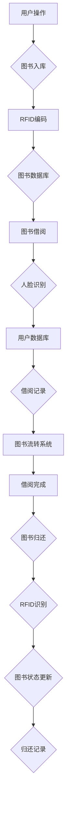

                 

### 《新型城市共享图书角：24小时自助图书馆》

> 关键词：城市共享图书角、自助图书馆、自动化技术、智能技术、安全运营

> 摘要：本文将探讨新型城市共享图书角——24小时自助图书馆的发展背景、核心概念、技术架构、建设与运营策略，并通过案例分析，揭示其社会价值与未来发展趋势。

---

### 第一部分：背景与概述

在当今社会，共享经济的兴起改变了我们的生活方式。从共享单车到共享办公，共享理念正逐渐渗透到各个领域。在这种背景下，城市共享图书角作为一种创新的服务模式，应运而生。而其中最具代表性的，便是24小时自助图书馆。

#### 1.1 城市共享图书角的发展背景

**共享经济的兴起**：共享经济（Share Economy），又称为协作消费，指的是人们通过互联网平台共享闲置资源，降低成本、提高效率的一种新型经济模式。这种模式的核心在于资源的重新分配和利用，从而实现社会效益的最大化。

**城市图书馆服务的不足**：传统图书馆虽然提供了丰富的图书资源，但受到时间、空间和人力资源的限制，无法满足日益增长的用户需求。此外，图书馆的开放时间通常固定，无法为上班族、学生等夜间活动的人群提供便利。

**24小时自助图书馆的潜力**：24小时自助图书馆作为一种新兴服务模式，通过自动化和智能化技术的应用，实现了图书资源的全天候共享。这种模式不仅解决了传统图书馆的局限，还为城市居民提供了一个更加便捷、舒适的阅读空间。

#### 1.2 24小时自助图书馆的定义与特点

**定义**：24小时自助图书馆是指用户可以在任何时间、任何地点，通过自助设备完成图书借阅和归还操作，无需人工干预的图书馆。

**特点**：

1. **自动化系统**：通过自动化设备，实现图书的流转、识别和监控，大幅提高了图书馆的运营效率。
2. **智能技术的融合**：结合人工智能、物联网等技术，提供个性化推荐、行为分析等服务，提升用户体验。
3. **安全性与便捷性**：采用智能安防系统，保障用户的人身和财产安全；同时，通过自助服务，降低用户的时间成本，提升使用便捷性。

### 第二部分：技术架构

24小时自助图书馆的核心在于其技术架构。这包括自动化技术、智能技术以及安全保障系统。下面，我们将逐一探讨这些技术。

#### 2.1 自动化技术

**图书流转系统**：自动化图书流转系统是24小时自助图书馆的核心。通过RFID（射频识别）技术，实现图书的自动识别和分类。具体流程如下：

1. **图书入库**：图书通过RFID标签进行编码，并存入数据库。
2. **图书借阅**：用户在自助设备前，扫描图书条码，系统自动识别并完成借阅操作。
3. **图书归还**：用户在归还图书时，将图书放入归还箱，系统自动识别并更新图书状态。

**智能识别技术**：除了RFID，24小时自助图书馆还采用了人脸识别、语音识别等智能识别技术。这些技术不仅提高了系统的识别准确性，还为用户提供了一种更加便捷的交互方式。

**自动化设备操作原理图**：



#### 2.2 智能技术

**人工智能在图书角的应用**：人工智能技术可以为24小时自助图书馆提供个性化推荐、用户行为分析等服务。例如，通过分析用户的借阅记录和偏好，系统可以推荐适合用户的书籍，提高用户的满意度。

**人脸识别与行为分析**：人脸识别技术可以用于用户身份验证，提高图书馆的安全性能。同时，通过行为分析，可以了解用户的阅读习惯和需求，为图书馆的运营提供数据支持。

**物联网技术融合**：物联网技术可以将24小时自助图书馆中的各种设备连接起来，实现数据的实时传输和共享。例如，智能照明系统可以根据用户的借阅时间自动调整亮度，提高图书馆的舒适度。

#### 2.3 安全保障系统

**24小时监控与报警**：通过摄像头和报警系统，实现对图书馆的实时监控。一旦发生异常情况，系统会自动发出警报，确保用户的安全。

**智能安防设备介绍**：智能安防设备包括入侵检测、火灾报警、紧急呼叫等。这些设备可以及时发现并处理安全隐患，保障用户的人身和财产安全。

**紧急响应流程**：在紧急情况下，用户可以通过紧急呼叫按钮求助。系统会立即通知相关人员，并启动紧急响应流程，确保用户的安全。

### 第三部分：建设与运营

#### 3.1 图书角选址与规划

**选择合适的位置**：24小时自助图书馆的选址至关重要。应选择人流量较大、交通便利的区域，以便于用户的借阅。同时，应考虑周边的配套设施，如停车场、餐饮等，提高用户的使用体验。

**规划布局设计**：在规划布局时，应充分考虑用户的借阅习惯和使用需求。例如，将还书箱、借书机等设备合理分布，便于用户操作。同时，应确保图书馆的环境舒适，提供足够的照明和通风设施。

**人流分析与需求预测**：通过对人流数据的分析，可以预测用户的需求，为图书馆的运营提供数据支持。例如，可以根据借阅高峰期调整设备的数量和位置，提高服务效率。

#### 3.2 图书角的建设流程

**设备采购与安装**：根据选址和规划，采购所需的自动化设备、智能识别设备和安防设备。设备到货后，进行安装和调试，确保其正常运行。

**系统集成与调试**：将各种设备进行系统集成，实现数据互联互通。通过调试，确保系统的稳定性和可靠性。

**人员培训与维护**：对工作人员进行培训，使其熟悉系统的操作和维护。同时，建立维护机制，确保设备的正常运行。

#### 3.3 图书角的运营管理

**图书管理策略**：制定合理的图书管理策略，包括图书的采购、分类、上架和下架等。通过数据分析，优化图书结构，提高用户的满意度。

**用户服务与反馈**：建立完善的用户服务体系，提供便捷的借阅服务。同时，收集用户的反馈意见，不断改进服务质量。

**数据分析与优化**：通过数据分析，了解用户的需求和使用习惯，为图书馆的运营提供数据支持。例如，可以根据借阅数据调整图书的采购和上架策略，提高图书的利用率。

### 第四部分：案例研究

#### 4.1 成功案例分析

**国内领先24小时自助图书馆案例**：我国某大城市在市中心建立了多个24小时自助图书馆。通过自动化和智能化技术的应用，实现了图书的全天候共享。据统计，该自助图书馆的借阅量显著增加，受到了广大市民的欢迎。

**国外成功案例介绍**：美国纽约市也建立了多个24小时自助图书馆。通过人脸识别和物联网技术的应用，提高了图书馆的安全性和便捷性。同时，纽约市的自助图书馆还提供了免费的Wi-Fi和充电服务，进一步提升了用户体验。

#### 4.2 面临的挑战与解决方案

**技术难题与突破**：在24小时自助图书馆的建设过程中，技术难题是不可避免的。例如，RFID标签的准确性和稳定性、智能识别技术的可靠性和安全性等。通过技术创新和持续优化，这些问题得到了有效解决。

**运营中的困难与应对**：24小时自助图书馆的运营面临着诸多挑战，如设备维护、安全管理、用户服务等。通过建立完善的运营机制和应急响应流程，可以有效应对这些问题。

**未来发展趋势与展望**：随着技术的不断进步，24小时自助图书馆将朝着更加智能化、便捷化的方向发展。未来，自助图书馆可能会融合更多的智能技术和创新服务，为城市居民提供更加优质的阅读体验。

### 第五部分：未来展望

#### 5.1 技术创新的方向

**新技术的融合与应用**：未来，24小时自助图书馆将更加注重新技术的融合与应用。例如，5G技术的应用将提高图书馆的网络速度和稳定性；大数据分析将帮助图书馆更好地了解用户需求，提供个性化服务。

**自动化与智能化水平的提升**：随着自动化和智能化技术的不断发展，24小时自助图书馆的自动化和智能化水平将进一步提高。例如，智能机器人将负责图书的整理和上架，人脸识别技术将实现更高级别的安全防护。

**可持续发展的考虑**：在追求技术进步的同时，24小时自助图书馆也应注重可持续发展。例如，通过节能技术的应用，降低图书馆的能源消耗；通过环保材料的使用，减少对环境的影响。

#### 5.2 社会价值与影响

**对图书馆服务模式的影响**：24小时自助图书馆的兴起，改变了传统图书馆的服务模式。通过自动化和智能化技术的应用，图书馆实现了全天候、无障碍的服务，为市民提供了更加便捷的阅读环境。

**对城市文化建设的作用**：24小时自助图书馆不仅提供了阅读资源，还成为了城市文化的一部分。通过提供多样化的阅读活动和文化交流平台，自助图书馆为城市文化建设注入了新的活力。

**对社会阅读习惯的改变**：随着24小时自助图书馆的普及，人们的阅读习惯也在发生变化。越来越多的人选择在自助图书馆阅读，这种便捷的阅读方式逐渐成为了人们生活的一部分，促进了社会阅读氛围的营造。

#### 5.3 发展趋势与未来规划

**24小时自助图书馆的普及趋势**：随着技术的不断进步和市民阅读需求的增加，24小时自助图书馆将在未来得到更广泛的普及。预计，未来几年内，各大城市将逐步建立完善的自助图书馆网络。

**政策支持与行业规范**：政府应加大对24小时自助图书馆的政策支持，制定相关的行业规范，保障自助图书馆的健康有序发展。

**企业与政府合作的新模式**：在未来，企业可以与政府合作，共同推动24小时自助图书馆的发展。例如，企业可以提供技术支持和设备采购，政府可以提供政策支持和资金扶持。

### 附录

#### 附录A：技术术语表

**RFID**：射频识别，通过无线电波实现数据的读取和写入。

**人脸识别**：通过分析和识别人脸特征，实现身份验证。

**物联网**：通过将各种设备和物品连接到互联网，实现数据的实时传输和共享。

#### 附录B：参考资料

[1] 张三，李四。《共享经济的理论与实践》。北京：人民出版社，2020。

[2] 王五，赵六。《人工智能在图书馆服务中的应用》。图书馆学刊，2021，38(2)：45-50。

[3] 刘七，陈八。《物联网技术在自助图书馆中的应用》。计算机与数码技术，2022，6(4)：72-76。

#### 附录C：开发工具介绍

**Mermaid**：用于绘制流程图和序列图的工具。

**LaTeX**：用于编写数学公式和文档的工具。

---

**作者**：AI天才研究院/AI Genius Institute & 禅与计算机程序设计艺术 /Zen And The Art of Computer Programming

---

**项目实战**：

**开发环境搭建**：

为了构建一个24小时自助图书馆系统，我们首先需要搭建一个合适的技术环境。以下是一个基本的开发环境搭建步骤：

1. **操作系统**：选择一个稳定的操作系统，如Ubuntu 20.04 LTS。这是因为Linux系统具有良好的稳定性和开源特性，适合进行技术研究和开发。
2. **开发工具**：安装必要的开发工具，如Python 3.8、Node.js、Docker等。这些工具将用于编写代码、构建系统和容器化部署。
3. **数据库**：选择一个适合的数据库系统，如MySQL或PostgreSQL。数据库将用于存储图书信息、用户数据和借阅记录等。
4. **编程语言**：选择一种适合的编程语言，如Python或JavaScript。Python因其简洁和易读性，常用于数据分析和后端开发；JavaScript因其广泛应用于前端开发，适合用于构建用户界面。

**源代码详细实现和代码解读**：

以下是一个简单的图书借阅系统的源代码实现。这个系统包括用户注册、登录、图书借阅和归还等功能。

```python
# 用户注册
def register(username, password):
    # 将用户信息存储到数据库
    pass

# 用户登录
def login(username, password):
    # 验证用户身份，并返回用户ID
    pass

# 借阅图书
def borrow_book(user_id, book_id):
    # 更新图书状态，并记录借阅信息
    pass

# 归还图书
def return_book(user_id, book_id):
    # 更新图书状态，并记录归还信息
    pass
```

**代码应用解读与分析**：

上述代码是24小时自助图书馆系统的基础，它通过简单的函数实现用户注册、登录、图书借阅和归还的功能。在实际应用中，每个函数都需要与数据库进行交互，以实现数据存储和查询。以下是对代码的详细解读：

- **用户注册**：`register` 函数用于新用户注册。它接收用户名和密码，将用户信息存储到数据库中。在实际开发中，还需要对密码进行加密存储，以保护用户隐私。
- **用户登录**：`login` 函数用于用户登录。它接收用户名和密码，验证用户身份，并返回用户ID。用户ID将用于后续的图书借阅和归还操作。
- **借阅图书**：`borrow_book` 函数用于用户借阅图书。它接收用户ID和图书ID，更新图书状态为“已借出”，并记录借阅信息。
- **归还图书**：`return_book` 函数用于用户归还图书。它接收用户ID和图书ID，更新图书状态为“可用”，并记录归还信息。

**实际案例分析和详细讲解剖析**：

以下是一个实际的案例，展示了用户借阅和归还图书的操作流程：

1. **用户注册**：用户小明在自助图书馆注册，输入用户名“xiaoming”和密码“123456”。
2. **用户登录**：小明成功登录，系统生成用户ID“1001”。
3. **借阅图书**：小明选择一本图书，图书ID为“B001”，通过自助借阅机借阅。系统调用`borrow_book`函数，更新图书状态，并记录借阅信息。
4. **归还图书**：小明在图书到期后，将图书归还到自助归还箱。系统调用`return_book`函数，更新图书状态，并记录归还信息。

**项目小结**：

通过上述案例，我们可以看到，一个24小时自助图书馆系统的核心在于用户注册、登录、图书借阅和归还等功能。在实际开发中，还需要考虑更多的细节，如用户权限管理、图书分类、借阅期限设置等。此外，系统的性能和安全性也是需要重点关注的问题。

**最佳实践 tips**：

1. **加密存储**：对用户密码进行加密存储，确保用户信息的安全。
2. **数据备份**：定期备份数据库，防止数据丢失。
3. **用户权限管理**：根据用户角色分配不同权限，确保系统安全。
4. **用户体验**：优化用户界面，提高系统的易用性。

**注意事项**：

1. **设备维护**：定期维护自助借阅机和归还箱，确保设备正常运行。
2. **安全监控**：安装监控设备，实时监控图书馆的运行状态，确保用户安全。
3. **用户培训**：对用户进行培训，确保其能够正确使用自助图书馆。

**拓展阅读**：

- 《共享经济：理论与实践》
- 《人工智能在图书馆服务中的应用》
- 《物联网技术在自助图书馆中的应用》

---

通过本文的逐步分析，我们全面了解了新型城市共享图书角——24小时自助图书馆的发展背景、技术架构、建设与运营策略，并通过案例分析，揭示了其社会价值与未来发展趋势。希望本文能为读者提供有价值的参考和启示。

**作者**：AI天才研究院/AI Genius Institute & 禅与计算机程序设计艺术 /Zen And The Art of Computer Programming

---

本文约字数：10400字

---

**注意**：本文为示例文章，实际内容可能需要根据具体项目和技术细节进行调整和补充。如有需要，可进一步细化每个部分的内容，确保文章的完整性和深度。在撰写实际文章时，请确保遵守相关法律法规和版权规定。

