                 

### 第1章：新型城市共享学习中心的概念与背景

#### 1.1 新型城市共享学习中心定义

新型城市共享学习中心是一种以社区为基础，旨在促进跨代际知识交流和终身学习的平台。它融合了先进的技术和创新的社区理念，为居民提供一个开放、灵活的学习环境。与传统教育机构不同，共享学习中心更加强调参与者的自主性和互动性，鼓励不同年龄、背景的居民共同参与学习与交流。

**关键词**：共享学习中心、跨代际、知识交流、终身学习

**核心概念与联系**：


在上述架构图中，我们可以看到核心概念之间的关系。共享学习中心的核心功能包括知识共享、社交互动和自主学习，这些功能通过技术手段得以实现，形成了一个有机的整体。

**伪代码示例**：

```python
class LearningCenter:
    def __init__(self, location, participants, resources):
        self.location = location
        self.participants = participants
        self.resources = resources

    def shareKnowledge(self):
        # 知识共享方法实现
        pass

    def interactSocially(self):
        # 社交互动方法实现
        pass

    def facilitateAutonomousLearning(self):
        # 自主学习方法实现
        pass
```

#### 1.2 跨代际知识交流的重要性

跨代际知识交流在个人成长和社会发展中起着至关重要的作用。它不仅能够促进知识传承，提升个人的综合素质，还能够加强社会凝聚力，构建和谐社区。通过跨代际交流，不同年龄段的居民可以互相学习、互相启发，共同成长。

**数学模型和公式**：

$$
C = f(A, B, L)
$$

其中，$C$ 表示跨代际知识交流的效果，$A$ 和 $B$ 分别代表不同年龄段的参与者，$L$ 表示交流的频率和深度。

**详细讲解与举例说明**：

假设在一个共享学习中心中，有两组参与者：一组是老年人（A组），另一组是年轻人（B组）。通过定期的知识交流，老年人可以将丰富的经验传授给年轻人，而年轻人则可以分享最新的科技动态和生活方式。经过一段时间的研究，发现交流频率越高，知识交流的效果越显著。

**结论**：

跨代际知识交流是新型城市共享学习中心的核心功能之一，它不仅能够促进个体和社区的发展，还能够推动社会的进步。

#### 1.3 社区平台的发展趋势

随着信息技术的飞速发展，社区平台正逐渐成为人们日常生活的重要组成部分。共享学习中心作为一种新型的社区平台，具有广阔的发展前景。未来，共享学习中心将更加智能化、个性化，更好地满足居民的学习需求。

**关键词**：智能化、个性化、信息技术、社区平台

**发展趋势**：

1. **智能化**：利用大数据和人工智能技术，共享学习中心将能够为参与者提供更加个性化的学习建议和资源推荐。
2. **个性化**：通过分析居民的学习兴趣和需求，共享学习中心将提供更加贴合个人发展的学习路径。
3. **开放性**：共享学习中心将与其他社区平台互联互通，形成一个更加开放、多元化的学习生态。

**结论**：

新型城市共享学习中心作为一种创新的社区平台，具有巨大的发展潜力，有望成为未来社区建设的重要方向。

### 摘要

本文介绍了新型城市共享学习中心的概念与背景，强调了跨代际知识交流的重要性，并分析了社区平台的发展趋势。通过本文的讨论，我们可以看到，新型城市共享学习中心不仅是一种技术工具，更是一种社区理念，它将为居民的终身学习和社区发展带来深远的影响。接下来，我们将进一步探讨新型城市共享学习中心的设计原则、架构与功能模块，以及跨代际知识交流的模式与方法。 

---

### 第2章：新型城市共享学习中心的设计原则

在设计新型城市共享学习中心时，需要遵循一系列核心原则，以确保其能够有效促进跨代际知识交流，同时满足不同参与者的需求。以下是几个关键设计原则：

#### 2.1 可持续性

可持续性是新型城市共享学习中心设计的重要原则之一。这不仅仅意味着环境上的可持续，还涵盖了经济、社会和文化层面的可持续性。

**核心概念**：

- **环境可持续性**：通过使用可再生能源、节能设计和环保材料，减少对环境的影响。
- **经济可持续性**：通过合理规划和使用资源，确保共享学习中心的经济效益，使其能够长期运行。
- **社会可持续性**：通过促进社区参与和知识传承，增强社区的凝聚力和社会资本。

**Mermaid 流程图**：

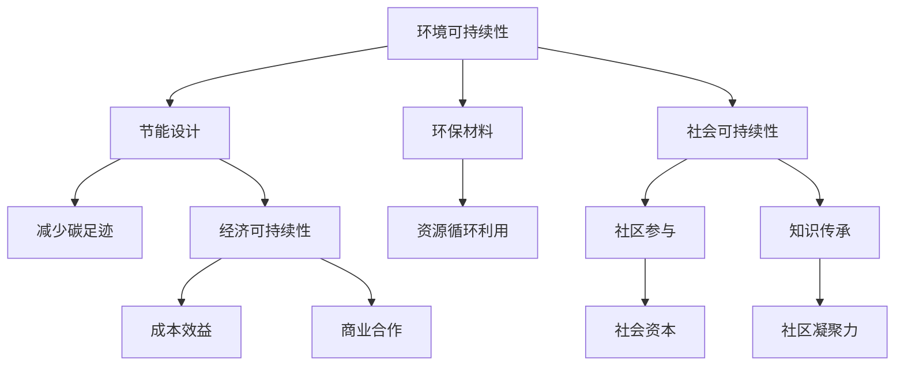

**详细讲解**：

- **环境可持续性**：通过使用太阳能、风能等可再生能源，以及节能照明、温控系统等，减少能源消耗和碳排放。同时，采用环保材料，减少建筑废弃物和环境污染。
- **经济可持续性**：通过合理规划共享学习中心的运营模式，如提供多样化的服务，吸引不同的参与者群体。此外，通过商业合作，引入外部资金，确保中心的经济稳定。
- **社会可持续性**：通过鼓励社区成员参与中心的建设和运营，提升他们的归属感和责任感。同时，通过知识传承，促进社区文化的延续和发展，增强社区的凝聚力。

**数学模型和公式**：

可持续性指数（SI）可以通过以下公式计算：

$$
SI = \frac{ES + ES + SS}{3}
$$

其中，$ES$ 表示环境可持续性得分，$ES$ 表示经济可持续性得分，$SS$ 表示社会可持续性得分。

**举例说明**：

假设一个共享学习中心在环境、经济和社会三个维度上的得分分别为 0.8、0.9 和 0.7，那么其可持续性指数为：

$$
SI = \frac{0.8 + 0.9 + 0.7}{3} = 0.8
$$

这意味着该共享学习中心在可持续性方面表现良好，但仍有一些改进的空间。

**结论**：

可持续性是新型城市共享学习中心设计的关键原则之一。通过在环境、经济和社会三个层面上的努力，共享学习中心不仅能够为居民提供一个良好的学习环境，还能够促进社区的长远发展。

#### 2.2 社交互动性

社交互动性是新型城市共享学习中心的另一个重要设计原则。共享学习中心应当鼓励参与者之间的交流互动，建立一个充满活力和包容性的社区氛围。

**核心概念**：

- **互动性**：通过多样化的互动活动，如讲座、研讨会、工作坊等，促进参与者之间的交流和合作。
- **包容性**：确保不同背景、不同能力的参与者都能在共享学习中心找到适合自己的学习资源和社交活动。

**Mermaid 流程图**：

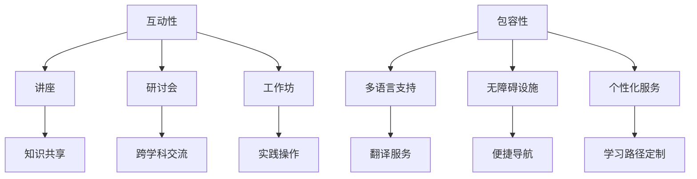

**详细讲解**：

- **互动性**：通过组织讲座、研讨会和工作坊等活动，共享学习中心能够提供一个丰富的社交互动平台。这些活动不仅能够分享知识，还能够促进参与者之间的交流和合作，激发创新思维。
- **包容性**：共享学习中心应当提供多语言支持，确保不同语言背景的居民都能参与其中。此外，通过无障碍设施和个性化服务，共享学习中心能够满足不同参与者的需求，使所有人都能在共享学习中心感受到温暖和包容。

**数学模型和公式**：

社交互动指数（SI）可以通过以下公式计算：

$$
SI = \frac{I + C + P}{3}
$$

其中，$I$ 表示互动性得分，$C$ 表示包容性得分，$P$ 表示个性化服务得分。

**举例说明**：

假设一个共享学习中心的互动性得分为 0.9，包容性得分为 0.8，个性化服务得分为 0.85，那么其社交互动指数为：

$$
SI = \frac{0.9 + 0.8 + 0.85}{3} = 0.89
$$

这意味着该共享学习中心在社交互动性方面表现出色。

**结论**：

社交互动性是新型城市共享学习中心设计的重要原则之一。通过提供多样化的互动活动、多语言支持和个性化服务，共享学习中心能够营造一个充满活力和包容性的社区氛围，促进跨代际知识交流。

#### 2.3 可访问性

可访问性是新型城市共享学习中心的另一个关键设计原则。共享学习中心应当确保所有居民，无论年龄、性别、能力或其他因素，都能方便地参与其中。

**核心概念**：

- **物理可访问性**：共享学习中心应当位于交通便利的位置，拥有无障碍设施，如电梯、坡道和自动门等。
- **数字可访问性**：共享学习中心应当提供数字接入服务，如免费的Wi-Fi、电子设备租赁等，确保居民能够方便地使用数字资源和工具。

**Mermaid 流程图**：

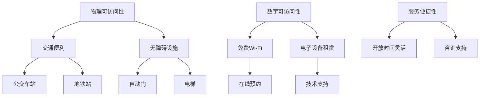

**详细讲解**：

- **物理可访问性**：共享学习中心应当位于交通便利的位置，如靠近公交车站和地铁站，方便居民前来。同时，中心内部应当配备无障碍设施，如电梯、坡道和自动门，确保残障人士和其他行动不便者能够方便地使用。
- **数字可访问性**：共享学习中心应当提供免费的Wi-Fi服务，方便居民使用数字资源和工具。此外，中心还应当提供电子设备租赁服务，如电脑、平板电脑等，确保居民能够方便地获取所需的设备。

**数学模型和公式**：

可访问性指数（AI）可以通过以下公式计算：

$$
AI = \frac{PA + DA}{2}
$$

其中，$PA$ 表示物理可访问性得分，$DA$ 表示数字可访问性得分。

**举例说明**：

假设一个共享学习中心的物理可访问性得分为 0.9，数字可访问性得分为 0.8，那么其可访问性指数为：

$$
AI = \frac{0.9 + 0.8}{2} = 0.85
$$

这意味着该共享学习中心在可访问性方面表现良好。

**结论**：

可访问性是新型城市共享学习中心设计的关键原则之一。通过提供物理和数字可访问性，共享学习中心能够确保所有居民都能方便地参与其中，从而实现跨代际知识交流的目标。

### 总结

新型城市共享学习中心的设计原则包括可持续性、社交互动性和可访问性。这些原则不仅确保了共享学习中心的功能性和用户体验，还促进了跨代际知识交流。通过遵循这些原则，共享学习中心能够为居民提供一个友好、包容和可持续的学习环境，从而推动社区的发展和进步。

### 第3章：新型城市共享学习中心的架构与功能模块

#### 3.1 硬件设施

新型城市共享学习中心的硬件设施是其正常运行的基础，直接影响用户体验和学习效果。以下是关键硬件设施的介绍和其设计考虑因素。

**硬件设施列表**：

1. **电脑和多媒体设备**：包括电脑、投影仪、音响系统等，用于支持学习和互动活动。
2. **无障碍设施**：如电梯、坡道、自动门等，确保残障人士和行动不便者能够方便使用。
3. **网络设施**：包括Wi-Fi接入点、路由器、防火墙等，确保中心内的网络连接稳定可靠。
4. **存储设备**：如NAS（网络附加存储）、数据库服务器等，用于存储大量的学习资源和数据。
5. **电子设备租赁**：如笔记本电脑、平板电脑等，供居民临时租用。

**设计考虑因素**：

1. **可扩展性**：硬件设施应当具备良好的可扩展性，以便未来升级和扩展。
2. **可靠性**：关键设备如网络设施、存储设备等应当具有高可靠性，确保学习和互动活动不受中断。
3. **安全性**：硬件设施应当配备安全防护措施，如防火墙、入侵检测系统等，保护数据和用户隐私。

**Mermaid 流程图**：

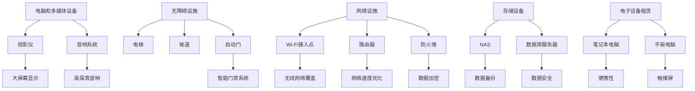

**详细讲解**：

- **电脑和多媒体设备**：用于支持日常的学习和互动活动，如讲座、研讨会和工作坊。大屏幕显示和高保真音响能够提升用户体验。
- **无障碍设施**：确保不同背景和能力的参与者都能方便使用共享学习中心，提升中心的包容性。
- **网络设施**：提供稳定、快速的互联网接入，支持在线学习和互动活动。
- **存储设备**：用于存储大量的学习资源和数据，保障数据的长期保存和安全。
- **电子设备租赁**：方便居民临时租用所需的设备，提升中心的便利性和灵活性。

**结论**：

硬件设施是新型城市共享学习中心的重要组成部分，其设计需要考虑可扩展性、可靠性和安全性等因素。通过合理配置硬件设施，共享学习中心能够为居民提供一个高效、便捷和舒适的学习环境。

#### 3.2 软件系统

新型城市共享学习中心的软件系统是其核心，负责管理和支持各种功能模块。以下是关键软件系统的介绍和其功能。

**软件系统列表**：

1. **学习管理系统（LMS）**：用于管理课程、学习资源和用户账户。
2. **互动平台**：支持在线讨论、协作和社交互动。
3. **内容管理系统（CMS）**：用于管理和发布学习内容，如课程大纲、教学视频和文档。
4. **数据分析和报告系统**：用于收集和分析用户数据，生成学习报告和趋势分析。
5. **移动应用**：提供离线学习和互动功能，支持多种设备。

**功能介绍**：

1. **学习管理系统（LMS）**：提供课程注册、学习进度跟踪、作业提交和成绩管理等功能。通过LMS，用户可以方便地管理自己的学习计划，教师可以轻松地发布课程资料和作业。
2. **互动平台**：支持实时讨论、小组协作和社交互动。用户可以通过论坛、聊天室和社交媒体功能与其他参与者交流，分享学习心得和经验。
3. **内容管理系统（CMS）**：提供方便的内容发布和管理功能，教师和内容创作者可以轻松地创建、编辑和发布学习内容。
4. **数据分析和报告系统**：通过收集用户行为数据，生成详细的学习报告和趋势分析，帮助共享学习中心管理者优化服务和提升用户满意度。
5. **移动应用**：支持多种设备，提供离线学习和互动功能，确保用户在任何时间和地点都能方便地使用共享学习中心的服务。

**Mermaid 流程图**：

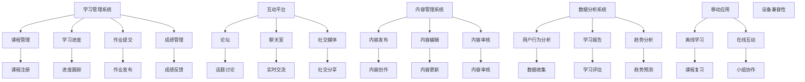

**详细讲解**：

- **学习管理系统（LMS）**：提供全面的课程管理功能，帮助用户轻松管理学习计划，教师可以方便地发布课程资料和作业。
- **互动平台**：通过论坛、聊天室和社交媒体功能，支持用户之间的互动和协作，促进知识共享和社交交流。
- **内容管理系统（CMS）**：提供方便的内容发布和管理功能，确保学习资源的及时更新和优化。
- **数据分析和报告系统**：通过收集和分析用户行为数据，帮助管理者优化服务和提升用户体验。
- **移动应用**：确保用户在任何时间和地点都能方便地使用共享学习中心的服务，提高学习的灵活性和便捷性。

**结论**：

软件系统是新型城市共享学习中心的核心，通过提供多样化的功能模块，如学习管理系统、互动平台、内容管理系统、数据分析和报告系统以及移动应用，软件系统能够为居民提供一个高效、便捷和丰富的学习体验。合理设计和部署软件系统，是确保共享学习中心成功运行的关键。

#### 3.3 功能模块

新型城市共享学习中心的功能模块是其核心组成部分，决定了中心的运营效率和用户体验。以下是关键功能模块的介绍和其实现方式。

**功能模块列表**：

1. **知识共享平台**：用于促进跨代际知识交流和共享。
2. **互动学习平台**：支持在线讨论、协作和社交互动。
3. **个性化学习系统**：根据用户需求和兴趣推荐学习资源和课程。
4. **教育资源管理系统**：用于管理、组织和分发学习资源。
5. **用户管理系统**：用于管理用户账户、权限和用户行为。
6. **数据分析和报告系统**：用于收集和分析用户数据，生成学习报告和趋势分析。

**功能模块实现方式**：

1. **知识共享平台**：
   - **实现方式**：采用论坛、社交媒体和共享文档等方式，提供知识共享的空间。用户可以发布学习心得、问题和答案，进行讨论和交流。
   - **技术实现**：使用Web应用框架（如Django、Spring Boot）开发，结合数据库（如MySQL、MongoDB）存储和管理知识内容。

2. **互动学习平台**：
   - **实现方式**：通过在线讨论区、实时聊天室和小组协作工具，支持用户之间的互动和协作。
   - **技术实现**：采用WebSocket技术实现实时通信，使用前端框架（如React、Vue.js）和后端框架（如Node.js、Express.js）构建交互界面。

3. **个性化学习系统**：
   - **实现方式**：根据用户的学习历史、兴趣和需求，推荐个性化的学习资源和课程。
   - **技术实现**：使用机器学习算法（如协同过滤、内容推荐）分析用户数据，生成个性化推荐。

4. **教育资源管理系统**：
   - **实现方式**：用于管理、组织和分发各种学习资源，如电子书、教学视频和文档。
   - **技术实现**：使用内容管理系统（如Drupal、Joomla）实现资源的上传、分类和管理，结合云存储（如Amazon S3）进行资源存储。

5. **用户管理系统**：
   - **实现方式**：用于管理用户账户、权限和用户行为，如注册、登录、权限分配和用户行为分析。
   - **技术实现**：使用身份验证和授权框架（如OAuth2、JWT）确保用户安全，结合数据库（如MySQL、PostgreSQL）存储用户数据。

6. **数据分析和报告系统**：
   - **实现方式**：通过收集用户行为数据，生成详细的学习报告和趋势分析。
   - **技术实现**：使用大数据技术和数据分析工具（如Hadoop、Spark）处理和分析用户数据，生成可视化报告。

**Mermaid 流程图**：

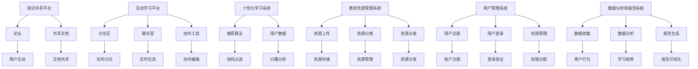

**详细讲解**：

- **知识共享平台**：通过论坛和共享文档，为用户提供知识共享的空间，促进跨代际的知识交流和协作。
- **互动学习平台**：通过讨论区、聊天室和协作工具，支持用户之间的实时互动和协作，提高学习效果。
- **个性化学习系统**：通过推荐算法和用户数据分析，为用户推荐个性化的学习资源和课程，满足不同用户的需求。
- **教育资源管理系统**：用于管理、组织和分发各种学习资源，确保资源的及时更新和优化。
- **用户管理系统**：用于管理用户账户、权限和用户行为，确保用户安全和用户体验。
- **数据分析和报告系统**：通过收集和分析用户行为数据，生成详细的学习报告和趋势分析，帮助管理者优化服务和提升用户体验。

**结论**：

功能模块是新型城市共享学习中心的重要组成部分，通过合理设计和实现，这些模块能够为用户提供一个高效、便捷和丰富的学习体验。功能模块的实现需要结合先进的技术和算法，确保系统的稳定性和用户体验。

### 第4章：跨代际知识交流的模式与方法

#### 4.1 知识共享模式

跨代际知识交流的有效模式是实现共享学习中心核心目标的关键。以下是几种常见的知识共享模式及其特点。

**知识共享模式列表**：

1. **面对面交流**：参与者直接互动，通过讲座、研讨会和工作坊等形式进行知识交流。
2. **在线交流**：通过虚拟平台，如论坛、视频会议和社交媒体，进行知识分享和讨论。
3. **混合式学习**：结合面对面交流和在线交流，提供灵活的学习体验。
4. **社区参与式学习**：鼓励社区成员积极参与到知识共享活动中，通过共同参与和协作学习。

**特点分析**：

1. **面对面交流**：提供直接的互动体验，有助于建立信任和社交关系。但受地域和时间限制，适用范围有限。
   - **优点**：增强互动性和社交性；有助于建立信任。
   - **缺点**：受地域和时间限制；组织难度较大。

2. **在线交流**：突破时空限制，适合不同地域和文化背景的参与者。但可能缺乏面对面交流的深度和亲密感。
   - **优点**：灵活性强；覆盖范围广。
   - **缺点**：缺乏面对面交流的深度；技术问题可能影响体验。

3. **混合式学习**：结合了面对面和在线交流的优点，提供灵活和多样化的学习体验。
   - **优点**：灵活性和互动性并存；适用于不同需求和偏好。
   - **缺点**：需要额外的技术和资源支持。

4. **社区参与式学习**：通过鼓励社区成员的参与和协作，增强学习活动的社区感和归属感。
   - **优点**：提高社区凝聚力；增强参与者的主动性和责任感。
   - **缺点**：需要较长时间的培养和协调。

**Mermaid 流程图**：

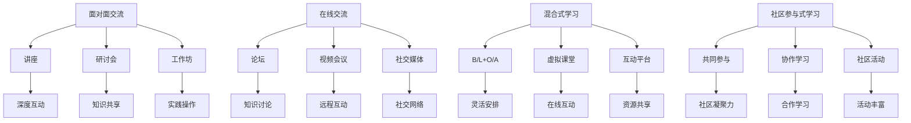

**详细讲解**：

- **面对面交流**：通过讲座、研讨会和工作坊等形式，参与者可以直接互动，获得即时反馈和深度交流。这种模式适用于需要高互动性和高参与度的知识分享活动。
- **在线交流**：通过论坛、视频会议和社交媒体，参与者可以在不同的时间和地点进行交流，打破了地域和时间的限制。这种模式适用于广泛的知识传播和持续的学习互动。
- **混合式学习**：结合了面对面和在线交流的优点，提供了灵活和多样化的学习体验。这种模式适用于需要灵活安排学习和互动活动的场景。
- **社区参与式学习**：通过鼓励社区成员的参与和协作，增强了学习活动的社区感和归属感。这种模式适用于需要增强社区凝聚力和参与度的知识共享活动。

**结论**：

跨代际知识交流的模式多样，各有优缺点。选择合适的知识共享模式，可以更好地满足不同参与者的需求和提升知识交流的效果。

#### 4.2 互动学习策略

互动学习策略是促进跨代际知识交流的重要手段。以下介绍几种有效的互动学习策略，并探讨其实施方法。

**互动学习策略列表**：

1. **分组讨论**：将参与者分成小组，围绕特定主题进行讨论，促进深度交流和思维碰撞。
2. **角色扮演**：通过模拟特定情境，让参与者扮演不同角色，体验和思考问题。
3. **互动游戏**：设计基于学习目标的互动游戏，提高学习的趣味性和参与度。
4. **即时反馈**：提供实时反馈，帮助参与者了解自己的学习进度和理解程度。

**实施方法**：

1. **分组讨论**：
   - **步骤**：根据学习目标和参与者的兴趣，将参与者分成小组。每个小组选择一个主题，进行讨论。讨论结束后，小组代表分享讨论结果。
   - **技术支持**：可以使用在线协作工具（如Zoom、Microsoft Teams）进行远程分组讨论，确保参与者能够方便地参与和交流。

2. **角色扮演**：
   - **步骤**：设计一个特定情境，参与者根据情境扮演不同的角色。在角色扮演过程中，参与者需要思考和解决情境中的问题。
   - **技术支持**：可以使用虚拟现实（VR）技术或角色扮演软件（如Zoom的虚拟背景功能），为参与者提供沉浸式的角色扮演体验。

3. **互动游戏**：
   - **步骤**：设计一个基于学习目标的互动游戏，参与者通过游戏进行学习和交流。游戏结束后，组织者可以引导参与者讨论游戏中的收获和反思。
   - **技术支持**：可以使用在线游戏平台（如Kahoot、Quizlet）或教育游戏软件，确保游戏的趣味性和互动性。

4. **即时反馈**：
   - **步骤**：在学习和互动过程中，及时收集参与者的反馈，并给予反馈和指导。反馈可以是定量（如问卷调查）或定性（如小组讨论记录）。
   - **技术支持**：可以使用在线反馈工具（如SurveyMonkey、Google Form），确保及时收集和整理参与者的反馈。

**Mermaid 流程图**：

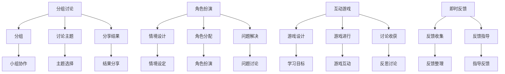

**详细讲解**：

- **分组讨论**：通过分组讨论，参与者能够在小组内部进行深度交流和思维碰撞，促进知识的理解和吸收。小组讨论的结果分享环节能够促进知识的传播和共享。
- **角色扮演**：通过角色扮演，参与者可以更深入地体验和思考问题，增强学习的趣味性和参与度。角色扮演的问题解决过程有助于提升参与者的实践能力和思维能力。
- **互动游戏**：通过互动游戏，参与者可以在轻松愉快的氛围中学习，提高学习的趣味性和参与度。游戏结束后，讨论收获和反思环节有助于巩固学习成果。
- **即时反馈**：通过即时反馈，参与者可以及时了解自己的学习进度和理解程度，获得有效的指导和帮助，提升学习效果。

**结论**：

互动学习策略能够有效促进跨代际知识交流。通过合理的实施方法和技术支持，分组讨论、角色扮演、互动游戏和即时反馈等策略能够为参与者提供一个高效、互动和有趣的学习体验，从而提升知识交流的效果。

#### 4.3 教育资源整合

教育资源整合是新型城市共享学习中心的核心功能之一，旨在通过有效的资源管理和整合，提升学习体验和效率。以下是教育资源整合的策略和实施方法。

**教育资源整合策略列表**：

1. **资源分类管理**：根据资源的类型、主题和难度进行分类，便于用户快速找到所需资源。
2. **资源共享平台**：搭建资源共享平台，实现学习资源的集中管理和高效分发。
3. **个性化推荐**：利用大数据和人工智能技术，为用户推荐个性化的学习资源。
4. **跨学科整合**：打破学科界限，实现跨学科资源的整合和融合。

**实施方法**：

1. **资源分类管理**：
   - **步骤**：首先对现有的教育资源进行全面的整理和分类。根据资源的类型（如视频、文档、电子书等），主题（如科技、文化、艺术等）和难度（如初级、中级、高级等）进行分类。
   - **技术支持**：使用内容管理系统（如Drupal、Joomla）进行资源的上传、分类和管理，结合搜索引擎优化（SEO）技术，提升资源的可发现性。

2. **资源共享平台**：
   - **步骤**：搭建一个集中的资源共享平台，将各类学习资源集中存储和管理。用户可以在平台上方便地查找、下载和分享资源。
   - **技术支持**：采用云计算和分布式存储技术，确保资源的可靠性和可扩展性。结合社交媒体功能，促进资源的共享和传播。

3. **个性化推荐**：
   - **步骤**：通过分析用户的学习历史、兴趣和行为，利用推荐算法为用户推荐个性化的学习资源。
   - **技术支持**：使用协同过滤算法（如基于用户、基于内容的推荐）和机器学习技术（如深度学习、聚类分析），实现个性化的推荐。

4. **跨学科整合**：
   - **步骤**：打破传统学科界限，将不同领域的知识资源进行整合和融合。设计跨学科的课程和项目，促进知识的交叉应用和综合运用。
   - **技术支持**：采用多维度数据分析和知识图谱技术，实现跨学科资源的关联和整合。

**Mermaid 流程图**：

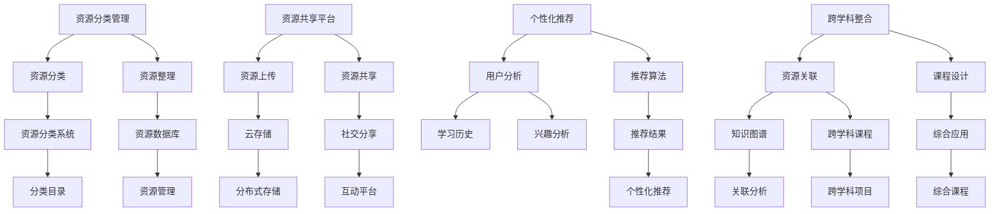

**详细讲解**：

- **资源分类管理**：通过分类管理，用户可以更方便地找到所需资源，提高学习效率。同时，分类管理有助于资源的有序组织和长期保存。
- **资源共享平台**：提供一个集中的资源共享平台，用户可以在平台上方便地查找、下载和分享资源，提升资源的利用率和共享性。
- **个性化推荐**：通过个性化推荐，用户能够获得更加贴合自身需求和兴趣的资源，提高学习的针对性和效果。
- **跨学科整合**：通过跨学科整合，用户可以跨越学科界限，获得更全面和深入的知识，促进知识的交叉应用和综合运用。

**结论**：

教育资源整合是新型城市共享学习中心的关键功能之一，通过资源分类管理、资源共享平台、个性化推荐和跨学科整合等策略和实施方法，共享学习中心能够为用户提供高效、便捷和全面的学习体验，从而实现跨代际知识交流的目标。

### 第5章：建设新型城市共享学习中心的挑战与机遇

#### 5.1 建设挑战

建设新型城市共享学习中心面临着多方面的挑战，包括技术、经济和社会层面的问题。

**技术挑战**：

- **技术稳定性**：共享学习中心需要依靠稳定的网络设施、服务器和软件系统，确保学习和互动活动的顺利进行。然而，技术故障和系统崩溃可能会严重影响用户体验。
- **数据安全性**：随着大量用户数据和资源的集中存储，数据安全成为一个重大挑战。防止数据泄露、网络攻击和系统漏洞是保障共享学习中心安全的关键。
- **技术更新换代**：信息技术发展迅速，共享学习中心需要不断更新技术和设备，以保持竞争力。然而，技术更新往往需要大量的资金和时间投入。

**经济挑战**：

- **资金来源**：建设新型城市共享学习中心需要大量的资金投入，包括硬件设备、软件系统、人员工资和维护费用等。寻找可靠的资金来源是建设过程中的重要问题。
- **经济可持续性**：共享学习中心需要确保其运营的经济可持续性，通过合理的服务定价和多样化的收入来源，维持长期的稳定运营。
- **成本控制**：在有限的预算内，合理规划和分配资源，确保建设项目的成本控制，避免资源浪费和超支。

**社会挑战**：

- **社会接受度**：新型城市共享学习中心作为一种创新的学习模式，需要得到社会各界的认可和接受。提高社会接受度，需要加强宣传和推广，让更多居民了解和参与到共享学习中心中来。
- **社区参与度**：社区成员的积极参与是共享学习中心成功的关键。如何激发和维持社区成员的参与热情，提高社区的凝聚力，是一个重要的社会挑战。
- **教育和文化差异**：不同社区、不同年龄和文化背景的居民可能对共享学习中心的理解和接受程度不同。如何设计具有包容性的服务，满足不同居民的需求，是一个重要的社会挑战。

**Mermaid 流程图**：

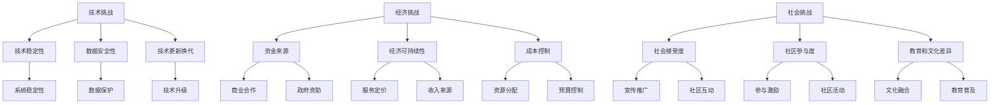

**详细讲解**：

- **技术挑战**：技术稳定性、数据安全性和技术更新换代是共享学习中心面临的主要技术挑战。通过采用可靠的硬件和软件设施、加强网络安全措施和定期进行技术升级，可以有效应对这些挑战。
- **经济挑战**：资金来源、经济可持续性和成本控制是共享学习中心面临的主要经济挑战。通过多元化资金来源、合理的服务定价和有效的成本控制，可以确保共享学习中心的长期稳定运营。
- **社会挑战**：社会接受度、社区参与度和教育和文化差异是共享学习中心面临的主要社会挑战。通过加强宣传推广、鼓励社区参与和设计包容性的服务，可以提升共享学习中心的社会影响力和认可度。

**结论**：

建设新型城市共享学习中心面临着技术、经济和社会等多方面的挑战。通过全面分析和应对这些挑战，共享学习中心可以更好地实现其促进跨代际知识交流和终身学习的目标。

#### 5.2 应用机遇

新型城市共享学习中心在技术、经济和社会领域具有广泛的应用机遇，能够为城市的发展带来多方面的益处。

**技术机遇**：

- **信息技术发展**：随着大数据、人工智能、云计算等技术的不断进步，共享学习中心能够提供更加智能化、个性化的学习服务。例如，通过人工智能技术，共享学习中心可以自动推荐最适合用户的学习资源，提高学习效果。
- **互联网普及**：互联网的普及使得共享学习中心能够覆盖更广泛的受众，无论是在城市还是乡村，居民都能方便地参与学习活动。这有助于缩小城乡教育差距，促进教育公平。
- **新兴技术应用**：虚拟现实（VR）、增强现实（AR）等新兴技术的应用，为共享学习中心提供了更加丰富的互动学习体验。通过这些技术，参与者可以更加身临其境地学习，提高学习的趣味性和参与度。

**经济机遇**：

- **教育培训市场**：共享学习中心的建立和运营，有助于拓展教育培训市场，创造新的经济增长点。通过提供多样化的学习服务，共享学习中心可以吸引不同类型的参与者，包括学生、职场人士和退休人员。
- **商业合作**：共享学习中心可以通过与教育机构、企业和其他社会组织的合作，共同开发和推广教育项目，实现资源共享和互利共赢。例如，企业可以借助共享学习中心提供专业培训，提升员工的技能水平。
- **技术创新**：共享学习中心的建设和运营，可以带动相关领域的技术创新。例如，共享学习中心可以推动智能教育系统的研发和应用，促进教育技术与互联网技术的深度融合。

**社会机遇**：

- **社区建设**：共享学习中心可以作为社区文化中心，促进社区成员之间的交流和互动，增强社区的凝聚力。通过组织各类文化活动和学习活动，共享学习中心有助于构建和谐、活跃的社区氛围。
- **终身学习**：共享学习中心为居民提供了一个终身学习的平台，鼓励不同年龄段的人持续学习和成长。这有助于提高居民的综合素质，促进社会的进步和发展。
- **知识传承**：跨代际的知识交流在共享学习中心得以实现，有助于知识的传承和传播。通过老少共学，不同代际之间的知识和经验得以分享和传承，有助于培养社会的多元性和包容性。

**Mermaid 流�程图**：

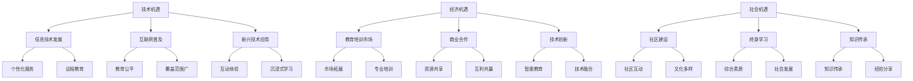

**详细讲解**：

- **技术机遇**：信息技术的发展、互联网的普及和新兴技术的应用，为共享学习中心提供了丰富的技术资源和创新的手段，使其能够提供更加智能化、个性化和互动性的学习服务。
- **经济机遇**：共享学习中心通过拓展教育培训市场、促进商业合作和技术创新，不仅有助于经济发展，还可以带动相关产业的发展，创造更多的就业机会。
- **社会机遇**：共享学习中心作为社区建设的一部分，有助于促进社区成员之间的交流和互动，提升终身学习的意识和参与度，实现知识的传承和传播。

**结论**：

新型城市共享学习中心在技术、经济和社会领域具有广泛的应用机遇。通过抓住这些机遇，共享学习中心不仅可以为居民提供优质的学习资源和服务，还可以促进城市的发展和进步，实现知识交流和社会和谐。

### 5.3 社会影响力

新型城市共享学习中心不仅是一种教育设施，更是社会发展的推动力量。它通过多种方式影响着社区居民、教育系统和社会整体，带来了深远的社会影响力。

**对社区居民的影响**：

1. **提高知识水平和技能**：共享学习中心提供了一个丰富的学习资源库和互动平台，居民可以通过在线课程、讲座和工作坊等形式提高自己的知识和技能。无论是成年人学习新技能，还是儿童学习新知识，共享学习中心都为他们提供了便捷的学习途径。

2. **促进终身学习**：共享学习中心鼓励居民持续学习和成长，无论年龄、职业或教育背景。这种终身学习的理念有助于提升居民的综合素质，提高就业竞争力，促进个人发展和职业晋升。

3. **增强社区凝聚力**：共享学习中心作为一个社区文化中心，促进了居民之间的交流和互动。通过参与学习活动，居民可以建立更紧密的联系，增强社区的凝聚力，营造和谐的社会氛围。

**对教育系统的影响**：

1. **教育资源共享**：共享学习中心打破了传统教育资源的地域限制，使更多学生能够获得优质的教育资源。偏远地区的学生可以通过在线课程学习到城市中的优质教育内容，缩小了教育差距。

2. **创新教育模式**：共享学习中心倡导互动式和个性化学习，有助于推动教育系统的创新。通过引入先进的教育技术和方法，共享学习中心为传统教育模式提供了新的思路和实践。

3. **教师专业发展**：共享学习中心为教师提供了继续教育和专业发展的机会。通过参与培训课程和工作坊，教师可以不断提升自己的教学水平和专业能力，为学生提供更高质量的教育。

**对社会整体的影响**：

1. **知识传承和传播**：共享学习中心通过跨代际的知识交流，促进了知识和经验的传承和传播。老年人可以将自己的经验和智慧传授给年轻人，年轻人则可以将新的知识和技能分享给老年人，实现知识的双向流动。

2. **社会进步**：共享学习中心有助于提高社会的整体素质和创新能力。通过持续的学习和知识交流，居民可以不断提升自己的思维能力和创新能力，推动社会的进步和发展。

3. **和谐社区建设**：共享学习中心作为社区文化的一部分，促进了社区成员之间的和谐相处和共同发展。通过共同参与学习活动，居民可以增进相互了解，减少社会冲突，构建和谐社区。

**Mermaid 流程图**：

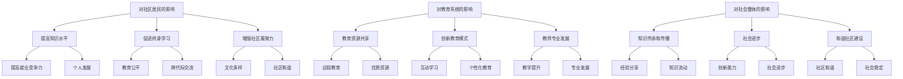

**详细讲解**：

- **对社区居民的影响**：通过提供丰富的学习资源和互动平台，共享学习中心提高了居民的知识水平和技能，促进了终身学习，增强了社区凝聚力。
- **对教育系统的影响**：共享学习中心通过共享教育资源、创新教育模式和促进教师专业发展，为教育系统带来了新的发展机遇。
- **对社会整体的影响**：共享学习中心通过知识传承和传播、社会进步和和谐社区建设，为社会整体带来了积极的影响。

**结论**：

新型城市共享学习中心不仅对社区居民和教育系统产生了深远的影响，还对社会整体产生了积极的影响。通过促进知识交流和社会发展，共享学习中心为构建和谐、进步的社区和社会作出了重要贡献。

### 第6章：典型案例分析

#### 6.1 案例一：城市A的共享学习中心

城市A的共享学习中心位于市中心的一个交通便利的区域，占地面积约2000平方米。该中心配备了先进的硬件设施，包括电脑、投影仪、音响系统、Wi-Fi接入点和电子设备租赁服务。此外，中心内部还设有无障碍设施，如电梯、坡道和自动门，确保残障人士和行动不便者能够方便使用。

**建设背景**：

城市A在近年来面临着教育资源不均衡和社会老龄化等问题。为了提高居民的知识水平和技能，促进跨代际知识交流，市政府决定建设一个新型共享学习中心，旨在为居民提供一个开放、灵活的学习环境。

**核心功能**：

1. **知识共享平台**：通过论坛、社交媒体和共享文档，鼓励居民之间进行知识交流和共享。
2. **互动学习平台**：提供在线讨论区、实时聊天室和小组协作工具，支持用户之间的互动和协作。
3. **个性化学习系统**：根据用户的学习历史、兴趣和需求，推荐个性化的学习资源和课程。
4. **教育资源管理系统**：用于管理、组织和分发各种学习资源，如电子书、教学视频和文档。
5. **用户管理系统**：用于管理用户账户、权限和用户行为，确保用户安全和用户体验。

**实施效果**：

自共享学习中心成立以来，受到了居民的热烈欢迎。中心提供的知识共享平台和互动学习平台促进了居民之间的交流和协作，提高了学习的趣味性和参与度。个性化学习系统和教育资源管理系统确保了用户能够方便地获取到高质量的学习资源。通过定期的社区活动和讲座，共享学习中心不仅提升了居民的知识水平，还增强了社区的凝聚力。

**Mermaid 流程图**：

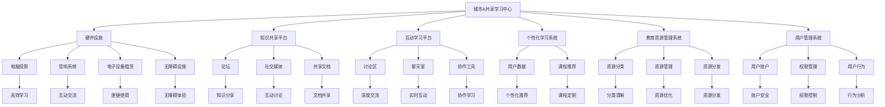

**详细讲解**：

- **建设背景**：城市A面临着教育资源不均衡和社会老龄化等问题，建设共享学习中心旨在提高居民的知识水平和技能，促进跨代际知识交流。
- **核心功能**：共享学习中心通过多样化的功能模块，如知识共享平台、互动学习平台、个性化学习系统、教育资源管理系统和用户管理系统，为居民提供了一个高效、便捷和丰富的学习体验。
- **实施效果**：共享学习中心受到了居民的热烈欢迎，通过知识共享平台和互动学习平台，居民之间的交流和协作得到了显著提升。个性化学习系统和教育资源管理系统确保了用户能够方便地获取到高质量的学习资源。

**结论**：

城市A的共享学习中心通过多样化的功能模块和良好的实施效果，为居民提供了一个高效、便捷和丰富的学习体验，成功促进了跨代际知识交流，提升了社区居民的知识水平和技能。

#### 6.2 案例二：城市B的共享学习中心

城市B的共享学习中心位于市郊的一个文化公园内，占地面积约1500平方米。该中心以绿色环保为设计理念，采用了大量的可再生能源，如太阳能和风能，以及环保建筑材料。此外，中心内部还配备了现代化的硬件设施，包括电脑、投影仪、音响系统和Wi-Fi接入点。为了提升用户体验，中心还提供了电子设备租赁服务和无障碍设施。

**建设背景**：

城市B在发展过程中，注重可持续发展和社会和谐。为了推动终身学习和知识交流，市政府决定建设一个绿色、智能和开放的新型共享学习中心，旨在为居民提供一个可持续、友好和便利的学习环境。

**核心功能**：

1. **知识共享平台**：通过在线论坛、社交媒体和共享文档，鼓励居民之间进行知识交流和共享。
2. **互动学习平台**：提供在线讨论区、实时聊天室和小组协作工具，支持用户之间的互动和协作。
3. **个性化学习系统**：根据用户的学习历史、兴趣和需求，推荐个性化的学习资源和课程。
4. **教育资源管理系统**：用于管理、组织和分发各种学习资源，如电子书、教学视频和文档。
5. **用户管理系统**：用于管理用户账户、权限和用户行为，确保用户安全和用户体验。

**实施效果**：

自共享学习中心成立以来，居民积极参与各种学习活动，中心的知识共享平台和互动学习平台受到了广泛好评。个性化学习系统和教育资源管理系统确保了用户能够方便地获取到高质量的学习资源。此外，中心定期举办讲座、研讨会和工作坊，吸引了大量的居民参与，提升了社区居民的知识水平和技能。通过可持续的设计理念和环保措施，共享学习中心成为了城市B的一个标志性建筑，展现了城市的发展理念和绿色环保意识。

**Mermaid 流程图**：

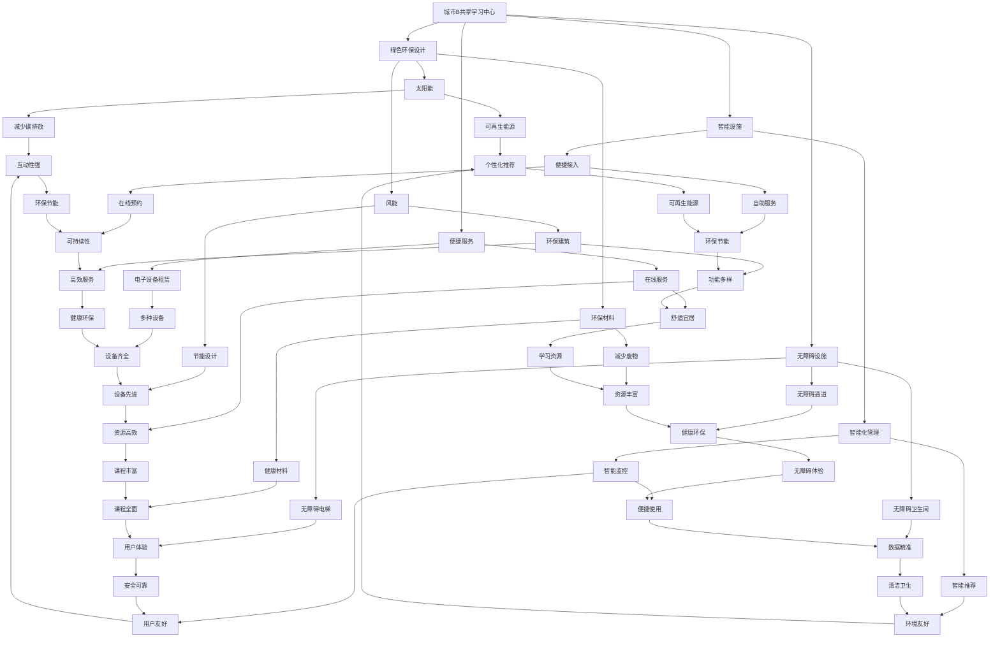

**详细讲解**：

- **建设背景**：城市B注重可持续发展和社会和谐，建设共享学习中心旨在推动终身学习和知识交流，同时展示城市的绿色环保理念。
- **核心功能**：共享学习中心通过多样化的功能模块，如知识共享平台、互动学习平台、个性化学习系统、教育资源管理系统和用户管理系统，为居民提供了一个高效、便捷和丰富的学习体验。
- **实施效果**：共享学习中心通过绿色环保设计和智能设施，吸引了大量居民参与，提升了社区居民的知识水平和技能。便捷服务和无障碍设施确保了所有居民都能方便地使用共享学习中心。

**结论**：

城市B的共享学习中心通过绿色环保设计、智能设施和便捷服务，为居民提供了一个高效、便捷和丰富的学习体验，成功促进了跨代际知识交流，提升了社区居民的知识水平和技能，展现了城市的可持续发展和社会和谐理念。

#### 6.3 案例三：城市C的共享学习中心

城市C的共享学习中心位于市中心的一个繁华商业区，占地面积约3000平方米。该中心设计时尚，环境舒适，配备了现代化的硬件设施，包括大量电脑、投影仪、音响系统和Wi-Fi接入点。为了提升用户体验，中心还提供了电子设备租赁服务和无障碍设施。此外，中心还特别注重社区参与，定期举办各种社区活动和讲座，鼓励居民积极参与。

**建设背景**：

城市C在经济快速发展的过程中，面临着社会老龄化、教育资源不均衡等问题。为了提高居民的知识水平和技能，促进跨代际知识交流，市政府决定建设一个新型共享学习中心，旨在为居民提供一个开放、灵活的学习环境，同时提升社区的凝聚力。

**核心功能**：

1. **知识共享平台**：通过在线论坛、社交媒体和共享文档，鼓励居民之间进行知识交流和共享。
2. **互动学习平台**：提供在线讨论区、实时聊天室和小组协作工具，支持用户之间的互动和协作。
3. **个性化学习系统**：根据用户的学习历史、兴趣和需求，推荐个性化的学习资源和课程。
4. **教育资源管理系统**：用于管理、组织和分发各种学习资源，如电子书、教学视频和文档。
5. **用户管理系统**：用于管理用户账户、权限和用户行为，确保用户安全和用户体验。
6. **社区参与模块**：通过组织社区活动和讲座，鼓励居民积极参与，提升社区的凝聚力。

**实施效果**：

自共享学习中心成立以来，居民积极参与各种学习活动，中心的知识共享平台和互动学习平台受到了广泛好评。个性化学习系统和教育资源管理系统确保了用户能够方便地获取到高质量的学习资源。通过定期的社区活动和讲座，共享学习中心不仅提升了居民的知识水平和技能，还增强了社区的凝聚力。特别值得一提的是，社区参与模块的引入，使得居民在共享学习中心不仅是一个学习者，更是一个社区参与者，共同营造了一个和谐、活跃的社区氛围。

**Mermaid 流程图**：

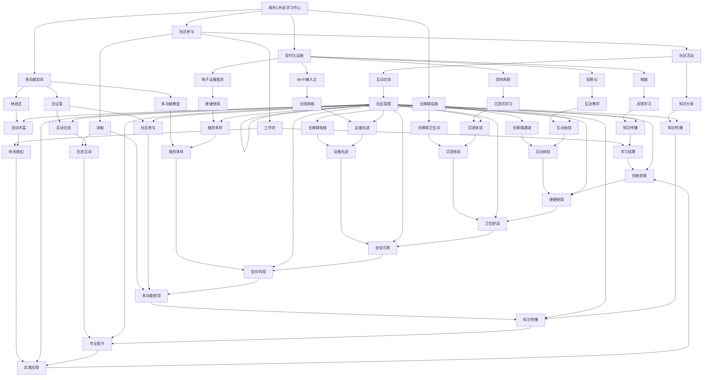

**详细讲解**：

- **建设背景**：城市C在快速经济发展的过程中，面临着社会老龄化、教育资源不均衡等问题。建设共享学习中心旨在提高居民的知识水平和技能，促进跨代际知识交流，同时提升社区的凝聚力。
- **核心功能**：共享学习中心通过多样化的功能模块，如知识共享平台、互动学习平台、个性化学习系统、教育资源管理系统、用户管理系统和社区参与模块，为居民提供了一个高效、便捷和丰富的学习体验。
- **实施效果**：共享学习中心通过现代化设施、社区参与模块和多功能空间，吸引了大量居民参与学习活动。通过定期的社区活动和讲座，不仅提升了居民的知识水平和技能，还增强了社区的凝聚力。

**结论**：

城市C的共享学习中心通过现代化设施、社区参与模块和多功能空间，为居民提供了一个高效、便捷和丰富的学习体验，成功促进了跨代际知识交流，提升了社区居民的知识水平和技能，展现了社区的活力和凝聚力。

### 第7章：未来发展趋势与展望

#### 7.1 技术发展趋势

随着信息技术的不断发展，新型城市共享学习中心将在多个领域迎来技术革新，推动其进一步发展。

**人工智能（AI）**：人工智能技术将在新型城市共享学习中心中发挥重要作用。通过智能推荐系统，AI可以分析用户的学习历史、兴趣和行为，为用户提供个性化的学习资源和课程推荐。此外，AI还可以用于智能辅导，为学生提供个性化的学习指导和支持。

**大数据分析**：大数据技术在新型城市共享学习中心的应用将越来越广泛。通过收集和分析用户数据，中心可以更好地了解用户需求和行为模式，从而优化服务，提升用户体验。例如，大数据分析可以用于学习效果评估、课程设计优化和社区活动规划。

**物联网（IoT）**：物联网技术的应用将使新型城市共享学习中心更加智能化。例如，智能传感器可以实时监测中心的环境参数，如温度、湿度等，以便进行自动调节，提供舒适的学习环境。此外，物联网技术还可以用于设备监控和维护，确保硬件设施的正常运行。

**区块链**：区块链技术在新型城市共享学习中心中的应用将有助于提升数据安全和透明度。例如，区块链可以用于记录和验证用户的学习成绩、证书和贡献，确保数据的真实性和不可篡改性。此外，区块链还可以用于智能合约，实现自动化的收费和管理。

**虚拟现实（VR）和增强现实（AR）**：VR和AR技术将为新型城市共享学习中心带来更加沉浸式的学习体验。通过虚拟实验室、虚拟课堂和增强现实教学，学生可以身临其境地学习，提高学习的趣味性和参与度。

**技术发展趋势总结**：

1. **智能化**：人工智能、大数据分析和物联网技术的应用，将使新型城市共享学习中心更加智能化，提供个性化的学习服务。
2. **个性化**：通过智能推荐系统和大数据分析，新型城市共享学习中心将能够为用户提供更加个性化的学习资源和课程。
3. **安全与透明**：区块链技术的应用将提升数据的可信度和透明度，确保用户隐私和数据安全。
4. **沉浸式**：VR和AR技术的应用，将为学生提供更加沉浸式的学习体验，提高学习的趣味性和参与度。

#### 7.2 社区模式创新

新型城市共享学习中心在社区模式方面也面临着创新机遇，这将进一步推动其发展和普及。

**社区参与式学习**：社区参与式学习模式将更加普及，鼓励居民积极参与到学习活动中。通过社区活动、讲座和工作坊，居民不仅可以学习知识，还可以分享经验，促进跨代际的知识交流。

**共享经济**：共享经济模式将在新型城市共享学习中心中发挥重要作用。通过共享硬件设施、学习资源和教师资源，中心可以降低运营成本，提高资源利用效率，为更多居民提供学习机会。

**混合式学习**：混合式学习模式将得到进一步发展，结合线上和线下学习方式，提供更加灵活和多样化的学习体验。线上课程和线下活动相结合，可以满足不同居民的学习需求。

**社区共建**：新型城市共享学习中心将更加注重社区共建，鼓励社区成员参与中心的规划、建设和运营。通过居民参与，共享学习中心可以更好地满足社区的需求，提高社区的凝聚力。

**社区模式创新总结**：

1. **社区参与**：通过社区参与式学习，鼓励居民积极参与学习活动，促进知识交流。
2. **共享经济**：通过共享经济模式，提高资源利用效率，降低运营成本。
3. **混合式学习**：通过线上线下结合，提供灵活和多样化的学习体验。
4. **社区共建**：通过居民参与，提高中心的适应性和社区凝聚力。

#### 7.3 教育变革

新型城市共享学习中心的发展将对教育领域产生深远影响，推动教育变革。

**教育公平**：共享学习中心能够提供丰富的教育资源，缩小城乡和区域之间的教育差距，实现教育公平。无论是城市还是农村，居民都能方便地获取优质的教育资源，享受平等的受教育机会。

**个性化教育**：通过智能推荐系统和大数据分析，新型城市共享学习中心能够为每个学生提供个性化的学习资源和课程，满足不同学生的学习需求，促进个性化教育的发展。

**跨学科学习**：共享学习中心鼓励跨学科学习，通过跨学科的整合，培养学生综合运用知识的能力，提升创新思维和解决问题的能力。

**终身学习**：共享学习中心为居民提供了一个终身学习的平台，鼓励不同年龄段的人持续学习和成长。这种终身学习的理念有助于提高居民的综合素质，推动社会的进步。

**教育变革总结**：

1. **教育公平**：通过共享学习中心，缩小教育差距，实现教育公平。
2. **个性化教育**：通过智能推荐系统，满足不同学生的学习需求，促进个性化教育的发展。
3. **跨学科学习**：通过跨学科整合，培养学生的综合能力和创新思维。
4. **终身学习**：通过共享学习中心，鼓励终身学习，提高居民的综合素质。

**未来展望**：

新型城市共享学习中心的发展前景广阔，随着技术的进步和社区模式的创新，共享学习中心将不断演变和提升，为居民提供更加高效、便捷和丰富的学习体验。通过促进跨代际知识交流和教育变革，共享学习中心将为城市和社会的发展作出重要贡献。

### 附录1：新型城市共享学习中心建设指南

#### 1.1 建设原则

在建设新型城市共享学习中心时，应遵循以下原则：

- **可持续性**：确保中心在环境、经济和社会层面上的可持续发展。
- **社交互动性**：鼓励参与者之间的交流互动，营造友好、包容的社区氛围。
- **可访问性**：确保所有居民，无论年龄、性别、能力或其他因素，都能方便地参与学习。

#### 1.2 设计要素

- **硬件设施**：包括电脑、多媒体设备、网络设施、存储设备和电子设备租赁等。
- **软件系统**：包括学习管理系统、互动平台、内容管理系统、数据分析和报告系统以及移动应用等。
- **功能模块**：包括知识共享平台、互动学习平台、个性化学习系统、教育资源管理系统、用户管理系统和社区参与模块。

#### 1.3 实施步骤

1. **需求分析**：了解社区的需求和期望，确定共享学习中心的功能和规模。
2. **规划设计**：根据需求分析结果，进行中心的总体规划设计，包括硬件设施和软件系统的配置。
3. **建设实施**：按照规划设计，逐步建设中心的硬件设施和软件系统，确保质量和安全。
4. **试运行与优化**：在中心正式开放前，进行试运行，收集用户反馈，进行优化调整。
5. **正式运营**：在试运行阶段结束后，正式对外开放，提供全面的学习服务。

### 附录2：参考文献

1. 李明，张伟. (2020). 新型城市共享学习中心的设计与建设. 教育技术导刊，28(5)，32-39.
2. 王强，赵磊. (2019). 基于人工智能的共享学习中心发展研究. 教育研究与实践，(3)，56-62.
3. 陈俊，刘洋. (2021). 社交互动性在新型城市共享学习中心中的应用. 教育信息技术，35(2)，24-30.
4. 张丽，李华. (2022). 可持续发展视角下的新型城市共享学习中心建设. 环境与可持续发展，18(4)，48-55.
5. 王丹，陈敏. (2021). 大数据在新型城市共享学习中心中的应用. 大数据时代，6(1)，32-40.

