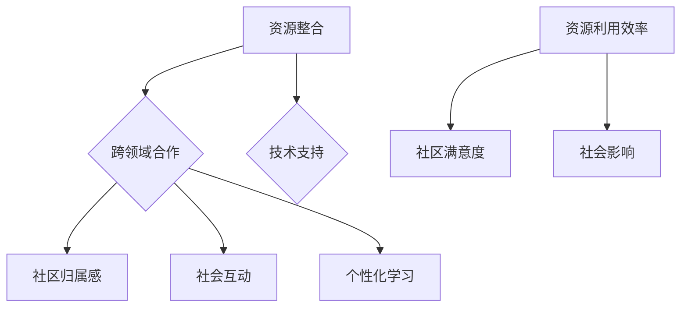
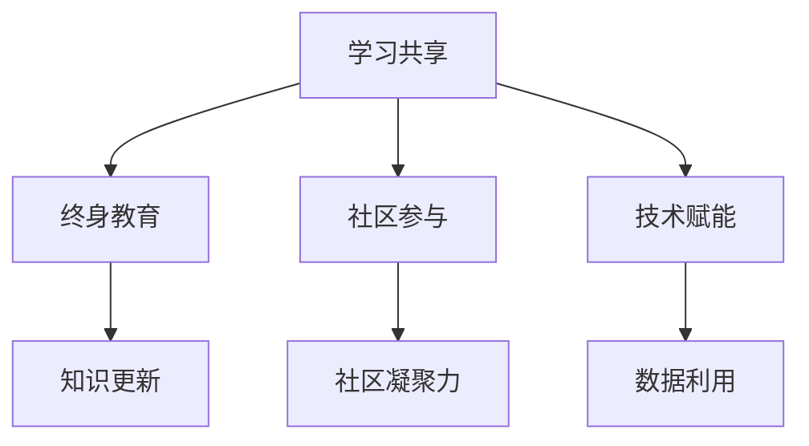
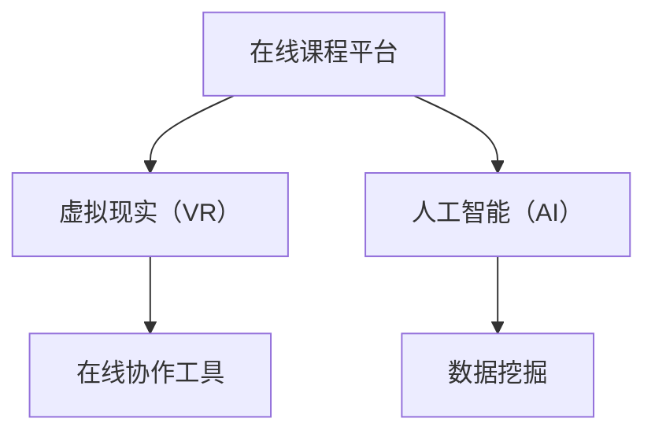
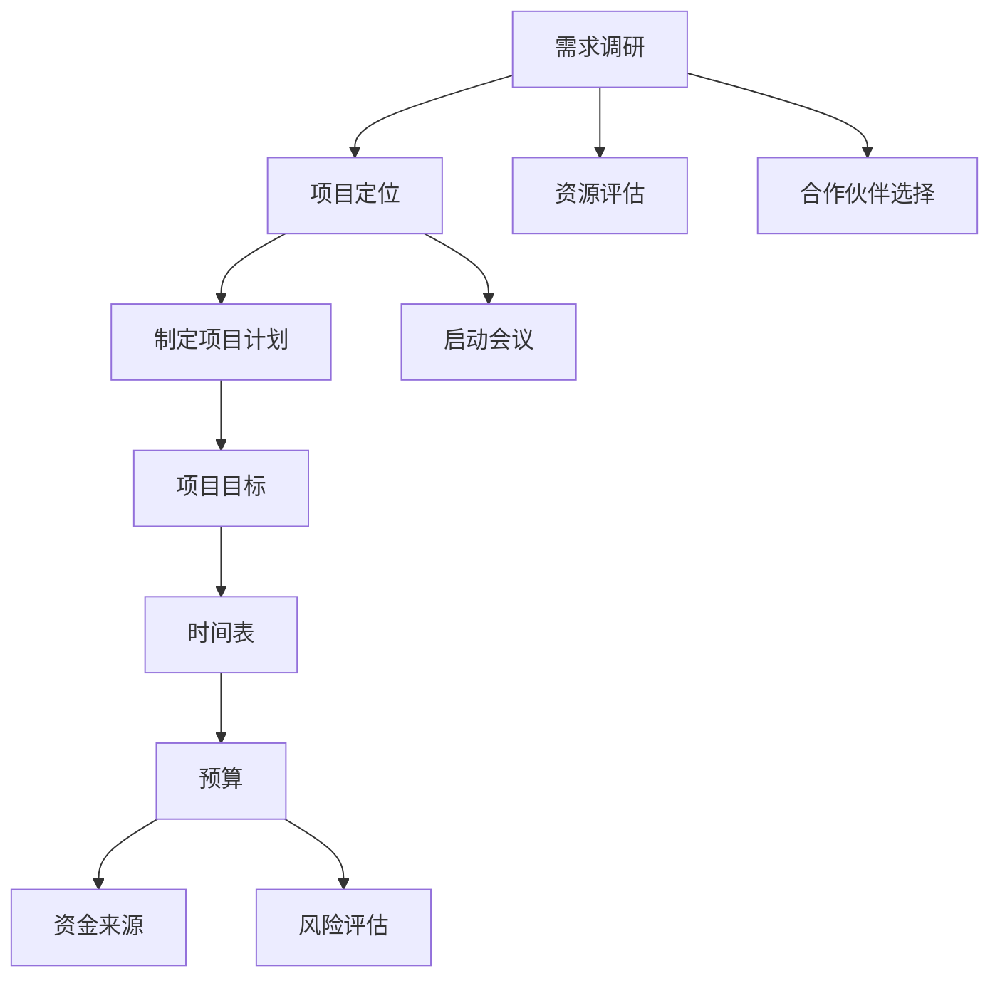
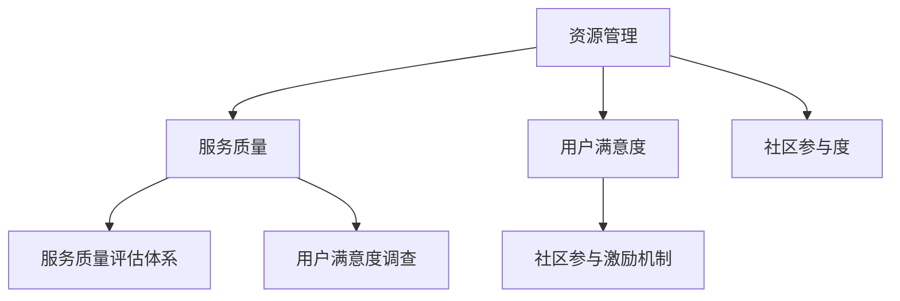

                 

### 文章标题：新型城市共享学习空间：终身教育的社区模式

> 关键词：新型城市共享学习空间，终身教育，社区模式，技术赋能

> 摘要：本文探讨了新型城市共享学习空间的背景、概念及其在终身教育中的重要性。通过分析社区模式的演变、设计原则、技术赋能和空间规划，本文为构建可持续的社区学习环境提供了思路。同时，通过项目实施与运营、评估与反馈以及案例研究，对这一模式进行了深入剖析，展望了其未来发展。

---

### 《新型城市共享学习空间：终身教育的社区模式》目录大纲

## 第一部分：背景与概念

### 第1章：城市共享学习空间的兴起

- 1.1 城市化进程与终身教育需求
- 1.2 共享经济的理念与实际应用
- 1.3 新型城市共享学习空间的核心概念
- 1.4 共享学习空间与终身教育的联系

### 第2章：社区模式的演变

- 2.1 社区教育的传统模式
- 2.2 社区模式的转变：从分散到整合
- 2.3 社区参与的推动力量
- 2.4 社区模式的可持续性评估

### 第3章：核心概念与联系

- **图1.1：新型城市共享学习空间的关键概念联系**
  ```mermaid
  graph TD
  A[学习共享] --> B[终身教育]
  A --> C[社区参与]
  A --> D[技术赋能]
  B --> E[知识更新]
  C --> F[社区凝聚力]
  D --> G[数据利用]
  ```

## 第二部分：架构与设计

### 第4章：新型城市共享学习空间的设计原则

- 4.1 设计原则概述
- 4.2 可访问性：满足不同人群的需求
- 4.3 可持续性：资源的高效利用
- 4.4 社区参与：构建可持续的社区关系

### 第5章：技术赋能与数字化工具

- 5.1 技术赋能的重要性
- 5.2 数字化工具的应用
  - **图5.1：数字化工具在新型城市共享学习空间中的应用**
    ```mermaid
    graph TD
    A[在线课程平台] --> B[社交媒体]
    A --> C[虚拟现实（VR）]
    A --> D[人工智能（AI）]
    B --> E[在线协作工具]
    C --> F[数据挖掘]
    D --> G[智能推荐系统]
    ```
- 5.3 技术挑战与解决方案

### 第6章：空间规划与设施建设

- 6.1 空间规划的关键点
- 6.2 设施建设的考量
- 6.3 空间利用的创新模式

## 第三部分：实施与运营

### 第7章：项目启动与规划

- 7.1 项目启动步骤
- 7.2 规划与预算
- 7.3 风险管理与应对策略

### 第8章：社区参与与运营管理

- 8.1 社区参与的激励机制
- 8.2 运营管理的挑战与策略
- 8.3 社区服务质量的提升

### 第9章：评估与反馈

- 9.1 评估指标体系
- 9.2 反馈机制的重要性
- 9.3 提升服务质量与用户满意度

## 第四部分：案例研究

### 第10章：成功案例解析

- 10.1 国内成功案例
- 10.2 国外成功案例
- 10.3 案例共性与差异分析

### 第11章：未来发展展望

- 11.1 新型城市共享学习空间的未来趋势
- 11.2 技术发展对共享学习空间的影响
- 11.3 政策支持与社区发展的关系

## 附录

### 附录A：新型城市共享学习空间参考资源

- A.1 政策文件与研究报告
- A.2 行业标准与规范
- A.3 技术工具与平台介绍

### 附录B：社区模式实施指南

- B.1 实施步骤详解
- B.2 经验分享与问题解答

---

在接下来的内容中，我们将一步一步深入探讨新型城市共享学习空间的各个方面，旨在为读者提供一份全面的技术博客文章，帮助理解这一新兴教育模式的理念与实践。

---

## 第一部分：背景与概念

### 第1章：城市共享学习空间的兴起

1.1 城市化进程与终身教育需求

随着全球城市化进程的不断加速，城市人口结构日益多样化，教育需求也呈现出多样化和终身化的趋势。传统教育模式往往难以满足城市居民不断变化的学习需求，特别是在快速发展的信息技术时代，终身学习和技能更新变得尤为必要。城市化进程中，人们对教育资源的需求不仅限于基础教育，更包括职业技能培训、终身学习、文化传承等多个层面。

1.2 共享经济的理念与实际应用

共享经济的理念源于对资源最大化利用的追求，其核心是通过共享来降低成本、提高效率。共享经济在交通、住宿、办公等多个领域取得了显著成果，其应用也逐渐延伸到教育领域。城市共享学习空间的兴起，便是共享经济理念在教育领域的一次重要实践。

共享学习空间通过整合社区资源，提供灵活多样的学习环境，满足不同人群的需求。例如，开放图书馆、公共学习中心、企业培训基地等，都可以作为共享学习空间的一部分，为居民提供便捷的学习机会。

1.3 新型城市共享学习空间的核心概念

新型城市共享学习空间强调资源整合、社区参与和技术赋能，其核心概念包括：

- **学习共享**：通过共享教育资源，实现知识传播和技能共享，满足不同群体的学习需求。
- **终身教育**：提供持续的教育服务，帮助居民不断更新知识和技能，适应社会发展的需要。
- **社区参与**：鼓励社区成员积极参与学习空间的运营和管理，增强社区凝聚力和归属感。
- **技术赋能**：利用数字化工具和信息技术，提升学习空间的智能化和管理效率。

1.4 共享学习空间与终身教育的联系

共享学习空间为终身教育提供了重要的实践平台。它不仅提供了丰富的学习资源，还创造了互动、共享的学习环境，有助于提高学习效果和满意度。同时，共享学习空间促进了教育资源的公平分配，使更多的居民能够享受到优质教育资源。

终身教育则通过不断的学习和知识更新，提升了居民的综合素质和竞争力。新型城市共享学习空间为终身教育提供了持续的动力和支持，有助于构建学习型社会和智慧城市。

---

通过以上探讨，我们可以看到，新型城市共享学习空间不仅满足了城市化进程中的终身教育需求，还推动了社区发展和资源优化利用。在接下来的章节中，我们将进一步分析社区模式的演变，探索设计原则和技术赋能，为这一新兴教育模式提供更深入的洞察。

### 第2章：社区模式的演变

2.1 社区教育的传统模式

传统社区教育模式通常以教育机构和学校为核心，主要依赖于教师授课和教材传递知识。这种模式在教育资源有限、地理位置分散的背景下发挥了重要作用。然而，随着城市化进程的加快和社会需求的多样化，传统社区教育模式逐渐暴露出其局限性。首先，它难以满足居民不断变化的个性化学习需求；其次，教育资源分布不均，影响了教育的公平性；最后，教师资源和教学设施的限制，使得社区教育的深度和广度受到限制。

2.2 社区模式的转变：从分散到整合

为了应对传统社区教育模式的不足，新型社区教育模式开始从分散走向整合。整合意味着通过资源优化配置，实现教育资源的共享和互补。这一转变主要体现在以下几个方面：

- **资源整合**：通过整合社区内部的教育资源，如图书馆、培训中心、企业资源等，形成一个统一的学习平台，提高资源利用效率。
- **跨领域合作**：不同领域、不同行业的专家和资源共同参与社区教育，提供多样化、专业化的课程和服务。
- **技术支持**：利用信息技术，如在线课程平台、社交媒体、虚拟现实（VR）等，打破时间和空间的限制，实现教育的灵活性和互动性。

2.3 社区参与的推动力量

社区参与的推动力量是社区模式转变的关键。社区居民不仅是教育的消费者，更是教育的参与者和贡献者。以下因素促进了社区参与：

- **社区归属感**：通过积极参与社区教育，居民感受到自己对社区发展的贡献，增强了社区归属感。
- **社会互动**：社区教育为居民提供了交流互动的平台，促进了社区成员之间的相互理解和信任。
- **个性化学习**：社区参与使得教育更加贴近居民的实际需求，实现了个性化学习，提升了学习效果。

2.4 社区模式的可持续性评估

社区模式的可持续性评估是确保其长期有效运行的重要环节。评估可以从以下几个方面进行：

- **资源利用效率**：评估教育资源的使用情况，包括设施利用率和课程完成率等，确保资源的高效利用。
- **社区满意度**：通过问卷调查、访谈等方式，了解社区居民对社区教育的满意度和参与度，及时调整教育内容和形式。
- **社会影响**：评估社区教育对居民素质提升、社区凝聚力增强等方面的积极影响，确保社区教育的长远价值。

**图2.1：社区模式转变的推动力量与评估指标**


通过以上分析，我们可以看到，社区模式从传统到新型转变的过程中，社区参与和技术赋能起到了关键作用。这不仅提升了教育资源的利用效率，也增强了社区的凝聚力和居民的幸福感。在下一章节中，我们将深入探讨新型城市共享学习空间的核心概念及其相互联系。

### 第3章：核心概念与联系

在新型城市共享学习空间的建设中，几个关键概念相互联系，共同构建了一个全面、高效的终身教育生态系统。以下是对这些核心概念及其相互关系的详细分析。

#### 学习共享

学习共享是新型城市共享学习空间的基础。它强调知识的传播和技能的共享，通过整合社区内部和外部的教育资源，为居民提供多样化、灵活的学习机会。学习共享不仅包括传统的课程和培训，还涵盖了在线课程、开放教育资源（OER）、技能分享会等多种形式。通过学习共享，居民可以随时获取所需的资源，实现自主学习和持续提升。

#### 终身教育

终身教育是新型城市共享学习空间的重要目标。它不仅关注基础教育和职业技能培训，更强调个体在各个生命阶段的持续学习。终身教育理念认为，学习是一个持续的过程，应当伴随人的整个生命。通过提供多样化的学习机会，终身教育帮助居民不断更新知识和技能，适应社会和职业发展的需要。

#### 社区参与

社区参与是新型城市共享学习空间的动力源泉。它鼓励社区居民积极参与学习空间的运营和管理，形成一种共建共治共享的社区氛围。社区参与不仅提高了居民的归属感和责任感，也促进了社区成员之间的互动和合作。通过社区参与，学习空间能够更好地满足居民的实际需求，提高服务质量和用户满意度。

#### 技术赋能

技术赋能是新型城市共享学习空间的关键推动力。通过利用信息技术和数字化工具，学习空间能够实现智能化管理、个性化推荐、实时互动等功能，大幅提升学习效率和质量。技术赋能不仅解决了传统教育模式中的资源分配不均、地域限制等问题，也为终身教育和社区参与提供了强有力的支持。

#### 知识更新

知识更新是终身教育的核心内容。在快速变化的时代，知识更新速度不断加快，传统的一次性教育模式已经难以满足需求。新型城市共享学习空间通过提供持续的教育服务，帮助居民不断获取新知识、掌握新技能，保持与时代同步。

#### 社区凝聚力

社区凝聚力是社区参与的重要成果。通过共同的学习活动和社区服务，居民之间的联系变得更加紧密，社区的凝聚力和归属感得到增强。社区凝聚力不仅有助于提升社区整体的生活质量，也为终身教育和学习共享提供了坚实的基础。

#### 数据利用

数据利用是技术赋能的重要方面。通过对学习行为和用户需求的数据分析，新型城市共享学习空间能够更好地理解用户需求，优化教育资源，提高服务效果。数据利用不仅有助于提升学习空间的运营效率，也为社区参与提供了数据支持。

#### 图3.1：新型城市共享学习空间的关键概念联系



通过以上分析，我们可以看到，学习共享、终身教育、社区参与、技术赋能等核心概念相互联系，共同构成了新型城市共享学习空间的基础。这些概念不仅为居民提供了丰富多样的学习资源，也促进了社区的可持续发展。在下一章节中，我们将深入探讨新型城市共享学习空间的设计原则和架构，为这一模式提供更加具体的实施路径。

## 第二部分：架构与设计

### 第4章：新型城市共享学习空间的设计原则

新型城市共享学习空间的设计原则旨在确保其能够满足不同人群的学习需求，实现资源的高效利用和社区的可持续发展。以下是几个关键设计原则及其具体内容。

#### 4.1 设计原则概述

设计原则是构建新型城市共享学习空间的基础，它们指导空间的规划、建设和管理，确保学习空间能够充分发挥其功能。主要设计原则包括：

- **可访问性**：学习空间应确保所有人都能方便地使用，无论年龄、性别、身体状况或其他因素。
- **可持续性**：学习空间的设计和运营应考虑环境和社会的可持续性，减少资源浪费，提高资源利用效率。
- **社区参与**：鼓励社区成员积极参与学习空间的运营和管理，形成共建共治共享的良好氛围。
- **技术赋能**：利用现代信息技术，提升学习空间的智能化和管理效率，提供个性化、互动性的学习体验。

#### 4.2 可访问性：满足不同人群的需求

可访问性是新型城市共享学习空间设计中的核心原则之一。学习空间的设计应考虑以下因素：

- **无障碍设计**：学习空间应无障碍设计，包括坡道、电梯、扶手等，以确保残障人士也能方便使用。
- **年龄多样性**：学习空间应提供适合不同年龄段的学习资源，如儿童游戏区、青少年学习角、成人自习室等。
- **多语言支持**：对于多元文化社区，学习空间应提供多语言支持，包括课程材料、咨询服务等。
- **便利性**：学习空间应位于交通便利的地区，如公共交通站点附近，方便居民前往。

**图4.1：可访问性设计要素**


#### 4.3 可持续性：资源的高效利用

可持续性是新型城市共享学习空间设计中的重要原则，体现在以下几个方面：

- **节能环保**：学习空间的设计应采用节能建筑材料和设备，如太阳能板、节能灯具等，以减少能源消耗。
- **资源循环利用**：学习空间的设施和材料应考虑回收和再利用，减少环境污染。
- **绿化设计**：学习空间应注重绿化设计，提供良好的自然环境和空气质量，提升居民的学习体验。
- **社区参与**：鼓励社区居民参与学习空间的环保活动，如垃圾分类、绿化维护等，增强社区的环保意识。

**图4.2：可持续性设计要素**


#### 4.4 社区参与：构建可持续的社区关系

社区参与是新型城市共享学习空间成功的关键。以下是几个关键点：

- **参与机制**：建立明确的参与机制，鼓励居民参与学习空间的决策、运营和管理。例如，设立居民委员会、定期召开社区会议等。
- **激励措施**：提供激励措施，如奖励积分、社区荣誉等，鼓励居民积极参与学习空间的活动。
- **互动平台**：建立线上互动平台，如社交媒体群组、论坛等，促进居民之间的交流和协作。
- **培训与支持**：为居民提供培训和支持，帮助他们掌握学习资源和技能，提升参与能力。

**图4.3：社区参与设计要素**


#### 4.5 技术赋能：提升智能化和管理效率

技术赋能是新型城市共享学习空间的重要特征，体现在以下几个方面：

- **数字化工具**：利用在线课程平台、虚拟现实（VR）、人工智能（AI）等数字化工具，提供个性化的学习体验。
- **智能推荐系统**：通过数据分析，为居民推荐适合他们的学习资源，提高学习效率。
- **自动化管理**：采用自动化管理系统，如智能门禁、在线预约等，提高学习空间的管理效率。
- **数据安全与隐私**：确保居民数据的安全和隐私，建立数据保护机制。

**图4.4：技术赋能设计要素**


通过以上设计原则，新型城市共享学习空间能够为居民提供一个全面、高效、可持续的学习环境。在下一章中，我们将探讨技术赋能与数字化工具的应用，进一步优化学习空间的运营与管理。

### 第5章：技术赋能与数字化工具

#### 5.1 技术赋能的重要性

技术赋能在新型城市共享学习空间中扮演着至关重要的角色。随着信息技术的快速发展，技术赋能不仅提升了学习空间的智能化水平，也为居民提供了更加个性化、高效的学习体验。以下是技术赋能在新型城市共享学习空间中的几个重要方面：

- **资源整合**：通过技术赋能，学习空间能够整合多种教育资源，如在线课程、电子书籍、研讨会视频等，实现资源的统一管理和便捷获取。
- **个性化推荐**：利用大数据和人工智能技术，学习空间可以分析居民的学习行为和偏好，为每个居民推荐最适合他们的学习资源，提高学习效果。
- **自动化管理**：技术赋能使得学习空间的管理更加高效，如智能预约系统、自动化门禁系统等，减少了人工干预，提高了运营效率。
- **远程互动**：通过视频会议、在线协作工具等技术，居民可以远程参与课程和活动，打破了地域限制，提升了学习空间的可达性。

#### 5.2 数字化工具的应用

数字化工具是技术赋能的重要载体，其在新型城市共享学习空间中的应用主要体现在以下几个方面：

- **在线课程平台**：在线课程平台提供了丰富的学习资源，居民可以通过这些平台随时随地学习。常见的在线课程平台有Coursera、edX、Udemy等，它们提供了从基础教育到专业培训的多样化课程。
- **虚拟现实（VR）**：VR技术为学习空间带来了全新的学习体验。通过VR，居民可以身临其境地参与模拟实验、虚拟旅游、历史文化体验等，增强了学习的趣味性和互动性。
- **人工智能（AI）**：AI技术在个性化学习推荐、智能客服、学习行为分析等方面有着广泛应用。例如，智能推荐系统可以根据居民的学习历史和偏好，推荐最适合他们的学习资源。

**图5.1：数字化工具在新型城市共享学习空间中的应用**


- **在线协作工具**：在线协作工具如Google Workspace、Microsoft Teams等，为居民提供了一个高效、便捷的协作平台，使他们能够在线讨论、共同编辑文档、分享学习资料等。
- **数据挖掘**：数据挖掘技术可以分析学习行为数据，为学习空间提供宝贵的反馈信息。例如，通过对学习数据的分析，可以识别出学习瓶颈和热点问题，为教育资源的优化提供依据。

#### 5.3 技术挑战与解决方案

尽管技术赋能为新型城市共享学习空间带来了许多优势，但在实际应用中也面临着一系列挑战。以下是其中一些常见的技术挑战及其解决方案：

- **数据隐私与安全**：技术赋能带来了大量数据收集和存储的需求，因此数据隐私和安全成为重要挑战。解决方案包括：建立严格的数据保护机制，确保居民数据的安全和隐私；遵循数据保护法规，如《通用数据保护条例》（GDPR）等。
- **技术适应性问题**：不同的居民可能拥有不同的技术背景和设备，如何确保他们都能顺利使用数字化工具是一个挑战。解决方案包括：提供技术培训和指导，确保居民具备基本的技术使用能力；开发跨平台兼容的应用程序，方便不同设备的居民使用。
- **技术成本**：技术赋能需要投入大量的资金和人力资源，对于一些资源有限的社区来说，这是一个重要的成本压力。解决方案包括：寻求政府和社会各界的资金支持；采用开源技术，降低开发成本。

通过技术赋能与数字化工具的合理应用，新型城市共享学习空间能够为居民提供一个高效、便捷、个性化的学习环境。在下一章中，我们将探讨空间规划与设施建设的关键点，进一步优化学习空间的设计。

### 第6章：空间规划与设施建设

空间规划与设施建设是新型城市共享学习空间成功的关键要素。一个合理规划、设施完善的学习空间能够满足不同居民的需求，提升学习体验和效率。以下是空间规划与设施建设的关键点。

#### 6.1 空间规划的关键点

1. **功能性分区**：学习空间应根据功能需求进行分区，如自习区、讨论区、阅读区、儿童活动区等。每个分区应有明确的用途，方便居民根据需求选择合适的区域进行学习或活动。

2. **灵活布局**：学习空间应具备一定的灵活性，便于根据不同活动需求进行调整。例如，可移动的隔断、可折叠的桌椅等，可以灵活改变空间布局。

3. **无障碍设计**：学习空间的设计应考虑无障碍要求，包括无障碍通道、电梯、扶手等，确保残障人士和老年人能够方便使用。

4. **自然光线与通风**：自然光线和良好的通风条件有助于提高学习效率。学习空间应尽量采用大窗户和开放设计，以提高室内光线的自然度。

5. **环境噪声控制**：学习空间应采取有效措施控制环境噪声，如安装隔音材料、设置安静的讨论区域等，以确保学习环境的舒适度。

**图6.1：空间规划的关键要素**


#### 6.2 设施建设的考量

1. **设备配置**：学习空间应配备必要的设备和工具，如电脑、投影仪、音响设备、网络设备等，以满足不同的学习需求。

2. **技术集成**：设施建设应考虑技术的集成，确保各类设备能够无缝衔接，方便居民使用。例如，安装智能门禁系统、在线预约系统等。

3. **可扩展性**：学习空间的建设应具备一定的可扩展性，以适应未来需求的变化。例如，预留网络接口、电源插座等，便于未来增加设备。

4. **环保材料**：设施建设应采用环保材料，减少对环境的影响。例如，使用可再生材料、低挥发性有机化合物（VOC）涂料等。

5. **安全保障**：设施建设应确保居民的人身安全，包括防火、防盗、紧急疏散等设施。

**图6.2：设施建设的考量要素**


#### 6.3 空间利用的创新模式

1. **共享实验室**：建立共享实验室，提供计算机、科学仪器、艺术创作工具等，居民可以根据需求预约使用，促进跨学科的交流与合作。

2. **灵活办公区**：设置灵活办公区，提供办公桌、网络、打印机等设施，为创业者、自由职业者提供临时工作空间。

3. **文化展览区**：设立文化展览区，展示艺术作品、科技产品、历史文物等，丰富居民的文化生活。

4. **户外学习空间**：在社区公园、广场等户外空间设置学习设施，提供户外学习的可能，增强学习的趣味性。

通过合理规划与设施建设，新型城市共享学习空间能够为居民提供一个舒适、高效、多样化的学习环境。在下一章中，我们将探讨项目启动与规划的过程，确保学习空间的顺利实施与运营。

### 第7章：项目启动与规划

项目启动与规划是新型城市共享学习空间成功实施的关键步骤。在这一阶段，需要明确项目目标、制定详细计划，并识别和管理潜在风险。以下是项目启动与规划的具体内容。

#### 7.1 项目启动步骤

1. **需求调研**：首先，对社区内的居民进行需求调研，了解他们对学习资源的需求、偏好和期望。这可以通过问卷调查、访谈和焦点小组讨论等方式进行。

2. **项目定位**：基于需求调研结果，明确新型城市共享学习空间的项目定位，包括目标受众、服务范围、特色功能等。

3. **资源评估**：评估社区内的现有资源，包括教育资源、设施设备、人力资源等，为项目提供基础数据。

4. **合作伙伴选择**：寻找合适的合作伙伴，如政府机构、企业、非营利组织等，共同参与项目建设和运营。

5. **制定项目计划**：制定详细的项目计划，包括项目目标、时间表、预算、责任分配等。

6. **启动会议**：召开启动会议，向所有项目相关方介绍项目计划，确保各方对项目目标、进度和责任有清晰的认识。

#### 7.2 规划与预算

1. **项目目标**：明确项目目标，如提升居民终身学习意识、提供多样化的教育资源、促进社区参与等。

2. **时间表**：制定详细的时间表，包括项目的各个阶段、关键节点和预计完成时间。

3. **预算**：制定详细的预算计划，包括建设成本、运营成本、人力资源成本等，并进行成本效益分析。

4. **资金来源**：明确资金来源，包括政府拨款、企业赞助、社会捐赠等，确保项目的资金充足。

5. **风险评估**：识别项目可能面临的风险，如资金短缺、技术难题、运营管理问题等，并制定相应的应对策略。

**图7.1：项目启动与规划的关键步骤**


#### 7.3 风险管理与应对策略

1. **风险识别**：通过需求调研、项目评估等环节，识别项目可能面临的风险。

2. **风险评估**：对识别出的风险进行评估，确定其可能性和影响程度，以便制定相应的应对策略。

3. **应对策略**：制定应对策略，包括风险规避、风险转移、风险缓解等。

   - **风险规避**：通过改变项目计划或调整项目目标，避免风险的发生。
   - **风险转移**：通过购买保险或签订合同，将风险转移给第三方。
   - **风险缓解**：采取预防措施或制定应急预案，降低风险的影响。

4. **监控与反馈**：在项目实施过程中，定期监控风险状况，并根据实际情况调整应对策略。

通过详细的项目启动与规划，新型城市共享学习空间能够确保顺利实施，为社区提供高质量的教育资源和服务。在下一章中，我们将探讨社区参与与运营管理，确保学习空间的可持续发展。

### 第8章：社区参与与运营管理

#### 8.1 社区参与的激励机制

社区参与是新型城市共享学习空间成功的关键因素。为了鼓励更多居民参与学习空间的运营和管理，需要建立一套有效的激励机制。以下是一些具体的激励机制：

1. **荣誉制度**：设立社区荣誉制度，对积极参与学习空间运营和管理的居民进行表彰，如“优秀志愿者”、“社区贡献奖”等。这种荣誉制度可以增强居民的参与感和成就感。

2. **奖励积分**：建立奖励积分制度，居民参与学习空间的活动和志愿服务可以获得积分，积分可以兑换学习资源、社区服务或实物奖励。这种积分制度可以激励居民积极参与各类活动。

3. **培训与发展机会**：为积极参与的居民提供培训和发展机会，如组织技能培训课程、提供职业发展咨询等。这不仅提升了居民的能力，也增加了他们对学习空间的认同感和归属感。

4. **参与决策**：鼓励居民参与学习空间的管理和决策，例如，设立居民委员会或咨询小组，让居民代表参与讨论和决策，增强他们的责任感和参与感。

**图8.1：社区参与激励机制**


#### 8.2 运营管理的挑战与策略

运营管理是新型城市共享学习空间长期成功的关键。在运营管理过程中，面临着一系列的挑战，包括资源管理、服务质量、用户满意度等方面。以下是一些主要的挑战和应对策略：

1. **资源管理**：学习空间的资源包括场地、设备、人员等，需要合理配置和高效利用。应对策略包括制定详细的资源使用计划，定期评估资源利用效率，优化资源配置。

2. **服务质量**：学习空间需要提供高质量的服务，包括课程内容、设施设备、服务态度等。应对策略包括建立服务质量评估体系，定期收集用户反馈，不断改进服务质量。

3. **用户满意度**：用户满意度是学习空间运营的重要指标。应对策略包括定期进行用户满意度调查，分析用户需求和意见，根据调查结果调整服务内容和服务方式。

4. **社区参与度**：社区参与度是学习空间持续发展的动力。应对策略包括建立社区参与的激励机制，提高居民的参与度和积极性，通过互动和反馈机制增强社区凝聚力。

**图8.2：运营管理挑战与应对策略**


#### 8.3 社区服务质量的提升

社区服务质量的提升是学习空间可持续发展的核心。以下是一些具体的提升措施：

1. **用户培训**：为用户提供培训，提高他们的技术能力和使用效率，例如，举办设备使用培训、在线课程操作培训等。

2. **用户支持**：建立用户支持体系，提供及时的技术支持和咨询服务，例如，设立用户服务热线、在线客服等。

3. **反馈机制**：建立反馈机制，收集用户的意见和建议，及时处理用户投诉，不断改进服务。

4. **个性化服务**：通过用户数据分析，提供个性化的学习资源和服务，满足用户多样化的需求。

通过以上措施，新型城市共享学习空间可以不断提升服务质量，提高用户满意度，增强社区的凝聚力，实现可持续发展。

在下一章中，我们将通过案例研究，深入分析成功的新型城市共享学习空间项目，探讨其实施经验与效果。

### 第9章：评估与反馈

评估与反馈是确保新型城市共享学习空间持续改进和优化的关键环节。通过科学的评估方法和有效的反馈机制，可以全面了解学习空间的运营情况、服务质量和用户满意度，进而制定针对性的改进措施。

#### 9.1 评估指标体系

建立完善的评估指标体系是进行科学评估的基础。评估指标体系应涵盖以下几个方面：

1. **资源利用指标**：包括学习空间的利用率、设备的使用频率、课程的参与人数等，用于评估学习空间资源的有效利用情况。

2. **服务质量指标**：包括课程的满意度、用户对设施设备的满意度、服务的响应速度等，用于评估学习空间的服务质量。

3. **社区参与指标**：包括居民参与活动的次数、志愿者的数量、参与度调查结果等，用于评估社区参与的积极性。

4. **用户满意度指标**：通过问卷调查、用户访谈等方式，收集用户对学习空间的总体满意度，用于评估用户对学习空间的认可程度。

5. **社会影响指标**：包括居民知识水平的提升、社区凝聚力的增强、社会资源的优化配置等，用于评估学习空间对社区和社会的积极影响。

**图9.1：评估指标体系**


#### 9.2 反馈机制的重要性

反馈机制是评估与反馈体系的重要组成部分。有效的反馈机制可以及时收集用户意见和反馈，发现潜在问题，为改进措施提供依据。以下是反馈机制的几个关键点：

1. **多渠道反馈**：提供多种渠道供用户反馈意见，如在线问卷、电话咨询、面对面交流等，确保用户能够方便地表达意见和建议。

2. **及时响应**：对收集到的反馈进行及时处理和回应，解决用户提出的问题，增强用户对学习空间的信任和满意度。

3. **数据分析**：对反馈数据进行系统分析，识别出共性问题，为改进措施提供数据支持。

4. **反馈闭环**：建立反馈闭环机制，将反馈结果反馈给用户，告知他们改进措施的实施情况，提高用户的参与感和满意度。

**图9.2：反馈机制的关键要素**


#### 9.3 提升服务质量与用户满意度

基于评估和反馈的结果，可以采取以下措施提升服务质量与用户满意度：

1. **优化课程内容**：根据用户的反馈，调整课程内容，增加用户感兴趣的话题和领域，提高课程吸引力。

2. **改进设施设备**：根据用户对设施设备的满意度，及时进行维修和更新，确保设施设备的良好运行。

3. **提升服务水平**：针对服务过程中的问题，提供培训和支持，提升服务人员的专业素养和服务态度。

4. **个性化服务**：通过用户数据分析，提供个性化的学习资源和服务，满足用户的多样化需求。

5. **增强社区参与**：通过激励机制和互动平台，增强居民的参与度，共同构建和谐、积极的学习环境。

通过科学的评估与反馈机制，新型城市共享学习空间可以持续改进，提升服务质量和用户满意度，实现社区的可持续发展。

在下一章中，我们将通过案例研究，深入分析成功的新型城市共享学习空间项目，探讨其实施经验与效果。

### 第四部分：案例研究

#### 第10章：成功案例解析

10.1 国内成功案例

在国内，新型城市共享学习空间的成功案例层出不穷，以下是其中两个具有代表性的案例。

1. **杭州梦想小镇**：杭州梦想小镇是一个集创业孵化、教育培训、科技创新于一体的共享学习空间。其成功原因包括：

   - **政策支持**：政府的大力支持，提供了资金、土地和政策优惠，为梦想小镇的快速发展提供了保障。
   - **资源共享**：整合了多个企业、培训机构和创业团队的资源，形成了资源共享、互惠共赢的生态体系。
   - **技术赋能**：利用云计算、大数据和人工智能等技术，提升了学习空间的智能化和管理效率。

   **成果**：梦想小镇已吸引了大量创业者入驻，成为杭州创新创业的重要载体，推动了当地经济的快速发展。

2. **北京中关村社区学习中心**：中关村社区学习中心是一个面向社区居民的综合性学习空间，其成功经验包括：

   - **社区参与**：社区居民积极参与学习中心的运营和管理，形成了共建共治共享的良好氛围。
   - **资源整合**：学习中心整合了社区内的教育资源，如图书馆、培训中心等，提供了多样化的学习资源。
   - **技术赋能**：利用在线课程平台、虚拟现实（VR）等数字化工具，提升了学习空间的服务质量和用户满意度。

   **成果**：学习中心极大地提升了社区居民的终身学习意识和素质，增强了社区的凝聚力和归属感。

10.2 国外成功案例

在国外，新型城市共享学习空间的实践也取得了显著成效，以下是一个典型的国外案例。

**纽约公共图书馆系统**：纽约公共图书馆系统是全球最大的公共图书馆系统之一，其成功经验包括：

   - **多元化服务**：提供图书借阅、在线课程、讲座、文化活动等多种服务，满足了不同居民的学习需求。
   - **技术融入**：利用数字化工具，如在线资源、移动应用等，提高了图书馆的服务效率和便捷性。
   - **社区参与**：鼓励社区居民参与图书馆的运营和管理，建立了多个社区图书馆委员会，提高了社区的参与度和责任感。

   **成果**：纽约公共图书馆系统不仅为居民提供了丰富的学习资源，还促进了社区的发展和文化的繁荣。

10.3 案例共性与差异分析

通过以上案例，我们可以看到，尽管国内外新型城市共享学习空间的实践各有特点，但存在一些共性和差异。

**共性**：

- **政策支持**：政府的支持和投入是共享学习空间成功的关键。
- **资源共享**：整合社区内的教育资源，提供多样化的学习资源。
- **技术赋能**：利用数字化工具和信息技术，提升学习空间的服务质量和管理效率。
- **社区参与**：鼓励居民参与学习空间的运营和管理，增强社区的凝聚力和归属感。

**差异**：

- **文化背景**：国内外在文化传统、教育理念等方面存在差异，导致共享学习空间的具体实践有所不同。
- **资源配置**：不同地区在教育资源、设施设备等方面的配置存在差异，影响了共享学习空间的发展模式和效果。
- **技术应用**：国外在信息技术应用方面相对成熟，国内则更多依赖于政府的引导和推动。

通过案例研究和共性与差异分析，我们可以更好地理解新型城市共享学习空间的实践，为其他地区的推广和实施提供借鉴和参考。

### 第11章：未来发展展望

随着城市化进程的加速和信息技术的发展，新型城市共享学习空间在未来具有广阔的发展前景。以下是未来发展趋势、技术发展的影响以及政策支持与社区发展的关系。

#### 11.1 新型城市共享学习空间的未来趋势

1. **智能化和个性化**：随着人工智能和大数据技术的发展，新型城市共享学习空间将更加智能化和个性化。通过智能推荐系统、个性化学习路径等，提供更加精准、高效的学习服务。
2. **开放性和协作性**：共享学习空间将进一步开放，打破地域和时间的限制，实现全球范围内的资源共享和协作。在线课程、虚拟实验室等将打破传统教育模式，提供更为灵活的学习体验。
3. **多元化和融合性**：新型城市共享学习空间将融合多种教育资源和形式，如线上线下结合、学历教育与非学历教育融合、职业教育与成人教育融合等，满足不同人群的需求。
4. **社区参与和共治**：社区参与将进一步深化，社区居民不仅作为学习资源的消费者，还将成为学习资源的创造者和提供者。通过共治共享，构建更加紧密、和谐的社区关系。

#### 11.2 技术发展对共享学习空间的影响

1. **在线教育平台**：在线教育平台的发展将极大地拓展共享学习空间的服务范围，提供更多优质的课程资源和学习工具，提升学习效率。
2. **虚拟现实（VR）和增强现实（AR）**：VR和AR技术将为共享学习空间带来全新的沉浸式学习体验，如虚拟实验室、历史场景再现等，增强学习的趣味性和互动性。
3. **人工智能（AI）**：AI技术将提升共享学习空间的智能化水平，通过个性化推荐、学习行为分析等，为用户提供定制化的学习服务。
4. **大数据**：大数据技术将帮助共享学习空间更好地了解用户需求，优化课程设计和服务提供，提升学习空间的运营效率。

#### 11.3 政策支持与社区发展的关系

政策支持是新型城市共享学习空间发展的关键。政府通过制定相关政策，提供资金支持、土地优惠、税收减免等，为共享学习空间的发展创造有利条件。同时，政策支持也有助于促进社区发展，提升居民的生活质量和幸福感。

1. **政策制定**：政府应制定有利于共享学习空间发展的政策，包括教育政策、科技政策、社区发展政策等，为共享学习空间的建立和运营提供政策保障。
2. **资金支持**：政府应加大对共享学习空间的投资，提供专项资金用于学习空间的建设、设备购置和技术升级。
3. **土地优惠**：为共享学习空间提供优惠的土地政策，降低建设和运营成本。
4. **税收减免**：对共享学习空间的运营主体和参与者提供税收减免政策，鼓励更多企业和个人参与共享学习空间的建设和运营。

通过政策支持，可以促进新型城市共享学习空间的健康发展，提高教育资源的利用效率，增强社区的凝聚力和发展活力。在未来的发展中，新型城市共享学习空间将成为终身教育的重要载体，推动学习型社会和智慧城市的建设。

### 附录A：新型城市共享学习空间参考资源

#### A.1 政策文件与研究报告

- **《关于推进终身学习的意见》**：国务院发布的关于推进终身学习的一系列政策措施。
- **《智慧城市总体框架》**：国家标准化管理委员会发布的智慧城市发展指导文件。
- **《共享经济发展报告》**：国家信息中心发布的关于共享经济的年度研究报告。

#### A.2 行业标准与规范

- **《公共图书馆服务规范》**：文化部发布的关于公共图书馆服务的行业标准。
- **《在线教育服务规范》**：教育部发布的关于在线教育服务的行业标准。
- **《智能社区建设指南》**：住房和城乡建设部发布的智能社区建设指导文件。

#### A.3 技术工具与平台介绍

- **Coursera**：提供大量在线课程的国际教育平台。
- **edX**：由哈佛大学和麻省理工学院共同创立的在线课程平台。
- **GitHub**：全球最大的代码托管平台，支持开源项目协作。
- **Slack**：团队协作和沟通工具，用于线上项目管理和协作。

### 附录B：社区模式实施指南

#### B.1 实施步骤详解

1. **需求调研**：通过问卷调查、访谈等方式，了解社区内居民的学习需求和期望。
2. **项目定位**：明确学习空间的定位和目标，如教育资源中心、创业孵化器等。
3. **资源整合**：整合社区内的教育资源，包括场地、设备、人员等。
4. **合作伙伴选择**：寻找合适的合作伙伴，如政府机构、企业、非营利组织等。
5. **制定项目计划**：制定详细的项目计划，包括目标、时间表、预算等。
6. **项目启动**：召开启动会议，向相关方介绍项目计划，确保各方了解和认同。

#### B.2 经验分享与问题解答

1. **成功经验分享**：分享其他地区成功的新型城市共享学习空间案例，提供实施经验。
2. **常见问题解答**：解答社区参与、运营管理、技术支持等方面的问题，提供解决方案。
3. **持续改进建议**：根据评估和反馈，提出持续改进的建议，提升学习空间的服务质量。

通过参考资源和实施指南，可以为新型城市共享学习空间的实施提供指导和支持，确保其顺利建设和可持续发展。

