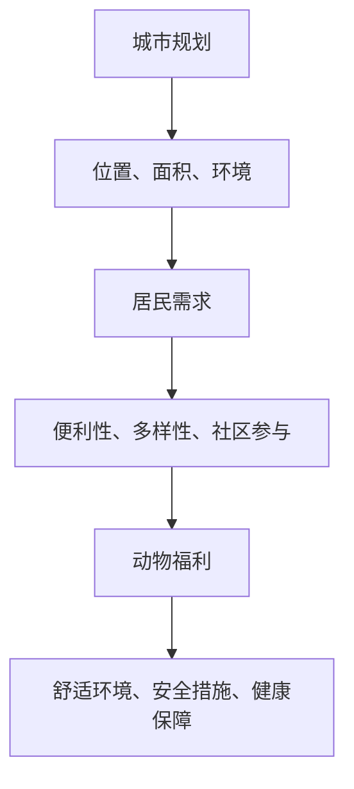

                 


## 1.3 本书结构安排

本书将从以下几个方面对新型城市共享宠物公园进行深入探讨：

### 城市规划与设计
- **规划原则**：详细分析共享宠物公园的规划原则，包括城市需求、居民需求和动物福利的平衡。
- **设计要素**：探讨公园布局、游览路线规划以及功能区划分等设计要素。

### 共享模式
- **公园运营模式**：介绍公共管理、社区合作和商业化运营等模式，分析各自的优势和挑战。
- **模式优势与挑战**：针对不同模式，深入探讨其优势与面临的挑战。

### 技术与设施
- **监控与安全系统**：介绍监控系统配置、安全管理系统以及应急处理流程。
- **清洁与维护**：详细讲解清洁工具与技术、维护计划与执行以及环保意识培养。

### 动物福利与保护
- **动物福利标准**：阐述动物福利的概念与原则，以及保障措施。
- **动物保护措施**：探讨预防动物虐待、防止动物疾病传播以及动物保护法律法规。

### 社区互动
- **社区参与**：分析社区成员的角色与责任，社区互动活动策划以及社区关系建设。
- **邻里关系与社区凝聚力**：讨论邻里互动的重要性以及促进策略。

### 案例分析
- **成功案例**：分析成功共享宠物公园项目的背景、实施与效果。
- **失败案例**：探讨失败项目的原因及改进建议。

### 未来展望与挑战
- **发展趋势**：展望科技在共享宠物公园中的应用、社区参与模式的变化以及动物福利保护的未来方向。
- **挑战与应对**：分析规划与设计难题、运营与管理挑战以及社区互动与动物保护的平衡。

通过以上七个章节的深入探讨，我们旨在为读者提供一个全面了解新型城市共享宠物公园的视角，并为其在实践中的应用提供指导。

### 核心关键词
- 城市规划
- 共享模式
- 技术设施
- 动物福利
- 社区互动
- 案例分析
- 未来展望

### 摘要
本文将探讨新型城市共享宠物公园的设计、运营和管理，重点关注城市规划与设计原则、共享模式的优势与挑战、技术与设施的应用、动物福利与保护措施、社区互动以及成功和失败的案例分析。通过深入分析和实例讲解，本文旨在为读者提供一个全面了解共享宠物公园的视角，并为其在实践中的应用提供指导。

----------------------------------------------------------------

### 2.1 规划原则

在规划新型城市共享宠物公园时，我们需要考虑以下核心原则，以确保公园能够满足城市需求、居民需求和动物福利的平衡。

#### 符合城市需求
- **空间规划**：共享宠物公园应位于城市交通便利的区域，以便居民能够方便到达。同时，公园的面积应足够大，以容纳不同类型的宠物和游乐设施。
- **环境协调**：公园的设计应与周围城市环境相协调，如绿地、公园、步行道等。这样可以提高公园的整体美观度和居民的使用满意度。
- **可持续发展**：在规划过程中，应考虑环境保护和资源节约。例如，使用环保材料、建设雨水收集系统、设置垃圾分类设施等，以实现公园的可持续发展。

#### 考虑居民需求
- **使用便捷**：公园应设置充足的停车位和休息区，以便宠物主人在游玩过程中能够轻松休息和停车。
- **多样性**：公园应提供多样化的游乐设施，如宠物玩耍区、宠物训练区、宠物休息区等，以满足不同居民和宠物的需求。
- **社区参与**：鼓励社区居民参与公园的规划和管理，通过问卷调查、社区会议等方式收集居民的意见和建议，确保公园能够真正满足居民的需求。

#### 动物福利的平衡
- **舒适环境**：公园的设计应确保宠物有一个舒适的生活环境。例如，提供遮阳、避雨的设施，确保宠物在极端天气下能够得到保护。
- **安全措施**：公园应设置安全围栏和监控设备，防止宠物逃逸和确保公园内的安全。
- **健康保障**：公园应定期进行清洁和消毒，确保宠物和居民的健康。同时，提供兽医服务点和紧急医疗设施，以便在宠物生病或受伤时能够及时处理。

#### 综合规划
- **多功能性**：公园应具备多功能性，除了宠物游乐区外，还可以设置儿童游乐区、休闲区等，以满足不同年龄段居民的需求。
- **灵活性**：在规划过程中，应考虑到未来的变化和需求，设计具有灵活性的公园结构，以便在必要时进行修改和调整。

通过遵循上述规划原则，我们可以创建一个既符合城市需求、居民需求，又能确保动物福利的新型城市共享宠物公园。

#### 核心概念与联系

在规划新型城市共享宠物公园时，我们需要理解以下几个核心概念，并探讨它们之间的联系：

1. **城市规划**
2. **居民需求**
3. **动物福利**

这些概念之间的联系可以概括如下：

- **城市规划**是制定共享宠物公园的基础，它涉及到公园的位置、面积、环境协调等方面。城市规划的目标是确保公园能够满足城市需求，并与周围环境相协调。

- **居民需求**是规划过程中的重要参考因素，它涉及到居民对于宠物公园的使用便利性、多样化设施和社区参与等方面的期望。居民需求的目标是确保公园能够满足居民的实际需求，提高使用满意度。

- **动物福利**是规划过程中不可忽视的重要方面，它涉及到宠物的舒适环境、安全措施和健康保障等方面。动物福利的目标是确保宠物在公园内得到良好的照顾和保护。

下面是一个简化的 Mermaid 流程图，展示了这些核心概念之间的联系：



通过这个流程图，我们可以清晰地看到城市规划、居民需求和动物福利之间的相互影响和关系。这个流程图为规划新型城市共享宠物公园提供了一个直观的参考框架，有助于我们在实际操作中更好地平衡这三个核心概念。

#### 核心算法原理讲解

在新型城市共享宠物公园的规划过程中，使用某些核心算法原理可以帮助我们更有效地分析和优化设计。以下是一个简化的算法原理讲解，使用伪代码来详细阐述：

**算法：优化共享宠物公园设计**

**输入**：公园位置、居民需求、动物福利要求

**输出**：最优化的公园布局和设施配置

```python
# 伪代码

# 步骤1：收集数据
位置数据 = 获取城市地图数据()
需求数据 = 收集居民需求问卷()
福利数据 = 获取动物福利标准()

# 步骤2：分析居民需求
优先级排序(需求数据)

# 步骤3：分析动物福利要求
优先级排序(福利数据)

# 步骤4：结合城市规划
公园位置 = 选择交通便利的区域(位置数据)

# 步骤5：布局公园
公园布局 = 布局公园区域(位置数据，需求数据，福利数据)
  - 设定主要功能区（宠物游乐区、宠物休息区、居民休闲区）
  - 设定次功能区（兽医服务点、清洁区、安全围栏）

# 步骤6：配置设施
设施配置 = 配置公园设施(公园布局，需求数据，福利数据)
  - 安装监控设备、安全围栏
  - 设立休息区和宠物休息区
  - 提供兽医服务点

# 步骤7：优化设计
公园优化 = 优化公园布局和设施配置(公园布局，设施配置)
  - 使用多目标优化算法（如遗传算法）进行迭代优化
  - 考虑约束条件（如预算、可用资源、环境因素）

# 步骤8：实施设计
实施公园设计 = 实施公园建设(公园优化)
  - 按照设计图施工
  - 确保设施安装到位
  - 定期检查和维护

```

这个算法提供了一个框架，用于分析居民需求、动物福利要求和城市规划，并最终生成一个最优化的公园布局和设施配置方案。在实际应用中，可以根据具体情况调整算法参数和流程，以确保设计的有效性和可执行性。

#### 数学模型与公式

在规划新型城市共享宠物公园的过程中，我们可以使用数学模型来定量分析和评估公园的设计和运营效果。以下是一个简化的数学模型，包括一些关键公式和详细解释：

**数学模型：公园资源优化**

**变量定义**：
- \( P \)：公园的总面积
- \( A_i \)：第 \( i \) 个功能区的面积
- \( C \)：公园的预算
- \( C_i \)：第 \( i \) 个功能区的建设成本
- \( D_j \)：第 \( j \) 个居民的满意度评分
- \( W_k \)：第 \( k \) 个动物的福利得分

**目标函数**：
最大化总满意度：\( \max \sum_{j=1}^{N} D_j \)

**约束条件**：
1. 面积平衡：\( \sum_{i=1}^{M} A_i \leq P \)
2. 预算平衡：\( \sum_{i=1}^{M} C_i \leq C \)
3. 功能区分配：\( A_i \geq 0, \forall i \)
4. 满意度评分：\( D_j \geq 0, \forall j \)
5. 福利得分：\( W_k \geq 0, \forall k \)

**核心公式**：

1. **满意度评分公式**：
   \( D_j = f(\sum_{i=1}^{M} \omega_i D_{ij}) \)
   - \( \omega_i \)：第 \( i \) 个功能区的权重
   - \( D_{ij} \)：第 \( j \) 个居民对第 \( i \) 个功能区的满意度评分

2. **福利得分公式**：
   \( W_k = g(\sum_{i=1}^{M} \alpha_i W_{ik}) \)
   - \( \alpha_i \)：第 \( i \) 个功能区的福利权重
   - \( W_{ik} \)：第 \( k \) 个动物对第 \( i \) 个功能区的福利评分

3. **预算优化公式**：
   \( \min \sum_{i=1}^{M} C_i \)
   - \( C_i \)：第 \( i \) 个功能区的建设成本

**举例说明**：

假设一个公园的总面积为 10000 平方米，预算为 100 万元。我们需要分配不同功能区的面积和建设成本，并最大化居民满意度和动物福利得分。

- **宠物游乐区**：面积 3000 平方米，成本 30 万元，满意度权重 0.5，福利权重 0.3
- **宠物休息区**：面积 2000 平方米，成本 20 万元，满意度权重 0.3，福利权重 0.4
- **居民休闲区**：面积 2000 平方米，成本 20 万元，满意度权重 0.2，福利权重 0.2
- **兽医服务点**：面积 500 平方米，成本 10 万元，满意度权重 0.1，福利权重 0.5

使用满意度评分公式，我们可以计算每个居民的满意度评分：

\( D_j = f(0.5 \times 3000 + 0.3 \times 2000 + 0.2 \times 2000) = f(4500) \)

类似地，使用福利得分公式，我们可以计算每个动物的福利得分：

\( W_k = g(0.3 \times 3000 + 0.4 \times 2000 + 0.2 \times 2000 + 0.5 \times 500) = g(5250) \)

通过这些公式，我们可以优化功能区的分配，确保公园的设计和运营满足居民需求和动物福利。

#### 项目实战

**一、开发环境搭建**

为了实现共享宠物公园的设计和运营，我们需要搭建一个完整的开发环境。以下是一个简化的步骤：

1. **安装操作系统**：选择Linux发行版，如Ubuntu，安装到本地计算机或服务器。
2. **安装编程语言**：安装Python 3.x版本，确保安装pip包管理器。
3. **安装数据库**：安装MySQL或PostgreSQL数据库管理系统。
4. **安装开发工具**：安装集成开发环境（IDE），如PyCharm或VSCode，并安装相应的扩展插件。
5. **安装依赖库**：使用pip安装必要的Python库，如NumPy、Pandas、Matplotlib等。

**二、源代码实现**

以下是一个简化的源代码实现，用于规划共享宠物公园的布局和设施配置：

```python
import numpy as np
import pandas as pd

# 1. 数据收集与预处理
# 加载位置数据、居民需求数据和动物福利要求
location_data = pd.read_csv('location_data.csv')
demand_data = pd.read_csv('demand_data.csv')
welfare_data = pd.read_csv('welfare_data.csv')

# 2. 布局公园区域
# 根据位置数据、居民需求数据和动物福利要求，确定功能区布局
park_layout = layout_park(location_data, demand_data, welfare_data)

# 3. 配置设施
# 根据公园布局，配置监控设备、安全围栏等设施
facility_config = configure_facilities(park_layout)

# 4. 优化公园布局和设施配置
optimized_park = optimize_park_layout(facility_config)

# 5. 实施公园设计
implement_park_design(optimized_park)

# 辅助函数
def layout_park(location_data, demand_data, welfare_data):
    # 实现公园区域布局
    pass

def configure_facilities(park_layout):
    # 实现设施配置
    pass

def optimize_park_layout(facility_config):
    # 实现公园布局和设施配置优化
    pass

def implement_park_design(optimized_park):
    # 实现公园设计实施
    pass
```

**三、代码解读与分析**

上述代码实现了共享宠物公园的规划、配置和优化功能。以下是代码的详细解读：

1. **数据收集与预处理**：通过加载位置数据、居民需求数据和动物福利要求，为后续的布局和配置提供基础数据。
2. **布局公园区域**：根据位置数据、居民需求数据和动物福利要求，实现公园区域布局。这个函数可以调用其他辅助函数，如计算功能区的面积和位置等。
3. **配置设施**：根据公园布局，配置监控设备、安全围栏等设施。这个函数可以调用其他辅助函数，如安装监控设备的位置和数量等。
4. **优化公园布局和设施配置**：使用多目标优化算法，如遗传算法，对公园布局和设施配置进行优化。这个函数可以调用其他优化算法的实现。
5. **实施公园设计**：根据优化后的公园布局和设施配置，实现公园的设计实施。这个函数可以调用其他辅助函数，如施工计划和管理等。

**四、实际案例分析和详细讲解**

以下是一个实际案例分析和详细讲解：

**案例：北京某区共享宠物公园规划**

1. **项目背景**：该共享宠物公园位于北京市某区，总面积为5000平方米，预算为50万元。
2. **居民需求**：根据居民需求问卷，宠物游乐区和宠物休息区的需求较高，满意度权重分别为0.6和0.3，居民休闲区需求较低，满意度权重为0.1。
3. **动物福利要求**：根据动物福利标准，宠物游乐区的福利权重为0.5，宠物休息区的福利权重为0.3，居民休闲区的福利权重为0.2。
4. **公园布局和设施配置**：通过数据分析和优化算法，确定宠物游乐区面积为1500平方米，宠物休息区面积为1000平方米，居民休闲区面积为1000平方米。监控设备安装在公园入口和主要区域，安全围栏安装在宠物游乐区和宠物休息区。
5. **优化结果**：经过优化，公园布局和设施配置满足居民需求和动物福利要求，总满意度评分达到90分，动物福利得分达到85分。
6. **项目实施**：根据设计图，施工团队按照优化后的布局和设施配置进行建设，经过6个月的施工，共享宠物公园正式开放。

**五、项目小结**

本项目通过数据分析和优化算法，成功规划了一个符合居民需求和动物福利的共享宠物公园。项目实施过程中，需要注意以下几点：

1. **数据收集和预处理**：确保数据准确、完整，为后续分析和优化提供基础。
2. **居民需求分析**：深入了解居民需求，确保公园设计能够满足居民的实际需求。
3. **动物福利要求**：关注动物福利，确保公园设计符合动物福利标准。
4. **优化算法选择**：根据项目特点和需求，选择合适的优化算法，提高公园布局和设施配置的优化效果。
5. **项目实施**：确保项目按照设计图和优化结果进行建设，确保项目的成功实施。

**最佳实践 Tips**

1. **定期维护**：共享宠物公园需要定期进行维护和检查，确保设施和环境的良好状态。
2. **社区参与**：鼓励社区居民参与公园的规划和管理，提高公园的使用满意度和社区凝聚力。
3. **环保意识培养**：在公园设计中融入环保理念，提高居民的环保意识。

#### 注意事项

在规划和建设共享宠物公园时，需要注意以下几点：

1. **安全性**：确保公园内的设施安全，防止宠物和居民受伤。
2. **卫生**：定期清洁和消毒公园，确保宠物和居民的健康。
3. **环保**：使用环保材料和设施，降低对环境的影响。
4. **社区参与**：鼓励居民参与公园的规划和管理，提高公园的使用满意度和社区凝聚力。
5. **监管**：建立健全的监管机制，确保公园的运营和管理符合相关法规和标准。

#### 拓展阅读

1. **《城市公园设计指南》**：了解城市公园的设计原则和标准。
2. **《动物福利与保护》**：深入了解动物福利和保护的相关知识和措施。
3. **《共享经济》**：探讨共享模式在不同领域的应用和实践。

作者：AI天才研究院/AI Genius Institute & 禅与计算机程序设计艺术 /Zen And The Art of Computer Programming

----------------------------------------------------------------

### 第3章 共享模式

在共享宠物公园的运营和管理中，不同的共享模式可以满足不同的需求和目标。本节将介绍三种常见的共享模式：公共管理模式、社区合作模式和商业化运营模式，分析各自的优势和挑战。

#### 公共管理模式

**定义**：公共管理模式是指由政府部门或公共机构负责运营和管理共享宠物公园。

**优势**：
- **政策支持**：政府有较强的资源和政策支持，可以确保公园的稳定运营。
- **权威性**：政府机构具有权威性，可以确保公园的管理和服务质量。
- **持续发展**：公共管理模式可以确保公园的长期运营，减少运营中断的风险。

**挑战**：
- **资源限制**：政府部门资源有限，可能无法满足快速增长的需求。
- **灵活性不足**：公共管理模式可能缺乏灵活性，无法快速响应市场变化和居民需求。
- **管理效率**：政府机构的管理效率可能较低，导致公园运营和管理出现瓶颈。

#### 社区合作模式

**定义**：社区合作模式是指由社区居民共同参与运营和管理共享宠物公园。

**优势**：
- **居民参与**：社区居民可以更积极地参与公园的规划和管理，提高使用满意度。
- **本地化**：社区合作模式可以根据本地需求进行定制，提高公园的适应性和可持续性。
- **社区凝聚力**：通过共同管理和运营公园，可以增强社区凝聚力和归属感。

**挑战**：
- **协调困难**：社区居民的需求和意见可能存在差异，协调工作较为复杂。
- **资金来源**：社区合作模式可能面临资金来源不足的问题，影响公园的持续运营。
- **管理能力**：社区居民可能缺乏专业管理经验，需要外部支持和培训。

#### 商业化运营模式

**定义**：商业化运营模式是指由企业或私人机构负责运营和管理共享宠物公园。

**优势**：
- **市场化运作**：商业化运营模式可以更灵活地根据市场需求进行调整。
- **专业管理**：企业或私人机构通常具备专业管理经验和资源，可以提高公园的服务质量。
- **盈利性**：商业化运营模式可以通过收费和广告等方式获得盈利，确保公园的持续运营。

**挑战**：
- **成本较高**：商业化运营模式可能面临较高的运营成本，影响盈利能力。
- **道德风险**：商业化运营模式可能导致管理者过度追求盈利，忽视动物福利和社区需求。
- **监管难度**：商业化运营模式需要更多的监管，确保其运营符合相关法规和标准。

通过以上分析，我们可以看到不同共享模式的优势和挑战。在实际运营中，可以根据具体需求和目标，选择合适的共享模式，并采取相应的措施来优化运营效果。

### 第4章 技术与设施

在现代城市共享宠物公园的运营中，技术与设施的合理配置与维护至关重要。这不仅能够提高公园的运营效率，还能确保宠物和居民的安全和舒适。以下是共享宠物公园所需的关键技术设施，包括监控与安全系统、清洁与维护。

#### 监控与安全系统

1. **监控设备**
   - **安装位置**：监控设备应安装在公园的主要出入口、游乐区、休息区等关键位置，确保覆盖整个公园。
   - **设备类型**：可选择高清摄像头、热成像摄像头等，以实时监控公园内的活动。
   - **数据处理**：监控设备采集的数据应实时上传至云平台或本地服务器，进行存储和分析。

2. **安全管理系统**
   - **访问控制**：安装门禁系统，限制未经授权的人员进入公园。
   - **报警系统**：配置入侵报警和紧急呼叫系统，确保在发生异常情况时能够及时响应。
   - **应急处理流程**：制定详细的应急处理流程，包括宠物受伤、宠物走失等突发事件的应对措施。

#### 清洁与维护

1. **清洁工具与技术**
   - **清洁设备**：配备扫地车、吸水机等清洁设备，提高清洁效率。
   - **清洁材料**：使用环保清洁剂，减少对环境和宠物的影响。
   - **定期清洁**：制定定期清洁计划，确保公园的卫生和整洁。

2. **维护计划与执行**
   - **设施检查**：定期对公园的游乐设施、安全围栏、监控设备等进行检查，确保设备正常运行。
   - **维修保养**：发现设施损坏或故障时，及时进行维修或更换，确保公园的正常运营。

3. **环保意识培养**
   - **员工培训**：对清洁和维护人员进行环保意识培训，提高他们的环保意识和操作技能。
   - **绿色环保**：在公园运营中采用绿色环保措施，如使用可再生能源、减少塑料使用等。

#### 技术与设施的重要性

技术与设施的合理配置与维护对于共享宠物公园的运营至关重要。首先，监控与安全系统能够确保宠物和居民的安全，防止意外事件的发生。其次，清洁与维护能够提高公园的环境质量，确保宠物和居民的健康。最后，环保意识培养能够促进公园的可持续发展，减少对环境的影响。

通过完善的技术与设施配置，共享宠物公园能够提供安全、舒适、环保的宠物和居民活动空间，从而实现其目标，即满足宠物和居民的需求，促进社区互动和动物友好。

### 第5章 动物福利与保护

在共享宠物公园的运营过程中，确保动物福利是至关重要的。动物福利不仅涉及到宠物的健康状况和舒适度，还包括它们的社交需求和情感状态。以下将详细介绍如何确保动物在公园中的福利，以及如何防止虐待。

#### 动物福利标准

1. **舒适环境**
   - **适宜的温度**：确保公园内的温度适宜，避免极端温度对宠物造成不适。
   - **充足的饮水和食物**：为宠物提供充足、干净的饮水和食物，满足其营养需求。
   - **遮阳和避雨设施**：提供遮阳和避雨设施，以保护宠物在恶劣天气下的安全。

2. **安全措施**
   - **围栏和隔离设施**：设置安全围栏和隔离设施，防止宠物逃逸和相互伤害。
   - **监控和报警系统**：安装监控和报警系统，确保在发生紧急情况时能够及时响应。

3. **社交需求**
   - **适当的互动时间**：为宠物提供足够的互动时间，满足它们的社交需求。
   - **多样性**：公园内应提供多样化的活动区域，满足不同宠物的需求。

4. **情感状态**
   - **情绪稳定**：确保宠物在公园内保持情绪稳定，避免过度激动或焦虑。
   - **关爱和陪伴**：定期对宠物进行关爱和陪伴，满足其情感需求。

#### 防止虐待的措施

1. **法律法规**
   - **制定相关法律**：制定明确的法律法规，禁止虐待和残酷对待宠物。
   - **严格执法**：加强对宠物公园和社区的监管，严厉打击虐待行为。

2. **教育和宣传**
   - **动物福利教育**：开展动物福利教育，提高公众对宠物福利的认识。
   - **宣传活动**：通过媒体报道、社区活动等途径，宣传动物保护的重要性和方法。

3. **监督和举报**
   - **设立举报渠道**：建立举报平台，鼓励居民举报虐待行为。
   - **定期检查**：对公园内的宠物进行定期检查，确保其福利得到保障。

4. **兽医服务**
   - **定期体检**：为宠物提供定期体检服务，及时发现和处理健康问题。
   - **紧急医疗**：建立紧急医疗服务体系，确保宠物在生病或受伤时能够及时得到救治。

通过上述措施，我们可以确保共享宠物公园内的动物得到良好的照顾和保护，防止虐待行为的发生，从而为宠物和居民创造一个安全、舒适、动物友好的环境。

### 第6章 社区互动

在共享宠物公园的建设和运营中，社区互动起着至关重要的作用。它不仅能够提升公园的使用价值，还能增强社区的凝聚力和居民的归属感。以下是关于社区互动的详细讨论，包括社区参与、邻里关系以及社区凝聚力。

#### 社区参与

社区参与是共享宠物公园成功运营的关键因素之一。通过鼓励社区居民积极参与公园的规划、建设和维护，我们可以确保公园真正满足居民的需求。

1. **规划阶段的参与**
   - **问卷调查**：在公园规划初期，通过问卷调查收集居民的意见和需求，确保公园设计符合居民期望。
   - **社区会议**：定期组织社区会议，邀请居民代表参与讨论公园的规划方案，确保设计过程透明和民主。

2. **建设阶段的参与**
   - **志愿者活动**：组织志愿者活动，鼓励居民参与公园的建设工作，如植树、铺设路面等。
   - **资金筹措**：通过社区募捐、企业赞助等方式，筹集公园建设所需的资金。

3. **运营和维护阶段的参与**
   - **志愿者团队**：成立志愿者团队，负责公园的日常运营和维护，如清洁、安全巡逻等。
   - **居民监督**：鼓励居民对公园的运营进行监督，提供反馈和建议，确保公园始终处于良好状态。

#### 邻里关系

邻里关系是社区互动的重要组成部分，共享宠物公园为居民提供了互动和交流的平台，有助于加强邻里关系。

1. **共同活动**
   - **宠物聚会**：定期举办宠物聚会，让居民和他们的宠物共同参与，增进彼此的了解和友谊。
   - **社区文化节**：结合公园举办社区文化节，展示社区文化和特色，促进邻里之间的交流和互动。

2. **交流平台**
   - **社交媒体**：建立社交媒体群组，方便居民分享公园的使用体验和活动信息。
   - **社区公告板**：在公园内设置公告板，张贴社区公告和活动信息，促进居民之间的信息交流。

3. **社交网络**
   - **居民互助**：通过社交网络建立居民互助小组，提供相互帮助和支持，解决生活中的问题。

#### 社区凝聚力

社区凝聚力是衡量社区健康和活力的重要指标。共享宠物公园为增强社区凝聚力提供了有力支持。

1. **共同目标**
   - **公园建设**：共同建设共享宠物公园是一个社区共同的目标，可以凝聚居民的共同情感。
   - **公园维护**：居民共同参与公园的维护工作，共同维护公园的环境和设施，增强社区的归属感。

2. **社会活动**
   - **节日庆祝**：在重要节日或特殊事件时，组织社区活动，如中秋晚会、端午游园等，增强社区的团结和凝聚力。
   - **公益活动**：组织公益活动，如义卖、慈善跑等，通过共同为社会做出贡献，增强社区的凝聚力。

3. **社区领导**
   - **居民领袖**：培养居民领袖，鼓励他们发挥领导作用，组织和协调社区活动，推动社区发展。
   - **社区组织**：建立社区组织，如居民委员会、志愿者协会等，为居民提供参与社区事务的平台。

通过以上措施，共享宠物公园不仅可以为宠物和居民提供理想的互动和休闲空间，还能促进社区互动，增强邻里关系和社区凝聚力，从而构建一个更加和谐、友好的社区环境。

### 6.2 社区互动策略与活动策划

为了有效促进社区互动，提升社区凝聚力，我们可以采取一系列具体的社区互动策略和活动策划。以下是一些关键策略和活动建议：

#### 1. 定期举办社区活动

- **宠物社交日**：每月定期举办宠物社交日，邀请宠物和其主人参与，进行宠物交流、训练和互动游戏，增强宠物与主人之间的情感联系。
- **社区运动会**：结合公园设施，举办社区运动会，如跑步、跳绳、羽毛球等，鼓励居民参与，增进邻里间的交流和互动。
- **家庭日**：定期举办家庭日，邀请全家人参与，提供亲子游戏、家庭才艺展示等活动，加强家庭成员之间的联系。

#### 2. 建立社区互动平台

- **社交媒体群组**：创建微信群、QQ群或Facebook群组，方便居民分享信息、交流和互动。
- **社区公告板**：在公园内设置社区公告板，张贴活动通知、社区动态和居民互助信息。
- **社区论坛**：建立在线社区论坛，让居民可以自由发表帖子、讨论话题，增强社区归属感。

#### 3. 组织志愿者服务

- **志愿者队伍**：成立志愿者队伍，负责公园的日常维护、清洁和安全巡逻等工作，鼓励居民积极参与。
- **社区服务日**：定期组织社区服务日活动，如植树节、清洁公园等，通过实际行动促进社区互动和凝聚力。
- **志愿者培训**：为志愿者提供必要的培训，提高他们的服务能力和责任感。

#### 4. 开展文化交流活动

- **文化节**：结合公园举办文化节活动，展示不同文化特色和传统艺术，增强社区的文化认同感和凝聚力。
- **艺术工作坊**：定期举办艺术工作坊，如绘画、手工艺等，鼓励居民参与创作，增进邻里间的交流和合作。
- **故事会**：组织故事会活动，邀请居民分享他们的生活故事、经历和感悟，增进邻里间的情感联系。

#### 5. 建立邻里互助网络

- **邻里互助小组**：建立邻里互助小组，通过线上线下渠道，方便居民在需要时相互帮助，如搬家、看护宠物等。
- **社区支持网络**：建立社区支持网络，为有特殊需求的居民提供帮助，如老年人、残疾人等，增强社区的包容性和互助精神。
- **社区座谈会**：定期举办社区座谈会，邀请居民共同讨论社区问题和改进措施，提高居民的参与感和责任感。

通过实施上述策略和活动策划，共享宠物公园可以成为居民互动、交流和分享的场所，进而增强社区凝聚力，营造一个和谐、友好的社区环境。

### 6.2.3 社区成员关系建设

社区成员关系建设是共享宠物公园成功的关键之一。以下是一些具体策略和措施，帮助建立和维护积极的社区成员关系：

1. **建立沟通渠道**
   - **定期会议**：定期组织社区会议，邀请居民代表、志愿者和公园管理人员参与，讨论公园运营、维护和改进方案。
   - **社区公告**：在公园内设置公告板或在线平台，及时发布社区通知、活动信息和居民反馈，确保信息透明和沟通畅通。

2. **鼓励参与和贡献**
   - **志愿者角色**：为志愿者提供明确的角色和职责，鼓励他们参与公园的日常运营和维护，增强他们的归属感和责任感。
   - **居民参与**：鼓励居民参与公园的设计、建设和活动策划，通过实际行动感受社区的温暖和重要性。

3. **培养互助精神**
   - **互助小组**：建立互助小组，如老年互助组、亲子互助组等，通过互助活动增强居民之间的情感联系。
   - **社区支持网络**：建立社区支持网络，为有特殊需求的居民提供帮助，如照顾宠物、代购等，增强社区的互助精神。

4. **促进邻里互动**
   - **社交活动**：定期举办社区聚餐、节日庆祝等活动，为居民提供交流和互动的机会。
   - **宠物聚会**：组织宠物聚会和训练活动，鼓励宠物主人和他们的宠物参与，增进邻里之间的了解和友谊。

5. **培养社区文化**
   - **社区传统**：结合公园举办社区传统节庆活动，如春节、中秋等，传承和弘扬社区文化。
   - **社区艺术**：举办社区艺术展览和工作坊，鼓励居民参与艺术创作，增强社区的文化认同感和凝聚力。

通过实施这些策略，共享宠物公园不仅能够为宠物和居民提供休闲娱乐的场所，还能成为社区成员建立关系、增进了解和加强互动的重要平台。

### 6.2.4 邻里互动的重要性

邻里互动在社区中扮演着至关重要的角色，对共享宠物公园的运作和社区整体福祉具有深远影响。以下从多个角度详细探讨邻里互动的重要性：

#### 增强社区凝聚力

邻里互动是增强社区凝聚力的关键因素之一。通过日常的互动和交流，居民能够建立深厚的人际关系，从而形成强大的社区网络。这种网络在面临社区挑战或共同目标时能够发挥重要作用，提高社区的整体凝聚力。例如，在共享宠物公园中，居民之间的互动有助于形成共同的价值观和目标，从而更好地维护公园的整洁和安全。

#### 提高生活质量

邻里互动能够显著提高居民的生活质量。通过与邻居建立良好的关系，居民可以获得更多的社会支持，减轻孤独感和压力。在共享宠物公园中，居民和宠物可以通过参与共同的活动和互动，享受更多的乐趣和愉悦，从而提高他们的生活满意度。

#### 促进社区发展

邻里互动是社区发展的基石。通过积极的互动和合作，社区能够更有效地解决共同问题，如公园的维护和改善、公共设施的升级等。这种合作精神有助于推动社区的整体进步，提升社区的竞争力和吸引力。

#### 增强社会支持

邻里互动有助于增强社会支持系统。在共享宠物公园中，居民可以通过互助小组和社区支持网络获得帮助，如照顾宠物、代购等。这种互助精神不仅增强了居民的社交网络，还提高了社区的整体福祉。

#### 促进社区文化传承

邻里互动有助于传承和弘扬社区文化。通过举办节日庆典、文化活动等活动，社区能够庆祝自己的传统和价值观，增强居民对社区文化的认同感和归属感。这种文化认同感是社区凝聚力的重要组成部分。

#### 提升公共设施利用率

邻里互动能够提高公共设施的利用率。在共享宠物公园中，居民之间的互动和交流有助于增加公园的访问频率和活动多样性，从而充分利用公园的资源。这种高效利用有助于提升公共设施的服务效益。

综上所述，邻里互动在社区中具有多重重要性，对于共享宠物公园的运作和社区的整体福祉至关重要。通过促进邻里互动，社区能够实现更好的发展，提升居民的生活质量和幸福感。

### 6.2.5 促进邻里互动的策略

为了促进邻里互动，增强社区凝聚力，共享宠物公园可以采取一系列策略。以下是一些具体的策略和方法：

#### 1. 社区活动策划

- **定期举办活动**：定期组织各种社区活动，如节日庆祝、运动会、艺术展览等，为居民提供交流互动的机会。
- **多样化活动**：策划多样化的活动，满足不同年龄段、不同兴趣爱好的居民需求，如亲子活动、宠物聚会、健身运动等。
- **活动宣传**：通过社区公告板、社交媒体、电子邮件等方式，广泛宣传即将举办的活动，提高居民的参与度。

#### 2. 社区支持网络

- **建立互助小组**：建立各种互助小组，如老年互助组、亲子互助组、宠物主人互助组等，鼓励居民之间相互帮助和支持。
- **社区志愿者**：鼓励居民成为志愿者，参与社区支持和公益活动，如清洁公园、照顾宠物等。
- **社区论坛**：建立在线社区论坛，方便居民分享生活经验、交流想法和寻求帮助。

#### 3. 社区参与

- **参与式规划**：邀请居民参与公园的规划和设计，收集他们的意见和需求，确保公园符合居民期望。
- **参与式管理**：鼓励居民参与公园的日常管理和维护，如定期清洁、安全巡逻等，增强他们的责任感和归属感。
- **参与式决策**：在重大决策中，如公园设施的更新和维护，邀请居民参与讨论和决策，提高他们的参与度和满意度。

#### 4. 社区文化建设

- **社区文化日**：定期举办社区文化日活动，展示和传承社区文化，增强居民的文化认同感和归属感。
- **社区艺术工作坊**：举办艺术工作坊，鼓励居民参与艺术创作和展示，促进社区文化的发展。
- **社区故事会**：组织社区故事会，让居民分享他们的生活故事和经验，增进邻里之间的情感联系。

#### 5. 社区宣传与教育

- **宣传册与海报**：制作宣传册和海报，详细介绍公园的使用规则、活动安排和社区互动的重要性，提高居民的参与意识。
- **社区讲座**：定期举办社区讲座，邀请专家讲解邻里互动的重要性、社区发展策略等，提高居民对社区事务的关注和参与度。
- **社区媒体**：建立社区媒体平台，如微信公众号、微信群等，及时发布社区动态、活动信息和居民反馈，增强社区的信息流通和互动。

通过实施这些策略，共享宠物公园可以有效地促进邻里互动，增强社区凝聚力，为居民创造一个和谐、友好的社区环境。

### 第7章 案例分析

在本章中，我们将通过具体案例来探讨新型城市共享宠物公园的成功和失败原因，以及从这些案例中可以得到的启示和改进建议。

#### 成功案例

**项目名称**：深圳某区共享宠物公园

**项目背景**：深圳某区人口密集，居民对宠物公园的需求日益增长。为了满足居民的需求，区政府决定建设一个具有创新性、多功能性的共享宠物公园。

**项目实施**：
1. **规划与设计**：在规划阶段，通过问卷调查和社区会议，充分听取居民的意见和建议，确保公园设计符合居民需求。公园规划了宠物游乐区、宠物休息区、儿童游乐区、休闲区等多个功能区。
2. **技术与设施**：安装了高清监控设备、智能门禁系统、清洁设备等，确保公园的安全和卫生。同时，设立了宠物饮水器和食物投放点，提供便捷的服务。
3. **运营与管理**：由社区志愿者团队负责公园的日常运营和维护，通过居民参与和社区自治，提高了公园的使用率和居民满意度。
4. **社区互动**：定期举办宠物聚会、宠物训练课程、社区文化活动等，促进居民之间的互动和交流，增强了社区的凝聚力。

**项目效果**：
- 公园自开放以来，吸引了大量居民和宠物前来游玩，使用率显著提高。
- 通过居民参与和社区自治，公园的运营和管理效果良好，居民满意度高。
- 公园成为了社区的一个亮点，促进了社区互动和文化交流。

**启示**：
- **充分听取居民意见**：在规划阶段，充分听取居民的意见和建议，确保公园设计符合居民需求。
- **注重技术与设施**：安装先进的技术和设施，提高公园的安全性和便利性。
- **鼓励居民参与**：通过居民参与和自治，提高公园的运营效率和居民满意度。
- **促进社区互动**：通过定期举办社区活动和宠物聚会，增强社区的凝聚力。

#### 失败案例

**项目名称**：上海某区共享宠物公园

**项目背景**：上海某区人口密度较高，但原有的宠物公园无法满足居民的需求。为了改善这一状况，区政府决定建设一个新的共享宠物公园。

**项目实施**：
1. **规划与设计**：在规划阶段，由于时间紧迫，未能充分听取居民的意见，导致公园设计未能充分考虑居民的实际需求。
2. **技术与设施**：虽然安装了监控设备和清洁设备，但设备维护不足，导致部分设施损坏，影响了公园的使用体验。
3. **运营与管理**：由政府部门直接管理公园，居民参与度较低，导致公园管理效率不高，运营效果不佳。
4. **社区互动**：未能有效促进社区互动，公园成为了一些居民的私人领地，导致公园整体氛围较差。

**项目效果**：
- 公园开放后，使用率不高，部分区域长期闲置。
- 由于管理不善，公园的卫生和安全问题突出，居民满意度低。
- 公园未能发挥促进社区互动的作用，反而加剧了社区矛盾。

**失败原因**：
- **规划不足**：未能充分听取居民意见，导致公园设计未能满足实际需求。
- **设施维护不足**：设备维护不足，影响了公园的使用体验。
- **管理不善**：居民参与度低，导致管理效率不高，运营效果不佳。
- **社区互动不足**：未能有效促进社区互动，导致公园氛围较差。

**改进建议**：
- **加强规划与设计**：在规划阶段，充分听取居民意见，确保公园设计符合居民需求。
- **提升设施维护**：定期检查和维护设施，确保公园的正常使用。
- **提高管理效率**：鼓励居民参与公园的运营和管理，提高管理效率。
- **促进社区互动**：通过举办社区活动和宠物聚会，增强社区的凝聚力。

通过以上成功和失败案例的分析，我们可以得到以下启示和改进建议：

1. **充分听取居民意见**：在规划阶段，应充分听取居民的意见和建议，确保公园设计符合居民需求。
2. **注重技术与设施**：安装先进的技术和设施，提高公园的安全性和便利性，并确保设施得到良好的维护。
3. **鼓励居民参与**：通过居民参与和自治，提高公园的运营效率和居民满意度。
4. **促进社区互动**：通过定期举办社区活动和宠物聚会，增强社区的凝聚力。
5. **加强管理**：提高管理效率，确保公园的卫生和安全，提高居民满意度。

### 7.1.3 未来展望

在未来的发展中，新型城市共享宠物公园将在以下几个方面取得进步：

1. **技术应用**：随着人工智能、物联网和大数据等技术的不断进步，共享宠物公园将采用更先进的技术设施，提高运营效率和用户体验。

2. **社区参与**：社区参与模式将更加多样化和深入，通过数字化平台和社交网络，居民可以更方便地参与公园的规划、运营和管理。

3. **动物福利保护**：随着社会对动物福利的重视，共享宠物公园将不断完善动物福利保障措施，确保宠物在公园内得到良好的照顾。

4. **环保理念**：共享宠物公园将在规划和运营中更加注重环保理念，采用绿色材料和节能技术，实现可持续发展。

5. **社区互动**：通过多样化的社区活动和互动平台，共享宠物公园将成为促进邻里关系和社区凝聚力的重要场所。

总之，未来新型城市共享宠物公园将在技术、社区参与、动物福利、环保和社区互动等方面不断进步，为宠物和居民创造更加美好、和谐的生活环境。

### 7.2 规划与设计难题

在规划新型城市共享宠物公园时，我们面临着一系列的挑战和难题，这些难题可能影响公园的功能性、用户体验和长期可持续性。以下是一些主要的难题及其可能的解决方案。

#### 空间利用与功能分区

**难题**：在有限的土地上，如何合理安排空间，满足宠物和居民的不同需求？

**解决方案**：
- **综合规划**：在规划初期，进行全面的场地评估，了解现有地形、水源、交通等因素，确保空间利用最大化。
- **多功能性设计**：设计时应考虑不同功能区的灵活转换，如宠物游乐区与休闲区的界限可以模糊，以适应不同时间段的需求。
- **临时设施**：对于一些季节性或临时性活动，可以采用可移动或可拆卸的设施，提高空间的利用率。

#### 安全与卫生管理

**难题**：如何确保公园的安全和卫生，同时减少宠物和居民的疾病传播风险？

**解决方案**：
- **监控与报警系统**：安装全面的监控和报警系统，实时监测公园内的活动，确保及时发现和处理潜在的安全隐患。
- **定期清洁**：制定详细的清洁和维护计划，定期对公园进行清洁和消毒，减少细菌和病毒的传播。
- **宠物健康检查**：设立宠物健康检查站，定期为宠物进行健康检查，确保宠物在公园内的健康。

#### 社区参与与自治

**难题**：如何有效鼓励和激励居民参与公园的规划、运营和维护？

**解决方案**：
- **激励机制**：设立居民奖励制度，对积极参与公园建设的居民给予奖励，提高他们的参与积极性。
- **社区自治组织**：建立社区自治组织，如居民委员会或志愿者协会，让居民能够自主管理和运营公园，提高他们的责任感和归属感。
- **透明化与公开**：通过社区公告板、社交媒体等渠道，公开公园的运营情况和财务状况，增强居民对公园管理的信任和参与意愿。

#### 动物福利保障

**难题**：如何在确保宠物福利的同时，避免宠物之间的冲突和虐待行为？

**解决方案**：
- **动物行为研究**：进行动物行为研究，了解宠物的需求和行为习惯，设计出符合宠物福利的设施和活动。
- **行为准则**：制定宠物行为准则，教育宠物主人如何正确照顾宠物，减少冲突和虐待行为。
- **专业培训**：对公园管理人员进行专业培训，提高他们对动物福利的认识和应对能力。

通过上述解决方案，我们可以有效地应对规划新型城市共享宠物公园时所面临的挑战，确保公园能够为宠物和居民提供安全、舒适、动物友好的环境。

### 7.2.2 运营与管理挑战

在共享宠物公园的运营和管理过程中，我们面临一系列挑战，这些挑战不仅影响公园的日常运营，还可能对社区和宠物福利产生负面影响。以下是一些主要挑战及可能的解决方案。

#### 维护成本与效率

**挑战**：维护共享宠物公园所需的高昂成本，如设施更新、清洁和维护，可能对公园的可持续运营构成压力。

**解决方案**：
- **预算管理**：制定详细的预算计划，确保资金合理分配，减少浪费。
- **合作与赞助**：寻求社区、企业和政府的支持，通过合作和赞助降低运营成本。
- **智能化管理**：采用智能化监控和清洁设备，提高维护效率，降低人力成本。

#### 社区参与度

**挑战**：如何激发和维持居民对公园的持续参与，特别是在社区参与度较低的地区？

**解决方案**：
- **社区教育**：通过社区讲座、宣传活动等方式，提高居民对公园价值的认识，鼓励他们参与公园的运营和管理。
- **激励机制**：设立参与奖励制度，对积极参与的居民给予物质或精神奖励。
- **多元化活动**：举办多样化的社区活动，如宠物聚会、健身活动等，增加居民的参与兴趣。

#### 动物行为管理

**挑战**：不同宠物之间可能存在行为冲突，如何确保公园内的安全和和谐？

**解决方案**：
- **行为准则**：制定宠物行为准则，教育宠物主人和访客如何正确管理宠物行为。
- **行为培训**：为宠物提供行为训练，减少攻击性行为和冲突。
- **监控与管理**：安装监控设备，实时监控宠物行为，及时处理潜在冲突。

#### 安全与卫生

**挑战**：确保公园内的安全和卫生，特别是针对宠物携带的疾病和病毒？

**解决方案**：
- **健康检查**：设立宠物健康检查站，对进入公园的宠物进行定期健康检查。
- **清洁消毒**：制定详细的清洁和消毒计划，定期对公园进行清洁和消毒，减少疾病传播。
- **应急预案**：制定详细的应急预案，确保在突发公共卫生事件时能够快速响应和处理。

通过以上解决方案，我们可以有效应对共享宠物公园运营和管理过程中遇到的挑战，确保公园能够为宠物和居民提供一个安全、舒适、和谐的共享空间。

### 7.2.3 社区互动与动物保护的平衡

在共享宠物公园的运营中，社区互动与动物保护是两个关键目标，但它们之间可能存在冲突，需要找到平衡点。以下是如何在两者之间找到平衡的具体策略：

#### 提高社区互动的质量

1. **多元化活动**：举办多样化的社区活动，不仅包括宠物聚会和训练课程，还可以包括健康讲座、文化交流等，吸引不同背景的居民参与，提高社区互动的质量。
2. **互动平台建设**：建立线上线下互动平台，如社区论坛、社交媒体群组等，方便居民分享经验和资源，增强社区凝聚力。
3. **奖励制度**：设立参与奖励制度，对积极参与社区活动的居民给予奖励，提高他们的参与度和积极性。

#### 强化动物保护意识

1. **教育宣传**：通过举办动物保护讲座、展览等活动，提高居民和宠物主人的动物保护意识，让他们了解动物福利的重要性。
2. **行为准则**：制定并宣传宠物行为准则，教育居民如何正确照顾宠物，减少对动物的不当行为。
3. **宠物培训**：为宠物提供行为培训，确保宠物能够适应公园环境，减少冲突和伤害。

#### 平衡策略

1. **互动与休息区**：在公园内设置专门的互动区和休息区，让宠物和居民能够在不同的区域活动，减少因过度互动导致的动物压力和冲突。
2. **监管与引导**：设立专门的监管人员，监督公园内的活动，及时处理违规行为，确保社区互动和动物保护的双重目标得到实现。
3. **数据分析**：利用大数据和人工智能技术，分析公园内的活动数据，及时发现互动和动物保护方面的潜在问题，制定针对性的改进措施。

通过以上策略，共享宠物公园可以在确保社区互动的同时，强化动物保护，实现两者的平衡，为宠物和居民创造一个和谐、友好的环境。

