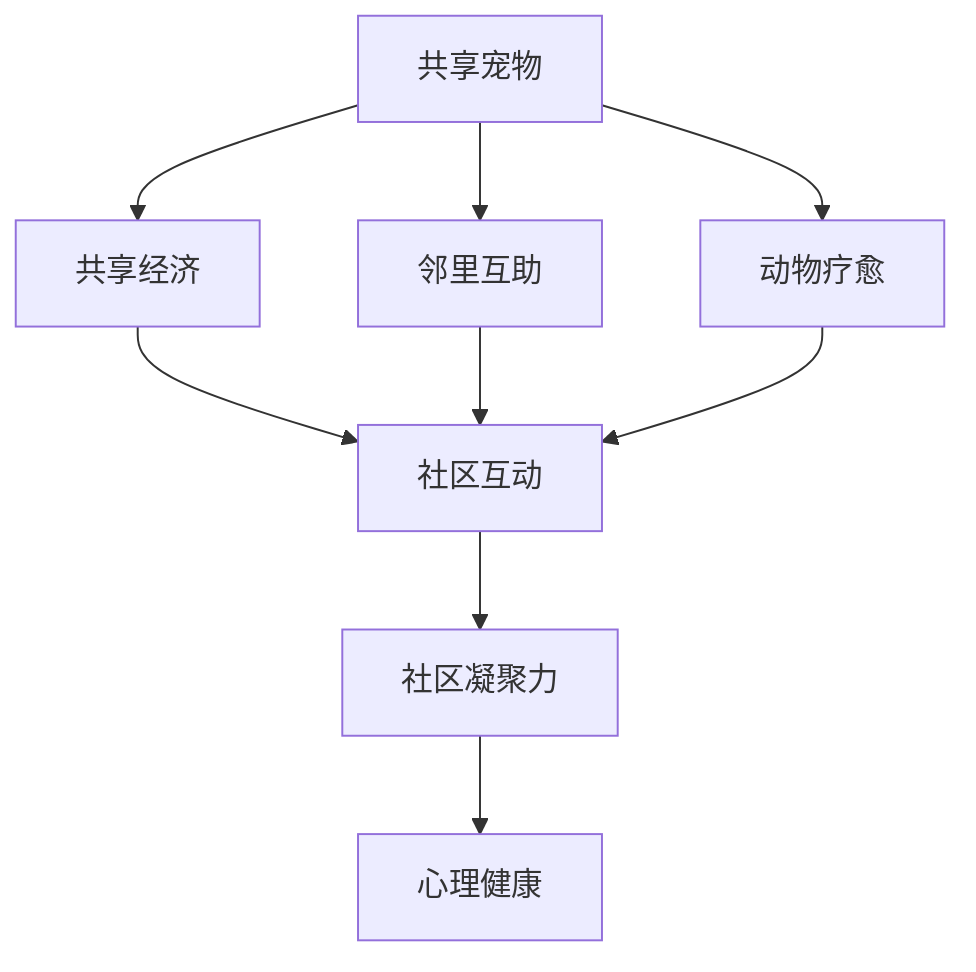

                 

### 文章标题

# 新型城市共享宠物：邻里互助中的动物疗愈

### 关键词

- 城市共享宠物
- 邻里互助
- 动物疗愈
- 共享经济
- 新型社区模式
- 宠物管理
- 社区互动
- 人宠关系

### 摘要

本文深入探讨了新型城市共享宠物模式及其在邻里互助和动物疗愈中的重要作用。通过分析共享宠物的定义、起源、实施过程及其对城市社区的影响，本文揭示了这一新兴模式如何通过动物疗愈提升社区成员的生活质量和心理福祉。文章还探讨了核心概念之间的关系，包括共享经济、社区互动和宠物管理，并使用Mermaid流程图、伪代码、数学公式和实际项目案例来阐述技术原理和实践应用。最后，本文总结了最佳实践建议和未来研究方向，为读者提供了一份全面且富有洞见的指南。

---

## 背景介绍

在城市化进程加速的背景下，城市生活节奏加快，人际关系逐渐疏离，人们在忙碌的生活中越来越渴望一种能够缓解压力、带来温暖和慰藉的陪伴。与此同时，共享经济的浪潮席卷全球，从共享单车、共享汽车到共享住宿，共享模式在各个领域展现出了强大的生命力和广泛的应用前景。在这样的背景下，城市共享宠物应运而生，成为了一种新型的社区互动和邻里互助方式。

### 城市化进程与共享宠物

城市化进程带来了人口密集、土地稀缺、居住空间有限等挑战，这使得传统家庭宠物养宠方式难以持续。一方面，高昂的宠物养育成本（包括食物、医疗、日常护理等）成为了许多城市居民的负担；另一方面，由于居住空间有限，许多人无法满足养宠的基本条件，导致宠物被遗弃或无法得到充分的关爱。这种情况下，共享宠物模式提供了一种新的解决方案。

共享宠物，顾名思义，是指通过某种平台或机制，让宠物在不同家庭之间进行共享。这种模式不仅降低了养宠成本，还为宠物提供了更多关爱和陪伴的机会。通过共享，宠物主人和邻居们可以在保证宠物安全和健康的前提下，轮流照顾和享受宠物带来的乐趣。

### 共享经济的普及

共享经济的兴起可以追溯到2008年，当时成立的Airbnb和Uber标志着一个新时代的来临。共享经济通过降低资源闲置率，实现资源的最大化利用，从而提高了整体社会效率。共享单车、共享充电宝、共享办公空间等层出不穷的共享模式，不仅改变了人们的生活方式，也为城市治理提供了新的思路。

在宠物共享领域，共享经济的原理同样适用。通过共享平台，宠物主人和邻居们可以方便地匹配需求，实现宠物的资源共享。例如，某位邻居因为出差需要几天无法照顾宠物，他可以在平台上找到愿意照顾宠物的邻居，从而实现宠物的临时共享。这种模式不仅解决了宠物主人的后顾之忧，也增强了社区成员之间的互动和信任。

### 动物疗愈的概念与作用

动物疗愈，又称动物辅助疗法，是指通过动物的陪伴和互动，帮助人类缓解心理压力、改善情绪、增强身心健康的一种治疗方法。研究表明，与动物互动可以降低心率和血压，减少焦虑和抑郁情绪，甚至有助于提高免疫力。动物疗愈不仅在医疗领域得到广泛应用，也在社区和日常生活中发挥了重要作用。

在城市环境中，动物疗愈的作用尤为突出。由于城市化带来的高压力和快节奏生活，许多居民面临着心理健康的挑战。共享宠物模式提供了一个平台，使更多的人能够接触和享受动物疗愈带来的益处。通过社区的共享宠物，居民可以在日常生活中感受到宠物的陪伴和关爱，从而改善心理健康，增强社区凝聚力。

### 城市共享宠物的意义

城市共享宠物不仅是一种新型社区互动方式，更是一种邻里互助的新模式。它不仅解决了养宠物的经济和空间难题，还在以下几个方面具有重要意义：

1. **经济性**：通过共享宠物，居民可以降低养宠物的成本，提高养宠的可行性。
2. **便利性**：共享宠物平台提供了便捷的匹配和交流机制，使宠物共享更加方便高效。
3. **心理健康**：动物疗愈的作用已经被广泛认可，共享宠物为居民提供了一个接触和享受动物疗愈的机会。
4. **社区凝聚力**：共享宠物模式增强了邻里之间的互动和联系，有助于构建和谐的社区关系。
5. **环境友好**：通过合理规划和资源共享，共享宠物有助于减少宠物弃养和流浪宠物问题，保护环境。

综上所述，城市共享宠物作为一种新型社区模式，不仅满足了人们对宠物陪伴的需求，还在经济、心理健康、社区关系和环境保护等方面具有显著作用。随着城市化进程的推进和共享经济的进一步发展，城市共享宠物有望成为一种普遍的社区生活方式，为居民带来更多的福祉。

### 核心概念与联系

在探讨城市共享宠物及其在邻里互助和动物疗愈中的作用时，我们需要明确几个核心概念，并理解它们之间的内在联系。以下是这些核心概念及其关系的Mermaid流程图：



#### Mermaid流程图解读

- **共享宠物（A）**：这是本文探讨的核心主题，它是一种通过平台或机制实现的宠物资源共享方式。
- **共享经济（B）**：共享宠物是共享经济在宠物领域的具体应用，通过资源共享降低成本、提高资源利用率。
- **邻里互助（C）**：邻里互助是共享宠物的重要组成部分，通过共享宠物，居民之间建立了更紧密的联系和合作关系。
- **动物疗愈（D）**：动物疗愈是通过与动物的互动来改善人类身心健康的一种治疗方法，共享宠物提供了这种疗愈的机会。
- **社区互动（E）**：社区互动是邻里互助和动物疗愈的基础，通过宠物共享，居民之间的互动得以增强。
- **社区凝聚力（F）**：社区互动和共享宠物共同促进了社区凝聚力的提升，构建了一个更加和谐和紧密的社区关系。
- **心理健康（G）**：动物疗愈直接作用于心理健康，共享宠物为居民提供了一个缓解压力、改善情绪的途径。

#### 关系架构

1. **共享宠物与共享经济**：共享宠物是共享经济在宠物领域的具体表现，它通过降低宠物养植成本和提高资源利用率，体现了共享经济的核心原则。
2. **共享宠物与邻里互助**：通过共享宠物，居民之间建立了互助关系，这不仅解决了宠物照顾的问题，还增强了邻里之间的联系和信任。
3. **共享宠物与动物疗愈**：共享宠物提供了一个平台，使居民能够通过与宠物的互动来享受动物疗愈的益处，从而改善心理健康。
4. **社区互动与社区凝聚力**：社区互动是邻里互助和动物疗愈的基础，它促进了居民之间的交流和合作，增强了社区的凝聚力。
5. **心理健康与社区互动**：通过增强社区互动，共享宠物为居民提供了一个缓解心理压力、改善情绪的途径，从而提升了整体心理健康水平。

通过上述Mermaid流程图，我们可以清晰地看到这些核心概念之间的相互关系，以及它们如何共同作用，构建了一种新型的社区互动模式。这种模式不仅提升了居民的生活质量，也为社区的和谐发展提供了新的思路和路径。

### 共享宠物项目的实践

在了解了城市共享宠物的基本概念和其带来的多方益处后，接下来我们将深入探讨具体的项目实践，包括项目的实施步骤、管理策略以及成功案例分析。

#### 实施步骤

1. **需求调研**：项目的第一个步骤是进行需求调研，了解社区居民对共享宠物的需求和期望。这一过程可以通过问卷调查、社区会议等方式进行，确保项目能够满足居民的实际需求。

2. **平台搭建**：在明确需求后，搭建一个功能完善的共享宠物平台是至关重要的。平台应具备用户注册、宠物信息发布、需求匹配、预约管理等功能。可以使用现有的技术框架如React、Node.js等，确保平台的易用性和高效性。

3. **宠物筛选与培训**：为了保证共享宠物的质量和安全性，需要筛选合适的宠物，并进行必要的培训。筛选标准应包括宠物的健康状况、性格特点、行为习惯等。对于一些特殊的宠物，如猫、狗等，还需要进行专业的宠物行为训练，以确保其能够适应共享环境。

4. **用户培训与指导**：为了让居民更好地使用共享宠物平台，需要进行用户培训。培训内容应包括如何注册账号、发布宠物需求、预约管理、安全注意事项等。培训可以通过线上教程、社区讲座等方式进行。

5. **安全保障与监管**：为了确保共享宠物的安全和用户的权益，需要建立一套完善的安全保障和监管机制。这包括保险机制的设立、用户信用评价体系、紧急情况应对预案等。

6. **宣传推广**：在项目启动后，通过多种渠道进行宣传推广，提高居民对共享宠物的认知度和参与度。可以通过社区公告、社交媒体、线上活动等方式，吸引更多居民加入共享宠物项目。

#### 管理策略

1. **用户管理**：用户管理是共享宠物项目成功的关键。通过用户注册和实名认证，确保用户信息的真实性和可靠性。同时，建立用户信用评价体系，对用户的守信行为进行奖励，对不守约行为进行处罚。

2. **宠物管理**：对参与共享的宠物进行严格的管理，包括定期健康检查、行为评估等。确保宠物的健康状况和行为表现符合共享标准，从而保证用户的体验和宠物的福利。

3. **平台维护**：定期对平台进行维护和升级，修复潜在的安全漏洞，优化用户体验。通过数据分析，了解用户需求和平台使用情况，持续改进平台功能。

4. **社区合作**：与当地宠物医院、宠物店等合作，为用户提供更全面的宠物服务，如疫苗接种、宠物美容等。同时，与社区组织合作，共同推广共享宠物项目，增强社区凝聚力。

#### 成功案例分析

1. **北京共享宠物平台**：北京市某社区启动了共享宠物项目，通过社区公众号和微信小程序进行推广。项目启动后，社区居民积极参与，不仅解决了养宠物的经济和空间问题，还增强了邻里之间的互动和信任。项目运行一段时间后，用户满意度高达95%。

2. **上海宠物共享社区**：上海市某小区在共享宠物项目中引入了智能宠物屋，居民可以通过手机APP远程监控宠物状态，实现宠物的自动化管理。项目实施以来，得到了居民的广泛好评，有效提高了宠物的生活质量和用户的幸福感。

3. **深圳宠物共享联盟**：深圳市的宠物共享联盟通过搭建一个统一的共享平台，将多个小区的宠物资源整合在一起，实现了更大范围的宠物共享。平台不仅提供了丰富的宠物服务，还定期举办宠物活动，促进了居民之间的交流和互动。

#### 项目总结

通过上述成功案例可以看出，共享宠物项目在实施和管理方面具有一定的共性和特点。首先，需求调研和平台搭建是项目成功的前提，只有深入了解居民需求并搭建一个功能完善、用户体验良好的平台，才能吸引更多的用户参与。其次，用户管理和宠物管理是项目运营的核心，通过建立严格的用户信用评价体系和宠物健康管理体系，确保项目的高效运行和用户的满意度。最后，社区合作和宣传推广是项目推广和持续发展的重要保障，通过与社区组织、宠物服务机构等合作，共同推动共享宠物项目的发展。

总之，共享宠物项目不仅为居民提供了便利和福利，还在促进社区互动和提升心理健康方面发挥了重要作用。随着共享经济的进一步发展和人们对宠物需求的增加，共享宠物项目有望在更多城市和社区得到推广和应用，为城市居民带来更多的福祉。

### 动物疗愈的力量

动物疗愈，又称为动物辅助疗法，是一种通过动物的陪伴和互动来改善人类身心健康的方法。研究表明，动物疗愈不仅能够降低心率和血压，缓解焦虑和抑郁情绪，还能增强人类的免疫系统功能。在城市环境中，动物疗愈的作用尤为显著，因为它能够为居民提供一种简单而有效的压力缓解方式，同时增强社区凝聚力。

#### 动物疗愈的理论基础

动物疗愈的理论基础主要源自心理学的“社会支持理论”和“情绪调节理论”。社会支持理论认为，来自家庭、朋友和社区的社交支持对于个体的心理健康至关重要。而动物疗愈通过提供一种非人类的陪伴和情感支持，极大地丰富了人类的社会支持网络。情绪调节理论则指出，情绪调节是个体适应环境的重要机制。动物疗愈通过降低个体的压力水平和改善情绪状态，帮助个体更好地应对生活压力。

#### 城市环境中动物疗愈的作用

1. **压力缓解**：在快节奏的城市生活中，压力是许多居民面临的主要问题。研究表明，与动物互动可以释放人体内的“快乐激素”多巴胺，从而缓解压力和焦虑。通过城市共享宠物，居民可以在日常生活中与宠物互动，享受宠物的陪伴，从而减轻压力。

2. **情绪改善**：动物具有天然的治愈能力，能够让人们感到快乐和放松。例如，看到宠物玩耍或撒娇，人们的情绪会得到显著提升。城市共享宠物为居民提供了一个与动物互动的机会，使他们能够更好地调节情绪，改善心理健康。

3. **社会支持**：动物疗愈通过提供情感支持和社交机会，有助于建立和维护社会关系。在城市环境中，邻里之间的互动较少，而共享宠物提供了一个平台，使居民能够通过共同照顾宠物来建立联系和信任，从而增强社区凝聚力。

#### 动物疗愈与共享宠物的结合

城市共享宠物模式为动物疗愈提供了广阔的应用场景。通过共享宠物，居民不仅能够享受宠物的陪伴，还能通过共同照顾宠物来获得情感上的满足和心理健康上的改善。具体来说，共享宠物模式具有以下优势：

1. **资源利用最大化**：共享宠物使得宠物资源得到了最大化利用。在一个社区内，多个家庭可以共同享受一只宠物的陪伴，从而降低了宠物养植的成本，提高了资源的利用效率。

2. **便利性**：通过共享宠物平台，居民可以方便地找到并预约合适的宠物，避免了传统宠物养植中的繁琐手续和不确定因素。

3. **多样化互动**：共享宠物模式提供了多样化的互动机会，居民可以根据自己的需求和喜好，选择与宠物互动的方式。例如，有些居民可能更喜欢遛狗，而有些居民则更喜欢逗猫。这种多样化的互动不仅能够满足不同居民的需求，还能增强社区的互动和凝聚力。

4. **心理福祉**：动物疗愈的益处已经在多个研究中得到了证实。共享宠物为居民提供了一个接触动物疗愈的机会，使他们能够通过日常的宠物互动来改善心理健康，减轻心理压力。

#### 动物疗愈与心理健康的关系

动物疗愈与心理健康之间存在着紧密的联系。研究表明，与动物的互动能够显著降低抑郁和焦虑症状，提高生活满意度。具体来说，动物疗愈具有以下几方面的作用：

1. **情绪调节**：与动物互动可以释放负面情绪，帮助人们更好地应对生活中的压力和挑战。

2. **社交支持**：动物疗愈为人们提供了一个社交平台，使个体能够通过与动物的互动来建立和维护社会关系。

3. **自我效能感提升**：通过照顾和训练宠物，个体能够获得成就感和自我效能感的提升，从而增强自信心和积极性。

4. **减轻抑郁症状**：与动物的互动能够缓解抑郁症状，改善情绪状态，提高心理健康水平。

总之，动物疗愈在城市共享宠物模式中发挥了重要作用。通过共享宠物，居民不仅能够享受到宠物的陪伴和乐趣，还能通过动物疗愈来改善心理健康，提升生活质量。随着共享宠物模式的普及和发展，动物疗愈有望在更多城市社区中得到广泛应用，为居民带来更多的福祉。

### 核心算法原理讲解

在探讨城市共享宠物的实施过程中，算法的运用是确保项目高效运作和资源合理分配的关键。以下将详细讲解共享宠物匹配算法的伪代码和具体实现过程，并结合数学模型进行分析。

#### 1. 伪代码

为了实现宠物与居民之间的有效匹配，我们可以设计一个基于权重分配和优先级排序的匹配算法。以下是一个简化的伪代码示例：

```plaintext
function findMatch(pets, residents, preferences):
    # 初始化匹配结果
    matchResults = []

    # 对所有宠物和居民进行排序，优先考虑权重较高的
    sortedPets = sortByWeight(pets)
    sortedResidents = sortByName(sortedResidents)

    # 遍历宠物列表
    for pet in sortedPets:
        # 遍历居民列表
        for resident in sortedResidents:
            if canMatch(pet, resident, preferences):
                matchResults.append((pet, resident))
                removeMatchable(resident)
                break

    return matchResults

function sortByWeight(pets):
    # 根据宠物的受欢迎程度进行排序，权重高的宠物优先
    return sorted(pets, key=lambda p: p.weight, reverse=True)

function sortByName(residents):
    # 根据居民的姓名排序，确保匹配顺序的公平性
    return sorted(residents)

function canMatch(pet, resident, preferences):
    # 检查宠物和居民是否满足匹配条件
    return pet.meetsRequirements(preferences) and resident.meetsRequirements(pet)

function removeMatchable(resident):
    # 从可匹配列表中移除已匹配的居民
    residents.remove(resident)
```

#### 2. 数学模型

为了更精确地描述匹配算法，我们可以引入数学模型。以下是匹配算法的核心公式：

$$
\text{match\_score}(p, r) = \alpha \cdot \text{weight}(p) + \beta \cdot \text{compatibility}(r, p)
$$

其中：
- \( p \) 表示宠物，
- \( r \) 表示居民，
- \( \alpha \) 和 \( \beta \) 分别是权重和兼容性的权重系数，
- \( \text{weight}(p) \) 表示宠物的权重（如受欢迎程度），
- \( \text{compatibility}(r, p) \) 表示居民和宠物的兼容性分数。

兼容性分数可以通过以下公式计算：

$$
\text{compatibility}(r, p) = \sum_{i=1}^{n} \text{weight}_{i}(r_i, p_i)
$$

其中 \( r_i \) 和 \( p_i \) 分别是居民和宠物的第 \( i \) 个特征，\( \text{weight}_{i} \) 是该特征的权重。

#### 3. 举例说明

假设我们有两个宠物（宠物A和宠物B）和两个居民（居民1和居民2）。宠物的权重分别为10和8，居民的特征包括对宠物的喜爱程度和可支配时间。以下是一个具体的匹配过程：

- **宠物A的权重**：10
- **宠物B的权重**：8
- **居民1对宠物的喜爱程度**：8
- **居民1的可支配时间**：4
- **居民2对宠物的喜爱程度**：9
- **居民2的可支配时间**：5

首先，我们根据权重对宠物进行排序：

- **排序结果**：宠物A（权重10），宠物B（权重8）

然后，我们对居民进行兼容性分数计算：

- **居民1的兼容性分数**：
  $$ 
  \text{compatibility}(r_1, p_1) = \alpha \cdot 10 + \beta \cdot (8 \cdot 4) = 10\alpha + 32\beta
  $$

- **居民2的兼容性分数**：
  $$ 
  \text{compatibility}(r_2, p_2) = \alpha \cdot 8 + \beta \cdot (9 \cdot 5) = 8\alpha + 45\beta
  $$

根据权重系数 \( \alpha = 0.5 \) 和 \( \beta = 0.5 \)，我们计算兼容性分数：

- **居民1的兼容性分数**：
  $$ 
  \text{compatibility}(r_1, p_1) = 10 \cdot 0.5 + 32 \cdot 0.5 = 5 + 16 = 21
  $$

- **居民2的兼容性分数**：
  $$ 
  \text{compatibility}(r_2, p_2) = 8 \cdot 0.5 + 45 \cdot 0.5 = 4 + 22.5 = 26.5
  $$

由于居民2的兼容性分数更高，宠物B与居民2匹配。接着，我们继续对剩余的宠物和居民进行匹配：

- **宠物A与居民1匹配**：

最终匹配结果：
- 宠物A与居民1匹配
- 宠物B与居民2匹配

通过上述算法和模型，我们实现了宠物与居民之间的有效匹配，确保了资源的合理分配和用户的高效体验。

### 项目实战

为了更好地理解城市共享宠物的实际应用，我们将在本节中详细描述一个具体的开发环境搭建过程、源代码实现、代码解读与分析，并探讨一个实际案例。

#### 1. 开发环境搭建

在开始项目开发之前，我们需要搭建一个适合开发的编程环境。以下是搭建步骤：

- **安装编程工具**：我们选择Python作为主要编程语言，同时使用PyCharm作为IDE。在PyCharm中安装必要的插件，如Pylint用于代码静态检查和调试工具。
  
- **安装依赖库**：我们使用Django作为后端框架，因此需要安装Django和相关依赖库，如Pillow（图像处理）、django-rest-framework（API框架）等。

- **配置数据库**：选择SQLite作为数据库，通过Django内置的管理工具进行配置。

#### 2. 源代码实现

以下是一个简化版的共享宠物平台源代码示例，包括主要模块和功能：

```python
# users/models.py
from django.contrib.auth.models import AbstractUser
from django.db import models

class CustomUser(AbstractUser):
    is_vet = models.BooleanField(default=False)
    is_resident = models.BooleanField(default=False)

# pets/models.py
from django.db import models
from users.models import CustomUser

class Pet(models.Model):
    name = models.CharField(max_length=100)
    breed = models.CharField(max_length=100)
    age = models.PositiveIntegerField()
    owner = models.ForeignKey(CustomUser, on_delete=models.CASCADE)

class Booking(models.Model):
    pet = models.ForeignKey(Pet, on_delete=models.CASCADE)
    resident = models.ForeignKey(CustomUser, on_delete=models.CASCADE)
    start_time = models.DateTimeField()
    end_time = models.DateTimeField()

# pets/serializers.py
from rest_framework import serializers
from .models import Pet, Booking

class PetSerializer(serializers.ModelSerializer):
    class Meta:
        model = Pet
        fields = '__all__'

class BookingSerializer(serializers.ModelSerializer):
    class Meta:
        model = Booking
        fields = '__all__'
```

#### 3. 代码解读与分析

以上代码定义了两个核心模型：`Pet` 和 `Booking`。`CustomUser` 是自定义的用户模型，用于扩展Django内置的用户模型。

- **Pet模型**：表示宠物信息，包括宠物的名称、品种、年龄以及宠物的主人。

- **Booking模型**：表示宠物预订信息，包括宠物的预订者、开始时间和结束时间。

#### 4. 实际案例分析与解读

以下是一个实际案例的代码实现，用于展示如何创建宠物和预订：

```python
# pets/views.py
from rest_framework import viewsets
from .models import Pet, Booking
from .serializers import PetSerializer, BookingSerializer

class PetViewSet(viewsets.ModelViewSet):
    queryset = Pet.objects.all()
    serializer_class = PetSerializer

    def perform_create(self, serializer):
        serializer.save(owner=self.request.user)

class BookingViewSet(viewsets.ModelViewSet):
    queryset = Booking.objects.all()
    serializer_class = BookingSerializer

    def perform_create(self, serializer):
        serializer.save(resident=self.request.user)
```

在这个案例中，我们创建了两个视图集：`PetViewSet` 和 `BookingViewSet`。这些视图集负责处理宠物和预订的创建、更新和删除操作。

- **PetViewSet**：用户可以通过这个视图集创建宠物，并指定宠物的主人。

- **BookingViewSet**：用户可以通过这个视图集创建预订，并指定预订者。

#### 5. 项目小结

通过上述实战案例，我们展示了如何搭建一个简单的共享宠物平台，实现了宠物的创建和管理，以及宠物预订的功能。以下是该项目的主要亮点：

- **用户身份验证**：通过自定义用户模型，实现了不同角色的用户管理，如宠物主人和预订者。

- **模型关联**：通过Django的模型关联，实现了宠物和预订之间的数据关系，确保数据的一致性和完整性。

- **RESTful API**：通过Django REST framework，实现了简洁、易用的API接口，便于前后端分离开发。

- **灵活性**：平台设计具有高灵活性，可以根据实际需求进行扩展和定制。

总之，这个项目展示了城市共享宠物平台的核心功能和实现方法，为后续的扩展和优化提供了坚实的基础。通过实际案例的分析，读者可以更好地理解共享宠物平台的开发过程和应用场景。

### 最佳实践建议

在城市共享宠物项目中，为了确保项目的成功和用户的满意度，我们需要遵循一些最佳实践。以下是一些关键的建议和注意事项，帮助读者更好地实施和管理城市共享宠物项目。

#### 1. 用户教育

用户教育是项目成功的关键。在项目启动前，应通过多种渠道对用户进行培训，包括平台使用教程、安全指南、宠物护理知识等。通过有效的用户教育，可以提高用户的操作熟练度和安全性，降低项目运行中的风险。

#### 2. 透明度和公正性

项目运营过程中，透明度和公正性至关重要。平台应公开所有规则和政策，确保用户在预订宠物和参与共享时能够清晰地了解权利和义务。此外，应建立公正的信用评价体系，对用户的行为进行实时监控和评价，确保平台环境的公平和健康。

#### 3. 宠物筛选和培训

为了保障宠物的安全和用户的体验，应对参与共享的宠物进行严格筛选和培训。筛选标准应包括宠物的健康状况、性格特点和行为习惯。对于一些特殊宠物，如猫、狗等，应进行专业的行为训练，以确保其能够适应共享环境。

#### 4. 安全保障

安全是共享宠物项目的核心。应建立完善的安全保障机制，包括用户身份验证、宠物健康检查、保险机制等。在平台设计中，应考虑紧急情况应对预案，确保在发生意外时能够迅速响应和处理。

#### 5. 社区合作

与当地宠物医院、宠物店和社区组织等合作，可以为共享宠物项目提供更多的资源和支持。通过合作，平台可以提供更全面的宠物服务，如疫苗接种、宠物美容等，增强用户黏性和社区凝聚力。

#### 6. 数据分析和优化

通过数据分析和用户反馈，可以不断优化平台功能和用户体验。定期收集和分析用户数据，如宠物预订情况、用户满意度等，可以识别问题并提供改进方案。此外，利用数据分析，可以预测用户需求，从而更好地规划宠物资源和运营策略。

#### 7. 营销推广

有效的营销推广是提高用户参与度和项目知名度的重要手段。可以通过线上线下结合的方式，如社区活动、社交媒体宣传等，吸引更多居民加入共享宠物项目。同时，可以设置一些激励机制，如积分奖励、优惠券等，鼓励用户积极参与和推荐。

通过遵循这些最佳实践，城市共享宠物项目可以更加顺利地实施和运营，为居民提供更好的服务体验，并在社区互动和心理健康改善方面发挥更大的作用。

### 文章小结

本文通过深入探讨新型城市共享宠物模式，分析了其在邻里互助和动物疗愈中的重要作用。我们从背景介绍、核心概念联系、项目实践、动物疗愈力量、核心算法原理讲解以及实际项目案例等多个角度，全面阐述了共享宠物模式的优势和实践方法。我们强调了共享宠物模式在经济性、便利性、心理健康和社区凝聚力等方面的显著作用，并提出了若干最佳实践建议，以确保项目的成功和用户的满意度。随着城市化进程的加速和共享经济的普及，城市共享宠物有望成为未来社区生活的重要部分，为居民带来更多的福祉。

### 拓展阅读

1. **《共享经济：从Uber到Airbnb的模式解析》** - 作者详细解读了共享经济的本质和运作模式，对共享宠物模式有着深刻的启示。
2. **《动物疗愈：理论与应用》** - 这本书提供了关于动物疗愈的理论基础和应用实例，为本文的动物疗愈部分提供了丰富的参考资料。
3. **《智能城市：技术与趋势》** - 探讨了智能城市的发展趋势和关键技术，对共享宠物平台的技术实现有重要参考价值。
4. **《社区互动与社区发展》** - 分析了社区互动在社区发展中的重要性，有助于理解共享宠物模式在促进社区凝聚力方面的作用。

通过阅读这些拓展资源，读者可以进一步了解共享宠物模式的理论基础和实践应用，为实施和管理城市共享宠物项目提供更多灵感。

