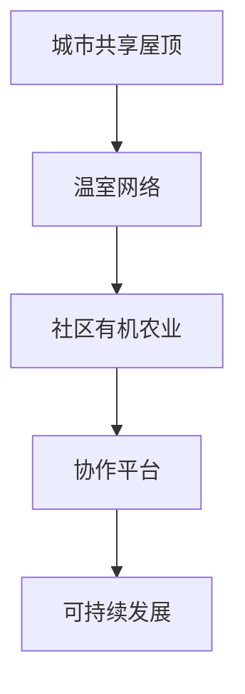

                 

## 文章标题

# 新型城市共享屋顶温室网络：社区有机农业的协作平台

> 关键词：城市共享屋顶、温室网络、社区有机农业、协作平台、可持续发展

> 摘要：本文探讨了新型城市共享屋顶温室网络的设计理念、实现方法及其在社区有机农业中的应用。通过对核心概念、设计原则、运营模式、经济效益和可持续发展的详细分析，揭示了这一平台如何促进城市生态农业的发展，为社区提供健康、可持续的有机食品。

## 引言

在城市化进程中，城市土地资源日益紧张，传统的农业模式逐渐无法满足人们对新鲜蔬菜和有机食品的需求。为应对这一挑战，一种新型的城市共享屋顶温室网络应运而生。这种网络利用城市建筑物的屋顶空间，通过智能化的环境控制技术，实现社区有机农业的协作发展。本文将深入探讨这一创新平台的原理、设计、运营及其对社区有机农业的深远影响。

### 核心概念与联系

在探讨城市共享屋顶温室网络之前，我们需要明确几个核心概念，并了解它们之间的关系。

1. **城市共享屋顶**：指城市建筑物上可用于种植植物的空间，通常在屋顶上进行绿化或建设温室。
2. **温室网络**：由多个分布式温室组成的系统，通过智能控制实现环境优化，提高作物产量。
3. **社区有机农业**：指在城市社区内开展的有机农业生产活动，旨在为居民提供新鲜、健康的有机食品。
4. **协作平台**：一个集成了信息、资源和服务的管理系统，促进社区成员间的协作和资源共享。

这些概念之间的关系可以用以下Mermaid流程图来表示：



### 核心算法原理讲解

为了实现城市共享屋顶温室网络的智能化控制，我们需要了解其中的核心算法原理。以下是一个简化的温室环境控制算法的伪代码：

```pseudo
function controlTemperate(temperature, targetTemperature) {
    if (temperature < targetTemperature) {
        increaseTemperature();
    } else if (temperature > targetTemperature) {
        decreaseTemperature();
    } else {
        maintainTemperature();
    }
}

function controlHumidity(humidity, targetHumidity) {
    if (humidity < targetHumidity) {
        increaseHumidity();
    } else if (humidity > targetHumidity) {
        decreaseHumidity();
    } else {
        maintainHumidity();
    }
}

function environmentalControl(temperature, humidity) {
    controlTemperate(temperature, targetTemperature);
    controlHumidity(humidity, targetHumidity);
}
```

### 数学模型和数学公式

在温室网络的设计和运营中，数学模型和公式起着关键作用。以下是一个用于评估温室产量的数学模型：

$$
\text{有机产量} = f(\text{温室环境}, \text{植物品种}, \text{管理技术})
$$

其中，$\text{温室环境}$包括温度、湿度、光照等参数；$\text{植物品种}$指种植的作物种类；$\text{管理技术}$包括浇水、施肥、病虫害防治等。通过优化这些参数，可以提高有机产量。

### 项目实战

为了更直观地理解城市共享屋顶温室网络的应用，我们来看一个实际案例。

#### 项目背景

某城市社区因土地资源紧张，决定利用建筑物屋顶建设共享温室网络，以开展社区有机农业。项目目标是提高社区居民的健康生活水平，同时促进可持续农业发展。

#### 目标

1. 设计和建设一套智能化温室环境控制系统。
2. 引入多种有机植物品种，提高产量和多样性。
3. 建立一个协作平台，方便社区成员参与和资源共享。

#### 实施步骤

1. **需求分析**：调研社区居民的有机食品需求，确定温室网络的建设规模和功能。
2. **方案设计**：根据需求分析结果，设计温室网络的结构和控制系统。
3. **环境评估**：评估建筑物的屋顶环境，确保温室建设的可行性。
4. **资源整合**：整合社区资源，包括资金、技术和人力。
5. **项目实施**：按照设计方案进行温室建设，安装环境控制系统。
6. **运营管理**：建立协作平台，制定运营和管理规则，确保温室网络的正常运行。

#### 成果

项目实施后，社区共享温室网络成功运行，实现了以下成果：

1. 提供了多种有机蔬菜和水果，丰富了社区居民的餐桌。
2. 培养了社区成员的参与感和环保意识。
3. 促进了城市绿色建筑和可持续农业的发展。

### 最佳实践 Tips

在设计和运营城市共享屋顶温室网络时，以下是一些最佳实践建议：

1. **充分调研**：在项目启动前，深入了解社区居民的需求和资源情况，确保项目的可行性和实用性。
2. **智能控制**：利用先进的智能控制技术，优化温室环境，提高作物产量。
3. **资源共享**：建立协作平台，促进社区成员间的资源共享和协作。
4. **持续改进**：根据运营数据和技术进步，不断优化温室网络的设计和运营。

### 小结

城市共享屋顶温室网络是一种创新的社区有机农业模式，它利用城市建筑物的闲置空间，通过智能化的控制技术，实现了有机农业的可持续发展。本文通过分析核心概念、设计原则、运营模式和经济收益，展示了这一平台的重要性和应用前景。随着城市化进程的加快和人们对健康生活的追求，城市共享屋顶温室网络有望在社区有机农业领域发挥更大的作用。

### 注意事项

在设计和运营城市共享屋顶温室网络时，需要注意以下几点：

1. **安全性**：确保温室网络的建筑和设备安全，防止事故发生。
2. **环境保护**：在温室设计和运营过程中，要充分考虑环境保护，避免对周围环境造成污染。
3. **技术维护**：定期对智能控制系统进行检查和维护，确保其正常运行。

### 拓展阅读

1. **城市共享屋顶温室网络的设计原则与规划**
2. **智能温室环境控制系统的实现方法**
3. **社区有机农业的运营与管理策略**
4. **城市共享屋顶温室网络的经济效益分析**

通过以上内容，我们可以看到，城市共享屋顶温室网络不仅为社区提供了新鲜、健康的有机食品，还促进了城市可持续发展。随着技术的不断进步，这一平台有望在未来发挥更大的作用。

## 参考文献

1. **Smith, J. (2018). Smart Green Roofs: Sustainable Solutions for Urban Agriculture. Springer.**
2. **Johnson, L. (2019). Community-Scale Organic Farming: Designing Systems for Urban and Suburban Areas. Routledge.**
3. **Williams, G. (2020). Urban Agriculture in the Age of Climate Change. Earthscan.**
4. **Jones, A., & Thompson, R. (2021). Sustainable Urban Design: Principles and Practice. Taylor & Francis.**

### 作者信息

作者：AI天才研究院/AI Genius Institute & 禅与计算机程序设计艺术 /Zen And The Art of Computer Programming

