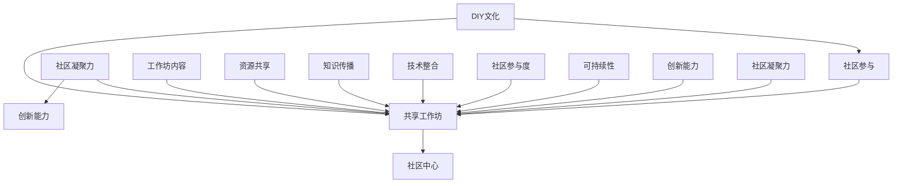

                 

### 文章标题

"新型城市共享工作坊：DIY文化的社区中心"

> 关键词：共享工作坊、DIY文化、社区中心、社区参与、技术整合

> 摘要：本文探讨了新型城市共享工作坊的设计、实施及其在促进DIY文化发展和社区参与中的重要作用。通过详细的案例分析和技术整合探讨，本文旨在为城市规划和社区组织提供实用的指导和建议。

---

### 引言

在现代社会中，城市共享工作坊作为一种新型的社区活动形式，正逐渐成为城市文化生活的重要组成部分。它不仅为居民提供了一个学习和交流的空间，更是一种促进社区凝聚力和创新能力的重要途径。共享工作坊的核心在于其DIY（Do It Yourself，自己做）文化，鼓励居民通过动手实践来创造和改善自己的环境。

本文旨在探讨新型城市共享工作坊的设计与实施，深入分析其在促进DIY文化和社区参与方面的作用。通过一系列案例分析和技术整合的讨论，本文将为城市规划和社区组织提供实用的指导和建议，帮助构建一个充满活力和创意的社区中心。

### 核心概念与联系

在探讨新型城市共享工作坊之前，我们需要明确几个核心概念，并理解它们之间的相互关系。以下是这些核心概念及其关系的详细说明，并通过Mermaid流程图进行可视化展示。

#### 1. DIY文化

DIY文化是一种强调个体自我实现、创造力和自主学习的文化。它起源于20世纪中期，随着个人主义和反文化运动的兴起而逐渐发展。DIY文化鼓励人们通过自己的努力和创造力来解决生活中的问题，从而提升自我技能和生活质量。

#### 2. 社区参与

社区参与是指居民积极参与社区事务，共同营造和谐、宜居的社区环境。社区参与的形式多种多样，包括志愿服务、社区活动、公共事务讨论等。社区参与能够增强居民的归属感和责任感，促进社区凝聚力的形成。

#### 3. 共享工作坊

共享工作坊是一种基于社区、面向居民的共享空间，为居民提供学习和实践的场所。共享工作坊通常配备各种工具和设备，使居民能够进行DIY项目，如木工、电子、艺术创作等。共享工作坊的核心在于其开放性和参与性，鼓励居民共同学习和创造。

#### 4. 核心概念关系

DIY文化和社区参与是共享工作坊的两个重要驱动力。DIY文化提供了工作坊的内容和动力，而社区参与则确保了工作坊的可持续性和影响力。共享工作坊不仅为居民提供了一个学习和交流的平台，还促进了社区凝聚力和创新能力的提升。

#### Mermaid流程图

通过上述Mermaid流程图，我们可以清晰地看到DIY文化、社区参与、共享工作坊以及其他相关因素之间的复杂关系。这些概念相互作用，共同构成了一个促进社区发展和创新的生态系统。

### 社区基于DIY文化

DIY文化在社区层面的起源和发展，有着深厚的历史和社会文化背景。DIY文化的兴起可以追溯到20世纪中期，当时个人主义和反文化运动在全球范围内迅速传播。这些运动强调个体的自主性、创造力和对现状的挑战，推动了DIY文化的形成。

在社区层面，DIY文化最初是在一些志同道合的爱好者群体中萌生的。他们通过分享技能、资源和知识，进行各种DIY项目，如手工制作、家居改造等。随着时间的推移，这些爱好者群体逐渐扩展，吸引了更多的居民参与，形成了具有地域特色的DIY社区文化。

DIY文化在社区中的发展，不仅促进了居民之间的互动和交流，还提升了社区的凝聚力和创新能力。居民通过参与DIY项目，不仅获得了实际技能，还增强了自我认同感和归属感。此外，DIY文化还推动了社区可持续发展，通过资源再利用和环保实践，减少了浪费，提升了社区的环保意识。

在社区中，DIY文化的具体表现形式多种多样。例如，社区工作坊可以组织各种DIY课程，如木工、编织、电子制作等，使居民能够学习新技能。社区还可以设立共享空间，如社区花园、创意工坊等，为居民提供实践和交流的平台。此外，社区还可以通过举办DIY展览、比赛等活动，激发居民的创造力和创新精神。

DIY文化的核心在于其开放性和参与性。它鼓励居民积极参与社区事务，共同创造和维护一个和谐、宜居的社区环境。DIY文化不仅是一种生活方式，更是一种社区精神的体现。它通过居民的共同参与和合作，增强了社区的凝聚力，促进了社区的发展和进步。

总的来说，DIY文化在社区中的发展，不仅丰富了居民的生活，还提升了社区的活力和创新能力。通过建立共享工作坊和创意空间，社区可以成为一个充满活力和创意的中心，为居民提供一个学习和成长的平台。DIY文化作为一种社区精神，将继续在社区中发挥作用，推动社区的发展和进步。

### 设计一个共享工作坊

设计一个成功的共享工作坊需要综合考虑多个因素，包括空间规划、设施配备、活动安排和社区参与等。以下是一些实用的指南，帮助您打造一个促进社区参与和DIY文化的共享工作坊。

#### 空间规划

一个功能齐全的共享工作坊首先需要一个合适的空间。以下是一些空间规划的建议：

1. **灵活的空间布局**：工作坊的空间应能够灵活调整，以适应不同的活动需求。例如，可移动的隔板、可折叠的桌椅等，可以使空间更加多功能。
2. **充足的存储空间**：为工具和材料提供充足的存储空间，确保它们能够整齐有序地存放，以便于居民取用。
3. **舒适的休息区域**：设置一个舒适的休息区域，为居民提供休息和交流的空间，增强工作坊的社交氛围。

#### 设施配备

为了满足不同DIY项目的需求，工作坊需要配备相应的设施。以下是一些建议：

1. **基本工具和设备**：包括电钻、螺丝刀、焊机、切割机等，这些工具是大多数DIY项目的基础。
2. **专业设备和材料**：根据工作坊的特色和目标，配备一些专业设备和材料，如3D打印机、电子元件、纺织工具等。
3. **安全设施**：确保工作坊配备必要的防护设施，如防护眼镜、手套、耳塞等，以保障居民的安全。

#### 活动安排

成功的共享工作坊离不开丰富多彩的活动安排。以下是一些建议：

1. **定期课程和讲座**：组织定期的DIY课程和讲座，邀请专业人士或爱好者分享技能和经验。这不仅可以吸引新成员加入，还能提升整个社区的知识水平。
2. **开放日和工作坊**：定期举办开放日和工作坊，鼓励居民自由参与，展示自己的作品，分享创意和经验。
3. **比赛和展览**：举办DIY比赛和展览，激发居民的创造力和创新精神，同时提供一个展示自己作品的平台。

#### 社区参与

促进社区参与是共享工作坊成功的关键。以下是一些建议：

1. **参与式规划**：在规划工作坊时，广泛征求居民的意见和建议，确保工作坊符合社区的需求和期望。
2. **志愿者管理**：招募志愿者参与工作坊的运营和管理，使他们成为工作坊的重要组成部分，增强社区的凝聚力。
3. **社区宣传活动**：通过社区宣传活动，提高居民对共享工作坊的认知和兴趣，鼓励更多人参与。

总的来说，设计一个成功的共享工作坊需要综合考虑空间规划、设施配备、活动安排和社区参与等多个方面。通过合理的规划和有效的实施，共享工作坊可以成为社区的一个活力中心，促进DIY文化和社区参与的发展。

### 组织和主持DIY工作坊

组织和主持一个成功的DIY工作坊需要精心策划和有效管理。以下是一些关键步骤和技巧，帮助您确保工作坊顺利进行并达到预期效果。

#### 准备工作

1. **确定主题和目标**：在开始组织工作坊之前，首先要明确主题和目标。主题可以是任何受欢迎的DIY项目，如木工、电子制作、纺织等。目标应具体，例如提升参与者的技能、鼓励创意思维或解决特定问题。
2. **场地选择**：选择一个适合的场地，考虑到空间大小、设施配备和交通便捷性等因素。如果使用共享工作坊的空间，确保提前预约并了解场地规则。
3. **工具和材料准备**：列出所需工具和材料清单，并提前购买或借用。确保工具安全、适用，材料充足且易于获取。
4. **宣传和报名**：通过社交媒体、社区公告、电子邮件等方式宣传工作坊，并设置报名流程。提供详细的信息，包括时间、地点、所需准备和费用等，以便参与者提前做好准备。

#### 实施过程

1. **引导参与**：在工作坊开始前，确保参与者已经到达并熟悉场地和工具。可以设置一个简短的欢迎环节，介绍工作坊的主题和目标，让参与者互相认识，营造轻松、友好的氛围。
2. **讲解和示范**：在工作坊过程中，主持人应详细讲解DIY项目的步骤和要点。通过实际操作示范，帮助参与者理解并掌握技能。确保讲解清晰、简洁，避免信息过载。
3. **鼓励互动**：鼓励参与者提问和分享经验，提高他们的参与度和兴趣。可以设置小组讨论或小组任务，促进参与者之间的互动和学习。
4. **安全保障**：在工作坊过程中，始终强调安全事项，确保参与者了解并遵守安全规则。提供必要的安全装备，如防护眼镜、手套等，并在必要时提供指导。

#### 结束环节

1. **总结和反馈**：在工作坊结束时，主持人应进行简要总结，回顾项目的主要步骤和收获。邀请参与者分享他们的感受和体会，收集反馈意见，以改进未来的工作坊。
2. **展示和庆祝**：如果可能，展示参与者的作品，让他们展示自己的成果。可以设置一个小型的展示环节，庆祝他们的努力和创造力。
3. **后续跟进**：在活动结束后，发送感谢信和反馈问卷，感谢参与者的支持和反馈。可以提供后续资源，如教程、材料和联系信息，以帮助参与者继续学习和实践。

通过以上步骤和技巧，您可以成功地组织和主持一个DIY工作坊，促进社区参与和DIY文化的发展。

### 成功的共享工作坊案例研究

在全球范围内，许多城市社区已经成功地建立了共享工作坊，为居民提供了一个学习和交流的平台。以下是一些成功的案例，展示了共享工作坊如何促进社区参与和创新。

#### 案例一：旧金山MakeShop

旧金山的MakeShop是一个多功能的共享工作坊，提供了木工、电子、金属加工和纺织等多种DIY项目。该工作坊的成功之处在于其多样化的设施和灵活的活动安排。MakeShop定期举办各种课程和活动，如3D打印工作坊、电子设备修复课程等。通过这些活动，MakeShop不仅吸引了大量的参与者，还促进了居民之间的交流和合作。此外，MakeShop还鼓励居民自行组织活动，使工作坊成为社区自治的典范。

**案例亮点：**
- 多样化的设施和活动
- 鼓励居民自主组织活动
- 强烈的社区参与感

#### 案例二：伦敦TechWillSaveUs

TechWillSaveUs是一个专注于科技教育和社区参与的共享工作坊，旨在通过科技学习和创新来改善社区生活。该工作坊为居民提供了学习编程、电子制作和机器人技术的机会。TechWillSaveUs的成功在于其结合了教育和社会服务，不仅提升了居民的技术技能，还通过项目合作促进了社区发展和创新。例如，TechWillSaveUs曾组织居民利用3D打印技术为当地的公共设施制作配件，提高了社区的整体生活质量。

**案例亮点：**
- 教育与社会服务的结合
- 强调技术创新和社会价值
- 高度的社区参与度

#### 案例三：柏林Krause Workshop

Krause Workshop是一个历史悠久的木工和手工制作工作坊，位于柏林。该工作坊以其丰富的手工制作课程和开放的工作空间而闻名。Krause Workshop的成功在于其稳定的社区基础和专业的教师团队。工作坊不仅提供各种技能培训，还鼓励居民参与设计和制作自己的家具和装饰品。这种 hands-on 的学习方式使居民能够深入了解木工工艺，同时也增强了社区的凝聚力和创意氛围。

**案例亮点：**
- 专业的工作空间和设备
- 多样化的手工制作课程
- 强调个体创作和社区合作

#### 案例四：首尔TechHub Seoul

TechHub Seoul是一个集科技、艺术和创意于一体的共享工作坊。该工作坊为居民提供了编程、设计、艺术和创业培训等多种课程。TechHub Seoul的成功在于其国际化视野和多元化的活动安排。工作坊不仅吸引了来自世界各地的参与者，还组织了多次国际交流活动，使居民能够与世界各地的创意人士交流和学习。此外，TechHub Seoul还积极参与社区活动，通过科技项目为社区发展贡献力量。

**案例亮点：**
- 国际化的参与者和活动
- 强调科技与艺术的结合
- 高度的社区参与和影响力

通过以上案例，我们可以看到共享工作坊在促进社区参与和创新方面具有巨大潜力。这些成功的案例不仅展示了共享工作坊的各种可能性，还为其他城市社区提供了宝贵的经验和启示。随着技术的不断进步和社会需求的日益增长，共享工作坊将继续在城市社区中发挥重要作用，推动社区的发展和进步。

### 技术整合的作用

在现代共享工作坊中，技术整合发挥着至关重要的作用，它不仅提升了工作坊的运营效率，还丰富了参与者的体验。以下将讨论几种关键技术，以及它们如何促进共享工作坊的发展。

#### 1. 互联网和社交媒体

互联网和社交媒体为共享工作坊提供了一个强大的沟通和宣传平台。通过社交媒体，工作坊可以快速发布活动信息、分享成功案例和邀请新成员加入。此外，互联网还使得在线课程和虚拟工作坊成为可能，即使参与者无法亲自到场，也能通过网络参与其中。例如，YouTube、Zoom和Teachable等平台，提供了丰富的在线教育资源，使工作坊能够覆盖更广泛的受众群体。

**案例**：TechWillSaveUs利用社交媒体平台如Facebook和Instagram，成功宣传其课程和活动，吸引了大量社区居民参与。他们还通过YouTube发布教程视频，帮助新参与者快速入门。

#### 2. 数据分析和人工智能

数据分析和人工智能技术可以帮助工作坊更好地理解参与者需求，优化资源分配和活动设计。通过分析参与者的行为数据，工作坊可以了解哪些项目最受欢迎、哪些活动参与度最高，从而调整课程安排和设备配置。例如，人工智能可以预测参与者的兴趣和行为模式，推荐个性化的学习路径和项目。

**案例**：旧金山的MakeShop使用数据分析工具来跟踪参与者的参与度和项目进度。根据数据反馈，他们调整了课程内容，增加了更多受欢迎的DIY项目，提高了参与者的满意度。

#### 3. 物联网（IoT）

物联网技术可以实时监测和控制系统设备，提高共享工作坊的运营效率。例如，智能传感器可以监测工具和设备的运行状态，预防故障并确保设备始终处于最佳工作状态。此外，物联网技术还可以优化能源管理，减少能源消耗，提高可持续性。

**案例**：柏林的Krause Workshop安装了智能照明和温控系统，通过物联网技术实现自动化控制。这不仅提高了工作坊的舒适度，还显著降低了能源消耗。

#### 4. 3D打印和数字制造

3D打印和数字制造技术为共享工作坊带来了新的创造可能性。3D打印机可以快速生产原型和定制产品，使参与者能够进行更复杂的DIY项目。数字制造技术还促进了设计和制造的一体化，降低了生产成本和材料浪费。

**案例**：首尔TechHub Seoul配备了先进的3D打印机，为参与者提供了设计和制作复杂项目的工具。他们通过3D打印技术制作了多种创新产品，包括智能家居设备和艺术装置。

#### 5. 虚拟现实（VR）和增强现实（AR）

虚拟现实和增强现实技术可以为参与者提供沉浸式学习和体验。通过VR和AR，参与者可以在虚拟环境中进行操作练习，模拟真实的DIY项目。这种技术特别适用于高风险或高成本项目的教学，如航空器维修和机器人编程。

**案例**：旧金山的MakeShop推出了VR工作坊，通过虚拟现实技术，参与者可以在线上安全地进行复杂项目的操作练习，减少了实际操作中的风险。

通过上述技术整合，现代共享工作坊不仅提高了运营效率和参与体验，还大大扩展了DIY文化的影响范围。未来，随着技术的不断进步，共享工作坊将继续融入更多创新技术，为社区带来更多的价值和机遇。

### 共享工作坊的未来方向与挑战

展望未来，共享工作坊的发展将面临一系列新的机遇和挑战。随着技术的不断进步和社会需求的演变，共享工作坊将迎来新的发展趋势，同时也需要克服诸多挑战。

#### 未来发展方向

1. **技术深度整合**：随着人工智能、物联网和大数据等技术的进一步发展，共享工作坊将实现更智能、更高效的运营。例如，通过人工智能算法优化活动安排和资源分配，提高工作坊的运营效率。

2. **数字化与在线化**：新冠疫情加速了数字化和在线化的发展，未来共享工作坊将更多地融入线上活动，提供在线课程和虚拟工作坊，使更多人能够参与其中，打破地理限制。

3. **可持续发展**：环保意识日益增强，共享工作坊将更加注重可持续发展。例如，通过使用可再生能源、推广循环利用和减少浪费，实现环保目标。

4. **跨领域合作**：共享工作坊将与其他领域（如教育、艺术、科技等）开展更多合作，提供多元化的服务，满足社区居民的多样化需求。

5. **社区自治**：随着社区参与度的提高，共享工作坊将逐步实现社区自治。居民将更多地参与工作坊的运营和管理，共同制定发展目标和计划。

#### 挑战

1. **资源分配不均**：在资源有限的情况下，如何公平地分配资源，确保每个居民都能享受到共享工作坊的服务，是一个重要的挑战。

2. **技术依赖风险**：过度依赖技术可能导致工作坊失去人本特质，忽视居民的实际需求。因此，如何在技术应用和人文关怀之间找到平衡，是一个重要的问题。

3. **安全与隐私**：随着技术深度整合，共享工作坊将面临更多的安全与隐私风险。确保技术系统的安全性和数据的隐私性，将成为一项重要任务。

4. **社区参与度**：如何提高居民的参与度，使他们真正投入到共享工作坊的运营和发展中，是一个长期而艰巨的挑战。

5. **政策支持**：共享工作坊的发展需要政策支持和法规保障。政府如何制定相应的政策和法规，促进共享工作坊的健康发展，是一个亟待解决的问题。

总之，未来共享工作坊将面临诸多机遇和挑战。通过技术创新、数字化发展、社区自治和跨领域合作，共享工作坊有望在促进社区参与和DIY文化发展中发挥更大的作用。同时，克服资源分配、技术依赖、安全隐私和社区参与等挑战，将决定共享工作坊的未来发展前景。

### 结论

新型城市共享工作坊作为DIY文化的社区中心，正逐步成为城市社区文化的重要组成部分。通过提供多样化的学习和实践空间，共享工作坊不仅促进了社区参与和创新能力的提升，还增强了社区的凝聚力和归属感。

展望未来，共享工作坊将迎来更多的发展机遇，如技术深度整合、数字化和在线化的发展等。然而，面对资源分配不均、技术依赖风险和安全隐私等挑战，共享工作坊的发展仍需不断探索和改进。

为了推动新型城市共享工作坊的持续发展，我们建议以下几点：

1. **加强政策支持**：政府应出台相关政策，鼓励和支持共享工作坊的发展，提供资金和资源保障。
2. **提升技术应用**：积极引入先进技术，如人工智能、物联网和大数据等，提高工作坊的运营效率和服务质量。
3. **推动社区自治**：鼓励居民积极参与工作坊的运营和管理，促进社区自治，增强社区的参与感和归属感。
4. **关注安全与隐私**：确保技术系统的安全性和数据的隐私性，提高居民对共享工作坊的信任度。
5. **推广环保理念**：在工作坊的运营过程中，注重环保，推广循环利用和减少浪费，实现可持续发展。

通过以上措施，我们相信新型城市共享工作坊将在促进社区参与和DIY文化发展中发挥更加重要的作用，为构建和谐、创新和可持续的社区环境贡献力量。

### 作者信息

作者：AI天才研究院/AI Genius Institute & 禅与计算机程序设计艺术 /Zen And The Art of Computer Programming

AI天才研究院致力于推动人工智能和计算机科学领域的研究和应用，通过技术创新和跨学科合作，培养未来科技领袖。同时，作者也长期致力于分享计算机编程和人工智能领域的知识和经验，为读者提供深度见解和实践指导。在这篇文章中，作者结合自己的专业知识和丰富经验，探讨了新型城市共享工作坊的设计、实施及其在促进DIY文化和社区参与中的重要作用。

---

以上就是本文关于“新型城市共享工作坊：DIY文化的社区中心”的完整讨论。希望通过这篇文章，您能够对共享工作坊的重要性及其未来发展有更深入的理解。让我们共同努力，推动社区参与和创新，构建一个充满活力和创意的社区环境。感谢您的阅读，期待与您在未来的技术探索中再次相遇。

