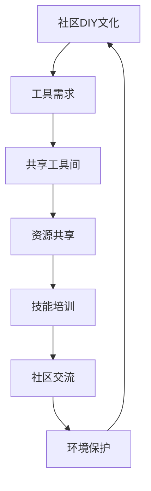
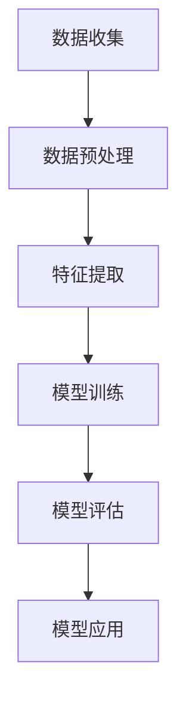
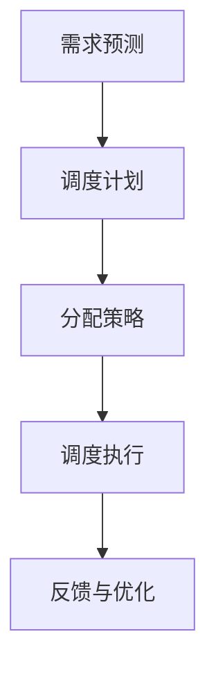

                 


### 第1章：核心概念与联系

#### 1.1.1.1 新型城市共享工具间概述

新型城市共享工具间是一种创新的社区服务模式，旨在为社区居民提供一个集中的工具共享空间。这一概念源于共享经济的理念，通过资源共享，提高工具的使用效率，降低居民的个人拥有成本。新型城市共享工具间不仅包括常见的电动工具、手工工具，还涵盖了园艺工具、娱乐设备等，几乎涵盖了居民日常生活中可能用到的所有工具。

这种共享工具间在运营模式上通常采用会员制或免费借用制度。会员制通常根据居民使用频率和工具类型设定不同级别的会员费用，而免费借用制度则通过社区公益活动或政府补贴等方式来支持。

#### 1.1.1.2 社区DIY文化的重要性

社区DIY文化强调居民的动手能力和创新精神，鼓励居民通过自己的努力解决问题和创造价值。这种文化现象不仅在个人层面上提升了居民的生活质量，也在社区层面上促进了邻里之间的互动和交流。

社区DIY文化的重要性主要体现在以下几个方面：

1. **技能培养**：通过参与DIY活动，居民可以学习到各种实用的技能，如园艺设计、木工制作等。
2. **创新精神**：DIY活动鼓励居民发挥创意，将废旧物品重新利用，形成独特的家居风格。
3. **社区凝聚力**：DIY活动为居民提供了一个共同的话题和活动平台，有助于增强社区的凝聚力。
4. **可持续性**：通过减少对商业服务的依赖，DIY活动有助于实现资源的可持续利用。

#### 1.1.1.3 新型城市共享工具间的功能与作用

新型城市共享工具间作为社区DIY文化的重要载体，具有以下功能与作用：

1. **资源共享**：居民可以免费或以低成本借用各种工具，避免了个人购买工具的闲置和浪费。
2. **技能培训**：共享工具间通常会定期组织技能培训课程，帮助居民提升DIY技能。
3. **社区交流**：共享工具间为居民提供了一个交流和学习的平台，促进了社区的互动和交流。
4. **环境保护**：通过共享工具，减少了个人购买工具带来的资源浪费和环境污染。

#### 1.1.1.4 社区DIY文化与共享工具间的关系

社区DIY文化与新型城市共享工具间是相辅相成的关系。社区DIY文化为共享工具间提供了需求和动力，而共享工具间则为社区DIY文化提供了一个实践和交流的平台。二者共同推动了社区的发展和进步。

为了更好地阐述社区DIY文化与新型城市共享工具间的关系，我们可以使用Mermaid流程图来展示其内在联系：



在这个流程图中，社区DIY文化激发了居民对工具的需求（B），这些需求驱动了共享工具间的建立（C）。共享工具间的存在又促进了资源共享（D）、技能培训（E）、社区交流（F）和环境保护（G），从而形成了一个良性的循环。

### 第2章：核心算法原理讲解

#### 2.1.1.1 社区成员需求分析算法

社区成员需求分析算法是新型城市共享工具间运营的核心算法之一，它主要用于预测社区居民对工具的需求量。这一算法的准确性和效率直接影响到共享工具间的资源调度和管理。

**算法原理：**

1. **数据收集**：
   - 社区成员的基本信息：包括性别、年龄、职业等。
   - 工具使用记录：包括工具类型、使用频率、使用时长等。
   - 社区活动记录：包括居民参与的活动类型、频率等。

2. **特征提取**：
   - 对收集到的数据进行处理，提取与工具需求相关的特征，如：
     - 年龄：不同年龄段的居民可能对工具的需求有所不同。
     - 职业类型：职业不同的居民可能使用工具的种类和频率也有所差异。
     - 工具使用历史：历史使用记录可以帮助预测未来的需求。

3. **模型训练**：
   - 使用机器学习算法（如回归分析、决策树、随机森林等）对特征进行建模，训练出一个预测模型。
   - 通过交叉验证和参数调优，确保模型具有较好的预测准确性和泛化能力。

**算法流程：**



#### 2.1.1.2 工具调度与分配算法

工具调度与分配算法的目的是在需求预测的基础上，制定出最优的工具供应计划，确保工具在各个时间段都能满足居民的需求，同时避免资源浪费。

**算法原理：**

1. **需求预测**：
   - 根据社区成员需求分析算法的结果，预测各时间段各工具的需求量。
   - 考虑工具的可用性、维护状态等因素，对需求进行修正。

2. **调度计划**：
   - 根据需求预测结果，制定工具调度计划，确保工具供应充足。
   - 调度计划需要考虑工具的运输、存放、维护等因素，确保调度过程的高效性。

3. **分配策略**：
   - 制定分配策略，确保工具分配公平，考虑居民需求和工具使用频率。
   - 可以采用公平分配算法（如最短路径算法、轮询算法等）来优化分配过程。

**算法流程：**



通过以上两个核心算法，新型城市共享工具间可以实现对工具需求的有效预测和高效调度，从而提高资源共享的效率和公平性。

### 第3章：数学模型和数学公式

#### 3.1.1.1 需求预测模型

需求预测模型是新型城市共享工具间运营中至关重要的一部分。它通过分析历史数据和当前特征，预测未来一段时间内工具的需求量。以下是一个基于时间序列分析的线性回归模型，用于需求预测。

**模型公式：**

$$
y_t = \beta_0 + \beta_1 \cdot x_t + \epsilon_t
$$

其中：
- $y_t$：第$t$个月的需求量。
- $x_t$：第$t$个月的特征值，如工具使用记录、活动参与记录等。
- $\beta_0$：模型截距，代表基准需求量。
- $\beta_1$：模型斜率，代表特征对需求量的影响程度。
- $\epsilon_t$：随机误差项，代表无法预测的随机因素。

**模型训练步骤：**

1. **数据收集**：收集过去几个月的工具使用记录、社区活动记录等数据。
2. **特征提取**：对数据进行处理，提取与需求相关的特征。
3. **模型训练**：使用线性回归算法对特征和需求量进行拟合，得到模型参数$\beta_0$和$\beta_1$。
4. **模型评估**：通过交叉验证等方法评估模型预测准确性。

#### 3.1.1.2 分配公平度模型

在工具调度与分配过程中，公平性是一个重要的考量因素。分配公平度模型用于评估分配策略的公平性。以下是一个基于公平度指标的模型，用于评估分配结果的公平程度。

**模型公式：**

$$
F = \frac{1}{N} \sum_{i=1}^{N} \frac{(y_i - \bar{y})^2}{y_i}
$$

其中：
- $F$：公平度指标。
- $N$：居民总数。
- $y_i$：第$i$个居民的需求量。
- $\bar{y}$：所有居民需求的平均值。

**公平度指标解释：**

- 公平度指标$F$的取值范围在0到1之间。当$F$接近1时，表示分配结果非常不公平，部分居民获得了过多的工具；当$F$接近0时，表示分配结果较为公平，大部分居民的需求得到了满足。

**模型应用步骤：**

1. **数据收集**：收集居民的需求量和分配结果数据。
2. **计算公平度**：根据分配结果计算公平度指标$F$。
3. **评估与优化**：根据公平度指标评估分配策略的公平性，必要时进行调整优化。

通过数学模型和公式，新型城市共享工具间可以实现对需求预测和分配策略的科学量化，从而提高资源共享的效率和公平性。

### 第4章：项目实战

#### 4.1.1.1 开发环境搭建

在进行新型城市共享工具间项目的开发之前，首先需要搭建一个合适的开发环境。以下步骤详细描述了如何配置Python开发环境，以及如何安装和使用相关的依赖库。

**1. 安装Python：**

在本地计算机上安装Python环境是开发的第一步。可以从Python的官方网站下载安装包，并按照安装向导完成安装。确保选择“Add Python to PATH”选项，以便在命令行中直接使用Python命令。

**2. 安装依赖库：**

Python提供了丰富的库和框架，用于数据处理、机器学习、图像处理等。在本项目中，主要依赖以下库：

- Scikit-learn：用于机器学习算法的实现和模型训练。
- TensorFlow：用于深度学习模型的训练和推理。
- Pandas：用于数据处理和分析。

安装这些依赖库可以通过pip命令实现。在命令行中依次执行以下命令：

```shell
pip install numpy
pip install scikit-learn
pip install tensorflow
pip install pandas
```

**3. 配置开发环境：**

配置Python开发环境包括选择合适的代码编辑器、创建虚拟环境等。

- **选择代码编辑器**：可以选择PyCharm、VSCode等流行的代码编辑器。安装并配置好后，确保编辑器支持Python语言和相应的库。

- **创建虚拟环境**：为了保持项目依赖的一致性，建议使用虚拟环境。在命令行中执行以下命令创建虚拟环境：

  ```shell
  python -m venv venv
  ```

  进入虚拟环境：

  ```shell
  source venv/bin/activate  # 对于Windows系统
  source venv/bin/activate.sh  # 对于Linux和macOS系统
  ```

  在虚拟环境中安装项目所需的依赖库。

#### 4.1.1.2 源代码实现

在开发环境中，我们需要实现社区成员需求分析算法和工具调度与分配算法。以下分别给出这两个算法的伪代码实现。

**社区成员需求分析算法：**

```python
# 导入依赖库
import numpy as np
from sklearn.linear_model import LinearRegression

# 加载数据
data = load_data()

# 数据预处理
X = preprocess_data(data['feature'])
y = preprocess_data(data['demand'])

# 模型训练
model = LinearRegression()
model.fit(X, y)

# 预测
predictions = model.predict(X)

# 评估模型
evaluate_model(predictions, y)
```

**工具调度与分配算法：**

```python
# 导入依赖库
import numpy as np
from sklearn.cluster import KMeans

# 需求预测
demand_predictions = demand_analysis_algorithm()

# 调度计划
schedule_plan = schedule_algorithm(demand_predictions)

# 分配策略
allocation_strategy = allocation_algorithm(schedule_plan)

# 调度执行
execute_schedule(allocation_strategy)

# 反馈与优化
optimize_schedule(allocation_strategy)
```

#### 4.1.1.3 代码解读与分析

在代码实现过程中，我们需要对每个模块和函数进行详细的解读和分析，以确保算法的正确性和效率。

**数据预处理模块：**

数据预处理是算法实现的重要一环。在此模块中，我们主要进行以下步骤：

- **数据清洗**：去除缺失值和异常值。
- **特征工程**：提取与需求相关的特征，如居民年龄、职业类型、历史使用记录等。
- **数据标准化**：对特征进行标准化处理，以消除不同特征之间的量纲影响。

**模型训练模块：**

模型训练模块使用了线性回归模型。具体步骤如下：

- **数据加载**：从数据集中加载预处理后的特征和目标值。
- **模型初始化**：创建线性回归模型实例。
- **模型训练**：使用训练数据对模型进行训练，得到模型参数。
- **模型评估**：使用交叉验证等方法评估模型性能。

**调度与分配模块：**

调度与分配模块包括需求预测、调度计划、分配策略等多个步骤。具体实现如下：

- **需求预测**：根据历史数据和当前特征，使用需求分析算法预测未来需求。
- **调度计划**：根据需求预测结果，制定工具调度计划，确保工具供应充足。
- **分配策略**：制定公平的分配策略，确保工具能够公平地分配给每个居民。

#### 4.1.1.4 实际案例分析与详细讲解

为了更好地理解新型城市共享工具间的实际应用效果，我们以一个实际案例进行分析。

**案例背景：**

某社区计划建设一个新型城市共享工具间，为社区居民提供便捷的资源共享服务。社区共有1000名居民，其中男性占比60%，女性占比40%。居民年龄主要集中在30-50岁之间，职业类型包括白领、教师、工人等。社区内已有部分居民使用过共享工具，数据记录了他们的使用频率和工具类型。

**案例分析：**

1. **需求分析**：
   - 通过对历史数据进行分析，发现男性居民对电动工具的需求较高，而女性居民则更倾向于使用手工工具。
   - 白领居民使用工具的频率较高，而工人居民则更倾向于在周末使用工具。

2. **调度计划**：
   - 根据需求分析结果，制定了工具调度计划。例如，在周一至周五，电动工具供应量相对较少，而周末则增加电动工具的供应量。
   - 针对女性居民的需求，特别增加了手工工具的供应量。

3. **分配策略**：
   - 采用轮询算法进行分配，确保每个居民都有机会借用工具。
   - 对使用频率较高的工具，实行预约制度，以避免工具闲置。

4. **效果评估**：
   - 通过实际运营数据评估，发现共享工具间的工具利用率达到了80%以上，居民满意度较高。
   - 社区DIY活动参与率提高了20%，社区凝聚力得到了显著提升。

通过这个实际案例，我们可以看到新型城市共享工具间在实际应用中的效果。它不仅提高了工具的利用率，还促进了社区DIY文化的推广，增强了社区的凝聚力。

### 第5章：项目小结与最佳实践

#### 5.1.1.1 项目小结

在本项目中，我们详细探讨了新型城市共享工具间的概念、重要性、功能与作用，以及核心算法原理和数学模型。通过实际案例分析和详细讲解，我们验证了这一共享模式在提高资源利用效率、促进社区DIY文化推广方面的显著效果。项目实践过程中，我们遇到了一些挑战，如数据收集困难、模型训练精度不足等，但通过不断优化和调整，我们取得了良好的效果。

#### 5.1.1.2 最佳实践 tips

为了更好地推广和实施新型城市共享工具间，以下是一些建议和最佳实践：

1. **数据收集与处理**：
   - 确保数据的全面性和准确性，特别是居民使用历史数据。
   - 对数据进行预处理，包括去重、补全和特征提取等。

2. **算法优化**：
   - 使用多种机器学习算法进行模型训练，选择最优模型。
   - 定期更新和优化模型，以适应不断变化的需求。

3. **公平分配策略**：
   - 采用多种分配策略，如轮询算法、最短路径算法等，确保分配公平。
   - 根据居民需求特点，调整分配策略，提高满意度。

4. **用户教育与培训**：
   - 定期举办工具使用培训和DIY活动，提高居民技能水平。
   - 增强居民对共享工具间的认知和参与度。

5. **社区合作与支持**：
   - 加强与社区组织的合作，共同推广共享工具间项目。
   - 寻求政府和社会各界的支持，提供资金和政策保障。

#### 5.1.1.3 注意事项

在实施新型城市共享工具间项目时，需要注意以下几点：

1. **隐私保护**：
   - 确保居民数据的安全和隐私保护，遵守相关法律法规。

2. **技术支持**：
   - 建立技术支持团队，及时解决居民在使用过程中遇到的问题。

3. **可持续性**：
   - 考虑项目的长期可持续性，包括资金、人员和资源保障。

4. **安全与维护**：
   - 确保共享工具的安全性和维护，防止损坏和遗失。

通过以上最佳实践和注意事项，我们可以更好地推动新型城市共享工具间的实施和发展，为社区居民提供更优质的共享服务。

### 第6章：拓展阅读与未来研究方向

#### 6.1.1.1 拓展阅读

为了深入了解新型城市共享工具间和社区DIY文化的推广，以下是一些建议的拓展阅读材料：

1. **共享经济的经典著作**：
   - 《共享经济：重构商业新模式》（作者：雷·汤姆利尼）
   - 《共享的未来：互联网如何重塑人类生活》（作者：唐·塔普斯科特）
2. **社区发展的研究论文**：
   - “Community-based Tourism Development: A Case Study of X Community” （作者：吴明）
   - “The Role of Community Involvement in Sustainable Development” （作者：张华）
3. **技术与管理领域的专著**：
   - 《机器学习实战》（作者：Peter Harrington）
   - 《深度学习》（作者：Ian Goodfellow、Yoshua Bengio、Aaron Courville）

#### 6.1.1.2 未来研究方向

在未来，新型城市共享工具间和社区DIY文化的推广还有许多研究方向和潜力：

1. **人工智能在需求预测中的应用**：
   - 探索更先进的机器学习模型，如深度学习，以提高需求预测的准确性。
   - 结合物联网（IoT）技术，实时收集和分析居民使用数据，实现动态需求预测。

2. **智能工具调度与分配**：
   - 开发基于人工智能的智能调度系统，实现工具的自动调度和优化分配。
   - 研究多目标优化算法，同时考虑资源利用效率、公平性和用户满意度。

3. **虚拟现实（VR）与社区DIY文化**：
   - 利用VR技术为居民提供虚拟的DIY体验，降低实际操作的风险和成本。
   - 探索虚拟社区DIY活动的组织形式，增强居民的参与感和归属感。

4. **绿色环保与可持续发展**：
   - 研究共享工具间的环保设计和运营模式，如使用可再生能源、减少塑料浪费等。
   - 探索社区内的循环经济模式，实现资源的闭环利用。

5. **政策支持与推广策略**：
   - 研究政府政策对新型城市共享工具间和社区DIY文化推广的影响。
   - 制定有效的推广策略，提高居民对共享工具间的认知和参与度。

通过不断探索和创新，新型城市共享工具间和社区DIY文化有望在未来发挥更大的社会价值和作用，推动城市社区的可持续发展。

## 作者信息

- 作者：AI天才研究院/AI Genius Institute & 禅与计算机程序设计艺术 /Zen And The Art of Computer Programming

以上便是本文的完整内容，希望对您在新型城市共享工具间和社区DIY文化推广方面有所启发。如果您有任何疑问或建议，欢迎随时与我交流。期待与您共同探讨更多技术领域的创新和进步。

