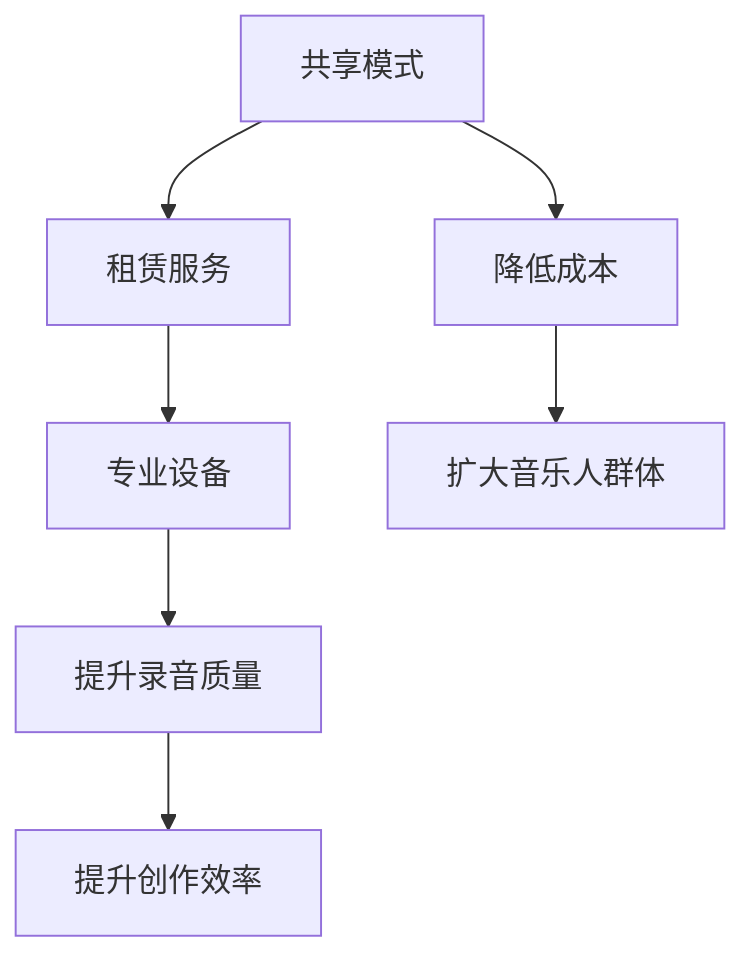
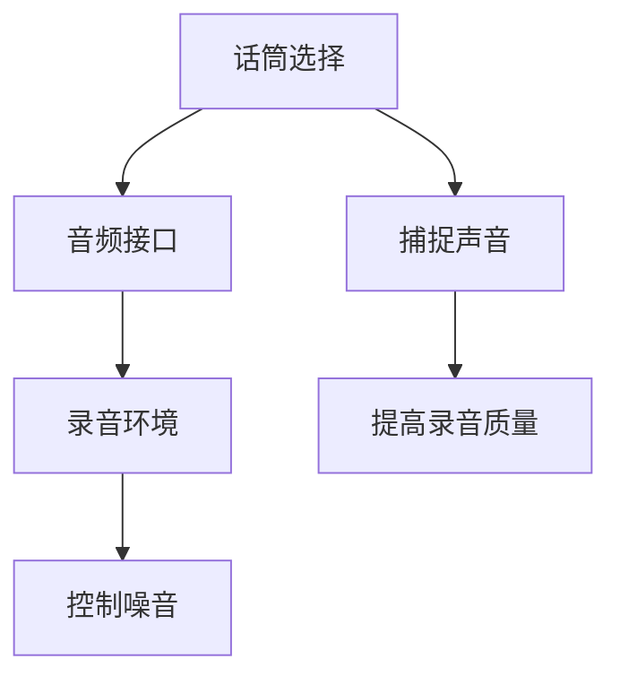
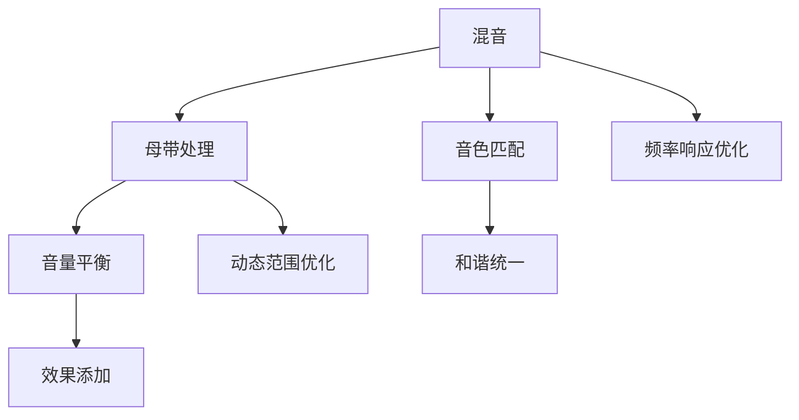
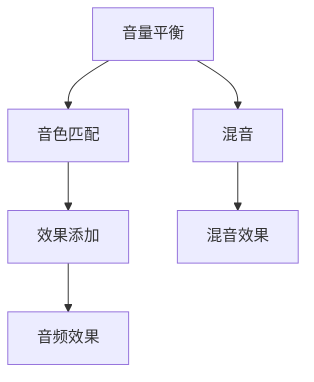
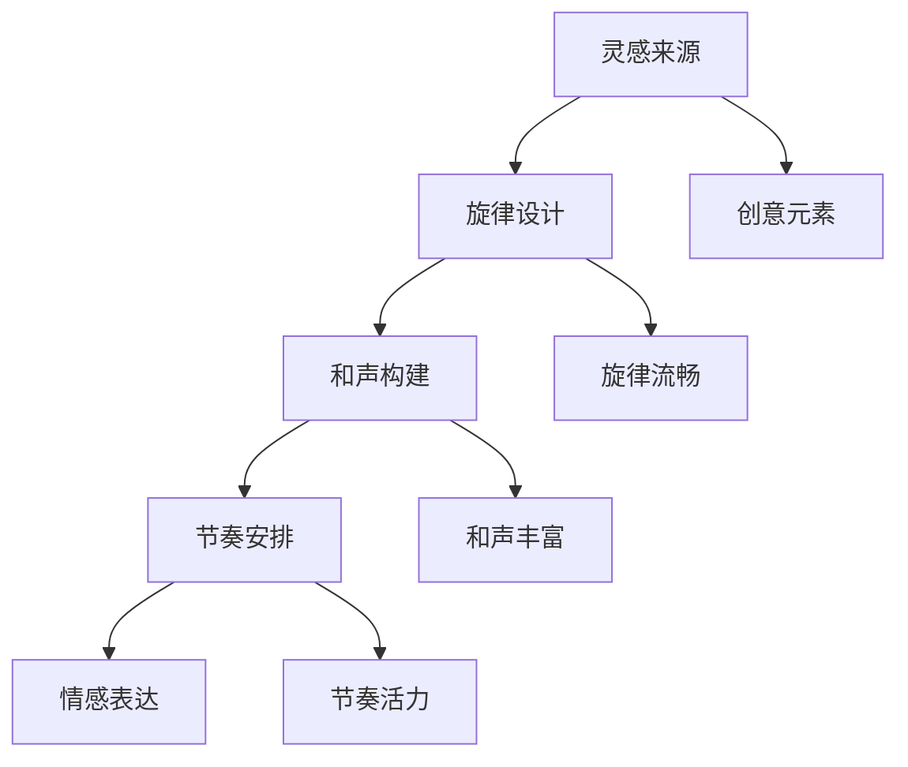
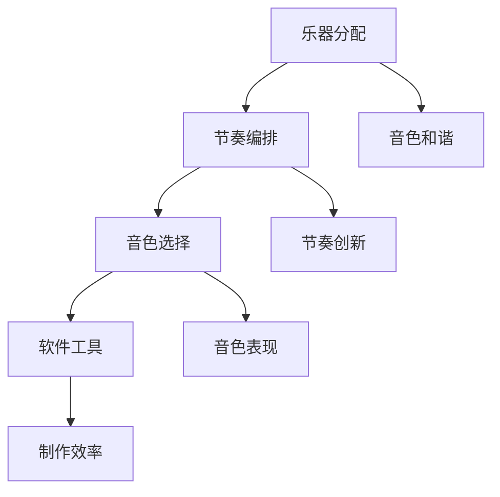

                 

### 文章标题：新型城市共享录音棚：业余音乐人的专业制作空间

## 关键词
- 新型城市共享录音棚
- 音乐制作
- 业余音乐人
- 专业制作空间
- 录音技术
- 混音与母带处理
- 音乐创作与编曲
- 成品发布与推广

## 摘要
本文旨在探讨新型城市共享录音棚的概念、功能及其对业余音乐人创作的重要性。文章首先介绍了共享录音棚的定义和基本结构，随后深入分析了录音棚搭建、音频处理技术、音乐制作流程以及成品发布与推广的各个环节。通过实例解析和最佳实践分享，本文为业余音乐人提供了专业的制作指南，旨在提升他们的音乐创作水平。

### 1. 书籍概述

《新型城市共享录音棚：业余音乐人的专业制作空间》是一本专为业余音乐人量身打造的指南书籍，旨在帮助他们在新型城市共享录音棚中实现专业级音乐制作。随着音乐制作技术的发展和共享经济的兴起，共享录音棚成为了一个新兴的领域，为业余音乐人提供了更加便捷和经济的创作环境。

本书的主要内容分为四个部分：

- **第一部分：基础与准备**：介绍共享录音棚的兴起背景、定义与基本结构，帮助读者了解搭建录音棚的基础知识。
- **第二部分：音频处理技术**：详细讲解音频录制、编辑、混音和母带处理等技术，涵盖话筒选择、录音环境优化、音频剪辑和效果处理等核心内容。
- **第三部分：音乐制作流程**：从音乐创作到编曲，再到成品发布，全面解析音乐制作的各个环节，帮助读者掌握完整的制作流程。
- **第四部分：案例与实践**：通过实际案例分享，提供具体的项目操作步骤和实战技巧，助力读者将理论知识应用到实际制作中。

### 2. 目录大纲设计

为了确保书籍内容的逻辑性和实用性，我们将目录分为以下几个部分：

#### 第一部分：基础与准备

##### 第1章：新型城市共享录音棚概述
- **1.1** 城市共享录音棚的兴起与发展
- **1.2** 共享录音棚对业余音乐人的意义
- **1.3** 共享录音棚与传统录音棚的对比

##### 第2章：搭建共享录音棚的基础知识
- **2.1** 共享录音棚的搭建流程
- **2.2** 必备设备与器材的选择
- **2.3** 布局与声学处理

#### 第二部分：音频处理技术

##### 第3章：音频录制技巧
- **3.1** 话筒的选择与使用
- **3.2** 音频录制的基本步骤
- **3.3** 录音环境控制与优化

##### 第4章：音频编辑与后期处理
- **4.1** 音频编辑软件介绍
- **4.2** 音频剪辑与拼接
- **4.3** 音频效果处理

##### 第5章：混音与母带处理
- **5.1** 混音的基本概念
- **5.2** 混音技巧与注意事项
- **5.3** 母带处理流程

#### 第三部分：音乐制作流程

##### 第6章：音乐创作与编曲
- **6.1** 音乐创作的基本原则
- **6.2** 编曲的技巧与工具
- **6.3** 制作流程与协作

##### 第7章：成品发布与推广
- **7.1** 音乐作品的版权知识
- **7.2** 在线发布平台的选择
- **7.3** 音乐推广策略

#### 第四部分：案例与实践

##### 第8章：共享录音棚实践案例
- **8.1** 实践项目介绍
- **8.2** 项目的详细步骤与解读
- **8.3** 项目成果分析与总结

### 3. 目录大纲详细版

以下是详细的目录大纲：

```
# 新型城市共享录音棚：业余音乐人的专业制作空间

## 第一部分：基础与准备

### 第1章：新型城市共享录音棚概述
#### 1.1 城市共享录音棚的兴起与发展
#### 1.2 共享录音棚对业余音乐人的意义
#### 1.3 共享录音棚与传统录音棚的对比

### 第2章：搭建共享录音棚的基础知识
#### 2.1 共享录音棚的搭建流程
#### 2.2 必备设备与器材的选择
#### 2.3 布局与声学处理

## 第二部分：音频处理技术

### 第3章：音频录制技巧
#### 3.1 话筒的选择与使用
#### 3.2 音频录制的基本步骤
#### 3.3 录音环境控制与优化

### 第4章：音频编辑与后期处理
#### 4.1 音频编辑软件介绍
#### 4.2 音频剪辑与拼接
#### 4.3 音频效果处理

### 第5章：混音与母带处理
#### 5.1 混音的基本概念
#### 5.2 混音技巧与注意事项
#### 5.3 母带处理流程

## 第三部分：音乐制作流程

### 第6章：音乐创作与编曲
#### 6.1 音乐创作的基本原则
#### 6.2 编曲的技巧与工具
#### 6.3 制作流程与协作

### 第7章：成品发布与推广
#### 7.1 音乐作品的版权知识
#### 7.2 在线发布平台的选择
#### 7.3 音乐推广策略

## 第四部分：案例与实践

### 第8章：共享录音棚实践案例
#### 8.1 实践项目介绍
#### 8.2 项目的详细步骤与解读
#### 8.3 项目成果分析与总结
```

以上目录大纲涵盖了书籍的核心内容，包括共享录音棚概述、基础搭建、音频处理技术、音乐制作流程和实际案例。每个章节都进行了细化，确保读者能够全面掌握相关知识和技能。

### 核心概念与联系

在《新型城市共享录音棚：业余音乐人的专业制作空间》中，有几个核心概念和联系需要详细阐述，以便读者能够更好地理解并应用这些知识。

#### 1. 共享录音棚的基本概念与结构

**定义**：
共享录音棚是一种为业余音乐人和小型乐队提供录音、混音、母带处理等音乐制作服务的共享空间。它通过租赁模式，让音乐人在专业录音环境中以较低的成本完成音乐制作。

**核心概念与联系**：
- **共享模式**：共享录音棚的核心在于资源的共享，包括设备、空间和专业知识。这种模式打破了传统录音棚的高门槛，使得更多音乐人能够享受到专业录音环境。
- **租赁服务**：通过租赁，音乐人可以根据实际需求租用录音棚，灵活安排录音时间，降低成本。
- **专业设备**：共享录音棚通常配备专业的录音设备，如高品质话筒、调音台、音频接口等，确保录音质量。

**Mermaid 流程图**：


#### 2. 音频录制技巧

**定义**：
音频录制技巧是指在进行音乐录制过程中，使用话筒、音频接口等设备捕捉声音的技术。

**核心概念与联系**：
- **话筒选择**：不同类型的话筒适用于不同的声音捕捉需求，如心形、八字形、超心形等。
- **音频接口**：音频接口用于连接话筒和其他设备，确保信号传输的稳定和高质量。
- **录音环境**：录音环境的控制和优化对于录制效果至关重要，包括声学处理、隔音措施等。

**Mermaid 流�程图**：


#### 3. 混音与母带处理

**定义**：
混音和母带处理是音乐制作后期的重要环节，分别指将多个音频轨道混合成一个完整的音频文件，以及对混合后的音频进行最后的音质优化。

**核心概念与联系**：
- **混音**：混音涉及音量平衡、音色匹配、效果添加等，目的是使各个声音元素和谐统一。
- **母带处理**：母带处理进一步优化音频的动态范围、频率响应等，使作品达到专业水准。

**Mermaid 流程图**：


通过详细阐述这些核心概念和联系，读者可以更好地理解共享录音棚的工作原理和音乐制作流程，从而在实际操作中更加得心应手。

### 4. 音频录制技巧详细讲解

音频录制是音乐制作过程中至关重要的一环，它决定了最终作品的音质。以下是对音频录制技巧的详细讲解，包括话筒选择、录音步骤和录音环境控制等方面。

#### 4.1 话筒的选择与使用

话筒是音频录制的核心设备之一，其选择和使用直接影响录音效果。话筒种类繁多，每种话筒都有其特定的应用场景。以下是几种常见话筒及其特点：

- **心形话筒**：适用于单声源录音，如独唱、吉他等。它能有效隔离背景噪音，确保声音的纯净。
- **八字形话筒**：适用于多声源录音，如乐队演奏。它具有较宽的拾音角度，能捕捉到更多的声音细节。
- **超心形话筒**：结合了心形和八字形话筒的特点，具有更强的方向性，同时能捕捉到更多的环境音。

在选择话筒时，需要考虑以下因素：

- **录音场景**：根据录音场景选择适合的话筒类型。
- **声音质量**：选择高信噪比、低失真的话筒，确保录音质量。
- **兼容性**：考虑话筒与录音设备的兼容性，确保信号传输的稳定性。

#### 4.2 音频录制的基本步骤

音频录制的步骤如下：

1. **准备工作**：
   - 检查录音设备的连接，确保话筒、音频接口、调音台等设备正常运行。
   - 选择合适的话筒并正确安装，确保话筒与声源的距离适中。

2. **录音环境设置**：
   - 确保录音环境安静，避免外界噪音干扰。
   - 使用隔音材料对录音室进行声学处理，如吸音板、隔音帘等。

3. **开始录音**：
   - 启动录音设备，进行预录，调整话筒位置和音量。
   - 试音，确保话筒的拾音效果和录音质量。

4. **录音过程**：
   - 按下录音按钮，开始正式录音。
   - 在录音过程中，注意监控音量，避免过载和失真。

5. **录音结束**：
   - 录音完成后，立即停止录音设备，保存音频文件。

#### 4.3 录音环境控制与优化

录音环境对录音质量有着至关重要的影响。以下是一些录音环境控制与优化的技巧：

- **声学处理**：
  - 使用吸音材料对录音室进行声学处理，如安装吸音板、隔音帘等，减少环境噪音。
  - 调整录音室的布局，避免声波反射，提高录音质量。

- **隔音措施**：
  - 使用隔音材料对录音室的墙壁、地板和天花板进行处理，降低外界噪音干扰。
  - 关闭门窗，使用隔音棉等材料对通风口进行密封。

- **设备调试**：
  - 确保录音设备正常运行，调整音量、频率响应等参数，达到最佳录音效果。

- **监控录音过程**：
  - 使用录音软件实时监控录音过程，及时发现并解决录音问题，如音量过载、失真等。

通过以上步骤和技巧，读者可以更好地掌握音频录制的基本方法，提升录音质量，为音乐制作打下坚实的基础。

### 5. 音频编辑与后期处理

音频编辑和后期处理是音乐制作的重要环节，它们决定了最终作品的质量和风格。以下是关于音频编辑与后期处理的详细讲解，包括常用软件介绍、音频剪辑与拼接技巧以及音频效果处理。

#### 5.1 音频编辑软件介绍

音频编辑软件是进行音频处理的主要工具，目前市场上有很多优秀的音频编辑软件。以下是一些常用的音频编辑软件及其特点：

- **Audacity**：一款开源免费的音频编辑软件，功能强大且易于上手，适合初学者和业余音乐人使用。
- **Logic Pro X**：苹果公司开发的音频编辑软件，适用于专业音乐制作，提供了丰富的音频处理工具和效果插件。
- **Pro Tools**：业界广泛使用的专业音频编辑软件，功能全面，适用于各种类型的音乐制作。
- **Adobe Audition**：Adobe 公司开发的音频编辑软件，与 Photoshop 等软件集成，适合多媒体制作。

选择适合自己需求的音频编辑软件，可以根据以下因素：

- **操作简便性**：选择界面直观、易于上手的软件，降低学习成本。
- **功能全面性**：选择具有丰富音频处理工具和效果插件的软件，满足多样化的制作需求。
- **兼容性**：确保软件兼容性良好，能与其他设备、软件无缝连接。

#### 5.2 音频剪辑与拼接

音频剪辑与拼接是音频编辑的基础操作，通过剪切、复制、粘贴等操作，可以调整音频的时长、节奏和顺序。以下是具体技巧：

1. **剪切**：
   - 使用音频编辑软件的“剪切”工具，选中需要剪切的部分，按下“剪切”按钮。
   - 在合适的位置按下“粘贴”按钮，将剪切的部分粘贴到新的位置。

2. **复制与粘贴**：
   - 选中音频的一部分，按下“复制”按钮。
   - 在目标位置按下“粘贴”按钮，将复制的音频粘贴到新的位置。

3. **拼接**：
   - 将两个或多个音频文件拼接在一起，可以创建更长的音频文件。
   - 使用“粘贴”或“混合”功能，将不同音频文件拼接在一起。

#### 5.3 音频效果处理

音频效果处理可以改变音频的音质、音色和动态范围，是提升音乐作品质量的关键步骤。以下是一些常用的音频效果处理技巧：

1. **均衡器（Equalizer）**：
   - 均衡器可以调整音频的频率响应，提升或降低特定频率的音量。
   - 使用均衡器，可以优化音频的音质，使不同乐器和人声的音色更加清晰。

2. **压缩器（Compressor）**：
   - 压缩器可以调整音频的动态范围，平衡声音的强弱。
   - 通过压缩器，可以减少过强的声音，避免过载和失真，同时提升整体音量。

3. **混响（Reverb）**：
   - 混响可以模拟不同的声场和环境效果，增强音频的空间感和真实感。
   - 使用混响，可以使音乐作品更加饱满和生动。

4. **压缩混响组合（Companding）**：
   - 压缩混响组合是将压缩器和混响效果结合在一起使用，实现更精细的音频处理。
   - 通过压缩混响组合，可以提升音频的整体质感和表现力。

通过以上音频编辑与后期处理的技巧，读者可以有效地调整音频的时长、节奏和音质，为音乐作品添加丰富的效果，使作品更加完美。

### 6. 混音与母带处理

混音和母带处理是音乐制作中至关重要的一环，它们决定了最终作品的整体音质和表现力。下面将详细讲解混音和母带处理的基本概念、技巧以及流程。

#### 6.1 混音的基本概念

**定义**：
混音是将多个音频轨道（如吉他、贝斯、人声、打击乐等）混合成一个完整音频文件的过程。通过调整各个轨道的音量、平衡、音色和效果，使它们和谐地融合在一起。

**目的**：
混音的主要目的是确保各个轨道之间的平衡，使音乐作品听起来更加自然和统一。混音还包括添加各种音频效果，如均衡、压缩、混响等，以增强音乐的表现力和质感。

**核心概念与联系**：

1. **音量平衡**：
   - 调整各个轨道的音量，使其在整个音乐中保持平衡，避免某些轨道过于突出或过于微弱。

2. **音色匹配**：
   - 使各个轨道的音色相似或互补，避免出现音色冲突，使音乐更加和谐。

3. **效果添加**：
   - 为各个轨道添加适当的音频效果，如均衡、压缩、混响等，以提升音质和表现力。

**Mermaid 流程图**：



#### 6.2 混音技巧与注意事项

**技巧**：

1. **分层混音**：
   - 将音频轨道分成多个层次，如低频、中频、高频等，分别进行调整和平衡。

2. **频率隔离**：
   - 使用均衡器等工具，针对特定频率进行调整，避免频率冲突。

3. **动态调整**：
   - 使用压缩器等动态处理工具，调整音频的动态范围，使其更加稳定和自然。

4. **空间感处理**：
   - 使用混响和延时效果，模拟不同的声场和环境，增加音乐的空间感和立体感。

**注意事项**：

1. **监听设备**：
   - 在混音过程中，使用高质量的监听设备，以确保音质真实、准确。

2. **预听效果**：
   - 在添加或调整音频效果前，先预听效果，避免过度处理。

3. **逐步调整**：
   - 逐步调整各个参数，避免一次性调整过大，造成不可逆的损伤。

#### 6.3 母带处理流程

**定义**：
母带处理是音乐制作的最后一步，它通过对混音文件进行最后的音质优化，使其达到专业发布水准。

**目的**：
母带处理的目的是提升音频的整体质感，使其在各类播放设备上表现一致，并具备良好的动态范围和频率响应。

**流程**：

1. **初步评估**：
   - 分析混音文件的整体音质，确定需要优化的方向。

2. **均衡调整**：
   - 使用均衡器调整频率响应，使音频在各个频率上达到平衡。

3. **动态处理**：
   - 使用压缩器、限制器等动态处理工具，调整音频的动态范围，提升音乐的稳定性和冲击力。

4. **立体声处理**：
   - 使用立体声工具，如立体声扩展器、立体声平衡器等，增强音频的空间感和立体感。

5. **细节调整**：
   - 进行细节调整，如裁剪、修复音频瑕疵，添加装饰音等。

6. **试听与反馈**：
   - 在不同的播放设备上试听母带处理后的音频，收集反馈意见，进行进一步调整。

7. **最终审听**：
   - 在确认音频达到预期效果后，进行最终的审听和确认，确保音频质量无误。

通过以上混音和母带处理的知识，读者可以掌握音乐制作的最后一步，提升作品的专业水准，为音乐作品的发布做好准备。

### 7. 音乐创作与编曲

音乐创作与编曲是音乐制作的核心环节，它们决定了音乐作品的风格、结构和情感表达。以下是关于音乐创作与编曲的基本原则、技巧以及制作流程的详细讲解。

#### 7.1 音乐创作的基本原则

**定义**：
音乐创作是音乐制作的第一步，它涉及旋律、和声、节奏、音色等元素的创新和设计，以表达特定的情感和主题。

**基本原则**：

1. **灵感来源**：
   - 从生活、自然、文化等多方面寻找灵感，激发创作欲望。

2. **旋律设计**：
   - 设计富有创意和记忆点的旋律，确保旋律的流畅性和旋律性。

3. **和声构建**：
   - 利用和弦进行和声构建，为旋律提供丰富的色彩和层次感。

4. **节奏安排**：
   - 节奏是音乐的生命力，通过独特的节奏安排，赋予音乐活力和动感。

5. **情感表达**：
   - 通过音乐元素的表达，传递情感和故事，使作品更具感染力。

**Mermaid 流程图**：



#### 7.2 编曲的技巧与工具

**定义**：
编曲是将音乐创作的元素（如旋律、和声、节奏）进行具体化的过程，通过乐器分配、节奏编排、音色选择等，将音乐作品转化为可演奏的乐谱。

**技巧与工具**：

1. **乐器分配**：
   - 根据音乐风格和作品需求，合理分配乐器，确保音色的和谐与对比。

2. **节奏编排**：
   - 创新节奏编排，使音乐作品富有变化和层次感。

3. **音色选择**：
   - 选择适合音乐风格的音色，增强音乐的表现力和质感。

4. **软件工具**：
   - 使用音乐制作软件（如 Logic Pro X、Cubase、Pro Tools 等）进行编曲，实现高效的音乐制作。

**Mermaid 流程图**：



#### 7.3 制作流程与协作

**定义**：
音乐制作流程是将音乐创作与编曲转化为实际演奏和录制的过程，涉及多个环节和人员协作。

**制作流程**：

1. **创作阶段**：
   - 确定音乐风格、主题和情感表达，进行旋律、和声和节奏的初步设计。

2. **编曲阶段**：
   - 根据创作需求，分配乐器，编排节奏和音色，制作初步的乐谱。

3. **录音阶段**：
   - 按照乐谱进行录音，包括主唱、乐器、和声等，确保录音质量。

4. **后期制作**：
   - 进行混音、母带处理等后期处理，提升音质和表现力。

**协作**：

1. **音乐家协作**：
   - 音乐家之间进行有效的沟通和协作，确保音乐作品的准确传达。

2. **制作人指导**：
   - 制作人对音乐作品进行全程指导和调整，确保制作方向和音质。

3. **技术支持**：
   - 技术人员提供录音、混音和母带处理的硬件和软件支持，确保制作过程的顺利进行。

通过以上音乐创作与编曲的知识和技巧，读者可以掌握音乐制作的核心流程，创作出富有创意和感染力的音乐作品。

### 8. 成品发布与推广

成品发布与推广是音乐制作过程的最后一个环节，它决定了音乐作品能否被更多听众喜爱和传播。以下是关于音乐作品版权知识、在线发布平台选择以及音乐推广策略的详细讲解。

#### 8.1 音乐作品的版权知识

**定义**：
音乐作品版权是指音乐作品创作者对其作品享有的一系列法律权利，包括复制权、发行权、表演权、改编权等。

**核心内容**：

1. **版权登记**：
   - 在创作完成后，应尽快进行版权登记，以保护作品不受侵犯。

2. **版权声明**：
   - 在音乐作品发布时，应在显著位置声明版权信息，包括作者姓名、作品名称、版权所有等。

3. **侵权维权**：
   - 如发现他人侵犯版权，应及时采取法律手段进行维权，保护自身权益。

**注意事项**：

1. **合法授权**：
   - 在使用他人作品时，应取得合法授权，避免侵权风险。

2. **版权保护期**：
   - 熟悉版权保护期，了解作品在不同国家和地区的版权保护期限。

#### 8.2 在线发布平台的选择

**定义**：
在线发布平台是指音乐人将音乐作品发布到互联网上的平台，供用户在线聆听和下载。

**核心内容**：

1. **平台特点**：
   - 选择适合自己音乐风格的在线发布平台，如网易云音乐、QQ音乐、Spotify 等。

2. **用户群体**：
   - 分析不同平台的用户群体，选择目标用户集中的平台。

3. **收益模式**：
   - 了解各平台的收益模式，如广告收益、订阅收益等，选择最具潜力的平台。

**注意事项**：

1. **版权保护**：
   - 确保所发布作品已在版权登记，避免平台因版权问题下架作品。

2. **平台规则**：
   - 熟悉各平台的发布规则和审核流程，确保作品顺利发布。

#### 8.3 音乐推广策略

**定义**：
音乐推广策略是指通过多种渠道和手段，提高音乐作品的知名度和影响力，吸引更多听众。

**核心内容**：

1. **社交媒体**：
   - 利用微博、微信、抖音等社交媒体平台，发布作品预告、幕后故事等，吸引粉丝关注。

2. **线上活动**：
   - 参与音乐节、线上音乐会等线上活动，提高作品曝光度。

3. **合作推广**：
   - 与其他音乐人、歌手、制作人等合作，共同推广音乐作品。

4. **广告投放**：
   - 在各大音乐平台、社交媒体等进行广告投放，扩大作品影响力。

**注意事项**：

1. **内容质量**：
   - 重视作品质量，确保内容具有吸引力，才能获得更多听众的关注。

2. **数据分析**：
   - 定期分析推广效果，调整推广策略，提高推广效率。

通过以上成品发布与推广的知识，音乐人可以更好地保护作品版权，选择合适的发布平台，制定有效的推广策略，使作品得到更广泛的传播和认可。

### 9. 共享录音棚实践案例

为了更好地展示共享录音棚的实际应用效果，下面将介绍一个具体的共享录音棚实践案例，包括项目介绍、详细步骤和项目成果分析。

#### 9.1 项目介绍

**项目名称**：独立音乐人新专辑录制

**项目目标**：为一组独立音乐人录制一张完整的专辑，包括歌曲录制、混音和母带处理。

**项目背景**：
该项目涉及一组音乐风格多样的独立音乐人，他们希望通过共享录音棚完成专辑的录制和后期制作。由于资金和设备限制，他们选择在共享录音棚进行制作，以实现高效、低成本的音乐制作。

#### 9.2 详细步骤

1. **前期准备**：
   - 确定录音棚租赁时间和录音日程。
   - 检查录音设备，包括话筒、调音台、音频接口等，确保设备运行正常。
   - 设计录音计划，包括歌曲顺序、录音时间、乐器安排等。

2. **录音阶段**：
   - **歌曲1**：吉他、贝斯、鼓和主唱的录制。使用心形话筒捕捉吉他声音，八字形话筒捕捉贝斯和鼓声，超心形话筒捕捉主唱声音。
   - **歌曲2**：钢琴、小提琴和人声的录制。使用均衡器调整钢琴和提琴的音色，使用压缩器平衡人声的动态范围。
   - **歌曲3**：采样音效和声部的添加。使用采样器添加各种音效，使用和声插件添加背景声部。

3. **后期制作**：
   - **混音阶段**：将各个歌曲的音频轨道混合在一起，调整音量平衡和效果。使用均衡器调整频率响应，使用压缩器调整动态范围，添加混响和延时效果。
   - **母带处理**：对混音后的音频文件进行母带处理，包括均衡调整、压缩和立体声处理，提升整体音质。

4. **发布与推广**：
   - 在网易云音乐、QQ音乐等平台发布专辑，设置专辑封面和歌曲介绍。
   - 利用社交媒体进行推广，包括微博、微信、抖音等，发布作品预告、幕后花絮等。

#### 9.3 项目成果分析

1. **录音质量**：
   - 通过专业录音设备的录制，歌曲的音质得到了显著提升，吉他、贝斯、鼓和人声的录音效果清晰、自然。

2. **混音与母带处理**：
   - 混音和母带处理使歌曲的整体音质更加饱满和立体，频率响应和动态范围得到了优化，音乐作品的整体质感得到提升。

3. **专辑发布**：
   - 通过在线发布平台，专辑得到了广泛传播，吸引了大量听众的关注和喜爱。

4. **推广效果**：
   - 利用社交媒体进行推广，增加了专辑的曝光度和听众参与度，提高了专辑的销量和影响力。

通过这个实践案例，读者可以看到共享录音棚在实际音乐制作中的应用效果，以及如何通过专业的录音技术和后期处理提升音乐作品的品质。这不仅为业余音乐人提供了宝贵的经验，也为他们在专业音乐制作领域的成长提供了借鉴。

### 10. 最佳实践 tips、小结、注意事项、拓展阅读

#### 10.1 最佳实践 tips

1. **录音前的准备**：
   - 确保录音设备、软件和音频接口的正常运行，进行设备测试，避免录音过程中的故障。
   - 熟悉录音软件的操作界面和功能，提前进行预录和试音，确保录音质量。

2. **录音环境控制**：
   - 选择安静的录音环境，避免外界噪音干扰。
   - 使用吸音材料对录音室进行声学处理，减少声波反射，提高录音质量。

3. **音频编辑与后期处理**：
   - 在进行音频剪辑和拼接时，注意保持音频的连贯性和流畅性。
   - 合理使用均衡器、压缩器、混响等音频效果，提升音频的整体质感。

4. **混音与母带处理**：
   - 在混音过程中，逐步调整各个轨道的音量和效果，避免一次性调整过大。
   - 在母带处理时，注重细节调整，如音频瑕疵的修复、音色的微调等。

#### 10.2 小结

本书《新型城市共享录音棚：业余音乐人的专业制作空间》通过详细讲解共享录音棚的基本概念、音频录制技巧、后期处理技术、音乐制作流程以及成品发布与推广，为业余音乐人提供了专业的制作指南。通过实际案例的分享，读者可以更好地理解并应用这些知识和技巧，提升音乐创作和制作水平。

#### 10.3 注意事项

1. **版权保护**：
   - 在音乐创作和制作过程中，重视版权保护，确保作品的合法性和原创性。

2. **设备维护**：
   - 定期对录音设备进行维护和保养，确保设备的稳定性和性能。

3. **安全意识**：
   - 在录音棚和后期制作过程中，注意操作安全，避免电器设备故障引发的安全问题。

#### 10.4 拓展阅读

1. **《音频工程原理》**：详细介绍了音频信号处理、录音技术、音频效果等基础理论，适合想要深入了解音频技术的读者。

2. **《音乐制作技术》**：涵盖了音乐制作的全过程，包括乐器录制、音频编辑、混音、母带处理等，适合想要提升音乐制作水平的读者。

3. **《数字音频处理》**：介绍了数字信号处理在音频应用中的原理和方法，包括音频编解码、滤波器设计等，适合对音频技术有深入研究的读者。

通过以上最佳实践 tips、小结、注意事项和拓展阅读，读者可以进一步巩固所学知识，拓展音乐制作的视野，提升专业水平。

### 作者信息

作者：AI天才研究院/AI Genius Institute & 禅与计算机程序设计艺术 /Zen And The Art of Computer Programming

在这本书中，我们结合了AI技术和音乐制作领域的丰富经验，旨在为业余音乐人提供一套全面、实用的专业制作指南。希望本书能够帮助您在新型城市共享录音棚中实现自己的音乐梦想，创作出更加优秀的音乐作品。感谢您的阅读和支持！

