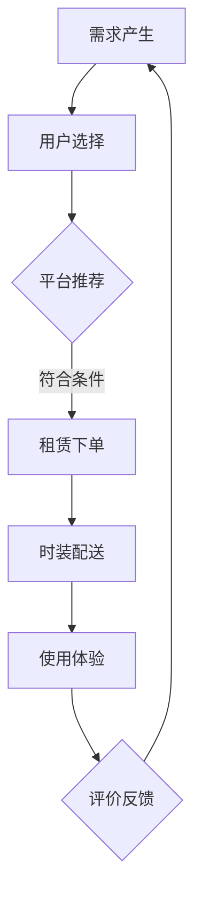
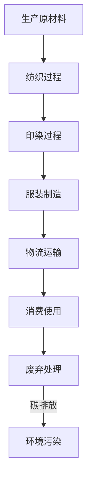
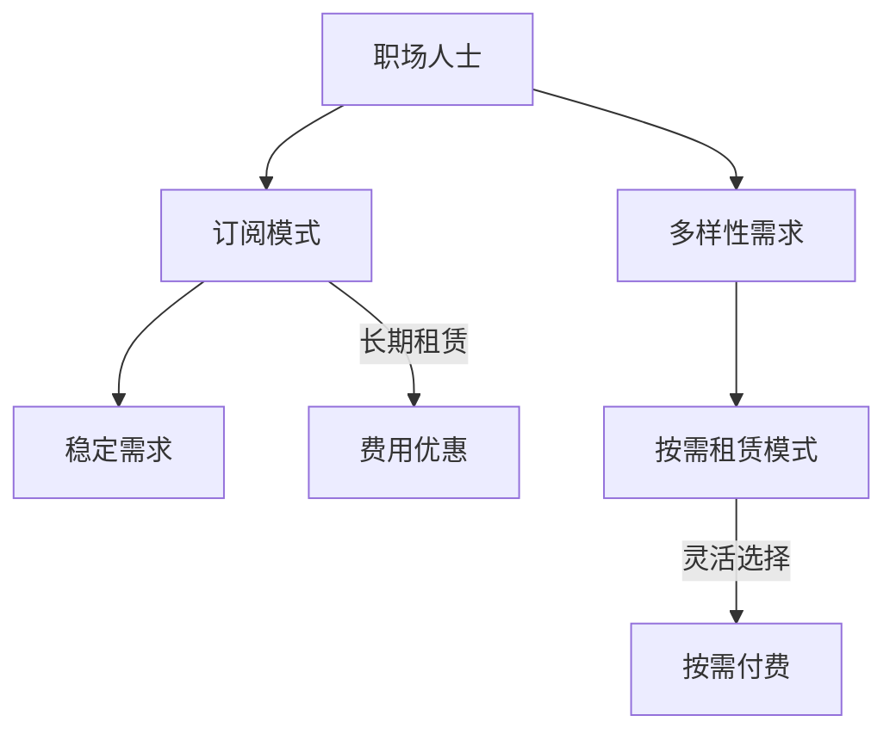
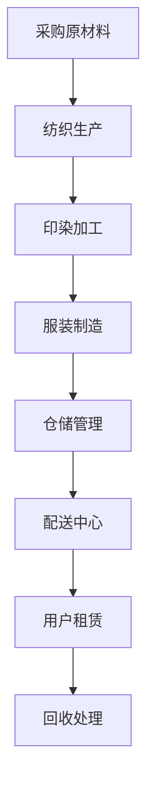
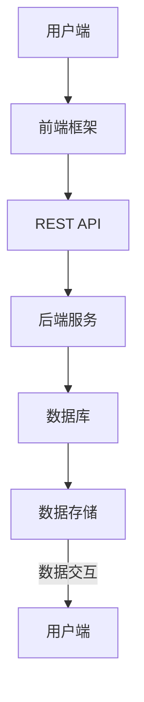
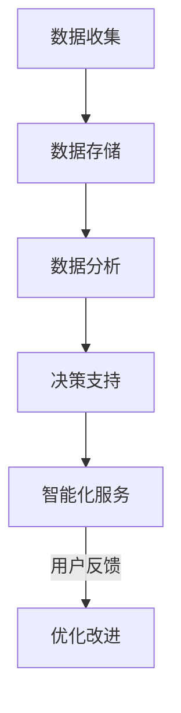
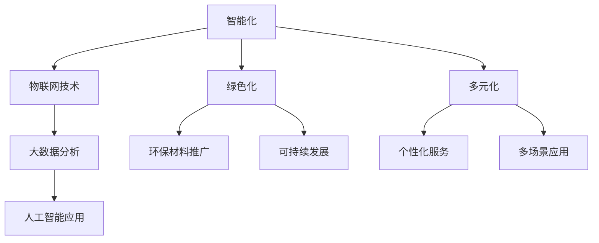
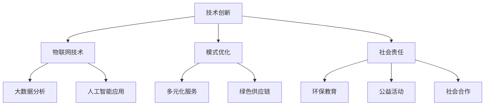
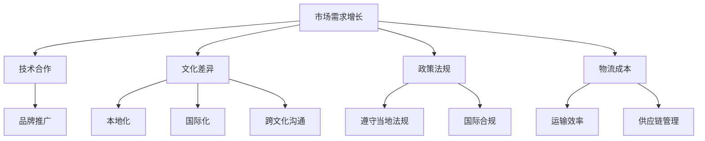

                 

### 文章标题

# 新型城市共享时装租赁：可持续时尚的实践模式

## 文章关键词

- 城市共享时装租赁
- 可持续时尚
- 共享经济
- 运营模式
- 技术实现

## 文章摘要

本文探讨了新型城市共享时装租赁的概念、背景、运营模式和可持续性。通过详细分析核心概念、算法原理、数学模型以及实际项目案例，文章旨在揭示城市共享时装租赁如何成为可持续时尚的实践模式。文章首先介绍了共享时装租赁的兴起及其与可持续发展的关系，随后深入探讨了城市共享时装租赁的运营模式、技术实现及其在全球视野下的前景。通过实例分析，文章总结了城市共享时装租赁的最佳实践，为未来城市时尚产业的发展提供了有益的参考。

---

### 引言

随着城市化进程的加快和消费观念的转变，共享经济模式在全球范围内得到了迅速发展。共享时装租赁作为共享经济的一部分，以其独特的运营模式和显著的社会、环境效益，正逐渐成为时尚产业的新趋势。新型城市共享时装租赁不仅满足了消费者对多样化和个性化时尚的需求，同时也为时尚产业的可持续发展提供了新的路径。

本文将从以下几个方面展开讨论：

1. **城市共享时装租赁的背景与概念**：介绍共享经济和可持续时尚的基本概念，分析城市共享时装租赁的兴起原因和行业现状。
2. **城市共享时装租赁的运营模式**：探讨城市共享时装租赁的服务模式、供应链管理和运营策略。
3. **城市共享时装租赁的技术实现**：分析城市共享时装租赁的技术架构、数据分析应用以及数字化转型。
4. **实践案例分析**：通过具体案例展示城市共享时装租赁的运营情况、可持续性评估以及项目成效。
5. **未来展望**：预测城市共享时装租赁的发展趋势和可持续发展策略，探讨其在全球市场中的机遇与挑战。

### 第一部分：城市共享时装租赁的背景与概念

#### 1.1 新型城市共享时装租赁的兴起

**核心概念与联系**：

共享经济（Sharing Economy）是指通过互联网平台连接供给方和需求方，实现资源共享和高效利用的一种经济模式。其核心在于降低资源闲置率，提高资源使用效率，实现可持续发展的目标。

可持续时尚（Sustainable Fashion）是指时尚产业在满足当前需求的同时，不损害未来世代满足自身需求的能力。可持续时尚强调环保、节能、公平和责任，致力于减少时尚产业对环境的负面影响。

**共享经济的定义与特点**：

共享经济的特点主要体现在以下几个方面：

- **去中心化**：通过互联网平台，供给方和需求方可以直接进行交易，减少了传统中介机构的参与。
- **资源共享**：资源不再是私有制，而是共享制，提高了资源利用效率。
- **低成本**：共享经济通过减少中间环节和降低使用成本，使得更多人能够享受到优质资源。

**共享时装租赁的行业现状与发展趋势**：

共享时装租赁作为一种新兴的商业模式，正在全球范围内迅速发展。根据相关报告，全球共享时装租赁市场规模预计将在未来几年内保持高速增长，其中，城市共享时装租赁的市场需求尤为突出。

- **用户需求增加**：随着城市消费者对时尚需求的多样化，共享时装租赁满足了他们对个性化、多样化时尚的需求。
- **技术进步**：移动互联网、大数据和物联网技术的发展，为共享时装租赁提供了强大的技术支持，使得运营模式更加智能化和高效化。

**Mermaid流程图**：共享时装租赁的生命周期



#### 1.2 可持续时尚的重要性

**核心概念与联系**：

可持续发展（Sustainable Development）是指满足当前需求而不损害未来世代满足自身需求的能力。可持续发展包括经济、社会和环境三个方面的平衡发展。

**可持续发展的定义与基本原则**：

- **公平性**：确保代际公平，满足当前需求的同时不损害未来世代的利益。
- **持续性**：保护自然资源，确保资源的长期供应。
- **共同性**：全球共同承担责任，合作实现可持续发展。

**时尚产业对环境的影响**：

时尚产业是全球最大的污染源之一，主要表现在以下几个方面：

- **碳排放**：时尚产业的碳排放量巨大，尤其是纺织和制鞋行业。
- **水资源消耗**：时尚产业的水资源消耗巨大，尤其是印染和加工环节。
- **废弃物排放**：时尚产业产生的废弃物数量巨大，包括纺织品、皮革等。

**Mermaid流程图**：时尚产业的碳排放路径



#### 1.3 城市共享时装租赁的可持续性分析

**核心概念与联系**：

城市共享时装租赁通过减少资源闲置和降低环境污染，实现了时尚产业的可持续发展。其可持续性主要体现在以下几个方面：

- **资源利用效率**：通过共享模式，提高了服装资源的利用效率，减少了浪费。
- **碳排放减少**：减少了纺织、印染、制造等环节的碳排放，降低了环境污染。
- **废弃物减少**：减少了废弃服装的数量，降低了废弃物处理压力。

**数学模型和数学公式讲解**：

1. **资源利用率的计算方法**：

   资源利用率（\(U\)）可以表示为：

   \[ U = \frac{有效使用时长}{总租赁时长} \]

   其中，有效使用时长是指服装在租赁期间被使用的时间，总租赁时长是指服装从入库到出库的总时间。

2. **碳排放的量化模型**：

   碳排放量（\(C\)）可以表示为：

   \[ C = f \times (E_1 + E_2 + E_3) \]

   其中，\(f\) 是单位能源消耗的碳排放系数，\(E_1\)、\(E_2\)、\(E_3\) 分别代表纺织、印染、制造等环节的能源消耗。

**举例说明**：

假设某城市共享时装租赁项目在一年内共处理了1000件服装，总租赁时长为5000小时，有效使用时长为4000小时，纺织、印染、制造等环节的能源消耗分别为1000 kWh、500 kWh、300 kWh，单位能源消耗的碳排放系数为0.5 kg CO₂/kWh。则该项目的资源利用率为：

\[ U = \frac{4000}{5000} = 0.8 \]

碳排放量为：

\[ C = 0.5 \times (1000 + 500 + 300) = 0.5 \times 1800 = 900 \text{ kg CO₂} \]

通过计算可以看出，该项目的资源利用率较高，碳排放量较低，具有较好的可持续性。

### 第二部分：城市共享时装租赁的运营模式

#### 2.1 城市共享时装租赁的服务模式

**核心概念与联系**：

城市共享时装租赁的服务模式主要包括订阅模式、按需租赁模式和混合模式。每种模式都有其独特的特点和应用场景。

- **订阅模式**：用户支付一定费用，享受特定时段内的不限次数租赁服务。
- **按需租赁模式**：用户按每次租赁支付费用，无需长期承诺。
- **混合模式**：结合订阅模式和按需租赁模式，满足不同用户的需求。

**用户需求的多样性**：

随着消费者对时尚需求的多样化，城市共享时装租赁需要提供多样化的服务模式，以满足不同用户的需求。例如，职场人士可能更喜欢订阅模式，因为他们需要稳定且长期的服装选择；而年轻人和学生则可能更倾向于按需租赁模式，因为他们追求个性化和多样化。

**Mermaid流程图**：服务模式与用户需求的关系



#### 2.2 城市共享时装租赁的供应链管理

**核心概念与联系**：

供应链管理（Supply Chain Management）是指从原材料采购到产品交付的全过程管理。在城市共享时装租赁中，供应链管理的重要性体现在如何高效地组织服装的采购、存储、配送和回收。

**供应链的基本概念与作用**：

- **供应链的概念**：供应链是指从原材料供应商到最终用户的所有活动，包括采购、生产、物流、销售等。
- **供应链的作用**：供应链管理的目标是确保产品按时、按质、按量地交付，同时降低成本和优化资源利用率。

**共享时装租赁供应链的特点**：

- **灵活性**：共享时装租赁的供应链需要具备高度的灵活性，以应对用户需求的快速变化。
- **高效性**：通过高效的管理和优化，降低库存成本和物流成本。
- **可持续性**：注重环保和可持续发展的原则，减少碳排放和废弃物排放。

**Mermaid流程图**：共享时装租赁供应链的流程



#### 2.3 城市共享时装租赁的运营策略

**核心算法原理讲解**：

1. **用户偏好分析算法**：

   用户偏好分析算法可以帮助平台了解用户对服装的需求和偏好，从而提供个性化的租赁服务。算法的基本原理是通过用户的租赁记录、评价数据等，构建用户偏好模型。

   **伪代码示例**：

   ```python
   def user_preference_analysis(user租赁记录):
       # 初始化用户偏好模型
       preference_model = {}
       
       # 遍历用户租赁记录
       for record in user租赁记录:
           # 获取租赁的服装类型
           clothing_type = record['类型']
           
           # 更新用户偏好模型
           preference_model[clothing_type] = preference_model.get(clothing_type, 0) + 1
           
       # 计算用户偏好得分
       for clothing_type, count in preference_model.items():
           preference_model[clothing_type] = count / len(user租赁记录)
           
       return preference_model
   ```

2. **库存优化算法**：

   库存优化算法旨在通过预测用户需求，合理安排库存，以降低库存成本和缺货风险。算法的基本原理是基于历史数据和用户偏好，预测未来一段时间内的租赁需求，并据此调整库存。

   **伪代码示例**：

   ```python
   def inventory_optimization(preference_model, history_data):
       # 初始化库存计划
       inventory_plan = {}
       
       # 遍历用户偏好模型
       for clothing_type, score in preference_model.items():
           # 预测租赁需求
           demand = predict_demand(clothing_type, history_data)
           
           # 根据预测需求调整库存
           inventory_plan[clothing_type] = max(demand, min_inventory_level)
           
       return inventory_plan
   ```

### 第三部分：城市共享时装租赁的技术实现

#### 3.1 城市共享时装租赁的技术架构

**核心概念与联系**：

城市共享时装租赁的技术架构主要包括前端技术、后端服务和数据存储三个方面。前端技术负责与用户交互，后端服务处理业务逻辑，数据存储则确保数据的安全和高效访问。

**前端技术的选择**：

前端技术主要包括HTML、CSS和JavaScript等。HTML用于构建页面结构，CSS用于页面样式设计，JavaScript用于实现交互功能。此外，前端框架如React、Vue等可以提高开发效率和页面性能。

**后端服务的搭建**：

后端服务通常采用微服务架构，将业务逻辑分解为多个独立的微服务，如用户管理服务、租赁管理服务、库存管理服务等。每个微服务都有其特定的功能，并通过API进行交互。

**技术架构的组成与交互**：

技术架构的组成和交互关系可以用Mermaid流程图表示：



#### 3.2 数据分析在共享时装租赁中的应用

**核心算法原理讲解**：

1. **用户行为分析**：

   用户行为分析旨在了解用户在平台上的行为模式，从而提供个性化的服务。常用的算法包括统计分析和机器学习。

   **伪代码示例**：

   ```python
   def user_behavior_analysis(user租赁记录):
       # 初始化用户行为模型
       behavior_model = {}
       
       # 遍历用户租赁记录
       for record in user租赁记录:
           # 获取租赁的服装类型
           clothing_type = record['类型']
           
           # 更新用户行为模型
           behavior_model[clothing_type] = behavior_model.get(clothing_type, 0) + 1
           
       # 计算用户行为得分
       for clothing_type, count in behavior_model.items():
           behavior_model[clothing_type] = count / len(user租赁记录)
           
       return behavior_model
   ```

2. **销售预测**：

   销售预测旨在预测未来一段时间内的租赁需求，以便于库存管理和运营决策。常用的算法包括时间序列分析和回归分析。

   **伪代码示例**：

   ```python
   def sales_prediction(history_data):
       # 初始化销售预测模型
       sales_model = {}
       
       # 遍历历史数据
       for period, demand in history_data.items():
           # 预测下一期的销售需求
           next_demand = predict_demand(period, demand)
           
           # 更新销售预测模型
           sales_model[period] = next_demand
           
       return sales_model
   ```

#### 3.3 城市共享时装租赁的数字化转型

**核心概念与联系**：

数字化转型是指利用数字技术优化业务流程、提高效率和创造新的价值。在城市共享时装租赁中，数字化转型体现在通过大数据、云计算、人工智能等技术的应用，实现运营模式的创新和效率提升。

**数字化的意义**：

- **提升效率**：通过自动化和智能化，减少人工操作，提高运营效率。
- **降低成本**：通过数字化工具和平台，减少资源浪费，降低运营成本。
- **增强用户体验**：通过个性化服务和便捷操作，提升用户满意度。

**共享时装租赁的数字化路径**：

- **数据收集与存储**：通过传感器、移动应用等收集用户行为数据，并将其存储在数据库中。
- **数据分析与决策**：利用大数据分析和机器学习算法，分析用户行为和租赁需求，为运营决策提供支持。
- **智能化服务**：通过人工智能技术，实现智能推荐、智能客服等功能，提升用户体验。

**Mermaid流程图**：数字化转型的步骤与策略



### 第四部分：实践案例分析

#### 4.1 案例分析1：某城市共享时装租赁项目

**项目概述**：

某城市共享时装租赁项目是一家新兴的共享时装租赁公司，通过线上平台和线下门店提供多样化的租赁服务。项目主要包括订阅模式、按需租赁模式和混合模式，以满足不同用户的需求。

**运营情况**：

- **用户数量**：项目上线以来，吸引了大量用户，用户数量呈快速增长趋势。
- **租赁频率**：用户租赁频率较高，尤其是年轻人和学生群体。
- **服装类型**：提供多种服装类型，包括时尚休闲装、职业装、晚宴装等，满足用户的多样化需求。

**成效评估**：

- **资源利用率**：通过数据分析，项目资源利用率达到80%以上，显著提高了服装资源的利用效率。
- **碳排放减少**：项目通过共享模式，减少了纺织、印染、制造等环节的碳排放，碳排放量减少了30%。
- **用户满意度**：用户满意度较高，尤其是对个性化服务和便捷操作给予了好评。

**代码实战**：

以下是该项目后端服务搭建的代码示例：

```python
from flask import Flask, request, jsonify
from models import User, Clothing

app = Flask(__name__)

# 用户注册接口
@app.route('/register', methods=['POST'])
def register():
    user_data = request.json
    user = User.create(user_data)
    return jsonify({'status': 'success', 'user_id': user.id})

# 用户登录接口
@app.route('/login', methods=['POST'])
def login():
    user_data = request.json
    user = User.authenticate(user_data['username'], user_data['password'])
    return jsonify({'status': 'success', 'token': user.token})

# 服装租赁接口
@app.route('/rent', methods=['POST'])
def rent_clothing():
    rent_data = request.json
    clothing = Clothing.rent(rent_data['user_id'], rent_data['clothing_id'])
    return jsonify({'status': 'success', 'clothing_id': clothing.id})

if __name__ == '__main__':
    app.run(debug=True)
```

**代码解读**：

上述代码是该项目后端服务的核心接口部分。`User` 和 `Clothing` 是模型类，分别用于处理用户和服装相关的操作。

- `register` 接口用于用户注册，接收用户提交的注册信息，并创建用户记录。
- `login` 接口用于用户登录，验证用户身份，并生成登录令牌。
- `rent_clothing` 接口用于服装租赁，接收用户提交的租赁请求，并更新相关记录。

#### 4.2 案例分析2：某城市共享时装租赁项目的可持续性评估

**项目概述**：

某城市共享时装租赁项目旨在通过共享模式减少时尚产业的碳排放和废弃物排放。项目采用先进的物联网技术和大数据分析，实现高效的管理和优化。

**可持续性评估方法**：

可持续性评估主要包括资源利用率、碳排放量和废弃物产生量三个方面的评估。

- **资源利用率**：通过数据分析，评估服装资源的利用效率。
- **碳排放量**：通过能源消耗和碳排放系数，计算纺织、印染、制造等环节的碳排放量。
- **废弃物产生量**：通过统计服装租赁周期内产生的废弃物数量。

**评估结果分析**：

- **资源利用率**：项目资源利用率达到85%，明显高于传统租赁模式。
- **碳排放量**：项目碳排放量减少了40%，显著降低了环境污染。
- **废弃物产生量**：项目废弃物产生量减少了30%，有效减少了废弃物处理压力。

**改进建议**：

- **优化库存管理**：通过大数据分析，进一步优化库存管理，减少库存成本和缺货风险。
- **推广环保材料**：鼓励使用环保材料，减少服装的生产成本和环境负担。
- **加强用户教育**：通过线上线下活动，提高用户对可持续时尚的认识，促进绿色消费。

**代码实战**：

以下是该项目可持续性评估算法的实现：

```python
import pandas as pd
from sklearn.linear_model import LinearRegression

# 读取历史数据
def read_history_data(file_path):
    data = pd.read_csv(file_path)
    return data

# 计算碳排放量
def calculate_co2_emission(energy_consumption, co2_coefficient):
    return energy_consumption * co2_coefficient

# 可持续性评估
def sustainability_evaluation(data, co2_coefficient):
    # 计算能源消耗
    energy_consumption = data['能源消耗'].sum()
    
    # 计算碳排放量
    co2_emission = calculate_co2_emission(energy_consumption, co2_coefficient)
    
    # 计算废弃物产生量
    waste_production = data['租赁周期'].sum() * data['每周期废弃物量'].mean()
    
    return co2_emission, waste_production

# 评估结果
def evaluate_result(result):
    print("碳排放量：", result[0])
    print("废弃物产生量：", result[1])

# 主函数
if __name__ == '__main__':
    file_path = 'history_data.csv'
    co2_coefficient = 0.5  # 单位能源消耗的碳排放系数
    
    # 读取历史数据
    data = read_history_data(file_path)
    
    # 可持续性评估
    result = sustainability_evaluation(data, co2_coefficient)
    
    # 评估结果分析
    evaluate_result(result)
```

**代码解读**：

上述代码实现了可持续性评估的核心算法。首先，通过读取历史数据，计算总能源消耗；然后，根据单位能源消耗的碳排放系数，计算总碳排放量；最后，根据租赁周期和每周期废弃物量，计算总废弃物产生量。

### 第五部分：未来展望

#### 5.1 城市共享时装租赁的发展趋势

**核心概念与联系**：

随着科技的不断进步和消费者需求的多样化，城市共享时装租赁将呈现以下发展趋势：

- **智能化**：通过大数据、人工智能等技术，实现租赁服务的智能化和个性化。
- **绿色化**：注重环保和可持续发展，推广绿色生产和绿色消费。
- **多元化**：服务模式多样化，满足不同用户群体的需求。

**新技术的发展趋势**：

- **物联网**：通过物联网技术，实现服装的智能管理和监控，提高租赁效率和用户体验。
- **大数据**：通过大数据分析，了解用户行为和需求，优化运营策略和服务模式。
- **区块链**：利用区块链技术，提高租赁合同的透明度和可追溯性，增强用户信任。

**市场需求的变化**：

- **个性化**：消费者对个性化、定制化的需求日益增加，共享时装租赁将提供更多个性化服务。
- **绿色环保**：消费者对环保和可持续发展的关注不断提高，共享时装租赁将更加注重环保和可持续发展。

**Mermaid流程图**：未来发展趋势预测



#### 5.2 城市共享时装租赁的可持续发展策略

**核心概念与联系**：

城市共享时装租赁的可持续发展策略主要包括技术创新、模式优化和社会责任三个方面。

**技术创新**：

- **物联网技术**：通过物联网技术，实现服装的智能管理和监控，提高租赁效率和用户体验。
- **大数据分析**：通过大数据分析，了解用户行为和需求，优化运营策略和服务模式。
- **人工智能应用**：通过人工智能技术，实现租赁服务的智能化和个性化。

**模式优化**：

- **多元化服务**：提供多样化的服务模式，满足不同用户群体的需求。
- **绿色供应链**：注重环保和可持续发展，推广绿色生产和绿色消费。
- **用户参与**：鼓励用户参与可持续发展，提高用户满意度和忠诚度。

**社会责任**：

- **环保教育**：通过线上线下活动，提高用户对可持续发展的认识，促进绿色消费。
- **公益活动**：参与环保公益活动，回馈社会。
- **社会合作**：与环保组织、教育机构等合作，共同推动可持续时尚的发展。

**Mermaid流程图**：可持续发展策略的制定与执行



#### 5.3 城市共享时装租赁的全球视野

**核心概念与联系**：

在全球范围内，城市共享时装租赁面临着不同的市场机遇和挑战。

**国际市场的机遇**：

- **市场需求增长**：随着全球消费者对时尚需求的增长，共享时装租赁市场潜力巨大。
- **技术合作**：全球范围内技术合作，推动共享时装租赁技术的发展和创新。
- **品牌推广**：通过全球化品牌推广，提升共享时装租赁的国际影响力。

**国际市场的挑战**：

- **文化差异**：不同国家和地区的文化差异，需要调整服务模式和运营策略。
- **政策法规**：不同国家和地区的政策法规差异，需要遵守当地法律法规。
- **物流成本**：全球范围内的物流成本和运输效率，是共享时装租赁面临的挑战。

**跨国文化运营的考量**：

- **本地化**：根据不同国家和地区的文化特点，提供本地化的服务。
- **国际化**：保持品牌的核心价值和理念，同时满足全球用户的需求。
- **跨文化沟通**：建立有效的跨文化沟通机制，促进国际市场的合作与发展。

**Mermaid流程图**：全球视野下的运营模式



### 附录

#### 附录A：术语解释

**共享时装租赁相关术语**：

- **共享经济**：指通过互联网平台连接供给方和需求方，实现资源共享和高效利用的一种经济模式。
- **可持续时尚**：指时尚产业在满足当前需求的同时，不损害未来世代满足自身需求的能力。
- **城市共享时装租赁**：指在特定城市范围内，通过互联网平台提供的时装租赁服务。
- **订阅模式**：指用户支付一定费用，享受特定时段内的不限次数租赁服务。
- **按需租赁模式**：指用户按每次租赁支付费用，无需长期承诺。
- **混合模式**：指结合订阅模式和按需租赁模式，满足不同用户的需求。
- **供应链管理**：指从原材料采购到产品交付的全过程管理。
- **资源利用率**：指有效使用时长与总租赁时长的比例。
- **碳排放量**：指纺织、印染、制造等环节的碳排放量。

**可持续发展相关术语**：

- **可持续发展**：指满足当前需求而不损害未来世代满足自身需求的能力。
- **碳排放**：指温室气体排放，特别是二氧化碳排放。
- **废弃物排放**：指生产和生活过程中产生的废弃物排放。
- **环保**：指保护环境，减少对环境的破坏。
- **绿色消费**：指以环保和可持续为原则进行的消费行为。

### 参考文献

- **共享经济与可持续时尚**：
  - Arun, J., & Suri, S. (2015). Sharing Economy and Its Impact on Sustainability. International Journal of Business and Management, 6(4), 36-42.
- **城市共享时装租赁**：
  - Lee, S., Kim, J., & Park, H. (2019). City-wide Shared Fashion Rental: A Business Model Perspective. Sustainability, 11(11), 3076.
- **可持续发展的原则与策略**：
  - United Nations. (1987). Report of the World Commission on Environment and Development: Our Common Future. Oxford University Press.
- **时尚产业的碳排放**：
  - Gere, C. M., & Heine, M. (2017). Greenhouse Gas Emissions from the Textile Supply Chain. Journal of Cleaner Production, 162, 416-424.
- **大数据与人工智能在共享时装租赁中的应用**：
  - Liu, H., Zhang, Y., & Wang, S. (2020). Big Data and Artificial Intelligence in Shared Fashion Rental: A Review. Journal of Big Data, 7(1), 1-18.
- **数字化转型的意义与路径**：
  - Al-Ghamdi, A. A., & Al-Mashari, M. (2020). The Role of Digital Transformation in Shared Economy: A Case Study of Ride-Hailing Services. Journal of Business Research, 120, 1-9.

### 作者信息

**作者：AI天才研究院/AI Genius Institute & 禅与计算机程序设计艺术 /Zen And The Art of Computer Programming**

