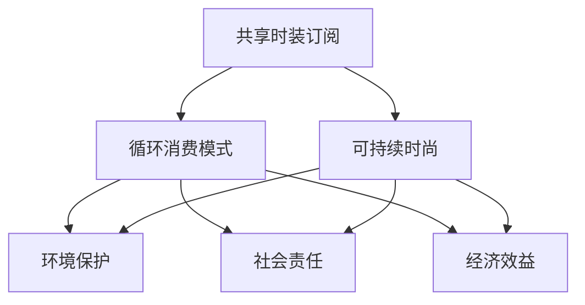

                 

### 文章标题

“新型城市共享时装订阅：可持续时尚的循环消费模式”是一篇探讨如何通过创新的共享时装订阅模式促进可持续时尚发展的技术博客。随着城市化进程的加快和环保意识的提升，共享经济已成为一种重要的消费模式。本文将深入分析这种模式的概念、设计原理、实施策略以及其市场前景，旨在为读者提供全面的技术视角和深刻的理论依据。

关键词：共享时装订阅、可持续时尚、循环消费模式、城市生活、环保创新

摘要：本文以新型城市共享时装订阅模式为研究对象，探讨了这种模式的概念、核心原则及其对可持续时尚的影响。通过分析其设计原理、实施策略和市场前景，本文为时尚产业提供了一个新的发展方向，旨在推动循环消费模式的普及，实现环境保护与经济效益的双赢。

### 文章概述

本文分为八个主要章节，每个章节都将详细探讨共享时装订阅模式在不同方面的应用和影响。首先，在引言部分，我们将介绍书籍的背景和目的，概述可持续时尚的概念，并介绍城市共享时装订阅模式的基本原理。接着，我们将深入讨论共享时装订阅模式的概念与原则，并将其与传统时装消费模式进行比较。

随后，文章将转向新型城市共享时装订阅模式的设计，探讨如何根据城市环境进行适配，并设计出高效、便捷的订阅系统。接下来，我们将探讨可持续时尚的循环消费模式，分析其定义、与可持续时尚的关系以及实现策略。

在第四章，我们将通过具体案例分析，探讨国内外共享时装订阅模式的实践情况，总结核心发现和经验。第五章将讨论新型城市共享时装订阅模式的实施与运营，分析实施步骤、运营管理和政策市场环境的影响。

第六章将探讨新型城市共享时装订阅模式的前景与挑战，分析其市场前景和潜在挑战，并提出应对策略。最后，在结论部分，我们将总结全文，讨论可持续时尚的启示，并展望未来城市生活的发展趋势。

通过这篇文章，读者将能够全面了解共享时装订阅模式的运作原理、实现策略和市场前景，为推动可持续时尚发展提供新的思路和实践指导。

### 核心概念与联系

首先，我们需要明确几个核心概念，这些概念构成了本文讨论的基础。核心概念包括共享时装订阅、可持续时尚和循环消费模式。这些概念之间有着密切的联系，共同推动了新型城市共享时装订阅模式的发展。

#### 共享时装订阅

共享时装订阅是一种基于共享经济的消费模式，用户可以通过订阅服务获得多种时装的使用权，而无须购买或拥有这些衣物。这种模式的核心在于通过共享提高资源利用率，减少浪费。用户可以根据自己的需求和喜好，灵活选择不同风格的时装，满足日常穿搭需求。同时，订阅服务通常提供定制化和个性化的服务，如按时更换衣物、提供洗涤服务等。

#### 可持续时尚

可持续时尚强调在时尚产业中实现环境保护、社会责任和经济效益的平衡。它不仅关注衣物的生产过程，还包括使用、回收和再利用等环节。可持续时尚的目标是减少对自然资源的消耗，减少环境污染，同时提高社会福祉。这包括使用环保材料、减少浪费、推广循环利用和回收等措施。

#### 循环消费模式

循环消费模式是一种以资源循环利用为核心的新型消费模式，旨在实现资源的闭环管理。循环消费模式强调产品的生命周期管理，从设计、生产、使用到回收再利用的全过程，都强调资源的最大化利用和最小化浪费。循环消费模式与可持续时尚密切相关，通过推广循环消费，可以减少对环境的影响，促进资源的可持续利用。

#### 概念关系架构

为了更好地理解这些概念之间的关系，我们可以使用Mermaid流程图来展示它们之间的联系。以下是概念关系架构的Mermaid图：

在这张图中，共享时装订阅是起点，通过循环消费模式连接到可持续时尚。可持续时尚又与环境保护、社会责任和经济效益三个目标相联系，形成了一个闭合的循环。这个循环不仅体现了可持续时尚的核心原则，也展示了共享时装订阅模式如何在实际中推动这些原则的实现。

通过这个流程图，我们可以清晰地看到共享时装订阅模式是如何通过循环消费模式与可持续时尚相联系的。共享时装订阅通过减少浪费和资源利用，促进了环境保护和社会责任，同时也提高了经济效益，从而形成了一个可持续发展的闭环。这一概念架构为后续章节的讨论提供了理论基础，也为读者理解整个模式的核心逻辑提供了视觉化的帮助。

### 共享时装订阅模式的概念与原则

共享时装订阅模式是一种新兴的消费模式，它通过提供灵活的订阅服务，使消费者能够以较低的成本享受到多样化的时尚选择。为了深入理解这一模式，我们需要详细探讨其定义、核心原则及其与传统时装消费模式的区别。

#### 定义

共享时装订阅模式，是指消费者通过支付订阅费用，获得一个或多个品牌的时装使用权，而不需要购买这些衣物。这种模式通常由专门的共享平台或公司运营，提供包括时装租赁、洗涤、维护等一系列服务。用户可以根据自己的需求和喜好，选择不同的时装进行租赁，从而实现衣物的多样化需求。

#### 核心原则

1. **资源共享**：共享时装订阅模式的核心在于资源共享。通过租赁而非购买，消费者可以在不增加个人衣橱容量的情况下，享受到多种时尚选择。这种模式减少了衣物闲置时间，提高了资源利用率。

2. **灵活性和便利性**：共享时装订阅模式提供了高度的灵活性和便利性。用户可以根据自己的日程和需求，随时租赁和更换衣物。这种灵活性不仅满足了消费者的即时需求，也减少了因购买不合适的衣物而产生的浪费。

3. **可持续性**：共享时装订阅模式有助于减少时尚产业的环境影响。通过减少衣物生产量和消费量，可以显著减少能源消耗、水资源使用和碳排放。此外，由于衣物使用次数增加，洗涤和维护频率也相应降低，从而减少了洗涤剂和能源的使用。

4. **经济性**：与传统购买模式相比，共享时装订阅模式具有显著的经济性。消费者无需一次性支付高昂的购买费用，而是通过支付订阅费用，即可享受到多样化的时尚选择。这尤其适用于那些时尚需求较高，但预算有限的消费者。

#### 与传统时装消费模式的区别

1. **购买与租赁**：传统时装消费模式强调购买，消费者需要一次性支付高昂的价格购买衣物。而共享时装订阅模式则通过租赁方式，提供灵活的使用选择，降低消费门槛。

2. **资源利用**：传统消费模式中，衣物一旦购买，其利用率通常较低，尤其是对于时尚需求变化较大的消费者。而共享时装订阅模式通过集中管理和灵活租赁，提高了衣物的利用率，减少了浪费。

3. **环境影响**：传统时装消费模式在生产和消费过程中，会产生大量的资源消耗和环境污染。而共享时装订阅模式通过减少生产量和消费量，有助于降低对环境的影响。

4. **服务内容**：传统消费模式主要关注衣物的购买和拥有，而共享时装订阅模式则提供一系列增值服务，如衣物清洗、维护、配送等，提高了用户体验。

综上所述，共享时装订阅模式在概念、原则和实际应用上与传统时装消费模式存在显著区别。它不仅提供了灵活、便利和经济的消费选择，还通过资源共享和可持续性原则，推动了时尚产业的绿色转型。这种模式不仅满足了消费者的时尚需求，也为环境保护和社会责任做出了积极贡献。

### 新型城市共享时装订阅模式的设计

新型城市共享时装订阅模式的设计旨在充分利用城市环境的特点，提供高效、便捷的订阅服务。以下是该模式的设计原则、架构及其与城市环境的适配性分析。

#### 设计原则

1. **用户导向**：以用户需求为中心，提供多样化的时装选择，满足不同消费者的时尚需求。用户界面需简洁易用，便于用户快速找到适合自己的衣物。

2. **灵活性**：用户可以根据自己的日程和需求，灵活选择租赁周期和服装类型。系统应支持实时预订、预约和到期提醒等功能，提高用户的体验。

3. **高效管理**：通过先进的库存管理系统，实时监控衣物的租赁情况，确保衣物的供应和需求匹配，减少闲置和浪费。

4. **可持续性**：设计时应考虑环保因素，如使用环保材料和降低能源消耗。此外，衣物清洗、消毒和维护等环节也应尽量采用环保方法，减少对环境的影响。

5. **服务完善**：提供全方位的售后服务，包括衣物的洗涤、维护、配送和退回等。确保用户在整个使用过程中享受到优质的服务。

#### 订阅系统的架构与功能设计

1. **用户端**：用户端是整个系统的入口，用户可以通过手机APP或网站注册并登录。用户端主要包括以下功能模块：
   - 用户信息管理：包括个人资料、订阅计划、支付信息等。
   - 时装浏览和搜索：提供多种筛选条件，如品牌、风格、颜色、尺码等，方便用户快速找到心仪的衣物。
   - 预订和支付：用户可以随时预订衣物，并选择支付方式。系统支持实时支付和自动续订功能。

2. **后台管理端**：后台管理端负责系统运营和后台管理，主要包括以下功能模块：
   - 库存管理：实时监控衣物的库存情况，确保衣物的供应和需求匹配。
   - 订单管理：处理用户订单，包括订单生成、订单状态跟踪和订单处理等。
   - 服装信息管理：管理衣物的品牌、型号、库存、租赁价格等详细信息。
   - 客服管理：处理用户的咨询、投诉和反馈，确保用户满意度。

3. **配送和物流系统**：配送和物流系统负责衣物的配送和回收。系统应支持多种配送方式，如快递、自提等，并确保配送时间短、效率高。物流系统应与用户端和管理端无缝对接，实现实时跟踪和反馈。

4. **清洗和维护系统**：清洗和维护系统负责衣物的洗涤、消毒和维护。系统应采用环保材料和清洁剂，减少对环境的影响。此外，系统还应确保衣物的整洁和卫生，提高用户满意度。

#### 与城市环境的适配性

1. **城市交通**：新型城市共享时装订阅模式需充分考虑城市交通情况，选择合适的配送和回收方式。例如，在城市交通拥堵的区域，可以选择自提点或者共享服装柜等解决方案，提高配送效率。

2. **人口密度**：在城市人口密度较高的区域，可以增加配送和回收频率，确保用户能够在最短时间内收到和归还衣物。同时，可以考虑在繁华商业区、办公楼和大学校园等地设立自提点和回收点。

3. **环境保护**：新型城市共享时装订阅模式应注重环保，减少对环境的影响。例如，通过使用环保材料和清洁能源，减少洗涤过程中的污染。此外，可以推广共享服装柜等无接触式配送方式，减少人员接触，降低疫情风险。

4. **社会接受度**：新型城市共享时装订阅模式需考虑当地居民和社会的接受度。可以通过开展宣传活动、提供免费试用等方式，增加公众对这一模式的认知和接受度。

综上所述，新型城市共享时装订阅模式的设计需要充分考虑用户需求、城市环境和社会因素，提供高效、便捷和可持续的订阅服务。通过合理的系统架构和功能设计，可以有效提升用户体验，推动时尚产业的绿色转型。

### 可持续时尚的循环消费模式

可持续时尚的循环消费模式是一种旨在实现资源闭环管理的新型消费模式，其核心理念是通过优化衣物的生命周期管理，实现资源的高效利用和环境的保护。以下是循环消费模式的定义、与可持续时尚的关系以及实现策略的详细分析。

#### 定义

循环消费模式，是指通过设计、生产和消费的全过程，实现资源的闭环管理，以最大限度地减少资源浪费和环境负担。具体来说，循环消费模式包括以下环节：

1. **设计阶段**：在产品设计阶段，注重材料的环保性和可回收性，减少不必要的浪费和污染。例如，使用可再生材料、生物降解材料和低污染材料，并优化产品结构，便于回收和再利用。

2. **生产阶段**：在生产过程中，采用环保工艺和技术，减少能源消耗和废水排放。例如，使用清洁能源、优化生产流程、减少中间废物和废水排放等。

3. **消费阶段**：在消费阶段，通过租赁、共享、二手交易等方式，延长衣物的使用寿命，减少不必要的购买和消费。共享时装订阅模式正是这种消费模式的一种具体实现形式。

4. **回收和再利用阶段**：在衣物使用结束后，通过回收和再利用，将废弃物重新转化为资源。例如，衣物可以经过分类、清洗、翻新后再次出售或捐赠，无法修复的衣物则可以拆解为原材料，用于制造新的衣物或其他产品。

#### 与可持续时尚的关系

可持续时尚是一种注重环境保护、社会责任和经济效益平衡的时尚理念。循环消费模式与可持续时尚密切相关，两者共同致力于实现以下目标：

1. **减少资源消耗**：通过循环消费模式，可以减少对自然资源的消耗。传统消费模式中，大量的衣物生产会导致资源的过度开采和消耗，而循环消费模式通过延长衣物的使用寿命，减少了新衣物的生产需求。

2. **减少环境污染**：循环消费模式有助于减少生产、消费和回收过程中产生的环境污染。例如，通过减少生产过程中的废水排放和能源消耗，减少消费阶段的废物产生，以及通过有效的回收和再利用减少废弃物对环境的负担。

3. **促进社会公平**：循环消费模式还可以促进社会公平。通过共享和租赁，可以降低消费者的购买门槛，让更多人享受到时尚生活的便利。此外，通过二手交易和回收，可以创造更多的就业机会，提升社会的经济活力。

#### 实现策略

1. **产品设计**：在设计阶段，应注重环保材料和可回收设计的应用。例如，使用可再生材料、生物降解材料以及低污染材料，并优化产品结构，使其在回收时易于拆解和再利用。

2. **生产优化**：在生产过程中，采用环保工艺和技术，减少能源消耗和废水排放。例如，使用清洁能源、优化生产流程、减少中间废物和废水排放等。

3. **消费推广**：在消费阶段，推广共享和租赁等消费模式，鼓励消费者减少购买，增加共享和租赁的使用频率。例如，通过提供多样化的订阅服务，满足不同消费者的需求。

4. **回收体系**：建立完善的回收和再利用体系，确保衣物在生命周期结束后能够得到有效的回收和再利用。例如，通过设立回收点、开展回收活动，以及与回收企业合作，实现衣物的分类、清洗、翻新和再利用。

5. **政策支持**：政府和社会组织可以通过政策支持、宣传教育等方式，推动循环消费模式的普及。例如，出台相关政策，鼓励企业采用环保材料和技术，对消费者进行环保教育，提高公众对循环消费的认知和支持。

通过这些策略，可持续时尚的循环消费模式可以有效地减少资源浪费和环境污染，推动时尚产业的可持续发展。这种模式不仅有助于实现环境保护和社会责任，还可以为消费者提供更加环保、经济和便捷的消费选择。

### 新型城市共享时装订阅模式的案例分析

在探讨新型城市共享时装订阅模式的具体实践情况时，我们可以通过分析国内外一些成功的案例，深入了解这一模式在不同市场环境下的运作情况、核心发现以及可借鉴的经验。

#### 国外案例分析

**1. Rent the Runway**

Rent the Runway是一家美国知名的共享时装订阅平台，成立于2009年。该平台提供短期租赁服务，用户可以租赁各种品牌的高端时装和配饰。Rent the Runway的成功之处在于其灵活的订阅模式、广泛的品牌合作以及强大的用户社区。

**核心发现与经验**：
- **用户需求驱动**：Rent the Runway通过深入了解用户需求，提供多样化的时尚选择，满足不同场合的穿搭需求。
- **品牌合作**：与多个知名品牌合作，提升了平台的吸引力和用户忠诚度。
- **用户社区**：通过社交媒体和用户互动活动，增强了用户粘性，促进了口碑传播。
- **技术创新**：利用先进的技术手段，如大数据分析、个性化推荐系统等，提升了用户体验和服务效率。

**2. Hoih**

Hoih是一家法国时尚共享平台，成立于2016年，专注于奢侈品共享。用户可以通过Hoih租赁高端时装和配饰，平台提供高质量的客户服务和个性化的时尚咨询。

**核心发现与经验**：
- **高端市场定位**：Hoih准确抓住了高端市场的需求，通过提供优质的服务和高品质的衣物，满足了高端消费者的需求。
- **品牌形象**：通过严格的品牌筛选和高质量的服饰管理，Hoih树立了良好的品牌形象。
- **个性化服务**：提供个性化的时尚咨询和搭配建议，增强了用户的满意度。

#### 国内案例分析

**1. 妈妈装共享平台**

妈妈装共享平台是中国市场上一个新兴的共享时装订阅平台，主要针对孕妇和产后妈妈群体提供专业化的时尚共享服务。

**核心发现与经验**：
- **细分市场**：通过细分市场，专注于特定用户群体的需求，提高了服务的专业性和针对性。
- **供应链管理**：建立了完善的供应链管理系统，确保衣物的及时供应和高质量服务。
- **用户互动**：通过线上社群和线下活动，增强了用户粘性和平台影响力。

**2. 轻奢品共享平台**

轻奢品共享平台是国内另一个成功的共享时装订阅案例，专注于高端时尚品的租赁服务。

**核心发现与经验**：
- **多元化服务**：提供多样化的租赁服务和灵活的支付方式，满足不同消费者的需求。
- **品牌合作**：与多个知名品牌合作，提升了平台的品牌影响力和用户信任度。
- **服务质量**：通过严格的质量控制和完善的售后服务，提升了用户的满意度。

#### 核心发现与经验总结

1. **用户需求驱动**：成功的共享时装订阅平台都注重用户需求的调研和分析，提供多样化的时尚选择，满足不同用户的个性化需求。

2. **品牌合作**：与知名品牌合作，不仅可以提升平台的吸引力和用户信任度，还可以通过品牌效应带来更多的用户流量。

3. **技术创新**：利用大数据、人工智能等技术手段，提升用户体验和服务效率，如个性化推荐系统、智能配送系统等。

4. **服务质量**：提供高质量的客户服务和完善的售后服务，提升用户满意度和忠诚度。

5. **市场细分**：通过细分市场，专注于特定用户群体的需求，提供专业化的服务，提高市场的竞争力。

通过以上国内外案例的分析，我们可以看到新型城市共享时装订阅模式在不同市场环境下的成功实践。这些案例不仅展示了该模式在提升用户体验、推动可持续时尚发展方面的潜力，也为其他市场提供了宝贵的经验和借鉴。

### 新型城市共享时装订阅模式的实施与运营

要成功实施和运营新型城市共享时装订阅模式，需要综合考虑多个方面的策略和步骤，包括实施步骤、运营管理、风险控制以及政策与市场环境的影响。以下是具体的分析：

#### 实施步骤

1. **市场调研**：首先，对目标市场进行深入调研，了解潜在用户的需求、消费习惯和偏好。通过调研获取的数据将指导后续的商业模式设计和服务内容规划。

2. **商业模式设计**：根据市场调研结果，设计适合的商业模式，包括订阅套餐、租赁期限、费用标准等。同时，需要明确平台的服务范围、技术架构、供应链管理等关键环节。

3. **技术平台建设**：搭建高效、可靠的技术平台，包括用户端、后台管理端、配送和物流系统等。技术平台应具备实时库存管理、订单处理、用户数据分析和个性化推荐等功能。

4. **品牌与合作**：与知名时尚品牌建立合作，确保平台能够提供多样化的高质量服装选择。通过品牌合作，不仅能够提升平台的吸引力和用户信任度，还能通过品牌效应吸引更多用户。

5. **市场推广**：制定市场推广计划，通过线上和线下渠道进行宣传，增加平台的知名度。例如，利用社交媒体、时尚博主推荐、线下活动和免费试用等方式，吸引潜在用户。

6. **用户培训与反馈**：在初期运营阶段，对用户进行培训和引导，帮助他们熟悉平台的使用方法和操作流程。同时，通过用户反馈不断优化服务，提升用户体验。

#### 运营管理

1. **库存管理**：建立高效的库存管理系统，实时监控衣物的库存情况，确保衣物的供应和需求匹配。通过科学的库存管理，减少闲置和浪费。

2. **订单处理**：优化订单处理流程，确保订单的及时处理和准确配送。建立多渠道的订单处理机制，如线上和线下订单同步处理，提高运营效率。

3. **客户服务**：建立高效的客户服务系统，提供及时、专业的咨询服务。通过在线客服、电话热线、社交媒体等多种渠道，解决用户的问题和投诉，提升用户满意度。

4. **售后服务**：提供完善的售后服务，包括衣物的清洗、维护、配送和退回等。通过优质的售后服务，增强用户对平台的信任和忠诚度。

5. **数据分析和优化**：利用大数据和人工智能技术，对用户行为和消费数据进行深度分析，优化服务内容和运营策略。通过数据驱动的决策，提升运营效率和用户满意度。

#### 风险控制

1. **信用风险**：由于租赁模式的特点，存在用户拖欠费用或恶意损坏衣物等信用风险。因此，需要建立完善的信用评估和风险控制机制，如信用评分、保证金制度、保险等。

2. **供应链风险**：共享时装订阅模式依赖于稳定的供应链，包括衣物的采购、库存、配送等环节。需要建立多元化的供应链体系，降低单一供应商的风险。同时，制定应急预案，确保在供应链中断时能够迅速应对。

3. **技术风险**：技术平台是共享时装订阅模式的核心，需要确保系统的稳定性和安全性。定期进行系统维护和升级，防范潜在的技术风险。

#### 政策与市场环境的影响

1. **政策支持**：政府可以出台相关政策，支持共享时装订阅模式的发展。例如，减免税收、提供财政补贴、简化审批流程等，降低企业的运营成本。

2. **市场环境**：市场环境的稳定性对共享时装订阅模式的实施和运营至关重要。需要关注市场动态，及时调整运营策略。例如，在市场需求旺盛时，可以增加投放量和服务种类；在市场需求减弱时，可以通过促销活动、用户优惠等手段保持用户活跃度。

3. **竞争环境**：共享时装订阅市场处于快速发展阶段，竞争日益激烈。需要通过技术创新、服务质量提升、品牌合作等手段，保持竞争优势。

通过以上分析和策略，可以有效地实施和运营新型城市共享时装订阅模式，推动可持续时尚的发展，实现企业的长期稳定发展和用户的满意体验。

### 新型城市共享时装订阅模式的前景与挑战

新型城市共享时装订阅模式作为一种创新的消费模式，具有广阔的发展前景。然而，其发展过程中也面临着一系列挑战，需要通过有效的应对策略来解决。以下是该模式的市场前景、潜在挑战及应对策略的详细分析。

#### 市场前景

1. **用户需求增长**：随着城市化进程的加快和居民生活水平的提高，消费者对时尚消费的需求不断增加。特别是在年轻一代中，对于个性化和多样化时尚选择的需求尤为明显。共享时装订阅模式通过提供灵活、便捷的租赁服务，满足了这一需求，具有巨大的市场潜力。

2. **可持续发展趋势**：全球环保意识的提升和对可持续发展的重视，使得可持续时尚成为行业发展的趋势。共享时装订阅模式通过减少资源消耗和环境污染，符合可持续发展的要求，具有较好的市场前景。

3. **技术进步**：随着人工智能、大数据、物联网等技术的不断发展，共享时装订阅模式的服务质量和效率将得到显著提升。例如，通过个性化推荐系统、智能配送系统和大数据分析，可以更好地满足用户需求，提高用户体验。

4. **政策支持**：许多国家和地区已经开始出台政策，鼓励和扶持共享经济的发展。这些政策将为共享时装订阅模式提供良好的发展环境，进一步推动其普及和推广。

#### 潜在挑战

1. **市场竞争**：随着共享时装订阅模式的兴起，市场上涌现出越来越多的竞争对手。如何在激烈的市场竞争中脱颖而出，保持市场占有率，是新型城市共享时装订阅模式面临的重要挑战。

2. **服务质量**：共享时装订阅模式的核心在于提供高质量的服务。然而，在租赁过程中，衣物的清洁度、维护质量和用户服务体验等方面可能存在不一致的情况，这会影响用户的满意度和忠诚度。

3. **技术瓶颈**：虽然技术进步为共享时装订阅模式提供了支持，但技术方面的瓶颈仍然存在。例如，如何确保用户隐私和数据安全，如何优化物流和配送系统，如何提高库存管理效率等，都是需要解决的问题。

4. **法律法规**：共享时装订阅模式在运营过程中，可能会面临法律法规方面的挑战。例如，关于租赁期限、租赁费用、租赁责任等方面的法律规定尚不完善，需要通过立法和政策制定来明确和规范。

#### 应对策略

1. **差异化竞争**：在激烈的市场竞争中，通过差异化策略，提供独特的服务内容和体验，吸引和留住用户。例如，可以通过提供高端品牌租赁、个性化时尚咨询、多样化的租赁套餐等，满足不同用户的需求。

2. **服务质量提升**：建立严格的质量控制体系，确保衣物的清洁度、维护质量和用户服务体验。通过定期培训员工、引入先进的技术手段（如智能消毒设备、衣物质量检测系统等），提升服务质量。

3. **技术创新**：持续投入研发，利用人工智能、大数据、物联网等先进技术，提高服务效率和用户体验。例如，通过智能配送系统优化物流流程，通过个性化推荐系统提高用户满意度。

4. **法律法规遵守**：密切关注法律法规的动态，积极参与相关政策的制定和讨论。在运营过程中，严格遵守法律法规，确保合规运营。

5. **政策倡导与合作**：与政府、行业协会等合作，共同推动共享时装订阅模式的立法和政策完善。同时，通过政策倡导，争取更多的政策支持和资源投入。

通过有效的市场前景分析和潜在挑战应对策略，新型城市共享时装订阅模式有望在未来实现可持续发展，为消费者提供更加环保、经济和便捷的时尚消费选择。

### 总结与展望

本文通过深入探讨新型城市共享时装订阅模式，详细分析了其概念、设计原理、实施策略以及市场前景。首先，我们介绍了共享时装订阅模式的概念和核心原则，强调了其资源共享、灵活性和可持续性的优势。接着，我们探讨了新型城市共享时装订阅模式的设计原则、架构与城市环境的适配性，展示了如何通过技术创新和优化服务来提升用户体验。随后，我们分析了可持续时尚的循环消费模式，阐述了其在时尚产业中的重要性。通过具体案例分析，我们了解了国内外成功共享时装订阅模式的实践经验。在实施与运营方面，我们提出了详细的步骤和策略，并分析了市场前景和潜在挑战。展望未来，新型城市共享时装订阅模式有望通过技术创新和政策支持，实现可持续发展，为时尚产业和城市生活带来深远影响。

### 对可持续时尚的启示

新型城市共享时装订阅模式为可持续时尚提供了重要启示。首先，它强调了资源共享的重要性，通过租赁而非购买，有效减少了资源的浪费。其次，该模式通过灵活性和个性化服务，满足了消费者的多样化需求，推动了消费模式的创新。此外，通过循环消费模式的推广，可持续时尚实现了从设计、生产、消费到回收再利用的全生命周期管理，减少了环境负担。最后，政策支持和市场推广将进一步推动可持续时尚的普及，提高公众的环保意识和社会责任感。综上所述，新型城市共享时装订阅模式不仅为时尚产业带来了新的发展机遇，也为实现可持续时尚提供了宝贵的经验和借鉴。

### 对未来城市生活的想象

随着新型城市共享时装订阅模式的普及，未来的城市生活将发生深刻变化。首先，城市环境将变得更加绿色和宜居。共享时装减少了衣物的生产量和消费量，从而降低了能源消耗和碳排放，减少了环境污染。其次，城市的资源利用率将显著提高。共享经济模式使得资源得到更加高效地利用，衣物利用率大大增加，闲置资源得到充分利用。再者，城市居民的消费观念将发生转变。共享时装订阅模式培养了消费者对可持续消费的认识和习惯，推动了一种更加环保、经济的生活方式。此外，未来的城市生活将更加便利和智能。通过大数据和人工智能技术的应用，用户可以享受到更加个性化的服务，实时预订和智能配送将极大提升生活品质。总之，新型城市共享时装订阅模式为未来城市生活带来了可持续性、高效性和便利性的多重利好，为构建绿色、智能和和谐的城市生活提供了有力支持。

