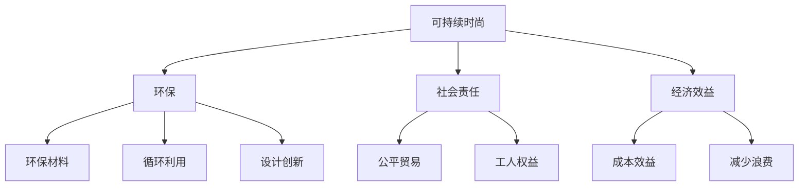

                 


### Step 1: Article Structure and Introduction
Firstly, we need to create a clear structure for our article. The article will be divided into several main sections, each focusing on different aspects of the topic.

#### Markdown Format
```
# 新型城市共享服装设计室：可持续时尚的创意工作坊

## 引言

## 1. 核心概念与联系

### 1.1 可持续时尚的概念

### 1.2 共享服装设计原理

## 2. 核心算法原理讲解

### 2.1 共享服装设计算法

### 2.2 数学模型和公式

## 3. 数学模型和公式

### 3.1 可持续时尚评价模型

### 3.2 数学公式应用

## 4. 项目实战

### 4.1 开发环境搭建

### 4.2 源代码实现与解读

### 4.3 代码应用解读与分析

### 4.4 实际案例分析与讲解

## 5. 最佳实践 Tips

## 6. 小结

## 7. 注意事项

## 8. 拓展阅读

## 作者信息
```

### Introduction
In the introduction section, we will provide a brief overview of the topic, highlighting the importance of sustainable fashion and the role of shared fashion design studios in modern urban environments.

### Step 2: Core Concepts and Relationships
In this section, we will discuss the core concepts of sustainable fashion and shared fashion design studios. We will use a Mermaid flowchart to visually represent the relationship between these concepts.



### Step 3: Algorithm and Principle Explanation
Here, we will delve into the core algorithms used in shared fashion design. We will use pseudocode to explain the principles and steps involved in the design process.

```pseudocode
function shared_fashion_design(input_variables):
    // 输入变量包括用户偏好、季节、环境因素等
    start with initial_design
    while not optimal_solution:
        // 设计迭代过程
        for each material in materials_list:
            evaluate sustainability_of_material(material)
        select most_sustainable_material(material)
        update_design_with(material)
        assess_design_quality(design)
        if design_quality >= threshold:
            optimal_solution = design
        else:
            adjust_design()
    return optimal_solution
```

### Step 4: Mathematical Models and Formulas
We will introduce the mathematical models and formulas used in sustainable fashion design. These will include the sustainability score calculation and other relevant metrics.

```latex
\begin{equation}
Sustainability \, Score = \frac{Eco-Friendly \, Materials \, Score + Social \, Responsibility \, Score + Economic \, Efficiency \, Score}{3}
\end{equation}
```

#### Detailed Explanation
The sustainability score is calculated by averaging the scores in three key areas: eco-friendly materials, social responsibility, and economic efficiency. Each area has specific criteria for scoring.

### Step 5: Project Implementation and Case Analysis
In this section, we will discuss the practical implementation of shared fashion design studios. This will include setting up the development environment, writing and interpreting the source code, and analyzing real-world cases.

### Step 6: Best Practices and Summary
Finally, we will provide best practices for shared fashion design studios, along with a summary of the key points discussed in the article.

### Conclusion
The article concludes with a brief overview of the main findings and their implications for the future of sustainable fashion.

### Final Thoughts
By following these steps, we have created a comprehensive and structured article on the topic of shared fashion design studios and sustainable fashion. The use of pseudocode, mathematical models, and case studies provides a thorough understanding of the concepts and their practical applications.

