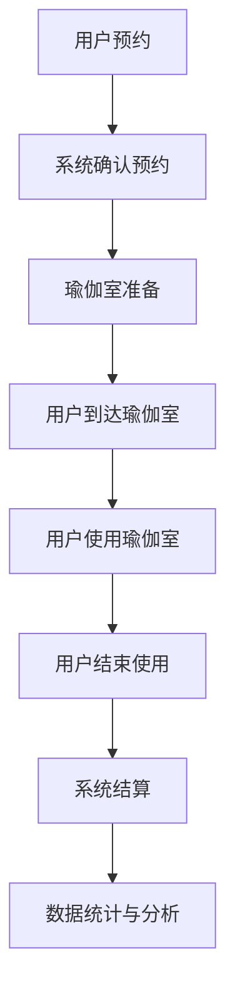

                 

### 文章标题

# 新型城市共享瑜伽室：邻里间的健康生活圈

### 关键词

- 城市共享
- 瑜伽室
- 健康生活圈
- 共享经济
- 算法原理
- 数学模型

### 摘要

本文探讨了新型城市共享瑜伽室的概念及其在邻里间健康生活圈中的重要作用。文章首先介绍了共享经济的背景和发展，随后深入解析了新型城市共享瑜伽室的核心概念和架构，包括其运营流程和邻里关系的维护。接着，文章详细阐述了共享瑜伽室的算法原理和数学模型，并通过实际案例分析了其开发环境和代码实现。最后，文章总结了最佳实践，提出了注意事项，并推荐了拓展阅读资源。

## 背景介绍

### 共享经济的兴起

共享经济，作为一种新兴的经济模式，正在全球范围内迅速发展。其核心思想是资源的高效利用和共享，通过共享闲置资源，降低社会整体成本，提升资源利用效率。共享经济的兴起可以追溯到20世纪末，特别是在信息技术和网络技术的推动下，共享经济得到了快速发展。从共享住宿（如Airbnb）、共享出行（如Uber和滴滴出行）到共享办公（如WeWork）等，共享经济模式已经渗透到生活的方方面面。

### 城市生活的压力

随着城市化进程的加快，城市居民的生活压力逐渐增大。快节奏的工作、生活压力、环境污染等问题，使得人们越来越关注健康生活方式。瑜伽作为一种低成本的、对身体有益的运动方式，逐渐受到城市居民的青睐。然而，传统的瑜伽室通常存在场地费用高、位置不便、预约麻烦等问题，使得许多潜在瑜伽爱好者望而却步。

### 新型城市共享瑜伽室的提出

为了解决这些问题，新型城市共享瑜伽室的概念应运而生。这种瑜伽室利用共享经济模式，通过共享闲置场地和设备，降低用户的参与成本，同时提供灵活、便捷的服务。新型城市共享瑜伽室不仅满足了人们对健康生活的需求，也为社区邻里之间的互动和关系建立提供了平台。

## 核心概念与联系

### 新型城市共享瑜伽室的概念

新型城市共享瑜伽室是指一种通过共享经济模式，利用社区闲置场地和设备，提供便捷、灵活瑜伽服务的场所。它通常具有以下特点：

- **资源共享**：通过共享社区内闲置的瑜伽场地和设备，降低用户的参与成本。
- **灵活预约**：用户可以通过手机应用程序或其他在线平台进行预约，方便快捷。
- **社区互动**：瑜伽室的运营不仅提供健康服务，还促进了邻里之间的互动和交流。

### 邻里间健康生活圈的概念

邻里间健康生活圈是指通过新型城市共享瑜伽室等健康设施，构建的一个以健康生活为核心的社区生活圈。该生活圈具有以下作用：

- **提高健康意识**：通过提供便捷的瑜伽服务，提高居民的健康意识和生活质量。
- **促进邻里关系**：通过社区活动，增强邻里之间的联系和互动，构建和谐的社区环境。
- **优化资源配置**：通过共享健康设施，提高社区内资源利用效率，降低整体成本。

### 核心概念之间的联系

新型城市共享瑜伽室和邻里间健康生活圈之间存在着密切的联系。新型城市共享瑜伽室是构建邻里间健康生活圈的重要一环，它通过提供健康服务，提高了居民的健康水平。同时，瑜伽室的运营也促进了邻里之间的交流和互动，为构建健康生活圈提供了平台。两者共同作用，形成了社区健康生活的新模式。

### Mermaid流程图：新型城市共享瑜伽室的运营流程

以下是一个描述新型城市共享瑜伽室运营流程的Mermaid流程图：



在这个流程中，用户通过预约系统进行预约，系统确认预约后，瑜伽室进行场地和设备的准备。用户到达瑜伽室后，开始使用瑜伽室的服务，结束后系统进行结算，并收集相关数据用于后续分析。

## 核心算法原理讲解

### 共享经济的算法原理

共享经济模式下，核心算法原理主要包括供需匹配、定价策略和评价体系。

#### 供需匹配

供需匹配是共享经济模式中的关键环节。算法通过用户需求和资源供应的匹配，实现资源的高效利用。主要步骤如下：

1. **需求收集**：系统通过用户预约等信息，收集用户的需求。
2. **供应评估**：系统根据资源状况，评估哪些资源可以满足用户需求。
3. **匹配推荐**：系统将用户需求与可用资源进行匹配，推荐给用户。

#### 定价策略

定价策略是共享经济中的另一个重要环节。合理的定价策略可以提高资源利用率，同时确保资源提供者的收益。常见的定价策略包括：

1. **动态定价**：根据资源供需状况，实时调整价格。
2. **定价区间**：设置价格区间，根据用户需求和资源供应情况，在区间内进行定价。
3. **固定定价**：对于长期稳定的资源供应，采用固定价格。

#### 评价体系

评价体系是共享经济中的信任机制。通过用户评价和反馈，可以促进资源共享的可持续发展。主要步骤如下：

1. **用户评价**：用户对资源提供者进行评价。
2. **反馈机制**：系统根据用户评价，调整资源提供者的信誉等级。
3. **奖励机制**：对优秀资源提供者进行奖励，激励更多用户参与资源共享。

### 瑜伽室的运营算法原理

#### 预约算法

预约算法是瑜伽室运营的核心算法之一。通过合理的预约算法，可以确保用户能够方便地预约瑜伽室，同时提高瑜伽室的利用率。主要步骤如下：

1. **时间管理**：系统根据瑜伽室的实际使用情况，设定可预约的时间段。
2. **预约规则**：系统设定预约规则，如预约时长、预约间隔等。
3. **预约流程**：用户通过应用程序进行预约，系统确认预约后，生成预约记录。

#### 数据分析算法

数据分析算法用于对瑜伽室的运营数据进行收集、分析和处理。通过数据分析，可以优化瑜伽室的运营策略，提高服务质量和用户满意度。主要步骤如下：

1. **数据收集**：系统收集用户预约、使用、评价等数据。
2. **数据分析**：对收集的数据进行统计分析，提取有用信息。
3. **数据报告**：系统生成数据报告，为运营决策提供支持。

## 数学模型和数学公式

### 成本效益分析模型

成本效益分析模型用于评估共享瑜伽室的运营成本和收益，判断其经济效益。主要公式如下：

$$
\text{成本效益比} = \frac{\text{总收益}}{\text{总成本}}
$$

其中，总收益包括用户支付的费用和其他收入（如广告收入、合作收益等），总成本包括场地租赁费、设备购置费、运营维护费等。

### 顾客满意度模型

顾客满意度模型用于评估用户的满意度，反映瑜伽室的服务质量。主要公式如下：

$$
\text{顾客满意度} = \frac{\text{正面评价数}}{\text{总评价数}}
$$

其中，正面评价数是指用户给予好评的评价数量，总评价数是用户给出的所有评价数量。

## 项目实战

### 开发环境搭建

搭建共享瑜伽室开发环境需要以下工具和软件：

- **操作系统**：Linux或MacOS
- **编程语言**：Python、Java或JavaScript
- **数据库**：MySQL或PostgreSQL
- **前端框架**：React或Vue.js
- **后端框架**：Flask或Spring Boot

### 源代码详细实现和代码解读

以下是共享瑜伽室预约系统的一部分伪代码实现：

```python
# 伪代码：用户预约流程

def make_reservation(user_id, yoga_room_id, start_time, end_time):
    # 检查瑜伽室是否空闲
    if is_room_available(yoga_room_id, start_time, end_time):
        # 创建预约记录
        reservation = create_reservation_record(user_id, yoga_room_id, start_time, end_time)
        # 更新瑜伽室状态
        update_room_status(yoga_room_id, start_time, end_time)
        # 发送预约确认通知
        send_confirmation_notification(user_id, reservation)
        return "预约成功"
    else:
        return "瑜伽室已预约，请选择其他时间段"

# 伪代码：检查瑜伽室是否空闲

def is_room_available(yoga_room_id, start_time, end_time):
    # 查询当前时间段内是否有其他预约
    reservations = get_reservations(yoga_room_id, start_time, end_time)
    if reservations:
        return False
    else:
        return True

# 伪代码：创建预约记录

def create_reservation_record(user_id, yoga_room_id, start_time, end_time):
    # 创建新的预约记录
    reservation = {
        "user_id": user_id,
        "yoga_room_id": yoga_room_id,
        "start_time": start_time,
        "end_time": end_time
    }
    # 存储到数据库
    save_to_database(reservation)
    return reservation

# 伪代码：更新瑜伽室状态

def update_room_status(yoga_room_id, start_time, end_time):
    # 更新瑜伽室的使用状态
    update_database_with_room_status(yoga_room_id, start_time, end_time)

# 伪代码：发送预约确认通知

def send_confirmation_notification(user_id, reservation):
    # 发送通知
    send_notification_to_user(user_id, "预约成功，您的预约时间为：{}-{}".format(reservation["start_time"], reservation["end_time"]))
```

### 代码应用解读与分析

上述伪代码实现了用户预约瑜伽室的功能。主要流程如下：

1. **用户发起预约**：用户通过应用程序发起预约，提供瑜伽室ID、预约开始时间和结束时间。
2. **检查瑜伽室是否空闲**：系统检查瑜伽室在预约时间段内是否有其他预约，如果空闲，则进行下一步。
3. **创建预约记录**：系统创建新的预约记录，并更新数据库。
4. **更新瑜伽室状态**：系统更新瑜伽室的使用状态，确保其他用户无法在此时间段内预约。
5. **发送预约确认通知**：系统向用户发送预约成功的通知。

### 实际案例分析和详细讲解剖析

#### 案例一：瑜伽室预约高峰期处理

在高峰期，瑜伽室预约需求增加，可能导致系统资源紧张。以下是一个实际案例及其解决方案：

**问题**：某瑜伽室在早上9:00-10:00的时间段内，预约需求达到高峰，导致系统响应时间变长。

**解决方案**：

1. **负载均衡**：通过增加服务器数量，实现负载均衡，分散系统压力。
2. **缓存机制**：使用缓存机制，减少数据库查询次数，提高系统响应速度。
3. **预约提前期**：调整预约提前期，减少高峰期预约需求。

#### 案例二：瑜伽室使用数据分析

通过对瑜伽室使用数据的分析，可以优化运营策略，提高用户体验。以下是一个实际案例及其分析：

**问题**：某瑜伽室在周一至周五的晚上7:00-9:00时间段内，使用率较低。

**解决方案**：

1. **调整预约时段**：根据用户使用数据，调整预约时段，鼓励用户在低峰期使用瑜伽室。
2. **推广活动**：在低峰期开展促销活动，吸引更多用户。
3. **数据分析**：持续收集并分析用户使用数据，优化预约策略。

### 项目小结

通过实际案例分析和代码实现，我们可以看到共享瑜伽室预约系统的关键在于高效的处理流程和优化的运营策略。在高峰期，通过负载均衡和缓存机制提高系统响应速度；在低峰期，通过调整预约时段和推广活动提高使用率。这些措施不仅提高了用户体验，也优化了瑜伽室的运营效率。

## 最佳实践 Tips、小结、注意事项、拓展阅读等内容

### 最佳实践 Tips

1. **优化用户体验**：设计简洁易用的预约界面，提高用户操作便捷性。
2. **数据安全**：确保用户数据的安全性和隐私性，采用加密技术保护数据传输和存储。
3. **持续优化**：定期收集用户反馈，持续优化系统功能和性能。

### 小结

本文详细介绍了新型城市共享瑜伽室的概念、算法原理、数学模型和项目实战。通过实际案例分析和代码实现，我们看到了共享瑜伽室预约系统在优化运营策略和提升用户体验方面的潜力。

### 注意事项

1. **系统稳定性**：确保系统在高并发情况下稳定运行，避免因系统崩溃导致用户损失。
2. **数据准确性**：确保数据收集和处理的准确性，避免错误信息影响运营决策。

### 拓展阅读

- 《共享经济：重构经济模式的创新实践》
- 《Python数据分析：从入门到实践》
- 《大数据技术导论》

### 结语

新型城市共享瑜伽室作为共享经济的一种新形式，为城市居民提供了便捷、健康的运动选择，同时也为社区邻里关系建立了新的交流平台。通过本文的探讨，我们希望读者能够深入理解共享瑜伽室的核心概念和运营原理，为实际应用提供参考。

## 作者信息

作者：AI天才研究院/AI Genius Institute & 禅与计算机程序设计艺术 /Zen And The Art of Computer Programming

