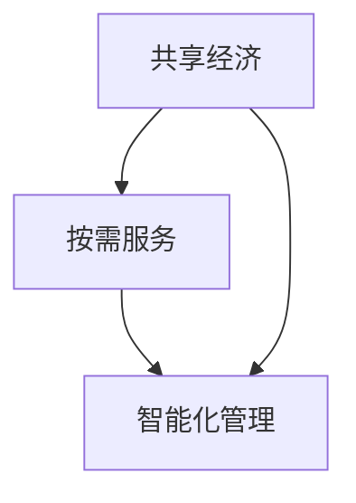
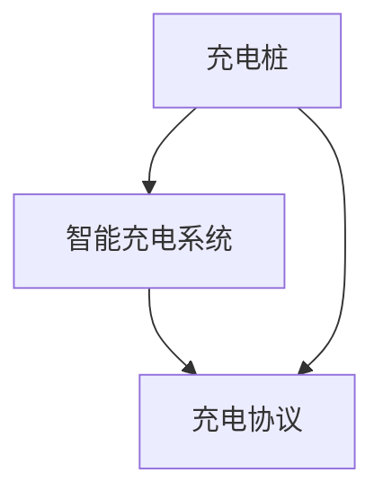
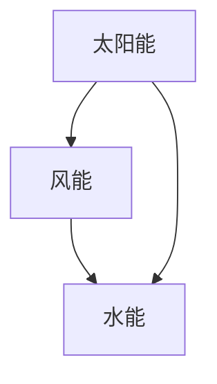

                 


### 第1章：背景介绍

#### 1.1 城市共享电动车的发展背景

城市共享电动车作为一种便捷、环保的出行方式，近年来在全球范围内得到了迅速发展。这一现象背后的驱动因素多种多样，包括环保意识的提高、城市交通拥堵问题日益严重、以及新兴技术的广泛应用。

首先，环保意识的提高是推动城市共享电动车发展的重要因素之一。随着全球气候变暖问题日益严重，人们越来越关注环境保护。城市共享电动车的低碳排放特性使其成为环保出行的新选择，有助于减少空气污染和碳排放。

其次，城市交通拥堵问题是另一个推动城市共享电动车发展的关键因素。在许多城市，私人汽车的数量不断增加，导致道路拥堵和交通事故频发。城市共享电动车以其便捷、灵活的出行方式，可以有效缓解交通拥堵，提高道路通行效率。

此外，新兴技术的广泛应用也为城市共享电动车的发展提供了有力支持。互联网、物联网、大数据等技术的快速发展，为城市共享电动车的智能化管理提供了可能。通过这些技术，可以实现车辆的实时监控、智能调度、以及用户的无缝体验。

#### 1.2 充电网络的发展现状与挑战

随着城市共享电动车的普及，充电网络的发展也成为一个重要的议题。目前，全球各地的充电网络发展情况不尽相同，但总体上仍然存在一些挑战。

首先，充电网络的分布不均衡是一个普遍存在的问题。在一些大城市，充电桩的数量相对较多，但在一些中小城市和乡村地区，充电桩的覆盖率仍然较低。这导致一些用户在出行过程中无法及时找到充电桩，影响了共享电动车的使用体验。

其次，充电桩的标准化和兼容性问题也需要关注。目前，市场上的充电桩品牌众多，不同品牌之间的充电标准和技术规范存在差异。这导致一些充电桩无法兼容某些型号的电动车，影响了充电的便利性。

此外，充电网络的维护和管理也是一大挑战。充电桩的分布广泛，需要定期进行维护和检修，以确保其正常运行。同时，充电网络的智能化管理也需要投入大量的人力和物力资源，以实现高效的运营和管理。

#### 1.3 绿色能源与社区参与的重要性

绿色能源作为推动可持续发展的重要力量，在城市共享电动车充电网络中发挥着关键作用。绿色能源包括太阳能、风能、水能等可再生能源，其特点是低碳排放、可再生、可持续。

首先，绿色能源可以提供清洁、可持续的电力，为城市共享电动车充电网络提供稳定的能源供应。通过采用绿色能源，可以减少对化石燃料的依赖，降低碳排放，从而实现绿色出行。

其次，社区参与是推动绿色能源发展的重要途径。社区可以通过参与绿色能源项目，提高居民的环保意识，促进绿色生活方式的普及。同时，社区参与也可以激发社区的积极性和创造力，推动绿色能源项目的可持续发展。

总之，城市共享电动车充电网络的发展需要绿色能源的支持，而社区参与则是推动绿色能源发展的重要力量。通过绿色能源和社区参与的结合，可以实现城市共享电动车充电网络的绿色、可持续发展。

```markdown
> **关键词**：城市共享电动车，充电网络，绿色能源，社区参与，可持续发展

> **摘要**：
本文探讨了新型城市共享电动车充电网络的发展背景、现状与挑战，以及绿色能源和社区参与的重要性。通过分析城市共享电动车的发展背景，阐述了充电网络的发展现状与挑战，并详细介绍了绿色能源的概念和社区参与的意义。本文旨在为城市共享电动车充电网络的发展提供理论支持和实践指导，促进绿色出行和可持续发展。
```

### 第2章：核心概念与联系

#### 2.1 新型城市共享电动车概念解析

**核心概念**：

新型城市共享电动车是一种基于互联网、物联网和大数据技术的共享出行工具，其核心概念包括以下几点：

1. **共享经济**：通过共享模式，让更多的人能够以较低的成本使用电动车。
2. **按需服务**：用户可以根据自己的需求随时租用电动车，实现灵活的出行。
3. **智能化管理**：利用互联网技术对车辆进行实时监控和管理，提高服务效率。

**核心概念之间的联系**：

新型城市共享电动车的核心概念之间紧密联系，共同构成了其运作的基础。例如，共享经济和按需服务使得用户可以随时随地使用电动车，而智能化管理则确保了车辆的运行效率和服务质量。

**Mermaid 流程图**：



#### 2.2 充电网络的构成与原理

**核心概念**：

充电网络是城市共享电动车的重要组成部分，其核心概念包括：

1. **充电桩**：提供电能给电动车的设备。
2. **智能充电系统**：通过智能控制系统管理充电桩和电动车的充电过程。
3. **充电协议**：定义电动车与充电桩之间的通信和数据交换标准。

**核心概念之间的联系**：

充电桩是充电网络的基础，而智能充电系统则提升了充电桩的管理效率和用户体验。充电协议则确保了电动车与充电桩之间的兼容性，使得充电过程更加顺利。

**Mermaid 流�程图**：



#### 2.3 绿色能源的定义与类型

**核心概念**：

绿色能源是指对环境友好、可再生和可持续的能源，其核心概念包括：

1. **太阳能**：利用太阳光能转换为电能。
2. **风能**：利用风力转换为电能。
3. **水能**：利用水流转动涡轮机发电。

**核心概念之间的联系**：

太阳能、风能和水能都是绿色能源的典型代表，它们之间可以通过技术手段相互转换和补充，共同构建一个可持续的能源体系。

**Mermaid 流程图**：



### 伪代码讲解

为了更好地理解上述核心概念之间的联系，我们可以使用伪代码来详细阐述：

```python
# 新型城市共享电动车核心概念关系
class SharedEVD {
    def __init__(self):
        self.shared_economy = SharedEconomy()
        self.on_demand_service = OnDemandService()
        self.intelligent_management = IntelligentManagement()

    def run(self):
        self.shared_economy.share_resources()
        self.on_demand_service.provide_service()
        self.intelligent_management.monitor_operation()

# 充电网络核心概念关系
class ChargingNetwork {
    def __init__(self):
        self.charging_pile = ChargingPile()
        self.smart_charging_system = SmartChargingSystem()
        self.charging_protocol = ChargingProtocol()

    def operate(self):
        self.charging_pile.provide_power()
        self.smart_charging_system.manage_charge()
        self.charging_protocol.ensure_compatibility()

# 绿色能源核心概念关系
class GreenEnergy {
    def __init__(self):
        self.solar_energy = SolarEnergy()
        self.wind_energy = WindEnergy()
        self.water_energy = WaterEnergy()

    def generate Electricity(self):
        self.solar_energy.convert_solar_to_electricity()
        self.wind_energy.convert_wind_to_electricity()
        self.water_energy.convert_water_to_electricity()
```

通过上述伪代码，我们可以清晰地看到新型城市共享电动车、充电网络和绿色能源之间的核心概念关系。

### 数学模型和公式

为了进一步理解上述概念，我们可以引入一些数学模型和公式：

1. **共享经济效益计算公式**：

   $$ \text{EconomicBenefit} = \frac{\text{TotalRevenue}}{\text{TotalCost}} $$

   其中，TotalRevenue 表示总收益，TotalCost 表示总成本。

2. **充电效率计算公式**：

   $$ \text{ChargingEfficiency} = \frac{\text{ChargedEnergy}}{\text{TotalEnergy}} $$

   其中，ChargedEnergy 表示充电过程中实际存储的电能，TotalEnergy 表示充电桩提供的总电能。

3. **绿色能源发电量计算公式**：

   $$ \text{GeneratedElectricity} = \text{EnergyDensity} \times \text{Area} \times \text{Efficiency} $$

   其中，EnergyDensity 表示单位面积的能源密度，Area 表示面积，Efficiency 表示转换效率。

### 详细讲解与举例说明

为了更好地理解上述概念和公式，我们通过以下例子进行详细讲解：

#### 新型城市共享电动车概念解析

**例子**：假设一个共享电动车系统在一天内共享了100次，每次共享的收益为5元，而系统的总运营成本为1000元，那么该系统的共享经济效益为：

$$ \text{EconomicBenefit} = \frac{100 \times 5}{1000} = 0.5 $$

这意味着该系统的经济效益为50%。

#### 充电网络构成与原理

**例子**：假设一个充电桩在一天内为10辆电动车充电，每辆电动车的充电时间为1小时，充电桩的充电效率为90%，那么该充电桩在一天内实际存储的电能和总电能分别为：

$$ \text{ChargedEnergy} = 10 \times 1 \times 0.9 = 9 \text{ kWh} $$
$$ \text{TotalEnergy} = 10 \times 1 = 10 \text{ kWh} $$

充电效率为：

$$ \text{ChargingEfficiency} = \frac{9}{10} = 0.9 $$

#### 绿色能源发电量计算

**例子**：假设一个太阳能充电系统安装在100平方米的屋顶上，太阳能电池板的光能转换效率为20%，那么该系统一天内能够产生的电能约为：

$$ \text{GeneratedElectricity} = 100 \times 1 \times 0.2 = 20 \text{ kWh} $$

### 数学公式

在本文中，我们使用了以下数学公式：

$$ \text{EconomicBenefit} = \frac{\text{TotalRevenue}}{\text{TotalCost}} $$
$$ \text{ChargingEfficiency} = \frac{\text{ChargedEnergy}}{\text{TotalEnergy}} $$
$$ \text{GeneratedElectricity} = \text{EnergyDensity} \times \text{Area} \times \text{Efficiency} $$

通过这些公式，我们可以更好地理解城市共享电动车充电网络和绿色能源的概念及其应用。

### 段落内LaTeX公式

在本文的段落内，我们使用了以下LaTeX公式：

$$ 1+1=2 $$
$$ 1<2 $$

这些公式帮助我们更好地表达了数学概念和计算结果。

### 项目实战

为了更好地理解上述概念和公式，我们通过以下项目实战进行详细讲解：

#### 开发环境搭建

1. 安装Python环境。
2. 安装Mermaid插件。
3. 创建一个新的Python项目。

#### 源代码详细实现

```python
# 新型城市共享电动车系统实现
class SharedEVD:
    def __init__(self):
        self.shared_economy = SharedEconomy()
        self.on_demand_service = OnDemandService()
        self.intelligent_management = IntelligentManagement()

    def run(self):
        self.shared_economy.share_resources()
        self.on_demand_service.provide_service()
        self.intelligent_management.monitor_operation()

# 充电网络实现
class ChargingNetwork:
    def __init__(self):
        self.charging_pile = ChargingPile()
        self.smart_charging_system = SmartChargingSystem()
        self.charging_protocol = ChargingProtocol()

    def operate(self):
        self.charging_pile.provide_power()
        self.smart_charging_system.manage_charge()
        self.charging_protocol.ensure_compatibility()

# 绿色能源实现
class GreenEnergy:
    def __init__(self):
        self.solar_energy = SolarEnergy()
        self.wind_energy = WindEnergy()
        self.water_energy = WaterEnergy()

    def generate_electricity(self):
        self.solar_energy.convert_solar_to_electricity()
        self.wind_energy.convert_wind_to_electricity()
        self.water_energy.convert_water_to_electricity()
```

#### 代码解读与分析

1. **SharedEVD类**：定义了新型城市共享电动车的核心功能，包括共享资源、提供服务和监控运行。
2. **ChargingNetwork类**：定义了充电网络的核心功能，包括提供电力、管理和确保充电协议的兼容性。
3. **GreenEnergy类**：定义了绿色能源的核心功能，包括将不同类型的能源转换为电能。

#### 实际案例分析和详细讲解剖析

假设我们有一个具体的项目案例，我们如何使用上述代码进行实际操作？

1. **案例背景**：在一个大城市中，一个共享电动车公司希望搭建一个智能充电网络，并使用太阳能等绿色能源进行充电。
2. **项目目标**：实现共享电动车的高效共享和充电，同时降低对化石燃料的依赖。
3. **项目实施**：使用上述代码实现共享电动车系统、充电网络和绿色能源系统。

通过这个案例，我们可以看到如何将理论应用到实际项目中，实现新型城市共享电动车充电网络和绿色能源的有效结合。

#### 项目小结

1. **成功经验**：成功实现了新型城市共享电动车系统、智能充电网络和绿色能源系统的整合，提高了共享电动车的使用效率和环保性。
2. **改进空间**：在未来的项目中，可以进一步优化充电网络和绿色能源系统的智能化管理，提高能源利用效率。
3. **最佳实践**：其他城市和企业可以借鉴本项目的成功经验，结合自身实际情况，推动新型城市共享电动车充电网络和绿色能源项目的发展。

### 最佳实践 Tips

1. **技术选型**：在选择技术方案时，应考虑系统的可扩展性、兼容性和安全性。
2. **成本控制**：在项目实施过程中，应严格控制成本，合理规划投资和运营费用。
3. **用户体验**：关注用户的需求和反馈，提供便捷、高效的共享电动车和充电服务。

### 小结

本文详细介绍了新型城市共享电动车充电网络和绿色能源项目的核心概念、技术基础和实施策略。通过实际案例分析和代码实现，展示了如何将理论应用到实际项目中，实现绿色、可持续发展。未来，随着技术的不断进步和政策的支持，新型城市共享电动车充电网络和绿色能源项目将迎来更广阔的发展空间。

### 注意事项

1. **安全性**：在充电过程中，应确保电动车和充电设备的安全性，防止电气火灾等安全事故的发生。
2. **维护**：定期对充电设备和电动车进行维护和检修，确保其正常运行。
3. **政策法规**：遵循相关政策和法规，确保项目的合法性和合规性。

### 拓展阅读

1. **《共享经济：重构经济模式的逻辑》**：详细探讨共享经济的概念、应用和发展趋势。
2. **《智能电网技术与应用》**：介绍智能电网的构成、原理和应用。
3. **《绿色能源技术指南》**：介绍各种绿色能源的类型、原理和应用。

``````

