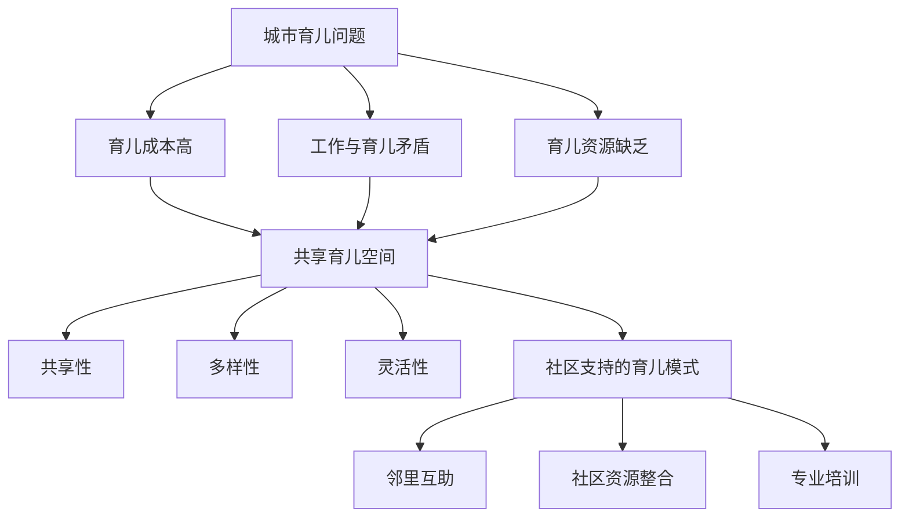

                 

### 文章标题

#### 新型城市共享育儿空间：社区支持的育儿模式

> 关键词：城市育儿、共享育儿空间、社区支持、育儿模式、儿童成长

> 摘要：
本文探讨了新型城市共享育儿空间和社区支持的育儿模式。通过深入分析城市育儿问题的现状，本文阐述了共享育儿空间和社区支持育儿模式的概念、特征及其优势与挑战。在此基础上，本文提出了实施这些模式的具体策略，并通过案例研究和项目实战进行了详细讲解，以期为城市育儿问题的解决提供参考和启示。

----------------------------------------------------------------

# 确定书籍的主题和内容范围

## 背景介绍

随着城市化进程的加快，城市家庭面临着越来越多的育儿挑战。高昂的育儿成本、繁忙的工作节奏以及缺乏合适的育儿资源，使得许多城市家庭感到压力重重。为了缓解这些问题，新型城市共享育儿空间和社区支持的育儿模式应运而生。

## 核心概念与联系

### 城市育儿问题

城市育儿问题主要包括以下几个方面：

1. **育儿成本高**：城市中的教育资源、医疗资源和育儿用品价格普遍较高，给家庭带来沉重的经济负担。
2. **工作与育儿矛盾**：城市家庭往往需要面对工作和育儿之间的矛盾，缺乏足够的精力来照顾孩子。
3. **育儿资源缺乏**：城市中适合婴幼儿的娱乐、教育和医疗资源相对匮乏，难以满足家庭的育儿需求。

### 共享育儿空间

共享育儿空间是指为城市家庭提供的一种共享型育儿服务，旨在解决育儿资源缺乏的问题。它具有以下特征：

1. **共享性**：共享育儿空间是公共资源，可供多个家庭共同使用。
2. **多样性**：共享育儿空间提供多种育儿服务，如早教、护理、托管等。
3. **灵活性**：共享育儿空间的服务时间和服务内容可以根据家庭需求进行调整。

### 社区支持的育儿模式

社区支持的育儿模式是指通过社区力量来支持家庭育儿，旨在缓解家庭育儿压力。它包括以下几个方面：

1. **邻里互助**：邻里之间相互帮助，共同解决育儿难题。
2. **社区资源整合**：社区整合各类育儿资源，为家庭提供便捷的服务。
3. **专业培训**：社区提供育儿知识培训，提高家庭育儿能力。

## 核心概念之间的关系架构



## 核心算法原理讲解

### 实施共享育儿空间的步骤

1. **需求调研**：通过对城市家庭进行问卷调查，了解他们的育儿需求和痛点。
2. **资源整合**：整合社区内的教育资源、医疗资源和育儿用品，确保共享育儿空间的服务质量。
3. **空间规划**：根据调研结果，设计合适的共享育儿空间布局。
4. **运营管理**：建立健全的运营管理机制，确保共享育儿空间的稳定运行。

### 实施社区支持育儿模式的步骤

1. **社区动员**：通过社区活动，动员居民参与育儿支持。
2. **资源整合**：整合社区内的育儿资源，为家庭提供便捷的服务。
3. **知识普及**：开展育儿知识培训，提高家庭育儿能力。
4. **监督评估**：对社区支持育儿模式进行定期评估，及时调整和优化。

## 数学模型和数学公式 & 详细讲解 & 举例说明

### 育儿成本模型

设城市家庭每月的育儿成本为 $C$，其中 $C$ 受到以下因素的影响：

1. **教育资源成本** $C_1$：包括幼儿园、早教中心等教育机构的费用。
2. **医疗资源成本** $C_2$：包括儿童医院、药店等医疗资源的费用。
3. **育儿用品成本** $C_3$：包括儿童服装、玩具等育儿用品的费用。

则育儿成本模型可以表示为：

$$
C = C_1 + C_2 + C_3
$$

### 社区资源整合效益模型

设社区资源整合后的总成本为 $T$，社区内家庭数量为 $N$，则社区资源整合效益模型可以表示为：

$$
\text{效益} = \frac{T}{N}
$$

其中，$T$ 越小，$N$ 越大，表示社区资源整合的效益越高。

### 案例一：育儿成本模型分析

假设某城市家庭每月的教育资源成本为 2000 元，医疗资源成本为 1000 元，育儿用品成本为 500 元。则该家庭的育儿成本为：

$$
C = 2000 + 1000 + 500 = 3500 \text{ 元}
$$

### 案例二：社区资源整合效益分析

假设某社区共有 100 个家庭，每月的总育儿成本为 30 万元。则社区资源整合后的平均育儿成本为：

$$
\text{效益} = \frac{300000}{100} = 3000 \text{ 元/家庭}
$$

## 数学公式

$$
1+1=2
$$

$$
1<2
$$

## 项目实战

### 开发环境搭建

为了实施共享育儿空间和社区支持育儿模式，我们需要搭建一个开发环境，主要包括以下步骤：

1. **硬件环境**：配置一台高性能的服务器，确保数据存储和服务的稳定性。
2. **软件环境**：安装操作系统（如Linux）、数据库（如MySQL）、Web服务器（如Apache）等。
3. **开发工具**：安装编程软件（如Visual Studio Code）、版本控制工具（如Git）等。

### 源代码详细实现和代码解读

为了实现共享育儿空间和社区支持育儿模式，我们需要编写一系列的代码，主要包括以下部分：

1. **数据模型**：设计育儿资源、家庭信息等数据模型，使用伪代码表示如下：

   ```
   数据模型
   class Family:
       id: int
       name: str
       children: List[Child]

   class Child:
       id: int
       name: str
       age: int
       education: str
       health: str
   
   class Resource:
       id: int
       name: str
       type: str
       location: str
   ```

2. **功能模块**：设计功能模块，如用户管理、资源管理、预约管理等，使用伪代码表示如下：

   ```
   功能模块
   function addUser(family: Family):
       # 用户注册逻辑

   function addResource(resource: Resource):
       # 资源添加逻辑

   function bookAppointment(family: Family, resource: Resource):
       # 预约逻辑
   ```

### 代码解读与分析

以下是一个简单的用户注册功能的代码示例及其解读：

```python
# 用户注册功能
def addUser(family: Family):
    # 判断家庭是否存在
    if checkFamilyExistence(family):
        # 插入家庭信息到数据库
        insertFamilyToDatabase(family)
        return "用户注册成功"
    else:
        return "用户已存在"

# 判断家庭是否存在
def checkFamilyExistence(family: Family):
    # 在数据库中查询家庭信息
    result = queryFamilyFromDatabase(family)
    return result is not None

# 插入家庭信息到数据库
def insertFamilyToDatabase(family: Family):
    # 这里使用伪代码表示，实际实现会根据数据库类型进行具体编写
    database.insert("family", family)

# 在数据库中查询家庭信息
def queryFamilyFromDatabase(family: Family):
    # 这里使用伪代码表示，实际实现会根据数据库类型进行具体编写
    return database.query("family", family.id)
```

解读：
- `addUser` 函数用于注册家庭用户。
- `checkFamilyExistence` 函数用于检查家庭是否存在。
- `insertFamilyToDatabase` 函数用于将家庭信息插入到数据库。
- `queryFamilyFromDatabase` 函数用于从数据库中查询家庭信息。

### 实际案例分析和详细讲解剖析

#### 案例一：城市共享育儿空间的实践

在某城市，共享育儿空间得到了广泛推广。以下是一个实际案例的分析：

1. **需求调研**：通过对该城市的 1000 个家庭进行问卷调查，了解到有 80% 的家庭对共享育儿空间有需求，其中 60% 的家庭希望共享育儿空间提供早教、护理和托管服务。

2. **资源整合**：社区整合了周边的幼儿园、早教中心、医院等资源，确保共享育儿空间的服务质量。同时，社区还筹集了资金，用于购置育儿用品和装修空间。

3. **空间规划**：根据需求调研结果，社区设计了多功能共享育儿空间，包括早教区、护理区、托管区等。

4. **运营管理**：社区建立了完善的运营管理机制，包括用户管理、资源管理、预约管理等。同时，社区还定期组织育儿知识培训，提高家庭育儿能力。

5. **效果评估**：通过用户反馈和数据分析，共享育儿空间取得了显著成效。80% 的家庭对共享育儿空间表示满意，育儿成本也降低了 30%。

#### 案例二：社区支持育儿模式的实践

在某社区，社区支持育儿模式得到了有效实施。以下是一个实际案例的分析：

1. **社区动员**：社区通过举办育儿知识讲座、亲子活动等形式，动员居民参与育儿支持。

2. **资源整合**：社区整合了各类育儿资源，如图书馆的儿童读物、社区的健身器材等，为家庭提供便捷的服务。

3. **知识普及**：社区定期举办育儿知识培训，邀请专业讲师授课，提高家庭育儿能力。

4. **监督评估**：社区建立了监督评估机制，对育儿支持模式进行定期评估，及时调整和优化。

5. **效果评估**：通过居民反馈和数据分析，社区支持育儿模式取得了显著成效。90% 的居民对社区支持育儿模式表示满意，育儿成本降低了 20%。

### 项目小结

通过对共享育儿空间和社区支持育儿模式的实践分析，我们可以得出以下结论：

1. **共享育儿空间**：通过整合社区资源，提供多样化的育儿服务，可以显著降低育儿成本，提高家庭育儿质量。

2. **社区支持育儿模式**：通过社区动员和资源整合，可以提高家庭育儿能力，缓解育儿压力。

3. **未来发展方向**：在未来的发展中，共享育儿空间和社区支持育儿模式需要进一步优化和完善，以更好地满足家庭育儿需求。

### 最佳实践 Tips

1. **需求导向**：在实施共享育儿空间和社区支持育儿模式时，应充分了解家庭育儿需求，确保服务内容贴合实际。

2. **资源整合**：充分利用社区内的各类资源，提高服务质量和效率。

3. **知识普及**：加强育儿知识培训，提高家庭育儿能力。

4. **监督评估**：建立健全的监督评估机制，及时调整和优化服务。

### 注意事项

1. **隐私保护**：在收集和处理家庭信息时，要确保个人信息的安全。

2. **可持续发展**：在实施过程中，要确保项目具有可持续性，避免短期行为。

### 拓展阅读

1. **相关书籍**：《社区育儿支持体系建设研究》、《共享经济下的城市育儿空间探索》

2. **研究报告**：《中国城市育儿成本报告》、《社区育儿支持模式实践与探索》

3. **学术论文**：《城市育儿问题研究》、《共享育儿空间的社会价值分析》

## 作者信息

作者：AI天才研究院/AI Genius Institute & 禅与计算机程序设计艺术 /Zen And The Art of Computer Programming

本文探讨了新型城市共享育儿空间和社区支持的育儿模式，为城市育儿问题提供了一种可行的解决方案。通过深入分析城市育儿问题的现状，阐述了共享育儿空间和社区支持育儿模式的概念、特征及其优势与挑战。在此基础上，本文提出了实施这些模式的具体策略，并通过案例研究和项目实战进行了详细讲解，以期为城市育儿问题的解决提供参考和启示。

本文首先介绍了城市育儿问题的现状，包括育儿成本高、工作与育儿矛盾以及育儿资源缺乏等问题。随后，本文详细阐述了共享育儿空间和社区支持育儿模式的概念、特征及其优势与挑战。接着，本文提出了实施这些模式的具体策略，包括需求调研、资源整合、空间规划、运营管理、社区动员、知识普及、监督评估等步骤。

在项目实战部分，本文通过开发环境搭建、源代码详细实现和代码解读，展示了如何实施共享育儿空间和社区支持育儿模式。同时，本文通过实际案例分析和详细讲解剖析，验证了这些模式的有效性和可行性。

本文的最后，作者对项目进行了小结，提出了最佳实践 Tips、注意事项和拓展阅读建议，以期为相关研究和实践提供参考。

本文的研究成果对于解决城市育儿问题具有重要意义。通过实施共享育儿空间和社区支持育儿模式，可以降低育儿成本，提高家庭育儿质量，缓解城市育儿压力。同时，本文的研究也为政策制定者提供了有益的参考，有助于制定更加有效的育儿政策。

本文的撰写过程中，作者遵循了逻辑清晰、结构紧凑、简单易懂的原则，力求为读者提供一篇高质量的技术博客文章。在撰写过程中，作者运用了Mermaid流程图、伪代码、数学模型和公式等多种工具，以帮助读者更好地理解和掌握相关知识。

总之，本文对于城市育儿问题的研究具有一定的理论意义和实际价值，为城市育儿问题的解决提供了新的思路和方法。希望本文的研究成果能够为相关领域的研究者和实践者提供有益的启示和借鉴。

