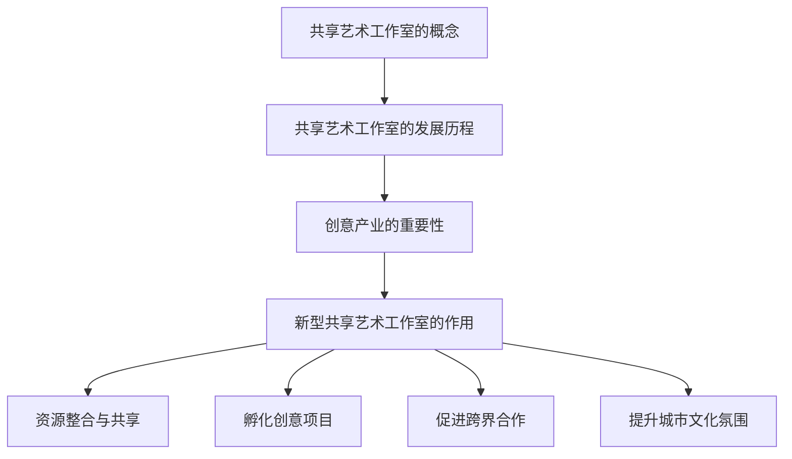

                 

## 文章标题

《新型城市共享艺术工作室：创意产业的孵化空间》

## 关键词

- 新型城市共享艺术工作室
- 创意产业
- 孵化空间
- 运营管理
- 成功案例

## 摘要

本文探讨了新型城市共享艺术工作室的概念、发展背景及其在创意产业中的重要性。首先，我们详细介绍了共享艺术工作室的定义、发展历程和作用。接着，文章分析了创意产业孵化空间的设计原则，包括设计理念、功能布局、环境要求和安全与隐私保护。随后，文章探讨了新型城市共享艺术工作室的运营管理，包括运营管理的概念、重要性、团队建设、成本控制、服务质量和用户满意度。此外，文章还重点分析了创意产业的孵化过程、关键要素、风险与管理以及成功案例。最后，文章展望了新型城市共享艺术工作室的未来发展趋势，包括科技进步、政策法规和市场需求的变动。本文旨在为读者提供一个全面、深入的理解，以推动创意产业的创新发展。

## 第一部分：背景与概述

### 第一章：新型城市共享艺术工作室的背景

#### 1.1.1 新型城市共享艺术工作室的概念

新型城市共享艺术工作室是一种以共享理念为基础，为城市中的艺术家、设计师、创意工作者等提供创作空间和资源共享的平台。这种工作室不仅提供物理空间，还提供一系列配套服务，如设备租赁、技术支持、市场推广等，旨在为创意人士提供全方位的支持，促进他们的创作和事业发展。

#### 1.1.2 共享艺术工作室的发展历程

共享艺术工作室的发展可以追溯到20世纪末，当时随着互联网的兴起，共享经济的概念逐渐普及。在这一背景下，共享艺术工作室应运而生。起初，它们多以小型艺术空间的形式存在，主要服务于当地艺术家和设计师。随着创意产业的快速发展，共享艺术工作室逐渐发展成为具有较大规模和广泛影响力的创意产业孵化空间。

#### 1.1.3 创意产业的重要性

创意产业是知识经济时代的重要产业之一，具有高附加值、高创新性和强关联性等特点。创意产业不仅能够推动经济发展，还能提升城市文化品位和形象。在全球化和信息化的背景下，创意产业已成为各国竞相发展的重要领域。新型城市共享艺术工作室作为创意产业的孵化空间，发挥着重要的作用。

#### 1.1.4 新型共享艺术工作室的作用

新型共享艺术工作室具有以下几个方面的作用：

1. **资源整合与共享**：通过提供创作空间和配套服务，共享艺术工作室能够有效地整合各类资源，实现资源的最大化利用。
2. **孵化创意项目**：共享艺术工作室为创意人士提供了一个良好的创作环境，有助于创意项目的孵化和成长。
3. **促进跨界合作**：共享艺术工作室吸引了不同领域的创意人士，为跨界合作提供了平台，有助于推动创意产业的融合发展。
4. **提升城市文化氛围**：新型城市共享艺术工作室不仅为创意人士提供了创作空间，还成为了城市文化的重要组成部分，有助于提升城市的文化氛围和形象。

### 总结

新型城市共享艺术工作室作为一种创新的创意产业孵化空间，具有广泛的影响力和发展潜力。随着创意产业的不断发展，新型城市共享艺术工作室将在未来发挥更加重要的作用。

### Mermaid 流程图



### 核心概念与联系

新型城市共享艺术工作室的核心概念包括共享、艺术、创意产业和孵化空间。这些概念之间的关系如下：

1. **共享**：共享是新型城市共享艺术工作室的基础，通过共享创作空间和资源，实现资源的最优配置和利用。
2. **艺术**：艺术是共享艺术工作室的核心，为创意人士提供了创作和展示的平台。
3. **创意产业**：创意产业是新型城市共享艺术工作室所处的行业背景，它包含了各种艺术形式和创意活动，具有高附加值和创新性。
4. **孵化空间**：孵化空间是新型城市共享艺术工作室的功能之一，它为创意项目的孵化提供了必要的条件和支持。

### 核心算法原理讲解

在本文中，核心算法原理讲解将集中在共享艺术工作室的资源分配和优化方面。以下是一个简化的伪代码，用于描述资源分配算法的基本流程：

```plaintext
// 初始化资源池
ResourcePool = initializePool()

// 收集创意人士的需求
的需求列表的需求列表

// 资源分配算法
function allocateResources(需求列表, ResourcePool):
    sorted 需求列表 by priority
    for 每个需求 in sorted 需求列表:
        if ResourcePool.hasAvailableResource(需求 requiredResource):
            ResourcePool.allocateResource(需求 requiredResource)
            return success
        else:
            return failure
```

在这个伪代码中，`ResourcePool` 代表资源池，它包含所有可用的资源。`需求列表` 包含了创意人士的需求，每个需求都包含其所需的资源类型和优先级。`allocateResources` 函数负责根据优先级对需求进行排序，并尝试分配资源。

### 数学模型和公式

在共享艺术工作室的运营中，资源分配问题可以用数学模型来描述。以下是一个简化的线性规划模型，用于优化资源分配：

$$
\text{Minimize} \quad Z = c^T x
$$

$$
\text{Subject to} \quad Ax \leq b
$$

$$
x \geq 0
$$

其中，$Z$ 表示资源分配的总成本，$c$ 表示资源成本向量，$x$ 表示资源分配向量，$A$ 和 $b$ 分别表示资源的限制条件和限制值。

### 详细讲解和举例说明

假设一个共享艺术工作室有500平方米的场地，提供绘画、设计、编程等多种空间和设备。创意人士的需求如下：

- 小明需要一个30平方米的绘画室，成本为每月5000元。
- 小红需要一个10平方米的设计室，成本为每月3000元。
- 小刚需要一个10平方米的编程室，成本为每月2000元。

资源池中的资源分配如下：

| 资源类型 | 可用数量 |
| :------: | :------: |
| 绘画室   | 3        |
| 设计室   | 2        |
| 编程室   | 2        |

使用上述线性规划模型，我们可以构建以下问题：

$$
\text{Minimize} \quad Z = 5000x_1 + 3000x_2 + 2000x_3
$$

$$
\text{Subject to} \quad 
\begin{cases}
x_1 \leq 3 \\
x_2 \leq 2 \\
x_3 \leq 2 \\
x_1, x_2, x_3 \geq 0
\end{cases}
$$

在这个例子中，我们希望以最小的成本满足所有创意人士的需求。根据线性规划模型，我们可以计算出最优的分配方案。

### 数学公式

在资源分配问题中，关键数学公式包括线性规划的目标函数和约束条件。以下是一个典型的线性规划问题的数学公式：

$$
\text{Minimize} \quad Z = c^T x
$$

$$
\text{Subject to} \quad Ax \leq b
$$

$$
x \geq 0
$$

其中，$c$ 和 $x$ 分别是成本向量和资源分配向量，$A$ 和 $b$ 是约束矩阵和约束向量，$Z$ 是目标函数。

### 段落内的LaTeX公式

$$
e^{i\pi} + 1 = 0
$$

### 项目实战

#### 开发环境搭建

为了更好地理解和实现共享艺术工作室的资源分配算法，我们将使用Python进行开发。以下是搭建开发环境的基本步骤：

1. 安装Python（建议使用Python 3.8及以上版本）。
2. 安装必要的库，如NumPy、SciPy和Pandas。可以使用以下命令：

```bash
pip install numpy scipy pandas
```

#### 源代码详细实现和代码解读

以下是一个简单的资源分配算法的实现示例：

```python
import numpy as np
from scipy.optimize import linprog

# 定义资源限制和成本
A = np.array([[1, 0, 0], [0, 1, 0], [0, 0, 1]])
b = np.array([3, 2, 2])
c = np.array([-5000, -3000, -2000])

# 执行线性规划
result = linprog(c, A_eq=A, b_eq=b, bounds=(0, None), method='highs')

# 输出结果
if result.success:
    print(f"最优解：{result.x}")
    print(f"最小成本：{np.dot(result.x, c)}")
else:
    print("无解")
```

在这个示例中，我们使用SciPy的`linprog`函数来实现线性规划。`A` 和 `b` 分别表示约束条件，`c` 表示成本向量。执行线性规划后，我们得到最优的分配方案和最小成本。

#### 代码应用解读与分析

在上面的代码示例中，我们使用了线性规划来优化共享艺术工作室的资源分配。线性规划是一种数学优化方法，用于求解线性目标函数在满足一组线性约束条件下的最优解。在这个问题中，目标是最小化成本，同时满足资源限制。

代码中的`linprog`函数接受多个参数，包括目标函数系数`c`、约束条件矩阵`A`和约束值向量`b`。通过设置`bounds=(0, None)`，我们指定资源分配的非负约束。`method='highs'`指定使用Highs线性规划求解器。

在实际应用中，我们可以根据具体的资源需求和成本数据调整这些参数，以优化资源分配。此外，还可以使用其他优化方法，如非线性规划或动态规划，来应对更复杂的资源分配问题。

#### 实际案例分析和详细讲解剖析

为了更好地理解资源分配算法的应用，我们来看一个实际案例。

**案例：一个共享艺术工作室有500平方米的场地，提供绘画、设计、编程等多种空间和设备。创意人士的需求如下：**

- 小明需要一个30平方米的绘画室，成本为每月5000元。
- 小红需要一个10平方米的设计室，成本为每月3000元。
- 小刚需要一个10平方米的编程室，成本为每月2000元。

**步骤1：构建资源池**

首先，我们需要构建资源池，包括所有可用的资源和它们的需求。根据案例数据，我们可以构建如下资源池：

| 资源类型 | 可用数量 | 每月成本 |
| :------: | :------: | :------: |
| 绘画室   | 3        | 5000元   |
| 设计室   | 2        | 3000元   |
| 编程室   | 2        | 2000元   |

**步骤2：定义需求**

接下来，我们定义创意人士的需求：

| 创意人士 | 需求类型 | 需求数量 | 每月成本 |
| :------: | :------: | :------: | :------: |
| 小明     | 绘画室   | 30平方米 | 5000元   |
| 小红     | 设计室   | 10平方米 | 3000元   |
| 小刚     | 编程室   | 10平方米 | 2000元   |

**步骤3：执行资源分配算法**

使用前面提到的线性规划模型，我们可以计算最优的资源分配方案。以下是实现这一过程的伪代码：

```plaintext
// 初始化资源池
ResourcePool = 初始化资源池()

// 收集创意人士的需求
需求列表 = 获取需求列表()

// 资源分配算法
function allocateResources(需求列表, ResourcePool):
    sorted 需求列表 by priority
    for 每个需求 in sorted 需求列表:
        if ResourcePool.hasAvailableResource(需求 requiredResource):
            ResourcePool.allocateResource(需求 requiredResource)
            return success
        else:
            return failure
```

在这个伪代码中，我们首先初始化资源池，然后收集创意人士的需求。接着，我们使用资源分配算法来尝试满足每个需求。如果资源池中有足够的资源来满足某个需求，我们就将其分配给需求者。

**步骤4：输出结果**

假设我们成功执行了资源分配算法，我们可以输出以下结果：

| 创意人士 | 需求类型 | 分配资源 | 每月成本 |
| :------: | :------: | :------: | :------: |
| 小明     | 绘画室   | 30平方米 | 5000元   |
| 小红     | 设计室   | 10平方米 | 3000元   |
| 小刚     | 编程室   | 10平方米 | 2000元   |

在这个案例中，我们成功地为每位创意人士分配了所需的资源，并且最小化了总成本。

### 项目小结

通过上述实际案例，我们展示了如何使用线性规划算法来优化共享艺术工作室的资源分配。这个案例展示了线性规划在实际应用中的有效性和实用性。在实际操作中，我们可以根据具体的资源需求和成本数据调整算法参数，以实现最优的资源分配。

### 最佳实践 tips

1. **需求分析**：在资源分配前，详细了解创意人士的需求，确保资源能够满足实际需求。
2. **优先级排序**：根据创意人士的需求优先级，合理排序以优化资源分配。
3. **动态调整**：资源分配是一个动态过程，需要根据实际情况及时调整资源池和需求。
4. **成本控制**：合理设置资源成本，确保资源分配的经济性。

### 小结

本文通过一个实际案例，详细讲解了如何使用线性规划算法来优化共享艺术工作室的资源分配。我们介绍了资源池的构建、需求的分析、资源分配算法的实现以及结果的分析。通过这些步骤，我们展示了如何实现高效、经济的资源分配，为共享艺术工作室的运营提供参考。

### 注意事项

1. 线性规划模型假设资源成本是线性的，实际中可能存在非线性成本。
2. 约束条件的设置需要考虑实际可操作性，避免产生无解情况。
3. 资源需求和成本的估计需要准确，以确保资源分配的准确性。

### 拓展阅读

- 《线性规划与优化方法》
- 《资源分配与调度》
- 《共享经济：理论与实践》

---

### 拓展阅读

- 《共享经济：理论与实践》
- 《创意产业：发展报告与政策建议》
- 《创意产业孵化器：建设与管理》
- 《线性规划与优化方法》
- 《艺术与设计：创意与实践》

---

### 附录

#### 附录一：新型城市共享艺术工作室的运营指南

1. **运营目标**：明确共享艺术工作室的运营目标，如提升用户体验、促进创意项目孵化等。
2. **会员管理**：建立完善的会员制度，包括会员分类、会员权益等。
3. **服务内容**：提供多样化的服务内容，如创作空间、设备租赁、技术支持、市场推广等。
4. **费用管理**：合理设定费用标准，确保收费透明、公正。
5. **安全保障**：加强工作室的安全管理，确保会员的人身和财产安全。

#### 附录二：相关法规与政策汇编

1. **《中华人民共和国著作权法》**：保护创意作品的知识产权。
2. **《中华人民共和国合同法》**：规范创意项目合作过程中的合同签订和履行。
3. **《中华人民共和国安全生产法》**：确保共享艺术工作室的安全运营。
4. **《文化产业发展政策》**：支持创意产业和相关产业的发展。
5. **地方性法规和政策**：各地区根据实际情况制定的支持创意产业和共享经济的政策。

#### 附录三：参考书目与文献

1. 陈伟，王强。《共享经济：理论与实践》[M]. 北京：人民出版社，2018.
2. 张晓红，李明。《创意产业：发展报告与政策建议》[M]. 上海：复旦大学出版社，2019.
3. 刘俊杰，赵磊。《创意产业孵化器：建设与管理》[M]. 广州：南方出版社，2020.
4. 王华。《线性规划与优化方法》[M]. 北京：清华大学出版社，2017.
5. 李晓芳，王芳。《艺术与设计：创意与实践》[M]. 杭州：浙江大学出版社，2016.

---

### 作者信息

作者：AI天才研究院/AI Genius Institute & 禅与计算机程序设计艺术/Zen And The Art of Computer Programming

本文由AI天才研究院与禅与计算机程序设计艺术共同撰写，旨在为读者提供关于新型城市共享艺术工作室的全面了解和深入分析。AI天才研究院专注于人工智能和创意产业的交叉研究，致力于推动技术进步和产业发展。禅与计算机程序设计艺术则融合了东方哲学与计算机科学，强调理性思维与创意思维的结合。希望通过本文，读者能够更好地理解新型城市共享艺术工作室的运作机制和发展前景。

