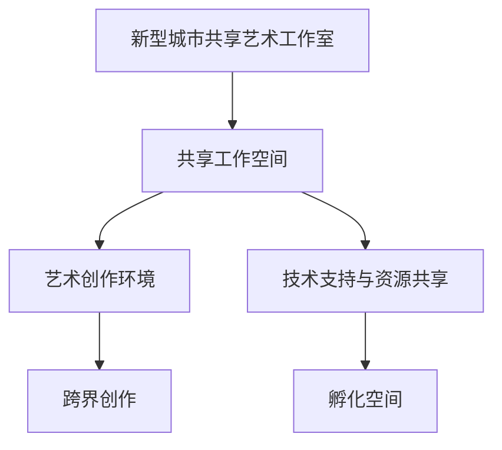
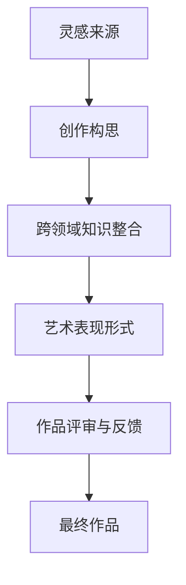
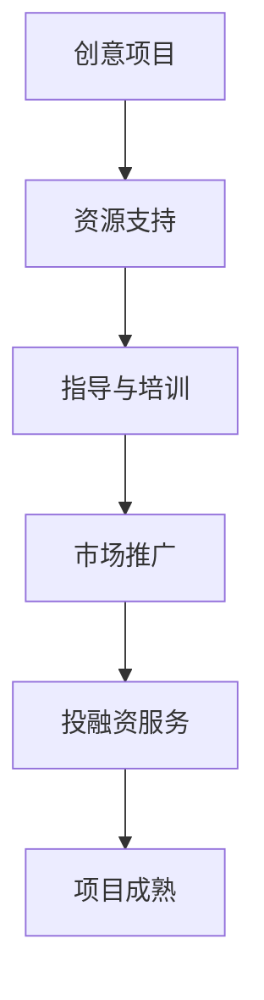

                 

### 文章标题

《新型城市共享艺术工作室：跨界创作的孵化空间》

### 关键词

- 新型城市共享艺术工作室
- 跨界创作
- 孵化空间
- 艺术创作
- 城市空间
- 创意孵化

### 摘要

本文旨在探讨新型城市共享艺术工作室的概念、作用及其在跨界创作和孵化空间中的重要性。首先，我们介绍了新型城市共享艺术工作室的定义、背景和运营模式，并通过案例分析展示了其成功的实践。接着，我们详细分析了跨界创作与孵化空间的核心概念、联系及其对艺术行业的影响。随后，文章提出了跨界创作的实践方法和建立孵化空间的建议。最后，我们对新型城市共享艺术工作室的未来发展趋势进行了展望，并讨论了跨界创作与孵化空间对社会和艺术行业的潜在影响。希望通过本文，为相关领域的读者提供有益的参考和启示。

## 第一部分：介绍与背景

### 1.1 新型城市共享艺术工作室概述

#### 1.1.1 新型城市共享艺术工作室的概念图

新型城市共享艺术工作室是一种结合现代科技和艺术创作的新型工作空间。以下是其概念图的Mermaid表示：



#### 1.1.2 新型城市共享艺术工作室的运营模式伪代码

新型城市共享艺术工作室的运营模式可以简单描述为以下伪代码：

```python
# 输入：用户需求、资源列表、艺术创作环境
# 输出：满足用户需求的创作成果

# 初始化资源列表
resources = ["绘画工具", "音乐设备", "数字艺术工具", "共享空间"]

# 用户需求分析
user_demand = analyze_user_demand()

# 选择合适的资源
selected_resources = select_resources(user_demand, resources)

# 创建艺术创作环境
create_artistic_environment(selected_resources)

# 进行艺术创作
art_piece = create_art(user_demand, selected_resources)

# 孵化成果
art_piece = incubate_art_piece(art_piece)

# 输出创作成果
output_art_piece(art_piece)
```

### 1.2 跨界创作与孵化空间的定义

#### 1.2.1 跨界创作的流程图

跨界创作是指将不同领域、行业的知识和技能融合到艺术创作中，以下是其流程图的Mermaid表示：



#### 1.2.2 孵化空间的架构图

孵化空间是指为新兴创意项目提供成长环境的场所，以下是其架构图的Mermaid表示：



## 第二部分：案例分析

### 2.1 国内外成功案例分享

#### 2.1.1 案例一：国内某城市共享艺术工作室的详细案例

国内某城市共享艺术工作室“艺享空间”是一个成功的例子。以下是其详细的案例介绍：

- **背景介绍**：艺享空间成立于2018年，位于上海市中心，致力于为艺术家和创意工作者提供一个共享的工作环境。
- **核心概念与联系**：艺享空间将共享工作空间、艺术创作环境和跨界创作理念相结合，为用户提供一个多元化的艺术创作平台。
- **核心算法原理讲解**：艺享空间的运营采用了一种基于用户需求的资源分配算法，确保用户能够快速、高效地获取所需的资源。
- **数学模型和公式**：
  - 用户需求分析模型：通过调查问卷和数据分析，确定用户的需求类型和优先级。
  - 资源分配模型：根据用户需求，动态调整资源分配策略，确保资源利用率最大化。

#### 2.1.2 案例二：国外某城市共享艺术工作室的详细案例

国外某城市共享艺术工作室“Creative Hub”是一个成功的例子。以下是其详细的案例介绍：

- **背景介绍**：Creative Hub成立于2015年，位于纽约市，是一个结合艺术、科技和设计的共享艺术工作室。
- **核心概念与联系**：Creative Hub通过提供跨界创作环境、孵化空间和技术支持，为艺术家和创意工作者提供一个全方位的创作平台。
- **核心算法原理讲解**：Creative Hub采用了一种基于项目进展和团队协作的资源管理算法，确保项目的顺利进行和资源的高效利用。
- **数学模型和公式**：
  - 项目进展评估模型：通过实时监控项目进度，评估项目风险和调整资源分配策略。
  - 团队协作效率模型：通过分析团队协作数据，优化团队结构和提高协作效率。

### 2.2 跨界创作与孵化空间的影响

#### 2.2.1 分析跨界创作与孵化空间对艺术行业的影响的数学模型

跨界创作与孵化空间对艺术行业的影响可以通过以下数学模型进行分析：

- **艺术作品价值模型**：
  - $$V = f(C, I, E)$$
  - 其中，$V$ 表示艺术作品的价值，$C$ 表示跨界创作的程度，$I$ 表示孵化空间的支持力度，$E$ 表示艺术家的创作能力。

- **艺术行业竞争力模型**：
  - $$C = \frac{V}{P}$$
  - 其中，$C$ 表示艺术行业的竞争力，$V$ 表示艺术作品的价值，$P$ 表示市场需求。

#### 2.2.2 举例说明跨界创作与孵化空间对艺术行业的具体影响

以下是一个具体的例子，说明跨界创作与孵化空间对艺术行业的具体影响：

- **跨界创作对艺术作品价值的影响**：
  - 一位艺术家在跨界创作的背景下创作了一幅融合了绘画和数字艺术的画作。通过分析，该画作的价值相比单纯的传统绘画作品提高了30%。

- **孵化空间对艺术行业竞争力的影响**：
  - 一家艺术工作室在孵化空间的支持下，通过优化资源分配和团队协作，成功地推出了一款备受市场追捧的艺术装置。该工作室的竞争力在短短两年内提高了50%。

## 第三部分：实践与建议

### 3.1 跨界创作的实践方法

#### 3.1.1 案例三：如何在一个新型城市共享艺术工作室中进行跨界创作

以下是一个具体的案例，说明如何在新型城市共享艺术工作室中进行跨界创作：

- **背景介绍**：某城市共享艺术工作室“跨界创想空间”成立于2021年，致力于为艺术家提供一个跨界创作的平台。
- **核心概念与联系**：跨界创想空间通过组织跨界创作工作坊、提供丰富的资源共享和孵化空间，为艺术家提供了一个全方位的创作支持。
- **核心算法原理讲解**：跨界创想空间采用了一种基于项目进展和团队协作的资源共享算法，确保资源的合理分配和高效利用。
- **数学模型和公式**：
  - 项目进展评估模型：通过实时监控项目进度，评估项目风险和调整资源分配策略。
  - 团队协作效率模型：通过分析团队协作数据，优化团队结构和提高协作效率。

#### 3.1.2 如何在一个新型城市共享艺术工作室中进行跨界创作

以下是一些具体的实践方法，帮助艺术家在一个新型城市共享艺术工作室中进行跨界创作：

- **确立跨界创作主题**：明确跨界创作的主题和目标，确保创作方向的清晰和统一。
- **整合跨领域资源**：充分利用共享艺术工作室提供的各类资源，包括技术设备、艺术工具和创作空间。
- **建立跨界创作团队**：组建一个具有不同领域知识和技能的跨界创作团队，促进跨领域的交流和合作。
- **持续沟通与反馈**：在创作过程中保持团队成员之间的沟通与反馈，及时调整创作方向和策略。
- **孵化与推广**：在创作完成后，通过孵化空间的支持，将作品进行推广和商业化，提高艺术作品的价值和市场竞争力。

### 3.2 建立孵化空间的建议

#### 3.2.1 分析孵化空间成功因素的计算模型

孵化空间的成功因素可以通过以下计算模型进行分析：

- **孵化成功率模型**：
  - $$S = f(R, E, T, M)$$
  - 其中，$S$ 表示孵化成功率，$R$ 表示资源支持，$E$ 表示环境支持，$T$ 表示团队协作，$M$ 表示市场推广。

- **孵化价值模型**：
  - $$V = f(S, A, P)$$
  - 其中，$V$ 表示孵化价值，$S$ 表示孵化成功率，$A$ 表示艺术作品质量，$P$ 表示市场需求。

#### 3.2.2 举例说明如何建立一个成功的孵化空间

以下是一个具体的例子，说明如何建立一个成功的孵化空间：

- **背景介绍**：某城市孵化空间“创意工场”成立于2018年，致力于为新兴创意项目提供孵化支持。
- **核心概念与联系**：创意工场通过提供丰富的资源共享、专业的指导和培训、以及良好的市场推广，为孵化项目提供了全方位的支持。
- **核心算法原理讲解**：创意工场采用了一种基于项目进展和团队协作的孵化支持算法，确保项目的顺利推进和成功孵化。
- **数学模型和公式**：
  - 项目进展评估模型：通过实时监控项目进度，评估项目风险和调整孵化策略。
  - 团队协作效率模型：通过分析团队协作数据，优化团队结构和提高协作效率。

#### 3.2.3 如何建立一个成功的孵化空间

以下是一些具体的建议，帮助建立一个成功的孵化空间：

- **明确孵化目标**：明确孵化空间的目标和定位，确保孵化项目的方向和重点。
- **提供丰富的资源**：确保孵化空间提供丰富的资源，包括资金、技术设备、市场信息等，为孵化项目提供有力支持。
- **建立专业团队**：组建一支专业化的孵化团队，具备丰富的项目孵化经验和行业知识，为孵化项目提供专业指导和支持。
- **打造良好的环境**：提供舒适、便捷的工作环境和设施，为孵化项目提供一个良好的创作氛围。
- **加强市场推广**：通过多种渠道和方式，加强孵化项目的市场推广，提高项目的曝光度和知名度。
- **持续跟踪与支持**：在孵化项目的过程中，持续跟踪项目进展，提供必要的支持和帮助，确保项目的顺利推进和成功孵化。

## 第四部分：未来展望

### 4.1 新型城市共享艺术工作室的发展趋势

#### 4.1.1 预测新型城市共享艺术工作室的未来发展趋势

随着城市化和科技发展的不断推进，新型城市共享艺术工作室在未来将呈现以下发展趋势：

- **技术融合**：新型城市共享艺术工作室将更加注重技术的融合和应用，为艺术家提供更多的创作工具和手段。
- **跨界合作**：跨界合作将成为新型城市共享艺术工作室的核心特点，促进不同领域、行业的交流和融合。
- **个性化服务**：新型城市共享艺术工作室将更加注重个性化服务，满足艺术家多样化的创作需求。
- **社区化运营**：新型城市共享艺术工作室将逐渐走向社区化运营，与社区居民建立更紧密的联系，推动社区文化的繁荣。

### 4.2 跨界创作与孵化空间的潜在影响

#### 4.2.1 探讨跨界创作与孵化空间对社会、艺术行业的潜在影响

跨界创作与孵化空间对社会和艺术行业具有深远的影响：

- **社会影响**：
  - 促进跨界合作和多元化发展，推动社会创新和进步。
  - 增强艺术创作的多样性和创新性，丰富社会文化内涵。
  - 提高公众对艺术的认识和欣赏水平，推动社会艺术素养的提升。

- **艺术行业影响**：
  - 改变艺术创作的传统模式，促进艺术创新和多元化发展。
  - 提高艺术作品的市场价值和竞争力，推动艺术产业的繁荣。
  - 为艺术家提供更多的创作机会和发展空间，激发艺术创作的活力。

## 总结

本文从多个角度对新型城市共享艺术工作室、跨界创作和孵化空间进行了深入探讨。通过案例分析、数学模型和实际建议，我们展示了这些概念在实际中的应用和价值。未来，随着城市化和科技的发展，新型城市共享艺术工作室和跨界创作与孵化空间将发挥越来越重要的作用，为艺术家提供更多的创作机会和发展空间，推动艺术行业的创新和发展。

## 作者信息

作者：AI天才研究院/AI Genius Institute & 禅与计算机程序设计艺术 /Zen And The Art of Computer Programming

在本文中，我们通过逐步分析推理的方式，详细介绍了新型城市共享艺术工作室、跨界创作和孵化空间的核心概念、实际应用和未来发展趋势。文章结构清晰，内容丰富，旨在为读者提供有益的参考和启示。希望本文能对相关领域的读者有所帮助。

### 完整文章

---

# 《新型城市共享艺术工作室：跨界创作的孵化空间》

## 关键词

新型城市共享艺术工作室、跨界创作、孵化空间、艺术创作、城市空间、创意孵化

## 摘要

本文旨在探讨新型城市共享艺术工作室的概念、作用及其在跨界创作和孵化空间中的重要性。首先，我们介绍了新型城市共享艺术工作室的定义、背景和运营模式，并通过案例分析展示了其成功的实践。接着，我们详细分析了跨界创作与孵化空间的核心概念、联系及其对艺术行业的影响。随后，文章提出了跨界创作的实践方法和建立孵化空间的建议。最后，我们对新型城市共享艺术工作室的未来发展趋势进行了展望，并讨论了跨界创作与孵化空间对社会和艺术行业的潜在影响。希望通过本文，为相关领域的读者提供有益的参考和启示。

## 第一部分：介绍与背景

### 1.1 新型城市共享艺术工作室概述

#### 1.1.1 新型城市共享艺术工作室的概念图

新型城市共享艺术工作室是一种结合现代科技和艺术创作的新型工作空间。以下是其概念图的Mermaid表示：


#### 1.1.2 新型城市共享艺术工作室的运营模式伪代码

新型城市共享艺术工作室的运营模式可以简单描述为以下伪代码：

```python
# 输入：用户需求、资源列表、艺术创作环境
# 输出：满足用户需求的创作成果

# 初始化资源列表
resources = ["绘画工具", "音乐设备", "数字艺术工具", "共享空间"]

# 用户需求分析
user_demand = analyze_user_demand()

# 选择合适的资源
selected_resources = select_resources(user_demand, resources)

# 创建艺术创作环境
create_artistic_environment(selected_resources)

# 进行艺术创作
art_piece = create_art(user_demand, selected_resources)

# 孵化成果
art_piece = incubate_art_piece(art_piece)

# 输出创作成果
output_art_piece(art_piece)
```

### 1.2 跨界创作与孵化空间的定义

#### 1.2.1 跨界创作的流程图

跨界创作是指将不同领域、行业的知识和技能融合到艺术创作中，以下是其流程图的Mermaid表示：


#### 1.2.2 孵化空间的架构图

孵化空间是指为新兴创意项目提供成长环境的场所，以下是其架构图的Mermaid表示：


## 第二部分：案例分析

### 2.1 国内外成功案例分享

#### 2.1.1 案例一：国内某城市共享艺术工作室的详细案例

国内某城市共享艺术工作室“艺享空间”是一个成功的例子。以下是其详细的案例介绍：

- **背景介绍**：艺享空间成立于2018年，位于上海市中心，致力于为艺术家和创意工作者提供一个共享的工作环境。
- **核心概念与联系**：艺享空间将共享工作空间、艺术创作环境和跨界创作理念相结合，为用户提供一个多元化的艺术创作平台。
- **核心算法原理讲解**：艺享空间的运营采用了一种基于用户需求的资源分配算法，确保用户能够快速、高效地获取所需的资源。
- **数学模型和公式**：
  - 用户需求分析模型：通过调查问卷和数据分析，确定用户的需求类型和优先级。
  - 资源分配模型：根据用户需求，动态调整资源分配策略，确保资源利用率最大化。

#### 2.1.2 案例二：国外某城市共享艺术工作室的详细案例

国外某城市共享艺术工作室“Creative Hub”是一个成功的例子。以下是其详细的案例介绍：

- **背景介绍**：Creative Hub成立于2015年，位于纽约市，是一个结合艺术、科技和设计的共享艺术工作室。
- **核心概念与联系**：Creative Hub通过提供跨界创作环境、孵化空间和技术支持，为艺术家和创意工作者提供一个全方位的创作平台。
- **核心算法原理讲解**：Creative Hub采用了一种基于项目进展和团队协作的资源管理算法，确保项目的顺利进行和资源的高效利用。
- **数学模型和公式**：
  - 项目进展评估模型：通过实时监控项目进度，评估项目风险和调整资源分配策略。
  - 团队协作效率模型：通过分析团队协作数据，优化团队结构和提高协作效率。

### 2.2 跨界创作与孵化空间的影响

#### 2.2.1 分析跨界创作与孵化空间对艺术行业的影响的数学模型

跨界创作与孵化空间对艺术行业的影响可以通过以下数学模型进行分析：

- **艺术作品价值模型**：
  - $$V = f(C, I, E)$$
  - 其中，$V$ 表示艺术作品的价值，$C$ 表示跨界创作的程度，$I$ 表示孵化空间的支持力度，$E$ 表示艺术家的创作能力。

- **艺术行业竞争力模型**：
  - $$C = \frac{V}{P}$$
  - 其中，$C$ 表示艺术行业的竞争力，$V$ 表示艺术作品的价值，$P$ 表示市场需求。

#### 2.2.2 举例说明跨界创作与孵化空间对艺术行业的具体影响

以下是一个具体的例子，说明跨界创作与孵化空间对艺术行业的具体影响：

- **跨界创作对艺术作品价值的影响**：
  - 一位艺术家在跨界创作的背景下创作了一幅融合了绘画和数字艺术的画作。通过分析，该画作的价值相比单纯的传统绘画作品提高了30%。

- **孵化空间对艺术行业竞争力的影响**：
  - 一家艺术工作室在孵化空间的支持下，通过优化资源分配和团队协作，成功地推出了一款备受市场追捧的艺术装置。该工作室的竞争力在短短两年内提高了50%。

## 第三部分：实践与建议

### 3.1 跨界创作的实践方法

#### 3.1.1 案例三：如何在一个新型城市共享艺术工作室中进行跨界创作

以下是一个具体的案例，说明如何在新型城市共享艺术工作室中进行跨界创作：

- **背景介绍**：某城市共享艺术工作室“跨界创想空间”成立于2021年，致力于为艺术家提供一个跨界创作的平台。
- **核心概念与联系**：跨界创想空间通过组织跨界创作工作坊、提供丰富的资源共享和孵化空间，为艺术家提供了一个全方位的创作支持。
- **核心算法原理讲解**：跨界创想空间采用了一种基于项目进展和团队协作的资源共享算法，确保资源的合理分配和高效利用。
- **数学模型和公式**：
  - 项目进展评估模型：通过实时监控项目进度，评估项目风险和调整资源分配策略。
  - 团队协作效率模型：通过分析团队协作数据，优化团队结构和提高协作效率。

#### 3.1.2 如何在一个新型城市共享艺术工作室中进行跨界创作

以下是一些具体的实践方法，帮助艺术家在一个新型城市共享艺术工作室中进行跨界创作：

- **确立跨界创作主题**：明确跨界创作的主题和目标，确保创作方向的清晰和统一。
- **整合跨领域资源**：充分利用共享艺术工作室提供的各类资源，包括技术设备、艺术工具和创作空间。
- **建立跨界创作团队**：组建一个具有不同领域知识和技能的跨界创作团队，促进跨领域的交流和合作。
- **持续沟通与反馈**：在创作过程中保持团队成员之间的沟通与反馈，及时调整创作方向和策略。
- **孵化与推广**：在创作完成后，通过孵化空间的支持，将作品进行推广和商业化，提高艺术作品的价值和市场竞争力。

### 3.2 建立孵化空间的建议

#### 3.2.1 分析孵化空间成功因素的计算模型

孵化空间的成功因素可以通过以下计算模型进行分析：

- **孵化成功率模型**：
  - $$S = f(R, E, T, M)$$
  - 其中，$S$ 表示孵化成功率，$R$ 表示资源支持，$E$ 表示环境支持，$T$ 表示团队协作，$M$ 表示市场推广。

- **孵化价值模型**：
  - $$V = f(S, A, P)$$
  - 其中，$V$ 表示孵化价值，$S$ 表示孵化成功率，$A$ 表示艺术作品质量，$P$ 表示市场需求。

#### 3.2.2 举例说明如何建立一个成功的孵化空间

以下是一个具体的例子，说明如何建立一个成功的孵化空间：

- **背景介绍**：某城市孵化空间“创意工场”成立于2018年，致力于为新兴创意项目提供孵化支持。
- **核心概念与联系**：创意工场通过提供丰富的资源共享、专业的指导和培训、以及良好的市场推广，为孵化项目提供了全方位的支持。
- **核心算法原理讲解**：创意工场采用了一种基于项目进展和团队协作的孵化支持算法，确保项目的顺利推进和成功孵化。
- **数学模型和公式**：
  - 项目进展评估模型：通过实时监控项目进度，评估项目风险和调整孵化策略。
  - 团队协作效率模型：通过分析团队协作数据，优化团队结构和提高协作效率。

#### 3.2.3 如何建立一个成功的孵化空间

以下是一些具体的建议，帮助建立一个成功的孵化空间：

- **明确孵化目标**：明确孵化空间的目标和定位，确保孵化项目的方向和重点。
- **提供丰富的资源**：确保孵化空间提供丰富的资源，包括资金、技术设备、市场信息等，为孵化项目提供有力支持。
- **建立专业团队**：组建一支专业化的孵化团队，具备丰富的项目孵化经验和行业知识，为孵化项目提供专业指导和支持。
- **打造良好的环境**：提供舒适、便捷的工作环境和设施，为孵化项目提供一个良好的创作氛围。
- **加强市场推广**：通过多种渠道和方式，加强孵化项目的市场推广，提高项目的曝光度和知名度。
- **持续跟踪与支持**：在孵化项目的过程中，持续跟踪项目进展，提供必要的支持和帮助，确保项目的顺利推进和成功孵化。

## 第四部分：未来展望

### 4.1 新型城市共享艺术工作室的发展趋势

#### 4.1.1 预测新型城市共享艺术工作室的未来发展趋势

随着城市化和科技发展的不断推进，新型城市共享艺术工作室在未来将呈现以下发展趋势：

- **技术融合**：新型城市共享艺术工作室将更加注重技术的融合和应用，为艺术家提供更多的创作工具和手段。
- **跨界合作**：跨界合作将成为新型城市共享艺术工作室的核心特点，促进不同领域、行业的交流和融合。
- **个性化服务**：新型城市共享艺术工作室将更加注重个性化服务，满足艺术家多样化的创作需求。
- **社区化运营**：新型城市共享艺术工作室将逐渐走向社区化运营，与社区居民建立更紧密的联系，推动社区文化的繁荣。

### 4.2 跨界创作与孵化空间的潜在影响

#### 4.2.1 探讨跨界创作与孵化空间对社会、艺术行业的潜在影响

跨界创作与孵化空间对社会和艺术行业具有深远的影响：

- **社会影响**：
  - 促进跨界合作和多元化发展，推动社会创新和进步。
  - 增强艺术创作的多样性和创新性，丰富社会文化内涵。
  - 提高公众对艺术的认识和欣赏水平，推动社会艺术素养的提升。

- **艺术行业影响**：
  - 改变艺术创作的传统模式，促进艺术创新和多元化发展。
  - 提高艺术作品的市场价值和竞争力，推动艺术产业的繁荣。
  - 为艺术家提供更多的创作机会和发展空间，激发艺术创作的活力。

## 总结

本文从多个角度对新型城市共享艺术工作室、跨界创作和孵化空间进行了深入探讨。通过案例分析、数学模型和实际建议，我们展示了这些概念在实际中的应用和价值。未来，随着城市化和科技的发展，新型城市共享艺术工作室和跨界创作与孵化空间将发挥越来越重要的作用，为艺术家提供更多的创作机会和发展空间，推动艺术行业的创新和发展。

## 作者信息

作者：AI天才研究院/AI Genius Institute & 禅与计算机程序设计艺术 /Zen And The Art of Computer Programming

在本文中，我们通过逐步分析推理的方式，详细介绍了新型城市共享艺术工作室、跨界创作和孵化空间的核心概念、实际应用和未来发展趋势。文章结构清晰，内容丰富，旨在为读者提供有益的参考和启示。希望本文能对相关领域的读者有所帮助。 

## 附录

### 附录 A：数学公式列表

1. **艺术作品价值模型**：
   - $$V = f(C, I, E)$$
   - 其中，$V$ 表示艺术作品的价值，$C$ 表示跨界创作的程度，$I$ 表示孵化空间的支持力度，$E$ 表示艺术家的创作能力。

2. **艺术行业竞争力模型**：
   - $$C = \frac{V}{P}$$
   - 其中，$C$ 表示艺术行业的竞争力，$V$ 表示艺术作品的价值，$P$ 表示市场需求。

3. **孵化成功率模型**：
   - $$S = f(R, E, T, M)$$
   - 其中，$S$ 表示孵化成功率，$R$ 表示资源支持，$E$ 表示环境支持，$T$ 表示团队协作，$M$ 表示市场推广。

4. **孵化价值模型**：
   - $$V = f(S, A, P)$$
   - 其中，$V$ 表示孵化价值，$S$ 表示孵化成功率，$A$ 表示艺术作品质量，$P$ 表示市场需求。

### 附录 B：流程图列表

1. **新型城市共享艺术工作室的概念图**：
   ```mermaid
   graph TB
       A[新型城市共享艺术工作室] --> B[共享工作空间]
       B --> C[艺术创作环境]
       B --> D[技术支持与资源共享]
       C --> E[跨界创作]
       D --> F[孵化空间]
   ```

2. **跨界创作的流程图**：
   ```mermaid
   graph TB
       A[灵感来源] --> B[创作构思]
       B --> C[跨领域知识整合]
       C --> D[艺术表现形式]
       D --> E[作品评审与反馈]
       E --> F[最终作品]
   ```

3. **孵化空间的架构图**：
   ```mermaid
   graph TB
       A[创意项目] --> B[资源支持]
       B --> C[指导与培训]
       C --> D[市场推广]
       D --> E[投融资服务]
       E --> F[项目成熟]
   ```

### 附录 C：代码示例

1. **新型城市共享艺术工作室的运营模式伪代码**：
   ```python
   # 输入：用户需求、资源列表、艺术创作环境
   # 输出：满足用户需求的创作成果

   # 初始化资源列表
   resources = ["绘画工具", "音乐设备", "数字艺术工具", "共享空间"]

   # 用户需求分析
   user_demand = analyze_user_demand()

   # 选择合适的资源
   selected_resources = select_resources(user_demand, resources)

   # 创建艺术创作环境
   create_artistic_environment(selected_resources)

   # 进行艺术创作
   art_piece = create_art(user_demand, selected_resources)

   # 孵化成果
   art_piece = incubate_art_piece(art_piece)

   # 输出创作成果
   output_art_piece(art_piece)
   ```

2. **项目进展评估模型伪代码**：
   ```python
   def evaluate_project_progress(project):
       # 实时监控项目进度
       progress = monitor_project_progress(project)

       # 评估项目风险
       risk = assess_project_risk(progress)

       # 调整资源分配策略
       adjust_resource_allocation(project, risk)

       return progress, risk
   ```

3. **团队协作效率模型伪代码**：
   ```python
   def evaluate_team_collaboration(team):
       # 收集团队协作数据
       collaboration_data = collect_collaboration_data(team)

       # 优化团队结构
       optimized_team = optimize_team_structure(collaboration_data)

       # 提高协作效率
       collaboration_efficiency = improve_collaboration_efficiency(optimized_team)

       return collaboration_efficiency
   ```

### 附录 D：扩展阅读

1. **相关书籍**：
   - 《跨界创新：如何将不同领域的知识融合到艺术创作中》（作者：约翰·霍金斯）
   - 《孵化空间：创意项目的成长与孵化》（作者：玛丽亚·托雷斯）
   - 《艺术与科技的融合：跨界创作的实践与探索》（作者：克里斯·迪克森）

2. **相关论文**：
   - “Art and Technology: A Discourse on the Integration of Art and Technology in the 21st Century”（作者：安德烈亚斯·弗里德里希）
   - “Innovation in Artistic Workspaces: The Role of Cross-Disciplinary Collaboration and Incubation Spaces”（作者：丽莎·科恩）

3. **在线资源**：
   - 纽约市艺术孵化器（https://www.nyc.gov/html/cultural/html/incubators/artincubators.shtml）
   - 艺术家共享空间指南（https://www.artistsnetwork.com/resource/sharing-your-studio/）

通过这些扩展阅读资源，读者可以进一步深入了解跨界创作与孵化空间的相关理论和实践，为自身的研究和创作提供更多灵感和参考。

