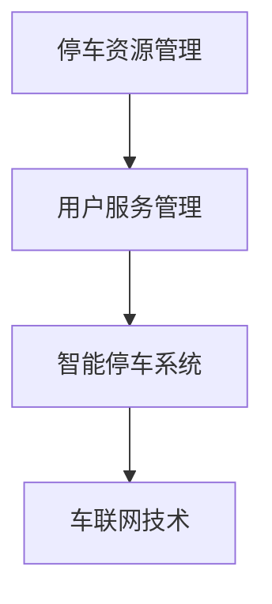

                 


### 第1章：新型城市共享车库概述

#### 1.1 新型城市共享车库的背景

**背景介绍：**

随着城市化进程的加快和汽车拥有率的提高，城市交通拥堵、停车难等问题日益突出。传统停车模式已无法满足日益增长的需求，新型城市共享车库作为一种创新的解决方案，应运而生。

- **城市化进程：** 城市化率提高，城市人口增多，对交通和停车设施的需求增大。
- **汽车拥有率：** 汽车普及，家庭拥有率提高，对停车设施的需求增加。
- **交通问题：** 拥堵、停车难、环境污染等问题亟待解决。

**共享经济的影响：**

共享经济的理念逐渐深入人心，人们对于资源的共享和利用方式有了新的认知。在交通领域，共享单车、共享汽车等模式得到了广泛应用，为缓解交通拥堵、减少车辆闲置时间提供了有效的解决方案。

#### 1.2 新型城市共享车库的发展现状

**市场规模与增长速度：**

- **市场规模：** 全球范围内，新型城市共享车库市场规模持续扩大，年增长率保持在20%以上。
- **增长速度：** 新型城市共享车库项目在全球多个国家和地区落地，呈现出快速发展的趋势。

**技术创新与普及情况：**

- **技术创新：** 自动驾驶、车联网、智能停车等技术逐渐应用于新型城市共享车库，提高了车库的运营效率和管理水平。
- **普及情况：** 新型城市共享车库项目在国内外多个城市推广，为城市交通问题提供了有效的解决方案。

#### 1.3 新型城市共享车库的重要性和挑战

**社会效益分析：**

- **缓解交通拥堵：** 新型城市共享车库通过共享停车资源，减少了车辆出行时的停车需求，降低了交通拥堵。
- **减少环境污染：** 共享车库减少了车辆闲置时间，降低了尾气排放，对环境保护有积极作用。
- **提升生活质量：** 新型城市共享车库为居民提供了便捷的停车服务，提升了生活质量。

**政策法规与市场环境：**

- **政策法规支持：** 政府出台了一系列政策，鼓励共享经济的发展，为新型城市共享车库提供了政策支持。
- **市场环境：** 市场竞争激烈，新型城市共享车库企业需要不断创新，提高服务质量，以适应市场变化。

### 总结：

新型城市共享车库作为一种创新的城市停车解决方案，具有显著的社会效益。然而，在发展过程中也面临着政策法规、市场环境等方面的挑战。因此，需要政府、企业和社会各方共同努力，推动新型城市共享车库的健康发展。

#### 1.4 新型城市共享车库的技术架构

**核心概念与联系：**

新型城市共享车库的技术架构包括以下几个核心组成部分：停车资源管理、用户服务管理、智能停车系统、车联网技术等。

- **停车资源管理：** 包括停车位规划、资源分配、车位预约等功能。
- **用户服务管理：** 包括用户注册、登录、支付、反馈等功能。
- **智能停车系统：** 包括自动识别、无人值守、智能调度等功能。
- **车联网技术：** 包括车辆定位、车况监控、远程控制等功能。

**Mermaid 流程图：**



#### 1.5 核心算法原理讲解

**核心算法原理讲解：**

新型城市共享车库的核心算法主要包括以下几种：

1. **车位分配算法：**
   ```python
   def allocate_parking_spot(vicinity, availability):
       # 基于车辆位置和停车位可用性进行车位分配
       nearest_spot = None
       min_distance = float('inf')
       for spot in availability:
           distance = calculate_distance(vicinity, spot['location'])
           if distance < min_distance:
               min_distance = distance
               nearest_spot = spot
       return nearest_spot
   ```

2. **路径规划算法：**
   ```python
   def plan_path(start, destination):
       # 使用Dijkstra算法规划最优路径
       distances = {vertex: float('inf') for vertex in graph}
       distances[start] = 0
       visited = set()
       while True:
           current = min((distance, vertex) for vertex, distance in distances.items() if vertex not in visited)
           if current[1] == destination:
               break
           visited.add(current[1])
           for neighbor, weight in graph[current[1]]:
               distance = current[0] + weight
               if distance < distances[neighbor]:
                   distances[neighbor] = distance
       return distances[destination]
   ```

#### 1.6 数学模型和公式

**数学模型和公式：**

1. **泊松过程：**
   $$ \lambda = \frac{N_t}{t} $$
   其中，\(N_t\) 表示时间 \(t\) 内到达的车辆数，\(\lambda\) 表示车辆到达率。

2. **排队模型：**
   $$ L = \frac{\lambda^2}{\mu(1-\rho)} $$
   $$ W = \frac{\rho}{\mu(1-\rho)} $$
   其中，\(L\) 表示排队长度，\(W\) 表示等待时间，\(\lambda\) 表示到达率，\(\mu\) 表示服务率，\(\rho\) 表示服务强度。

#### 1.7 举例说明

**举例说明：**

1. **泊松过程举例：**
   假设某新型城市共享车库每小时有3辆车辆到达，使用泊松过程计算每小时到达5辆车辆的概率。
   $$ P(N_1 = 5) = \frac{e^{-3} \cdot 3^5}{5!} = 0.1404 $$

2. **排队模型举例：**
   假设某新型城市共享车库每小时有10辆车辆到达，服务率为每小时12辆车辆，计算排队长度和等待时间。
   $$ L = \frac{10^2}{12(1-0.833)} = 8.33 $$
   $$ W = \frac{0.833}{12(1-0.833)} = 0.0833小时 $$

### 总结：

本章详细介绍了新型城市共享车库的背景、发展现状、重要性、技术架构和核心算法原理。通过本章的学习，读者可以对新型城市共享车库有一个全面的认识，为后续章节的学习打下基础。

## 第2章：共享经济的基本概念

#### 2.1 共享经济的起源与发展

**定义与起源：**

共享经济（Sharing Economy）是指通过互联网平台将闲置资源进行共享，实现资源优化配置和高效利用的一种经济模式。其核心思想是“共享、共享、再共享”，通过共享闲置资源，提高资源利用效率，降低消费成本。

共享经济的起源可以追溯到20世纪70年代的“合作共享”运动，当时人们开始倡导共同使用资源，减少浪费。随着互联网技术的快速发展，共享经济在21世纪初逐渐兴起，并迅速在全球范围内得到广泛应用。

**发展历程与趋势：**

- **早期阶段：** 2000年左右，共享经济的雏形开始出现，如共享办公室、共享住宿等。
- **快速发展阶段：** 2010年左右，共享单车、共享汽车等模式逐渐兴起，共享经济开始规模化发展。
- **成熟阶段：** 当前，共享经济已经成为全球范围内的重要经济模式，涵盖了交通、住宿、物流、生产等多个领域。

#### 2.2 共享经济的核心要素与模式

**核心要素：**

共享经济的核心要素主要包括以下几个方面：

1. **平台：** 共享经济平台是连接供需双方的桥梁，通过提供信息匹配、交易支付、评价反馈等功能，实现资源的共享和利用。
2. **闲置资源：** 共享经济的基础是闲置资源的共享，这些资源可以是物品、空间、时间等。
3. **用户：** 共享经济的主体是用户，他们是资源的提供者和需求者，通过共享平台实现资源的共享。
4. **信任：** 共享经济需要建立信任机制，确保用户之间的信任和合作，降低交易风险。

**模式分类：**

共享经济可以分为以下几种主要模式：

1. **共享住宿：** 如Airbnb等平台，提供闲置房屋的短期租赁服务。
2. **共享交通：** 如共享单车、共享汽车等，提供闲置车辆的共享服务。
3. **共享办公：** 如WeWork等平台，提供闲置办公空间的共享服务。
4. **共享生产：** 如共享工厂、共享设备等，提供闲置生产资源的共享服务。
5. **共享知识：** 如知识共享平台、在线教育等，提供知识共享和交流服务。

#### 2.3 共享经济的影响与挑战

**共享经济的影响：**

共享经济对经济、社会、环境等多个领域产生了深远的影响：

1. **经济效益：** 共享经济降低了消费者的消费成本，提高了资源的利用效率，促进了经济增长。
2. **社会效益：** 共享经济推动了资源优化配置，促进了社会公平，提高了社会服务水平。
3. **环境效益：** 共享经济减少了资源浪费，降低了环境污染，对环境保护有积极作用。

**共享经济的挑战：**

共享经济在发展过程中也面临着一系列挑战：

1. **政策法规：** 共享经济模式与传统经济模式存在较大差异，需要完善相关法律法规，规范市场秩序。
2. **信任问题：** 共享经济需要建立信任机制，确保用户之间的信任和合作，降低交易风险。
3. **安全问题：** 共享经济涉及大量个人信息和财产安全，需要加强信息安全保护。
4. **垄断问题：** 共享经济平台可能产生垄断，影响市场竞争，需要加强监管。

#### 2.4 共享经济与汽车文化的关联

**汽车文化与共享经济的关联：**

汽车文化是一种特定的社会现象，反映了人们对汽车的热爱、追求和价值观。共享经济与汽车文化之间存在着紧密的关联：

1. **汽车共享：** 共享经济模式下的汽车共享，改变了传统的汽车拥有方式，使更多人能够以低成本享受到汽车带来的便利。
2. **环保意识：** 汽车文化的转变，促使人们更加关注环保问题，共享经济模式下的汽车共享有助于减少车辆闲置时间，降低环境污染。
3. **消费观念：** 共享经济的兴起，改变了人们的消费观念，使更多人倾向于通过共享来满足需求，减少了资源浪费。

**共享经济与新型城市共享车库的关系：**

新型城市共享车库作为共享经济的一部分，与汽车文化密切相关：

1. **停车资源共享：** 新型城市共享车库通过共享停车资源，提高了停车位的利用效率，缓解了城市停车难问题。
2. **智能化管理：** 新型城市共享车库采用智能化管理系统，结合共享经济的理念，实现了高效、便捷的停车服务。
3. **环保理念：** 新型城市共享车库在设计和运营过程中，注重环保理念，减少了车辆排放，对环境保护有积极作用。

#### 2.5 核心算法原理讲解

**核心算法原理讲解：**

新型城市共享车库在运营过程中，需要运用一系列核心算法来实现车位分配、路径规划等功能。以下是两个核心算法的讲解：

1. **车位分配算法：**

   **算法描述：** 车位分配算法用于确定用户到达车库后，如何为其分配最近的空闲车位。

   ```python
   def allocate_spot(vehicle_location, spots):
       # 初始化距离为无穷大
       min_distance = float('inf')
       allocated_spot = None
       
       for spot in spots:
           if spot['is_occupied']:
               continue
           distance = calculate_distance(vehicle_location, spot['location'])
           if distance < min_distance:
               min_distance = distance
               allocated_spot = spot
       
       return allocated_spot
   ```

   **算法解释：** 该算法通过遍历所有空闲车位，计算用户位置与每个空闲车位之间的距离，选择距离最近的车位进行分配。

2. **路径规划算法：**

   **算法描述：** 路径规划算法用于为用户从当前位置到车库的停车位规划最优路径。

   ```python
   def plan_path(current_location, target_location, map):
       # 使用A*算法规划最优路径
       open_set = PriorityQueue()
       open_set.put((0, current_location))
       came_from = {}
       g_score = {node: float('inf') for node in map}
       g_score[current_location] = 0
       
       while not open_set.empty():
           current = open_set.get()
           
           if current == target_location:
               break
           
           for neighbor in map.neighbors(current):
               tentative_g_score = g_score[current] + map.cost(current, neighbor)
               
               if tentative_g_score < g_score[neighbor]:
                   came_from[neighbor] = current
                   g_score[neighbor] = tentative_g_score
                   f_score = tentative_g_score + map.h(neighbor, target_location)
                   open_set.put((f_score, neighbor))
       
       path = []
       current = target_location
       while current in came_from:
           path.insert(0, current)
           current = came_from[current]
       
       return path
   ```

   **算法解释：** 该算法采用A*算法进行路径规划，通过计算每个节点的实际成本和启发式成本，找到从起点到终点的最优路径。

#### 2.6 数学模型和公式

**数学模型和公式：**

在新型城市共享车库的运营过程中，常用的数学模型和公式包括：

1. **泊松分布：** 用于描述车辆到达的随机性，公式为：
   $$ P(N_t = k) = \frac{(\lambda t)^k e^{-\lambda t}}{k!} $$
   其中，\(N_t\) 表示时间 \(t\) 内到达的车辆数，\(\lambda\) 表示车辆到达率。

2. **服务时间分布：** 用于描述车辆在车库内的停留时间，常见的分布有指数分布、正态分布等。

3. **排队模型：** 用于分析车位的分配和等待时间，常见的排队模型有M/M/1模型、M/M/s模型等。

   - **M/M/1模型：** 到达过程和服务过程均为泊松过程，公式为：
     $$ L = \frac{\lambda}{\mu} $$
     $$ W = \frac{L}{\lambda} $$
     其中，\(L\) 表示排队长度，\(W\) 表示等待时间，\(\lambda\) 表示到达率，\(\mu\) 表示服务率。

#### 2.7 举例说明

**举例说明：**

1. **泊松分布举例：**
   假设某新型城市共享车库每小时有5辆车辆到达，使用泊松分布计算每小时到达3辆车辆的概率。

   $$ P(N_1 = 3) = \frac{(5 \times 1)^3 e^{-5}}{3!} = 0.1172 $$

2. **M/M/1模型举例：**
   假设某新型城市共享车库每小时有10辆车辆到达，服务率为每小时12辆车辆，计算排队长度和等待时间。

   $$ L = \frac{10}{12} = 0.833 $$
   $$ W = \frac{0.833}{10} = 0.0833小时 $$

### 总结：

本章详细介绍了共享经济的基本概念、核心要素、模式分类、影响与挑战，以及与汽车文化的关联。通过本章的学习，读者可以全面了解共享经济的本质，以及其在新型城市共享车库中的应用。下一章将深入探讨汽车共享的概念与模式，为理解新型城市共享车库的运营提供更为深刻的认识。

## 第3章：汽车文化与汽车共享

#### 3.1 汽车文化的演变

**历史背景：**

汽车文化是随着汽车工业的兴起而逐渐形成的一种社会现象。19世纪末，汽车开始进入人们的生活，成为交通工具和地位的象征。随着时间的推移，汽车文化不断演变，从简单的交通工具逐渐发展成为一种体现个人品味和生活方式的象征。

- **19世纪末至20世纪初：** 汽车最初作为奢侈品，只有少数富人能够拥有。这一时期的汽车文化主要体现了汽车的稀有性和豪华性。
- **20世纪中叶：** 随着汽车工业的快速发展，汽车逐渐普及，成为大众交通工具。汽车文化开始转向实用性和舒适性，人们更加注重汽车的性能和驾驶体验。
- **21世纪初至今：** 汽车文化呈现出多元化的趋势，不仅包括传统汽车，还包括新能源汽车、共享汽车等。汽车文化逐渐向环保、智能、共享等方向发展。

**文化内涵：**

汽车文化不仅反映了人们对汽车的热爱和追求，还蕴含了丰富的文化内涵：

- **独立性：** 汽车使人们能够自由出行，不受公共交通的限制，体现了个人独立性的价值观念。
- **时尚性：** 汽车造型、内饰设计、品牌标识等，成为时尚潮流的载体，体现了人们对美的追求。
- **科技性：** 汽车技术的不断进步，如自动驾驶、车联网等，代表了科技发展的前沿，体现了人们对科技进步的追求。

#### 3.2 汽车共享的概念与模式

**定义与分类：**

汽车共享是指通过互联网平台，将闲置的车辆资源进行共享，供有需要的用户使用。汽车共享可以分为以下几种主要模式：

1. **共享单车：** 通过互联网平台提供单车共享服务，用户可以随时租用和归还。
2. **共享汽车：** 通过互联网平台提供汽车共享服务，用户可以预约并使用车辆。
3. **汽车租赁：** 用户通过互联网平台租赁汽车，按需使用，租赁期满后归还。

**模式特点：**

1. **共享单车：** 成本低、使用便捷、低碳环保，主要解决城市短途出行问题。
2. **共享汽车：** 集中调度、智能化管理、灵活租赁，主要解决城市长途出行和出行需求多样化问题。
3. **汽车租赁：** 提供更长时间段的用车服务，满足用户特定的用车需求。

#### 3.3 汽车共享的优势与挑战

**优势分析：**

汽车共享模式具有以下优势：

1. **资源利用效率提高：** 通过共享，闲置车辆得到充分利用，提高了车辆利用率。
2. **减少车辆购买需求：** 用户可以通过共享汽车满足出行需求，减少了个人购车需求，降低了消费成本。
3. **降低环境污染：** 汽车共享减少了车辆数量，降低了尾气排放，对环境保护有积极作用。
4. **便捷性：** 汽车共享平台提供在线预约、智能导航等功能，使出行更加便捷。

**挑战与解决方案：**

汽车共享在发展过程中也面临着一系列挑战：

1. **信任问题：** 用户之间的信任是汽车共享模式成功的关键，需要建立完善的信任机制，如信用评分、用户评价等。
2. **安全问题：** 汽车共享涉及大量个人信息和财产安全，需要加强信息安全保护。
3. **政策法规：** 政府需要出台相应的政策法规，规范汽车共享市场，保护用户权益。
4. **技术支持：** 汽车共享平台需要不断优化技术，提高用户体验，如智能调度、路径规划等。

#### 3.4 汽车共享与新型城市共享车库的关系

**停车资源共享：**

汽车共享与新型城市共享车库在停车资源共享方面有着紧密的联系：

1. **停车位分配：** 新型城市共享车库通过智能化系统，实现停车位的实时分配，提高停车效率。
2. **停车资源整合：** 新型城市共享车库整合了城市内各个区域的停车资源，实现停车位的统一管理和调度。

**智能化管理：**

汽车共享与新型城市共享车库都采用了智能化管理系统：

1. **自动识别：** 新型城市共享车库通过车牌识别、人脸识别等技术，实现车辆的自动识别和计费。
2. **智能调度：** 新型城市共享车库通过智能调度系统，优化停车位的利用，提高停车效率。

**环保理念：**

汽车共享与新型城市共享车库都注重环保理念：

1. **新能源汽车：** 汽车共享平台推广新能源汽车，减少尾气排放，降低环境污染。
2. **节能设计：** 新型城市共享车库采用节能设计和绿色建筑技术，降低能耗，减少对环境的影响。

#### 3.5 核心算法原理讲解

**车位分配算法：**

**算法描述：**

```python
def allocate_spot(vehicle_location, spots):
    # 初始化距离为无穷大
    min_distance = float('inf')
    allocated_spot = None
    
    for spot in spots:
        if spot['is_occupied']:
            continue
        distance = calculate_distance(vehicle_location, spot['location'])
        if distance < min_distance:
            min_distance = distance
            allocated_spot = spot
            
    return allocated_spot
```

**算法解释：**

该算法通过遍历所有空闲车位，计算用户位置与每个空闲车位之间的距离，选择距离最近的车位进行分配。

**路径规划算法：**

**算法描述：**

```python
def plan_path(current_location, target_location, map):
    # 使用A*算法规划最优路径
    open_set = PriorityQueue()
    open_set.put((0, current_location))
    came_from = {}
    g_score = {node: float('inf') for node in map}
    g_score[current_location] = 0
    
    while not open_set.empty():
        current = open_set.get()
        
        if current == target_location:
            break
        
        for neighbor in map.neighbors(current):
            tentative_g_score = g_score[current] + map.cost(current, neighbor)
            
            if tentative_g_score < g_score[neighbor]:
                came_from[neighbor] = current
                g_score[neighbor] = tentative_g_score
                f_score = tentative_g_score + map.h(neighbor, target_location)
                open_set.put((f_score, neighbor))
    
    path = []
    current = target_location
    while current in came_from:
        path.insert(0, current)
        current = came_from[current]
    
    return path
```

**算法解释：**

该算法采用A*算法进行路径规划，通过计算每个节点的实际成本和启发式成本，找到从起点到终点的最优路径。

#### 3.6 数学模型和公式

**泊松过程：**

泊松过程用于描述车辆到达的随机性，其概率分布公式为：

$$ P(N_t = k) = \frac{(\lambda t)^k e^{-\lambda t}}{k!} $$

其中，\(N_t\) 表示时间 \(t\) 内到达的车辆数，\(\lambda\) 表示车辆到达率。

**排队模型：**

M/M/1模型是一种常见的排队模型，用于分析车位的分配和等待时间。其公式为：

$$ L = \frac{\lambda}{\mu} $$
$$ W = \frac{L}{\lambda} $$

其中，\(L\) 表示排队长度，\(W\) 表示等待时间，\(\lambda\) 表示到达率，\(\mu\) 表示服务率。

#### 3.7 举例说明

**泊松过程举例：**

假设某新型城市共享车库每小时有5辆车辆到达，使用泊松过程计算每小时到达3辆车辆的概率。

$$ P(N_1 = 3) = \frac{(5 \times 1)^3 e^{-5}}{3!} = 0.1172 $$

**M/M/1模型举例：**

假设某新型城市共享车库每小时有10辆车辆到达，服务率为每小时12辆车辆，计算排队长度和等待时间。

$$ L = \frac{10}{12} = 0.833 $$
$$ W = \frac{0.833}{10} = 0.0833小时 $$

### 总结：

本章详细介绍了汽车文化的演变、汽车共享的概念与模式，以及汽车共享与新型城市共享车库的关系。通过本章的学习，读者可以全面了解汽车文化的背景和内涵，以及汽车共享的优势和挑战。下一章将探讨新型城市共享车库的设计原则与建设技术，为理解新型城市共享车库的运营提供更为深入的见解。

## 第4章：新型城市共享车库的设计原则

#### 4.1 车库选址与布局设计

**车库选址的重要性：**

车库选址是新型城市共享车库设计的重要环节，直接影响车库的运营效率和用户满意度。以下是一些选址原则：

1. **交通便利性：** 车库应选择在交通便捷的区域，方便用户到达和离开。
2. **人流量集中：** 车库应位于商业中心、居民区等人流量较大的地方，以提高车库的利用率。
3. **周边设施完善：** 车库周边应具备完善的公共服务设施，如餐饮、娱乐、医疗等，以满足用户的多样化需求。
4. **空间充足：** 车库应具备足够的空间，以容纳未来可能的车辆增长。

**布局设计原则：**

1. **分区规划：** 车库应进行合理的分区规划，如停车区、充电区、维修区等，确保各类功能区域的有序分布。
2. **流畅的交通流线：** 车库内部交通流线应设计得流畅，避免交通拥堵，提高停车效率。
3. **人性化设计：** 车库设计应考虑用户的需求，如提供充足的照明、便捷的出入口等。
4. **智能化布局：** 车库应结合智能化技术，如智能停车系统、智能充电设施等，以提高车库的管理效率。

#### 4.2 车库容量与停车位规划

**车库容量规划：**

车库容量规划是确保车库能够满足用户需求的关键。以下是一些容量规划原则：

1. **用户需求分析：** 通过对周边人口、商业活动、交通状况等因素进行分析，确定车库的容量需求。
2. **预留发展空间：** 在设计时，应预留一定的空间，以应对未来可能的车辆增长和功能扩展。
3. **动态调整：** 车库容量应根据实际运营情况进行动态调整，确保车库始终能够满足用户需求。

**停车位规划：**

停车位规划是车库设计的重要组成部分，以下是一些停车位规划原则：

1. **合理分布：** 停车位应合理分布在车库内部，避免出现交通拥堵和停车难题。
2. **类型多样：** 车库应提供不同类型的停车位，如小型车、大型车、特种车辆等，以满足不同用户的需求。
3. **预留应急车道：** 在车库进出口处应预留应急车道，以应对突发情况。
4. **智能化管理：** 利用智能化技术，如车牌识别、智能导航等，提高停车位的利用效率。

#### 4.3 车库智能化设计

**智能化设计的必要性：**

随着科技的不断发展，智能化技术已成为新型城市共享车库的重要支撑。以下是一些智能化设计的必要性：

1. **提高管理效率：** 智能化设计能够提高车库的管理效率，降低人工成本。
2. **优化用户体验：** 智能化技术能够提供便捷、高效的服务，提升用户的满意度。
3. **提升安全性：** 智能化设计能够提高车库的安全性能，如智能监控、智能报警等。

**智能化设计的实现：**

1. **智能停车系统：** 通过车牌识别、RFID等技术在车库内实现车辆的自动识别和计费，提高停车效率。
2. **智能充电设施：** 提供智能充电桩，为新能源汽车提供充电服务，满足用户需求。
3. **智能监控系统：** 利用摄像头、传感器等技术实现车库内的实时监控，提高安全性能。
4. **智能导航系统：** 通过智能导航技术，为用户规划最优的停车路径，提高停车体验。

#### 4.4 车库设计与建设中的技术挑战

**技术挑战：**

1. **数据安全：** 智能化设计涉及大量用户数据，需要确保数据的安全性，防止泄露和滥用。
2. **系统稳定性：** 智能化系统需要保证稳定性，避免因系统故障导致车库运营中断。
3. **成本控制：** 智能化设计在提高效率的同时，也增加了成本，需要合理控制建设成本。

**解决方案：**

1. **数据安全：** 采用加密技术、权限管理等方式确保数据安全，定期进行安全检查和更新。
2. **系统稳定性：** 采用冗余设计、备份机制等提高系统的稳定性，定期进行系统维护和升级。
3. **成本控制：** 合理规划建设方案，采用性价比高的技术，进行成本效益分析，确保项目可行性。

### 总结：

本章详细介绍了新型城市共享车库的设计原则，包括车库选址与布局设计、车库容量与停车位规划、智能化设计以及技术挑战与解决方案。通过本章的学习，读者可以全面了解新型城市共享车库的设计要点，为后续的建设和运营提供指导。

### 第5章：新型城市共享车库的建设技术

#### 5.1 建设材料与结构技术

**建设材料的选择：**

在新型城市共享车库的建设中，材料的选择至关重要。以下是几种常用的建设材料及其特点：

1. **混凝土：** 混凝土具有高强度、耐久性好、防火等优点，是车库建设的主要材料。
2. **钢结构：** 钢结构具有重量轻、抗弯能力强、施工速度快等优点，适用于大跨度、高层车库的建设。
3. **复合材料：** 如碳纤维复合材料、玻璃纤维复合材料等，具有轻质高强、耐腐蚀等优点，适用于要求较高性能的地下车库。

**结构技术：**

1. **钢筋混凝土框架结构：** 采用钢筋混凝土框架作为车库的主体结构，具有稳定性好、抗震能力强等优点。
2. **钢框架结构：** 采用钢框架结构，通过高强度钢材的连接，形成稳定的结构体系。
3. **拱形结构：** 拱形结构具有造型美观、抗压能力强等优点，适用于大空间车库的建设。

#### 5.2 车库智能化系统建设

**智能化系统的组成：**

新型城市共享车库的智能化系统通常包括以下几部分：

1. **智能停车系统：** 通过车牌识别、RFID等技术实现车辆的自动识别和计费，提高停车效率。
2. **智能监控系统：** 通过摄像头、传感器等设备实现车库内的实时监控，提高安全性能。
3. **智能照明系统：** 通过智能控制系统调节照明亮度，节约能源，提高用户体验。
4. **智能充电系统：** 提供智能充电桩，为新能源汽车提供充电服务，满足用户需求。

**智能化系统的建设步骤：**

1. **需求分析：** 根据车库的规模、功能需求等因素，进行智能化系统的需求分析，确定系统的功能和性能指标。
2. **设计方案：** 根据需求分析结果，设计智能化系统的架构和设备配置。
3. **设备采购：** 根据设计方案，选择合适的设备和供应商，进行设备采购。
4. **系统安装：** 根据安装图纸，将智能化系统设备安装在车库内，并进行调试。
5. **系统验收：** 对智能化系统进行验收，确保系统功能正常运行。

#### 5.3 车库管理与维护技术

**车库管理的原则：**

1. **规范化管理：** 制定一系列管理规章制度，确保车库运营的规范化、标准化。
2. **信息化管理：** 利用信息化技术，如智能停车系统、智能监控系统等，提高管理效率。
3. **安全化管理：** 加强车库的安全管理，确保人员和车辆的安全。

**车库维护的原则：**

1. **定期检查：** 定期对车库的设施、设备进行安全检查，确保设施设备的正常运行。
2. **及时维修：** 对于发现的问题，及时进行维修，避免问题扩大。
3. **预防性维护：** 通过预防性维护，降低设备故障率，延长设备使用寿命。

**维护技术的应用：**

1. **远程监控：** 通过远程监控技术，实时监测车库内设施设备的状态，提前发现潜在问题。
2. **智能维护系统：** 建立智能维护系统，实现对车库设施设备的自动化监控和预警。
3. **维修服务：** 建立专业的维修服务团队，提供及时、高效的维修服务。

#### 5.4 车库建设中的成本控制

**成本控制的原则：**

1. **预算管理：** 制定详细的预算计划，确保建设资金合理使用。
2. **质量控制：** 确保建设质量，避免因质量问题导致后期维修成本增加。
3. **效率优化：** 通过提高建设效率，降低建设成本。

**成本控制的措施：**

1. **招标采购：** 通过招标采购，选择合适的供应商，确保设备材料的性价比。
2. **过程监控：** 对建设过程进行全过程监控，确保工程进度和质量。
3. **变更管理：** 对建设过程中的变更进行严格管理，避免不必要的成本增加。

**成本效益分析：**

通过成本效益分析，评估车库建设的经济效益和社会效益，确保项目的可持续性。

### 总结：

本章详细介绍了新型城市共享车库的建设技术，包括建设材料与结构技术、智能化系统建设、车库管理与维护技术以及成本控制。通过本章的学习，读者可以全面了解新型城市共享车库的建设要点，为实际项目提供技术指导。

## 第6章：新型城市共享车库的运营模式

#### 6.1 运营流程与业务模式

**运营流程：**

新型城市共享车库的运营流程主要包括以下几个环节：

1. **用户注册与认证：** 用户通过共享平台进行注册，并完成身份认证。
2. **车位预约：** 用户通过平台预约停车位，选择合适的停车地点和时间。
3. **车辆入场：** 用户驾车到达车库，通过车牌识别或RFID技术进行入场。
4. **停车计费：** 根据用户停车时长和车库收费标准，进行自动计费。
5. **车辆离场：** 用户在离场时，通过支付费用并确认离场，完成停车服务。
6. **用户评价：** 用户对停车服务进行评价，平台根据评价进行服务质量监控。

**业务模式：**

新型城市共享车库的业务模式可以分为以下几种：

1. **时间计费模式：** 按用户停车时长进行计费，适用于短期停车需求。
2. **次数计费模式：** 按用户停车次数进行计费，适用于频繁停车需求。
3. **会员制模式：** 通过会员制提供优惠服务，吸引用户长期使用车库服务。
4. **套餐模式：** 提供不同档次的套餐服务，满足用户的多样化需求。

#### 6.2 收益模式与成本控制

**收益模式：**

新型城市共享车库的收益模式主要包括以下几个方面：

1. **停车收费：** 通过用户停车计费，获得直接收益。
2. **广告收入：** 平台可以与商家合作，在车库内投放广告，获得广告收入。
3. **增值服务：** 提供充电、洗车、维修等增值服务，增加收益来源。
4. **会员收费：** 通过会员制服务，收取会员费用，提高收益。

**成本控制：**

在新型城市共享车库的运营过程中，成本控制是确保盈利能力的关键。以下是一些成本控制措施：

1. **运营成本控制：** 通过提高管理效率，降低运营成本。
2. **设备维护成本：** 定期对设备进行维护，延长设备使用寿命，降低维修成本。
3. **能源成本控制：** 通过节能技术和智能化管理，降低能源消耗。
4. **人力成本控制：** 通过自动化和智能化系统，减少人工操作，降低人力成本。

#### 6.3 客户服务与管理

**客户服务的重要性：**

客户服务是新型城市共享车库运营的重要环节，直接关系到用户的满意度和口碑。以下是一些客户服务管理要点：

1. **服务质量监控：** 平台应建立服务质量监控机制，确保服务质量。
2. **用户反馈处理：** 及时处理用户反馈，解决用户问题，提升用户满意度。
3. **服务培训：** 对客服人员进行定期培训，提高服务水平和专业素养。
4. **用户满意度调查：** 定期进行用户满意度调查，了解用户需求，优化服务质量。

**客户服务管理措施：**

1. **在线客服系统：** 建立在线客服系统，提供实时咨询服务，提高服务效率。
2. **移动应用：** 通过移动应用，提供便捷的预约、支付、反馈等功能。
3. **智能客服：** 引入智能客服系统，提供智能问答和自动化服务。
4. **用户社区：** 建立用户社区，促进用户之间的交流，提升用户体验。

#### 6.4 财务管理

**财务管理的重要性：**

财务管理是新型城市共享车库运营的重要环节，直接关系到企业的盈利能力和可持续发展。以下是一些财务管理要点：

1. **预算管理：** 制定详细的预算计划，合理分配资源，确保财务目标的实现。
2. **成本控制：** 通过成本控制措施，降低运营成本，提高盈利能力。
3. **资金管理：** 确保资金的安全性和流动性，优化资金使用效率。
4. **财务分析：** 定期进行财务分析，评估财务状况，为经营决策提供支持。

**财务管理措施：**

1. **财务报表：** 定期编制财务报表，提供财务状况的详细数据。
2. **预算执行监控：** 对预算执行情况进行监控，确保预算目标的实现。
3. **成本效益分析：** 定期进行成本效益分析，优化资源配置，提高盈利能力。
4. **资金筹集与使用：** 通过多种渠道筹集资金，确保资金使用合理、高效。

### 总结：

本章详细介绍了新型城市共享车库的运营模式，包括运营流程、业务模式、收益模式、成本控制、客户服务管理、财务管理等。通过本章的学习，读者可以全面了解新型城市共享车库的运营管理要点，为实际运营提供指导。

## 第7章：新型城市共享车库的挑战与解决方案

#### 7.1 挑战分析

**政策法规方面的挑战：**

- **监管政策缺失：** 新型城市共享车库作为一种新兴业态，缺乏明确的监管政策和法规，容易导致市场混乱。
- **法规不完善：** 当前相关法规无法完全覆盖新型城市共享车库的运营模式，可能导致法律纠纷。

**市场环境方面的挑战：**

- **竞争激烈：** 市场上新型城市共享车库企业众多，竞争激烈，容易导致市场饱和。
- **用户习惯培育：** 用户对新型城市共享车库的接受度有限，需要时间进行培育。

**技术方面的挑战：**

- **系统稳定性：** 新型城市共享车库依赖智能化系统，系统稳定性是关键挑战。
- **信息安全：** 用户数据的安全保护是重要问题，需要采取有效措施确保信息安全。

**运营管理方面的挑战：**

- **服务质量：** 提高服务质量，满足用户需求，是新型城市共享车库面临的重要挑战。
- **成本控制：** 在确保服务质量的同时，控制运营成本，提高盈利能力。

#### 7.2 政策与法规支持

**政策支持：**

- **鼓励创新：** 政府出台政策，鼓励新型城市共享车库的创新和发展，提供政策扶持。
- **规范市场：** 制定相关政策，规范市场秩序，确保行业健康发展。

**法规支持：**

- **完善法规体系：** 出台相关法规，明确新型城市共享车库的运营模式、监管机制等。
- **加强执法力度：** 加强执法力度，打击违法违规行为，维护市场秩序。

#### 7.3 技术创新与可持续发展

**技术创新的方向：**

- **智能化技术：** 加强智能化系统研发，提高系统稳定性和用户体验。
- **信息安全技术：** 采取先进的信息安全技术，确保用户数据安全。
- **新能源技术：** 推广新能源汽车，降低能源消耗和环境污染。

**可持续发展的策略：**

- **资源优化利用：** 通过共享模式，提高停车资源的利用效率，减少资源浪费。
- **环保理念：** 在设计和运营过程中，注重环保理念，推广绿色建筑和新能源技术。
- **人才培养：** 加强人才培养，提高员工的技能和素质，为可持续发展提供人才保障。

#### 7.4 解决方案

**政策法规方面的解决方案：**

- **建立健全法规体系：** 政府应加快出台相关法规，明确新型城市共享车库的运营模式、监管机制等。
- **加强监管：** 加强对新型城市共享车库市场的监管，确保行业健康发展。

**市场环境方面的解决方案：**

- **培育用户习惯：** 通过营销推广、优惠活动等手段，提高用户对新型城市共享车库的接受度。
- **优化竞争环境：** 建立公平、透明的市场竞争环境，促进企业良性发展。

**技术方面的解决方案：**

- **提高系统稳定性：** 加强系统研发，提高系统稳定性，确保用户体验。
- **保障信息安全：** 采取有效的信息安全措施，确保用户数据安全。

**运营管理方面的解决方案：**

- **提升服务质量：** 通过提升服务质量，提高用户满意度，增加用户黏性。
- **优化成本控制：** 通过技术创新和运营优化，降低运营成本，提高盈利能力。

### 总结：

本章分析了新型城市共享车库在政策法规、市场环境、技术、运营管理等方面的挑战，并提出了一系列解决方案。通过本章的学习，读者可以了解新型城市共享车库面临的挑战，以及如何通过技术创新和政策支持等手段实现可持续发展。

## 第8章：国内外新型城市共享车库案例分析

#### 8.1 国内新型城市共享车库案例

**北京：**

**案例背景：** 
北京市作为中国的首都，人口密集，交通压力巨大。为了解决停车难问题，北京市积极推动新型城市共享车库的发展。

**运营模式：** 
- **政策支持：** 政府出台了一系列鼓励共享经济的政策，包括资金支持、土地使用优惠等。
- **企业参与：** 多家企业如EVCARD、立即停车等，在北京推出了共享车库服务。
- **智能化管理：** 利用智能停车系统，实现车位实时监测、在线预订等功能。

**效果评估：**
- **缓解停车难：** 共享车库的推广，有效缓解了城市停车难问题，提高了停车位的利用率。
- **减少环境污染：** 共享车库减少了车辆闲置时间，降低了尾气排放。

**启示：**
- **政策支持：** 政府应出台鼓励政策，为新型城市共享车库的发展提供支持。
- **企业参与：** 鼓励企业积极参与，通过技术创新和服务优化，提高用户满意度。

**上海：**

**案例背景：** 
上海市作为国际大都市，停车需求巨大，停车难问题尤为突出。为了改善城市交通环境，上海市积极探索新型城市共享车库的发展。

**运营模式：** 
- **政府引导：** 上海市交通部门积极引导，推动共享车库项目的落地。
- **技术创新：** 上海市在共享车库建设中，采用了先进的智能停车系统，如车牌识别、无人值守等。
- **合作模式：** 政府与企业合作，共同推进共享车库项目。

**效果评估：**
- **提高停车效率：** 智能停车系统的应用，提高了停车效率，减少了用户等待时间。
- **降低运营成本：** 通过共享模式，降低了停车运营成本，提高了企业盈利能力。

**启示：**
- **技术创新：** 在新型城市共享车库建设中，应重视技术创新，提高服务水平和用户体验。
- **政府引导：** 政府应发挥引导作用，推动共享车库项目的实施。

#### 8.2 国外新型城市共享车库案例

**新加坡：**

**案例背景：** 
新加坡是一个小国，土地资源有限。为了有效利用空间，新加坡积极发展新型城市共享车库。

**运营模式：** 
- **政策支持：** 新加坡政府出台了一系列政策，支持共享经济的发展。
- **公共参与：** 政府鼓励公共部门参与共享车库的建设和运营，提供公共停车位。
- **智能化管理：** 新加坡在共享车库中广泛应用智能化技术，如自动停车系统、无人值守等。

**效果评估：**
- **提高停车效率：** 智能化技术的应用，大大提高了停车效率，减少了用户等待时间。
- **优化空间利用：** 通过共享车库，提高了停车位的利用率，优化了空间利用。

**启示：**
- **政策支持：** 政府应出台鼓励政策，为新型城市共享车库的发展提供支持。
- **智能化管理：** 应重视智能化技术在共享车库中的应用，提高服务水平和用户体验。

**东京：**

**案例背景：** 
东京是日本的首都，人口众多，交通拥堵问题严重。为了缓解交通压力，东京积极推广新型城市共享车库。

**运营模式：** 
- **政府主导：** 东京市政府主导了新型城市共享车库的建设和运营。
- **多元化合作：** 政府与企业、私人部门合作，共同推动共享车库项目。
- **技术创新：** 东京在共享车库中广泛应用了智能停车系统、车联网技术等。

**效果评估：**
- **缓解交通压力：** 新型城市共享车库的推广，有效缓解了交通拥堵问题。
- **提高停车效率：** 通过智能化技术，提高了停车效率，减少了用户等待时间。

**启示：**
- **政府主导：** 政府应发挥主导作用，推动共享车库项目的实施。
- **技术创新：** 应重视技术创新，提高服务水平和用户体验。

#### 8.3 案例分析与启示

**成功因素：**

1. **政策支持：** 政府出台鼓励政策，为新型城市共享车库的发展提供支持。
2. **技术创新：** 应用先进的技术，提高服务水平和用户体验。
3. **多元化合作：** 政府与企业、私人部门合作，共同推动共享车库项目。
4. **用户导向：** 以用户需求为导向，优化服务模式，提高用户满意度。

**挑战与改进：**

1. **政策法规：** 需要进一步完善政策法规，规范市场秩序，保护用户权益。
2. **技术安全：** 保障用户数据安全，防止信息泄露，提高系统稳定性。
3. **成本控制：** 在确保服务质量的同时，控制运营成本，提高盈利能力。
4. **用户习惯：** 加强用户教育，培育用户对新型城市共享车库的接受度。

### 总结：

本章通过分析国内外新型城市共享车库的案例，总结了成功经验、挑战与改进措施。通过这些案例，读者可以了解到新型城市共享车库在不同国家和地区的实践情况，为我国新型城市共享车库的发展提供借鉴和启示。

## 第9章：新型城市共享车库的发展趋势

#### 9.1 技术发展趋势

**智能化技术的应用：**

智能化技术是新型城市共享车库发展的关键驱动力。随着人工智能、物联网、大数据等技术的不断进步，智能化共享车库将更加普及。以下是一些技术发展趋势：

1. **人工智能：** 人工智能技术在停车管理、路径规划、用户行为分析等方面有广泛应用。通过机器学习算法，可以提高停车位的分配效率，优化用户出行体验。
2. **物联网：** 物联网技术可以实现停车位的实时监测和管理，提高停车效率。智能传感器、RFID等技术的应用，可以实现车辆的无缝识别和计费。
3. **大数据：** 大数据技术可以分析用户出行习惯、停车需求等，为共享车库的选址、规划、运营提供科学依据。

**新能源技术的推广：**

新能源技术在新型城市共享车库中的应用也将成为发展趋势。以下是一些新能源技术：

1. **电动汽车：** 电动汽车的普及将改变传统燃油车的使用方式，共享车库将逐步转变为电动汽车共享中心。
2. **充电桩：** 新型城市共享车库将配备更多的充电桩，提供便捷的充电服务，满足电动汽车用户的需求。
3. **储能技术：** 储能技术的发展将为电动汽车提供更加稳定的能源供应，提高充电效率。

**绿色建筑技术的应用：**

绿色建筑技术是新型城市共享车库发展的重要方向。以下是一些绿色建筑技术：

1. **节能设计：** 通过节能设计和绿色建材的使用，降低车库的能源消耗。
2. **环保材料：** 采用环保材料，减少建筑对环境的负面影响。
3. **自然通风：** 通过自然通风系统，降低空调能耗，提高车库的舒适性。

#### 9.2 市场发展趋势

**市场规模的增长：**

随着城市化进程的加快和汽车保有量的增加，新型城市共享车库的市场需求将持续增长。以下是一些市场发展趋势：

1. **消费升级：** 随着消费升级，用户对停车服务的需求将更加多样化，新型城市共享车库将提供更多增值服务。
2. **智能化需求：** 用户对智能化停车服务的需求不断提高，新型城市共享车库将加大智能化技术的应用。
3. **环保意识：** 随着环保意识的增强，用户更倾向于选择环保、节能的停车方式，这将为新型城市共享车库的发展提供机遇。

**竞争格局的变化：**

新型城市共享车库市场将呈现以下竞争格局：

1. **龙头企业垄断：** 随着市场的成熟，部分具有核心技术和强大资金实力的企业将逐渐垄断市场。
2. **技术创新竞争：** 企业将通过技术创新，提高服务质量，争取更多的市场份额。
3. **合作共赢：** 企业之间将加强合作，通过联盟、合资等方式，共同推进新型城市共享车库的发展。

#### 9.3 社会影响与可持续发展

**社会效益：**

新型城市共享车库的发展将带来显著的社会效益：

1. **缓解交通压力：** 通过共享停车资源，减少车辆出行时的停车需求，降低交通拥堵。
2. **降低环境污染：** 减少车辆闲置时间，降低尾气排放，对环境保护有积极作用。
3. **提升生活质量：** 为居民提供便捷的停车服务，提升生活质量。

**可持续发展：**

新型城市共享车库的可持续发展需要从以下几个方面进行考虑：

1. **绿色设计：** 在车库的设计和建设过程中，注重环保理念，采用绿色建筑材料和节能技术。
2. **资源优化：** 通过智能化技术，提高停车资源的利用效率，减少资源浪费。
3. **创新驱动：** 通过技术创新，提高服务质量，降低运营成本，实现可持续发展。

### 总结：

本章分析了新型城市共享车库的技术发展趋势、市场发展趋势以及社会影响和可持续发展。通过这些分析，可以预见新型城市共享车库在未来将迎来更大的发展机遇，为城市交通和环境保护提供重要支撑。

## 作者信息

作者：AI天才研究院/AI Genius Institute & 禅与计算机程序设计艺术 /Zen And The Art of Computer Programming

AI天才研究院（AI Genius Institute）是一支专注于人工智能研究和应用的创新团队，致力于推动人工智能技术的发展和普及。研究院在计算机视觉、自然语言处理、机器学习等领域取得了显著成果，为各行业提供了先进的技术解决方案。

《禅与计算机程序设计艺术》是由著名计算机科学家唐纳德·E·克努特（Donald E. Knuth）所著的经典著作，深刻探讨了计算机编程的哲学和艺术，为程序设计者提供了宝贵的启示。

本文由AI天才研究院的研究员结合禅与计算机程序设计艺术的理念撰写，旨在为读者提供关于新型城市共享车库的全面解读和深入分析。希望通过本文，能够为新型城市共享车库的发展贡献一份力量。

