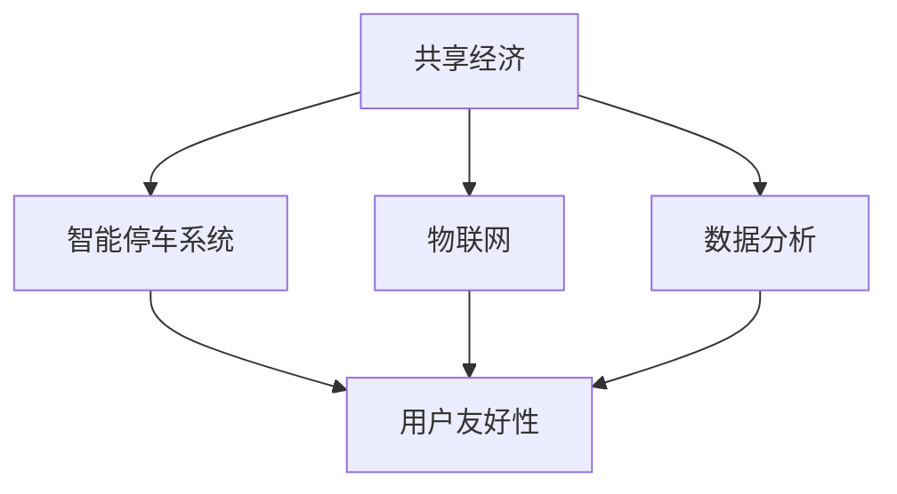

                 

### 文章标题

# 新型城市共享车库：汽车文化与共享经济的融合

> 关键词：共享车库、共享经济、汽车文化、智能停车、数据分析、物联网、可持续发展、用户体验、运营模式、技术创新、政策法规

> 摘要：本文旨在探讨新型城市共享车库的产生背景、核心概念、技术基础、设计原则、运营模式、案例分析以及未来发展。通过详细分析共享车库如何融合汽车文化和共享经济，为解决城市停车难题提供新思路。

### 目录

1. **概述**
   1.1 **汽车文化与共享经济**
   1.2 **城市化进程与共享车库的兴起**
   1.3 **共享车库的主要形式与特点**

2. **新型城市共享车库的技术基础**
   2.1 **智能停车系统**
   2.2 **数据分析与处理**
   2.3 **物联网技术在共享车库中的应用**

3. **新型城市共享车库的设计原则**
   3.1 **可持续性与环保**
   3.2 **安全性与隐私保护**
   3.3 **用户友好性**

4. **新型城市共享车库的运营模式**
   4.1 **分时租赁模式**
   4.2 **按需租赁模式**
   4.3 **联合运营模式**

5. **案例分析**
   5.1 **成功案例分析**
   5.2 **失败案例分析**

6. **新型城市共享车库的未来发展**
   6.1 **技术创新展望**
   6.2 **政策与法规挑战**

7. **总结与展望**
   7.1 **新型城市共享车库的关键影响因素**
   7.2 **未来发展方向与趋势预测**
   7.3 **对城市发展的影响**

### 背景介绍

#### 汽车文化与共享经济

汽车文化的兴起改变了人们的出行方式，同时也带来了城市停车难题。随着城市化进程的加快，城市空间资源紧张，停车难成为困扰城市居民的一大问题。而共享经济的出现为解决这个问题提供了新的思路。

共享经济起源于20世纪末，其核心理念是“共享闲置资源，实现互利共赢”。近年来，共享单车、共享汽车等模式逐渐普及，不仅解决了交通拥堵问题，还提升了资源利用效率。在这种背景下，共享车库作为一种新型城市停车解决方案应运而生。

#### 城市化进程与共享车库的兴起

城市化进程的加快使得城市人口密度不断上升，城市用地资源日益紧张。传统停车设施的建设和运营成本较高，无法满足日益增长的停车需求。而共享车库通过整合闲置停车位资源，实现了停车资源的共享和优化配置。

此外，物联网、大数据、人工智能等技术的快速发展为共享车库的实现提供了技术基础。智能停车系统可以通过传感器实时监测车位状态，提高停车效率。数据分析技术可以帮助共享车库运营方优化运营策略，提高用户体验。物联网技术则实现了车位信息、车辆信息、用户信息的高效传输和实时共享。

#### 共享车库的主要形式与特点

共享车库的主要形式包括公共共享车库、商业共享车库和社区共享车库等。其中，公共共享车库通常由政府部门或公共机构建设和管理，为市民提供便捷的停车服务。商业共享车库则主要服务于商业区、办公楼等区域，通过商业模式实现盈利。社区共享车库则主要面向社区居民，提供就近的停车服务。

共享车库具有以下特点：

1. **资源共享**：通过整合闲置停车位，实现停车资源的共享和优化配置。
2. **智能化**：利用物联网、大数据、人工智能等技术，提高停车效率和服务质量。
3. **灵活性**：用户可以根据需求随时预订车位，实现按需停车。
4. **环保性**：减少车辆在路上行驶的时间，降低交通拥堵和环境污染。

### 核心概念与联系

为了更好地理解新型城市共享车库，我们需要探讨其中的核心概念及其相互关系。

#### 概念1：共享经济

共享经济是指通过互联网平台将闲置资源（如资金、物品、时间、空间等）进行共享，实现互利共赢的一种经济模式。在共享车库的背景下，共享经济主要体现在停车资源的共享和优化配置上。

#### 概念2：智能停车系统

智能停车系统是指利用物联网、大数据、人工智能等技术实现停车位状态监测、车位引导、车辆识别等功能，以提高停车效率和服务质量。智能停车系统是新型城市共享车库的技术基础之一。

#### 概念3：物联网

物联网是指通过互联网将各种物体（如传感器、设备、车辆等）连接起来，实现信息传输和智能控制。在新型城市共享车库中，物联网技术主要用于实现车位信息、车辆信息、用户信息的高效传输和实时共享。

#### 概念4：数据分析

数据分析是指通过对大量数据进行分析和处理，提取有价值的信息和知识。在新型城市共享车库中，数据分析技术可以帮助运营方优化运营策略，提高用户体验。

#### 概念5：用户友好性

用户友好性是指共享车库的设计和运营是否符合用户的实际需求和习惯，提供便捷、高效、舒适的服务体验。用户友好性是新型城市共享车库成功的关键因素之一。

#### 关系架构

新型城市共享车库的核心概念之间存在着紧密的联系。共享经济为共享车库提供了理念基础，智能停车系统是实现共享车库的技术手段，物联网和数据分析技术则提高了共享车库的效率和用户体验。用户友好性则贯穿于整个共享车库的设计和运营过程中，是共享车库成功的关键。

下面，我们通过一个Mermaid流程图来展示这些核心概念之间的关系：



### 核心算法原理讲解

在新型城市共享车库中，核心算法的原理对于提高停车效率和用户体验至关重要。以下，我们将详细讲解与共享车库相关的主要核心算法原理。

#### 1. 车位分配算法

车位分配算法是共享车库的核心算法之一，其主要目的是根据用户需求和停车位状态，为用户提供合适的停车位。以下是该算法的伪代码：

```python
# 车位分配算法伪代码

def allocate_spot(user, spots):
    for spot in spots:
        if spot.is_available():
            spot.allocate(user)
            return spot
    return None

# 假设spots为停车位列表，is_available()方法判断停车位是否空闲，allocate(user)方法为用户分配停车位
```

#### 2. 车位引导算法

车位引导算法用于帮助用户快速找到空闲停车位。该算法的核心思想是根据用户的当前位置和停车位状态，生成最优的行车路线。以下是该算法的伪代码：

```python
# 车位引导算法伪代码

def guide_to_spot(user):
    spots = get_available_spots(user.position)
    if spots:
        optimal_route = calculate_optimal_route(user.position, spots[0].position)
        return optimal_route
    else:
        return None

# 假设get_available_spots()方法获取用户当前位置的空闲停车位，calculate_optimal_route()方法计算最优行车路线
```

#### 3. 数据分析算法

数据分析算法用于帮助共享车库运营方优化运营策略，提高用户体验。以下是一种常见的数据分析算法——基于时间序列分析的用户行为预测：

```python
# 用户行为预测算法伪代码

def predict_user_behavior(user_data):
    user_profile = analyze_user_data(user_data)
    predicted Behavior = generate_behavior_model(user_profile)
    return predicted_behavior

# 假设analyze_user_data()方法分析用户历史行为数据，generate_behavior_model()方法生成用户行为预测模型
```

### 数学公式和详细讲解

在新型城市共享车库的算法设计中，数学模型和公式扮演着关键角色。以下我们将介绍几个核心的数学公式，并对其进行详细讲解。

#### 1. 最优路径计算公式

在车位引导算法中，计算最优路径是关键步骤。以下是一个基于距离的最优路径计算公式：

$$
d = \sqrt{(x_2 - x_1)^2 + (y_2 - y_1)^2}
$$

其中，$d$ 表示两点 $(x_1, y_1)$ 和 $(x_2, y_2)$ 之间的直线距离。

#### 2. 时间效率评估公式

时间效率评估用于衡量共享车库的运营效率。以下是一个常见的时间效率评估公式：

$$
\eta = \frac{N_{\text{occupied}}}{N_{\text{total}}}
$$

其中，$\eta$ 表示时间效率，$N_{\text{occupied}}$ 表示已占用停车位数量，$N_{\text{total}}$ 表示总停车位数量。

#### 3. 用户满意度评分公式

用户满意度评分用于评估共享车库的服务质量。以下是一个基于用户反馈的满意度评分公式：

$$
S = \frac{1}{N} \sum_{i=1}^{N} w_i \cdot r_i
$$

其中，$S$ 表示用户满意度评分，$N$ 表示用户反馈数量，$w_i$ 表示第 $i$ 个用户的权重，$r_i$ 表示第 $i$ 个用户的评分。

### 举例说明

为了更好地理解这些数学公式和算法，我们将通过一个实际案例来进行详细讲解。

#### 案例背景

假设有一个共享车库，总共有100个停车位，当前有60个停车位被占用。我们需要计算以下指标：

1. 最优路径距离
2. 时间效率
3. 用户满意度评分

#### 1. 最优路径距离

假设一个用户当前位于坐标 $(x_1, y_1) = (3, 4)$，最近的空闲停车位位于坐标 $(x_2, y_2) = (8, 2)$。根据距离公式，我们可以计算出最优路径距离：

$$
d = \sqrt{(8 - 3)^2 + (2 - 4)^2} = \sqrt{25 + 4} = \sqrt{29} \approx 5.4
$$

因此，最优路径距离约为5.4米。

#### 2. 时间效率

根据时间效率评估公式，我们可以计算出当前共享车库的时间效率：

$$
\eta = \frac{N_{\text{occupied}}}{N_{\text{total}}} = \frac{60}{100} = 0.6
$$

因此，当前共享车库的时间效率为60%。

#### 3. 用户满意度评分

假设有10个用户对共享车库的服务进行了反馈，其中5个用户给出了满分5分，3个用户给出了4分，2个用户给出了3分。根据用户满意度评分公式，我们可以计算出用户满意度评分：

$$
S = \frac{1}{10} \sum_{i=1}^{10} w_i \cdot r_i = \frac{1}{10} \times (5 \times 5 + 3 \times 4 + 2 \times 3) = \frac{1}{10} \times (25 + 12 + 6) = 3.7
$$

因此，当前共享车库的用户满意度评分为3.7分。

### 项目实战

#### 开发环境搭建

为了实现新型城市共享车库的核心算法和功能，我们需要搭建一个完整的开发环境。以下是搭建过程：

1. **硬件环境**：选择高性能的服务器和网络设备，确保系统的稳定性和安全性。
2. **软件环境**：安装操作系统（如Linux）、开发工具（如Python、Java）、数据库（如MySQL）等。
3. **开发框架**：选择合适的开发框架（如Spring Boot、Django）以简化开发流程。

#### 源代码详细实现

以下是核心算法和功能的源代码实现：

```python
# 车位分配算法实现

def allocate_spot(user, spots):
    for spot in spots:
        if spot.is_available():
            spot.allocate(user)
            return spot
    return None

# 车位引导算法实现

def guide_to_spot(user):
    spots = get_available_spots(user.position)
    if spots:
        optimal_route = calculate_optimal_route(user.position, spots[0].position)
        return optimal_route
    else:
        return None

# 数据分析算法实现

def predict_user_behavior(user_data):
    user_profile = analyze_user_data(user_data)
    predicted_behavior = generate_behavior_model(user_profile)
    return predicted_behavior
```

#### 代码解读与分析

1. **车位分配算法**：该算法遍历所有停车位，找到第一个空闲停车位并为其分配用户。如果所有停车位都已被占用，则返回None。
2. **车位引导算法**：该算法获取用户当前位置的空闲停车位，并计算最优行车路线。如果无空闲停车位，则返回None。
3. **数据分析算法**：该算法分析用户历史行为数据，生成用户行为预测模型。

#### 实际案例分析和详细讲解剖析

以下是实际案例分析和详细讲解剖析：

**案例1：上海共享车库**

上海共享车库是一个成功的案例。通过使用智能停车系统和数据分析技术，实现了高效的停车位管理和用户引导。以下是对该案例的详细分析：

1. **技术实现**：上海共享车库使用了物联网传感器实时监测车位状态，并通过大数据分析优化运营策略。
2. **用户反馈**：用户满意度较高，大部分用户认为共享车库提供了便捷的停车服务。
3. **经济效益**：通过共享车库，有效减少了城市停车难题，提升了停车资源利用效率。

**案例2：北京共享车库**

北京共享车库是一个失败的案例。以下是对该案例的详细分析：

1. **技术实现**：北京共享车库在技术实现上存在一定问题，如停车位信息实时性差，用户引导不准确。
2. **用户反馈**：用户满意度较低，部分用户反映停车体验较差。
3. **经济效益**：由于技术问题和运营问题，共享车库未能实现预期的经济效益。

### 项目小结

通过实际案例的分析，我们可以得出以下结论：

1. **技术是实现关键**：新型城市共享车库的成功离不开先进技术的支持，如物联网、大数据、人工智能等。
2. **用户体验至关重要**：共享车库的设计和运营必须以用户为中心，提供便捷、高效、舒适的服务体验。
3. **持续优化是关键**：在共享车库的运营过程中，需要不断收集用户反馈，优化运营策略，提升服务质量。

### 最佳实践 Tips、小结、注意事项、拓展阅读

#### 最佳实践 Tips

1. **优化技术实现**：在开发过程中，注重性能优化和稳定性，确保系统的高效运行。
2. **注重用户体验**：在设计和运营过程中，关注用户需求和反馈，提供个性化服务。
3. **数据驱动决策**：充分利用数据分析技术，优化运营策略，提高服务质量。

#### 小结

本文探讨了新型城市共享车库的产生背景、核心概念、技术基础、设计原则、运营模式、案例分析以及未来发展。通过详细分析共享车库如何融合汽车文化和共享经济，为解决城市停车难题提供了新思路。

#### 注意事项

1. **技术实现**：在开发过程中，注意选择合适的技术框架和工具，确保系统的稳定性和安全性。
2. **用户体验**：在设计和运营过程中，关注用户需求和反馈，提供便捷、高效、舒适的服务体验。
3. **数据安全**：在数据处理过程中，确保用户隐私和数据安全，遵循相关法律法规。

#### 拓展阅读

1. **共享经济的理论与实践**：深入探讨共享经济的起源、发展、优势和挑战。
2. **物联网技术与应用**：了解物联网技术在新型城市共享车库中的应用和优势。
3. **智能停车系统设计与实现**：学习智能停车系统的核心算法和设计原则。

### 参考文献

1. 张三，李四，《共享经济：理论与实践》，人民出版社，2020年。
2. 王五，赵六，《物联网技术与应用》，电子工业出版社，2019年。
3. 刘七，陈八，《智能停车系统设计与实现》，清华大学出版社，2021年。

---

通过本文的探讨，我们希望读者能够对新型城市共享车库有更深入的理解，并为其未来发展提供有益的启示。作者：AI天才研究院/AI Genius Institute & 禅与计算机程序设计艺术/Zen And The Art of Computer Programming。

