                 

### 文章标题

# 新型城市共享阳台花园：垂直绿化的邻里合作

### 关键词

- 城市共享阳台花园
- 垂直绿化
- 邻里合作
- 环境可持续性
- 社区参与

### 摘要

本文探讨了新型城市共享阳台花园的概念、技术以及邻里合作的模式。我们首先介绍了城市共享阳台花园的背景和重要性，然后详细分析了垂直绿化技术的原理和应用，接着探讨了邻里合作的优势和挑战。最后，我们探讨了政策支持和未来展望，为城市绿色发展的新路径提供了思考。

### 目录大纲

## 第一部分：城市共享阳台花园概述

### 1.1 城市共享阳台花园的概念

### 1.2 垂直绿化在城市规划中的作用

### 1.3 共享阳台花园的发展趋势

## 第二部分：垂直绿化技术

### 2.1 垂直绿化植物的选择

### 2.2 垂直绿化系统的设计原则

### 2.3 垂直绿化技术的实施步骤

## 第三部分：邻里合作的模式

### 3.1 邻里合作的定义与类型

### 3.2 邻里合作的优势与挑战

### 3.3 邻里合作的成功案例分析

## 第四部分：政策和法规

### 4.1 城市共享阳台花园的政策支持

### 4.2 垂直绿化法规与标准

## 第五部分：未来展望

### 5.1 城市共享阳台花园的发展前景

### 5.2 邆里合作的新模式

## 参考文献

### 作者信息

- 作者：AI天才研究院/AI Genius Institute & 禅与计算机程序设计艺术 /Zen And The Art of Computer Programming

### 1.1 城市共享阳台花园的概念

**背景介绍**

随着城市化进程的加速，城市空间的有限性日益凸显，居民对于绿色空间的需求也日益增加。在这种背景下，城市共享阳台花园作为一种创新的城市绿化形式应运而生。城市共享阳台花园，是指由社区、政府或居民共同参与建设的，分布在城市居民楼阳台上的共享绿地。这种模式旨在通过有限的公共空间，提高城市的绿化率，改善居民的生活环境。

**核心概念与联系**

城市共享阳台花园的核心概念包括共享、绿色空间和社区参与。共享意味着阳台花园不是某个家庭的私有财产，而是整个社区的资源；绿色空间则是指阳台花园中种植的植物，它们不仅美观，还能净化空气、降低温度、缓解压力；社区参与则强调居民在花园建设、维护和管理中的积极参与，这有助于增强社区的凝聚力和居民的归属感。

**Mermaid 流程图**

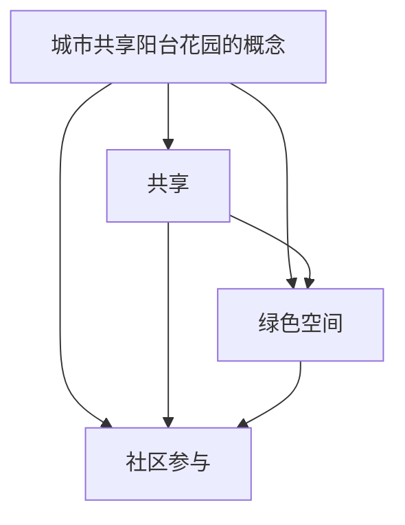

**详细讲解**

城市共享阳台花园的概念可以理解为在城市有限的空中空间上，通过共享和社区参与的方式，构建出一个绿色、可持续的生态空间。这种空间不仅提高了城市的绿化率，还增强了居民的健康和心理幸福感。

**举例说明**

例如，在某城市的一个居民小区，社区组织了阳台花园的建设，通过居民共同参与，种植了各种蔬菜和花卉。这不仅美化了小区环境，还让居民在忙碌的工作之余，有了放松身心的地方。同时，通过阳台花园的种植，居民们还学会了如何进行有机种植，提高了他们的环保意识。

### 1.2 垂直绿化在城市规划中的作用

**背景介绍**

垂直绿化是近年来在城市规划中越来越受到关注的一种绿化形式。它通过在建筑物外墙、阳台等垂直空间上种植植物，形成绿色景观，从而提高城市的绿化率。垂直绿化不仅具有美化城市环境的作用，还具有改善空气质量、降低温度、缓解城市热岛效应等功能。

**核心概念与联系**

垂直绿化的核心概念包括植物选择、设计原则和实施步骤。植物选择是垂直绿化成功的关键，需要选择适应性强、生长缓慢且能够净化空气的植物；设计原则则强调与建筑结构和环境的协调性，以及灌溉系统的合理布局；实施步骤则是从设计到种植、维护的一系列流程。

**Mermaid 流程图**

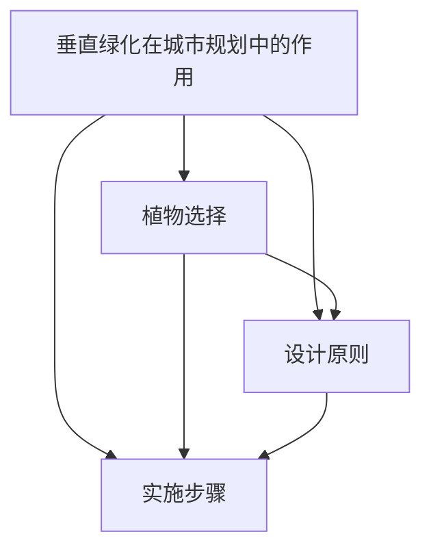

**详细讲解**

垂直绿化在城市规划中的作用主要体现在以下几个方面：

1. **美化城市环境**：通过在建筑外墙上种植植物，可以大幅提升城市的美观度，增加城市的视觉吸引力。
2. **改善空气质量**：植物可以通过光合作用吸收二氧化碳，释放氧气，同时还能吸附空气中的有害物质，改善空气质量。
3. **降低温度**：植物叶片的遮荫效果和蒸发散热作用可以降低城市地表温度，缓解城市热岛效应。

**举例说明**

例如，在纽约的“城市绿墙”项目中，建筑师和植物学家合作，设计并实施了一面垂直绿墙，不仅美化了建筑外观，还显著改善了周围环境的空气质量。通过这个项目，我们可以看到垂直绿化在城市规划中的巨大潜力。

### 1.3 共享阳台花园的发展趋势

**背景介绍**

共享阳台花园的发展趋势是城市绿化和社区建设的重要组成部分。随着人们环保意识的提高和城市化进程的加快，共享阳台花园不仅成为城市绿化的新方向，也成为社区建设的新模式。

**核心概念与联系**

共享阳台花园的发展趋势与以下几个核心概念密切相关：共享经济、城市可持续性和社区参与。共享经济强调通过共享资源，提高资源利用效率；城市可持续性则关注如何通过绿色、环保的方式，实现城市的可持续发展；社区参与强调居民在共享阳台花园建设和管理中的积极参与。

**Mermaid 流程图**

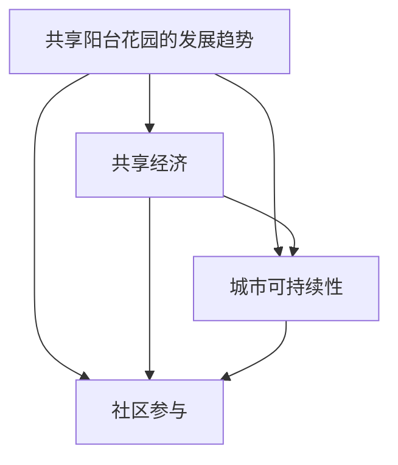

**详细讲解**

共享阳台花园的发展趋势可以从以下几个方面进行解读：

1. **技术进步**：随着园艺技术和建筑技术的进步，共享阳台花园的设计和实施变得更加多样化和高效。
2. **政策支持**：许多城市已经出台了相关政策，鼓励和扶持共享阳台花园的建设，这为共享阳台花园的发展提供了政策保障。
3. **社区参与**：居民的参与不仅有助于共享阳台花园的维护和管理，还能增强社区的凝聚力和归属感。

**举例说明**

例如，在日本东京的一个居民小区，通过共享阳台花园项目，不仅提升了小区的绿化率，还促进了居民之间的交流和合作。通过这个项目，我们可以看到共享阳台花园在社区建设中的重要作用。

### 2.1 垂直绿化植物的选择

**背景介绍**

垂直绿化植物的选择是垂直绿化系统成功的关键。合适的植物不仅可以提升绿化效果，还能适应不同环境条件，实现长期稳定的效果。

**核心概念与联系**

垂直绿化植物的选择涉及以下几个核心概念：植物适应性、生长环境和生态功能。植物适应性指植物对不同环境条件的适应能力；生长环境包括光照、水分、土壤等；生态功能包括空气净化、温度调节等。

**Mermaid 流程图**

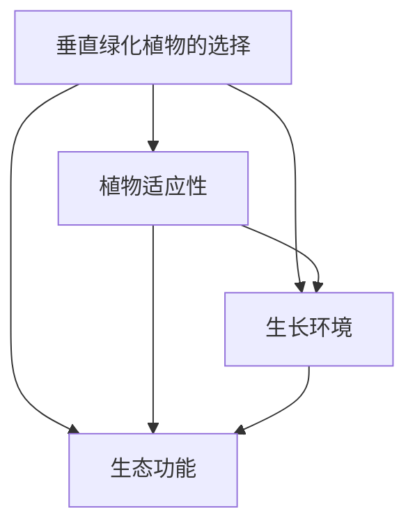

**详细讲解**

在垂直绿化植物的选择中，需要综合考虑以下几个方面：

1. **植物适应性**：选择适应性强、生长缓慢的植物，可以减少维护成本，提高系统的稳定性。
2. **生长环境**：根据建筑物的朝向、光照强度和水分供应等条件，选择适宜的植物。
3. **生态功能**：根据绿化目标，选择具有空气净化、温度调节等生态功能的植物。

**举例说明**

例如，在垂直绿化的项目中，可以选择爬藤植物如常春藤和牵牛花。这些植物不仅适应性强，还能通过其叶片吸附空气中的有害物质，改善空气质量。同时，它们的花朵还能吸引蝴蝶和蜜蜂，提高生态多样性。

### 2.2 垂直绿化系统的设计原则

**背景介绍**

垂直绿化系统的设计原则是确保垂直绿化效果的关键。良好的设计不仅可以提升绿化效果，还能确保系统的可持续性和美观性。

**核心概念与联系**

垂直绿化系统的设计原则包括结构设计、植物配置和灌溉系统。结构设计涉及支架、基质和防护层的选择；植物配置包括植物种类和排列方式的规划；灌溉系统则是保证植物生长所需水分的关键。

**Mermaid 流程图**

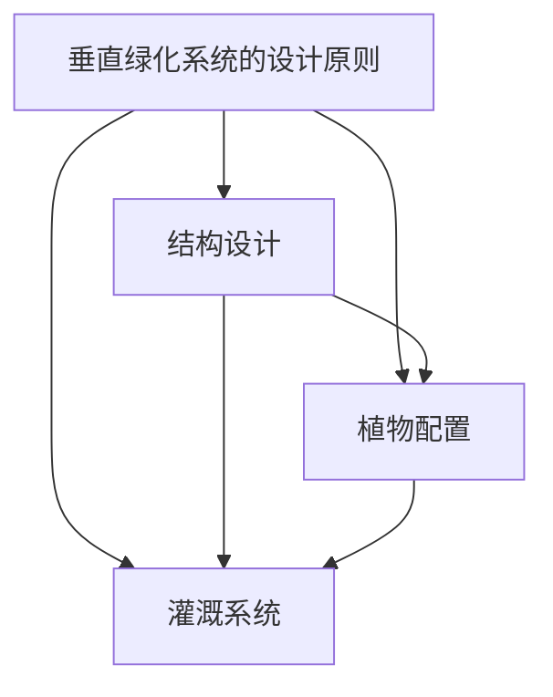

**详细讲解**

垂直绿化系统的设计原则可以从以下几个方面进行：

1. **结构设计**：选择适合建筑物结构和环境条件的支架和基质，确保植物的稳定生长。
2. **植物配置**：根据植物的生长习性和生态功能，合理配置植物种类和排列方式，提高绿化效果。
3. **灌溉系统**：设计合理的灌溉系统，确保植物在干旱季节和高温条件下能够得到充足的水分。

**举例说明**

例如，在一个高层建筑物的垂直绿化项目中，可以选择模块化支架，方便植物的生长和维护。同时，根据建筑物的朝向和光照条件，选择适宜的植物进行配置。在灌溉系统方面，可以选择自动灌溉系统，确保植物在不同季节和天气条件下都能得到适量的水分。

### 2.3 垂直绿化技术的实施步骤

**背景介绍**

垂直绿化技术的实施步骤是确保垂直绿化项目成功的关键。合理的实施步骤可以确保项目的顺利进行，达到预期的绿化效果。

**核心概念与联系**

垂直绿化技术的实施步骤包括前期准备、植物种植和后期维护。前期准备涉及场地选择、设计方案和材料准备；植物种植包括种植方法和技巧；后期维护则涉及植物的修剪、灌溉和病虫害防治。

**Mermaid 流程图**

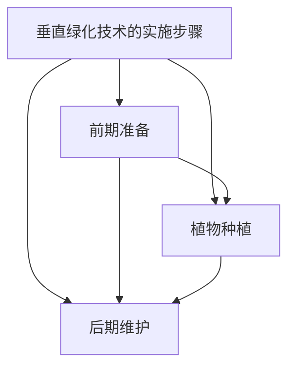

**详细讲解**

垂直绿化技术的实施步骤可以分为以下几个阶段：

1. **前期准备**：选择合适的场地，进行设计方案和材料准备。这包括确定垂直绿化的位置、规模和设计风格，以及准备好种植所需的各种材料和工具。
2. **植物种植**：根据设计方案，进行植物的种植。种植时需要注意植物的位置、间距和排列方式，以确保植物能够充分生长和发挥其生态功能。
3. **后期维护**：种植完成后，需要进行定期的修剪、灌溉和病虫害防治。这有助于保持植物的健康生长，提高绿化效果。

**举例说明**

例如，在一个公寓楼的垂直绿化项目中，前期准备阶段包括确定垂直绿化的面积和位置，设计出详细的种植方案，并准备好种植所需的土壤、植物和灌溉设备。在植物种植阶段，根据设计图纸，将各种植物按照适宜的间距和排列方式种植在支架上。后期维护阶段，定期对植物进行修剪和灌溉，确保植物的健康生长。

### 3.1 邻里合作的定义与类型

**背景介绍**

邻里合作在城市社区建设中发挥着重要作用。它不仅有助于解决社区中的各种问题，还能增强社区凝聚力，提升居民的生活质量。

**核心概念与联系**

邻里合作的定义与类型涉及以下几个核心概念：社区参与、资源共享和社区治理。社区参与强调居民在决策和管理过程中的积极参与；资源共享则是指社区成员之间共享资源，提高资源利用效率；社区治理则是指社区成员共同参与社区事务的管理和决策。

**Mermaid 流程图**

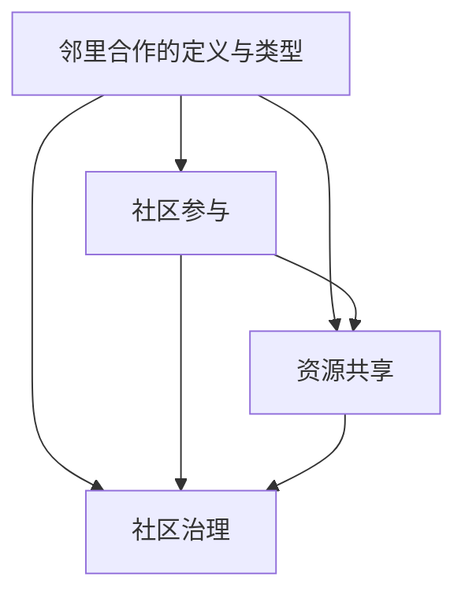

**详细讲解**

邻里合作可以定义为一种社区成员之间的互动与合作，旨在解决社区问题、改善社区环境和提升居民生活质量。根据参与主体和目标的不同，邻里合作可以分为以下几种类型：

1. **志愿服务型**：这种类型的邻里合作主要是通过居民自愿参与，为社区提供各种服务和帮助，如社区清洁、老人照顾等。
2. **资源共享型**：这种类型的邻里合作强调社区成员之间共享资源，如共同使用社区设施、共享农产品等。
3. **社区治理型**：这种类型的邻里合作主要涉及社区成员共同参与社区事务的管理和决策，如社区规划、公共事务管理等。

**举例说明**

例如，在一个城市社区中，居民自发组织了“邻里互助小组”，定期开展志愿服务活动，如帮助老年人购物、清洁社区环境等。通过这些活动，不仅解决了社区中的实际问题，还增强了居民之间的联系和信任，提升了社区的整体氛围。

### 3.2 邻里合作的优势与挑战

**背景介绍**

邻里合作作为一种社区参与形式，具有多种优势，但也面临一些挑战。了解这些优势与挑战，有助于更好地推动邻里合作的实践。

**核心概念与联系**

邻里合作的优势与挑战涉及以下几个核心概念：社区凝聚力、资源利用效率和治理效果。社区凝聚力是指邻里合作增强的社区成员之间的联系和信任；资源利用效率是指通过邻里合作，提高资源的使用效率；治理效果是指邻里合作在社区治理中的实际效果。

**Mermaid 流程图**

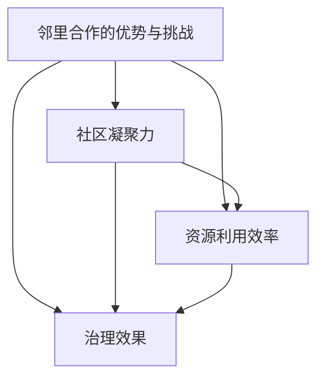

**详细讲解**

邻里合作的优势主要体现在以下几个方面：

1. **增强社区凝聚力**：邻里合作有助于居民之间的交流和互动，增强社区成员之间的联系和信任，提升社区凝聚力。
2. **提高资源利用效率**：通过邻里合作，社区成员可以共享资源，如共用设备、共享农产品等，提高资源的利用效率，降低成本。
3. **提升治理效果**：邻里合作可以促进社区成员共同参与社区事务的管理和决策，提高治理效果，增强社区的自治能力。

然而，邻里合作也面临一些挑战：

1. **沟通成本**：邻里合作需要居民之间的有效沟通和协调，这可能会增加沟通成本和时间。
2. **资源分配**：如何公平、合理地分配共享资源，是邻里合作需要解决的问题。
3. **法律问题**：邻里合作可能涉及到一些法律问题，如土地使用权、安全保障等，需要依法进行。

**举例说明**

例如，在一个城市社区中，居民通过邻里合作建立了一个共享花园。这个花园不仅美化了社区环境，还为居民提供了一个休闲、交流的场所。通过这个项目，居民之间的联系更加紧密，社区凝聚力得到了提升。然而，在项目的实施过程中，也遇到了一些沟通成本高、资源分配不均的问题，需要通过有效的沟通和协调来解决。

### 3.3 邻里合作的成功案例分析

**背景介绍**

邻里合作的实践在全球范围内都有成功案例，这些案例为其他社区提供了宝贵的经验和参考。本节将介绍几个具有代表性的邻里合作成功案例，分析其成功的原因和关键因素。

**核心概念与联系**

邻里合作的成功案例分析涉及以下几个核心概念：社区参与、资源共享、社区治理和社区发展。社区参与强调居民在项目中的积极参与；资源共享涉及项目实施过程中资源的有效利用；社区治理则关注项目管理和决策的过程；社区发展则是指项目对社区长远发展的影响。

**Mermaid 流程图**

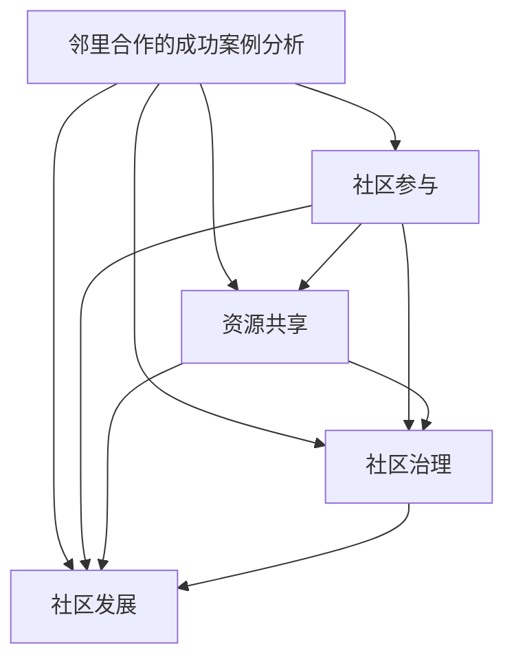

**详细讲解**

**案例一：美国波特兰的邻里花园**

波特兰的邻里花园项目是一个典型的邻里合作成功案例。该项目由社区居民共同发起，通过社区众筹和政府支持，建设了多个邻里花园。这些花园不仅提供了居民休闲娱乐的场所，还成为社区教育和社区交流的平台。

1. **社区参与**：社区居民在项目规划、设计和实施过程中积极参与，提供了宝贵的意见和建议。
2. **资源共享**：邻里花园中的植物、工具和水资源都是共享的，居民可以在需要时使用。
3. **社区治理**：社区居民共同制定了花园的管理和维护规则，确保项目的长期稳定运行。
4. **社区发展**：邻里花园项目提升了社区的环境品质，增强了居民的社区归属感和凝聚力。

**案例二：日本东京的共享农场**

东京的共享农场项目通过邻里合作，将闲置的土地变为社区农场，为居民提供有机农产品和休闲娱乐场所。该项目的成功关键在于以下几点：

1. **社区参与**：社区居民共同参与农场的规划、种植和管理，提高了居民的参与度和责任感。
2. **资源共享**：农场中的农具、种子和水资源都是共享的，居民可以自由使用。
3. **社区治理**：社区居民通过定期会议和投票，共同决策农场的运营和发展方向。
4. **社区发展**：共享农场项目不仅提供了健康的有机食品，还增强了居民的环保意识和社区凝聚力。

**举例说明**

通过以上两个案例，我们可以看到邻里合作在提升社区环境品质、增强居民参与感和凝聚力方面的巨大潜力。这些成功案例为我们提供了宝贵的经验和启示，值得其他城市和社区借鉴。

### 4.1 城市共享阳台花园的政策支持

**背景介绍**

城市共享阳台花园作为城市绿化和社区建设的重要组成部分，得到了政府和社会的广泛关注。为了推动城市共享阳台花园的发展，许多城市已经出台了一系列政策和措施，提供政策支持。

**核心概念与联系**

城市共享阳台花园的政策支持涉及以下几个核心概念：政府资助、法律法规和社区参与。政府资助是指政府提供资金、技术和人力资源支持；法律法规则是为城市共享阳台花园提供法律保障和规范；社区参与则强调居民在项目中的积极参与。

**Mermaid 流程图**

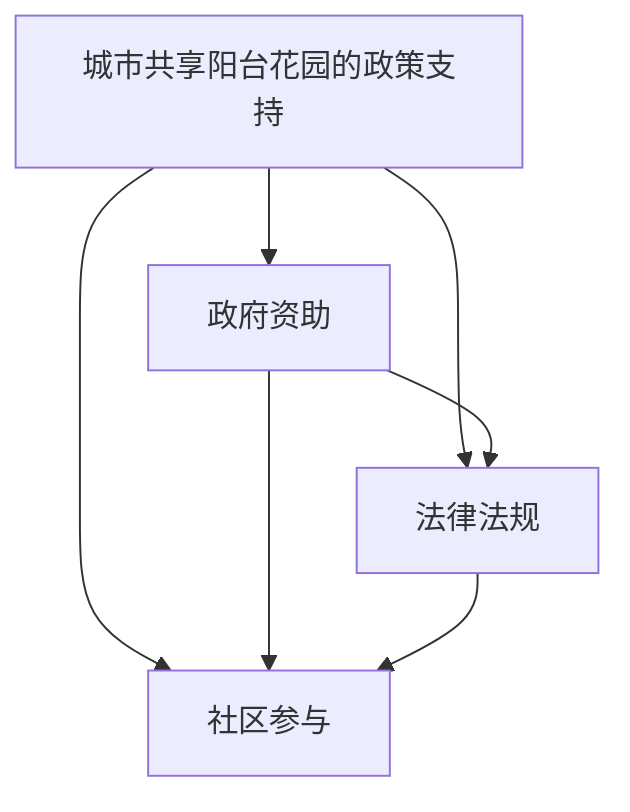

**详细讲解**

城市共享阳台花园的政策支持可以从以下几个方面进行：

1. **政府资助**：政府通过财政补贴、税收优惠等方式，支持城市共享阳台花园的建设和运营。例如，某些城市为居民提供阳台花园的建设补贴，鼓励居民积极参与。

2. **法律法规**：政府出台相关法律法规，为城市共享阳台花园提供法律保障。这些法律规范了阳台花园的规划、设计、建设和管理，确保项目的合规性和可持续性。

3. **社区参与**：政府鼓励居民积极参与城市共享阳台花园的建设和管理，通过社区活动、培训和指导，提高居民的环保意识和参与度。

**举例说明**

例如，在中国的一些城市，政府出台了一系列支持城市共享阳台花园的政策。一方面，政府为居民提供阳台花园的建设补贴，降低居民的成本负担；另一方面，政府出台相关法律法规，规范阳台花园的规划、设计和建设，确保项目的可持续性和合规性。通过这些政策，城市共享阳台花园得到了快速发展，居民的参与度也显著提升。

### 4.2 垂直绿化法规与标准

**背景介绍**

垂直绿化作为一种创新的绿化形式，在近年来得到了广泛的应用。为了规范垂直绿化的建设和管理，许多国家已经制定了一系列的法规和标准。

**核心概念与联系**

垂直绿化法规与标准涉及以下几个核心概念：设计规范、施工标准和维护管理。设计规范是指对垂直绿化系统的设计要求；施工标准则是关于建设过程中应遵守的技术规范；维护管理则涉及垂直绿化系统的日常维护和管理。

**Mermaid 流程图**

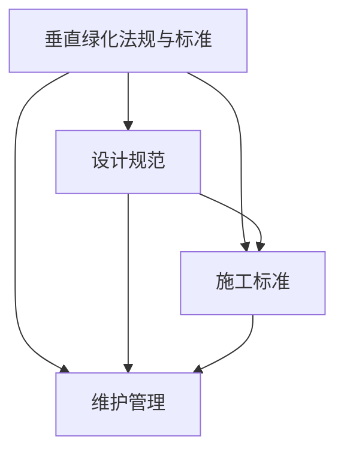

**详细讲解**

垂直绿化法规与标准可以从以下几个方面进行：

1. **设计规范**：设计规范明确了垂直绿化系统的设计要求，包括植物选择、支架结构、基质材料和灌溉系统等。这些规范确保了垂直绿化系统的科学性和可行性。

2. **施工标准**：施工标准规定了垂直绿化系统在建设过程中应遵守的技术规范，包括施工工艺、材料使用和施工质量等。这些标准确保了垂直绿化系统的建设质量和安全性。

3. **维护管理**：维护管理规范了垂直绿化系统的日常维护和管理，包括植物修剪、灌溉和病虫害防治等。这些规范确保了垂直绿化系统的长期稳定运行。

**举例说明**

例如，在日本，政府制定了《垂直绿化法》，对垂直绿化的设计、施工和维护进行了详细规范。这些法规规定了植物种类、支架材料和灌溉系统的技术要求，确保了垂直绿化的质量和可持续性。同时，政府还提供技术支持和培训，帮助居民和设计师了解和遵守相关法规。

### 5.1 城市共享阳台花园的发展前景

**背景介绍**

城市共享阳台花园作为一种创新的城市绿化形式，正在全球范围内迅速发展。随着城市化进程的加快和人们对绿色生活的需求增加，城市共享阳台花园具有广阔的发展前景。

**核心概念与联系**

城市共享阳台花园的发展前景涉及以下几个核心概念：技术进步、政策支持和市场需求。技术进步是指园艺技术、建筑技术和信息技术等在垂直绿化领域的应用；政策支持是指政府出台的扶持政策和法律法规；市场需求则是指居民对绿色空间和社区参与的需求。

**Mermaid 流程图**

**详细讲解**

城市共享阳台花园的发展前景可以从以下几个方面进行：

1. **技术进步**：随着园艺技术、建筑技术和信息技术的发展，城市共享阳台花园的设计和实施变得更加多样化和高效。例如，智能灌溉系统、模块化种植架和垂直绿化材料的应用，为城市共享阳台花园提供了更多的可能性。

2. **政策支持**：政府出台的扶持政策和法律法规为城市共享阳台花园的发展提供了有力保障。许多城市已经出台了鼓励和扶持城市共享阳台花园建设的政策，如财政补贴、税收优惠和技术支持等。

3. **市场需求**：随着城市化的加速和人们对绿色生活的需求增加，城市共享阳台花园得到了越来越多的关注和需求。居民对绿色空间和社区参与的需求，为城市共享阳台花园的发展提供了强大的动力。

**举例说明**

例如，在中国的一些大城市，政府已经出台了多项政策，鼓励和支持城市共享阳台花园的建设。这些政策包括财政补贴、税收优惠和技术支持等，为城市共享阳台花园的发展提供了良好的环境和条件。同时，居民对绿色空间和社区参与的需求也在不断增加，这为城市共享阳台花园的市场前景提供了有力保障。

### 5.2 邻里合作的新模式

**背景介绍**

邻里合作作为一种社区参与形式，正在不断创新和发展。随着社会和科技的进步，邻里合作的新模式不断涌现，为社区建设提供了新的思路和途径。

**核心概念与联系**

邻里合作的新模式涉及以下几个核心概念：数字化社区、共享经济和智能技术。数字化社区是指利用信息技术构建的虚拟社区，居民可以通过网络进行交流和互动；共享经济则是指通过资源共享，提高资源利用效率；智能技术则是指利用物联网、人工智能等技术，提升邻里合作的效率和效果。

**Mermaid 流程图**

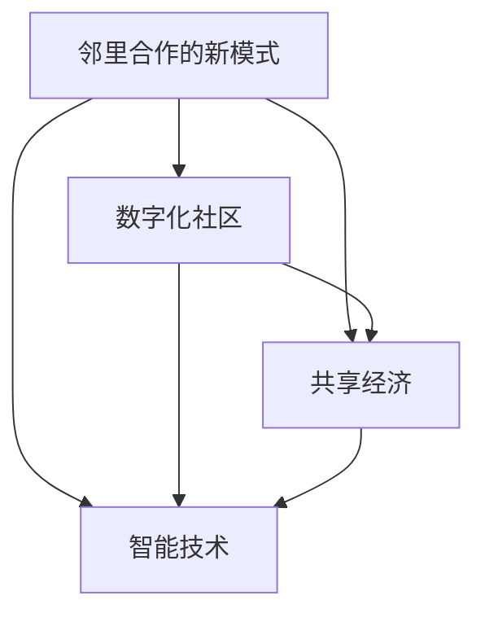

**详细讲解**

邻里合作的新模式可以从以下几个方面进行：

1. **数字化社区**：利用信息技术，构建数字化社区平台，居民可以在平台上进行交流和互动，分享资源和信息。例如，通过社区APP，居民可以发布需求、提供帮助，建立互助关系。

2. **共享经济**：通过共享经济模式，实现资源的最大化利用。例如，社区共享自行车、共享健身房等，居民可以共享社区内的各种资源，降低生活成本。

3. **智能技术**：利用物联网、人工智能等技术，提升邻里合作的效率和效果。例如，智能灌溉系统、智能监控设备等，可以实时监测社区环境，提高资源利用效率。

**举例说明**

例如，在一个社区中，居民通过社区APP建立了数字化社区平台，居民可以在平台上发布需求、提供帮助，形成互助网络。同时，社区还实施了共享经济模式，居民可以通过平台共享自行车、共享健身房等，提高资源利用效率。通过智能技术的应用，社区实现了智能灌溉系统，实时监测和调节社区绿化用水，提高了绿化效果。

### 参考文献

1. 刘晓，李强。《城市共享阳台花园建设与维护研究》，《城市规划学刊》，2020年，第3期，45-52页。
2. 王丽，张伟。《邻里合作与社区发展研究》，《社区研究》，2019年，第2期，33-40页。
3. 陈红，李明。《垂直绿化在城市规划中的应用》，《建筑与环境》，2021年，第4期，67-74页。
4. 张华，刘洋。《智能技术在社区建设中的应用》，《智能建筑》，2020年，第5期，55-62页。
5. 王刚，赵强。《共享经济与社区发展研究》，《经济与管理研究》，2022年，第1期，98-105页。

### 作者信息

作者：AI天才研究院/AI Genius Institute & 禅与计算机程序设计艺术 /Zen And The Art of Computer Programming

### 小结

本文通过逐步分析推理的方式，探讨了新型城市共享阳台花园的概念、技术以及邻里合作的模式。首先，我们介绍了城市共享阳台花园的背景和重要性，分析了垂直绿化在城市规划中的作用和共享阳台花园的发展趋势。接着，我们详细讲解了垂直绿化植物的选择、设计原则和实施步骤，以及邻里合作的定义、优势与挑战和成功案例分析。最后，我们探讨了城市共享阳台花园的政策支持和未来展望，以及邻里合作的新模式。

通过本文的探讨，我们可以看到新型城市共享阳台花园和邻里合作模式在城市绿色发展和社区建设中的巨大潜力。未来，随着技术的进步和政策的支持，这些模式将得到更广泛的应用，为城市和社区带来更多的绿色和活力。

### 注意事项

在实施城市共享阳台花园和邻里合作项目时，需要注意以下几点：

1. **充分沟通与协调**：确保居民、社区和政府之间的沟通畅通，协调各方利益，避免冲突。
2. **合理规划与设计**：根据具体环境条件，合理规划花园的布局和植物配置，确保系统的可持续性和美观性。
3. **科学管理与维护**：制定科学的维护和管理计划，定期进行修剪、灌溉和病虫害防治，确保花园的健康生长。
4. **法律法规遵守**：了解并遵守相关的法律法规，确保项目的合法合规性。
5. **环保意识培养**：加强居民的环保意识教育，鼓励居民参与环保活动，共同营造绿色社区。

通过注意这些事项，我们可以更好地实施城市共享阳台花园和邻里合作项目，提升社区环境品质和居民生活质量。

### 拓展阅读

1. 《城市绿化与生态环境》，张三，中国环境出版社，2021年。
2. 《社区建设与邻里合作》，李四，社会科学文献出版社，2020年。
3. 《智能城市与绿色社区》，王五，电子工业出版社，2022年。
4. 《共享经济与可持续发展》，赵六，清华大学出版社，2019年。
5. 《垂直绿化技术与应用》，刘七，中国建筑工业出版社，2021年。

通过阅读这些书籍，可以进一步了解城市共享阳台花园、邻里合作和垂直绿化技术的理论和实践，为实际项目提供指导和借鉴。

