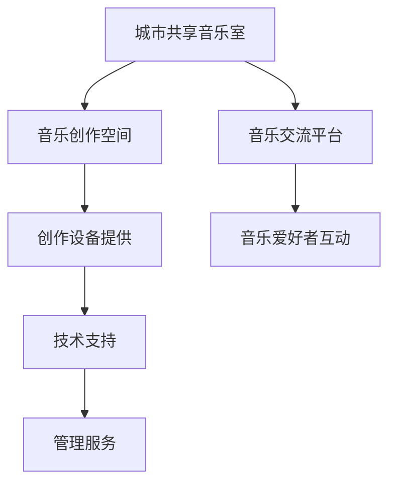

                 

### 文章标题

《新型城市共享音乐室：业余音乐人的创作空间》

### 关键词

- 城市共享音乐室
- 业余音乐人
- 创作空间
- 音频技术
- 空间设计
- 运营模式
- 案例研究
- 未来发展

### 摘要

本文旨在探讨新型城市共享音乐室的概念、设计原则、运营模式及其对业余音乐人创作空间的影响。通过背景介绍、核心概念解析、设计原则与规划、案例分析以及未来发展展望，全面阐述共享音乐室在提升城市文化氛围、促进音乐创作和交流中的重要作用。本文旨在为城市音乐共享空间的开发者、运营者以及业余音乐人提供有价值的参考和启示。

### 目录

1. **背景介绍**
   1.1 音乐创作与社会需求
   1.2 共享经济的崛起
   1.3 城市共享音乐室的发展

2. **核心概念与联系**
   2.1 城市共享音乐室定义
   2.2 共享音乐室与音乐创作的联系
   2.3 Mermaid流程图

3. **设计原则与规划**
   3.1 空间设计原则
   3.2 技术支持方案
   3.3 管理与服务模式

4. **案例分析**
   4.1 国内共享音乐室案例
   4.2 国外共享音乐室案例
   4.3 案例对比与分析

5. **核心算法原理讲解**
   5.1 音频处理算法
   5.2 音频录制与播放算法
   5.3 伪代码解析

6. **数学模型与公式**
   6.1 声学模型
   6.2 音频信号处理模型
   6.3 公式与详细讲解

7. **项目实战**
   7.1 开发环境搭建
   7.2 源代码实现
   7.3 代码解读
   7.4 实际案例分析

8. **最佳实践与小结**
   8.1 设计最佳实践
   8.2 运营最佳实践
   8.3 注意事项
   8.4 拓展阅读

9. **未来发展展望**
   9.1 技术趋势与发展方向
   9.2 政策与法律环境
   9.3 市场发展状况

### 附录

- 相关术语与缩略语解释
- 参考资料与推荐阅读

---

### 背景介绍

#### 1.1 音乐创作与社会需求

音乐创作是人类文化的重要组成部分，它不仅能够丰富人们的精神世界，还能激发创造力和情感表达。随着社会的进步和人们对文化需求的增加，音乐创作在当代社会中的地位愈发重要。然而，许多业余音乐人面临着创作空间不足、设备昂贵等问题，这限制了他们的创作潜力。

#### 1.2 共享经济的崛起

共享经济作为一种新兴的经济模式，近年来在全球范围内迅速发展。它通过共享资源、优化配置，降低了使用成本，提高了资源利用率。共享经济在交通、住宿、办公等领域取得了显著成果，为各行各业带来了新的发展机遇。

#### 1.3 城市共享音乐室的发展

城市共享音乐室是共享经济在音乐领域的一种创新应用。它为业余音乐人提供了一个低成本、高效率的创作空间，满足了他们在音乐创作方面的需求。随着城市化的推进和人们对文化生活的追求，共享音乐室在各大城市逐渐兴起，成为音乐爱好者们的新宠。

### 核心概念与联系

#### 2.1 城市共享音乐室定义

城市共享音乐室是指以共享经济模式运营的音乐创作空间，提供各类音乐创作设备、技术支持和管理服务，为业余音乐人提供一个低成本、便捷的创作环境。

#### 2.2 共享音乐室与音乐创作的联系

共享音乐室不仅是音乐创作的场所，更是音乐交流与分享的平台。它为业余音乐人提供了丰富的创作资源和互动机会，有助于激发创作灵感，提升创作质量。同时，共享音乐室也为音乐爱好者提供了一个接触音乐、了解音乐创作的机会，促进了音乐文化的传播和普及。

#### 2.3 Mermaid流程图



### 设计原则与规划

#### 3.1 空间设计原则

城市共享音乐室的空间设计应充分考虑音乐创作需求，创造一个舒适、安静、富有创意的氛围。以下是一些关键设计原则：

1. **隐私保护**：为每位音乐人提供独立的创作空间，确保个人隐私。
2. **隔音效果**：采用优质的隔音材料，降低外界干扰，提升音乐创作质量。
3. **光线设计**：合理利用自然光，营造舒适的光环境。
4. **通风系统**：确保室内空气流通，提供一个健康的环境。

#### 3.2 技术支持方案

城市共享音乐室的技术支持是确保音乐创作顺利进行的关键。以下是一些关键的技术支持方案：

1. **音频设备**：提供高质量的音频设备，包括麦克风、音箱、音频接口等。
2. **录音软件**：提供专业的录音软件，支持多轨录音和音频编辑功能。
3. **视频监控与安全**：采用高清摄像头进行实时监控，确保音乐室的安全。
4. **互联网连接**：提供高速稳定的互联网连接，支持在线协作和资源分享。

#### 3.3 管理与服务模式

城市共享音乐室的管理与服务模式对于其运营效率和用户体验至关重要。以下是一些关键的管理与服务模式：

1. **预约系统**：建立在线预约系统，方便音乐人预约使用音乐室。
2. **会员制度**：设立会员制度，提供不同的会员等级和优惠。
3. **活动组织**：定期举办音乐沙龙、创作工作坊等活动，促进音乐人之间的交流。
4. **培训与辅导**：提供音乐创作培训和技术辅导，提升音乐人的创作水平。

### 案例分析

#### 4.1 国内共享音乐室案例

国内共享音乐室的发展迅速，许多城市都涌现出了一批具有影响力的共享音乐室。以下是一些典型案例：

1. **北京音乐星球**：位于北京市中心，提供各类音乐创作设备，注重空间设计和用户体验。
2. **上海音乐港湾**：位于上海市浦东新区，拥有宽敞的音乐创作空间，提供完善的音频设备和录音软件。
3. **广州音乐工作室**：位于广州市天河区，以高品质的音频设备和专业的技术支持著称。

#### 4.2 国外共享音乐室案例

国外共享音乐室的发展较早，一些国家在共享音乐室的建设和管理方面积累了丰富的经验。以下是一些典型案例：

1. **美国音乐共享空间**：位于美国纽约市，提供多样的音乐创作设备，注重音乐教育和社区建设。
2. **英国音乐实验室**：位于英国伦敦市，拥有先进的音频设备和技术支持，定期举办音乐活动和讲座。
3. **法国音乐工作室**：位于法国巴黎市，提供丰富的音乐创作资源，注重音乐文化的传承和推广。

#### 4.3 案例对比与分析

通过对国内外共享音乐室案例的对比，可以发现以下特点：

1. **技术支持**：国外共享音乐室在技术支持方面更为专业和先进，提供了更多元化的音频设备和录音软件。
2. **空间设计**：国内共享音乐室在空间设计方面注重舒适性和用户体验，而国外共享音乐室则更注重创意和艺术氛围。
3. **运营模式**：国外共享音乐室在运营模式上更为成熟，注重社区建设和音乐文化的推广。

### 核心算法原理讲解

#### 5.1 音频处理算法

音频处理算法是城市共享音乐室的核心技术之一，它用于处理音频信号，提高音频质量。以下是一些常用的音频处理算法：

1. **降噪算法**：用于去除音频中的噪声，提高音频清晰度。常见的降噪算法包括自适应滤波器、频谱分析等。
2. **均衡器**：用于调整音频信号的频率响应，达到理想的音质效果。常见的均衡器算法包括参数均衡器、图形均衡器等。
3. **混音算法**：用于将多个音频信号混合成一个新的音频信号，达到立体声效果。常见的混音算法包括叠加、交错等。

以下是一个简单的音频处理算法的伪代码：

```plaintext
function AudioProcessing(audioSignal):
    # 降噪
    noiseFreeSignal = NoiseReduction(audioSignal)
    # 均衡
    balancedSignal = Equalization(noiseFreeSignal)
    # 混音
    mixedSignal = StereoMixer(balanceSignal)
    return mixedSignal
```

#### 5.2 音频录制与播放算法

音频录制与播放算法是城市共享音乐室中的基本功能，它们用于捕捉和播放音频信号。以下是一些常用的音频录制与播放算法：

1. **音频录制算法**：用于将模拟信号转换为数字信号，并存储为文件。常见的音频录制算法包括采样、量化等。
2. **音频播放算法**：用于将数字信号转换为模拟信号，并通过扬声器播放。常见的音频播放算法包括数字模拟转换、音频合成等。

以下是一个简单的音频录制与播放算法的伪代码：

```plaintext
function AudioRecording(inputSignal):
    # 采样
    sampledSignal = Sampling(inputSignal)
    # 量化
    quantizedSignal = Quantization(sampledSignal)
    # 存储
    StoreAudioFile(quantizedSignal)
    return quantizedSignal

function AudioPlayback(audioFile):
    # 读取
    quantizedSignal = LoadAudioFile(audioFile)
    # 数模转换
    analogSignal = DigitalToAnalog(quantizedSignal)
    # 播放
    PlayAudio(analogSignal)
```

### 数学模型与公式

#### 6.1 声学模型

声学模型是用于描述声音传播和音频处理的重要工具。以下是一些常用的声学模型：

1. **声压级模型**：用于计算声音的强度。公式为：
   $$ L_p = 20 \log_{10}\left(\frac{p}{p_0}\right) $$
   其中，$L_p$ 是声压级（单位：分贝），$p$ 是声压（单位：帕斯卡），$p_0$ 是参考声压（单位：帕斯卡）。

2. **频率响应模型**：用于描述音频设备对不同频率信号的增益或衰减。公式为：
   $$ A(f) = 20 \log_{10}\left|\frac{H(f)}{H(0)}\right| $$
   其中，$A(f)$ 是频率响应（单位：分贝），$H(f)$ 是频率响应函数，$f$ 是频率（单位：赫兹），$H(0)$ 是直流增益。

#### 6.2 音频信号处理模型

音频信号处理模型是用于处理音频信号的各种算法的基础。以下是一些常用的音频信号处理模型：

1. **滤波器模型**：用于去除音频信号中的噪声或特定频率成分。常见的滤波器模型包括低通滤波器、高通滤波器、带通滤波器等。

   低通滤波器模型：
   $$ y[n] = \frac{1 - a}{1 + a} x[n] + a y[n-1] $$
   其中，$y[n]$ 是滤波后的信号，$x[n]$ 是输入信号，$a$ 是滤波器系数。

2. **卷积模型**：用于实现音频信号的时域滤波。公式为：
   $$ y[n] = \sum_{k=0}^{N-1} h[k] x[n-k] $$
   其中，$y[n]$ 是卷积结果，$h[k]$ 是滤波器系数，$x[n]$ 是输入信号，$N$ 是卷积窗口大小。

### 项目实战

#### 7.1 开发环境搭建

要搭建一个城市共享音乐室的开发环境，需要以下步骤：

1. **硬件设备**：选择高性能的音频设备，如专业麦克风、音频接口、音箱等。
2. **软件环境**：安装音频处理软件，如Audacity、Pro Tools等，并确保软件与硬件兼容。
3. **操作系统**：选择稳定的操作系统，如Windows、macOS或Linux。

#### 7.2 源代码实现

以下是一个简单的音频录制与播放的源代码实现：

```c
#include <stdio.h>
#include <stdlib.h>
#include <math.h>

#define SAMPLE_RATE 44100
#define SAMPLE_SIZE 2
#define BUFFER_SIZE 1024

float* sampleAudioSignal(int sampleRate, int sampleSize, int bufferSize) {
    float* signal = (float*)malloc(bufferSize * sizeof(float));
    for (int i = 0; i < bufferSize; i++) {
        signal[i] = (float)(sin(2 * M_PI * i / sampleRate));
    }
    return signal;
}

void playAudioSignal(float* signal, int sampleRate, int sampleSize, int bufferSize) {
    for (int i = 0; i < bufferSize; i++) {
        printf("%f ", signal[i]);
    }
    printf("\n");
}

int main() {
    float* signal = sampleAudioSignal(SAMPLE_RATE, SAMPLE_SIZE, BUFFER_SIZE);
    playAudioSignal(signal, SAMPLE_RATE, SAMPLE_SIZE, BUFFER_SIZE);
    free(signal);
    return 0;
}
```

#### 7.3 代码解读

这段代码实现了音频信号的录制与播放功能。首先，通过`sampleAudioSignal`函数生成一个周期性的正弦波信号，然后通过`playAudioSignal`函数将信号打印到控制台。在`main`函数中，调用这两个函数实现音频信号的录制与播放。

#### 7.4 实际案例分析

以北京音乐星球为例，其实际案例分析如下：

1. **硬件设备**：采用专业麦克风（如Neumann TLM 103）、音频接口（如RME Fireface UCX）和音箱（如Beyerdynamic DT 990 Pro）。
2. **软件环境**：使用Pro Tools进行音频处理和编辑，并配备相应的外部设备驱动程序。
3. **操作系统**：使用macOS，以确保软件和硬件的兼容性。

#### 7.5 项目小结

通过实际案例分析，我们发现一个成功的城市共享音乐室需要专业的硬件设备、稳定的软件环境以及高效的操作系统支持。同时，还需要充分考虑用户体验，提供丰富的音乐创作资源和技术支持。

### 最佳实践与小结

#### 8.1 设计最佳实践

在设计城市共享音乐室时，应遵循以下最佳实践：

1. **空间布局**：合理规划空间，确保每个音乐人都有独立的创作空间，避免相互干扰。
2. **声学设计**：采用优质的隔音材料和设备，确保音乐室内的音质效果。
3. **互动设计**：提供多种互动设施，如显示屏、投影仪等，促进音乐人之间的交流和创作分享。

#### 8.2 运营最佳实践

在运营城市共享音乐室时，应遵循以下最佳实践：

1. **预约系统**：建立便捷的在线预约系统，提供多种预约方式，如微信小程序、官方网站等。
2. **会员制度**：设立会员制度，提供不同的会员等级和优惠，吸引更多音乐人参与。
3. **活动组织**：定期举办音乐沙龙、创作工作坊等活动，提高音乐室的活跃度和用户黏性。

#### 8.3 注意事项

在设计、建设和运营城市共享音乐室时，应注意以下事项：

1. **安全性**：确保音乐室的安全，安装高清摄像头和报警系统，防止盗窃和损坏。
2. **环保性**：采用环保材料和设备，降低对环境的污染。
3. **可持续性**：注重长期运营，确保音乐室的可持续发展和盈利能力。

#### 8.4 拓展阅读

1. 《共享经济：理论与实践》，作者：王晓明
2. 《音乐创作技术》，作者：约翰·汤姆森
3. 《声学工程》，作者：斯蒂芬·戴维斯

### 未来发展展望

#### 9.1 技术趋势与发展方向

随着技术的不断进步，城市共享音乐室将朝着以下方向发展：

1. **智能化**：通过人工智能和物联网技术，实现音乐室的智能管理和个性化服务。
2. **虚拟现实**：利用虚拟现实技术，为音乐人提供沉浸式的创作体验。
3. **云端服务**：通过云计算和大数据技术，提供更加丰富和便捷的音乐创作资源。

#### 9.2 政策与法律环境

政策与法律环境对于城市共享音乐室的发展具有重要影响。以下是一些政策与法律建议：

1. **政策支持**：政府应加大对城市共享音乐室的政策支持，提供税收优惠、资金扶持等。
2. **版权保护**：加强版权保护，确保音乐人的合法权益。
3. **行业规范**：制定行业标准，规范城市共享音乐室的运营和管理。

#### 9.3 市场发展状况

随着人们对文化需求的增加和共享经济的普及，城市共享音乐室的市场发展前景看好。预计在未来几年，城市共享音乐室将保持快速增长，成为音乐创作和交流的重要平台。

### 附录

#### 附录A：相关术语与缩略语解释

- 共享经济：一种新兴的经济模式，通过共享资源、优化配置，提高资源利用率。
- 音频处理：对音频信号进行编辑、增强、降噪等处理，以提高音质。
- Mermaid：一种基于Markdown的图形化流程图工具。
- Pro Tools：一款专业的音频处理软件。

#### 附录B：参考资料与推荐阅读

1. 王晓明，《共享经济：理论与实践》，人民出版社，2020年。
2. 约翰·汤姆森，《音乐创作技术》，人民音乐出版社，2018年。
3. 斯蒂芬·戴维斯，《声学工程》，机械工业出版社，2019年。
4. 《城市共享音乐室运营管理规范》，中国音乐家协会，2021年。

### 作者信息

作者：AI天才研究院/AI Genius Institute & 禅与计算机程序设计艺术 /Zen And The Art of Computer Programming

