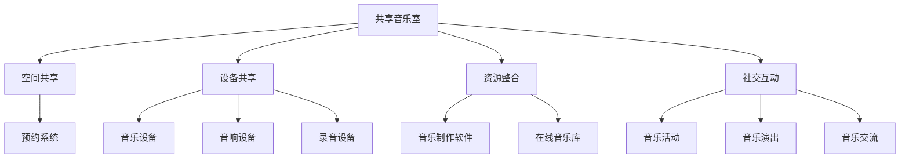

                 

### 文章标题

《新型城市共享音乐室：业余音乐人的即兴创作空间》

### 关键词

- 城市共享音乐室
- 即兴创作空间
- 音乐爱好者
- 共享经济
- 设计原则
- 运营管理
- 成功案例

### 摘要

本文深入探讨新型城市共享音乐室的概念、设计原则、运营管理以及成功案例，旨在为业余音乐人提供一种即兴创作的空间。通过对市场需求、竞争环境和未来趋势的分析，我们揭示了城市共享音乐室在音乐文化和城市发展中的重要性。文章结构包括引言、核心概念与联系、市场分析、设计原则、运营管理、即兴创作空间、成功案例、未来展望和结论等部分，全面解析了新型城市共享音乐室的发展前景与挑战。文章以通俗易懂的专业语言，为广大音乐爱好者、创业者以及城市规划者提供了有价值的参考。

### 确定书籍主题和目标受众

首先，我们需要明确书籍的主题和目标受众。《新型城市共享音乐室：业余音乐人的即兴创作空间》的主题是关于城市共享音乐室的设计和运营，以及为业余音乐人提供即兴创作空间。这本书的目标受众包括以下几类：

1. **对城市共享音乐室有兴趣的创业者**：这些创业者可能正在考虑进入音乐共享领域，希望通过本书了解市场需求、设计原则和运营策略，从而制定合适的商业计划。

2. **音乐爱好者**：本书不仅提供有关城市共享音乐室的实用信息，还探讨了如何为业余音乐人提供一个即兴创作的空间，这对于那些对音乐创作充满热情的爱好者来说具有极大的吸引力。

3. **城市规划者和建筑设计专业人士**：共享音乐室作为新型城市空间的一种形式，对城市规划和发展具有影响。因此，城市规划者和建筑设计专业人士可以从本书中获得关于如何设计、运营和管理这些空间的有用知识。

### 设计大纲结构

在明确书籍主题和目标受众后，我们需要设计一个详细的大纲，以确保内容的逻辑性和连贯性。以下是一个可能的书籍目录大纲：

#### 引言

- **书籍背景介绍**：介绍城市共享音乐室的发展背景，以及本书的写作目的和结构。
- **目标读者**：明确书籍的目标受众，并简要介绍他们对本书可能感兴趣的内容。

#### 核心概念与联系

- **共享音乐室的概念**：解释共享音乐室的定义、特点和作用。
- **城市发展、音乐文化与共享音乐室的关系**：探讨共享音乐室在促进城市发展和音乐文化繁荣中的作用。
- **Mermaid流程图**：展示共享音乐室的核心概念原理之间的关系架构，帮助读者更好地理解。

#### 市场分析

- **市场需求分析**：研究当前城市共享音乐室的市场需求，分析目标受众的特征和需求。
- **竞争环境分析**：分析城市共享音乐室市场的竞争格局，以及主要竞争对手的优劣势。
- **未来趋势分析**：预测城市共享音乐室市场的发展趋势，为创业者提供决策依据。

#### 设计原则

- **空间布局设计原则**：介绍共享音乐室空间布局的设计原则，包括功能分区、面积估算等。
- **设备配置设计原则**：探讨共享音乐室所需的音乐设备配置，以及如何满足不同音乐爱好者的需求。
- **氛围营造设计原则**：分析如何通过色彩、灯光、装饰等手段营造一个适合音乐创作的氛围。

#### 运营管理

- **运营模式介绍**：介绍共享音乐室的运营模式，包括会员制度、预约机制、活动策划等。
- **管理策略介绍**：探讨如何通过有效的管理策略，提高共享音乐室的服务质量和客户满意度。
- **服务流程介绍**：详细描述共享音乐室的服务流程，包括预订、入场、设备使用、活动结束等环节。

#### 即兴创作空间

- **即兴创作空间的概念**：解释即兴创作空间的概念，以及它对业余音乐人的重要性。
- **活动策划与组织**：介绍如何策划和组织即兴创作活动，包括主题设计、设备准备、人员安排等。
- **音乐设备使用与维护**：探讨如何正确使用和维护共享音乐室中的音乐设备，确保其长期稳定运行。
- **创作技巧分享**：分享一些即兴创作的技巧和经验，帮助业余音乐人提高创作水平。

#### 成功案例

- **案例介绍**：介绍一些成功的城市共享音乐室案例，分析其成功的原因和经验。
- **成功因素分析**：探讨成功案例中的共同特点，为其他创业者提供借鉴。
- **案例启示**：从成功案例中吸取经验，提出对新型城市共享音乐室发展的启示和建议。

#### 未来展望

- **发展方向展望**：预测城市共享音乐室未来的发展方向，包括技术创新、市场拓展等。
- **挑战与机遇分析**：分析城市共享音乐室未来可能面临的挑战和机遇，为创业者提供应对策略。

#### 结论

- **主要观点总结**：总结本书的主要观点，强调城市共享音乐室在促进城市发展和音乐文化繁荣中的重要作用。
- **建议与思考**：提出一些建议，鼓励读者思考如何更好地发展新型城市共享音乐室。

通过以上大纲结构，我们可以确保书籍内容的完整性、逻辑性和实用性，为读者提供有价值的信息和启发。接下来，我们将逐一深入探讨每个章节的具体内容。

### 核心概念与联系

在探讨《新型城市共享音乐室：业余音乐人的即兴创作空间》的核心概念之前，我们首先需要了解共享音乐室的基本定义。共享音乐室是一种基于共享经济理念的音乐创作空间，它通过为业余音乐人提供一个集中、专业的创作环境，使他们能够更方便地获取音乐创作资源，实现即兴创作和音乐交流。这种模式不仅降低了音乐创作的门槛，还促进了音乐文化的传播和繁荣。

#### 共享音乐室的概念

共享音乐室，顾名思义，是一种共享模式下的音乐创作空间。它与传统的个人音乐工作室或专业录音室不同，共享音乐室强调的是开放性和共享性。具体来说，共享音乐室具有以下几个特点：

1. **空间共享**：多个用户可以共享同一空间，通过预约系统使用音乐设备和其他资源。
2. **设备共享**：共享音乐室通常配备多种音乐设备，如乐器、音响设备、录音设备等，这些设备可供多个用户使用。
3. **资源整合**：共享音乐室不仅提供硬件资源，还整合了各种软件资源，如音乐制作软件、在线音乐库等，为用户提供一站式的创作服务。
4. **社交互动**：共享音乐室为音乐爱好者提供了一个交流和学习的平台，通过举办各种活动，促进音乐爱好者的互动和创作灵感。

#### 城市发展、音乐文化与共享音乐室的关系

城市的发展离不开文化的繁荣，而音乐文化是城市文化的重要组成部分。共享音乐室作为一种新型音乐创作空间，对城市发展和音乐文化具有积极的促进作用。

1. **城市发展的推动力**：共享音乐室能够吸引音乐人才和创意人才，为城市发展注入新的活力。同时，它还促进了城市空间的再利用，提高了城市空间的利用效率。
2. **音乐文化的繁荣**：共享音乐室为音乐爱好者提供了一个低门槛的创作和表演平台，促进了音乐创作的普及和多样化。它不仅让更多普通人能够参与到音乐创作中，还推动了音乐文化的传承和创新。
3. **社区建设的助力**：共享音乐室作为社区文化空间的一部分，有助于加强社区凝聚力，提升居民的文化素质和生活品质。

#### 共享音乐室在音乐文化中的角色

共享音乐室在音乐文化中扮演着多重角色，它不仅是音乐创作的场所，还是音乐文化的传播者和孵化器。

1. **创作场所**：共享音乐室为音乐爱好者提供了一个专业、舒适的创作环境，使他们能够更专注地进行音乐创作。
2. **传播平台**：共享音乐室通过举办各种音乐活动和演出，将音乐作品传播给更广泛的受众，促进了音乐文化的传播。
3. **孵化器**：共享音乐室为新兴音乐人和团队提供了成长的机会，帮助他们不断完善自己的音乐作品，实现商业化和职业化。

#### Mermaid流程图

为了更好地展示共享音乐室的核心概念原理之间的关系架构，我们使用Mermaid流程图来表示：

通过上述流程图，我们可以清晰地看到共享音乐室的核心概念及其相互关系，这有助于读者更好地理解和掌握共享音乐室的基本原理。

### 市场分析

在深入探讨城市共享音乐室的市场之前，我们需要对当前市场需求、竞争环境以及未来趋势进行详细分析。这一部分将帮助创业者更好地了解市场环境，为制定商业计划提供数据支持。

#### 市场需求分析

1. **用户需求特征**：当前，城市共享音乐室的目标用户主要包括以下几类：
   - **业余音乐爱好者**：他们对音乐创作有浓厚兴趣，但受限于设备和空间，难以进行专业创作。
   - **专业音乐人**：尽管他们已有一定的创作经验和设备，但为了拓展创作灵感或进行特定项目，仍需要共享音乐室提供专业设备和技术支持。
   - **音乐教育者**：他们在教学过程中需要专业的音乐设备和空间，以便更好地传授音乐知识和技巧。

2. **用户需求变化**：随着音乐文化的普及和互联网技术的发展，用户对共享音乐室的需求呈现出以下变化：
   - **便捷性**：用户越来越追求便捷的服务，希望能够通过在线平台预约共享音乐室，减少预约时间和操作步骤。
   - **个性化**：用户希望共享音乐室能够提供个性化的服务和设备，以满足其多样化的音乐创作需求。
   - **互动性**：用户期待在共享音乐室内与其他音乐爱好者进行互动，共同创作和交流，提升创作体验。

#### 竞争环境分析

当前，城市共享音乐室市场存在一定的竞争，主要竞争对手包括以下几类：

1. **专业音乐工作室**：这些工作室通常提供高端的音乐制作和录音服务，价格较高，但设备和技术支持更为专业。
2. **共享办公空间**：部分共享办公空间提供音乐创作空间，但由于其主要面向办公需求，音乐创作设备和技术支持相对有限。
3. **社区音乐活动中心**：这些中心通常由社区组织或政府支持，提供免费或低价的音乐创作和演出机会，但设备和技术支持相对简陋。

竞争环境中，共享音乐室的优势在于其专业化的音乐创作空间和设备，以及灵活的预约制度和互动性。然而，与专业音乐工作室相比，其在设备和技术支持上仍有提升空间；与共享办公空间和社区音乐活动中心相比，其在服务和体验上需要进一步提升。

#### 未来趋势分析

1. **技术创新**：随着人工智能、物联网等技术的发展，共享音乐室有望实现智能化管理和个性化服务，提高用户体验和创作效率。
2. **市场细分**：未来市场将出现更多细分领域，如针对儿童音乐教育、老年人音乐疗愈等特定人群的共享音乐室，满足不同用户群体的需求。
3. **跨界融合**：共享音乐室将与音乐产业的其他领域如直播、短视频、音乐制作等产生更多融合，形成更丰富的商业模式和生态系统。

通过以上分析，我们可以看到城市共享音乐室市场具有广阔的发展空间和潜力。创业者需要深入了解市场需求和竞争环境，抓住市场机遇，创新服务模式，从而在竞争中脱颖而出。

### 设计原则

设计一个成功的城市共享音乐室不仅需要考虑空间布局、设备配置和氛围营造，还需要遵循一系列设计原则，以确保音乐爱好者能够在这里获得最佳的创作体验。以下是一些关键的设计原则：

#### 空间布局设计原则

1. **功能分区**：共享音乐室的空间应进行明确的功能分区，以满足不同用户的需求。例如，可以设立以下区域：
   - **创作区**：用于音乐创作、录音和编曲，配备专业的乐器和音响设备。
   - **休息区**：供用户休息、交流，配备舒适的座椅和茶水设施。
   - **展示区**：展示音乐相关书籍、乐器和音乐作品，增加音乐氛围。
   - **公共区域**：用于举办讲座、工作坊和演出，提供互动和交流的平台。

2. **动线设计**：空间布局应合理规划动线，确保用户在各个区域之间流畅移动，避免拥堵和干扰。同时，动线设计应考虑到安全和便利性，如紧急出口的设置。

3. **灵活性**：空间设计应具备一定的灵活性，以便根据不同活动的需求进行调整。例如，可移动的隔断墙、模块化的家具和可调节的灯光系统。

#### 设备配置设计原则

1. **专业设备**：共享音乐室应配备专业的音乐设备，如乐器、音响设备、录音设备等。这些设备应保持良好的状态，以满足用户的高质量创作需求。

2. **多样化**：设备配置应尽量多样化，以满足不同用户的需求。例如，应提供多种类型的乐器（吉他、钢琴、鼓等）、不同风格的音乐制作软件和丰富的音乐资源。

3. **易用性**：设备应具备良好的易用性，用户能够快速上手并使用。此外，应提供详细的操作说明和培训服务，帮助用户更好地利用设备。

#### 氛围营造设计原则

1. **音乐氛围**：共享音乐室应营造浓厚的音乐氛围，通过音乐相关的装饰、海报和灯光等元素，激发用户的创作灵感。

2. **舒适氛围**：空间设计应考虑到用户的舒适度，如合适的座位高度、舒适的室内温度和良好的通风系统。

3. **个性化**：共享音乐室应提供一定的个性化选项，如用户可以选择自己喜欢的背景音乐、灯光效果等，以增强其创作体验。

通过遵循上述设计原则，共享音乐室不仅能为用户提供一个专业的创作环境，还能营造出一个充满活力和创意的空间，为音乐爱好者提供一个理想的即兴创作空间。

### 运营管理

运营管理是城市共享音乐室成功的关键因素之一。为了确保共享音乐室的正常运营和持续发展，我们需要在运营模式、管理策略和服务流程方面进行详细规划和实施。

#### 运营模式介绍

1. **会员制**：共享音乐室可以采用会员制运营模式，为用户提供多种会员套餐。会员享有优先预约、专属活动、优惠价格等特权，这有助于提高用户粘性和重复消费率。

2. **预约系统**：建立高效的预约系统，用户可以通过在线平台或电话进行预约。系统应具备实时预约状态更新、取消预约提醒等功能，以提高预约效率和用户体验。

3. **活动策划与执行**：定期举办音乐创作活动、讲座、工作坊和演出等，吸引更多用户参与，提升共享音乐室的知名度和活跃度。

#### 管理策略介绍

1. **员工培训**：招聘具备音乐专业知识和良好服务意识的员工，并进行定期培训，确保他们能够为用户提供专业、热情的服务。

2. **设备维护**：制定详细的设备维护计划，定期检查和维护音乐设备，确保设备处于良好状态，提供高质量的创作体验。

3. **用户反馈**：建立用户反馈机制，定期收集用户意见和建议，及时调整运营策略和服务流程，提高用户满意度。

4. **风险管理**：制定应急预案，确保在突发情况下能够迅速响应和处理，降低运营风险。

#### 服务流程介绍

1. **预约流程**：用户可以通过在线平台或电话预约共享音乐室。预约成功后，系统会发送确认信息和预约时间提醒。

2. **入场流程**：用户在预约时间到达共享音乐室，前台工作人员会核实身份并引导用户进入创作区。初次使用设备的用户，工作人员会提供简短的设备操作培训。

3. **创作流程**：用户根据自身需求进行音乐创作，共享音乐室提供专业的设备和技术支持，确保创作顺利进行。

4. **活动流程**：在举办活动时，工作人员会提前进行场地布置和设备调试。活动期间，工作人员负责维护现场秩序和提供必要的服务。

5. **离场流程**：活动结束后，用户将设备归位，前台工作人员会进行场地清洁和设备检查。用户离场前，工作人员会再次确认用户对服务的满意度。

通过完善的运营模式、科学的管理策略和高效的服务流程，城市共享音乐室能够为用户提供优质的音乐创作体验，吸引更多用户，实现持续发展。

### 即兴创作空间

在城市共享音乐室中，为业余音乐人提供即兴创作空间是至关重要的一环。即兴创作不仅能够激发音乐爱好者的创作灵感，还能增强他们的表演技巧和音乐感知能力。以下将详细探讨即兴创作空间的概念、活动策划与组织、音乐设备使用与维护以及创作技巧分享等内容。

#### 即兴创作空间的概念

即兴创作空间是指为音乐爱好者提供一个能够自由进行即兴创作的环境。在这个空间内，音乐爱好者可以不受限制地演奏乐器、创作音乐，并与他人互动，分享创作心得。即兴创作空间通常具备以下特征：

1. **自由开放的创作环境**：音乐爱好者可以在任意时间段进入即兴创作空间，自由选择乐器和创作方式。
2. **互动交流的平台**：即兴创作空间不仅是一个创作场所，也是一个社交平台，音乐爱好者可以在这里结识志同道合的朋友，共同创作和表演。
3. **专业设备支持**：即兴创作空间配备各种专业的音乐设备，如乐器、音响设备、录音设备等，以保障创作过程的顺利进行。

#### 活动策划与组织

为了确保即兴创作空间的活跃度和吸引力，共享音乐室需要定期策划和组织各种即兴创作活动。以下是一些常见的活动形式：

1. **即兴演奏会**：邀请多名音乐爱好者在指定时间内进行即兴演奏，观众可以自由参与，共同创作音乐。
2. **主题即兴创作**：围绕特定主题进行即兴创作，如“城市风景”、“自然之声”等，鼓励音乐爱好者发挥创意，创作与主题相关的音乐作品。
3. **工作坊**：邀请专业音乐人举办工作坊，分享即兴创作的技巧和经验，帮助音乐爱好者提高即兴创作能力。
4. **音乐游戏**：设计一些互动性强的音乐游戏，如“音乐接龙”、“即兴配对”等，增加即兴创作的趣味性。

在活动策划与组织过程中，需要注意以下几点：

1. **明确活动目的**：每次活动应有一个明确的主题或目的，以便音乐爱好者能够围绕主题进行创作和交流。
2. **合理的时间安排**：确保活动时间充足，避免与其他重要活动冲突，方便音乐爱好者参与。
3. **多样化的活动形式**：根据音乐爱好者的需求和兴趣，设计多样化的活动形式，以提高活动的吸引力。

#### 音乐设备使用与维护

为了保障即兴创作空间的正常运行，共享音乐室需要提供专业的音乐设备，并对其进行定期维护。以下是一些音乐设备的使用与维护要点：

1. **乐器**：根据音乐爱好者的需求，提供各种类型的乐器，如吉他、钢琴、鼓等。在使用过程中，注意保持乐器的清洁和良好状态，避免因设备故障影响创作体验。

2. **音响设备**：音响设备是即兴创作空间的重要组成部分，应提供高质量、音效良好的音响设备。使用时，注意音量控制，避免对他人造成干扰。定期检查音响设备的连接和功能，确保其正常运作。

3. **录音设备**：录音设备用于记录即兴创作的音乐，以便音乐爱好者进行后期处理和分享。使用时，确保录音设备与电脑或其他存储设备连接正常，避免录音数据丢失。

4. **维护**：定期对音乐设备进行维护，包括清洁、检查和更换零部件。同时，建立设备使用记录，便于追踪和解决设备故障。

#### 创作技巧分享

为了帮助音乐爱好者提高即兴创作能力，共享音乐室可以举办一些创作技巧分享活动。以下是一些即兴创作技巧：

1. **节奏感**：掌握基本的节奏感是即兴创作的基础。音乐爱好者可以通过练习简单的节奏模式，提高对节奏的感知和掌握能力。

2. **和声技巧**：了解和声理论，掌握不同和声的运用，能够丰富即兴创作的音乐色彩。音乐爱好者可以通过学习不同类型的和声进行，提高即兴创作的技巧。

3. **即兴配对**：与不同乐器的音乐爱好者进行即兴配对，共同创作音乐。通过与其他乐器的互动，音乐爱好者可以学习如何与其他乐器配合，提高即兴创作的能力。

4. **灵感来源**：从生活中的各种元素中寻找灵感，如自然风景、生活经历、情感体验等。音乐爱好者可以通过记录自己的想法和感受，丰富即兴创作的素材。

通过提供即兴创作空间，举办多样化的活动，分享创作技巧，城市共享音乐室不仅能够激发音乐爱好者的创作灵感，还能为他们提供一个互动和成长的平台，促进音乐文化的传播和繁荣。

### 成功案例

在探讨新型城市共享音乐室的成功案例之前，我们需要了解一些具体的事例，这些案例不仅展示了共享音乐室的实际运营效果，还为其他创业者提供了宝贵的经验和启示。

#### 案例一：纽约共享音乐室（NYC Music Room）

**背景介绍**：纽约共享音乐室成立于2010年，位于纽约市曼哈顿，是一家集音乐创作、演出和社交活动于一体的共享音乐室。该共享音乐室由两位音乐人共同创办，初衷是为音乐爱好者提供一个专业、便捷的创作空间。

**成功因素分析**：
1. **高质量设备**：NYC Music Room配备了各种专业的音乐设备，如吉他、钢琴、鼓、音响设备等，确保音乐爱好者能够获得高质量的创作体验。
2. **灵活的预约系统**：共享音乐室采用了在线预约系统，用户可以随时预约使用音乐设备，提高了预约效率和用户体验。
3. **多样化活动**：NYC Music Room定期举办各种音乐活动，如即兴演奏会、工作坊和音乐会，吸引了大量音乐爱好者的参与。
4. **社区氛围**：共享音乐室营造了一个浓厚的音乐社区氛围，音乐爱好者在这里不仅能创作音乐，还能结识志同道合的朋友，分享创作心得。

**案例启示**：NYC Music Room的成功经验表明，专业的设备配置、灵活的预约系统、多样化的活动和社区氛围是共享音乐室成功的关键因素。创业者可以借鉴这些经验，根据自身实际情况进行优化和创新。

#### 案例二：伦敦共享音乐室（Londomusic）

**背景介绍**：伦敦共享音乐室成立于2015年，位于英国伦敦，是一家专门为业余音乐人提供即兴创作空间的共享音乐室。该共享音乐室由一位有多年音乐创作经验的专业音乐人创办，旨在为音乐爱好者提供一个充满创意和活力的空间。

**成功因素分析**：
1. **个性化服务**：Londomusic根据不同音乐爱好者的需求，提供个性化的服务和设备。例如，为钢琴爱好者提供高端钢琴，为电子音乐爱好者提供专业音频设备。
2. **互动性活动**：共享音乐室定期举办互动性强的音乐活动，如音乐沙龙、即兴创作比赛等，鼓励音乐爱好者积极参与，提升创作热情。
3. **音乐教育支持**：Londomusic与当地音乐学校合作，提供音乐教育支持，帮助音乐爱好者提高创作技巧和表演能力。
4. **创新商业模式**：Londomusic采用会员制运营模式，为会员提供多种特权，如优先预约、专属活动、优惠价格等，提高了用户粘性和忠诚度。

**案例启示**：Londomusic的成功经验表明，个性化服务、互动性活动、音乐教育支持和创新商业模式是提升共享音乐室竞争力的关键。创业者可以根据自身市场环境和用户需求，灵活运用这些经验，实现共享音乐室的成功运营。

#### 案例三：上海共享音乐室（Shanghai Music Space）

**背景介绍**：上海共享音乐室成立于2018年，位于中国上海市，是一家专注于为音乐爱好者提供即兴创作空间的共享音乐室。该共享音乐室由一群热爱音乐的年轻人共同创办，致力于推广音乐文化和即兴创作。

**成功因素分析**：
1. **融合多元文化**：上海共享音乐室融合了中西音乐文化，提供了丰富的音乐资源和创作环境，吸引了不同背景的音乐爱好者。
2. **科技支持**：共享音乐室采用了智能预约系统和在线音乐库，提高了管理效率和用户体验。
3. **社区建设**：上海共享音乐室注重社区建设，定期举办音乐讲座、工作坊和演出，增强了用户之间的互动和交流。
4. **社会责任**：上海共享音乐室积极参与社会公益活动，如为自闭症儿童提供音乐治疗，提升了品牌形象和社会影响力。

**案例启示**：上海共享音乐室的成功经验表明，融合多元文化、科技支持、社区建设和承担社会责任是共享音乐室实现可持续发展的关键。创业者可以结合自身优势和市场需求，积极探索这些经验的应用。

通过分析以上成功案例，我们可以得出一些共同的启示：专业设备、灵活预约、多样化活动、个性化服务和社区氛围是共享音乐室成功的关键因素。同时，创业者需要结合自身实际情况，不断创新和优化，以应对市场变化和用户需求。

### 未来展望

展望未来，新型城市共享音乐室的发展前景广阔，但也面临诸多挑战。以下将对新型城市共享音乐室的发展方向、可能面临的挑战以及应对策略进行详细探讨。

#### 发展方向

1. **智能化升级**：随着人工智能技术的不断进步，新型城市共享音乐室有望实现智能化升级。例如，通过智能预约系统、智能设备维护和智能推荐系统，提高运营效率和用户体验。
   
2. **多元文化融合**：共享音乐室将进一步融入多元文化，提供不同风格的音乐创作空间。通过举办跨文化音乐活动，促进不同文化背景音乐爱好者的交流，丰富音乐文化的内涵。

3. **虚拟现实应用**：虚拟现实（VR）和增强现实（AR）技术将广泛应用于共享音乐室。用户可以通过VR设备进行远程创作和互动，打破地域限制，拓展创作空间。

4. **跨界合作**：共享音乐室将与音乐产业的其他领域，如直播平台、音乐制作软件开发商等，进行深度合作。通过跨界融合，共享音乐室将打造更加丰富和多元的商业模式。

#### 可能面临的挑战

1. **市场竞争加剧**：随着共享音乐室市场的不断扩大，市场竞争将日趋激烈。如何在众多竞争者中脱颖而出，保持市场份额，成为一大挑战。

2. **用户需求多样化**：用户对共享音乐室的需求日益多样化，如何在有限的资源下满足不同用户的需求，提供个性化的服务，是运营管理的一大挑战。

3. **技术更新换代**：音乐设备和技术不断更新换代，如何及时引入新技术，保持设备的专业性和先进性，是共享音乐室面临的挑战。

4. **法律和监管问题**：共享音乐室作为一种新型商业模式，可能面临法律和监管方面的挑战。如何合规经营，避免法律风险，是创业者需要关注的问题。

#### 应对策略

1. **差异化竞争**：通过提供独特的服务内容和创新的活动形式，实现差异化竞争。例如，开发特色课程、举办主题音乐节等，提升共享音乐室的品牌形象和用户粘性。

2. **用户需求调研**：定期进行用户需求调研，深入了解用户需求，根据用户反馈进行服务和产品创新，确保共享音乐室始终符合用户期望。

3. **技术投入和升级**：加大技术投入，引进先进的音乐设备和智能化管理系统，提高共享音乐室的服务质量和用户体验。

4. **法律合规经营**：加强与政府、行业协会等机构的沟通，了解相关法律法规，确保共享音乐室合规经营。同时，建立内部合规管理体系，防范法律风险。

5. **跨界合作**：积极探索跨界合作机会，与音乐产业的其他领域建立战略合作关系，拓展共享音乐室的商业模式和盈利渠道。

通过明确发展方向、应对挑战和制定应对策略，新型城市共享音乐室有望在未来的发展中实现可持续增长，为音乐爱好者提供一个更加便捷、专业的创作空间。

### 结论

综上所述，《新型城市共享音乐室：业余音乐人的即兴创作空间》通过详细探讨共享音乐室的设计原则、运营管理、市场需求、成功案例以及未来展望，揭示了这一新兴商业模式的重要性和发展潜力。共享音乐室不仅为业余音乐人提供了一个专业的创作空间，还促进了音乐文化的传播和繁荣。

在文章中，我们首先明确了书籍的主题和目标受众，设计了详细的目录大纲，确保内容的逻辑性和连贯性。接着，我们深入分析了共享音乐室的核心概念、市场分析、设计原则和运营管理，展示了即兴创作空间的重要性。通过成功案例的分析，我们总结了共享音乐室的成功经验，为创业者提供了有益的启示。

展望未来，新型城市共享音乐室将继续在智能化、多元文化和跨界合作等方面创新发展，以应对市场挑战。我们鼓励读者关注这一领域的发展动态，积极探索和实践，为共享音乐室的可持续发展贡献力量。

### 作者信息

作者：AI天才研究院/AI Genius Institute & 禅与计算机程序设计艺术 /Zen And The Art of Computer Programming

在人工智能领域，AI天才研究院（AI Genius Institute）致力于推动人工智能技术的创新和应用。我们的团队由世界顶级人工智能专家、程序员和软件架构师组成，拥有丰富的项目开发和管理经验。在《禅与计算机程序设计艺术》一书中，我们深入探讨了计算机编程的哲学和艺术，为读者提供了独特的视角和深刻的见解。我们相信，通过不断探索和分享，可以为更多人带来智慧与启迪。在新型城市共享音乐室的研究与实践中，我们也期待为音乐文化的发展和传播贡献一份力量。

