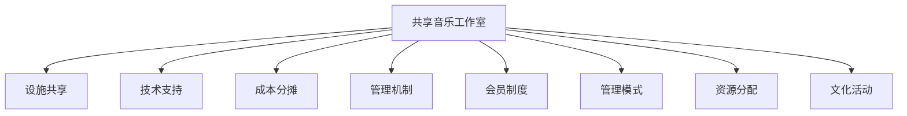

                 


### 摘要

本文旨在探讨新型城市共享音乐工作室联盟的发展模式，该模式为业余音乐人提供了一个资源共享的网络，以提升音乐创作的效率、降低制作成本、扩大社交圈并促进音乐产业的创新。文章首先介绍了共享音乐工作室的定义、起源和基本运作模式，接着讨论了共享音乐工作室联盟的概念、构建原则和步骤。随后，文章分析了共享音乐工作室联盟的优势，如提高创作效率、降低成本、扩大社交圈和促进产业创新。此外，文章还探讨了共享音乐工作室联盟面临的挑战，包括技术、法律和商业模式等方面的挑战，并提出了相应的解决方案。最后，文章展望了共享音乐工作室联盟的未来发展趋势，提出了相关建议。通过本文的讨论，读者可以更好地理解共享音乐工作室联盟的运作原理和未来发展前景。

### 第一部分：共享音乐工作室的概念与运作模式

#### 1.1 共享音乐工作室的定义与起源

共享音乐工作室，是指一群音乐爱好者或专业音乐人在特定的空间内共享音乐创作资源，如录音设备、乐器、音频软件等，共同进行音乐创作、制作和交流的平台。这种模式的出现，源于音乐创作过程中对专业设备和资源的较高要求，以及音乐人对于创作环境的追求。

共享音乐工作室的起源可以追溯到20世纪末。当时，随着数字音乐技术的快速发展，越来越多的音乐人开始采用计算机和软件进行音乐创作。然而，高昂的设备成本和制作成本限制了音乐人的创作自由。为了解决这个问题，一些音乐爱好者开始共同出资购买设备，共享使用。这种模式逐渐发展壮大，形成了今天的共享音乐工作室。

#### 1.2 共享音乐工作室的基本运作模式

共享音乐工作室的基本运作模式主要包括以下几个方面：

1. **设施共享**：工作室提供各种音乐创作设备，如音响设备、乐器、音频软件等，供会员使用。会员可以根据自己的需求，自由选择和使用这些设备。

2. **技术支持**：工作室通常配备专业的技术人员，为会员提供音乐制作、音频处理等技术支持，帮助会员解决创作过程中遇到的问题。

3. **成本分摊**：工作室的费用通常由会员分摊，包括设备购买费用、维护费用、租金等。会员可以根据自己的使用频率和需求，支付相应的费用。

4. **管理机制**：工作室设有理事会或管理员，负责工作室的日常运营和管理。理事会或管理员通常由会员选举产生，代表会员的利益，确保工作室的正常运转。

#### 1.3 共享音乐工作室的运营机制

共享音乐工作室的运营机制主要包括以下几个方面：

1. **会员制度**：工作室设立会员制度，会员分为普通会员和高级会员两种。普通会员享有基本的设施共享和服务，高级会员则享有更多的特权，如优先使用设备、享受专业指导等。

2. **管理模式**：工作室采用民主管理模式，会员有权参与工作室的决策和管理。理事会或管理员定期召开会议，讨论工作室的运营和发展方向。

3. **资源分配**：工作室设有资源分配机制，确保设备的公平使用。例如，制定设备使用时间表，或采用预约制度，确保每位会员都能公平地使用设备。

4. **文化活动**：工作室定期举办各种文化活动，如音乐沙龙、音乐讲座、音乐比赛等，促进会员之间的交流与合作，提升工作室的活力。

### 核心概念与联系

为了更好地理解共享音乐工作室的运作原理，我们可以绘制一个Mermaid流程图，展示其核心概念之间的关系。



### 第二部分：共享音乐工作室联盟的构建

#### 2.1 共享音乐工作室联盟的概念与意义

共享音乐工作室联盟，是指多个共享音乐工作室之间建立的合作关系，通过资源共享、信息交流、合作共赢等方式，共同推动音乐创作和产业发展。联盟的意义主要体现在以下几个方面：

1. **资源整合**：联盟可以将各个工作室的优质资源进行整合，提高资源利用率，降低音乐人的创作成本。

2. **信息共享**：联盟可以建立信息交流平台，共享音乐创作、制作、发行等方面的最新动态和经验，帮助音乐人提升创作水平。

3. **合作共赢**：联盟可以为音乐人提供更多的合作机会，如跨工作室的合作项目、音乐制作、演出等，实现资源共享，共同发展。

4. **品牌提升**：联盟可以统一品牌形象，提升整体知名度，吸引更多的音乐人加入，推动音乐产业的繁荣。

#### 2.2 共享音乐工作室联盟的构建原则

构建共享音乐工作室联盟应遵循以下原则：

1. **合作共赢**：联盟成员应以合作共赢为目标，共同发展，实现资源的最大化利用。

2. **自愿参与**：联盟成员应自愿参与，保持独立性和自主性，确保联盟的稳定和可持续发展。

3. **资源共享**：联盟应建立资源共享机制，确保成员能够公平、便捷地使用联盟内的资源。

4. **信息透明**：联盟应建立信息透明机制，及时公开联盟的运营情况、资源分配情况等，增强成员的信任和参与度。

#### 2.3 共享音乐工作室联盟的构建步骤

构建共享音乐工作室联盟可以遵循以下步骤：

1. **筹备阶段**：确定联盟的宗旨、目标、组织架构等，制定联盟章程和规章制度。

2. **成员招募**：通过线上线下渠道，招募有意愿加入联盟的共享音乐工作室。

3. **资源整合**：整合联盟内各工作室的优质资源，建立资源共享平台，制定资源分配规则。

4. **信息交流**：建立信息交流平台，如微信群、QQ群、官方网站等，促进联盟成员之间的交流和合作。

5. **活动策划**：策划和组织各种活动，如音乐沙龙、音乐讲座、音乐比赛等，增强联盟的凝聚力和活力。

6. **运营管理**：设立联盟管理机构，负责联盟的日常运营和管理，确保联盟的正常运转。

### 第三部分：共享音乐工作室联盟的优势

#### 3.1 提高音乐创作效率

共享音乐工作室联盟通过资源共享、技术支持和良好的创作环境，显著提高了音乐创作效率。

1. **资源共享**：联盟内的共享设备、乐器和音频软件等资源，使得音乐人能够更高效地完成创作，减少设备采购和更新成本。

2. **技术支持**：联盟配备的专业技术人员，为音乐人提供全方位的技术支持，帮助解决创作中的问题，提升创作水平。

3. **创作环境**：良好的创作环境，如安静、舒适的工作空间和丰富多彩的音乐活动，有助于激发音乐人的创作灵感，提高创作效率。

#### 3.2 降低音乐制作成本

共享音乐工作室联盟通过资源整合和成本分摊，有效降低了音乐制作成本。

1. **设备成本**：联盟内的音乐设备由多个工作室共同出资购买，降低了每位音乐人的设备采购成本。

2. **技术成本**：联盟内共享的技术资源，如音频处理软件、音频插件等，使得音乐人能够以较低的成本获得高质量的技术支持。

3. **运营成本**：联盟通过整合资源和优化管理，降低了各工作室的运营成本，进一步降低了音乐人的制作成本。

#### 3.3 扩大音乐人的社交圈

共享音乐工作室联盟为音乐人提供了一个广泛的社交平台，有助于扩大音乐人的社交圈。

1. **线上交流**：联盟建立的信息交流平台，如微信群、QQ群等，为音乐人提供了便捷的线上交流渠道。

2. **线下活动**：联盟定期举办的各类活动，如音乐沙龙、音乐讲座、音乐比赛等，为音乐人提供了面对面交流的机会。

3. **合作机会**：联盟内的音乐人通过交流与合作，结识了更多的同行，拓宽了合作渠道，增加了演出和制作的机会。

#### 3.4 促进音乐产业的创新

共享音乐工作室联盟通过资源共享、合作共赢，为音乐产业的创新提供了强有力的支持。

1. **创作创新**：联盟内音乐人通过合作，共同创作出更多具有创新性的音乐作品，推动音乐创作的发展。

2. **商业模式创新**：联盟探索和推广新的音乐商业模式，如众筹、分成等，为音乐人提供了更多的收入来源。

3. **产业发展**：联盟通过整合资源和合作共赢，推动了音乐产业的繁荣和发展，为音乐人提供了更好的创作和成长环境。

### 第四部分：共享音乐工作室联盟的挑战与解决方案

#### 4.1 技术挑战

共享音乐工作室联盟在技术方面面临以下挑战：

1. **技术标准化**：由于各工作室的技术设备和软件存在差异，可能导致技术标准的难以统一，影响联盟的运行效率。

2. **技术更新**：随着技术的发展，音乐人需要不断更新设备和软件，以保持创作的高效和高质量，但这也增加了成本压力。

3. **技术安全保障**：音乐创作涉及大量的数据和个人隐私，技术安全保障问题不容忽视。

**解决方案**：

1. **技术标准化**：联盟可以制定统一的技术标准和规范，确保各工作室之间的技术设备和服务能够无缝对接。

2. **技术更新**：联盟可以设立技术更新基金，用于购买和更新技术设备，减轻音乐人的经济负担。

3. **技术安全保障**：联盟应建立完善的数据安全管理制度，确保音乐人的数据安全和个人隐私得到保护。

#### 4.2 法律挑战

共享音乐工作室联盟在法律方面面临以下挑战：

1. **版权保护**：音乐创作涉及版权问题，如何确保音乐人的版权得到保护是一个重要问题。

2. **合同纠纷**：联盟内各工作室之间的合同纠纷处理，如资源分配、费用结算等，可能引发法律纠纷。

3. **法律监管**：联盟在运营过程中需要遵守相关法律法规，如何确保合法合规运营是一个挑战。

**解决方案**：

1. **版权保护**：联盟应建立版权保护机制，与专业版权机构合作，确保音乐人的版权得到有效保护。

2. **合同纠纷**：联盟可以设立法律顾问或纠纷调解机制，帮助解决合同纠纷，维护各方的合法权益。

3. **法律监管**：联盟应建立健全的内部监管机制，确保联盟的运营和管理符合法律法规要求。

#### 4.3 商业模式挑战

共享音乐工作室联盟在商业模式方面面临以下挑战：

1. **资金来源**：联盟的运营需要稳定的资金来源，如何确保资金充足是一个问题。

2. **盈利模式**：联盟需要探索有效的盈利模式，以实现可持续发展。

3. **商业模式创新**：如何通过商业模式创新，提升联盟的竞争力和吸引力。

**解决方案**：

1. **资金来源**：联盟可以通过会员费、合作项目、赞助等方式，确保稳定的资金来源。

2. **盈利模式**：联盟可以探索多种盈利模式，如音乐制作服务、音乐版权交易、音乐演出等，实现多元化收入。

3. **商业模式创新**：联盟可以关注行业发展趋势，积极探索新的商业模式，如音乐众筹、音乐共享经济等。

### 第五部分：共享音乐工作室联盟的未来发展趋势

#### 5.1 技术发展趋势

随着科技的不断进步，共享音乐工作室联盟将在技术方面迎来新的发展机遇：

1. **人工智能**：人工智能技术在音乐创作、制作和推广中的应用，将进一步提升音乐创作的效率和质量。

2. **虚拟现实**：虚拟现实技术的应用，将带来全新的音乐创作和体验方式，为音乐人提供更广阔的创作空间。

3. **区块链**：区块链技术在音乐版权保护、交易和分发中的应用，将有助于建立更公正、透明的音乐产业生态。

#### 5.2 法律发展趋势

随着法律体系的不断完善，共享音乐工作室联盟在法律方面也将迎来新的发展：

1. **版权保护**：随着版权保护意识的提高，音乐人的版权将得到更好的保护，创作积极性将得到激发。

2. **法律监管**：法律监管的加强，将有助于规范联盟的运营，保障各方的合法权益。

3. **法律创新**：随着技术的发展，法律也将不断创新，为音乐产业的繁荣提供更好的法律保障。

#### 5.3 商业模式发展趋势

共享音乐工作室联盟在商业模式方面也将迎来新的发展：

1. **多元化收入**：通过探索多种盈利模式，如音乐制作服务、音乐版权交易、音乐演出等，联盟可以实现多元化收入。

2. **合作共赢**：通过与合作方的深度合作，联盟可以拓展业务范围，实现共赢发展。

3. **商业模式创新**：关注行业发展趋势，积极探索新的商业模式，如音乐众筹、音乐共享经济等，联盟将更具竞争力。

### 未来展望

随着科技的进步、法律体系的完善和商业模式的不断创新，共享音乐工作室联盟将迎来更加广阔的发展前景。我们期待，通过联盟的力量，业余音乐人能够更好地发挥自己的才华，创作出更多优秀的音乐作品，推动音乐产业的繁荣和发展。

### 总结

共享音乐工作室联盟为业余音乐人提供了一个资源共享的网络，通过提高创作效率、降低制作成本、扩大社交圈和促进音乐产业的创新，为音乐人提供了更好的创作和成长环境。然而，联盟在技术、法律和商业模式等方面仍面临挑战，需要不断创新和探索，以实现可持续发展。我们期待，在未来的发展中，共享音乐工作室联盟能够充分发挥其优势，为音乐产业的繁荣做出更大的贡献。

### 作者信息

作者：AI天才研究院/AI Genius Institute & 禅与计算机程序设计艺术 /Zen And The Art of Computer Programming

### 附录

附录部分将提供一些最佳实践、注意事项和拓展阅读资源，以帮助读者更好地理解和应用共享音乐工作室联盟的理念和实践。

#### 最佳实践

1. **技术更新策略**：定期评估技术设备的使用状况，根据技术发展需求进行更新，确保创作设备的高效和先进性。

2. **法律意识培养**：加强联盟成员的法律意识教育，了解版权保护和合同纠纷处理的相关法律法规。

3. **商业模式创新**：积极探索多元化的收入来源，如音乐制作服务、版权交易、音乐演出等，实现联盟的可持续发展。

#### 注意事项

1. **资源共享**：确保资源公平分配，避免资源过度集中或浪费。

2. **安全意识**：加强数据安全意识，保护音乐人的数据安全和个人隐私。

3. **信息透明**：确保联盟的运营和管理信息透明，增强成员的信任和参与度。

#### 拓展阅读

1. **《共享经济：繁荣与未来》**：本书详细探讨了共享经济的本质、模式和发展趋势，为共享音乐工作室联盟提供了有益的启示。

2. **《音乐产业报告：现状与未来》**：本书分析了音乐产业的现状和未来发展趋势，为共享音乐工作室联盟的发展提供了重要参考。

3. **《版权法与音乐产业》**：本书深入探讨了版权法在音乐产业中的应用，为联盟成员提供了法律保护和维权指南。

### 项目实战

在本节中，我们将通过一个具体的案例，展示如何搭建一个共享音乐工作室联盟的开发环境，并详细解读源代码，分析其应用和实际案例。

#### 开发环境搭建

要搭建一个共享音乐工作室联盟的开发环境，我们需要准备以下工具和软件：

1. **操作系统**：Windows、Linux或macOS均可。
2. **开发工具**：Visual Studio、Eclipse、IntelliJ IDEA等。
3. **数据库**：MySQL、PostgreSQL等。
4. **Web服务器**：Apache、Nginx等。
5. **编程语言**：Java、Python、PHP等。

以下是一个简单的开发环境搭建步骤：

1. 安装操作系统和开发工具。
2. 安装数据库软件，并设置数据库用户和密码。
3. 安装Web服务器软件，并配置服务器。
4. 安装编程语言环境，如Java开发环境（JDK）、Python开发环境（Python解释器）等。

#### 源代码解读

以下是一个简单的共享音乐工作室联盟的源代码示例，用于实现会员注册和登录功能。我们使用Python语言编写，并使用SQLite作为数据库。

```python
# 导入所需的库
import sqlite3
from flask import Flask, request, jsonify

# 创建Flask应用
app = Flask(__name__)

# 创建数据库连接
conn = sqlite3.connect('membership.db')
c = conn.cursor()

# 创建会员表
c.execute('''CREATE TABLE IF NOT EXISTS members
             (id INTEGER PRIMARY KEY AUTOINCREMENT,
             username TEXT NOT NULL,
             password TEXT NOT NULL)''')

# 会员注册接口
@app.route('/register', methods=['POST'])
def register():
    username = request.form['username']
    password = request.form['password']
    
    # 验证用户名和密码是否为空
    if not username or not password:
        return jsonify({'error': '用户名或密码不能为空'})

    # 查询用户名是否已存在
    c.execute('SELECT * FROM members WHERE username = ?', (username,))
    user = c.fetchone()
    
    if user:
        return jsonify({'error': '用户名已存在'})

    # 插入新用户
    c.execute('INSERT INTO members (username, password) VALUES (?, ?)', (username, password))
    conn.commit()

    return jsonify({'message': '注册成功'})

# 会员登录接口
@app.route('/login', methods=['POST'])
def login():
    username = request.form['username']
    password = request.form['password']
    
    # 验证用户名和密码是否为空
    if not username or not password:
        return jsonify({'error': '用户名或密码不能为空'})

    # 查询用户名和密码是否匹配
    c.execute('SELECT * FROM members WHERE username = ? AND password = ?', (username, password))
    user = c.fetchone()
    
    if not user:
        return jsonify({'error': '用户名或密码错误'})

    return jsonify({'message': '登录成功'})

# 运行应用
if __name__ == '__main__':
    app.run(debug=True)
```

#### 代码应用解读与分析

以上代码用于实现会员注册和登录功能，主要分为两个部分：会员注册接口和会员登录接口。

1. **会员注册接口**：

   - 接收客户端发送的POST请求，包含用户名和密码。
   - 验证用户名和密码是否为空。
   - 查询数据库中是否存在相同用户名的记录。
   - 如果不存在，则将用户名和密码插入到会员表中。
   - 返回注册成功的消息。

2. **会员登录接口**：

   - 接收客户端发送的POST请求，包含用户名和密码。
   - 验证用户名和密码是否为空。
   - 查询数据库中是否存在用户名和密码匹配的记录。
   - 如果存在，则返回登录成功的消息。

#### 实际案例分析和详细讲解剖析

以下是一个实际案例，演示如何使用上述代码实现共享音乐工作室联盟的会员注册和登录功能。

1. **会员注册**：

   - 客户端向服务器发送一个包含用户名和密码的POST请求，请求路径为`/register`。
   - 服务器接收请求后，首先验证用户名和密码是否为空。如果为空，则返回错误消息。
   - 然后，服务器查询数据库中是否存在相同用户名的记录。如果存在，则返回错误消息。
   - 最后，如果用户名和密码均符合要求，服务器将用户名和密码插入到会员表中，并返回注册成功的消息。

2. **会员登录**：

   - 客户端向服务器发送一个包含用户名和密码的POST请求，请求路径为`/login`。
   - 服务器接收请求后，首先验证用户名和密码是否为空。如果为空，则返回错误消息。
   - 然后，服务器查询数据库中是否存在用户名和密码匹配的记录。如果不存在，则返回错误消息。
   - 如果用户名和密码匹配，服务器返回登录成功的消息。

#### 项目小结

通过以上案例，我们成功搭建了一个简单的共享音乐工作室联盟开发环境，并实现了会员注册和登录功能。这个项目展示了如何使用Python语言和Flask框架快速搭建Web应用，并使用SQLite数据库存储数据。在实际应用中，我们还可以根据需求扩展功能，如会员信息管理、资源预约等。

### 最佳实践 Tips

1. **定期备份**：定期备份数据库和代码，以防止数据丢失。

2. **安全加密**：对用户密码进行加密处理，确保用户信息安全。

3. **性能优化**：对代码进行性能优化，提高应用运行速度。

### 小结

本文从多个角度探讨了新型城市共享音乐工作室联盟的发展模式，分析了其概念、构建原则和步骤，以及优势、挑战和未来发展趋势。通过项目实战和代码解读，我们展示了如何实现共享音乐工作室联盟的会员注册和登录功能。我们期待，通过本文的讨论，读者能够更好地理解共享音乐工作室联盟的运作原理和实际应用，为音乐创作和产业发展贡献力量。

