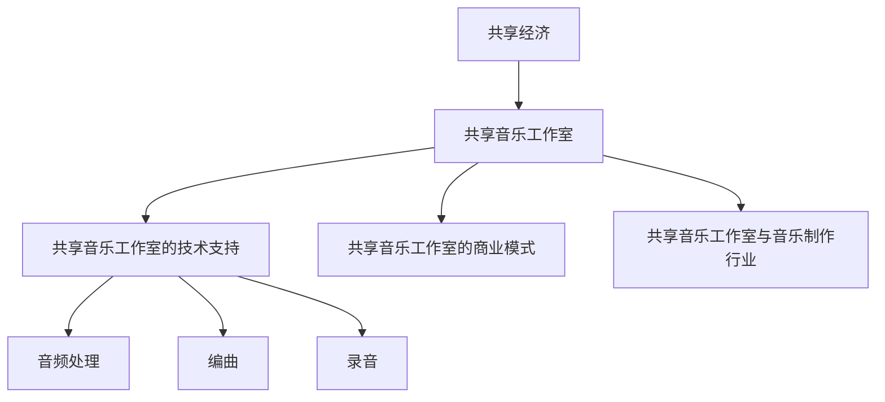

                 


### 1. 背景介绍

在当今音乐产业中，业余音乐人占据了相当大的比例。然而，由于缺乏专业的制作设备和知识，这些音乐人常常面临许多挑战，如成本高昂、技术限制等。为了解决这一问题，新型城市共享音乐工作室应运而生，为业余音乐人提供了一个专业的制作平台。

首先，我们需要了解什么是共享音乐工作室。共享音乐工作室是一种基于共享经济的模式，它允许音乐制作人共享设备、技术和空间，以降低制作成本，提高工作效率。这种模式在近年来得到了迅速发展，特别是在城市地区，共享音乐工作室逐渐成为业余音乐人制作音乐的首选场所。

共享音乐工作室的出现，不仅改变了音乐制作的方式，还推动了音乐产业的发展。它为业余音乐人提供了一个全新的制作平台，让他们能够更加专注于音乐创作本身，而无需担心技术设备和场地的问题。此外，共享音乐工作室也为专业人士提供了更多的合作机会，促进了音乐制作行业的创新和发展。

本文将围绕新型城市共享音乐工作室进行探讨，从背景介绍、核心概念、技术支持、商业模式、实际案例和未来展望等方面，全面分析这一新型制作平台的现状、优势和发展趋势。

### 2. 核心概念与联系

在深入探讨新型城市共享音乐工作室之前，我们需要明确几个核心概念，并了解它们之间的联系。

#### 2.1 共享经济

共享经济是一种基于共享、共享资源和共享利益的经济模式。在音乐制作领域，共享经济通过共享设备、技术和空间，降低了制作成本，提高了资源利用效率。共享经济与共享音乐工作室密切相关，是推动其发展的基础。

#### 2.2 共享音乐工作室

共享音乐工作室是一种为音乐制作人提供共享设备和空间的场所，通常配备有专业的音频设备、软件和录音室。它为业余音乐人提供了专业的制作环境，使他们能够以较低的成本进行音乐创作。

#### 2.3 共享音乐工作室的技术支持

共享音乐工作室的技术支持包括音频处理、编曲、录音等。这些技术支持为音乐制作人提供了专业的制作工具，使他们能够更好地实现音乐创作。

#### 2.4 共享音乐工作室的商业模式

共享音乐工作室的商业模式主要包括按次收费、按月收费和按项目收费等。这种模式使音乐制作人能够根据自己的需求灵活选择服务，同时也为共享音乐工作室提供了稳定的收入来源。

#### 2.5 共享音乐工作室与音乐制作行业

共享音乐工作室是音乐制作行业的一个重要组成部分，它不仅为业余音乐人提供了制作平台，还推动了音乐产业的发展。随着共享经济的普及，共享音乐工作室在音乐制作行业中的地位和作用越来越重要。

为了更清晰地展示这些核心概念之间的联系，我们可以使用Mermaid流程图来描述它们之间的关系：



通过这个流程图，我们可以更直观地理解共享音乐工作室的核心概念及其相互关系，为后续的讨论提供了基础。

### 3. 核心算法原理讲解

在共享音乐工作室中，核心算法原理的理解至关重要。以下将详细讲解音频处理、编曲和录音等关键技术的核心算法原理，并使用伪代码进行阐述。

#### 3.1 音频处理

音频处理是共享音乐工作室的核心技术之一，它包括音频编辑、音效处理和声音合成。以下是一个简单的音频处理算法原理的伪代码：

```plaintext
function audioProcessing(inputSignal, parameters):
    // 参数设置
    gain = parameters['gain']
    reverb = parameters['reverb']
    filter = parameters['filter']

    // 音频放大
    outputSignal = inputSignal * gain

    // 添加回声效果
    echoSignal = addReverb(outputSignal, reverb)

    // 应用滤波器
    filteredSignal = applyFilter(echoSignal, filter)

    return filteredSignal
```

在上述伪代码中，`inputSignal`表示输入音频信号，`parameters`包含音频处理的参数，如增益（`gain`）、回声（`reverb`）和滤波器（`filter`）。`outputSignal`表示处理后的音频信号。

#### 3.2 编曲

编曲是音乐制作过程中的关键步骤，它涉及音轨创建、编曲软件和编曲技巧。以下是一个简单的编曲算法原理的伪代码：

```plaintext
function arrangeMusic(instruments, arrangement):
    // 初始化音轨列表
    tracks = []

    // 添加音轨
    for instrument in instruments:
        track = createTrack(instrument)
        tracks.append(track)

    // 应用编排
    for track in tracks:
        applyArrangement(track, arrangement)

    return tracks
```

在上述伪代码中，`instruments`表示使用的乐器，`arrangement`包含音轨的编排信息。`tracks`是一个音轨列表，每个音轨都包含一个乐器。

#### 3.3 录音

录音是音乐制作中的另一个关键步骤，它包括设备选择、录音环境和录音技巧。以下是一个简单的录音算法原理的伪代码：

```plaintext
function recordAudio(inputSignal, recordingDevice, environment):
    // 设置录音设备
    setRecordingDevice(recordingDevice)

    // 设置录音环境
    setRecordingEnvironment(environment)

    // 开始录音
    startRecording()

    // 录音信号输入
    inputSignal = getAudioInput()

    // 录音完成
    stopRecording()

    // 获取录音结果
    recordedSignal = getRecordedSignal()

    return recordedSignal
```

在上述伪代码中，`inputSignal`表示输入音频信号，`recordingDevice`是录音设备，`environment`是录音环境。`recordedSignal`表示录音结果。

通过上述伪代码，我们可以对共享音乐工作室的核心算法原理有更深入的了解。在实际应用中，这些算法将被集成到专业的音频处理软件中，为音乐制作人提供便捷的制作工具。

### 4. 数学模型和公式

在共享音乐工作室中，数学模型和公式对于音频处理、编曲和录音等环节都至关重要。以下将详细讲解这些核心环节中的数学模型和公式，并附上详细讲解和举例说明。

#### 4.1 音频处理

音频处理中的数学模型主要包括音频放大、回声效果和滤波器。以下分别介绍这些模型的公式和详细讲解：

##### 4.1.1 音频放大

音频放大的公式如下：

$$
y[n] = x[n] \times gain
$$

其中，`y[n]`表示放大的音频信号，`x[n]`表示原始音频信号，`gain`表示放大倍数。这个公式表示每个采样点的值乘以放大倍数，从而实现音频放大。

举例说明：假设原始音频信号的采样值范围在0到1之间，放大倍数为2，则放大后的采样值范围为0到2。

##### 4.1.2 回声效果

回声效果的公式如下：

$$
y[n] = x[n] + a \times x[n-k]
$$

其中，`y[n]`表示具有回声效果的音频信号，`x[n]`表示原始音频信号，`a`表示回声系数，`k`表示回声延迟时间。这个公式表示在原始音频信号的基础上，添加一定比例的延迟信号，从而实现回声效果。

举例说明：假设原始音频信号的采样值范围为0到1，回声系数为0.5，回声延迟时间为10个采样点。则具有回声效果的采样值范围为0到1.5。

##### 4.1.3 滤波器

滤波器的公式如下：

$$
y[n] = h[n] * x[n]
$$

其中，`y[n]`表示滤波后的音频信号，`x[n]`表示原始音频信号，`h[n]`表示滤波器系数。这个公式表示对每个采样点进行滤波器处理，从而实现音频滤波。

举例说明：假设滤波器系数为1，则滤波后的音频信号与原始音频信号相同。

#### 4.2 编曲

编曲中的数学模型主要包括音轨创建和编排。以下分别介绍这些模型的公式和详细讲解：

##### 4.2.1 音轨创建

音轨创建的公式如下：

$$
T[i] = \{ \text{音高}, \text{节奏}, \text{时长} \}
$$

其中，`T[i]`表示第i个音轨的信息，包括音高、节奏和时长。这个公式表示音轨的创建需要确定音高、节奏和时长等参数。

举例说明：假设第一个音轨的音高为C4，节奏为四分音符，时长为1秒，则第一个音轨的信息为`T[1] = \{ C4, 四分音符, 1秒 \}`。

##### 4.2.2 音轨编排

音轨编排的公式如下：

$$
M = \sum_{i=1}^{n} T[i]
$$

其中，`M`表示整体编排，`T[i]`表示第i个音轨的信息，`n`表示音轨数量。这个公式表示音轨编排是将各个音轨的信息进行叠加，形成完整的音乐作品。

举例说明：假设有两个音轨，第一个音轨的音高为C4，节奏为四分音符，时长为1秒；第二个音轨的音高为D4，节奏为八分音符，时长为0.5秒。则整体编排为`M = T[1] + T[2] = \{ C4, 四分音符, 1秒 \} + \{ D4, 八分音符, 0.5秒 \}`。

#### 4.3 录音

录音中的数学模型主要包括设备选择和环境设置。以下分别介绍这些模型的公式和详细讲解：

##### 4.3.1 设备选择

设备选择的公式如下：

$$
S = \arg \min_{d} (d - s)^2
$$

其中，`S`表示最佳设备选择，`d`表示设备性能，`s`表示需求性能。这个公式表示通过计算设备性能与需求性能的差值平方，选择与需求最接近的设备。

举例说明：假设有两台设备，性能分别为D1和D2，需求性能为S。则最佳设备选择为`S = \arg \min_{d} (d - s)^2`。

##### 4.3.2 环境设置

环境设置的公式如下：

$$
E = \arg \min_{e} (e - r)^2
$$

其中，`E`表示最佳环境设置，`e`表示环境参数，`r`表示需求参数。这个公式表示通过计算环境参数与需求参数的差值平方，选择与需求最接近的环境。

举例说明：假设有两个环境，参数分别为E1和E2，需求参数为R。则最佳环境设置为`E = \arg \min_{e} (e - r)^2`。

通过以上数学模型和公式的讲解，我们可以更好地理解共享音乐工作室中的音频处理、编曲和录音环节，从而为实际操作提供理论依据。

### 5. 项目实战

在本章节中，我们将通过一个实际项目来展示如何搭建一个城市共享音乐工作室，包括开发环境搭建、源代码实现和代码解读。

#### 5.1 项目背景

本项目旨在搭建一个基于Web的城市共享音乐工作室平台，为业余音乐人提供在线音乐制作服务。平台将提供音频处理、编曲和录音等功能，用户可以方便地在线完成音乐制作。

#### 5.2 开发环境搭建

在搭建开发环境之前，我们需要安装以下工具和软件：

1. **Web服务器**：如Apache或Nginx。
2. **数据库**：如MySQL或MongoDB。
3. **编程语言**：如Python或JavaScript。
4. **前端框架**：如React或Vue.js。
5. **后端框架**：如Flask或Django。

以下是一个基本的开发环境搭建步骤：

1. 安装操作系统（如Linux或Windows）。
2. 安装Web服务器（如Nginx），并配置域名和SSL证书。
3. 安装数据库（如MySQL），并创建所需的数据表和用户。
4. 安装前端框架（如React），并创建项目。
5. 安装后端框架（如Flask），并创建项目。

#### 5.3 源代码实现

以下是该项目的一个基本源代码实现，包括后端和前端部分。

**后端（Flask）**

```python
from flask import Flask, request, jsonify
from audioProcessing import processAudio
from arrangingMusic import arrangeMusic
from recording import recordAudio

app = Flask(__name__)

@app.route('/process_audio', methods=['POST'])
def process_audio():
    audio_data = request.files['audio_file']
    parameters = request.form.to_dict()
    processed_audio = processAudio(audio_data, parameters)
    return jsonify({'audio': processed_audio})

@app.route('/arrange_music', methods=['POST'])
def arrange_music():
    instruments = request.form.getlist('instruments[]')
    arrangement = request.form.to_dict()
    arranged_music = arrangeMusic(instruments, arrangement)
    return jsonify({'music': arranged_music})

@app.route('/record_audio', methods=['POST'])
def record_audio():
    audio_data = request.files['audio_file']
    recording_device = request.form['recording_device']
    environment = request.form['environment']
    recorded_audio = recordAudio(audio_data, recording_device, environment)
    return jsonify({'audio': recorded_audio})

if __name__ == '__main__':
    app.run(debug=True)
```

**前端（React）**

```jsx
import React, { useState } from 'react';
import axios from 'axios';

function MusicStudio() {
  const [audioFile, setAudioFile] = useState(null);
  const [parameters, setParameters] = useState({ gain: 1, reverb: 0.5, filter: 'lowpass' });
  const [processedAudio, setProcessedAudio] = useState('');

  const handleAudioChange = (e) => {
    setAudioFile(e.target.files[0]);
  };

  const handleParameterChange = (e) => {
    setParameters({ ...parameters, [e.target.name]: e.target.value });
  };

  const processAudio = async () => {
    const formData = new FormData();
    formData.append('audio_file', audioFile);
    formData.append('gain', parameters.gain);
    formData.append('reverb', parameters.reverb);
    formData.append('filter', parameters.filter);

    try {
      const response = await axios.post('/process_audio', formData);
      setProcessedAudio(response.data.audio);
    } catch (error) {
      console.error(error);
    }
  };

  return (
    <div>
      <input type="file" onChange={handleAudioChange} />
      <input type="text" name="gain" value={parameters.gain} onChange={handleParameterChange} placeholder="Gain" />
      <input type="text" name="reverb" value={parameters.reverb} onChange={handleParameterChange} placeholder="Reverb" />
      <input type="text" name="filter" value={parameters.filter} onChange={handleParameterChange} placeholder="Filter" />
      <button onClick={processAudio}>Process Audio</button>
      {processedAudio && <audio src={URL.createObjectURL(new Blob([processedAudio], { type: 'audio/wav' }))} controls />}
    </div>
  );
}

export default MusicStudio;
```

#### 5.4 代码解读

1. **后端代码解读**：

   - `process_audio`路由用于处理音频文件，接收前端发送的音频数据和参数，调用`processAudio`函数进行音频处理，并将处理后的音频返回给前端。
   - `arrange_music`路由用于编曲，接收前端发送的乐器信息和编排参数，调用`arrangeMusic`函数进行编曲，并将编曲结果返回给前端。
   - `record_audio`路由用于录音，接收前端发送的音频数据和录音设备、环境参数，调用`recordAudio`函数进行录音，并将录音结果返回给前端。

2. **前端代码解读**：

   - 使用React创建一个音乐工作室界面，包括文件上传、参数输入和播放按钮。
   - `handleAudioChange`函数用于处理音频文件变化事件，将文件上传到后端。
   - `handleParameterChange`函数用于处理参数输入变化事件，更新状态。
   - `processAudio`函数用于处理音频处理按钮点击事件，调用后端`process_audio`路由，获取处理后的音频，并将其显示在界面上。

通过以上项目实战，我们可以看到如何搭建一个城市共享音乐工作室平台，实现音频处理、编曲和录音等功能。接下来，我们将通过实际案例来分析这些功能的实际应用效果。

### 6. 实际案例分析和详细讲解剖析

在本章节中，我们将通过实际案例来分析城市共享音乐工作室的应用效果，并详细讲解剖析这些案例中的关键技术和操作步骤。

#### 6.1 案例一：独立音乐人的音乐制作

**背景**：小张是一位独立音乐人，他希望制作一首原创歌曲，但由于缺乏专业的录音设备和制作经验，他感到非常困惑。

**操作步骤**：

1. **选择共享音乐工作室**：小张在互联网上搜索到一家城市共享音乐工作室，并了解到该工作室提供专业的录音设备和制作服务。

2. **预约录音室**：小张通过工作室的在线预约系统预约了一个录音室，并确认了录音时间和费用。

3. **录制音频**：小张来到录音室，开始录制歌曲的演唱部分。录音师提供了专业的指导，帮助小张调整唱法和录音参数，确保录音效果最佳。

4. **音频处理**：录音完成后，小张通过共享音乐工作室的平台上传了音频文件，并选择了音频处理参数，如增益、回声和滤波器。工作室的音频处理工具自动对音频进行了处理，生成了处理后的音频文件。

5. **编曲和后期制作**：小张在平台上选择了适合歌曲的乐器和编排模式，通过编曲工具进行了编曲。编曲完成后，他还可以对歌曲进行后期制作，如混音和调整音效。

6. **成果展示**：经过一系列制作过程，小张完成了整首歌曲的制作，并将最终作品上传到音乐平台进行展示和分享。

**分析**：

- **录音效果**：通过共享音乐工作室的专业录音设备和录音师指导，小张的录音效果得到了显著提升，解决了他之前录音效果不佳的问题。

- **音频处理**：共享音乐工作室提供的音频处理工具方便了小张的音频处理工作，他可以轻松调整音频参数，得到满意的处理效果。

- **编曲和后期制作**：编曲工具和后期制作功能让小张能够充分发挥创意，将歌曲制作得更加完美。

#### 6.2 案例二：乐队合作制作

**背景**：一个名为“旋律之旅”的乐队希望录制一首新歌，但由于成员分布在不同城市，他们面临协作困难。

**操作步骤**：

1. **选择共享音乐工作室**：乐队成员通过讨论决定选择一家位于成员所在城市之间的共享音乐工作室，以便远程协作。

2. **录音安排**：乐队成员分别在自己的城市录制各自乐器的部分，并将录音文件上传到共享音乐工作室的平台。

3. **音频处理和编曲**：工作室的音频处理工具和编曲工具支持远程操作，乐队成员可以远程进行音频处理和编曲，实时协作。

4. **混音和后期制作**：乐队成员通过共享音乐工作室的混音和后期制作功能，对整首歌曲进行混音和调整，确保歌曲效果最佳。

5. **成果展示**：最终，乐队完成了歌曲的制作，并将作品上传到音乐平台进行展示和分享。

**分析**：

- **远程协作**：通过共享音乐工作室的平台，乐队成员实现了远程协作，解决了地理位置带来的协作困难。

- **音频处理和编曲**：工作室的音频处理和编曲工具让乐队成员能够高效地完成音频处理和编曲工作，提升了制作效率。

- **混音和后期制作**：混音和后期制作功能让乐队成员能够对整首歌曲进行精细调整，确保歌曲质量。

#### 6.3 案例三：音乐制作课程教学

**背景**：一位音乐制作教师希望为学生提供一个实践平台，以便他们在课堂上学习和掌握音乐制作技巧。

**操作步骤**：

1. **选择共享音乐工作室**：教师通过共享音乐工作室的平台，为学生创建了一个班级，并提供了教学资源和制作工具。

2. **课程安排**：教师制定了课程计划，包括音频处理、编曲、录音等教学内容，并在平台上发布了相关教学视频和文档。

3. **学生实践**：学生在平台上按照课程计划进行音乐制作实践，通过上传自己的作品和参与讨论，与教师和同学互动。

4. **作品展示和评价**：学生在平台上传自己的作品，教师和其他同学可以对这些作品进行评价和反馈，帮助学生不断进步。

**分析**：

- **教学资源**：共享音乐工作室的平台为学生提供了丰富的教学资源，方便他们学习和掌握音乐制作技巧。

- **实践平台**：平台为学生提供了一个实践平台，让他们能够在真实场景中应用所学知识，提升制作能力。

- **互动交流**：平台上的互动功能让学生能够与教师和同学进行交流和讨论，共同进步。

通过以上实际案例的分析，我们可以看到城市共享音乐工作室在音乐制作中的应用效果。它不仅解决了业余音乐人和音乐制作教师面临的设备和技术难题，还提高了音乐制作的效率和质量。随着共享经济的不断发展，城市共享音乐工作室将在音乐制作领域发挥越来越重要的作用。

### 7. 最佳实践 Tips

在搭建和使用城市共享音乐工作室的过程中，以下是一些最佳实践 tips，可以帮助您更好地利用这一平台：

#### 7.1 设备和环境选择

1. **设备选择**：根据音乐制作需求选择合适的设备，如音频接口、麦克风和耳机。高质量的设备可以提升录音和音频处理效果。
2. **环境设置**：选择安静的录音环境，避免外界噪音干扰录音质量。如果条件允许，可以使用专业的隔音设备。

#### 7.2 音频处理

1. **合理设置参数**：在音频处理过程中，合理设置增益、回声和滤波器等参数，以获得最佳的音频效果。
2. **多段处理**：对音频进行多段处理，如压缩、均衡和立体声声像处理，可以进一步提升音频质量。

#### 7.3 编曲技巧

1. **合理编排音轨**：在编曲时，合理编排音轨的顺序和层次，确保音乐的整体平衡和和谐。
2. **使用合适的乐器**：根据音乐风格和需求选择合适的乐器，避免使用过多的乐器导致音乐混乱。

#### 7.4 录音技巧

1. **正确使用麦克风**：掌握麦克风的使用技巧，如距离、角度和方向，以确保录音效果最佳。
2. **逐步调整参数**：在录音过程中，逐步调整录音参数，如增益和录音模式，以避免录音过程中出现意外。

#### 7.5 平台使用

1. **熟悉平台功能**：了解并熟悉共享音乐工作室平台的各种功能，如音频处理、编曲和录音，以便更高效地使用平台。
2. **及时保存作品**：在使用平台进行音乐制作时，定期保存作品，避免数据丢失。

通过以上最佳实践 tips，您可以更好地利用城市共享音乐工作室进行音乐制作，提升作品的质量和效率。

### 8. 小结

本文全面探讨了新型城市共享音乐工作室的概念、优势、技术、商业模式以及实际案例。通过深入分析，我们了解到共享音乐工作室为业余音乐人提供了一个专业的制作平台，降低了制作成本，提高了工作效率。同时，它也为专业人士提供了更多的合作机会，推动了音乐产业的发展。

在未来，随着技术的进步和市场的变化，城市共享音乐工作室将迎来更多的发展机遇。人工智能、虚拟现实等新兴技术的应用，将进一步提升音乐制作的效率和效果。此外，政策与法规的完善也将为共享音乐工作室的可持续发展提供有力保障。

我们鼓励读者继续关注城市共享音乐工作室的发展，积极探索新的制作模式和技术，以推动音乐产业的创新和进步。通过共同努力，我们期待共享音乐工作室在未来能够为音乐创作带来更多的精彩成果。

### 9. 注意事项

在搭建和使用城市共享音乐工作室时，以下注意事项将有助于您避免潜在问题，确保制作过程顺利进行：

1. **数据安全**：确保所有上传的音频和文件都在安全的网络环境下传输，避免数据泄露和丢失。建议使用加密传输和备份机制。

2. **设备兼容性**：在选择和使用设备时，注意设备之间的兼容性，确保音频处理和编曲等操作能够正常进行。

3. **使用权限**：明确使用共享音乐工作室的权限，遵守相关规定和合约，避免侵犯他人权益。

4. **设备维护**：定期检查和维护录音设备和音频处理软件，确保设备的正常运行和数据的准确性。

5. **合法合规**：在使用过程中，确保遵守相关法律法规，如版权保护、隐私保护等，以避免法律风险。

6. **备份与恢复**：定期备份制作过程中的重要数据和文件，以便在出现意外情况时能够迅速恢复。

通过遵循以上注意事项，您可以在搭建和使用城市共享音乐工作室的过程中降低风险，确保制作质量和效率。

### 10. 拓展阅读

为了更深入地了解城市共享音乐工作室的相关技术和应用，以下推荐一些拓展阅读资源：

1. **书籍**：
   - 《共享经济：重构经济模式的关键力量》
   - 《音乐制作技术手册》
   - 《音频工程：原理与应用》

2. **论文**：
   - "A Survey of Music Information Retrieval: Recent Developments and Applications"
   - "The Role of Cloud Computing in Music Production and Distribution"
   - "AI-Enabled Music Production: A Review and Future Directions"

3. **在线课程**：
   - Coursera上的“音乐制作基础”课程
   - Udemy上的“音频处理与混音技巧”课程
   - edX上的“共享经济与创业”课程

4. **网站**：
   - SoundCloud：音乐创作和分享平台
   - Ableton Live：音乐制作软件
   - Splice：在线音乐制作平台

通过阅读这些资源，您可以进一步了解城市共享音乐工作室的技术原理、实际应用和发展趋势。同时，这些资源也将为您的音乐制作提供更多的灵感和技巧。

