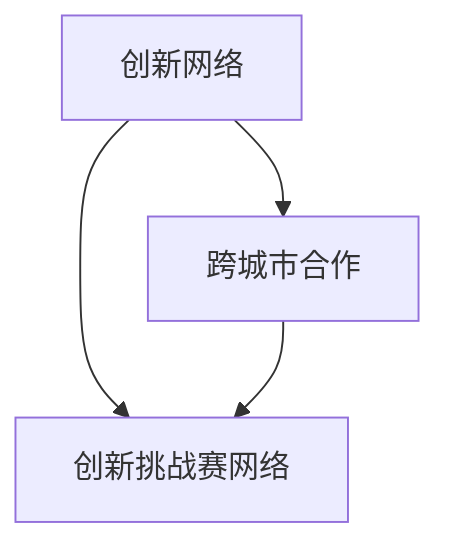
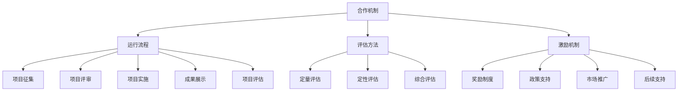

                 

## 文章标题

### 新型城市创客马拉松联盟：跨城市的创新挑战赛网络

## 关键词

- 城市创客
- 创新挑战赛
- 跨城市合作
- 创新网络
- 创新管理

## 摘要

本文探讨了新型城市创客马拉松联盟的构建及其在跨城市创新挑战赛网络中的作用。首先，文章介绍了城市创客的概念及其对城市发展的重要性。接着，详细阐述了城市创客马拉松的起源、形式和核心目标，并通过实际案例展示了其影响和挑战。随后，文章分析了跨城市创新挑战赛的机制和策略，包括合作机制的设计、执行与风险管理。最后，文章讨论了创新挑战赛网络的构建与维护，提出了未来发展展望和最佳实践建议。通过这些内容，本文为推动城市创新合作提供了理论和实践指导。

## 背景介绍

### 城市创客的兴起

城市创客（Urban Maker）是指那些活跃在城市社区中，以创新、创造和实验为驱动，致力于推动城市发展、改善生活质量和推动社会进步的一群人。城市创客的兴起可以追溯到20世纪末，随着信息技术的飞速发展和社会结构的变迁，城市创客文化逐渐成为全球城市社区的重要组成部分。

城市创客的特点包括：第一，跨界性。城市创客不仅仅是技术领域的专业人士，还包括艺术家、设计师、社会学家、建筑师等多种背景的人。第二，创新性。城市创客以其独特的创新思维和创造力，为城市发展提供了新的动力。第三，协作性。城市创客通常以团队合作的方式进行项目开发和实验，通过协作实现创新目标。

城市创客的兴起对城市发展产生了深远影响。首先，城市创客推动了城市创新文化的形成。通过创新项目和实践，城市创客为城市带来了新的活力和动力。其次，城市创客促进了社区参与和社会治理的改进。城市创客项目往往涉及社区居民的广泛参与，增强了社区的凝聚力和自治能力。最后，城市创客还推动了城市可持续发展的实践。通过创新解决方案，城市创客帮助解决城市面临的各种挑战，如环境污染、交通拥堵和社会不平等问题。

### 城市创客马拉松的起源和发展

城市创客马拉松（Urban Maker Marathon）是一种以创新为核心，鼓励创客们通过团队合作在短时间内快速开发创新项目的活动。城市创客马拉松最早起源于2007年的“黑客马拉松”（Hackathon），黑客马拉松是一种程序员和技术爱好者在有限时间内合作开发软件项目的活动。随后，这一模式逐渐扩展到其他领域，如设计、艺术和社会创新等，形成了城市创客马拉松。

城市创客马拉松通常包括以下几个阶段：

1. **准备阶段**：组织者发布挑战主题，创客团队报名参加，准备所需资源和工具。
2. **开发阶段**：创客团队在规定时间内（通常为48小时）进行项目开发，通过团队合作、创新思维和快速迭代实现项目目标。
3. **展示阶段**：项目完成后，创客团队向评审团和观众展示他们的成果，接受评审和反馈。

城市创客马拉松的核心目标包括：第一，激发创新思维和创造力。通过竞赛形式，鼓励创客们在短时间内产生创新点子和解决方案。第二，促进跨学科和跨领域的合作。城市创客马拉松通常涉及多个领域的专业人士，通过团队合作，实现项目创新和突破。第三，推动社会问题和城市挑战的解决。城市创客马拉松项目往往围绕城市面临的现实问题，通过创新解决方案，为城市可持续发展贡献力量。

城市创客马拉松的影响和挑战

城市创客马拉松在全球范围内取得了显著的成效。首先，城市创客马拉松为城市带来了大量创新项目，推动了城市创新文化的形成。通过城市创客马拉松，城市居民和企业能够更好地了解创新的重要性和潜力，激发更多人参与到创新活动中来。其次，城市创客马拉松促进了跨学科和跨领域的合作，为城市带来了新的发展机遇。通过城市创客马拉松，不同领域的人才能够相互协作，实现创新突破，推动城市发展。最后，城市创客马拉松为解决城市面临的各种挑战提供了新的思路和解决方案。通过创新项目，城市创客马拉松能够有效应对环境污染、交通拥堵、社会不平等等问题。

然而，城市创客马拉松也面临着一些挑战。首先，资源不足。城市创客马拉松通常需要大量的资金、场地和技术支持，但资源分配往往不均衡，一些城市创客难以获得足够的资源支持。其次，时间压力。城市创客马拉松要求创客团队在短时间内完成项目开发，这对团队的协作能力和时间管理提出了高要求。最后，项目可持续性。一些城市创客马拉松项目在竞赛结束后，缺乏后续支持和推广，导致项目难以持续发展。

### 跨城市创新挑战赛的概念和意义

跨城市创新挑战赛（Inter-City Innovation Challenge）是指不同城市之间的创客团队通过合作，共同解决城市面临的创新问题的竞赛。跨城市创新挑战赛旨在通过跨城市合作，促进创新资源的共享和优势互补，推动城市可持续发展。

跨城市创新挑战赛的概念包括以下几个方面：

1. **跨城市合作**：跨城市创新挑战赛鼓励不同城市之间的创客团队进行合作，通过共享资源和知识，实现创新突破。
2. **创新问题解决**：跨城市创新挑战赛围绕城市面临的现实问题，如环境污染、交通拥堵、社会不平等等，鼓励创客团队提出创新解决方案。
3. **竞赛机制**：跨城市创新挑战赛采用竞赛机制，鼓励创客团队在规定时间内完成项目开发，并通过展示和评审环节，评选出优胜项目。

跨城市创新挑战赛的意义主要体现在以下几个方面：

1. **促进创新资源整合**：跨城市创新挑战赛能够有效整合不同城市的创新资源，如人才、技术和资金，推动创新资源的共享和优化配置。
2. **激发创新活力**：跨城市创新挑战赛通过竞赛形式，激发创客团队的创造力和创新活力，推动创新项目的快速发展。
3. **推动城市可持续发展**：跨城市创新挑战赛鼓励创客团队关注城市可持续发展问题，通过创新解决方案，为城市带来实际效益。
4. **促进城市间合作**：跨城市创新挑战赛能够促进不同城市之间的交流与合作，推动城市间的共同发展和繁荣。

### 跨城市创新挑战赛的案例

为了更好地理解跨城市创新挑战赛的概念和意义，我们可以通过一些实际案例进行分析。

#### 案例1：全球智慧城市创新挑战赛

全球智慧城市创新挑战赛（Global Smart City Innovation Challenge）是一个国际性的跨城市创新挑战赛，旨在通过创客团队的合作，推动智慧城市的发展。该挑战赛吸引了来自世界各地城市的创客团队参与，围绕智慧交通、智慧能源、智慧环境等主题，提出了许多创新解决方案。

一个成功的案例是来自A城市的创客团队提出的“智能交通管理系统”。该系统通过大数据分析和人工智能技术，实时监测和优化城市交通流量，有效缓解了交通拥堵问题。该项目在挑战赛中获得了高度评价，并在后续得到了A城市政府的支持，进一步推广实施。

#### 案例2：中国城市可持续发展创新挑战赛

中国城市可持续发展创新挑战赛（Chinese City Sustainable Development Innovation Challenge）是一个全国性的跨城市创新挑战赛，旨在推动中国城市的可持续发展。该挑战赛吸引了多个城市的创客团队参与，围绕环境保护、社会公益、城市基础设施等主题，提出了许多创新项目。

一个成功的案例是来自B城市的“城市垃圾分类与回收系统”。该系统通过物联网技术和智能垃圾分类设备，提高了城市垃圾分类的效率和准确性，有效减少了环境污染。该项目在挑战赛中获得了广泛关注，并在其他城市得到了推广应用。

#### 案例3：欧洲城市创新挑战赛

欧洲城市创新挑战赛（European City Innovation Challenge）是一个跨国性的跨城市创新挑战赛，旨在促进欧洲城市之间的创新合作。该挑战赛吸引了来自欧洲多个国家的创客团队参与，围绕城市可持续发展、智慧城市、环境保护等主题，提出了许多创新解决方案。

一个成功的案例是来自C城市的“智慧农业项目”。该项目的核心是通过物联网技术、大数据分析和人工智能技术，实现农田的智能管理，提高农业生产效率和质量。该项目在挑战赛中获得了高度评价，并在其他欧洲城市得到了推广应用。

### 跨城市创新挑战赛的优势和挑战

跨城市创新挑战赛作为一种新型的创新模式，具有显著的优点和一定的挑战。

#### 优势

1. **资源整合**：跨城市创新挑战赛能够有效整合不同城市的创新资源，如人才、技术和资金，推动创新资源的共享和优化配置。
2. **激发创新活力**：跨城市创新挑战赛通过竞赛形式，激发创客团队的创造力和创新活力，推动创新项目的快速发展。
3. **推动城市可持续发展**：跨城市创新挑战赛鼓励创客团队关注城市可持续发展问题，通过创新解决方案，为城市带来实际效益。
4. **促进城市间合作**：跨城市创新挑战赛能够促进不同城市之间的交流与合作，推动城市间的共同发展和繁荣。

#### 挑战

1. **协调难度**：跨城市创新挑战赛涉及到不同城市之间的合作，协调难度较大，需要建立有效的沟通和协调机制。
2. **资源不足**：一些城市可能缺乏足够的资金、场地和技术支持，导致参与度和项目质量受到影响。
3. **时间压力**：跨城市创新挑战赛通常要求创客团队在短时间内完成项目开发，这对团队的协作能力和时间管理提出了高要求。
4. **项目可持续性**：一些跨城市创新挑战赛项目在竞赛结束后，缺乏后续支持和推广，导致项目难以持续发展。

### 结论

跨城市创新挑战赛作为一种新型的创新模式，具有显著的优点和一定的挑战。通过资源整合、激发创新活力和推动城市可持续发展，跨城市创新挑战赛为城市带来了新的发展机遇。然而，协调难度、资源不足和时间压力等问题也需要引起重视。未来，随着跨城市合作的深入发展，跨城市创新挑战赛有望成为推动城市创新和可持续发展的重要力量。

## 核心概念与联系

### 创新网络

创新网络（Innovation Network）是指由多个创新主体（如企业、科研机构、高校、政府等）通过合作关系形成的网络结构。创新网络的核心是创新资源的流动和共享，通过合作实现创新目标和价值创造。

创新网络的基本概念包括：

1. **创新主体**：创新网络中的主体包括企业、科研机构、高校、政府、非政府组织等。每个主体都有其独特的资源、能力和优势。
2. **合作关系**：创新网络中的合作关系包括合作研发、资源共享、知识交流、市场合作等。合作关系的形式和深度影响创新网络的效率和效果。
3. **资源流动**：创新网络中的资源流动包括资金、技术、人才、信息等。资源流动的效率和质量直接影响创新网络的活力和创新成果。

### 跨城市合作

跨城市合作（Inter-City Collaboration）是指不同城市之间的政府、企业、科研机构、高校等创新主体通过合作，共同解决城市发展问题、推动创新项目实施和实现共同发展目标的过程。

跨城市合作的核心概念包括：

1. **合作主体**：跨城市合作的主体包括城市政府、企业、科研机构、高校等。每个主体在合作中扮演不同的角色，贡献不同的资源。
2. **合作机制**：跨城市合作的机制包括合作协议、合作平台、合作项目等。合作机制的建立和运行是跨城市合作成功的关键。
3. **合作目标**：跨城市合作的目标包括资源共享、优势互补、创新发展、社会进步等。合作目标的实现需要各方共同努力和持续投入。

### 创新挑战赛网络

创新挑战赛网络（Innovation Challenge Network）是指由多个创新挑战赛（如城市创客马拉松、跨城市创新挑战赛等）组成的网络结构，通过竞赛和合作形式，推动城市创新和可持续发展。

创新挑战赛网络的核心概念包括：

1. **挑战赛**：创新挑战赛是创新挑战赛网络的基本单元，包括城市创客马拉松、跨城市创新挑战赛等。挑战赛的形式和内容影响创新网络的活力和创新成果。
2. **合作平台**：创新挑战赛网络中的合作平台包括线上平台、线下活动、合作机制等。合作平台为创新主体提供了交流和合作的场所和渠道。
3. **资源共享**：创新挑战赛网络通过资源共享，实现创新资源的优化配置和高效利用。资源共享包括资金、技术、人才、信息等。

### 核心概念之间的关系架构

创新网络、跨城市合作和创新挑战赛网络之间存在着密切的联系和相互作用。

1. **创新网络** 是跨城市合作和创新挑战赛网络的基础。创新网络为跨城市合作提供了资源和平台，为创新挑战赛网络提供了主体和内容。
2. **跨城市合作** 是创新网络和创新挑战赛网络的桥梁。跨城市合作将不同城市的创新资源整合起来，推动创新挑战赛网络的运行和效果。
3. **创新挑战赛网络** 是创新网络和跨城市合作的具体实现形式。创新挑战赛网络通过竞赛和合作形式，激发创新活力，推动城市创新和可持续发展。

为了更好地理解核心概念之间的关系，我们可以使用 Mermaid 流程图进行展示：



在这个流程图中，创新网络（A）是基础，跨城市合作（B）和创新挑战赛网络（C）通过相互作用和合作，实现了创新资源的整合和创新目标的实现。

### 跨城市创新挑战赛的机制设计

跨城市创新挑战赛作为一种促进城市间合作、激发创新活力的有效方式，其机制设计至关重要。以下将详细探讨跨城市创新挑战赛的机制设计，包括合作机制的建立、运行流程、评估方法和激励机制等方面。

#### 合作机制的建立

跨城市创新挑战赛的合作机制是确保各参与城市和机构能够高效合作、共同实现创新目标的基础。合作机制的建立主要包括以下几个步骤：

1. **明确合作目标**：首先，需要明确跨城市创新挑战赛的合作目标，包括创新问题解决、资源整合、技术交流、人才培养等方面。合作目标的明确有助于各方在合作过程中保持一致的方向和努力。

2. **签署合作协议**：合作协议是跨城市创新挑战赛合作机制的正式文件，明确了各方的权利、义务和责任。合作协议应包括合作内容、合作期限、成果分配、保密条款等关键内容。

3. **建立沟通平台**：建立稳定的沟通平台是合作机制的重要部分。可以通过线上平台（如微信群、邮件列表、论坛等）和线下会议（如协调会、研讨会等）来实现各方的及时沟通和协作。

4. **设立协调机构**：跨城市创新挑战赛需要一个专门的协调机构来负责合作的组织、协调和管理工作。协调机构应具备较强的组织协调能力，能够有效解决合作过程中出现的问题和冲突。

#### 运行流程

跨城市创新挑战赛的运行流程主要包括以下几个阶段：

1. **项目征集**：在合作机制建立后，各城市和相关机构可以通过发布挑战主题、征集项目提案的方式，吸引创客团队和研究人员参与挑战赛。

2. **项目评审**：对征集到的项目提案进行评审，筛选出具有创新性、可行性和实用价值的项目进入下一阶段。评审过程应保证公平、公正和公开，可以邀请专家、投资人、政府部门等多方参与。

3. **项目实施**：进入实施阶段的项目，各城市和相关机构应根据合作协议，提供必要的资源和支持，包括资金、技术、人才、场地等。项目实施过程中，应定期进行项目进展的汇报和协调，确保项目按计划进行。

4. **成果展示**：项目完成后，各团队应在指定的时间和地点进行成果展示，通过答辩、演示等形式向评审团和观众展示项目成果。展示环节应注重项目创新性、实用性和影响力的展示。

5. **项目评估**：对项目成果进行评估，根据项目的完成情况、创新程度、社会影响等方面进行评分。评估结果作为奖励、推广和后续支持的重要依据。

#### 评估方法

跨城市创新挑战赛的评估方法应全面、客观、公正，以确保评估结果的准确性和权威性。常见的评估方法包括以下几种：

1. **定量评估**：通过设立评价指标和评分标准，对项目成果进行量化评估。例如，项目的技术创新程度、市场潜力、社会效益等。

2. **定性评估**：通过专家评审、公众投票、实地考察等方式，对项目进行定性评估。定性评估可以更全面地反映项目的实际效果和社会影响。

3. **综合评估**：结合定量评估和定性评估的结果，进行综合评估，以得出更准确的评估结论。综合评估可以更全面地反映项目的实际效果和社会影响。

#### 激励机制

激励机制是确保跨城市创新挑战赛持续进行、激发创新活力的重要手段。以下是一些常见的激励机制：

1. **奖励制度**：对在挑战赛中表现突出的团队和个人给予物质奖励和精神奖励。物质奖励可以包括奖金、奖品等，精神奖励可以包括荣誉证书、荣誉称号等。

2. **政策支持**：政府可以出台相关政策，对在挑战赛中取得优异成绩的团队和个人给予政策支持，如税收优惠、资金支持、资质认证等。

3. **市场推广**：通过媒体宣传、展会展示、投融资对接等方式，对优秀项目进行市场推广，帮助项目团队实现市场化应用和推广。

4. **后续支持**：对优秀项目提供后续支持和跟踪服务，包括技术支持、市场推广、政策咨询等，帮助项目团队解决在后续发展中遇到的问题。

### 总结

跨城市创新挑战赛的机制设计是确保挑战赛顺利进行、取得预期成果的关键。通过建立有效的合作机制、明确运行流程、采用科学的评估方法和完善激励机制，可以推动跨城市创新挑战赛的可持续发展，为城市创新和可持续发展贡献力量。



在这个流程图中，合作机制（A）是基础，运行流程（B）、评估方法（C）和激励机制（D）通过相互作用和相互支持，共同推动了跨城市创新挑战赛的顺利进行和持续发展。

### 核心算法原理讲解

在跨城市创新挑战赛中，算法原理的应用对于项目的成功实施和评估至关重要。以下将详细讲解一种核心算法原理，即基于项目价值和影响力的评分算法，并通过伪代码和详细讲解进行阐述。

#### 算法原理

项目价值和影响力的评分算法旨在通过量化评估，衡量跨城市创新挑战赛项目的整体价值和影响力。该算法的核心思想是将项目价值拆分为多个维度，如技术创新性、市场潜力和社会效益，并根据各维度的权重计算出项目的总评分。

#### 算法流程

1. **项目数据收集**：首先，需要收集项目的相关信息，包括项目描述、技术实现、市场前景和社会效益等。

2. **维度划分**：将项目价值拆分为多个维度，例如技术创新性、市场潜力和社会效益，每个维度均设定相应的评价指标。

3. **权重设置**：根据各维度的重要性，设置不同的权重。通常，技术创新性、市场潜力和社会效益的权重设置分别为0.4、0.3和0.3。

4. **评分计算**：对每个维度进行评分，然后乘以相应的权重，最后将各维度的评分相加，得到项目的总评分。

#### 伪代码

```python
# 伪代码：项目价值评分算法

# 输入：
# project_data: 项目相关信息
# weights: 权重设置

# 输出：
# total_score: 项目总评分

def calculate_project_score(project_data, weights):
    tech_innovation_score = calculate_tech_innovation_score(project_data)
    market_potential_score = calculate_market_potential_score(project_data)
    social_benefit_score = calculate_social_benefit_score(project_data)
    
    total_score = (weights['tech_innovation'] * tech_innovation_score +
                   weights['market_potential'] * market_potential_score +
                   weights['social_benefit'] * social_benefit_score)
    
    return total_score

# 辅助函数：计算各维度评分
def calculate_tech_innovation_score(project_data):
    # 技术创新性评分计算逻辑
    return tech_innovation_score

def calculate_market_potential_score(project_data):
    # 市场潜力评分计算逻辑
    return market_potential_score

def calculate_social_benefit_score(project_data):
    # 社会效益评分计算逻辑
    return social_benefit_score
```

#### 详细讲解

1. **项目数据收集**：首先，需要收集跨城市创新挑战赛项目的相关信息，包括项目描述、技术实现、市场前景和社会效益等。这些信息可以通过项目提案、项目报告、专家评审等方式获取。

2. **维度划分**：将项目价值拆分为多个维度，例如技术创新性、市场潜力和社会效益。每个维度均设定相应的评价指标。例如，技术创新性可以包括技术难度、创新程度、技术突破等方面；市场潜力可以包括市场需求、市场占有率、市场前景等方面；社会效益可以包括环境保护、社会公正、公益贡献等方面。

3. **权重设置**：根据各维度的重要性，设置不同的权重。在本次算法中，技术创新性、市场潜力和社会效益的权重设置分别为0.4、0.3和0.3。这些权重可以根据实际情况进行调整，以反映各维度对项目总评分的影响程度。

4. **评分计算**：对每个维度进行评分，然后乘以相应的权重，最后将各维度的评分相加，得到项目的总评分。具体计算方法如下：

   - **技术创新性评分**：通过专家评审、文献调研等方式，对项目的技术创新性进行评估，给出一个评分值。
   - **市场潜力评分**：通过市场调研、财务分析等方式，对项目的市场潜力进行评估，给出一个评分值。
   - **社会效益评分**：通过社会调查、公益评估等方式，对项目的社会效益进行评估，给出一个评分值。

   根据设定的权重，计算各维度的加权评分，最后将各维度的评分相加，得到项目的总评分。

   例如，假设一个项目的技术创新性评分为80，市场潜力评分为70，社会效益评分为60，则该项目的总评分为：

   $$ 总评分 = 0.4 \times 80 + 0.3 \times 70 + 0.3 \times 60 = 32 + 21 + 18 = 71 $$

   因此，该项目的总评分为71分。

#### 举例说明

假设有一个跨城市创新挑战赛项目，其技术创新性评分为85，市场潜力评分为75，社会效益评分为65。根据设定的权重，该项目的总评分计算如下：

$$ 总评分 = 0.4 \times 85 + 0.3 \times 75 + 0.3 \times 65 = 34 + 22.5 + 19.5 = 76 $$

因此，该项目的总评分为76分。

通过以上计算过程，我们可以清晰地了解项目价值评分算法的原理和计算方法。该算法能够帮助评估跨城市创新挑战赛项目的整体价值和影响力，为项目的后续推广和支持提供参考依据。

### 数学模型和公式

在跨城市创新挑战赛中，为了更好地评估和预测项目的发展趋势，我们引入了数学模型和公式。以下将详细介绍一个简单的线性回归模型，用于预测项目的发展状况，并通过具体的公式和例子进行说明。

#### 线性回归模型

线性回归模型是一种常用的统计方法，用于分析两个或多个变量之间的关系，并通过一个线性方程来描述这种关系。在跨城市创新挑战赛中，线性回归模型可以用于预测项目的得分、市场潜力、技术突破等指标。

线性回归模型的基本公式如下：

$$ y = ax + b $$

其中：
- \( y \) 是因变量，表示项目的得分、市场潜力等指标；
- \( x \) 是自变量，表示影响项目得分的因素，如团队成员人数、项目投入资金、项目进度等；
- \( a \) 是斜率，表示自变量对因变量的影响程度；
- \( b \) 是截距，表示当自变量为0时，因变量的初始值。

#### 公式推导

线性回归模型的推导基于最小二乘法（Least Squares Method）。假设我们有一组观测数据 \( (x_i, y_i) \)，其中 \( i = 1, 2, \ldots, n \)。我们的目标是找到一个线性方程，使得观测值与拟合值的偏差最小。

偏差函数（残差平方和）定义为：

$$ S = \sum_{i=1}^{n} (y_i - (ax_i + b))^2 $$

为了最小化偏差函数 \( S \)，我们对 \( a \) 和 \( b \) 分别求偏导数，并令偏导数等于0，得到以下两个方程：

$$ \frac{\partial S}{\partial a} = -2 \sum_{i=1}^{n} (y_i - ax_i - b)x_i = 0 $$

$$ \frac{\partial S}{\partial b} = -2 \sum_{i=1}^{n} (y_i - ax_i - b) = 0 $$

解这两个方程，可以得到斜率 \( a \) 和截距 \( b \) 的值：

$$ a = \frac{\sum_{i=1}^{n} x_iy_i - n\bar{x}\bar{y}}{\sum_{i=1}^{n} x_i^2 - n\bar{x}^2} $$

$$ b = \bar{y} - a\bar{x} $$

其中，\( \bar{x} \) 和 \( \bar{y} \) 分别是自变量和因变量的平均值。

#### 例子说明

假设我们有以下一组观测数据，表示一个跨城市创新挑战赛项目的得分与投入资金之间的关系：

| 项目编号 | 投入资金（万元） | 得分 |
| -------- | -------------- | ---- |
| 1        | 10             | 70   |
| 2        | 20             | 85   |
| 3        | 30             | 95   |
| 4        | 40             | 100  |

首先，我们需要计算自变量 \( x \)（投入资金）和因变量 \( y \)（得分）的平均值：

$$ \bar{x} = \frac{10 + 20 + 30 + 40}{4} = 25 $$

$$ \bar{y} = \frac{70 + 85 + 95 + 100}{4} = 88 $$

然后，我们计算斜率 \( a \) 和截距 \( b \)：

$$ a = \frac{(10 \times 70 + 20 \times 85 + 30 \times 95 + 40 \times 100) - 4 \times 25 \times 88}{(10^2 + 20^2 + 30^2 + 40^2) - 4 \times 25^2} $$

$$ a = \frac{700 + 1700 + 2850 + 4000 - 4 \times 25 \times 88}{100 + 400 + 900 + 1600 - 4 \times 625} $$

$$ a = \frac{8350 - 8800}{3000 - 2500} $$

$$ a = \frac{-450}{500} $$

$$ a = -0.9 $$

$$ b = 88 - (-0.9) \times 25 $$

$$ b = 88 + 22.5 $$

$$ b = 110.5 $$

因此，我们得到了线性回归方程：

$$ y = -0.9x + 110.5 $$

根据这个方程，我们可以预测新项目的得分。例如，如果一个项目的投入资金为50万元，则其预期得分为：

$$ y = -0.9 \times 50 + 110.5 $$

$$ y = -45 + 110.5 $$

$$ y = 65.5 $$

因此，预期这个项目的得分为65.5分。

通过线性回归模型，我们可以更好地理解投入资金与项目得分之间的关系，为项目评估和决策提供科学依据。同时，该模型也可以扩展到其他影响因素，如团队成员人数、项目进度等，以建立更复杂的预测模型。

### 项目实战

#### 开发环境搭建

为了进行跨城市创新挑战赛项目的开发，我们需要搭建一个合适的开发环境。以下是一个基本的开发环境搭建步骤：

1. **安装Python**：首先，我们需要安装Python解释器。可以从Python官网（https://www.python.org/）下载最新版本的Python，并按照安装向导进行安装。

2. **安装PyCharm**：PyCharm是一个强大的Python集成开发环境（IDE），可以大大提高开发效率。可以从PyCharm官网（https://www.jetbrains.com/pycharm/）下载社区版，并按照安装向导进行安装。

3. **安装相关库**：在PyCharm中创建一个新的Python项目，并安装必要的库，如NumPy、Pandas、Scikit-learn等。可以使用pip命令进行安装：

   ```bash
   pip install numpy pandas scikit-learn
   ```

4. **配置Jupyter Notebook**：Jupyter Notebook是一个交互式计算环境，可以方便地编写和运行Python代码。在PyCharm中安装Jupyter Notebook插件，并创建一个新的Jupyter Notebook文件。

#### 源代码实现

以下是一个简单的跨城市创新挑战赛项目的源代码实现，包括数据预处理、模型训练和预测等步骤。

```python
import numpy as np
import pandas as pd
from sklearn.model_selection import train_test_split
from sklearn.linear_model import LinearRegression
from sklearn.metrics import mean_squared_error

# 数据预处理
data = pd.read_csv('project_data.csv')
X = data[['investment']]  # 自变量：投入资金
y = data['score']         # 因变量：得分

# 分割数据集
X_train, X_test, y_train, y_test = train_test_split(X, y, test_size=0.2, random_state=42)

# 模型训练
model = LinearRegression()
model.fit(X_train, y_train)

# 模型评估
y_pred = model.predict(X_test)
mse = mean_squared_error(y_test, y_pred)
print(f'Mean Squared Error: {mse}')

# 模型预测
new_investment = np.array([[50]])  # 新项目的投入资金
predicted_score = model.predict(new_investment)
print(f'Predicted Score: {predicted_score[0]}')
```

#### 代码解读与分析

1. **数据预处理**：首先，我们读取项目数据文件（project_data.csv），提取自变量（投入资金）和因变量（得分）。然后，使用`train_test_split`函数将数据集分为训练集和测试集，以用于模型训练和评估。

2. **模型训练**：我们使用`LinearRegression`类创建一个线性回归模型，并使用`fit`方法对其进行训练。模型训练过程中，模型会自动计算斜率 \( a \) 和截距 \( b \)。

3. **模型评估**：使用`predict`方法对测试集数据进行预测，并计算预测结果与实际结果之间的均方误差（MSE）。均方误差可以衡量模型预测的准确性。

4. **模型预测**：使用训练好的模型对新项目的投入资金进行预测，得到预测得分。这个预测得分可以作为项目评估的参考依据。

#### 实际案例分析和详细讲解剖析

以下是一个实际案例，用于展示如何使用上述源代码实现跨城市创新挑战赛项目。

#### 案例：预测A城市的创新挑战赛项目得分

假设A城市参加了一次跨城市创新挑战赛，项目的投入资金为50万元。我们需要使用线性回归模型预测该项目的得分。

1. **数据收集**：首先，我们需要收集A城市过去参加创新挑战赛的数据，包括项目投入资金和得分。

2. **数据预处理**：将收集到的数据整理成CSV文件（project_data.csv），并使用上述源代码进行数据预处理。

3. **模型训练**：使用预处理后的数据集，使用`LinearRegression`类创建一个线性回归模型，并对其进行训练。

4. **模型评估**：使用测试集对训练好的模型进行评估，计算预测结果与实际结果之间的均方误差。

5. **模型预测**：使用训练好的模型对新项目的投入资金进行预测，得到预测得分。

#### 项目小结

通过以上实际案例，我们可以看到如何使用线性回归模型进行跨城市创新挑战赛项目的预测。线性回归模型能够帮助我们更好地理解投入资金与项目得分之间的关系，为项目评估和决策提供科学依据。在实际应用中，我们可以根据实际情况调整模型参数和评估指标，以提高预测的准确性。

### 最佳实践 Tips、小结、注意事项和拓展阅读

#### 最佳实践 Tips

1. **充分准备**：在参与跨城市创新挑战赛之前，确保充分准备。包括熟悉比赛规则、了解合作机制、准备好所需的资源和工具等。

2. **团队合作**：跨城市创新挑战赛强调团队合作。组建一支具有多领域知识和技能的团队，可以有效提高项目成功率。

3. **创新思维**：在项目开发过程中，鼓励团队成员发挥创新思维，不断探索新的解决方案和思路。

4. **数据驱动**：在项目评估和预测过程中，使用数据驱动的分析方法，可以更准确地评估项目价值和影响力。

5. **持续学习**：跨城市创新挑战赛是一个不断学习和进步的过程。通过参与比赛，可以不断积累经验，提升创新能力。

#### 小结

跨城市创新挑战赛作为一种推动城市创新和可持续发展的有效方式，具有显著的优点和一定的挑战。通过资源整合、激发创新活力和推动城市可持续发展，跨城市创新挑战赛为城市带来了新的发展机遇。然而，协调难度、资源不足和时间压力等问题也需要引起重视。未来，随着跨城市合作的深入发展，跨城市创新挑战赛有望成为推动城市创新和可持续发展的重要力量。

#### 注意事项

1. **合作机制**：确保合作机制的建立和运行，以实现各方资源的高效利用和合作目标的达成。

2. **项目评估**：科学合理地评估项目成果，确保评估过程的公正性和客观性。

3. **项目可持续性**：关注项目竞赛后的后续支持和推广，确保项目能够持续发展。

4. **风险管理**：在跨城市合作过程中，要充分识别和管理风险，确保项目顺利进行。

#### 拓展阅读

1. **《城市创新管理：理论与实践》**：该书详细介绍了城市创新管理的概念、方法和实践，对跨城市创新挑战赛提供了有益的参考。

2. **《跨城市合作：理论与实践》**：该书探讨了跨城市合作的模式、机制和效果，为跨城市创新挑战赛提供了理论基础和实践指导。

3. **《线性回归分析及应用》**：该书详细介绍了线性回归模型的基本原理、计算方法和应用案例，有助于理解和应用线性回归模型。

4. **《Python数据分析实战》**：该书通过实际案例，介绍了Python在数据分析中的应用，对跨城市创新挑战赛的数据处理和分析提供了参考。

### 附录

#### 附录A：创新挑战赛案例资料库

- 案例1：全球智慧城市创新挑战赛
- 案例2：中国城市可持续发展创新挑战赛
- 案例3：欧洲城市创新挑战赛
- 案例4：A城市城市创客马拉松
- 案例5：B城市城市创客马拉松

#### 附录B：相关法律法规与政策指南

- 《中华人民共和国促进科技成果转化法》
- 《城市创新发展规划指导意见》
- 《跨城市合作协议范本》
- 《创新挑战赛管理办法》

### 结语

本文从城市创客、创新挑战赛、跨城市合作等方面，探讨了新型城市创客马拉松联盟和跨城市创新挑战赛网络的概念、机制、优势和挑战。通过实际案例和项目实战，展示了如何运用算法和数学模型进行项目评估和预测。未来，随着跨城市合作的深入发展，跨城市创新挑战赛有望成为推动城市创新和可持续发展的重要力量。作者希望本文能为相关领域的研究和实践提供参考和启示。作者：AI天才研究院/AI Genius Institute & 禅与计算机程序设计艺术/Zen And The Art of Computer Programming。

