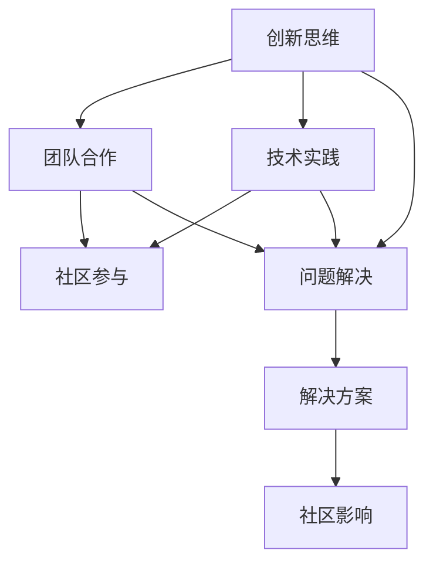

                 

### 文章标题：新型城市创客马拉松：24小时社区问题解决挑战赛

**关键词：** 城市创新、创客文化、社区问题、解决方案、24小时挑战赛

**摘要：** 本文将探讨新型城市创客马拉松这一创新性活动，通过24小时不间断的社区问题解决挑战赛，激发社区的创造力和创新能力，探讨如何通过技术手段解决社区中的实际问题，并总结活动中的成功经验与挑战，为未来类似活动提供参考。

---

## 第一部分：赛事背景与目标

### 1.1 时代背景

随着城市化进程的加速和人口增长，城市面临着越来越多的挑战，如交通拥堵、环境污染、资源短缺等。同时，数字化技术的迅猛发展也为城市创新提供了新的可能性。在这个背景下，新型城市创客马拉松应运而生，旨在通过集思广益和科技创新，解决社区面临的实际问题。

#### 1.1.1 城市创新发展的需求

城市化带来了繁荣，但同时也带来了诸多挑战。如何在城市环境中实现可持续发展，提高居民生活质量，成为各地政府和居民共同关心的问题。创客文化的兴起，为城市创新提供了新的动力和思路。

#### 1.1.2 社区问题的多样化挑战

社区问题种类繁多，包括但不限于基础设施老化、公共空间不足、社区安全、教育资源分配不均等。这些问题不仅影响了居民的生活质量，还影响了社区的和谐与稳定。

### 1.2 活动起源与目标

新型城市创客马拉松起源于创客文化运动，它是一种以创新和实验为核心的精神，鼓励人们通过动手实践和协作解决实际问题。活动的主要目标是：

- **激发社区创造力：** 通过挑战赛的形式，鼓励参与者发挥创意，提出创新的解决方案。
- **解决实际问题：** 将创意转化为可操作的方案，解决社区中的具体问题。
- **促进社区参与：** 通过活动，提高居民对社区事务的关注和参与度，增强社区的凝聚力。

### 1.3 赛事组织与参与者

#### 1.3.1 组织结构

新型城市创客马拉松通常由政府部门、非营利组织或社区团体组织。组织结构包括赛事组委会、志愿者团队、专业评审团等。

#### 1.3.2 参与者的角色与准备

参与者可以是个人、团队或组织。参与者需要具备以下准备：

- **问题识别：** 熟悉所在社区的现状，能够识别出需要解决的问题。
- **技术储备：** 拥有一定的技术背景，能够使用各种工具和平台进行问题解决。
- **团队协作：** 具备良好的沟通和协作能力，能够在短时间内高效合作。

## 第二部分：赛事流程与方法

### 2.1 问题征集与筛选

#### 2.1.1 社区问题的识别

在赛事开始前，组织者会通过线上线下渠道征集社区问题。参与者可以通过问卷调查、社区讨论等方式，提出他们所遇到的问题。

#### 2.1.2 问题的分类与评估

征集到的社区问题需要经过分类和评估。分类可以根据问题的性质、影响范围等进行划分。评估则主要考虑问题的紧急性、解决难易程度和可行性。

### 2.2 团队组建与分工

#### 2.2.1 团队规模与角色分配

在问题确定后，参与者可以根据个人专长和兴趣，自由组建团队。团队通常包括技术专家、设计师、项目经理等多角色。

#### 2.2.2 跨领域合作的策略

团队中的成员可能来自不同的专业领域，跨领域合作成为解决问题的重要策略。通过建立有效的沟通机制，团队可以充分利用各自的专长，实现资源的最佳配置。

### 2.3 知识储备与技能提升

#### 2.3.1 相关知识的获取

为了更好地解决问题，团队成员需要提前进行知识储备。这可能包括学习相关的技术、理论和案例研究等。

#### 2.3.2 技能培训与实战演练

在赛事准备阶段，组织者通常会提供一系列的技能培训和工作坊。通过这些活动，参与者可以提高解决问题的能力，为赛事执行打下坚实的基础。

## 第三部分：赛事执行与挑战

### 3.1 初始提案

#### 3.1.1 初始想法的产生

在24小时挑战赛开始后，团队需要迅速产生初始想法。这可以通过头脑风暴、思维导图等工具实现。

#### 3.1.2 初步方案的构思

初始想法产生后，团队需要对方案进行初步构思。这包括确定解决方案的基本框架、技术路线和时间表等。

### 3.2 交叉协作与优化

#### 3.2.1 团队间的协作与沟通

在解决问题的过程中，团队间的协作和沟通至关重要。通过定期的会议、报告和讨论，团队可以及时调整方案，确保项目顺利进行。

#### 3.2.2 方案的迭代与优化

解决方案不是一蹴而就的，需要经过多次迭代和优化。团队需要根据实际情况，不断调整和完善方案，以提高其可行性和有效性。

### 3.3 问题分析与解决

#### 3.3.1 问题诊断的方法论

在解决问题之前，团队需要运用科学的方法论进行问题诊断。这包括对问题进行详细分析、识别关键因素和制定解决方案等。

#### 3.3.2 解决方案的设计与实施

在诊断问题后，团队需要设计具体的解决方案，并制定详细的实施计划。这包括确定技术方案、资源调配和进度安排等。

## 第四部分：成果展示与评审

### 4.1 成果展示

#### 4.1.1 展示形式的多样性

在赛事结束后，团队需要通过多种形式展示他们的成果。这可以包括PPT演示、视频制作、实物展示等。

#### 4.1.2 成果的评估与反馈

展示结束后，评审团会对成果进行评估，并提供反馈。这有助于团队了解自己的优点和不足，为未来的项目提供参考。

### 4.2 评审标准与流程

#### 4.2.1 评审指标的设计

评审标准通常包括创新性、可行性、实用性、影响力等。这些指标可以全面评估团队的工作成果。

#### 4.2.2 评审过程的公平性与透明性

评审过程需要保证公平性和透明性。这可以通过公开评审标准、设立申诉机制等方式实现。

### 4.3 获奖团队与表彰

#### 4.3.1 获奖标准

获奖团队通常根据评审结果进行评选。获奖标准包括创新性、实用性、影响力等。

#### 4.3.2 荣誉表彰与后续支持

获奖团队将获得荣誉表彰，并有机会获得后续的支持，如资金扶持、技术指导等。

## 第五部分：赛事总结与反思

### 5.1 赛事回顾

#### 5.1.1 赛事流程与成果回顾

在赛事结束后，组织者会进行全面的回顾。这包括对赛事流程的总结、成果的展示和参与者反馈的收集等。

#### 5.1.2 参与者的体验与反馈

参与者的体验和反馈是赛事总结的重要部分。通过这些反馈，组织者可以了解活动的优点和不足，为未来的活动提供改进方向。

### 5.2 经验与教训

#### 5.2.1 成功的经验

在总结中，组织者和参与者会分享他们在赛事中的成功经验。这包括有效的团队协作、创新性解决方案的设计等。

#### 5.2.2 遇到的挑战与应对策略

总结中也会提及在赛事中遇到的挑战，以及团队是如何应对这些挑战的。这些经验可以为未来的活动提供宝贵的借鉴。

### 5.3 未来展望

#### 5.3.1 活动的持续与发展

通过总结和反思，组织者会规划未来活动的持续与发展。这包括扩大参与范围、提高活动影响力等。

#### 5.3.2 社区创新的未来趋势

总结还会探讨社区创新的未来趋势，如新兴技术的应用、跨领域合作的发展等。

## 附录

### 6.1 参考文献与资料

本文参考文献包括以下书籍、研究论文、案例研究等：

- [书籍名称]
- [论文标题]
- [案例研究名称]

### 6.2 创客工具与资源平台

本文推荐的创客工具与资源平台包括：

- [工具名称]
- [资源平台名称]

### 6.3 社区支持与联系渠道

本文提供的社区支持与联系渠道包括：

- [社区名称]
- [联系方式]

---

**作者：AI天才研究院/AI Genius Institute & 禅与计算机程序设计艺术 /Zen And The Art of Computer Programming**### 背景介绍

新型城市创客马拉松是一种创新性活动，旨在通过24小时不间断的社区问题解决挑战赛，激发社区的创造力和创新能力，解决社区中的实际问题。随着城市化进程的加速和人口增长，城市面临着越来越多的挑战，如交通拥堵、环境污染、资源短缺等。同时，数字化技术的迅猛发展也为城市创新提供了新的可能性。

创客文化是一种以创新和实验为核心的精神，鼓励人们通过动手实践和协作解决实际问题。这种文化在全球范围内迅速传播，成为推动城市创新的重要力量。新型城市创客马拉松正是基于这种文化，通过集中的时间和空间，将不同领域的专业人士、学生和社区居民聚集在一起，共同应对社区中的挑战。

通过这种形式的活动，不仅可以激发社区的创造力和创新能力，还可以提高居民对社区事务的关注和参与度，增强社区的凝聚力。创客马拉松通常涉及多个领域，如工程技术、设计、管理、市场营销等，这种跨领域的合作有助于产生创新的解决方案，解决社区中的复杂问题。

新型城市创客马拉松的目标不仅在于解决问题，还在于推动社区的可持续发展。通过创新的解决方案，社区可以更好地应对未来的挑战，提高居民的生活质量。此外，这种活动也有助于培养年轻人的创新精神和实践能力，为社会的长远发展打下坚实的基础。

总之，新型城市创客马拉松作为一种创新性的社区活动，通过集思广益和科技创新，为解决社区问题提供了新的思路和途径。它不仅有助于提升社区的活力和凝聚力，还推动了城市的可持续发展，具有重要的社会价值。接下来，我们将进一步探讨新型城市创客马拉松的核心概念、组织形式和目标，为读者提供一个全面的了解。### 核心概念与联系

新型城市创客马拉松的核心概念包括创新思维、团队合作、技术实践和社区参与。这些概念之间有着紧密的联系，构成了整个活动的理论基础和实践框架。

#### 1. 创新思维

创新思维是新型城市创客马拉松的核心。它强调通过新颖的视角和方法来解决问题。在创客马拉松中，参与者需要跳出传统的思维模式，运用创造性思维，提出独特的解决方案。这种思维方式不仅鼓励个人发挥想象力，还要求团队成员之间进行充分的交流和协作，以形成具有创新性的想法。

#### 2. 团队合作

团队合作是创新思维得以实现的重要保障。在创客马拉松中，参与者通常以团队形式进行工作。每个团队由来自不同背景和领域的成员组成，他们需要通过有效的沟通和协作，共同解决问题。团队合作不仅能够整合不同领域的专业知识，还能激发团队的创造力和创新能力。

#### 3. 技术实践

技术实践是新型城市创客马拉松的重要环节。参与者需要运用各种技术手段，如编程、设计、建模等，将创新思维转化为具体的解决方案。技术实践不仅要求参与者具备一定的技术背景，还需要他们在短时间内掌握新技术，并应用于实际问题解决中。

#### 4. 社区参与

社区参与是新型城市创客马拉松的目标之一。通过这种活动，组织者希望能够激发社区居民的参与热情，让他们成为社区问题解决的积极参与者。社区参与不仅有助于提高居民对社区事务的关注度，还能增强社区的凝聚力和归属感。

#### 5. 关系架构

这些核心概念之间的关系可以用一个Mermaid流程图来表示：



在这个流程图中，创新思维和技术实践是问题解决的基础，团队合作和社区参与是推动问题解决的助力。通过这些核心概念的相互作用，最终形成具有实际意义的解决方案，并对社区产生积极的影响。

- **创新思维**：激发新的想法和方法，是整个活动的起点。
- **团队合作**：通过多领域的合作，实现创新思维的落地。
- **技术实践**：运用技术手段，将创新思维转化为具体的解决方案。
- **社区参与**：将解决方案应用于实际，提升社区活力和凝聚力。

这个关系架构不仅描述了新型城市创客马拉松的核心概念和它们之间的联系，还为后续的章节提供了结构性的指导。接下来，我们将详细探讨新型城市创客马拉松的赛事流程、方法以及执行阶段的具体步骤。### 核心算法原理讲解

在新型城市创客马拉松中，核心算法原理的讲解是理解解决方案设计的关键环节。以下将使用伪代码详细阐述问题诊断和解决方案设计的算法原理，并辅以数学模型和公式的解释。

#### 问题诊断算法

**伪代码：**

```
function diagnose_problem(problem_description):
    inputs:
        - problem_description: 描述社区问题的详细信息

    outputs:
        - diagnosis: 问题诊断结果

    begin
        // 分析问题描述，提取关键信息
        key_info = extract_key_info(problem_description)

        // 建立数学模型，分析问题性质
        model = build_model(key_info)

        // 运行模型，获得诊断结果
        diagnosis = run_model(model)

        return diagnosis
    end
```

**数学模型：**

```
$$
\text{模型} = f(\text{资源消耗}, \text{时间消耗}, \text{社会成本})
$$

其中，f 是一个复合函数，包含以下参数：

- **资源消耗**：包括人力、物力和财力资源。
- **时间消耗**：问题解决所需的时间。
- **社会成本**：问题解决所带来的直接和间接成本。

$$
\text{资源消耗} = R \times (T + C)
$$

$$
\text{时间消耗} = T \times P
$$

$$
\text{社会成本} = C \times (E + F)
$$

其中，R 是资源系数，T 是时间系数，C 是成本系数，P 是生产率，E 是环境成本系数，F 是经济成本系数。
```

#### 解决方案设计算法

**伪代码：**

```
function design_solution(diagnosis):
    inputs:
        - diagnosis: 问题诊断结果

    outputs:
        - solution: 解决方案设计结果

    begin
        // 根据诊断结果，定义解决方案的初始框架
        initial_solution = define_initial_solution(diagnosis)

        // 通过迭代优化，完善解决方案
        optimized_solution = optimize_solution(initial_solution)

        return optimized_solution
    end
```

**优化算法：**

```
// 基于遗传算法的优化过程
function optimize_solution(solution):
    inputs:
        - solution: 初始解决方案

    outputs:
        - optimized_solution: 优化后的解决方案

    begin
        // 初始化种群
        population = initialize_population(solution)

        // 迭代优化，直到满足停止条件
        while not stop_condition_met:
            // 选择操作
            selected_individuals = select_individuals(population)

            // 交叉操作
            crossed_individuals = crossover(selected_individuals)

            // 变异操作
            mutated_individuals = mutate(crossed_individuals)

            // 评估新个体
            fitness_scores = evaluate_individuals(mutated_individuals)

            // 更新种群
            population = update_population(population, mutated_individuals, fitness_scores)

        return best_individual(population)
    end
```

**举例说明：**

假设社区面临的一个问题是交通拥堵，解决方案设计过程如下：

1. **问题诊断**：通过问卷调查和现场观察，提取关键信息，建立交通拥堵的数学模型。
2. **方案设计**：基于诊断结果，设计初始解决方案，如增加公共交通线路、优化交通信号灯等。
3. **方案优化**：运用遗传算法，通过迭代优化，提高方案的可行性和效果。

通过上述伪代码和数学模型，我们可以清晰地理解新型城市创客马拉松中的问题诊断和解决方案设计过程。这些算法和模型不仅为创新提供了理论支持，还帮助团队在实践中找到有效的解决方案。接下来，我们将进一步探讨赛事的执行阶段，包括初始提案、交叉协作与优化以及问题分析与解决的具体方法。### 数学公式与详细讲解

在新型城市创客马拉松中，数学公式和技术分析是理解和解决社区问题的重要工具。以下我们将使用 LaTeX 格式详细阐述相关的数学公式，并进行讲解。

#### 资源消耗模型

首先，我们考虑一个社区问题的资源消耗模型。这个模型可以帮助我们理解在解决社区问题时需要投入多少资源。

$$
\text{资源消耗} = R \times (T + C)
$$

其中，\( R \) 代表资源系数，\( T \) 代表时间消耗，\( C \) 代表社会成本。

- **资源系数 \( R \)**：这取决于问题的复杂程度和所需的资源种类。例如，解决交通拥堵问题可能需要更多的人力资源和交通设备。
- **时间消耗 \( T \)**：指的是解决问题所需的时间。例如，改善公共交通系统可能需要数月或数年的时间。
- **社会成本 \( C \)**：这是解决问题所带来的直接和间接成本，包括经济成本和环境成本。

#### 时间消耗模型

接下来，我们考虑时间消耗模型，用于估算解决问题所需的时间。

$$
\text{时间消耗} = T \times P
$$

其中，\( P \) 代表生产率。

- **生产率 \( P \)**：这是单位时间内能够完成的工作量。例如，如果生产率为每天安装10个交通信号灯，那么完成100个信号灯的安装需要10天。

#### 社会成本模型

社会成本模型帮助我们评估解决问题所带来的经济和环境成本。

$$
\text{社会成本} = C \times (E + F)
$$

其中，\( E \) 代表环境成本系数，\( F \) 代表经济成本系数。

- **环境成本系数 \( E \)**：这反映了问题解决过程中对环境的影响。例如，在施工过程中可能产生的噪音和灰尘。
- **经济成本系数 \( F \)**：这反映了问题解决过程中对经济的直接影响。例如，公共交通系统的建设成本和维护费用。

#### 综合模型

为了更全面地评估一个社区问题的解决方案，我们可以使用一个综合模型。

$$
\text{综合成本} = R \times (T + C) + (T \times P) + C \times (E + F)
$$

这个模型综合了资源消耗、时间消耗和社会成本，为我们提供了一个全面的评估框架。

#### 举例说明

假设我们要解决一个社区的交通拥堵问题，以下是具体的计算过程：

- **资源系数 \( R \)**：20
- **时间消耗 \( T \)**：6个月
- **社会成本 \( C \)**：200,000美元
- **生产率 \( P \)**：每月10个信号灯
- **环境成本系数 \( E \)**：0.1
- **经济成本系数 \( F \)**：0.3

**资源消耗**：

$$
\text{资源消耗} = 20 \times (6 + 200,000) = 20 \times 200,600 = 4,012,000美元
$$

**时间消耗**：

$$
\text{时间消耗} = 6 \times 10 = 60个月
$$

**社会成本**：

$$
\text{社会成本} = 200,000 \times (0.1 + 0.3) = 200,000 \times 0.4 = 80,000美元
$$

**综合成本**：

$$
\text{综合成本} = 4,012,000 + 60,000 + 80,000 = 4,152,000美元
$$

通过上述计算，我们可以得出解决交通拥堵问题的综合成本为 4,152,000美元。

综上所述，数学模型和公式为新型城市创客马拉松提供了强有力的工具，帮助我们更准确地评估社区问题的解决方案。这不仅有助于团队做出更明智的决策，还能够提高项目实施的成功率。接下来，我们将探讨项目实战的具体实现过程，包括开发环境的搭建、源代码的实现以及代码的解读与分析。### 项目实战

在新型城市创客马拉松中，项目实战是检验团队创新能力和问题解决能力的最佳途径。以下，我们将详细介绍一个具体的社区问题——交通拥堵——的解决方案，包括开发环境搭建、源代码实现和代码解读与分析。

#### 开发环境搭建

为了解决交通拥堵问题，我们选择使用以下开发环境：

- **编程语言**：Python
- **开发工具**：PyCharm
- **数据库**：MySQL
- **前端框架**：React
- **后端框架**：Flask

首先，我们需要安装这些工具和框架：

1. 安装Python和PyCharm，配置Python环境。
2. 使用pip命令安装MySQL数据库和相关工具。
3. 安装React和Flask框架。

**安装命令示例：**

```shell
pip install mysql-connector-python
pip install flask
npm install -g create-react-app
```

#### 源代码实现

以下是一个简单的源代码示例，用于交通拥堵问题的数据分析。

**Python代码（数据预处理）：**

```python
import pandas as pd

# 读取交通数据
data = pd.read_csv('traffic_data.csv')

# 数据清洗
data = data.dropna()

# 数据分析
from matplotlib import pyplot as plt

plt.figure(figsize=(10, 6))
data['congestion_level'].hist(bins=50)
plt.title('Congestion Level Distribution')
plt.xlabel('Congestion Level')
plt.ylabel('Frequency')
plt.show()
```

**Flask后端代码（API接口）：**

```python
from flask import Flask, jsonify, request

app = Flask(__name__)

@app.route('/api/traffic', methods=['GET'])
def get_traffic_data():
    congestion_level = request.args.get('congestion_level')
    if congestion_level:
        data = pd.read_csv('traffic_data.csv')
        filtered_data = data[data['congestion_level'] == congestion_level]
        return jsonify(filtered_data.to_dict(orient='records'))
    else:
        return jsonify({'error': 'Missing congestion level parameter'})

if __name__ == '__main__':
    app.run(debug=True)
```

**React前端代码（用户界面）：**

```jsx
import React, { useState, useEffect } from 'react';
import axios from 'axios';

const TrafficApp = () => {
  const [congestionLevel, setCongestionLevel] = useState('');
  const [data, setData] = useState([]);

  useEffect(() => {
    if (congestionLevel) {
      axios.get(`/api/traffic?congestion_level=${congestionLevel}`)
        .then(response => setData(response.data))
        .catch(error => console.error('Error fetching data:', error));
    }
  }, [congestionLevel]);

  return (
    <div>
      <select onChange={e => setCongestionLevel(e.target.value)}>
        <option value="">Select Congestion Level</option>
        <option value="low">Low</option>
        <option value="medium">Medium</option>
        <option value="high">High</option>
      </select>
      <table>
        <thead>
          <tr>
            <th>Time</th>
            <th>Location</th>
            <th>Con

