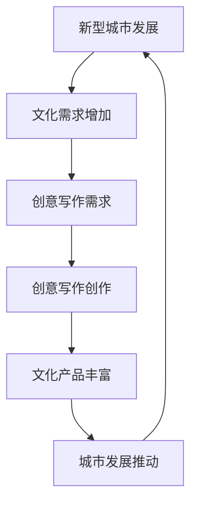

                 


### 文章标题
《新型城市创意写作训练营：跨媒体叙事的实验性创作工坊》

### 文章关键词
新型城市，创意写作，跨媒体叙事，实验性创作，培训工坊，叙事学，跨领域协作，技术创新

### 文章摘要
本文深入探讨了新型城市创意写作训练营的概念、目标、方法和实践，特别是跨媒体叙事的实验性创作工坊。文章首先介绍了新型城市的发展背景和创意写作的重要性，然后详细阐述了创意写作的核心概念与原则，以及跨媒体叙事的特点与发展趋势。接着，文章从基础训练方法和实践训练方法两个方面，系统地介绍了创意写作的训练方法。在此基础上，文章详细描述了实验性创作工坊的组织与流程，并通过具体案例展示了跨媒体叙事创作实践。最后，文章对创意写作的未来发展趋势进行了展望，并提出了提升创意写作能力的建议。

### 目录大纲

**第一部分：城市创意写作概述**
1. 新型城市背景与创意写作的重要性
    1.1 新型城市的发展特点
    1.2 创意写作在新型城市中的角色与价值
    1.3 创意写作与新型城市的互动关系（Mermaid流程图）
2. 创意写作的核心概念与原则
    2.1 创意写作的定义与分类
    2.2 创意写作的基本原则与方法
    2.3 创意写作的核心概念联系（Mermaid流程图）

**第二部分：创意写作训练方法**
3. 基础训练方法
    3.1 文字写作训练
        3.1.1 文字表达的准确性与多样性
        3.1.2 逻辑思维与叙事技巧
        3.1.3 文本多样性的度量（数学公式）
    3.2 视觉艺术训练
        3.2.1 视觉元素的运用
        3.2.2 色彩与构图的艺术
        3.2.3 视觉叙事技巧
    3.3 声音与音乐训练
        3.3.1 声音效果的创造
        3.3.2 音乐的叙事功能
        3.3.3 声音与文字的融合

4. 实践训练方法
    4.1 项目式学习
        4.1.1 项目设计与执行
        4.1.2 项目评价与反馈
        4.1.3 项目式学习的优势（伪代码）
    4.2 模拟训练
        4.2.1 虚拟场景模拟
        4.2.2 情境角色扮演
        4.2.3 模拟训练的评价指标（数学公式）

5. 创新思维训练
    5.1 思维导图法
        5.1.1 思维导图的基本原理
        5.1.2 思维导图在创意写作中的应用
        5.1.3 思维导图的绘制技巧
    5.2 奇异构思法
        5.2.1 奇异构思的概念
        5.2.2 奇异构思的技巧
        5.2.3 奇异构思的应用案例
    5.3 逆向思维训练
        5.3.1 逆向思维的基本原理
        5.3.2 逆向思维的技巧
        5.3.3 逆向思维的应用场景

**第三部分：实验性创作工坊**
6. 实验性创作工坊概述
    6.1 工坊的宗旨与目标
    6.2 工作坊的组织与流程
    6.3 工作坊的优势与挑战
7. 跨媒体叙事创作实践
    7.1 创作项目的启动
    7.2 创作过程中的协作
    7.3 成品的展示与评价
    7.4 案例分享与反思
8. 创意写作与科技融合
    8.1 人工智能在创意写作中的应用
    8.2 虚拟现实与增强现实在创意写作中的应用
    8.3 大数据和云计算在创意写作中的应用

**第四部分：创意写作的未来**
9. 创意写作的发展趋势
    9.1 技术对创意写作的影响
    9.2 新型城市中的创意写作前景
    9.3 创意写作与其他领域的交叉融合
10. 提升创意写作能力的策略
    10.1 个体层面的提升策略
    10.2 组织层面的提升策略
    10.3 社会层面的提升策略
11. 结束语
    11.1 总结与展望
    11.2 提升创意写作能力的建议

### 第一部分：城市创意写作概述
**1.1 新型城市背景与创意写作的重要性**
新型城市的发展特点包括快速城市化、科技融合、文化多样性和经济多元化。这些特点为创意写作提供了丰富的土壤和无限的可能。创意写作在新型城市中的角色和价值主要体现在以下几个方面：
- **推动城市发展**：创意写作能够激发城市的活力，提升城市的形象和竞争力。
- **促进文化传承**：创意写作是文化传承和创新的重要载体，有助于保护和发扬城市的文化特色。
- **提升生活质量**：创意写作能够丰富市民的精神世界，提高市民的生活质量。

**1.2 创意写作的核心概念与原则**
创意写作是一门结合了文学、艺术和技术的跨学科领域。其核心概念包括创意思维、叙事技巧、表达形式和受众互动。创意写作的基本原则包括：
- **创新性**：创意写作追求创新和突破，鼓励作者打破常规，创造独特的作品。
- **故事性**：创意写作强调故事的核心地位，注重情节的连贯性和情感的深度。
- **个性化**：创意写作鼓励作者发挥个性，表达独特的视角和感受。

**1.3 创意写作与新型城市的互动关系**
创意写作与新型城市的互动关系可以用Mermaid流程图来表示：



### 第二部分：创意写作训练方法
**2.1 基础训练方法**
**3.1 文字写作训练**
文字写作训练是创意写作的基础，主要包括以下几个方面：
- **准确性与多样性**：提高文字表达的准确性和多样性，避免单调乏味的文字表达。
- **逻辑思维与叙事技巧**：培养逻辑思维和叙事技巧，使故事更加引人入胜。
- **文本多样性的度量**：使用数学公式来度量文本多样性，提高作品的质量和吸引力。

数学公式：文本多样性的度量公式为
$$
D = \frac{N}{V} \log_2(V)
$$
其中，$D$ 表示文本多样性，$N$ 表示词汇量，$V$ 表示词汇集合。

**3.2 视觉艺术训练**
视觉艺术训练是创意写作的重要组成部分，包括以下几个方面：
- **视觉元素的运用**：学会运用视觉元素，如颜色、形状、线条等，增强作品的表现力。
- **色彩与构图的艺术**：掌握色彩和构图的艺术，提高作品的美感。
- **视觉叙事技巧**：学会使用视觉叙事技巧，使作品更具故事性。

**3.3 声音与音乐训练**
声音与音乐训练是创意写作中的另一项重要技能，包括以下几个方面：
- **声音效果的创造**：学会创造不同的声音效果，增强作品的氛围感。
- **音乐的叙事功能**：理解音乐的叙事功能，将音乐与文字相结合，增强作品的艺术感染力。
- **声音与文字的融合**：学会将声音与文字融合，创造全新的艺术体验。

### 第二部分：创意写作训练方法（续）
**4. 实践训练方法**
**4.1 项目式学习**
项目式学习是一种以项目为核心的学习方法，它强调学生在实际项目中运用所学知识，培养实践能力和创新能力。项目式学习在创意写作训练中的应用主要包括以下几个方面：

- **项目设计与执行**：学生需要设计一个创意写作项目，明确项目的目标、内容和执行计划。
- **项目评价与反馈**：在项目完成后，对项目进行评价和反馈，以便学生了解自己的优势和不足，不断改进。

伪代码示例：
```python
def project_based_learning(project_details, evaluation_criteria):
    # 设计项目
    design_project(project_details)
    # 执行项目
    execute_project(project_details)
    # 评价项目
    evaluate_project(project_details, evaluation_criteria)
    # 反馈与改进
    provide_feedback(project_details)
    improve_project(project_details)
```

**4.2 模拟训练**
模拟训练是一种在虚拟环境中进行训练的方法，它可以帮助学生熟悉创意写作的过程和技巧。模拟训练在创意写作训练中的应用主要包括以下几个方面：

- **虚拟场景模拟**：创建一个虚拟写作场景，让学生在其中进行写作实践。
- **情境角色扮演**：让学生扮演不同的角色，进行角色间的互动和对话，提高叙事能力。
- **模拟训练的评价指标**：设计一套评价指标，对学生的模拟训练效果进行评估。

数学公式示例：
$$
E = \frac{S}{T} \times 100
$$
其中，$E$ 表示训练效果，$S$ 表示学生完成任务的分数，$T$ 表示总分数。

### 第二部分：创意写作训练方法（续）
**5. 创新思维训练**
创新思维训练是创意写作训练中至关重要的一部分，它旨在培养学生的创造性思维和创新能力。以下是几种常见的创新思维训练方法：

**5.1 思维导图法**
思维导图法是一种以图形化方式表达思维的工具，它可以帮助学生整理思绪，激发创意。以下是思维导图法在创意写作训练中的应用：

- **思维导图的基本原理**：理解思维导图的基本原理，如分支结构、关键词和颜色等。
- **思维导图在创意写作中的应用**：使用思维导图来构思故事情节、设计角色和创造创意想法。
- **思维导图的绘制技巧**：掌握绘制思维导图的技巧，提高思维导图的质量。

**5.2 奇异构思法**
奇异构思法是一种通过挑战常规、寻找异常和意外来激发创意的方法。以下是奇异构思法在创意写作训练中的应用：

- **奇异构思的概念**：理解奇异构思的概念，如反常思维、创造性思维和跨领域思考。
- **奇异构思的技巧**：学习使用奇异构思的技巧，如反转思维、扩展思维和组合思维。
- **奇异构思的应用案例**：通过实际案例来展示奇异构思的应用效果。

**5.3 逆向思维训练**
逆向思维训练是一种通过反向思考来激发创意的方法。以下是逆向思维训练在创意写作训练中的应用：

- **逆向思维的基本原理**：理解逆向思维的基本原理，如逆反性、批判性和创造性。
- **逆向思维的技巧**：学习使用逆向思维的技巧，如反向思考、批判性思考和创造性思考。
- **逆向思维的应用场景**：通过实际案例来展示逆向思维的应用效果。

### 第三部分：实验性创作工坊
**6. 实验性创作工坊概述**
实验性创作工坊是一种结合了创意写作、艺术和技术的新型创作模式。它旨在通过实验性创作的方式，激发学生的创造力，提升他们的写作技巧和艺术表现力。以下是实验性创作工坊的概述：

**6.1 工坊的宗旨与目标**
实验性创作工坊的宗旨是鼓励学生大胆创新，探索新的写作方式和艺术表达形式。其目标包括：

- **培养学生的创造性思维**：通过实验性创作，激发学生的创造力，培养他们的创新精神。
- **提升学生的写作技巧**：通过实践训练，提高学生的写作技巧和艺术表现力。
- **促进跨学科合作**：鼓励学生跨学科合作，探索不同领域之间的融合与互动。

**6.2 工作坊的组织与流程**
实验性创作工坊的组织与流程通常包括以下几个阶段：

- **项目启动阶段**：确定创作主题，分配角色和任务，制定创作计划和目标。
- **创作过程阶段**：在创作过程中，学生需要不断交流和讨论，共同构思和创作。
- **成品展示阶段**：在创作完成后，进行成品展示和评价，分享创作经验和成果。
- **反馈与改进阶段**：对创作过程和成品进行评价和反馈，总结经验教训，提出改进建议。

**6.3 工作坊的优势与挑战**
实验性创作工坊的优势包括：

- **激发创造力**：通过实验性创作，学生可以大胆尝试和创新，激发他们的创造力。
- **提升写作技巧**：通过实践训练，学生可以不断提升自己的写作技巧和艺术表现力。
- **促进跨学科合作**：学生可以通过跨学科合作，学习不同的知识和技能，提高综合素质。

然而，实验性创作工坊也面临一些挑战，如：

- **协调与沟通**：在创作过程中，学生需要保持良好的协调和沟通，以达成共识和协同创作。
- **时间与资源的分配**：实验性创作工坊通常需要较多的时间和资源投入，需要合理分配和利用。
- **评价与反馈**：如何公正、客观地评价学生的创作成果，提供有针对性的反馈和指导，是一个需要关注的问题。

### 第三部分：实验性创作工坊（续）
**7. 跨媒体叙事创作实践**
跨媒体叙事是一种将文字、图像、声音等多种媒介相结合的叙事方式，它能够创造出一个更加丰富、多元和沉浸式的叙事体验。以下是跨媒体叙事创作实践的具体内容：

**7.1 创作项目的启动**
创作项目的启动是跨媒体叙事创作实践的第一步，主要包括以下几个方面：

- **项目主题确定**：确定一个具有吸引力和创意性的项目主题，以引导整个创作过程。
- **团队组建**：组建一个由不同专业背景和技能的学生组成的团队，以便在创作过程中进行跨学科合作。
- **任务分配**：明确每个团队成员的任务和职责，确保每个人都能充分发挥自己的优势和才能。

**7.2 创作过程中的协作**
在创作过程中，团队协作至关重要，主要包括以下几个方面：

- **沟通与协调**：保持良好的沟通和协调，及时解决问题和冲突，确保创作过程顺利进行。
- **内容整合**：将不同媒介的内容进行整合，使它们在叙事中相互补充和强化，创造出一个完整、连贯的故事。
- **技术支持**：利用各种技术和工具，如虚拟现实、增强现实、交互设计等，为创作过程提供技术支持。

**7.3 成品的展示与评价**
创作完成后，成品的展示与评价是跨媒体叙事创作实践的最后一环，主要包括以下几个方面：

- **成品展示**：通过线上或线下的方式，展示创作的成品，让观众体验和感受跨媒体叙事的魅力。
- **评价与反馈**：收集观众的评价和反馈，对成品进行评价和改进，以提升创作的质量和影响力。
- **反思与总结**：对整个创作过程进行反思和总结，分享创作经验和教训，为今后的创作提供借鉴和启示。

### 第三部分：实验性创作工坊（续）
**8. 创意写作与科技融合**
随着科技的不断发展，创意写作与科技的融合越来越紧密，这为创意写作带来了新的机遇和挑战。以下是创意写作与科技融合的具体内容：

**8.1 人工智能在创意写作中的应用**
人工智能在创意写作中的应用主要包括以下几个方面：

- **故事生成**：利用自然语言处理技术，生成具有创意和逻辑性的故事。
- **写作辅助**：利用语言模型和生成式预训练技术，为作者提供写作灵感和建议。
- **智能编辑**：利用人工智能技术，对文本进行自动修改和优化，提高作品的质量。

**8.2 虚拟现实与增强现实在创意写作中的应用**
虚拟现实和增强现实在创意写作中的应用主要包括以下几个方面：

- **沉浸式叙事**：利用虚拟现实和增强现实技术，创造一个沉浸式的叙事环境，提高读者的体验和感受。
- **交互式写作**：利用虚拟现实和增强现实技术，实现读者与故事的互动，创造一个更加丰富和动态的叙事体验。
- **艺术表现**：利用虚拟现实和增强现实技术，创造出独特的艺术表现形式，提高作品的艺术价值。

**8.3 大数据和云计算在创意写作中的应用**
大数据和云计算在创意写作中的应用主要包括以下几个方面：

- **数据挖掘**：利用大数据技术，挖掘和分析读者的喜好和需求，为创意写作提供数据支持和指导。
- **云存储**：利用云计算技术，实现文本、图像、音频等多媒体数据的存储和管理，提高写作效率和安全性。
- **智能推荐**：利用大数据和人工智能技术，为读者推荐个性化、个性化的阅读内容，提升阅读体验。

### 第四部分：创意写作的未来
**9. 创意写作的发展趋势**
随着科技的不断进步和社会的快速发展，创意写作也在不断演变和进步。以下是创意写作的未来发展趋势：

**9.1 技术对创意写作的影响**
- **人工智能**：人工智能技术将在创意写作中发挥越来越重要的作用，从故事生成到写作辅助，再到智能编辑，人工智能将为创意写作带来新的变革。
- **虚拟现实和增强现实**：虚拟现实和增强现实技术将使创意写作的叙事方式更加多样化和沉浸式，为读者提供全新的阅读体验。
- **大数据和云计算**：大数据和云计算技术将为创意写作提供丰富的数据支持和强大的计算能力，使创意写作更加智能和个性化。

**9.2 新型城市中的创意写作前景**
新型城市的发展为创意写作提供了广阔的舞台，创意写作将在新型城市中发挥更加重要的作用。以下是创意写作在新型城市中的前景：

- **文化创新**：创意写作将成为新型城市文化创新的重要力量，推动城市文化的繁荣和发展。
- **经济贡献**：创意写作将带动新型城市文化产业的发展，成为城市经济的重要组成部分。
- **社会影响力**：创意写作将提高市民的文化素养和审美能力，提升城市的社会文明程度。

**9.3 创意写作与其他领域的交叉融合**
创意写作与其他领域的交叉融合将成为未来发展的趋势，以下是一些具体的交叉融合领域：

- **艺术与科技**：艺术与科技的融合将带来新的创作方式和表现形式，为创意写作注入新的活力。
- **媒体与传播**：创意写作与媒体的融合将使作品更广泛地传播和影响，提高创意写作的社会影响力。
- **教育与培训**：创意写作与教育的融合将为更多人提供学习和实践的机会，培养更多的创意人才。

### 第四部分：创意写作的未来（续）
**10. 提升创意写作能力的策略**
随着创意写作在新型城市中的重要性日益凸显，提升创意写作能力成为了一个重要的课题。以下是几种提升创意写作能力的策略：

**10.1 个体层面的提升策略**
- **持续学习与自我提升**：创意写作是一个不断学习和进步的过程，个体需要保持持续学习的态度，不断提升自己的知识和技能。
- **多读多写**：阅读优秀的作品，学习他人的写作技巧和风格，同时多写多练，提高写作能力。
- **培养批判性思维**：培养批判性思维，学会独立思考和判断，提高创意写作的深度和广度。
- **参与写作社群**：加入写作社群，与同行交流和学习，获取反馈和建议，不断改进自己的写作。

**10.2 组织层面的提升策略**
- **建立创意写作平台**：组织可以建立创意写作平台，为员工提供学习和实践的机会，促进创意写作的交流和合作。
- **组织写作工作坊**：定期组织写作工作坊，邀请专业作家和创意人士分享经验和技巧，激发员工的创造力。
- **设立创意写作奖项**：设立创意写作奖项，鼓励员工进行创意写作，提升整体创意写作水平。
- **提供技术支持**：为员工提供必要的技术支持，如人工智能写作助手、虚拟现实创作工具等，提高创意写作的效率和质量。

**10.3 社会层面的提升策略**
- **推广创意写作教育**：教育部门可以推广创意写作教育，将创意写作纳入课程体系，培养学生的创意写作能力。
- **建立创意写作基地**：建立创意写作基地，为作家和创意人士提供创作空间和资源支持，促进创意写作的发展。
- **鼓励跨界合作**：鼓励不同领域的人才进行跨界合作，融合不同的创意和观点，创造更多有价值的作品。
- **加强文化保护与传承**：加强对传统文化和地方文化的保护与传承，为创意写作提供丰富的素材和灵感。

### 结束语
**11.1 总结与展望**
本文深入探讨了新型城市创意写作训练营的概念、目标、方法和实践，特别是跨媒体叙事的实验性创作工坊。通过本文的探讨，我们可以看到，创意写作在新型城市中具有重要的角色和价值，它不仅能够推动城市发展，促进文化传承，还能提升市民的生活质量。随着科技的不断发展，创意写作的未来充满了无限可能。

**11.2 提升创意写作能力的建议**
为了提升创意写作能力，我们提出了以下建议：
- **个体层面**：持续学习，多读多写，培养批判性思维，参与写作社群。
- **组织层面**：建立创意写作平台，组织写作工作坊，设立创意写作奖项，提供技术支持。
- **社会层面**：推广创意写作教育，建立创意写作基地，鼓励跨界合作，加强文化保护与传承。

通过这些策略的实施，我们可以期待创意写作在未来发挥更大的作用，为新型城市的发展和文化繁荣贡献力量。

### 附录
**A. 伪代码示例**
以下是一个简单的伪代码示例，用于说明创意写作的训练过程：

```python
def creative_writing_training():
    # 初始化训练参数
    words = ["创造", "思维", "叙事", "表达"]
    themes = ["城市生活", "科技创新", "文化传承"]
    # 循环进行训练
    for word in words:
        for theme in themes:
            write_based_on_theme(word, theme)
    # 评估训练效果
    evaluate_training效果()
```

**B. 数学公式与解释**
以下是一些在本文中使用的数学公式及其解释：

1. **文本多样性的度量公式**
   $$
   D = \frac{N}{V} \log_2(V)
   $$
   其中，$D$ 表示文本多样性，$N$ 表示词汇量，$V$ 表示词汇集合。这个公式用于衡量文本的丰富程度。

2. **项目式学习的评价指标**
   $$
   E = \frac{S}{T} \times 100
   $$
   其中，$E$ 表示训练效果，$S$ 表示学生完成任务的分数，$T$ 表示总分数。这个公式用于评估学生在项目式学习中的表现。

**C. 实际案例分析**
以下是一个实际案例的分析，用于说明跨媒体叙事的创作过程：

**案例**：一个以“未来城市”为主题的故事。

**分析**：
1. **故事情节**：故事描述了一个未来的城市，城市中的建筑和交通全部由人工智能控制，人们的生活变得高度自动化。
2. **视觉元素**：故事中使用了大量的视觉元素，如高楼大厦、自动驾驶汽车、智能穿戴设备等，来描绘未来城市的景象。
3. **声音与音乐**：故事中使用了未来的城市音乐，配合场景的转换，增强读者的沉浸感。
4. **跨媒体叙事**：故事通过文字、图像和声音等多种媒介，创造了一个完整、连贯的未来城市叙事。

**结论**：这个案例展示了跨媒体叙事的优势，通过多种媒介的结合，使故事更加丰富和生动。

**D. 拓展阅读**
为了更深入地了解创意写作和跨媒体叙事，以下是一些拓展阅读的建议：

1. **书籍**：
   - 《创意写作教程》
   - 《跨媒体叙事》
   - 《城市文化学导论》

2. **文章**：
   - 《人工智能在创意写作中的应用》
   - 《虚拟现实与增强现实在创意写作中的应用》
   - 《大数据与创意写作》

3. **网站**：
   - https://www.creativewritingcourses.com/
   - https://www.futureofstorytelling.com/
   - https://www.aiga.org/

通过这些阅读材料，读者可以进一步了解创意写作和跨媒体叙事的理论和实践。

