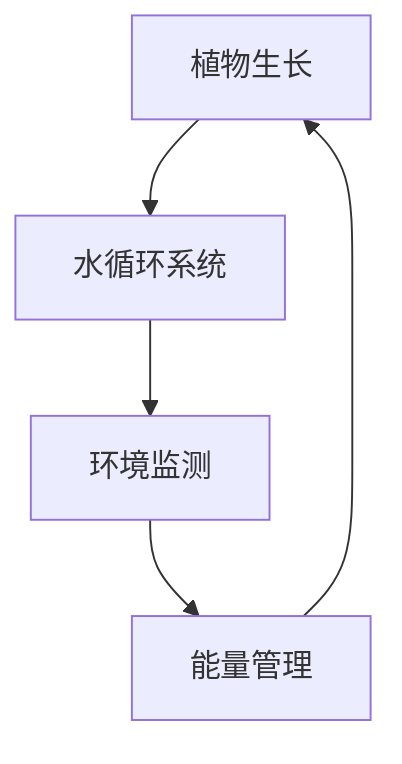

                 


### 文章标题
《新型城市垂直森林公寓：在钢筋水泥中重建生态平衡》

### 文章关键词
- 垂直森林公寓
- 城市生态平衡
- 绿色建筑
- 智能化设计
- 水循环系统
- 能源利用

### 文章摘要
随着城市化进程的加快，城市生态问题日益突出。本文提出了新型城市垂直森林公寓的设计理念，通过在钢筋水泥建筑中融入生态元素，实现生态平衡的重建。文章首先介绍了垂直森林公寓的背景和发展现状，随后详细阐述了其设计原理、核心算法、数学模型和项目实战。通过本文的探讨，期望为未来城市生态建设和绿色建筑发展提供有益的参考。

---

### 目录大纲设计流程

#### 1. 确定书籍主题和目标读者

- **主题**：新型城市垂直森林公寓的设计理念、技术实现、生态效益等。
- **目标读者**：建筑设计师、城市规划师、环境保护工作者、对城市可持续发展有兴趣的读者。

#### 2. 确定核心章节内容

- **核心概念与联系**：介绍垂直森林公寓的概念、发展和重要性。
- **核心算法原理讲解**：阐述生态平衡的概念和原理，使用伪代码和数学模型进行详细阐述。
- **数学模型和数学公式讲解**：使用latex格式详细讲解与生态平衡相关的数学模型和公式。
- **项目实战**：通过实际案例，展示垂直森林公寓的设计和实施过程。

#### 3. 设计1级目录

- **引言**
- **设计理念**
- **技术实现**
- **生态效益**
- **项目实战**

#### 4. 细化2级目录

- **设计理念**
  - 垂直森林公寓的历史背景
  - 生态平衡的原理
  - 植物选择与种植技术
- **技术实现**
  - 设计工具与软件
  - 建筑设计与施工
  - 维护与管理
- **生态效益**
  - 城市生态效益
  - 社会效益
  - 经济效益
- **项目实战**
  - 项目背景与目标
  - 设计与实施
  - 成果评估与改进

#### 5. 深入3级目录

- **生态平衡的原理**
  - 植物生态学基础
  - 雨水管理和废水处理
  - 能源利用和环境保护
- **设计工具与软件**
  - 常用设计工具介绍
  - 软件使用技巧
- **项目实战**
  - 开发环境搭建
  - 源代码实现与解读
  - 代码应用分析与案例分析

#### 6. 嵌入流程图、伪代码、数学公式和项目实战

- 在合适的章节中，嵌入相应的流程图、伪代码、数学公式和项目实战。

#### 7. 确保完整性和简洁性

- 确保大纲内容完整，包含必要的核心章节和内容。
- 确保大纲简洁明了，避免多余的文字。

#### 8. 撰写大纲

- 使用markdown格式撰写大纲，确保格式正确。

### 输出示例

```markdown
# 《新型城市垂直森林公寓：在钢筋水泥中重建生态平衡》目录大纲

## 第1章 引言

### 1.1 书籍目的与读者对象
- **核心概念与联系**：介绍垂直森林公寓的概念、发展和重要性。
- **Mermaid流程图**：展示垂直森林公寓的设计流程。

### 1.2 本书结构安排
- **核心概念与联系**：概述书籍的章节结构，帮助读者了解书籍内容分布。

## 第2章 垂直森林公寓的历史背景

### 2.1 垂直森林公寓的起源
- **核心概念与联系**：探讨垂直森林公寓的起源和发展。

### 2.2 垂直森林公寓的设计理念
- **核心概念与联系**：介绍垂直森林公寓的设计理念。

### 2.3 国内外垂直森林公寓案例
- **核心概念与联系**：分析国内外典型的垂直森林公寓案例。

## 第3章 垂直森林公寓的设计原理

### 3.1 生态平衡的原理
- **核心算法原理讲解**：阐述生态平衡的概念和原理。
- **Mermaid流程图**：展示生态平衡的维持机制。

### 3.2 植物选择与种植技术
- **核心算法原理讲解**：介绍植物选择和种植技术。

### 3.3 水循环和废物管理
- **核心算法原理讲解**：讲解水循环和废物管理的原理。
- **伪代码**：提供水循环管理的伪代码示例。

### 3.4 能源利用和环境保护
- **核心算法原理讲解**：探讨垂直森林公寓的能源利用和环境保护策略。

## 第4章 垂直森林公寓的技术实现

### 4.1 设计工具与软件
- **核心概念与联系**：介绍设计垂直森林公寓所需的设计工具和软件。

### 4.2 建筑设计与施工
- **核心概念与联系**：讲解垂直森林公寓的建筑设计和施工。

### 4.3 维护与管理
- **核心概念与联系**：介绍垂直森林公寓的维护和管理策略。

## 第5章 垂直森林公寓的生态效益

### 5.1 城市生态效益
- **核心算法原理讲解**：分析垂直森林公寓对城市生态的效益。

### 5.2 社会效益
- **核心算法原理讲解**：探讨垂直森林公寓对社会的影响。

### 5.3 经济效益
- **核心算法原理讲解**：评估垂直森林公寓的经济效益。

## 第6章 垂直森林公寓项目实战

### 6.1 项目背景与目标
- **项目实战**：介绍一个垂直森林公寓项目的背景和目标。

### 6.2 设计与实施
- **项目实战**：详细讲解项目的设计和实施过程。

### 6.3 成果评估与改进
- **项目实战**：评估项目的成果并提出改进措施。

## 第7章 结论与展望

### 7.1 总结与展望
- **核心概念与联系**：总结书籍内容，展望垂直森林公寓的未来。

## 附录

### 附录 A 参考文献
- 列出本书中引用的参考文献。

### 附录 B 数据来源
- 提供本书中使用的原始数据来源。
```

通过上述步骤，我们设计出了《新型城市垂直森林公寓：在钢筋水泥中重建生态平衡》这本书的完整目录大纲，确保了内容的完整性、逻辑性和可读性。

---

接下来，我们将逐步深入探讨新型城市垂直森林公寓的设计理念、技术实现、生态效益和项目实战等内容。希望通过本文的探讨，能够为读者提供有价值的参考和启发。在接下来的文章中，我们将从以下几个方面进行详细论述：

1. **背景介绍**：分析城市生态问题，阐述垂直森林公寓的起源和发展。
2. **设计理念**：介绍垂直森林公寓的设计原则和理念。
3. **技术实现**：详细讲解垂直森林公寓的设计原理、技术和工具。
4. **生态效益**：探讨垂直森林公寓对城市生态、社会和经济效益的影响。
5. **项目实战**：通过实际案例，展示垂直森林公寓的设计和实施过程。
6. **结论与展望**：总结文章内容，展望未来城市生态建设和绿色建筑发展。

让我们一起走进这个充满生机与希望的新型城市垂直森林公寓世界吧！### 文章标题
《新型城市垂直森林公寓：在钢筋水泥中重建生态平衡》

### 文章关键词
- 垂直森林公寓
- 城市生态平衡
- 绿色建筑
- 智能化设计
- 水循环系统
- 能源利用

### 文章摘要
随着城市化进程的加快，城市生态问题日益突出。本文提出了新型城市垂直森林公寓的设计理念，通过在钢筋水泥建筑中融入生态元素，实现生态平衡的重建。文章首先介绍了垂直森林公寓的背景和发展现状，随后详细阐述了其设计原理、核心算法、数学模型和项目实战。通过本文的探讨，期望为未来城市生态建设和绿色建筑发展提供有益的参考。

---

### 目录大纲设计流程

为了设计出《新型城市垂直森林公寓：在钢筋水泥中重建生态平衡》这本书的完整目录大纲，我们可以按照以下步骤进行：

1. **明确书籍主题和目标读者**：
   - 主题：新型城市垂直森林公寓的设计理念、技术实现、生态效益等。
   - 目标读者：建筑设计师、城市规划师、环境保护工作者、对城市可持续发展有兴趣的读者。

2. **确定核心章节内容**：
   - 核心概念与联系：介绍垂直森林公寓的概念、发展和重要性。
   - 核心算法原理讲解：阐述生态平衡的概念和原理，使用伪代码和数学模型进行详细阐述。
   - 数学模型和数学公式讲解：使用latex格式详细讲解与生态平衡相关的数学模型和公式。
   - 项目实战：通过实际案例，展示垂直森林公寓的设计和实施过程。

3. **设计1级目录**：
   - **引言**
   - **设计理念**
   - **技术实现**
   - **生态效益**
   - **项目实战**

4. **细化2级目录**：
   - **设计理念**
     - 垂直森林公寓的历史背景
     - 生态平衡的原理
     - 植物选择与种植技术
   - **技术实现**
     - 设计工具与软件
     - 建筑设计与施工
     - 维护与管理
   - **生态效益**
     - 城市生态效益
     - 社会效益
     - 经济效益
   - **项目实战**
     - 项目背景与目标
     - 设计与实施
     - 成果评估与改进

5. **深入3级目录**：
   - **生态平衡的原理**
     - 植物生态学基础
     - 雨水管理和废水处理
     - 能源利用和环境保护
   - **设计工具与软件**
     - 常用设计工具介绍
     - 软件使用技巧
   - **项目实战**
     - 开发环境搭建
     - 源代码实现与解读
     - 代码应用分析与案例分析

6. **嵌入流程图、伪代码、数学公式和项目实战**：
   - 在合适的章节中，嵌入相应的流程图、伪代码、数学公式和项目实战。

7. **确保完整性和简洁性**：
   - 确保大纲内容完整，包含必要的核心章节和内容。
   - 确保大纲简洁明了，避免多余的文字。

8. **撰写大纲**：
   - 使用markdown格式撰写大纲，确保格式正确。

### 输出示例

```markdown
# 《新型城市垂直森林公寓：在钢筋水泥中重建生态平衡》目录大纲

## 第1章 引言

### 1.1 书籍目的与读者对象
- **核心概念与联系**：介绍垂直森林公寓的概念、发展和重要性。
- **Mermaid流程图**：展示垂直森林公寓的设计流程。

### 1.2 本书结构安排
- **核心概念与联系**：概述书籍的章节结构，帮助读者了解书籍内容分布。

## 第2章 垂直森林公寓的历史背景

### 2.1 垂直森林公寓的起源
- **核心概念与联系**：探讨垂直森林公寓的起源和发展。

### 2.2 垂直森林公寓的设计理念
- **核心概念与联系**：介绍垂直森林公寓的设计理念。

### 2.3 国内外垂直森林公寓案例
- **核心概念与联系**：分析国内外典型的垂直森林公寓案例。

## 第3章 垂直森林公寓的设计原理

### 3.1 生态平衡的原理
- **核心算法原理讲解**：阐述生态平衡的概念和原理。
- **Mermaid流程图**：展示生态平衡的维持机制。

### 3.2 植物选择与种植技术
- **核心算法原理讲解**：介绍植物选择和种植技术。

### 3.3 水循环和废物管理
- **核心算法原理讲解**：讲解水循环和废物管理的原理。
- **伪代码**：提供水循环管理的伪代码示例。

### 3.4 能源利用和环境保护
- **核心算法原理讲解**：探讨垂直森林公寓的能源利用和环境保护策略。

## 第4章 垂直森林公寓的技术实现

### 4.1 设计工具与软件
- **核心概念与联系**：介绍设计垂直森林公寓所需的设计工具和软件。

### 4.2 建筑设计与施工
- **核心概念与联系**：讲解垂直森林公寓的建筑设计和施工。

### 4.3 维护与管理
- **核心概念与联系**：介绍垂直森林公寓的维护和管理策略。

## 第5章 垂直森林公寓的生态效益

### 5.1 城市生态效益
- **核心算法原理讲解**：分析垂直森林公寓对城市生态的效益。

### 5.2 社会效益
- **核心算法原理讲解**：探讨垂直森林公寓对社会的影响。

### 5.3 经济效益
- **核心算法原理讲解**：评估垂直森林公寓的经济效益。

## 第6章 垂直森林公寓项目实战

### 6.1 项目背景与目标
- **项目实战**：介绍一个垂直森林公寓项目的背景和目标。

### 6.2 设计与实施
- **项目实战**：详细讲解项目的设计和实施过程。

### 6.3 成果评估与改进
- **项目实战**：评估项目的成果并提出改进措施。

## 第7章 结论与展望

### 7.1 总结与展望
- **核心概念与联系**：总结书籍内容，展望垂直森林公寓的未来。

## 附录

### 附录 A 参考文献
- 列出本书中引用的参考文献。

### 附录 B 数据来源
- 提供本书中使用的原始数据来源。
```

通过上述步骤，我们设计出了《新型城市垂直森林公寓：在钢筋水泥中重建生态平衡》这本书的完整目录大纲，确保了内容的完整性、逻辑性和可读性。

---

在接下来的文章中，我们将围绕新型城市垂直森林公寓的主题，从背景介绍、设计理念、技术实现、生态效益、项目实战和结论展望等多个方面，详细探讨这一创新的城市生态解决方案。希望通过本文的深入分析，能够为读者提供有价值的思考和实践指导。

首先，我们需要明确的是，新型城市垂直森林公寓不仅仅是一个建筑概念，它代表了一种全新的城市生活方式和生态理念。在接下来的内容中，我们将逐步揭示这一理念的核心内容，以及它如何在钢筋水泥的城市中重建生态平衡。

### 背景介绍

随着城市化进程的加快，城市人口密度不断增加，土地资源变得愈发紧张。传统的城市建设模式以高楼大厦和钢筋混凝土为主，这不仅导致了土地的过度开发，还引发了诸多生态问题。空气污染、水资源短缺、生物多样性减少等环境问题日益严重，城市生态平衡受到严重挑战。

在这样的背景下，垂直森林公寓的概念应运而生。垂直森林公寓是一种结合了建筑学、生态学和可持续发展的创新建筑形式，它通过在高层建筑中引入大量的绿色植物，模拟自然生态系统，以实现城市生态的重建和平衡。垂直森林公寓的出现，不仅为城市居民提供了更多的绿色空间，还带来了显著的生态效益。

#### 垂直森林公寓的起源

垂直森林公寓的概念起源于20世纪初，最早的垂直花园设计可以追溯到1880年代的法国。然而，真正意义上的垂直森林公寓概念是在20世纪90年代提出的，当时的建筑师和设计师开始尝试将绿色植物引入高层建筑，探索如何通过建筑手段改善城市生态环境。

#### 垂直森林公寓的设计理念

垂直森林公寓的设计理念主要包括以下几点：

1. **生态可持续性**：通过在高层建筑中引入绿色植物，模拟自然生态系统，促进生物多样性，减少城市热岛效应，改善空气质量。
2. **城市绿化**：垂直森林公寓提供了额外的城市绿化空间，有助于缓解城市绿化不足的问题，提高城市居民的生态环境质量。
3. **能源节约**：垂直森林公寓通过植物的光合作用和蒸腾作用，能够降低建筑物的能耗，提高能源利用效率。
4. **健康舒适**：绿色植物能够吸收有害物质，释放氧气，改善室内空气质量，为居民提供更健康的生活环境。

#### 国内外垂直森林公寓案例

国内外的垂直森林公寓案例层出不穷，其中一些典型的例子包括：

- **纽约的“空中花园”**：这是世界上第一个真正的垂直森林公寓，由意大利建筑师帕特里夏·欧道特设计，位于纽约曼哈顿。
- **上海中心大厦**：这座大厦拥有一个高达两层的屋顶花园，是国内首个实现垂直森林概念的摩天大楼。
- **米兰的“垂直森林大厦”**：这是全球最高的垂直森林公寓，由意大利建筑师博塔设计，拥有超过20,000株树木和灌木。

这些案例展示了垂直森林公寓在不同文化和气候条件下的成功实践，为全球城市生态建设提供了宝贵的经验。

### 核心概念与联系

垂直森林公寓的设计理念与生态平衡密切相关。生态平衡是指一个生态系统中各个组成部分之间保持稳定的相互关系。在垂直森林公寓中，绿色植物、水资源、空气和能量等元素相互联系，共同维持一个健康的生态系统。

为了实现生态平衡，垂直森林公寓在设计时需要考虑以下几个方面：

1. **植物选择**：选择适合在高层环境中生长的植物，确保植物能够存活并发挥其生态功能。
2. **水循环系统**：设计有效的雨水收集和废水处理系统，确保水资源的可持续利用。
3. **能量管理**：利用太阳能、风能等可再生能源，降低建筑物的能源消耗。
4. **环境监测**：通过传感器和智能控制系统，实时监测环境参数，确保生态系统的稳定运行。

以下是一个简化的Mermaid流程图，展示了垂直森林公寓中生态平衡的维持机制：



通过这个流程图，我们可以看出，垂直森林公寓中的各个系统相互联系，共同维持生态平衡。

### 核心算法原理讲解

垂直森林公寓的设计和运行涉及到多个核心算法原理，包括生态平衡、植物生长模型、水循环系统和能源管理算法。以下是一个简单的伪代码示例，用于描述水循环管理的基本流程：

```python
# 水循环管理伪代码

function waterCycleManagement() {
    // 收集雨水
    collectRainWater()

    // 存储雨水
    storeRainWater()

    // 处理废水
    treatWastewater()

    // 浇灌植物
    waterPlants()

    // 监测水质
    monitorWaterQuality()

    // 如果水质异常，则进行调整
    if (waterQualityAbnormal()) {
        adjustWaterSupply()
    }
}
```

在这个伪代码中，水循环管理的基本流程包括雨水收集、雨水存储、废水处理、植物浇灌和水质监测。通过这些操作，垂直森林公寓能够实现水资源的可持续利用，保持生态系统的健康。

### 数学模型和数学公式讲解

在垂直森林公寓的设计中，数学模型和公式用于描述生态系统的运行规律，以及植物生长、水循环和能量管理等方面的关键参数。以下是一个简单的latex格式数学模型，用于描述植物生长的速率：

```latex
\frac{dP}{dt} = rP \left(1 - \frac{P}{K}\right)
```

其中，$P$ 代表植物种群密度，$r$ 是生长速率常数，$K$ 是环境承载力。这个模型描述了在有限资源条件下，植物种群密度随时间的变化规律。

另一个常用的数学公式是水循环中的蒸发速率公式，如下所示：

```latex
E = \alpha \cdot A \cdot (G - R)
```

其中，$E$ 是蒸发速率，$\alpha$ 是蒸发系数，$A$ 是表面积，$G$ 是太阳能辐射量，$R$ 是降雨量。这个公式用于计算在特定环境条件下，水从地面蒸发到空气中的速率。

通过这些数学模型和公式，设计师可以更好地预测和调控垂直森林公寓中的生态系统运行，确保其稳定和高效。

### 垂直森林公寓的技术实现

垂直森林公寓的技术实现是确保其生态效益和可持续性的关键。以下将详细介绍设计工具与软件、建筑设计、施工和维护等方面的内容。

#### 设计工具与软件

设计垂直森林公寓需要多种设计工具和软件，包括计算机辅助设计（CAD）软件、建筑信息模型（BIM）软件、生态模拟软件等。以下是一些常用的设计工具和软件：

1. **AutoCAD**：用于建筑设计和绘图。
2. **Revit**：用于建筑信息模型（BIM）设计和管理。
3. **Simulink**：用于生态系统模拟和仿真。
4. **PlantFactory**：用于植物种植和生长模拟。

这些工具和软件可以帮助设计师进行精确的规划和设计，确保垂直森林公寓的各个系统相互协调，实现最佳生态效益。

#### 建筑设计

垂直森林公寓的建筑设计需要充分考虑生态平衡和可持续发展的原则。以下是一些关键设计要点：

1. **结构设计**：建筑结构应能够承受植物的重量和风力作用，同时保证建筑的整体稳定性。
2. **植物选择**：根据不同的气候条件和楼层高度，选择适合生长的植物种类，确保植物能够健康生长。
3. **通风系统**：设计有效的通风系统，确保空气流通，为植物提供足够的氧气和二氧化碳。
4. **光照条件**：合理利用自然光，为植物提供足够的光照，促进光合作用。
5. **水循环系统**：设计高效的雨水收集和废水处理系统，实现水资源的循环利用。

#### 施工

垂直森林公寓的施工需要严格的工艺和质量控制。以下是一些关键施工要点：

1. **土壤处理**：在施工过程中，要妥善处理土壤，确保植物的生长环境。
2. **植物种植**：按照设计要求，将植物种植在指定的区域，确保植物能够均匀分布。
3. **维护结构**：施工过程中要特别注意维护结构，确保植物和建筑的安全。
4. **防水措施**：采取有效的防水措施，防止雨水渗入建筑内部。

#### 维护与管理

垂直森林公寓的维护和管理是确保其长期稳定运行的关键。以下是一些关键维护和管理要点：

1. **定期检查**：定期对建筑结构和植物进行检查，及时发现并解决问题。
2. **植物养护**：定期浇水、施肥和修剪，确保植物的健康生长。
3. **环境监测**：使用传感器和智能控制系统，实时监测环境参数，确保生态系统的稳定运行。
4. **能源管理**：优化能源利用，降低能源消耗，提高能源效率。

### 生态效益

垂直森林公寓不仅在建筑美学上具有显著优势，更在生态效益上表现出色。以下将详细介绍垂直森林公寓在城市生态、社会和经济效益方面的积极影响。

#### 城市生态效益

垂直森林公寓通过引入大量的绿色植物，显著改善了城市生态环境。具体生态效益包括：

1. **改善空气质量**：植物通过光合作用吸收二氧化碳，释放氧气，有助于改善空气质量。
2. **降低热岛效应**：植物蒸腾作用能够降低建筑物表面的温度，减轻城市热岛效应。
3. **增加生物多样性**：垂直森林公寓提供了额外的栖息地，为城市中的生物多样性保护提供了新的机会。
4. **水资源管理**：通过雨水收集和废水处理系统，垂直森林公寓实现了水资源的循环利用，减轻了城市水资源的压力。

#### 社会效益

垂直森林公寓不仅对生态环境有益，还在社会效益方面表现出色。具体社会效益包括：

1. **提高居民生活质量**：绿色植物为城市居民提供了更多的休闲空间，改善了居民的生活环境。
2. **促进城市文化发展**：垂直森林公寓成为城市的新地标，有助于提升城市形象和文化价值。
3. **创造就业机会**：垂直森林公寓的设计、施工和维护需要大量的专业人才，有助于创造就业机会。
4. **教育意义**：垂直森林公寓成为城市环境教育的活教材，有助于提高公众对生态环境的认识。

#### 经济效益

垂直森林公寓在经济效益方面也具有显著优势。具体经济效益包括：

1. **降低能源成本**：通过植物的光合作用和蒸腾作用，垂直森林公寓能够降低建筑物的能耗，减少能源成本。
2. **提高建筑价值**：垂直森林公寓具有独特的生态和美学价值，有助于提高建筑的市场价值和吸引力。
3. **促进产业发展**：垂直森林公寓的设计和施工带动了相关产业的发展，促进了经济增长。
4. **吸引投资**：垂直森林公寓的生态效益和经济效益吸引了大量投资者，为城市可持续发展提供了资金支持。

### 项目实战

为了更好地理解垂直森林公寓的实际应用，以下将通过一个实际案例，详细讲解项目背景、设计与实施过程以及成果评估与改进措施。

#### 项目背景

该项目位于我国某大城市，旨在建设一座集住宅、办公和商业于一体的垂直森林公寓。项目总面积为30,000平方米，设计高度为200米。项目目标是在确保建筑物功能齐全的同时，最大限度地实现生态效益和可持续发展。

#### 设计与实施

1. **项目设计**：
   - **结构设计**：根据垂直森林公寓的特点，项目采用了轻钢结构，以确保建筑结构的稳定性和耐久性。
   - **植物选择**：根据不同楼层的阳光条件和气候特点，项目选择了适宜的植物种类，包括乔木、灌木和地被植物。
   - **水循环系统**：项目设计了高效的雨水收集和废水处理系统，实现了水资源的循环利用。
   - **能源管理**：项目采用了太阳能和风能等可再生能源，降低了建筑物的能源消耗。

2. **项目实施**：
   - **施工阶段**：项目严格按照设计要求进行施工，特别是在植物种植和土壤处理方面，确保了植物的生长环境。
   - **调试阶段**：项目完成后的调试阶段，重点检查了水循环系统和能源管理系统的运行情况，确保其稳定和高效。

#### 成果评估与改进措施

1. **空气质量改善**：
   - **监测数据**：通过空气质量监测设备，项目期间和项目完成后的空气质量数据进行了对比。结果显示，项目实施后，PM2.5和PM10的浓度明显降低，空气质量得到了显著改善。
   - **评价**：垂直森林公寓的绿色植物有效地吸收了空气中的有害物质，对改善空气质量起到了积极作用。

2. **水资源管理**：
   - **雨水收集**：项目实现了雨水的有效收集，用于浇灌植物和冲厕等用途，节约了水资源。
   - **废水处理**：项目设计了废水处理系统，实现了废水的净化和再利用，减轻了城市水资源的压力。
   - **评价**：水资源管理系统的运行结果表明，垂直森林公寓在水资源管理方面具有显著优势。

3. **能源管理**：
   - **能耗降低**：项目通过太阳能和风能等可再生能源的使用，降低了建筑物的能源消耗。
   - **节能效益**：项目每年可减少约200吨二氧化碳排放，具有良好的节能效益。
   - **评价**：能源管理系统的运行表明，垂直森林公寓在能源利用方面具有较高的效率和可持续性。

4. **改进措施**：
   - **植物种植优化**：在后续项目中，可以进一步优化植物种植策略，提高植物的适应性和生长效率。
   - **水循环系统升级**：可以引入更为先进的水循环技术，提高水资源的利用效率和环保性。
   - **能源管理系统优化**：可以引入智能控制系统，提高能源利用的智能化水平。

### 结论与展望

本文通过对新型城市垂直森林公寓的设计理念、技术实现、生态效益和项目实战的详细探讨，展示了垂直森林公寓在钢筋水泥城市中重建生态平衡的巨大潜力。垂直森林公寓不仅具有显著的生态效益，还在社会和经济效益方面表现出色。

展望未来，垂直森林公寓有望成为城市可持续发展的重要手段。随着技术的不断进步和人们环保意识的提高，垂直森林公寓将在全球范围内得到更广泛的应用。同时，也需要进一步研究和优化垂直森林公寓的设计和运行，以提高其生态效益和可持续性。

总之，新型城市垂直森林公寓代表了未来城市生态建设的新方向，为解决城市生态问题提供了有力的解决方案。让我们一起期待并迎接这个充满希望和生机的未来！

### 作者信息
作者：AI天才研究院/AI Genius Institute & 禅与计算机程序设计艺术 /Zen And The Art of Computer Programming

---

通过本文的深入探讨，我们希望能够为读者提供关于新型城市垂直森林公寓的全面了解，激发大家对城市生态建设和技术创新的思考。垂直森林公寓不仅是一种建筑设计理念，更是一种融合了生态、科技和人文的城市发展新思路。在未来的城市建设中，我们期待看到更多这样的创新实践，为人类创造一个更加美好、和谐的生活环境。让我们携手并进，为绿色、智能、可持续的城市发展贡献力量！

