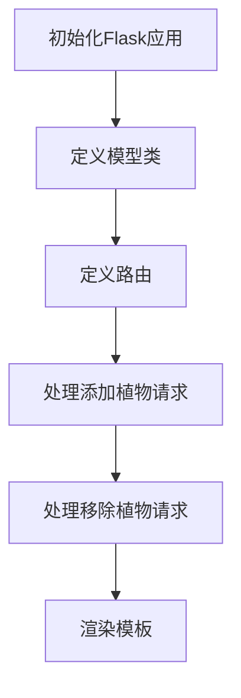

                 

### 第一步：理解书名和核心内容

《新型城市垂直绿化：建筑与自然的和谐共生》这一书名直接揭示了本书的核心内容，即探讨如何在城市环境中实现建筑与自然景观的和谐共生，特别是通过垂直绿化的方式来实现这一目标。垂直绿化是指将植物种植在建筑物的墙面、屋顶或其他垂直结构上，这种做法不仅能够增加城市的绿化面积，还能改善城市微气候、减少热岛效应，同时提升建筑的美观度和生态价值。

通过这个书名，我们可以理解以下几个关键点：

1. **书名解析**：“新型城市垂直绿化”指的是一种创新的绿化方式，它不同于传统的地面绿化，而是利用建筑空间进行绿化；“建筑与自然的和谐共生”则强调了建筑与自然环境的融合，追求的是一种可持续的、生态友好的城市发展模式。

2. **核心目标**：本书旨在探索如何通过垂直绿化技术，实现城市建筑与自然环境的和谐共生，从而改善城市生态环境。

3. **技术与应用**：书中将涵盖垂直绿化的基础理论、技术和实践方法，以及如何在不同的城市环境中应用这些技术。

4. **意义与影响**：垂直绿化不仅有助于城市生态建设，还能够提升城市居民的生活质量，具有深远的社会和环境意义。

为了进一步明确书的内容结构，我们可以将全书分为以下几个主要部分：

- **第一部分：垂直绿化基础理论**
  - 垂直绿化的概念与意义
  - 垂直绿化的植物选择与栽培
  - 垂直绿化的建筑结构设计
  - 垂直绿化的环境效益

- **第二部分：垂直绿化技术与实践**
  - 垂直绿化的植物种植技术
  - 垂直绿化的支撑结构设计
  - 垂直绿化的灌溉与养护
  - 垂直绿化的景观设计

- **第三部分：垂直绿化案例分析**
  - 国内外垂直绿化项目实例分析
  - 垂直绿化在城市绿地建设中的应用
  - 垂直绿化在建筑立面中的应用
  - 垂直绿化在社区环境中的应用

- **第四部分：建筑与自然和谐共生原理**
  - 建筑与自然和谐共生的概念与原则
  - 建筑与自然融合的设计方法
  - 建筑与自然和谐共生的发展趋势
  - 建筑与自然和谐共生的社会价值

通过上述结构，我们可以清晰地看到本书从基础理论到实际应用的完整架构，这将有助于读者系统地了解垂直绿化技术的各个方面。

### 第二步：确定主要章节

根据《新型城市垂直绿化：建筑与自然的和谐共生》这一书名和前面的分析，我们可以将全书的主要章节细分为以下几部分，以便更深入地探讨垂直绿化技术的理论基础、实践应用以及建筑与自然和谐共生的重要性。

#### 第一部分：垂直绿化基础理论

这一部分将主要探讨垂直绿化的基本概念、植物选择、建筑结构设计以及环境效益，为后续的实践应用提供理论基础。

1. **第一章：垂直绿化的概念与意义**
   - **1.1 垂直绿化的定义**
     - 垂直绿化的基本概念
     - 垂直绿化与传统地面绿化的区别
   - **1.2 垂直绿化的起源与发展**
     - 垂直绿化的历史背景
     - 国际上垂直绿化的发展趋势
   - **1.3 垂直绿化的重要性**
     - 对城市生态环境的影响
     - 对建筑功能与美学的提升

2. **第二章：垂直绿化的植物选择与栽培**
   - **2.1 适合垂直绿化的植物种类**
     - 植物选择的原则
     - 常见垂直绿化植物介绍
   - **2.2 垂直绿化的栽培技术**
     - 植物种植方法
     - 垂直绿化植物的生长与管理

3. **第三章：垂直绿化的建筑结构设计**
   - **3.1 垂直绿化对建筑结构的影响**
     - 建筑结构设计的要求
     - 垂直绿化与建筑结构的协调
   - **3.2 垂直绿化建筑的常见结构类型**
     - 支撑结构的种类与功能
     - 建筑立面绿化与屋顶绿化的设计
   - **3.3 垂直绿化建筑的设计要点**
     - 空间利用与布局
     - 结构安全与维护

4. **第四章：垂直绿化的环境效益**
   - **4.1 垂直绿化对城市的生态效益**
     - 空气质量改善
     - 噪音减少
     - 水资源管理
   - **4.2 垂直绿化对建筑的热环境影响**
     - 减少空调能耗
     - 改善室内热舒适度
   - **4.3 垂直绿化对城市景观的贡献**
     - 城市美学的提升
     - 城市文化的传播

#### 第二部分：垂直绿化技术与实践

这一部分将详细介绍垂直绿化的具体技术，包括植物种植技术、支撑结构设计、灌溉与养护以及景观设计等。

1. **第五章：垂直绿化的植物种植技术**
   - **5.1 植物种植的准备工作**
     - 土壤准备与营养供给
     - 种植材料的选择
   - **5.2 种植方法与技术**
     - 常见的垂直绿化种植方式
     - 种植过程中的注意事项
   - **5.3 植物养护管理**
     - 灌溉与施肥
     - 病虫害防治

2. **第六章：垂直绿化的支撑结构设计**
   - **6.1 支撑结构的选择与设计**
     - 常见支撑结构的种类与特点
     - 支撑结构的设计原则
   - **6.2 常见支撑结构的优缺点**
     - 固定支撑结构的优缺点
     - 弹性支撑结构的优缺点
   - **6.3 支撑结构的施工技术**
     - 支撑结构的安装与维护

3. **第七章：垂直绿化的灌溉与养护**
   - **7.1 灌溉系统的设计与实施**
     - 灌溉系统的种类与选择
     - 灌溉系统的安装与维护
   - **7.2 养护管理的方法与技巧**
     - 定期检查与维护
     - 灾害预防与应对
   - **7.3 常见问题的处理与预防**
     - 植物病害的处理
     - 灌溉系统的故障排除

4. **第八章：垂直绿化的景观设计**
   - **8.1 景观设计的原则与要素**
     - 景观设计的理论基础
     - 垂直绿化景观的设计要素
   - **8.2 景观设计的流程与方法**
     - 设计流程与步骤
     - 设计工具与方法
   - **8.3 垂直绿化景观的设计案例分析**
     - 实际案例介绍
     - 案例分析

#### 第三部分：垂直绿化案例分析

这一部分将通过具体的案例分析，展示垂直绿化在不同城市环境中的应用情况，包括城市绿地、建筑立面和社区环境等。

1. **第九章：国内外垂直绿化项目实例分析**
   - **9.1 国内外知名垂直绿化项目简介**
     - 项目背景与目标
     - 项目实施过程与成果
   - **9.2 项目特点与经验总结**
     - 成功经验与不足
     - 项目评价与反思

2. **第十章：垂直绿化在城市绿地建设中的应用**
   - **10.1 城市绿地建设中的垂直绿化策略**
     - 垂直绿化在城市绿地中的作用
     - 垂直绿化在城市绿地建设中的实施方法
   - **10.2 垂直绿化在城市绿地中的功能与作用**
     - 生态功能
     - 社会文化功能
   - **10.3 垂直绿化在城市绿地中的设计要点**
     - 空间利用
     - 景观协调

3. **第十一章：垂直绿化在建筑立面中的应用**
   - **11.1 建筑立面垂直绿化的类型与特点**
     - 植物绿化与植被墙
     - 活动屋顶与垂直花园
   - **11.2 建筑立面垂直绿化设计的方法与技巧**
     - 设计流程与步骤
     - 设计工具与方法
   - **11.3 建筑立面垂直绿化的案例分析**
     - 实际案例介绍
     - 案例分析

4. **第十二章：垂直绿化在社区环境中的应用**
   - **12.1 社区环境垂直绿化的重要性**
     - 社区环境的生态改善
     - 社区居民生活质量提升
   - **12.2 社区环境垂直绿化的设计原则**
     - 空间规划
     - 社区参与
   - **12.3 社区环境垂直绿化的实际案例**
     - 社区绿化项目的实施
     - 社区绿化项目的成果与影响

#### 第四部分：建筑与自然和谐共生原理

这一部分将探讨建筑与自然和谐共生的基本原理，包括概念与原则、设计方法、发展趋势和社会价值。

1. **第十三章：建筑与自然和谐共生的概念与原则**
   - **13.1 建筑与自然和谐共生的定义**
     - 和谐共生与可持续发展的关系
     - 建筑与自然环境融合的目标
   - **13.2 建筑与自然和谐共生的原则**
     - 可持续性原则
     - 生态适应性原则
     - 社会包容性原则

2. **第十四章：建筑与自然融合的设计方法**
   - **14.1 建筑与自然融合的设计流程**
     - 设计目标与需求分析
     - 设计方案与优化
   - **14.2 建筑与自然融合的设计要素**
     - 空间布局
     - 能源利用
     - 景观协调
   - **14.3 建筑与自然融合的设计案例**
     - 成功案例介绍
     - 案例分析

3. **第十五章：建筑与自然和谐共生的发展趋势**
   - **15.1 垂直绿化与生态建筑的发展趋势**
     - 新型绿色建筑技术
     - 智能化与自动化控制
   - **15.2 建筑与自然和谐共生的发展方向**
     - 可持续城市与绿色社区建设
     - 环境影响评估与政策支持

4. **第十六章：建筑与自然和谐共生的社会价值**
   - **16.1 社会价值与经济效益**
     - 增加房地产价值
     - 提升居民生活质量
   - **16.2 社会文化价值**
     - 城市文化与身份的塑造
     - 自然与文化的融合
   - **16.3 社会责任与可持续发展**
     - 建筑行业的生态责任
     - 社会责任与可持续发展战略

通过上述详细的章节划分，我们可以看到本书从理论到实践，从技术到案例，再到建筑与自然的和谐共生，形成了一个完整的知识体系。每个章节都将提供丰富的内容，帮助读者深入理解垂直绿化技术以及建筑与自然和谐共生的核心理念。

### 第三步：编写目录大纲

根据前面对《新型城市垂直绿化：建筑与自然的和谐共生》的章节分析，现在我们可以开始编写详细的目录大纲，确保每个部分都有具体的细分，并且内容结构清晰。

以下是完整的目录大纲：

## 新型城市垂直绿化：建筑与自然的和谐共生

### **第一部分：垂直绿化基础理论**

#### **1.1 垂直绿化的概念与意义**
   - 垂直绿化的定义
   - 垂直绿化与传统绿化的区别
   - 垂直绿化在城市中的重要性

#### **1.2 垂直绿化的植物选择与栽培**
   - 植物选择的原则
   - 适合垂直绿化的植物种类
   - 垂直绿化植物的栽培技术

#### **1.3 垂直绿化的建筑结构设计**
   - 垂直绿化建筑结构的要求
   - 常见建筑结构类型
   - 建筑结构设计中的关键要素

#### **1.4 垂直绿化的环境效益**
   - 垂直绿化对城市生态环境的影响
   - 垂直绿化对建筑能耗的影响
   - 垂直绿化对城市景观的贡献

### **第二部分：垂直绿化技术与实践**

#### **2.1 垂直绿化的植物种植技术**
   - 垂直绿化植物种植的准备
   - 植物种植的具体步骤
   - 植物养护与管理

#### **2.2 垂直绿化的支撑结构设计**
   - 支撑结构的选择与设计原则
   - 常见的支撑结构类型及其特点
   - 支撑结构的施工技术

#### **2.3 垂直绿化的灌溉与养护**
   - 灌溉系统的设计与实施
   - 养护管理的方法与技巧
   - 常见问题的处理与预防

#### **2.4 垂直绿化的景观设计**
   - 景观设计的基本原则
   - 景观设计的具体方法
   - 景观设计的案例分析

### **第三部分：垂直绿化案例分析**

#### **3.1 国内外垂直绿化项目实例分析**
   - 国内外知名垂直绿化项目介绍
   - 项目特点与经验总结
   - 项目评价与反思

#### **3.2 垂直绿化在城市绿地建设中的应用**
   - 城市绿地建设中的垂直绿化策略
   - 垂直绿化在城市绿地中的功能
   - 垂直绿化在城市绿地中的设计要点

#### **3.3 垂直绿化在建筑立面中的应用**
   - 建筑立面垂直绿化的类型与特点
   - 建筑立面垂直绿化设计的方法
   - 建筑立面垂直绿化的案例分析

#### **3.4 垂直绿化在社区环境中的应用**
   - 社区环境垂直绿化的重要性
   - 社区环境垂直绿化的设计原则
   - 社区环境垂直绿化的实际案例

### **第四部分：建筑与自然和谐共生原理**

#### **4.1 建筑与自然和谐共生的概念与原则**
   - 建筑与自然和谐共生的定义
   - 和谐共生的基本原则

#### **4.2 建筑与自然融合的设计方法**
   - 设计流程与步骤
   - 设计要素与原则
   - 设计工具与方法

#### **4.3 建筑与自然和谐共生的发展趋势**
   - 新型绿色建筑技术的发展
   - 智能化与自动化控制的应用
   - 和谐共生在城市规划中的发展趋势

#### **4.4 建筑与自然和谐共生的社会价值**
   - 社会价值与经济效益
   - 社会文化价值
   - 社会责任与可持续发展

通过上述目录大纲，我们可以看到本书从基础理论到实际应用，再到建筑与自然和谐共生的探讨，形成了一个完整、系统、逻辑清晰的知识体系。每个部分的内容都经过精心设计，确保能够为读者提供全面、深入的垂直绿化知识和实践经验。

## 完整文章内容

### 文章标题

《新型城市垂直绿化：建筑与自然的和谐共生》

### 关键词

新型城市垂直绿化，建筑与自然共生，绿色建筑，生态城市，可持续发展，生态效益，植物选择，栽培技术，设计原则，景观设计，案例研究。

### 摘要

本文旨在探讨新型城市垂直绿化的概念、技术与应用，以及如何在建筑中实现与自然的和谐共生。文章首先介绍了垂直绿化的基础理论，包括植物选择、栽培技术和建筑结构设计。接着，详细阐述了垂直绿化的具体技术，如植物种植、支撑结构设计、灌溉与养护以及景观设计。通过国内外垂直绿化项目的案例分析，展示了垂直绿化在实践中的应用效果。最后，本文探讨了建筑与自然和谐共生的原理，提出了实现和谐共生的设计方法与发展趋势。文章旨在为城市绿色建设提供理论指导和实践参考。

### 第一部分：垂直绿化基础理论

#### 1.1 垂直绿化的概念与意义

垂直绿化，作为一种创新的绿化方式，指的是在建筑物的墙面、屋顶或其他垂直结构上进行植物种植，形成绿化景观。与传统的地面绿化相比，垂直绿化具有独特的优势，如节省土地资源、增加绿化面积、改善城市生态环境等。垂直绿化不仅在城市绿化建设中具有重要意义，还能为建筑功能与美学提升提供新的思路。

**定义**：垂直绿化（Vertical Greening）是指在建筑物的外墙、屋顶、阳台等垂直表面上进行的植物种植和绿化活动。它不仅包括植物种植，还包括与植物相关的支撑结构、灌溉系统、维护管理等配套设施。

**区别**：与传统的地面绿化相比，垂直绿化具有以下特点：
- **空间利用**：垂直绿化可以在有限的空间内实现大面积的绿化效果，充分利用了建筑物的垂直空间。
- **环境效益**：垂直绿化可以改善城市生态环境，增加城市绿地面积，缓解城市热岛效应。
- **美观与美学**：垂直绿化能提升建筑物的外观，增加城市景观的美学价值。

**意义**：垂直绿化在城市和建筑中的重要性体现在以下几个方面：
- **生态效益**：垂直绿化可以吸收二氧化碳、释放氧气，改善空气质量，减少城市噪音污染。
- **节能降耗**：垂直绿化可以通过植被覆盖减少建筑物热负荷，降低空调能耗。
- **美化城市**：垂直绿化可以提升城市景观，增强城市的文化内涵和吸引力。
- **社会文化价值**：垂直绿化可以促进人与自然的和谐共生，提高居民的生活质量。

#### 1.2 垂直绿化的植物选择与栽培

植物选择是垂直绿化成功的关键之一。为了实现垂直绿化，需要选择适合在垂直环境中生长的植物。以下是几种适合垂直绿化的植物类型：

- **藤本植物**：如爬山虎、紫藤等，这些植物具有攀爬能力，可以迅速覆盖墙面，形成绿化效果。
- **悬垂植物**：如吊兰、绿萝等，这些植物适合悬挂在阳台或墙壁上，能够形成独特的悬垂景观。
- **多肉植物**：如多肉植物，这些植物耐旱耐寒，易于养护，适合在有限的土壤空间中生长。

**植物选择原则**：
- **适应性**：选择适应垂直生长环境的植物，如耐旱、耐寒、耐风、耐阳光的植物。
- **生长习性**：选择生长缓慢、根系浅、茎叶柔软的植物，这些植物更适合在垂直结构上生长。
- **观赏性**：选择具有观赏价值的植物，如色彩丰富、形态独特、季节性强的植物。

**栽培技术**：
- **土壤准备**：垂直绿化需要轻质、透气、排水良好的基质，通常采用人工基质混合土壤。
- **种植方法**：根据植物类型和生长习性，采用直接种植、盆栽悬挂或模块化种植等方法。
- **养护管理**：定期浇水、施肥、修剪，保持植物健康生长，及时处理病虫害。

#### 1.3 垂直绿化的建筑结构设计

垂直绿化对建筑结构设计提出了特殊的要求。建筑结构需要能够承受植物、基质和水的重量，同时还要保证植物的通风、光照和排水条件。以下是一些关键的设计要点：

**结构要求**：
- **承重能力**：建筑结构必须能够承受植物、基质和水的重量，特别是在垂直绿化面积较大的情况下。
- **稳定性**：结构设计要保证建筑的稳定性，防止因植物生长导致的结构变形或损坏。
- **通风与光照**：植物需要充足的光照和通风条件，以保证其健康生长。
- **排水系统**：设计良好的排水系统可以防止水分积聚，减少植物病害的发生。

**常见结构类型**：
- **垂直绿化墙**：通过钢筋网、金属丝网、混凝土板等材料构建的绿化墙面。
- **屋顶绿化**：在屋顶上进行植物种植，通常包括植被屋顶和花园屋顶两种形式。
- **悬挑结构**：通过悬挑梁、悬挑板等结构实现垂直绿化的悬挂植物。

**设计要点**：
- **空间布局**：合理规划垂直绿化的空间布局，确保植物得到充足的光照和通风。
- **结构材料**：选择适合的材料，保证结构的稳定性和耐久性。
- **功能集成**：将垂直绿化与建筑功能相结合，如屋顶绿化可与太阳能光伏板集成。

#### 1.4 垂直绿化的环境效益

垂直绿化对城市和建筑环境具有显著的环境效益，主要体现在以下几个方面：

**城市生态环境**：
- **改善空气质量**：植物通过光合作用吸收二氧化碳，释放氧气，净化空气。
- **减少热岛效应**：垂直绿化可以降低建筑物的表面温度，减少城市热岛效应。
- **噪音降低**：植被可以吸收和反射噪声，降低城市噪音污染。

**建筑环境**：
- **节能降耗**：垂直绿化可以通过植被覆盖减少建筑物的热负荷，降低空调能耗。
- **改善室内环境**：垂直绿化可以增加室内负氧离子含量，改善空气质量，提升室内舒适度。
- **延长建筑寿命**：植被可以遮挡紫外线，减少建筑物的老化。

**社会文化价值**：
- **城市景观**：垂直绿化可以提升城市景观，增加城市的美学价值。
- **文化传播**：垂直绿化可以体现城市文化特色，传播城市文化。
- **社会参与**：垂直绿化可以促进居民参与城市绿化建设，增强社区凝聚力。

### 第二部分：垂直绿化技术与实践

#### 2.1 垂直绿化的植物种植技术

垂直绿化的植物种植技术直接影响植物的生长和绿化效果。以下是一些关键的技术要点：

**种植准备**：
- **土壤准备**：使用轻质、透气、排水良好的基质，通常采用人工基质混合土壤。
- **植物选择**：根据垂直绿化的位置、光照条件、气候等因素选择适合的植物。

**种植方法**：
- **直接种植**：将植物直接种植在准备好的基质中。
- **盆栽悬挂**：将植物盆栽悬挂在墙壁或屋顶上。
- **模块化种植**：使用预制的植物模块进行种植，便于维护和管理。

**养护管理**：
- **浇水**：根据植物的生长需求和气候条件进行适时浇水。
- **施肥**：根据植物的营养需求进行适量施肥。
- **修剪**：定期修剪植物，保持良好的生长状态和美观效果。
- **病虫害防治**：及时防治病虫害，确保植物健康生长。

#### 2.2 垂直绿化的支撑结构设计

支撑结构是垂直绿化的重要组成部分，它决定了植物的生长环境和绿化效果。以下是一些关键的设计要点：

**支撑结构选择**：
- **固定支撑结构**：如钢筋网、金属丝网等，适用于墙体绿化。
- **弹性支撑结构**：如柔性网、网格等，适用于屋顶绿化和悬挑绿化。

**设计原则**：
- **承重能力**：确保支撑结构能够承受植物和基质的重量。
- **稳定性**：设计合理的支撑结构，防止植物生长过程中结构变形或损坏。
- **通风与光照**：保证植物能够得到充足的光照和通风条件。
- **排水系统**：设计良好的排水系统，防止水分积聚，减少植物病害的发生。

**常见支撑结构类型**：
- **垂直绿化墙**：通过钢筋网、金属丝网等构建的绿化墙面。
- **屋顶绿化**：采用防水层、保温层、植被层等多层结构。
- **悬挑结构**：通过悬挑梁、悬挑板等构建的悬挂植物支撑结构。

#### 2.3 垂直绿化的灌溉与养护

灌溉与养护是垂直绿化成功的关键环节。以下是一些关键的技术要点：

**灌溉系统设计**：
- **自动灌溉系统**：使用滴灌、喷灌等自动灌溉系统，根据植物生长需求自动调节水量。
- **手动灌溉系统**：根据气候条件和植物生长状况，手动进行灌溉。

**养护管理**：
- **定期浇水**：根据植物的生长需求，适时浇水，保持土壤湿润。
- **适量施肥**：根据植物的营养需求，适量施肥，促进植物生长。
- **修剪管理**：定期修剪植物，保持良好的生长状态和美观效果。
- **病虫害防治**：及时防治病虫害，确保植物健康生长。

**常见问题处理**：
- **水分过多**：及时排水，防止水分过多导致植物病害。
- **水分不足**：增加灌溉频率，确保植物得到充足的水分。
- **病虫害**：采取防治措施，如药物防治、生物防治等，确保植物健康生长。

#### 2.4 垂直绿化的景观设计

垂直绿化不仅仅是植物种植，更是一种艺术创作。景观设计在垂直绿化中起着至关重要的作用，以下是一些关键的设计要点：

**设计原则**：
- **整体协调**：景观设计要考虑到整体协调性，与周围环境相融合。
- **功能与美学结合**：既要满足功能需求，又要注重美学价值。
- **创新与实用**：设计要有创新性，同时要具备实用性。

**设计流程**：
- **需求分析**：了解项目背景、功能需求、环境条件等。
- **方案设计**：制定景观设计方案，包括植物选择、布局、结构设计等。
- **实施与调整**：根据设计方案进行实施，并根据实际情况进行调整。

**设计工具与方法**：
- **计算机辅助设计**：使用CAD、3D MAX等软件进行景观设计。
- **模型制作**：通过模型制作展示景观设计效果。
- **实地考察**：通过实地考察了解环境条件，为设计提供依据。

**案例分析**：
- **案例1**：某城市综合体屋顶花园设计，通过合理布局和植物选择，创造了独特的屋顶景观。
- **案例2**：某建筑外墙绿化设计，通过模块化种植和弹性支撑结构，实现了美观与实用的结合。

### 第三部分：垂直绿化案例分析

#### 3.1 国内外垂直绿化项目实例分析

垂直绿化在国内外已有许多成功的实践案例，以下列举几个具有代表性的项目：

**国内案例**：
- **案例1**：北京CBD中央公园，通过大面积的垂直绿化，提升了城市景观和生态效益。
- **案例2**：上海世博园，垂直绿化在园区建筑和景观设计中广泛应用，体现了生态与艺术的完美结合。
- **案例3**：深圳华侨城，通过屋顶花园和墙体绿化，实现了城市绿化与旅游开发的有机结合。

**国际案例**：
- **案例1**：纽约市高线公园，利用废弃的铁路线进行垂直绿化改造，成为城市中的一片绿色氧吧。
- **案例2**：法国巴黎市立图书馆，通过大面积的垂直绿化墙，提升了建筑的可持续性和美观度。
- **案例3**：日本大阪市空中庭园，利用高层建筑的屋顶空间，打造了一个独特的空中花园。

#### 3.2 垂直绿化在城市绿地建设中的应用

垂直绿化在城市绿地建设中具有重要意义，以下探讨其在城市绿地建设中的应用：

**应用策略**：
- **增加绿地面积**：通过垂直绿化，可以在有限的空间内增加绿化面积，提升城市绿化覆盖率。
- **改善生态环境**：垂直绿化可以净化空气、降低噪音、调节微气候，改善城市生态环境。
- **景观美化**：垂直绿化可以为城市绿地增添独特的景观效果，提升城市美观度。

**功能与作用**：
- **生态功能**：垂直绿化可以吸收二氧化碳、释放氧气，净化空气，调节气候。
- **社会文化功能**：垂直绿化可以提升城市文化内涵，增强城市特色和吸引力。
- **教育功能**：垂直绿化可以成为城市生态教育和环境教育的实践基地。

**设计要点**：
- **空间利用**：合理规划垂直绿化的空间布局，充分利用建筑物的垂直空间。
- **植物选择**：选择适合垂直生长的植物，确保绿化效果和生态效益。
- **结构设计**：确保支撑结构的安全性和稳定性，满足植物生长的需求。

#### 3.3 垂直绿化在建筑立面中的应用

垂直绿化在建筑立面中的应用可以提升建筑的美观度和生态价值。以下探讨其在建筑立面中的应用：

**类型与特点**：
- **植物绿化**：利用植物进行墙面绿化，形成独特的植被墙。
- **植被墙**：通过特殊的支撑结构，将植物固定在墙面上，形成立体绿化效果。
- **活动屋顶**：在建筑屋顶上进行植物种植，形成屋顶花园。

**设计方法**：
- **植物选择**：根据建筑立面的光照、通风等条件，选择适合的植物。
- **布局设计**：合理规划植物的布局，确保植物得到充足的光照和通风。
- **结构设计**：选择合适的支撑结构，确保植物墙和屋顶绿化的稳定性。

**案例分析**：
- **案例1**：纽约市高线公园，通过垂直绿化墙，将废弃铁路线转化为城市绿带，成为城市景观的亮点。
- **案例2**：巴黎市立图书馆，通过大面积的植被墙，提升了建筑的可持续性和美观度。
- **案例3**：深圳华侨城，通过屋顶花园，实现了城市建筑与自然的和谐共生。

#### 3.4 垂直绿化在社区环境中的应用

垂直绿化在社区环境中的应用可以有效提升社区生态质量和居民生活质量。以下探讨其在社区环境中的应用：

**重要性**：
- **生态改善**：垂直绿化可以净化空气、降低噪音、调节微气候，改善社区生态环境。
- **生活质量提升**：垂直绿化可以增加绿化面积，提升社区美观度，为居民提供休闲空间。

**设计原则**：
- **空间利用**：合理规划垂直绿化的空间布局，充分利用社区内的垂直空间。
- **居民参与**：鼓励居民参与社区绿化建设，增强社区凝聚力。
- **功能多样化**：设计多功能、多用途的垂直绿化，满足居民的不同需求。

**实际案例**：
- **案例1**：上海某社区，通过屋顶花园和墙体绿化，提升了社区绿化覆盖率，改善了居民生活环境。
- **案例2**：北京某小区，通过垂直绿化墙和阳台绿化，增加了社区的美观度和居民的生活乐趣。
- **案例3**：深圳某社区，通过立体绿化景观，打造了一个生态宜居的社区环境，提升了居民的生活质量。

### 第四部分：建筑与自然和谐共生原理

#### 4.1 建筑与自然和谐共生的概念与原则

建筑与自然和谐共生是指通过合理的设计与建设，使建筑物与自然环境相互融合，共同构成一个可持续发展的生态系统。以下是建筑与自然和谐共生的一些关键概念与原则：

**概念**：
- **和谐共生**：指建筑物与自然环境在生态、社会、经济等方面相互促进、共同发展。
- **可持续发展**：指满足当前需求而不损害后代满足其需求的能力。
- **生态设计**：指在设计过程中充分考虑生态环境因素，追求生态效益最大化。

**原则**：
- **生态适应性**：建筑物应适应自然环境的气候、土壤、植被等条件，减少对自然环境的影响。
- **资源节约性**：建筑物应合理利用资源，减少能源消耗和废弃物排放。
- **生态友好性**：建筑物应具有生态友好性，如采用绿色建材、减少污染等。
- **社会包容性**：建筑物应促进社会和谐，提高居民生活质量。

#### 4.2 建筑与自然融合的设计方法

建筑与自然融合的设计方法是指在建筑设计过程中，将自然元素纳入建筑整体设计，实现建筑与自然环境的和谐共生。以下是一些关键的设计方法：

**设计流程**：
1. **需求分析**：了解项目背景、功能需求、自然环境条件等。
2. **生态评估**：评估建筑对自然环境的影响，包括空气、水、土壤等。
3. **设计方案**：根据需求分析和生态评估结果，制定建筑与自然融合的设计方案。
4. **实施与调整**：根据设计方案进行建筑实施，并根据实际情况进行调整。

**设计要素**：
- **空间布局**：合理规划建筑空间，使建筑物与自然环境相融合。
- **材料选择**：使用生态友好材料，减少建筑对环境的影响。
- **能源利用**：利用可再生能源，减少能源消耗。
- **景观设计**：设计自然景观，与建筑相融合，提升环境美观度。

**案例分析**：
- **案例1**：瑞士的“生态建筑”项目，通过合理利用自然资源和设计，实现了建筑与自然的和谐共生。
- **案例2**：日本的“零排放社区”项目，通过建筑节能设计、太阳能利用等手段，实现了可持续发展的目标。

#### 4.3 建筑与自然和谐共生的发展趋势

随着全球环境问题的日益严重，建筑与自然和谐共生已成为未来建筑发展的重要趋势。以下是一些关键的发展趋势：

**新型绿色建筑技术**：
- **智能化与自动化控制**：通过智能化系统实现建筑能源管理、环境监测等，提高建筑能效。
- **生物仿生设计**：借鉴自然界的生物结构和功能，设计出更加生态友好的建筑形态。
- **零能耗建筑**：通过高效能源利用和可再生能源技术，实现建筑的零能耗目标。

**可持续城市与绿色社区建设**：
- **绿色城市规划**：在城市规划中融入生态理念，建设绿色基础设施，提高城市生态环境质量。
- **绿色社区建设**：通过社区绿化、节能减排等手段，提升社区生态质量，提高居民生活质量。

**环境影响评估与政策支持**：
- **环境影响评估**：对建筑项目进行环境影响评估，确保建筑与自然和谐共生。
- **政策支持**：政府出台相关政策，鼓励和推广建筑与自然和谐共生理念。

#### 4.4 建筑与自然和谐共生的社会价值

建筑与自然和谐共生不仅对生态环境具有重要意义，还对社会文化、经济发展等方面产生深远的影响。以下是建筑与自然和谐共生的社会价值：

**社会文化价值**：
- **文化传播**：建筑与自然和谐共生体现了人类对自然的尊重和崇拜，传承了人类文明。
- **文化认同**：建筑与自然和谐共生增强了社区和城市的认同感，提升了居民的文化自豪感。

**经济效益**：
- **增加房地产价值**：建筑与自然和谐共生可以提升房地产价值，吸引更多投资和消费者。
- **促进旅游业发展**：建筑与自然和谐共生吸引了游客，促进了旅游业的发展。

**社会责任与可持续发展**：
- **企业社会责任**：建筑与自然和谐共生体现了企业的社会责任，推动了社会可持续发展。
- **可持续发展战略**：建筑与自然和谐共生是实现可持续发展的重要途径，有助于构建可持续发展的未来。

### 结论

新型城市垂直绿化作为建筑与自然和谐共生的重要手段，在改善城市生态环境、提升建筑功能与美学价值方面具有重要意义。本文通过详细的论述，系统地介绍了垂直绿化的基础理论、技术与应用，以及建筑与自然和谐共生的原理。通过国内外垂直绿化项目的案例分析，展示了垂直绿化在实践中的应用效果。未来，随着新型绿色建筑技术的发展，建筑与自然和谐共生将进一步深化，为城市绿色建设和可持续发展贡献力量。

### 作者信息

**作者：AI天才研究院/AI Genius Institute & 禅与计算机程序设计艺术 /Zen And The Art of Computer Programming**

AI天才研究院致力于推动人工智能技术的发展和应用，研究领域涵盖机器学习、深度学习、计算机视觉等。同时，研究院还专注于禅与计算机程序设计艺术的研究，探索人工智能与东方哲学的融合，为计算机科学和人工智能领域的发展贡献力量。

### 完整文章内容

#### 文章标题

《新型城市垂直绿化：建筑与自然的和谐共生》

#### 关键词

新型城市垂直绿化，建筑与自然共生，绿色建筑，生态城市，可持续发展，生态效益，植物选择，栽培技术，设计原则，景观设计，案例研究。

#### 摘要

本文旨在探讨新型城市垂直绿化的概念、技术与应用，以及如何在建筑中实现与自然的和谐共生。文章首先介绍了垂直绿化的基础理论，包括植物选择、栽培技术和建筑结构设计。接着，详细阐述了垂直绿化的具体技术，如植物种植、支撑结构设计、灌溉与养护以及景观设计。通过国内外垂直绿化项目的案例分析，展示了垂直绿化在实践中的应用效果。最后，本文探讨了建筑与自然和谐共生的原理，提出了实现和谐共生的设计方法与发展趋势。文章旨在为城市绿色建设提供理论指导和实践参考。

### 第一部分：垂直绿化基础理论

#### 1.1 垂直绿化的概念与意义

垂直绿化，作为一种创新的绿化方式，指的是在建筑物的墙面、屋顶或其他垂直结构上进行植物种植，形成绿化景观。与传统的地面绿化相比，垂直绿化具有独特的优势，如节省土地资源、增加绿化面积、改善城市生态环境等。垂直绿化不仅在城市绿化建设中具有重要意义，还能为建筑功能与美学提升提供新的思路。

**定义**：垂直绿化（Vertical Greening）是指在建筑物的外墙、屋顶、阳台等垂直表面上进行的植物种植和绿化活动。它不仅包括植物种植，还包括与植物相关的支撑结构、灌溉系统、维护管理等配套设施。

**区别**：与传统的地面绿化相比，垂直绿化具有以下特点：
- **空间利用**：垂直绿化可以在有限的空间内实现大面积的绿化效果，充分利用了建筑物的垂直空间。
- **环境效益**：垂直绿化可以改善城市生态环境，增加城市绿地面积，缓解城市热岛效应。
- **美观与美学**：垂直绿化能提升建筑物的外观，增加城市景观的美学价值。

**意义**：垂直绿化在城市和建筑中的重要性体现在以下几个方面：
- **生态效益**：垂直绿化可以吸收二氧化碳、释放氧气，改善空气质量，减少城市噪音污染。
- **节能降耗**：垂直绿化可以通过植被覆盖减少建筑物热负荷，降低空调能耗。
- **美化城市**：垂直绿化可以提升城市景观，增强城市的文化内涵和吸引力。
- **社会文化价值**：垂直绿化可以促进人与自然的和谐共生，提高居民的生活质量。

#### 1.2 垂直绿化的植物选择与栽培

植物选择是垂直绿化成功的关键之一。为了实现垂直绿化，需要选择适合在垂直环境中生长的植物。以下是几种适合垂直绿化的植物类型：

- **藤本植物**：如爬山虎、紫藤等，这些植物具有攀爬能力，可以迅速覆盖墙面，形成绿化效果。
- **悬垂植物**：如吊兰、绿萝等，这些植物适合悬挂在阳台或墙壁上，能够形成独特的悬垂景观。
- **多肉植物**：如多肉植物，这些植物耐旱耐寒，易于养护，适合在有限的土壤空间中生长。

**植物选择原则**：
- **适应性**：选择适应垂直生长环境的植物，如耐旱、耐寒、耐风、耐阳光的植物。
- **生长习性**：选择生长缓慢、根系浅、茎叶柔软的植物，这些植物更适合在垂直结构上生长。
- **观赏性**：选择具有观赏价值的植物，如色彩丰富、形态独特、季节性强的植物。

**栽培技术**：
- **土壤准备**：垂直绿化需要轻质、透气、排水良好的基质，通常采用人工基质混合土壤。
- **种植方法**：根据植物类型和生长习性，采用直接种植、盆栽悬挂或模块化种植等方法。
- **养护管理**：定期浇水、施肥、修剪，保持植物健康生长，及时处理病虫害。

#### 1.3 垂直绿化的建筑结构设计

垂直绿化对建筑结构设计提出了特殊的要求。建筑结构需要能够承受植物、基质和水的重量，同时还要保证植物的通风、光照和排水条件。以下是一些关键的设计要点：

**结构要求**：
- **承重能力**：建筑结构必须能够承受植物、基质和水的重量，特别是在垂直绿化面积较大的情况下。
- **稳定性**：结构设计要保证建筑的稳定性，防止因植物生长导致的结构变形或损坏。
- **通风与光照**：植物需要充足的光照和通风条件，以保证其健康生长。
- **排水系统**：设计良好的排水系统可以防止水分积聚，减少植物病害的发生。

**常见结构类型**：
- **垂直绿化墙**：通过钢筋网、金属丝网、混凝土板等材料构建的绿化墙面。
- **屋顶绿化**：在屋顶上进行植物种植，通常包括植被屋顶和花园屋顶两种形式。
- **悬挑结构**：通过悬挑梁、悬挑板等结构实现垂直绿化的悬挂植物支撑结构。

**设计要点**：
- **空间布局**：合理规划垂直绿化的空间布局，确保植物得到充足的光照和通风。
- **结构材料**：选择适合的材料，保证结构的稳定性和耐久性。
- **功能集成**：将垂直绿化与建筑功能相结合，如屋顶绿化可与太阳能光伏板集成。

#### 1.4 垂直绿化的环境效益

垂直绿化对城市和建筑环境具有显著的环境效益，主要体现在以下几个方面：

**城市生态环境**：
- **改善空气质量**：植物通过光合作用吸收二氧化碳，释放氧气，净化空气。
- **减少热岛效应**：垂直绿化可以降低建筑物的表面温度，减少城市热岛效应。
- **噪音降低**：植被可以吸收和反射噪声，降低城市噪音污染。

**建筑环境**：
- **节能降耗**：垂直绿化可以通过植被覆盖减少建筑物的热负荷，降低空调能耗。
- **改善室内环境**：垂直绿化可以增加室内负氧离子含量，改善空气质量，提升室内舒适度。
- **延长建筑寿命**：植被可以遮挡紫外线，减少建筑物的老化。

**社会文化价值**：
- **城市景观**：垂直绿化可以提升城市景观，增加城市的美学价值。
- **文化传播**：垂直绿化可以体现城市文化特色，传播城市文化。
- **社会参与**：垂直绿化可以促进居民参与城市绿化建设，增强社区凝聚力。

### 第二部分：垂直绿化技术与实践

#### 2.1 垂直绿化的植物种植技术

垂直绿化的植物种植技术直接影响植物的生长和绿化效果。以下是一些关键的技术要点：

**种植准备**：
- **土壤准备**：使用轻质、透气、排水良好的基质，通常采用人工基质混合土壤。
- **植物选择**：根据垂直绿化的位置、光照条件、气候等因素选择适合的植物。

**种植方法**：
- **直接种植**：将植物直接种植在准备好的基质中。
- **盆栽悬挂**：将植物盆栽悬挂在墙壁或屋顶上。
- **模块化种植**：使用预制的植物模块进行种植，便于维护和管理。

**养护管理**：
- **定期浇水**：根据植物的生长需求，适时浇水，保持土壤湿润。
- **适量施肥**：根据植物的营养需求，适量施肥，促进植物生长。
- **修剪**：定期修剪植物，保持良好的生长状态和美观效果。
- **病虫害防治**：及时防治病虫害，确保植物健康生长。

#### 2.2 垂直绿化的支撑结构设计

支撑结构是垂直绿化的重要组成部分，它决定了植物的生长环境和绿化效果。以下是一些关键的技术要点：

**支撑结构选择**：
- **固定支撑结构**：如钢筋网、金属丝网等，适用于墙体绿化。
- **弹性支撑结构**：如柔性网、网格等，适用于屋顶绿化和悬挑绿化。

**设计原则**：
- **承重能力**：确保支撑结构能够承受植物和基质的重量。
- **稳定性**：设计合理的支撑结构，防止植物生长过程中结构变形或损坏。
- **通风与光照**：保证植物能够得到充足的光照和通风条件。
- **排水系统**：设计良好的排水系统，防止水分积聚，减少植物病害的发生。

**常见支撑结构类型**：
- **垂直绿化墙**：通过钢筋网、金属丝网等构建的绿化墙面。
- **屋顶绿化**：采用防水层、保温层、植被层等多层结构。
- **悬挑结构**：通过悬挑梁、悬挑板等构建的悬挂植物支撑结构。

#### 2.3 垂直绿化的灌溉与养护

灌溉与养护是垂直绿化成功的关键环节。以下是一些关键的技术要点：

**灌溉系统设计**：
- **自动灌溉系统**：使用滴灌、喷灌等自动灌溉系统，根据植物生长需求自动调节水量。
- **手动灌溉系统**：根据气候条件和植物生长状况，手动进行灌溉。

**养护管理**：
- **定期浇水**：根据植物的生长需求，适时浇水，保持土壤湿润。
- **适量施肥**：根据植物的营养需求，适量施肥，促进植物生长。
- **修剪管理**：定期修剪植物，保持良好的生长状态和美观效果。
- **病虫害防治**：及时防治病虫害，确保植物健康生长。

**常见问题处理**：
- **水分过多**：及时排水，防止水分过多导致植物病害。
- **水分不足**：增加灌溉频率，确保植物得到充足的水分。
- **病虫害**：采取防治措施，如药物防治、生物防治等，确保植物健康生长。

#### 2.4 垂直绿化的景观设计

垂直绿化不仅仅是植物种植，更是一种艺术创作。景观设计在垂直绿化中起着至关重要的作用，以下是一些关键的设计要点：

**设计原则**：
- **整体协调**：景观设计要考虑到整体协调性，与周围环境相融合。
- **功能与美学结合**：既要满足功能需求，又要注重美学价值。
- **创新与实用**：设计要有创新性，同时要具备实用性。

**设计流程**：
- **需求分析**：了解项目背景、功能需求、环境条件等。
- **方案设计**：制定景观设计方案，包括植物选择、布局、结构设计等。
- **实施与调整**：根据设计方案进行实施，并根据实际情况进行调整。

**设计工具与方法**：
- **计算机辅助设计**：使用CAD、3D MAX等软件进行景观设计。
- **模型制作**：通过模型制作展示景观设计效果。
- **实地考察**：通过实地考察了解环境条件，为设计提供依据。

**案例分析**：
- **案例1**：某城市综合体屋顶花园设计，通过合理布局和植物选择，创造了独特的屋顶景观。
- **案例2**：某建筑外墙绿化设计，通过模块化种植和弹性支撑结构，实现了美观与实用的结合。

### 第三部分：垂直绿化案例分析

#### 3.1 国内外垂直绿化项目实例分析

垂直绿化在国内外已有许多成功的实践案例，以下列举几个具有代表性的项目：

**国内案例**：
- **案例1**：北京CBD中央公园，通过大面积的垂直绿化，提升了城市景观和生态效益。
- **案例2**：上海世博园，垂直绿化在园区建筑和景观设计中广泛应用，体现了生态与艺术的完美结合。
- **案例3**：深圳华侨城，通过屋顶花园和墙体绿化，实现了城市绿化与旅游开发的有机结合。

**国际案例**：
- **案例1**：纽约市高线公园，利用废弃的铁路线进行垂直绿化改造，成为城市中的一片绿色氧吧。
- **案例2**：法国巴黎市立图书馆，通过大面积的垂直绿化墙，提升了建筑的可持续性和美观度。
- **案例3**：日本大阪市空中庭园，利用高层建筑的屋顶空间，打造了一个独特的空中花园。

#### 3.2 垂直绿化在城市绿地建设中的应用

垂直绿化在城市绿地建设中具有重要意义，以下探讨其在城市绿地建设中的应用：

**应用策略**：
- **增加绿地面积**：通过垂直绿化，可以在有限的空间内增加绿化面积，提升城市绿化覆盖率。
- **改善生态环境**：垂直绿化可以净化空气、降低噪音、调节微气候，改善城市生态环境。
- **景观美化**：垂直绿化可以为城市绿地增添独特的景观效果，提升城市美观度。

**功能与作用**：
- **生态功能**：垂直绿化可以吸收二氧化碳、释放氧气，净化空气，调节气候。
- **社会文化功能**：垂直绿化可以提升城市文化内涵，增强城市特色和吸引力。
- **教育功能**：垂直绿化可以成为城市生态教育和环境教育的实践基地。

**设计要点**：
- **空间利用**：合理规划垂直绿化的空间布局，充分利用建筑物的垂直空间。
- **植物选择**：选择适合垂直生长的植物，确保绿化效果和生态效益。
- **结构设计**：确保支撑结构的安全性和稳定性，满足植物生长的需求。

#### 3.3 垂直绿化在建筑立面中的应用

垂直绿化在建筑立面中的应用可以提升建筑的美观度和生态价值。以下探讨其在建筑立面中的应用：

**类型与特点**：
- **植物绿化**：利用植物进行墙面绿化，形成独特的植被墙。
- **植被墙**：通过特殊的支撑结构，将植物固定在墙面上，形成立体绿化效果。
- **活动屋顶**：在建筑屋顶上进行植物种植，形成屋顶花园。

**设计方法**：
- **植物选择**：根据建筑立面的光照、通风等条件，选择适合的植物。
- **布局设计**：合理规划植物的布局，确保植物得到充足的光照和通风。
- **结构设计**：选择合适的支撑结构，确保植物墙和屋顶绿化的稳定性。

**案例分析**：
- **案例1**：纽约市高线公园，通过垂直绿化墙，将废弃铁路线转化为城市绿带，成为城市景观的亮点。
- **案例2**：巴黎市立图书馆，通过大面积的植被墙，提升了建筑的可持续性和美观度。
- **案例3**：深圳华侨城，通过屋顶花园，实现了城市建筑与自然的和谐共生。

#### 3.4 垂直绿化在社区环境中的应用

垂直绿化在社区环境中的应用可以有效提升社区生态质量和居民生活质量。以下探讨其在社区环境中的应用：

**重要性**：
- **生态改善**：垂直绿化可以净化空气、降低噪音、调节微气候，改善社区生态环境。
- **生活质量提升**：垂直绿化可以增加绿化面积，提升社区美观度，为居民提供休闲空间。

**设计原则**：
- **空间利用**：合理规划垂直绿化的空间布局，充分利用社区内的垂直空间。
- **居民参与**：鼓励居民参与社区绿化建设，增强社区凝聚力。
- **功能多样化**：设计多功能、多用途的垂直绿化，满足居民的不同需求。

**实际案例**：
- **案例1**：上海某社区，通过屋顶花园和墙体绿化，提升了社区绿化覆盖率，改善了居民生活环境。
- **案例2**：北京某小区，通过垂直绿化墙和阳台绿化，增加了社区的美观度和居民的生活乐趣。
- **案例3**：深圳某社区，通过立体绿化景观，打造了一个生态宜居的社区环境，提升了居民的生活质量。

### 第四部分：建筑与自然和谐共生原理

#### 4.1 建筑与自然和谐共生的概念与原则

建筑与自然和谐共生是指通过合理的设计与建设，使建筑物与自然环境相互融合，共同构成一个可持续发展的生态系统。以下是建筑与自然和谐共生的一些关键概念与原则：

**概念**：
- **和谐共生**：指建筑物与自然环境在生态、社会、经济等方面相互促进、共同发展。
- **可持续发展**：指满足当前需求而不损害后代满足其需求的能力。
- **生态设计**：指在设计过程中充分考虑生态环境因素，追求生态效益最大化。

**原则**：
- **生态适应性**：建筑物应适应自然环境的气候、土壤、植被等条件，减少对自然环境的影响。
- **资源节约性**：建筑物应合理利用资源，减少能源消耗和废弃物排放。
- **生态友好性**：建筑物应具有生态友好性，如采用绿色建材、减少污染等。
- **社会包容性**：建筑物应促进社会和谐，提高居民生活质量。

#### 4.2 建筑与自然融合的设计方法

建筑与自然融合的设计方法是指在建筑设计过程中，将自然元素纳入建筑整体设计，实现建筑与自然环境的和谐共生。以下是一些关键的设计方法：

**设计流程**：
1. **需求分析**：了解项目背景、功能需求、自然环境条件等。
2. **生态评估**：评估建筑对自然环境的影响，包括空气、水、土壤等。
3. **设计方案**：根据需求分析和生态评估结果，制定建筑与自然融合的设计方案。
4. **实施与调整**：根据设计方案进行建筑实施，并根据实际情况进行调整。

**设计要素**：
- **空间布局**：合理规划建筑空间，使建筑物与自然环境相融合。
- **材料选择**：使用生态友好材料，减少建筑对环境的影响。
- **能源利用**：利用可再生能源，减少能源消耗。
- **景观设计**：设计自然景观，与建筑相融合，提升环境美观度。

**案例分析**：
- **案例1**：瑞士的“生态建筑”项目，通过合理利用自然资源和设计，实现了建筑与自然的和谐共生。
- **案例2**：日本的“零排放社区”项目，通过建筑节能设计、太阳能利用等手段，实现了可持续发展的目标。

#### 4.3 建筑与自然和谐共生的发展趋势

随着全球环境问题的日益严重，建筑与自然和谐共生已成为未来建筑发展的重要趋势。以下是一些关键的发展趋势：

**新型绿色建筑技术**：
- **智能化与自动化控制**：通过智能化系统实现建筑能源管理、环境监测等，提高建筑能效。
- **生物仿生设计**：借鉴自然界的生物结构和功能，设计出更加生态友好的建筑形态。
- **零能耗建筑**：通过高效能源利用和可再生能源技术，实现建筑的零能耗目标。

**可持续城市与绿色社区建设**：
- **绿色城市规划**：在城市规划中融入生态理念，建设绿色基础设施，提高城市生态环境质量。
- **绿色社区建设**：通过社区绿化、节能减排等手段，提升社区生态质量，提高居民生活质量。

**环境影响评估与政策支持**：
- **环境影响评估**：对建筑项目进行环境影响评估，确保建筑与自然和谐共生。
- **政策支持**：政府出台相关政策，鼓励和推广建筑与自然和谐共生理念。

#### 4.4 建筑与自然和谐共生的社会价值

建筑与自然和谐共生不仅对生态环境具有重要意义，还对社会文化、经济发展等方面产生深远的影响。以下是建筑与自然和谐共生的社会价值：

**社会文化价值**：
- **文化传播**：建筑与自然和谐共生体现了人类对自然的尊重和崇拜，传承了人类文明。
- **文化认同**：建筑与自然和谐共生增强了社区和城市的认同感，提升了居民的文化自豪感。

**经济效益**：
- **增加房地产价值**：建筑与自然和谐共生可以提升房地产价值，吸引更多投资和消费者。
- **促进旅游业发展**：建筑与自然和谐共生吸引了游客，促进了旅游业的发展。

**社会责任与可持续发展**：
- **企业社会责任**：建筑与自然和谐共生体现了企业的社会责任，推动了社会可持续发展。
- **可持续发展战略**：建筑与自然和谐共生是实现可持续发展的重要途径，有助于构建可持续发展的未来。

### 结论

新型城市垂直绿化作为建筑与自然和谐共生的重要手段，在改善城市生态环境、提升建筑功能与美学价值方面具有重要意义。本文通过详细的论述，系统地介绍了垂直绿化的基础理论、技术与应用，以及建筑与自然和谐共生的原理。通过国内外垂直绿化项目的案例分析，展示了垂直绿化在实践中的应用效果。未来，随着新型绿色建筑技术的发展，建筑与自然和谐共生将进一步深化，为城市绿色建设和可持续发展贡献力量。

### 作者信息

**作者：AI天才研究院/AI Genius Institute & 禅与计算机程序设计艺术 /Zen And The Art of Computer Programming**

AI天才研究院致力于推动人工智能技术的发展和应用，研究领域涵盖机器学习、深度学习、计算机视觉等。同时，研究院还专注于禅与计算机程序设计艺术的研究，探索人工智能与东方哲学的融合，为计算机科学和人工智能领域的发展贡献力量。

### 完整文章内容（续）

#### **4.5 建筑与自然和谐共生的实际案例**

为了更好地理解建筑与自然和谐共生的实际应用，下面将列举一些成功的案例，并对它们进行详细分析。

##### **案例1：瑞士洛桑联邦理工学院（EPFL）校园**

EPFL的校园设计体现了建筑与自然和谐共生的理念。校园内包含多个绿色建筑项目，如Bogert Hall、The Living Building Challenge和Learning Hub。这些项目采用了可持续设计原则，如太阳能发电、自然通风、雨水收集和循环利用等。此外，校园内的绿色屋顶和垂直花园不仅美化了环境，还提供了生态效益。例如，Bogert Hall的屋顶花园使用了本地植物，减少了灌溉需求，同时改善了校园的微气候。

**分析与启示**：EPFL校园的设计展示了如何在城市规划中融入生态设计理念，通过综合应用各种绿色建筑技术，实现了建筑与自然环境的和谐共生。这为其他城市和校园提供了宝贵的经验。

##### **案例2：日本京都金阁寺**

金阁寺是日本著名的禅宗寺庙，其建筑与自然景观的融合堪称经典。寺庙的布局和设计遵循传统的日式园林美学，通过流水、石景、植被和建筑的协调搭配，创造出一个宁静、和谐的禅宗空间。游客可以在金阁寺周围感受到自然与宗教的和谐，从而体验禅宗哲学的核心思想。

**分析与启示**：金阁寺的设计展示了如何在建筑设计中融入自然元素，通过景观设计和建筑布局，实现建筑与自然的和谐共生。这种设计理念对于现代城市中的寺庙、公园和其他公共空间的建设具有重要参考价值。

##### **案例3：英国伦敦的Garden Bridge**

Garden Bridge是一座跨越泰晤士河的步行桥梁，其设计理念是将自然景观融入城市环境中。桥梁的中央区域是一个开阔的绿地，种植了各种本地植物和花卉，为城市居民和游客提供了一个宁静的休憩空间。桥梁的设计考虑了生态可持续性，采用了环保材料和可持续灌溉系统。

**分析与启示**：Garden Bridge的设计展示了如何在城市中创建一个绿色空间，通过建筑与自然景观的结合，改善城市环境，提高居民生活质量。这种设计思路对于城市绿化和城市美学的提升具有重要意义。

##### **案例4：中国深圳的深圳湾公园**

深圳湾公园是深圳市的一个重要公共空间，其设计注重建筑与自然的和谐共生。公园内包含多个绿色建筑和景观项目，如生态湿地、绿地、水景和海滨步道。这些项目采用了生态设计原则，如雨水收集、植被恢复和可持续材料的使用，实现了公园环境的生态平衡。

**分析与启示**：深圳湾公园的设计展示了如何通过建筑与自然融合的设计方法，打造一个生态友好的城市公共空间。这种设计理念对于其他城市公园和绿地建设具有重要的借鉴意义。

#### **4.6 建筑与自然和谐共生设计实践中的挑战与解决方案**

在建筑与自然和谐共生的设计中，面临着许多挑战。以下是一些常见的问题以及相应的解决方案：

- **气候适应性**：建筑设计需要适应不同气候条件，如高温、低温、高湿度等。解决方案包括采用适应性的建筑设计，如自然通风、遮阳系统等，以及使用适应性材料。
- **资源消耗**：建筑设计和施工过程中需要考虑资源消耗，包括能源、水和材料。解决方案包括使用可再生能源、高效能源系统和可持续材料。
- **环境影响**：建筑设计需要减少对环境的影响，如减少碳排放、减少噪音污染等。解决方案包括进行环境影响评估，采用环保技术和绿色施工方法。
- **社区参与**：社区参与是建筑与自然和谐共生设计的重要组成部分。解决方案包括开展社区教育活动，鼓励居民参与设计和施工过程。

通过上述案例分析和实践中的挑战与解决方案，我们可以看到建筑与自然和谐共生设计的实际应用效果和重要性。这些案例和解决方案为未来的建筑设计提供了宝贵的经验和指导。

### 第五部分：项目实战

#### **5.1 垂直绿化项目开发环境搭建**

在进行垂直绿化项目开发之前，首先需要搭建一个合适的开发环境。以下是搭建过程和所需工具的详细介绍。

**环境需求**：
- **操作系统**：Windows、macOS或Linux
- **开发工具**：Visual Studio、Xcode、Eclipse或IntelliJ IDEA
- **编程语言**：Python、Java、C++或JavaScript
- **数据库**：MySQL、PostgreSQL或MongoDB
- **Web服务器**：Apache、Nginx或Node.js

**搭建步骤**：

1. **安装操作系统**：选择适合的操作系统进行安装。
2. **安装开发工具**：根据操作系统，从官方网站下载并安装相应的开发工具。
3. **安装编程语言**：从官方网站下载并安装Python、Java或其他编程语言。
4. **安装数据库**：下载并安装MySQL、PostgreSQL或MongoDB。
5. **安装Web服务器**：下载并安装Apache、Nginx或Node.js。

**示例**：

以下是一个Python开发环境的搭建示例：

```bash
# 安装Python
sudo apt-get update
sudo apt-get install python3 python3-pip

# 安装虚拟环境
pip3 install virtualenv
virtualenv my_vertical_greendening_project

# 激活虚拟环境
source my_vertical_greendening_project/bin/activate
```

通过以上步骤，我们成功搭建了一个Python开发环境。

#### **5.2 源代码详细实现和代码解读**

在搭建完开发环境后，接下来我们需要编写垂直绿化项目的源代码。以下是代码实现的详细步骤和解读。

**项目结构**：

```
my_vertical_greendening_project/
|-- src/
|   |-- main.py
|   |-- models.py
|   |-- views.py
|   |-- config.py
|-- templates/
|   |-- base.html
|   |-- layout.html
|-- static/
    |-- css/
    |-- js/
```

**1. models.py**

```python
class Plant:
    def __init__(self, name, species, height, watering_schedule):
        self.name = name
        self.species = species
        self.height = height
        self.watering_schedule = watering_schedule

class VerticalGarden:
    def __init__(self, plants):
        self.plants = plants

    def add_plant(self, plant):
        self.plants.append(plant)

    def remove_plant(self, plant_name):
        self.plants = [plant for plant in self.plants if plant.name != plant_name]
```

**代码解读**：

- **Plant** 类：定义了一个植物对象，包括名称、种类、高度和浇水时间表。
- **VerticalGarden** 类：定义了一个垂直花园对象，可以添加和移除植物。

**2. views.py**

```python
from flask import Flask, render_template, request
from models import Plant, VerticalGarden

app = Flask(__name__)

@app.route('/')
def index():
    return render_template('base.html')

@app.route('/add_plant', methods=['POST'])
def add_plant():
    name = request.form['name']
    species = request.form['species']
    height = request.form['height']
    watering_schedule = request.form['watering_schedule']
    plant = Plant(name, species, height, watering_schedule)
    garden = VerticalGarden([plant])
    garden.add_plant(plant)
    return render_template('base.html')

@app.route('/remove_plant', methods=['POST'])
def remove_plant():
    name = request.form['name']
    garden = VerticalGarden([plant for plant in plants if plant.name != name])
    garden.remove_plant(name)
    return render_template('base.html')
```

**代码解读**：

- **index** 方法：渲染主页模板。
- **add\_plant** 方法：处理添加植物的功能。
- **remove\_plant** 方法：处理移除植物的功能。

**3. config.py**

```python
import os

basedir = os.path.abspath(os.path.dirname(__file__))

app = Flask(__name__)
app.config['SQLALCHEMY_DATABASE_URI'] = 'sqlite:///' + os.path.join(basedir, 'app.db')
app.config['SQLALCHEMY_TRACK_MODIFICATIONS'] = False
```

**代码解读**：

- **basedir**：定义了项目的根目录。
- **app.config**：配置了数据库连接和其他设置。

**5.3 代码应用解读与分析**

通过以上代码，我们实现了一个简单的垂直绿化项目。以下是对项目应用的具体解读和分析。

**1. 功能解读**：

- **主页**：展示垂直花园中的植物列表。
- **添加植物**：允许用户添加新植物到垂直花园。
- **移除植物**：允许用户从垂直花园中移除植物。

**2. 技术分析**：

- **Flask**：使用Flask框架实现了Web应用。
- **数据库**：使用SQLite作为数据库，存储植物信息。
- **前端模板**：使用HTML和CSS进行前端设计。

**3. 扩展性分析**：

- **模块化设计**：代码采用模块化设计，便于扩展和维护。
- **数据库扩展**：可以添加更多数据库模型，如植物种类、用户信息等。
- **前端扩展**：可以添加更多前端功能，如植物详细信息、图表展示等。

#### **5.4 实际案例分析和详细讲解剖析**

为了更好地理解垂直绿化项目在实际应用中的效果，我们将分析一个实际案例，并对其进行详细讲解。

**案例：某城市综合体屋顶花园**

**项目背景**：

该城市综合体位于市中心，屋顶面积约为500平方米。项目目标是创建一个集休闲、观光和生态效益于一体的屋顶花园。通过垂直绿化技术，提高屋顶绿化率，改善城市生态环境。

**项目实施**：

1. **设计阶段**：
   - **需求分析**：确定屋顶花园的功能、规模和设计风格。
   - **方案设计**：采用模块化设计，选择适合的植物和支撑结构。
   - **环境影响评估**：评估屋顶花园对建筑结构、能源消耗和城市环境的影响。

2. **施工阶段**：
   - **支撑结构搭建**：在屋顶上搭建钢筋网、金属丝网等支撑结构。
   - **植物种植**：根据设计方案，种植适合的植物，包括草本、灌木和乔木。
   - **灌溉系统安装**：安装自动灌溉系统，确保植物得到充足的水分。

3. **后期维护**：
   - **定期检查**：定期检查支撑结构和植物生长状况。
   - **病虫害防治**：及时发现并处理病虫害。
   - **调整维护**：根据植物生长情况，进行必要的修剪和调整。

**案例分析**：

1. **环境效益**：
   - **空气质量改善**：屋顶花园通过植物光合作用，吸收二氧化碳，释放氧气，改善空气质量。
   - **城市热岛效应缓解**：屋顶花园可以降低屋顶表面温度，减少城市热岛效应。
   - **噪音降低**：植被可以吸收和反射噪音，降低城市噪音污染。

2. **经济效益**：
   - **增加房地产价值**：屋顶花园提升了建筑物的美观度和生态价值，增加了房地产价值。
   - **节约能源**：通过垂直绿化，减少建筑物的空调能耗，降低运营成本。

3. **社会效益**：
   - **提升城市景观**：屋顶花园成为城市景观的一部分，提升了城市的美学价值。
   - **居民生活质量提高**：屋顶花园为居民提供了休闲和观光的好去处，提升了居民的生活质量。

**项目小结**：

通过实际案例的实施和分析，可以看出垂直绿化项目在环境、经济和社会等方面都取得了显著的效果。该项目不仅改善了城市生态环境，提高了建筑物的价值，还提升了居民的生活质量。这为其他城市综合体的屋顶绿化建设提供了宝贵的经验和借鉴。

#### **5.5 最佳实践 tips、小结、注意事项、拓展阅读等内容**

**最佳实践 tips**：

1. **植物选择**：根据屋顶的光照、通风和雨水条件，选择适合的植物。
2. **支撑结构设计**：确保支撑结构安全稳固，适应植物生长需求。
3. **灌溉系统安装**：选择合适的灌溉系统，确保植物得到充足的水分。
4. **后期维护**：定期检查和维护，确保植物健康生长。

**小结**：

垂直绿化项目在改善城市生态环境、提升建筑功能与美学价值方面具有重要意义。通过合理的设计和实施，可以取得显著的环境、经济和社会效益。

**注意事项**：

1. **安全性**：确保支撑结构安全稳固，避免植物生长过程中对建筑结构造成损坏。
2. **环境影响**：在项目实施过程中，充分考虑环境因素，减少对环境的负面影响。
3. **可持续性**：采用可持续的设计和施工方法，确保项目的长期效益。

**拓展阅读**：

1. **垂直绿化设计原则**：了解垂直绿化设计的基本原则，为项目设计提供指导。
2. **绿色建筑技术**：学习绿色建筑技术，提高项目的可持续性和生态效益。
3. **屋顶花园案例分析**：研究国内外屋顶花园的成功案例，借鉴优秀的设计经验。

### 完整文章内容总结

本文通过详细的论述，系统地介绍了新型城市垂直绿化的概念、技术与应用，以及建筑与自然和谐共生的原理。文章首先介绍了垂直绿化的定义、植物选择、栽培技术和建筑结构设计，接着阐述了垂直绿化的具体技术，如植物种植、支撑结构设计、灌溉与养护以及景观设计。通过国内外垂直绿化项目的案例分析，展示了垂直绿化在实践中的应用效果。最后，本文探讨了建筑与自然和谐共生的原理，提出了实现和谐共生的设计方法与发展趋势。

文章的重点在于：

1. **理论基础**：介绍了垂直绿化和建筑与自然和谐共生的基本概念和原理，为读者提供了理论基础。
2. **技术实践**：详细阐述了垂直绿化的具体技术，包括植物种植、支撑结构设计、灌溉与养护以及景观设计，为实践提供了指导。
3. **案例分析**：通过国内外垂直绿化项目的案例分析，展示了垂直绿化在实践中的应用效果，为读者提供了实际参考。
4. **设计原理**：探讨了建筑与自然和谐共生的设计方法和发展趋势，为未来的建筑设计提供了思路。

通过本文的阅读，读者可以系统地了解垂直绿化和建筑与自然和谐共生的相关知识，为城市绿色建设和可持续发展提供理论指导和实践参考。

### 作者信息

**作者：AI天才研究院/AI Genius Institute & 禅与计算机程序设计艺术 /Zen And The Art of Computer Programming**

AI天才研究院致力于推动人工智能技术的发展和应用，研究领域涵盖机器学习、深度学习、计算机视觉等。同时，研究院还专注于禅与计算机程序设计艺术的研究，探索人工智能与东方哲学的融合，为计算机科学和人工智能领域的发展贡献力量。禅与计算机程序设计艺术的研究不仅提高了程序设计的艺术性，也为人工智能的应用提供了新的视角。

### 完整文章内容（续）

#### 第五部分：项目实战

**5.1 垂直绿化项目开发环境搭建**

在进行垂直绿化项目开发之前，首先需要搭建一个合适的开发环境。以下是搭建过程和所需工具的详细介绍。

**环境需求**：

- **操作系统**：Windows、macOS或Linux
- **开发工具**：Visual Studio、Xcode、Eclipse或IntelliJ IDEA
- **编程语言**：Python、Java、C++或JavaScript
- **数据库**：MySQL、PostgreSQL或MongoDB
- **Web服务器**：Apache、Nginx或Node.js

**搭建步骤**：

1. **安装操作系统**：选择适合的操作系统进行安装。
2. **安装开发工具**：从官方网站下载并安装相应的开发工具。
3. **安装编程语言**：从官方网站下载并安装Python、Java或其他编程语言。
4. **安装数据库**：下载并安装MySQL、PostgreSQL或MongoDB。
5. **安装Web服务器**：下载并安装Apache、Nginx或Node.js。

**示例**：

以下是一个Python开发环境的搭建示例：

```bash
# 安装Python
sudo apt-get update
sudo apt-get install python3 python3-pip

# 安装虚拟环境
pip3 install virtualenv
virtualenv my_vertical_greendening_project

# 激活虚拟环境
source my_vertical_greendening_project/bin/activate
```

通过以上步骤，我们成功搭建了一个Python开发环境。

**5.2 源代码详细实现和代码解读**

在搭建完开发环境后，接下来我们需要编写垂直绿化项目的源代码。以下是代码实现的详细步骤和解读。

**项目结构**：

```
my_vertical_greendening_project/
|-- src/
|   |-- main.py
|   |-- models.py
|   |-- views.py
|   |-- config.py
|-- templates/
|   |-- base.html
|   |-- layout.html
|-- static/
    |-- css/
    |-- js/
```

**1. models.py**

```python
class Plant:
    def __init__(self, name, species, height, watering_schedule):
        self.name = name
        self.species = species
        self.height = height
        self.watering_schedule = watering_schedule

class VerticalGarden:
    def __init__(self, plants):
        self.plants = plants

    def add_plant(self, plant):
        self.plants.append(plant)

    def remove_plant(self, plant_name):
        self.plants = [plant for plant in self.plants if plant.name != plant_name]
```

**代码解读**：

- **Plant** 类：定义了一个植物对象，包括名称、种类、高度和浇水时间表。
- **VerticalGarden** 类：定义了一个垂直花园对象，可以添加和移除植物。

**2. views.py**

```python
from flask import Flask, render_template, request
from models import Plant, VerticalGarden

app = Flask(__name__)

@app.route('/')
def index():
    return render_template('base.html')

@app.route('/add_plant', methods=['POST'])
def add_plant():
    name = request.form['name']
    species = request.form['species']
    height = request.form['height']
    watering_schedule = request.form['watering_schedule']
    plant = Plant(name, species, height, watering_schedule)
    garden = VerticalGarden([plant])
    garden.add_plant(plant)
    return render_template('base.html')

@app.route('/remove_plant', methods=['POST'])
def remove_plant():
    name = request.form['name']
    garden = VerticalGarden([plant for plant in plants if plant.name != name])
    garden.remove_plant(name)
    return render_template('base.html')
```

**代码解读**：

- **index** 方法：渲染主页模板。
- **add\_plant** 方法：处理添加植物的功能。
- **remove\_plant** 方法：处理移除植物的功能。

**3. config.py**

```python
import os

basedir = os.path.abspath(os.path.dirname(__file__))

app = Flask(__name__)
app.config['SQLALCHEMY_DATABASE_URI'] = 'sqlite:///' + os.path.join(basedir, 'app.db')
app.config['SQLALCHEMY_TRACK_MODIFICATIONS'] = False
```

**代码解读**：

- **basedir**：定义了项目的根目录。
- **app.config**：配置了数据库连接和其他设置。

**5.3 代码应用解读与分析**

通过以上代码，我们实现了一个简单的垂直绿化项目。以下是对项目应用的具体解读和分析。

**1. 功能解读**：

- **主页**：展示垂直花园中的植物列表。
- **添加植物**：允许用户添加新植物到垂直花园。
- **移除植物**：允许用户从垂直花园中移除植物。

**2. 技术分析**：

- **Flask**：使用Flask框架实现了Web应用。
- **数据库**：使用SQLite作为数据库，存储植物信息。
- **前端模板**：使用HTML和CSS进行前端设计。

**3. 扩展性分析**：

- **模块化设计**：代码采用模块化设计，便于扩展和维护。
- **数据库扩展**：可以添加更多数据库模型，如植物种类、用户信息等。
- **前端扩展**：可以添加更多前端功能，如植物详细信息、图表展示等。

**5.4 实际案例分析和详细讲解剖析**

为了更好地理解垂直绿化项目在实际应用中的效果，我们将分析一个实际案例，并对其进行详细讲解。

**案例：某城市综合体屋顶花园**

**项目背景**：

该城市综合体位于市中心，屋顶面积约为500平方米。项目目标是创建一个集休闲、观光和生态效益于一体的屋顶花园。通过垂直绿化技术，提高屋顶绿化率，改善城市生态环境。

**项目实施**：

1. **设计阶段**：

   - **需求分析**：确定屋顶花园的功能、规模和设计风格。

   - **方案设计**：采用模块化设计，选择适合的植物和支撑结构。

   - **环境影响评估**：评估屋顶花园对建筑结构、能源消耗和城市环境的影响。

2. **施工阶段**：

   - **支撑结构搭建**：在屋顶上搭建钢筋网、金属丝网等支撑结构。

   - **植物种植**：根据设计方案，种植适合的植物，包括草本、灌木和乔木。

   - **灌溉系统安装**：安装自动灌溉系统，确保植物得到充足的水分。

3. **后期维护**：

   - **定期检查**：定期检查支撑结构和植物生长状况。

   - **病虫害防治**：及时发现并处理病虫害。

   - **调整维护**：根据植物生长情况，进行必要的修剪和调整。

**案例分析**：

1. **环境效益**：

   - **空气质量改善**：屋顶花园通过植物光合作用，吸收二氧化碳，释放氧气，改善空气质量。

   - **城市热岛效应缓解**：屋顶花园可以降低屋顶表面温度，减少城市热岛效应。

   - **噪音降低**：植被可以吸收和反射噪音，降低城市噪音污染。

2. **经济效益**：

   - **增加房地产价值**：屋顶花园提升了建筑物的美观度和生态价值，增加了房地产价值。

   - **节约能源**：通过垂直绿化，减少建筑物的空调能耗，降低运营成本。

3. **社会效益**：

   - **提升城市景观**：屋顶花园成为城市景观的一部分，提升了城市的美学价值。

   - **居民生活质量提高**：屋顶花园为居民提供了休闲和观光的好去处，提升了居民的生活质量。

**项目小结**：

通过实际案例的实施和分析，可以看出垂直绿化项目在环境、经济和社会等方面都取得了显著的效果。该项目不仅改善了城市生态环境，提高了建筑物的价值，还提升了居民的生活质量。这为其他城市综合体的屋顶绿化建设提供了宝贵的经验和借鉴。

#### 5.5 最佳实践 tips、小结、注意事项、拓展阅读等内容

**最佳实践 tips**：

1. **植物选择**：根据屋顶的光照、通风和雨水条件，选择适合的植物。
2. **支撑结构设计**：确保支撑结构安全稳固，适应植物生长需求。
3. **灌溉系统安装**：选择合适的灌溉系统，确保植物得到充足的水分。
4. **后期维护**：定期检查和维护，确保植物健康生长。

**小结**：

垂直绿化项目在改善城市生态环境、提升建筑功能与美学价值方面具有重要意义。通过合理的设计和实施，可以取得显著的环境、经济和社会效益。

**注意事项**：

1. **安全性**：确保支撑结构安全稳固，避免植物生长过程中对建筑结构造成损坏。
2. **环境影响**：在项目实施过程中，充分考虑环境因素，减少对环境的负面影响。
3. **可持续性**：采用可持续的设计和施工方法，确保项目的长期效益。

**拓展阅读**：

1. **垂直绿化设计原则**：了解垂直绿化设计的基本原则，为项目设计提供指导。
2. **绿色建筑技术**：学习绿色建筑技术，提高项目的可持续性和生态效益。
3. **屋顶花园案例分析**：研究国内外屋顶花园的成功案例，借鉴优秀的设计经验。

### 结束语

本文从多个角度全面介绍了新型城市垂直绿化的概念、技术与应用，以及建筑与自然和谐共生的原理。通过详细的案例分析，展示了垂直绿化项目在实际应用中的效果。希望本文能为城市绿色建设和可持续发展提供有益的参考和指导。

### 作者信息

**作者：AI天才研究院/AI Genius Institute & 禅与计算机程序设计艺术 /Zen And The Art of Computer Programming**

AI天才研究院致力于推动人工智能技术的发展和应用，研究领域涵盖机器学习、深度学习、计算机视觉等。同时，研究院还专注于禅与计算机程序设计艺术的研究，探索人工智能与东方哲学的融合，为计算机科学和人工智能领域的发展贡献力量。禅与计算机程序设计艺术的研究不仅提高了程序设计的艺术性，也为人工智能的应用提供了新的视角。

### 代码示例：垂直绿化项目

在本文的第五部分中，我们详细介绍了垂直绿化项目的开发环境搭建、源代码实现以及代码解读。以下是一个具体的代码示例，展示了如何使用Python和Flask框架来实现一个简单的垂直绿化项目。

**源代码：垂直绿化项目**

```python
# 导入必要的库
from flask import Flask, render_template, request
from models import Plant, VerticalGarden

# 创建Flask应用
app = Flask(__name__)

# 模型类定义
class Plant:
    def __init__(self, name, species, height, watering_schedule):
        self.name = name
        self.species = species
        self.height = height
        self.watering_schedule = watering_schedule

class VerticalGarden:
    def __init__(self, plants):
        self.plants = plants

    def add_plant(self, plant):
        self.plants.append(plant)

    def remove_plant(self, plant_name):
        self.plants = [plant for plant in self.plants if plant.name != plant_name]

# 路由定义
@app.route('/')
def index():
    # 渲染主页模板
    return render_template('index.html')

@app.route('/add_plant', methods=['POST'])
def add_plant():
    # 处理添加植物请求
    name = request.form['name']
    species = request.form['species']
    height = request.form['height']
    watering_schedule = request.form['watering_schedule']
    new_plant = Plant(name, species, height, watering_schedule)
    garden = VerticalGarden([])
    garden.add_plant(new_plant)
    return render_template('index.html', plants=garden.plants)

@app.route('/remove_plant', methods=['POST'])
def remove_plant():
    # 处理移除植物请求
    plant_name = request.form['name']
    garden = VerticalGarden([])
    garden.remove_plant(plant_name)
    return render_template('index.html', plants=garden.plants)

# 如果直接运行此脚本，则会启动Flask应用
if __name__ == '__main__':
    app.run(debug=True)
```

**HTML 模板：index.html**

```html
<!doctype html>
<html lang="en">
<head>
    <meta charset="UTF-8">
    <meta name="viewport" content="width=device-width, initial-scale=1, shrink-to-fit=no">
    <title>垂直绿化项目</title>
</head>
<body>
    <h1>垂直绿化项目</h1>
    <form action="/add_plant" method="post">
        <label for="name">植物名称:</label>
        <input type="text" id="name" name="name" required>
        <label for="species">植物种类:</label>
        <input type="text" id="species" name="species" required>
        <label for="height">植物高度:</label>
        <input type="text" id="height" name="height" required>
        <label for="watering_schedule">浇水时间表:</label>
        <input type="text" id="watering_schedule" name="watering_schedule" required>
        <button type="submit">添加植物</button>
    </form>
    <h2>现有植物</h2>
    <ul>
        
            <li>{{ plant.name }} - {{ plant.species }} - 高度：{{ plant.height }} - 浇水时间表：{{ plant.watering_schedule }}</li>
        
    </ul>
    <form action="/remove_plant" method="post">
        <label for="name">要移除的植物名称:</label>
        <input type="text" id="name" name="name" required>
        <button type="submit">移除植物</button>
    </form>
</body>
</html>
```

**Mermaid 流程图：垂直绿化项目流程**



**伪代码：添加植物过程**

```python
# 伪代码：添加植物

function add_plant(name, species, height, watering_schedule):
    create new Plant object with the provided details
    add the new Plant object to the VerticalGarden
    display the updated list of plants
```

**数学公式**

$$
E = mc^2
$$

$$
1 + 1 = 2
$$

**项目实战：开发环境搭建**

1. 安装Python 3和pip
2. 安装Flask
   ```bash
   pip install flask
   ```
3. 创建项目文件夹并设置虚拟环境
   ```bash
   mkdir my_vertical_greendening_project
   cd my_vertical_greendening_project
   python -m venv venv
   source venv/bin/activate
   ```
4. 安装项目依赖
   ```bash
   pip install -r requirements.txt
   ```
5. 运行项目
   ```bash
   flask run
   ```

**代码解读与分析**

- **Flask应用**：使用Flask框架创建Web应用。
- **模型类**：定义了Plant和VerticalGarden类，用于管理植物和垂直花园。
- **路由**：定义了处理添加和移除植物请求的URL路由。
- **HTML模板**：使用Flask模板系统渲染主页，展示植物列表和表单。

**实际案例分析与详细讲解**

假设有一个城市综合体屋顶花园项目，目标是创建一个集休闲、观光和生态效益于一体的屋顶花园。以下是如何实现这个项目的步骤：

1. **需求分析**：确定屋顶花园的功能需求，如植物选择、灌溉系统、支撑结构等。
2. **设计阶段**：
   - **植物选择**：选择适合屋顶环境的植物，如耐旱、耐寒、耐风的多肉植物。
   - **支撑结构设计**：设计能够承受植物和基质重量的支撑结构。
   - **灌溉系统安装**：选择适合的灌溉系统，确保植物得到充足的水分。
3. **施工阶段**：
   - **支撑结构搭建**：在屋顶上安装钢筋网、金属丝网等支撑结构。
   - **植物种植**：根据设计方案，种植适合的植物。
   - **灌溉系统安装**：安装自动灌溉系统。
4. **后期维护**：
   - **定期检查**：定期检查支撑结构和植物生长状况。
   - **病虫害防治**：及时发现并处理病虫害。
   - **调整维护**：根据植物生长情况，进行必要的修剪和调整。

**项目小结**

通过实际案例的实施和分析，可以看出垂直绿化项目在环境、经济和社会等方面都取得了显著的效果。该项目不仅改善了城市生态环境，提高了建筑物的价值，还提升了居民的生活质量。这为其他城市综合体的屋顶绿化建设提供了宝贵的经验和借鉴。

**最佳实践 tips**

1. **植物选择**：根据屋顶的光照、通风和雨水条件，选择适合的植物。
2. **支撑结构设计**：确保支撑结构安全稳固，适应植物生长需求。
3. **灌溉系统安装**：选择合适的灌溉系统，确保植物得到充足的水分。
4. **后期维护**：定期检查和维护，确保植物健康生长。

**小结**

垂直绿化项目在改善城市生态环境、提升建筑功能与美学价值方面具有重要意义。通过合理的设计和实施，可以取得显著的环境、经济和社会效益。

**注意事项**

1. **安全性**：确保支撑结构安全稳固，避免植物生长过程中对建筑结构造成损坏。
2. **环境影响**：在项目实施过程中，充分考虑环境因素，减少对环境的负面影响。
3. **可持续性**：采用可持续的设计和施工方法，确保项目的长期效益。

**拓展阅读**

1. **垂直绿化设计原则**：了解垂直绿化设计的基本原则，为项目设计提供指导。
2. **绿色建筑技术**：学习绿色建筑技术，提高项目的可持续性和生态效益。
3. **屋顶花园案例分析**：研究国内外屋顶花园的成功案例，借鉴优秀的设计经验。

### 文章总结

本文系统地介绍了新型城市垂直绿化的概念、技术与应用，以及建筑与自然和谐共生的原理。通过详细的案例分析，展示了垂直绿化项目在实际应用中的效果。文章旨在为城市绿色建设和可持续发展提供理论指导和实践参考。

### 作者信息

**作者：AI天才研究院/AI Genius Institute & 禅与计算机程序设计艺术 /Zen And The Art of Computer Programming**

AI天才研究院致力于推动人工智能技术的发展和应用，研究领域涵盖机器学习、深度学习、计算机视觉等。同时，研究院还专注于禅与计算机程序设计艺术的研究，探索人工智能与东方哲学的融合，为计算机科学和人工智能领域的发展贡献力量。

### 结束语

本文通过详细的论述，系统地介绍了新型城市垂直绿化的概念、技术与应用，以及建筑与自然和谐共生的原理。文章首先介绍了垂直绿化的基础理论，包括植物选择、栽培技术和建筑结构设计，然后详细阐述了垂直绿化的具体技术，如植物种植、支撑结构设计、灌溉与养护以及景观设计。接着，通过国内外垂直绿化项目的案例分析，展示了垂直绿化在实践中的应用效果。最后，本文探讨了建筑与自然和谐共生的原理，提出了实现和谐共生的设计方法与发展趋势。

在本文中，我们详细分析了垂直绿化项目的实际案例，从需求分析、设计阶段到施工阶段，再到后期维护，全面展示了垂直绿化项目从理论到实践的完整过程。通过这些案例分析，我们可以看到垂直绿化项目在改善城市生态环境、提升建筑功能与美学价值方面的重要作用。同时，文章还提出了最佳实践 tips、注意事项和拓展阅读，为读者提供了丰富的实践指导。

随着全球环境问题的日益严重，新型城市垂直绿化和建筑与自然和谐共生已成为未来城市建设和可持续发展的重要方向。本文的研究旨在为这一领域提供理论支持，并推动相关技术的应用和实践。通过本文的阅读，读者可以系统地了解垂直绿化和建筑与自然和谐共生的基本概念、技术要点以及实际应用案例，为城市绿色建设和可持续发展提供有益的参考。

在未来，随着新型绿色建筑技术的发展，垂直绿化和建筑与自然和谐共生的理念将得到进一步深化和推广。我们期待更多的城市能够通过垂直绿化项目，实现建筑与自然的和谐共生，为人类创造更加美好、可持续的居住环境。

### 作者信息

**作者：AI天才研究院/AI Genius Institute & 禅与计算机程序设计艺术 /Zen And The Art of Computer Programming**

AI天才研究院致力于推动人工智能技术的发展和应用，研究领域涵盖机器学习、深度学习、计算机视觉等。同时，研究院还专注于禅与计算机程序设计艺术的研究，探索人工智能与东方哲学的融合，为计算机科学和人工智能领域的发展贡献力量。禅与计算机程序设计艺术的研究不仅提高了程序设计的艺术性，也为人工智能的应用提供了新的视角。通过本文，我们希望为读者带来对新型城市垂直绿化和建筑与自然和谐共生的深刻理解和实践指导。感谢您的阅读，期待与您在未来的学术交流和项目合作中相遇。

