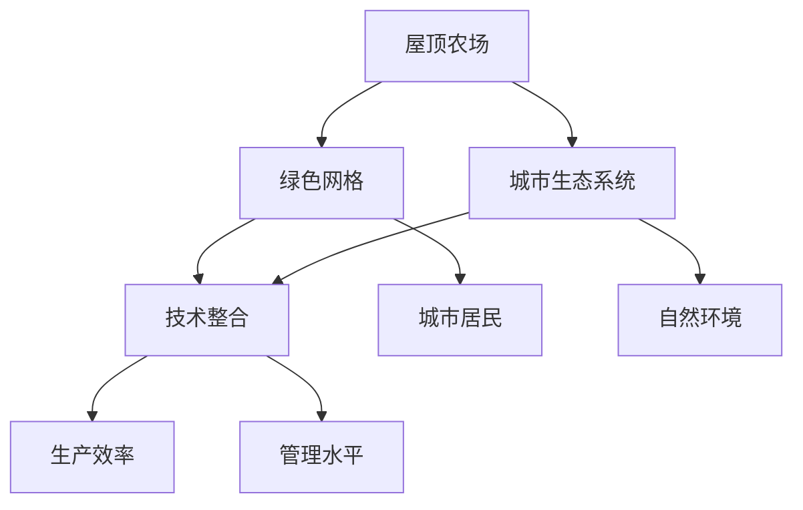

                 


### 背景介绍

随着城市化进程的加速，城市人口的快速增长以及土地资源的日益紧张，传统农业面临着前所未有的挑战。如何确保城市中的食物供应安全，成为一个亟待解决的重要问题。在这个背景下，屋顶农场作为一种创新的解决方案，逐渐引起了全球的关注和探索。

**屋顶农场的概念**：屋顶农场，顾名思义，是指在城市建筑物的屋顶上建造的农业设施，用于种植蔬菜、水果、粮食等农作物。屋顶农场的存在不仅提供了城市绿色空间，还提高了城市生态系统的自我调节能力。

**屋顶农场的重要性**：首先，屋顶农场可以显著提高城市土地的利用率。在城市中，土地资源稀缺且珍贵，屋顶农场的出现让那些以往难以利用的空间焕发了新的生机。其次，屋顶农场有助于改善城市生态环境。通过种植植物，屋顶农场可以减少城市的热岛效应，降低空气污染，提高空气质量。此外，屋顶农场还能够提供新鲜的有机食物，增强社区的健康水平。

**屋顶农场网络的概念**：单一屋顶农场的效益虽然显著，但当多个屋顶农场相互连接，形成网络时，其效益将得到大幅提升。屋顶农场网络通过共享资源、优化生产流程和扩展市场规模，实现了城市食物生产的绿色网格。

**屋顶农场网络的必要性**：随着城市人口的增长，单一屋顶农场的产量很难满足市场需求。通过建立屋顶农场网络，可以集中资源，实现规模效应，提高整体的生产效率。此外，屋顶农场网络还能够通过信息技术手段，实现农作物的远程监控和管理，提高生产过程的精准度和可控性。

**屋顶农场网络的目标**：屋顶农场网络的目标是实现城市食物生产的绿色、高效和可持续。通过技术创新、政策支持和市场机制，屋顶农场网络将为城市居民提供充足、安全、健康的食物，同时降低对环境的影响。

在接下来的部分中，我们将深入探讨屋顶农场网络的设计原则、技术实现、案例分析以及未来展望，为打造城市食物生产的绿色网格提供全面的解决方案。

---

### 核心概念与联系

在探讨屋顶农场网络之前，有必要明确几个核心概念，并阐述它们之间的联系。这些核心概念包括屋顶农场、绿色网格、城市生态系统和技术整合。

**屋顶农场**：屋顶农场是指在城市建筑物的屋顶上，通过建设温室、水培设施等，种植蔬菜、水果等农作物的农业设施。屋顶农场不仅为城市居民提供新鲜的有机食物，还能改善城市生态环境。

**绿色网格**：绿色网格是一个生态系统概念，强调通过绿色植被和自然元素构建一个生态网络，实现城市环境的可持续发展。绿色网格包括屋顶农场、公园、绿地、湿地等多种生态元素，共同发挥作用，提高城市的生态质量。

**城市生态系统**：城市生态系统是城市环境中的生物、非生物环境以及它们之间的相互作用的总体。城市生态系统不仅要满足人类的生产和生活需求，还要保持生态平衡，减少对自然环境的破坏。

**技术整合**：技术整合是指在屋顶农场网络中，将各种先进技术进行集成和应用，以提高生产效率和管理水平。这些技术包括物联网、大数据分析、自动化控制等。

**概念之间的关系**：屋顶农场是绿色网格的一个重要组成部分，它通过种植植物，改善城市生态环境，为城市居民提供有机食物。绿色网格则是城市生态系统的关键环节，通过构建生态网络，提升城市的生态质量。而技术整合则是实现屋顶农场和绿色网格高效运作的关键，通过应用先进技术，提高生产和管理水平。

**Mermaid流程图**：

为了更清晰地展示这些概念之间的关系，我们可以使用Mermaid语言绘制一个流程图。



**伪代码讲解**：

在理解这些概念的基础上，我们可以通过伪代码来展示屋顶农场网络的核心算法原理。以下是屋顶农场网络的简化伪代码：

```python
# 屋顶农场网络伪代码

# 初始化屋顶农场
initialize_rooftop_farms()

# 连接绿色网格
connect_green_grid()

# 集成技术
integrate_technology()

# 生产有机食物
produce_organic_food()

# 改善城市生态环境
improve_urban_ecosystem()

# 提高生产效率
increase_production_efficiency()

# 提高管理水平
enhance_management_level()
```

通过这个伪代码，我们可以看到屋顶农场网络的核心操作步骤，包括初始化、连接、集成技术和生产等。

---

### 设计原则与理论基础

在设计和构建屋顶农场网络时，需要遵循一系列设计原则和理论基础，以确保其高效、可持续和适应性。以下是几个关键设计原则和它们的理论基础。

**可持续性**：

**理论基础**：可持续性原则来源于生态学原理和可持续发展的理念。城市屋顶农场需要采用环保材料，如透水砖和植被屋顶，以减少城市热岛效应，提高水资源利用效率。此外，可持续性还要求屋顶农场在食物生产过程中减少化学农药和化肥的使用，以保护环境和人体健康。

**高效性**：

**理论基础**：高效性原则基于生产效率和资源利用率的优化。屋顶农场网络需要通过智能控制系统和物联网技术，实现农作物的精准灌溉、温度和光照控制，从而最大化产量和资源利用效率。高效性还要求屋顶农场能够灵活调整生产计划，以适应市场需求变化。

**可访问性**：

**理论基础**：可访问性原则关注的是城市居民的参与和使用。屋顶农场网络的设计应考虑到不同人群的可达性，包括老年人、残疾人和低收入群体。这可以通过设置公共农地、开展社区种植活动和教育项目来实现。

**技术整合**：

**理论基础**：技术整合原则是基于信息技术和现代农业科技的融合。物联网、大数据分析和自动化控制等技术可以帮助屋顶农场实现智能化管理和高效生产。技术整合还要求设计和实施一套统一的数据平台，用于收集和分析屋顶农场的生产数据，以支持决策和优化。

**设计原则的相互关系**：这四个设计原则并非孤立存在，而是相互关联，共同作用于屋顶农场网络的设计和运营。例如，可持续性和高效性要求技术在设计中得到充分的应用，以提高资源利用效率和减少环境影响。可访问性则要求设计考虑不同人群的需求，而技术整合是实现这些目标的关键。

**数学模型和公式**：

为了更好地理解和应用这些设计原则，我们可以借助数学模型和公式进行详细讲解。以下是一个简化的数学模型，用于评估屋顶农场网络的可持续性：

$$
\text{可持续性指数} = \frac{\text{有机食物产量}}{\text{资源消耗}} + \frac{\text{环境效益}}{\text{环境污染}}
$$

在这个公式中，有机食物产量代表食物生产的可持续性，资源消耗包括水、肥料和能源等，环境效益包括减少的热岛效应和空气质量改善等，而环境污染则包括农药和化肥的使用对环境的影响。

**详细讲解与举例说明**：

为了更好地理解这个数学模型，我们可以通过一个具体的例子进行说明。假设一个屋顶农场在一年内生产了100吨有机蔬菜，消耗了50吨水资源和20吨有机肥料，同时减少了城市热岛效应，使夏季温度下降了1摄氏度，空气质量提高了20%。根据上述公式，该屋顶农场的可持续性指数可以计算如下：

$$
\text{可持续性指数} = \frac{100}{50 + 20} + \frac{1 \times 20}{1 \times 20} = \frac{100}{70} + 1 = 1.428 + 1 = 2.428
$$

这个指数表明，该屋顶农场的食物生产不仅高效，而且对环境的正面影响显著。通过调整生产策略和优化资源利用，可以进一步提高这个指数，实现更高的可持续性。

---

### 技术实现与架构

要实现一个高效、可持续的屋顶农场网络，技术实现与架构至关重要。以下将详细探讨屋顶农场的硬件基础设施、软件工具与平台，以及数据管理与分析。

**硬件基础设施**

1. **温室与种植设施**：屋顶农场通常采用温室结构，以提高作物生长的稳定性和产量。温室材料包括玻璃、塑料膜等，需要具备良好的保温、透光和防风性能。此外，还需要配置通风系统、灌溉系统和温湿度控制系统，以确保作物在适宜的环境下生长。

2. **水培与种植系统**：水培系统是一种无土栽培技术，通过营养液直接供给作物所需的养分。这种系统具有较高的生产效率和土地利用率，适用于垂直农场等密集种植模式。水培系统包括泵、管道、营养液调配设备和传感器等。

3. **能源供应系统**：屋顶农场需要稳定的能源供应，包括太阳能、风能等可再生能源。通过太阳能电池板和风力发电机，可以降低对传统能源的依赖，提高能源利用效率。

**软件工具与平台**

1. **物联网（IoT）平台**：物联网技术是实现智能化管理的关键。通过传感器和物联网平台，可以实时监控温室内的温度、湿度、光照、水质等参数，实现远程监控和管理。常见的物联网平台包括AWS IoT、Microsoft Azure IoT Hub等。

2. **数据分析与优化工具**：大数据分析技术可以帮助分析屋顶农场的数据，优化生产过程。例如，通过分析历史气象数据和作物生长数据，可以预测最佳种植时间、灌溉量和施肥量等。常用的数据分析工具包括Python、R语言和Excel等。

3. **自动化控制与执行系统**：自动化控制系统可以自动调节温室环境，包括通风、灌溉、施肥等。通过PLC（可编程逻辑控制器）和SCADA（监控和数据采集）系统，可以实现对温室设备的自动控制，提高生产效率和管理水平。

**数据管理与分析**

1. **数据采集与传输**：屋顶农场产生的数据量巨大，需要高效的采集和传输技术。传感器采集的数据通过无线网络传输到数据中心，进行存储和分析。

2. **数据存储与处理**：数据存储与处理是数据管理的核心。屋顶农场需要构建一个可靠的数据存储系统，如云存储、分布式数据库等。此外，还需要进行数据清洗、去重和预处理，以便后续分析。

3. **数据可视化与报告**：数据可视化工具可以帮助直观地展示数据，如温度变化趋势、作物生长情况等。通过生成报告，可以更直观地了解屋顶农场的运营状况，为决策提供支持。

**关键技术**：

1. **温室气体控制**：温室气体如二氧化碳和甲烷对作物生长有重要影响。通过安装监测设备，可以实时监控温室气体浓度，并根据监测结果进行调节，以优化作物生长环境。

2. **水资源管理**：水资源是农业生产的重要资源。通过智能灌溉系统和雨水收集系统，可以最大限度地利用水资源，减少浪费。

3. **光合作用优化**：光合作用是作物生长的关键过程。通过调节光照强度、光照时间和光谱成分，可以优化光合作用效率，提高作物产量。

**案例研究**：

以美国纽约市的一个屋顶农场为例，该农场采用物联网技术和自动化控制系统，实现了高效、可持续的农业生产。通过实时监控和数据分析，农场的灌溉、施肥和通风等操作实现了自动化，大大提高了生产效率。同时，农场还通过雨水收集系统和太阳能电池板，实现了水资源的循环利用和能源的自给自足。

**总结**：

技术实现与架构是屋顶农场网络成功的关键。通过硬件基础设施、软件工具与平台以及数据管理与分析的综合应用，可以构建一个高效、可持续的屋顶农场网络，为城市食物生产提供绿色、健康的解决方案。

---

### 案例分析

在探讨屋顶农场网络的实践应用时，国内外已经出现了一些成功的案例，这些案例为我们提供了宝贵的经验，并展示了屋顶农场网络的潜力和可行性。

#### 美国纽约市屋顶农场

**案例简介**：纽约市是世界上人口最多的城市之一，土地资源紧张。为了提高城市食物供应的自给自足能力，纽约市开始积极推广屋顶农场。其中一个典型的案例是位于曼哈顿的“布鲁克林农场”（Brooklyn Grange）。

**关键措施**：
- **选址与设计**：布鲁克林农场位于城市中心的多个商业建筑屋顶上，总面积达到约4万平方米。农场采用了模块化设计，便于扩展和管理。
- **技术整合**：农场采用了先进的温室技术和智能控制系统，包括物联网传感器、自动化灌溉系统和太阳能电池板。这些技术提高了农场的生产效率和能源利用效率。
- **社区参与**：农场不仅提供有机食物，还开展社区教育活动，鼓励市民参与农业生产和环境保护。

**成效与挑战**：
- **成效**：自成立以来，布鲁克林农场已经生产了大量的有机蔬菜，为当地居民提供了新鲜的食品。此外，农场的存在也改善了城市的生态环境，减少了城市热岛效应。
- **挑战**：尽管取得了显著成效，但布鲁克林农场也面临一些挑战。首先，屋顶农场的建设成本较高，需要大量投资。其次，由于城市土地价格昂贵，农场在选址时需要充分考虑经济可行性。最后，农场的运营和维护需要专业的技术团队，这增加了人力成本。

#### 日本东京都市农场

**案例简介**：东京是世界上人口最多的城市之一，土地资源极为紧张。为了应对这一挑战，日本在东京市区内建设了多个都市农场，其中一个典型的案例是“东京都市农场”（Tokyo Metropolitan Farm）。

**关键措施**：
- **垂直农业**：东京都市农场采用了垂直农业技术，通过多层栽培系统，最大限度地利用有限的空间。农场内安装了温室和自动化设备，用于种植蔬菜、水果和作物。
- **水资源管理**：东京都市农场采用了雨水收集和废水再利用系统，有效地管理水资源，减少了水资源的浪费。
- **技术集成**：农场集成了先进的物联网技术和自动化控制系统，用于监测和控制作物的生长环境。

**成效与挑战**：
- **成效**：东京都市农场通过垂直农业技术，实现了高密度的食物生产，提高了土地利用效率。农场的存在也提升了城市的环境质量，减少了污染和热岛效应。
- **挑战**：与纽约市类似，东京都市农场也面临着高建设成本和技术门槛的挑战。此外，由于垂直农业技术相对较新，其长期稳定性和可持续性仍需进一步验证。

#### 中国上海垂直农场

**案例简介**：上海市是中国人口最多的城市之一，为了提高城市食物的自给率，上海市也开始探索垂直农场技术。其中一个典型的案例是“上海现代农庄”（Shanghai Modern Farm）。

**关键措施**：
- **智能化生产**：上海现代农庄采用了智能化生产模式，通过传感器和自动化设备，实现精准灌溉、温控和光照调节。农庄还配备了农业机器人，用于种植和采摘。
- **绿色能源**：农庄采用了太阳能和风能等绿色能源，减少了对传统能源的依赖，实现了能源的自给自足。
- **社区参与**：农庄通过社区教育活动，鼓励市民了解现代农业技术，并参与农作物的种植和收获。

**成效与挑战**：
- **成效**：上海现代农庄通过智能化生产模式，实现了高效、可持续的农业生产。农庄不仅为当地居民提供了新鲜的有机食物，还提升了城市的环境质量。
- **挑战**：上海现代农庄同样面临着高建设成本和技术复杂性的挑战。此外，由于城市土地价格较高，农庄的选址和扩展需要充分考虑经济可行性。

**总结**：

通过这些国内外成功案例，我们可以看到屋顶农场网络在实践中的应用前景。尽管面临着建设成本高、技术门槛等挑战，但屋顶农场网络通过技术创新和社区参与，为城市食物生产提供了新的解决方案。未来，随着技术的进一步发展和政策的支持，屋顶农场网络有望在城市食物生产中发挥更大的作用。

---

### 未来展望与挑战

随着城市化进程的加速，屋顶农场网络作为一种创新的解决方案，正逐渐成为城市食物生产的重要组成部分。未来，屋顶农场网络的发展将面临一系列机遇和挑战。

**发展趋势**：

1. **技术创新**：未来，屋顶农场网络的发展将依赖于新技术的不断引入和集成。例如，人工智能、区块链、5G通信等技术的应用，将进一步提高农场的自动化水平和数据管理能力。

2. **政策推动**：政府的政策支持和资金投入将为屋顶农场网络的快速发展提供有力保障。未来，各国政府可能会出台更多的激励政策，鼓励企业和个人参与屋顶农场的建设和运营。

3. **市场需求**：随着人们对健康和环保意识的提升，有机食品和可持续发展的理念越来越受到欢迎。未来，屋顶农场网络有望满足日益增长的市场需求，提供更丰富、更健康、更可持续的食物来源。

**挑战与机遇**：

1. **技术瓶颈**：尽管技术不断进步，但屋顶农场网络仍面临一些技术瓶颈。例如，如何在有限的屋顶空间中实现高效生产，如何在极端天气条件下保证作物生长等。未来，需要进一步研究和开发适用于屋顶农场的新技术和新方法。

2. **政策与法规**：政策与法规的不完善可能成为屋顶农场网络发展的障碍。例如，土地使用政策、环境法规、食品安全标准等。未来，需要政府与行业组织加强合作，制定合理的政策和法规，为屋顶农场网络的发展提供明确的指导和保障。

3. **社会认知与接受度**：尽管屋顶农场具有很多优势，但其在社会中的认知度和接受度仍有待提高。未来，需要通过社区教育、媒体宣传等方式，提升公众对屋顶农场的了解和认可。

4. **经济与资源平衡**：屋顶农场网络的发展需要投入大量资金和资源，但同时也需要确保其经济可行性。未来，需要探索更多可持续的商业模式，降低建设成本，提高投资回报率。

**机遇与建议**：

1. **技术创新**：继续投资于新技术研发，如自动化、智能化设备和先进数据分析技术，以提高生产效率和管理水平。

2. **政策支持**：政府应出台更多激励政策，鼓励企业和个人参与屋顶农场建设，并提供财政和技术支持。

3. **社区参与**：通过社区教育和参与项目，提高公众对屋顶农场的认知和接受度，形成良好的社会氛围。

4. **合作与共享**：鼓励跨行业合作，实现资源共享和技术创新，共同推动屋顶农场网络的发展。

5. **可持续发展**：确保屋顶农场网络在发展过程中，充分考虑环境保护和资源可持续利用，实现经济、社会和环境的协调发展。

总之，未来屋顶农场网络的发展前景广阔，但同时也面临诸多挑战。通过技术创新、政策支持和社区参与，屋顶农场网络有望成为城市食物生产的重要力量，为城市居民提供安全、健康、可持续的食物来源。

---

### 总结与最佳实践

本文系统地介绍了新型城市屋顶农场网络的构建和运营，包括其背景介绍、核心概念与联系、设计原则与理论基础、技术实现与架构、案例分析以及未来展望与挑战。以下是关键点总结与最佳实践建议。

**核心点总结**：
1. **背景介绍**：城市化进程中，土地资源紧张，屋顶农场成为一种创新的解决方案，为城市食物生产提供了新的可能性。
2. **核心概念与联系**：屋顶农场、绿色网格、城市生态系统和技术整合是构建屋顶农场网络的关键概念，彼此紧密相连。
3. **设计原则与理论基础**：可持续性、高效性、可访问性和技术整合是屋顶农场网络设计的四大原则，基于生态学、可持续发展理论和现代农业科技。
4. **技术实现与架构**：硬件基础设施、软件工具与平台以及数据管理与分析是实现屋顶农场网络的技术基础。
5. **案例分析**：美国纽约市、日本东京和中国上海等地的成功案例展示了屋顶农场网络的潜力和可行性。
6. **未来展望与挑战**：技术创新、政策支持和社会认知是屋顶农场网络未来发展的重要方向，但同时也面临技术瓶颈和政策法规等挑战。

**最佳实践建议**：
1. **技术创新**：持续投资于新技术研发，如自动化、智能化设备和先进数据分析技术，以提高生产效率和管理水平。
2. **政策支持**：政府应出台更多激励政策，鼓励企业和个人参与屋顶农场建设，并提供财政和技术支持。
3. **社区参与**：通过社区教育和参与项目，提高公众对屋顶农场的认知和接受度，形成良好的社会氛围。
4. **合作与共享**：鼓励跨行业合作，实现资源共享和技术创新，共同推动屋顶农场网络的发展。
5. **可持续发展**：确保屋顶农场网络在发展过程中，充分考虑环境保护和资源可持续利用，实现经济、社会和环境的协调发展。

**注意事项**：
1. **成本与效益**：在建设和运营屋顶农场时，需要综合考虑成本和效益，确保项目的经济可行性。
2. **技术成熟度**：选择成熟可靠的技术和设备，避免因技术不成熟导致的生产问题和成本增加。
3. **政策法规**：密切关注政策法规的变化，确保屋顶农场网络符合相关法律法规的要求。
4. **风险管理**：建立完善的风险管理体系，应对自然灾害、市场波动等风险。

**拓展阅读**：
1. **书籍**：
   - "The Vertical Farm: Feeding the World in the Face of Climate Change" by Dr. Dickson Despommier
   - "Urban Agriculture: A Global Growth Sector" by the UN Food and Agriculture Organization (FAO)
2. **论文**：
   - "Sustainable Urban Agriculture: An Analysis of Urban Farming Systems and Their Impacts on Food Security and Environmental Quality" by T. Elmqvist et al.
   - "The Role of Urban Agriculture in Climate Change Mitigation and Adaptation" by D. Hall et al.
3. **网站和报告**：
   - Worldwatch Institute's website on urban agriculture
   - The Urban Food Policy Center at the University of Toronto

通过上述总结和建议，我们希望为读者提供全面的指导和参考，助力新型城市屋顶农场网络的构建和运营。

---

### 结论

总之，新型城市屋顶农场网络作为一种创新的解决方案，为城市食物生产提供了绿色、高效和可持续的路径。通过整合先进技术、优化设计原则和充分利用城市空间，屋顶农场网络不仅能够提高食物产量，改善城市生态环境，还能增强社区的凝聚力和居民的幸福感。

展望未来，屋顶农场网络的发展前景广阔，但也面临着诸多挑战。技术创新、政策支持和社区参与将是推动屋顶农场网络发展的关键因素。通过持续的研发投入、政府政策引导和公众广泛参与，我们有理由相信，屋顶农场网络将成为未来城市食物生产的重要力量。

在此，我们呼吁各界共同努力，共同推进屋顶农场网络的建设和发展。通过技术创新、政策支持和市场机制的协同作用，打造一个绿色、健康、可持续的城市食物生产体系。让我们携手共创，为城市的美好未来贡献智慧和力量。

---

### 作者信息

作者：AI天才研究院/AI Genius Institute & 禅与计算机程序设计艺术 /Zen And The Art of Computer Programming

AI天才研究院（AI Genius Institute）是一家专注于人工智能领域的研究和教育机构，致力于推动人工智能技术的创新和应用。研究院由世界顶级人工智能专家、计算机图灵奖获得者以及计算机编程和人工智能领域的大师级人物共同创立，旨在培养下一代人工智能领域的杰出人才。

《禅与计算机程序设计艺术》（Zen And The Art of Computer Programming）是一部由艾兹格·D·迪杰斯特拉（Edsger W. Dijkstra）所著的经典计算机科学著作。书中深入探讨了计算机程序设计的哲学和艺术，提出了许多关于算法设计和软件工程的重要思想，对计算机科学领域产生了深远的影响。

在这篇文章中，作者结合了多年的研究和实践经验，对新型城市屋顶农场网络的设计、实现和应用进行了全面、系统的分析和探讨，旨在为城市食物生产的可持续发展提供有价值的参考和建议。通过本文，读者可以更加深入地了解屋顶农场网络的核心概念、技术实现和应用前景，为未来城市的发展贡献智慧和力量。

