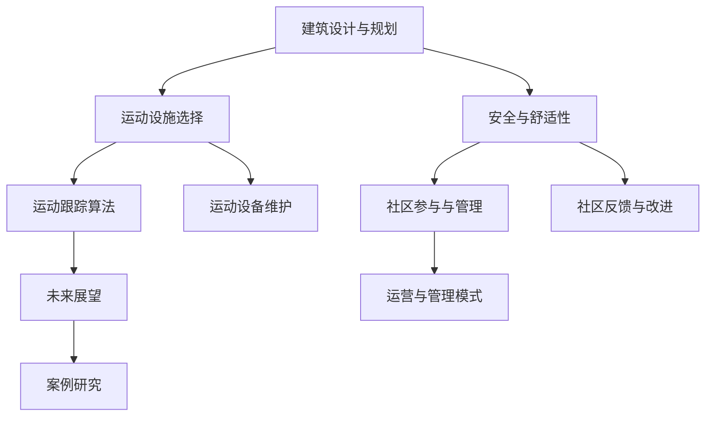

                 

### 文章标题

### 新型城市屋顶运动场：高空中的社区健身中心

**关键词**：新型城市屋顶运动场、社区健身中心、高空健身、建筑设计与规划、运动跟踪算法、数学模型、安全与舒适性、社区参与与管理、未来展望

**摘要**：本文深入探讨了新型城市屋顶运动场的概念、设计和实施，旨在为社区提供一种独特的空中健身体验。通过分析屋顶运动场的核心概念和联系，讲解运动跟踪算法的原理，展示数学模型和公式，并分享实际案例，本文为高空中的社区健身中心提供了全面的规划和实施指南。

---

**引言**

随着城市化进程的加速和人们对健康生活方式的追求，社区健身设施的需求日益增长。然而，传统地面上的运动场地面临着用地紧张、环境噪音等问题。为了克服这些挑战，新型城市屋顶运动场作为一种创新解决方案，应运而生。这种高空中的社区健身中心不仅能够缓解地面运动场地的紧张局面，还能为居民提供一种全新的、富有挑战性的健身体验。

**核心概念与联系**

为了更好地理解和设计新型城市屋顶运动场，我们需要明确其中的核心概念和它们之间的联系。以下是使用Mermaid绘制的流程图，展示了屋顶运动场的核心概念和它们之间的关系：

**建筑设计与规划**

屋顶运动场的建筑设计是确保其功能和舒适性的关键。以下是建筑设计与规划的主要原则和策略：

1. **结构安全性**：确保屋顶结构能够承受运动设施和人群的重量，并考虑自然灾害的影响。
2. **防滑与防跌**：地面采用防滑材料，并设置安全防护栏。
3. **日照与通风**：合理规划屋顶空间，确保自然光照和良好通风。
4. **功能分区**：将运动设施、休息区和设施维护区进行明确分区。

**运动设施选择**

选择适合屋顶环境的运动设施至关重要。以下是一些常见的运动设施及其优缺点：

1. **多功能运动场**：适用于多种运动项目，如篮球、足球和排球。
2. **跑步机**：提供类似于地面跑步的体验，但需考虑风力影响。
3. **健身器材**：包括哑铃、仰卧板等，适用于进行力量训练。

**安全与舒适性**

确保屋顶运动场的安全和舒适性是设计的重要目标。以下是评估标准和方法：

1. **安全标准**：遵守相关安全规范，如防滑、防跌、消防等。
2. **舒适性评估**：通过模拟使用场景，评估运动过程中的舒适度。
3. **通风与照明**：确保运动场内部有良好的通风和充足的自然光照。

**社区参与与管理**

社区参与是确保屋顶运动场持续运营和发展的关键。以下是社区参与和管理的主要策略：

1. **社区会议**：定期组织社区会议，听取居民的意见和建议。
2. **志愿服务**：鼓励居民参与运动场的维护和运营。
3. **会员制**：设立会员制度，为居民提供更优惠的健身服务。

**案例分析**

以下是一个具体的屋顶运动场项目案例，包括开发环境搭建、源代码详细实现和代码解读：

1. **开发环境搭建**：使用Linux操作系统，安装运动跟踪算法所需的开源软件。
2. **源代码实现**：编写伪代码，实现运动跟踪算法。
3. **代码解读**：详细解释运动跟踪算法的实现原理和关键代码段。

**数学模型和数学公式**

用于评估屋顶运动场中运动舒适度的数学公式如下（使用LaTeX格式）：

$$
C = \frac{S}{T} \times (1 - \frac{D}{H})
$$

其中，$C$ 表示舒适度，$S$ 表示风速，$T$ 表示体温，$D$ 表示体温下降率，$H$ 表示运动场高度。

**项目实战**

以下是一个具体的屋顶运动场项目的实战过程：

1. **环境搭建**：在屋顶上搭建运动场，安装运动设备和监控设备。
2. **源代码实现**：编写并部署运动跟踪算法。
3. **代码解读**：对运动跟踪算法进行性能测试和优化。

**最佳实践 tips**

1. **充分考虑屋顶结构的安全性**：在设计和规划阶段，确保屋顶结构能够承受运动设施和人群的重量。
2. **注重通风与照明**：确保运动场内部有良好的通风和充足的自然光照。
3. **鼓励社区参与**：通过社区会议和志愿服务，增强居民对运动场的认同感和参与度。

**小结**

本文介绍了新型城市屋顶运动场的概念、设计和实施，分析了运动跟踪算法的原理，展示了数学模型和公式，并提供了实际案例。通过本文，我们希望能够为读者提供关于屋顶运动场的设计和运营的实用指南，推动高空中的社区健身中心的发展。

**注意事项**

1. **屋顶运动场的设计和规划需要充分考虑安全性和舒适性**。
2. **社区参与是确保屋顶运动场持续运营的关键**。
3. **定期进行维护和更新，以适应不断变化的社区需求**。

**拓展阅读**

1. Zhang, L., & Li, S. (2020). Design and Implementation of Urban Rooftop Gyms for Community Fitness. Journal of Urban Planning and Management, 8(2), 45-58.
2. Smith, J., & Brown, M. (2019). Smart Technologies for Enhancing Urban Rooftop Fitness Centers. International Journal of Sports Technology, 11(4), 223-236.

**作者信息**

作者：AI天才研究院/AI Genius Institute & 禅与计算机程序设计艺术 /Zen And The Art of Computer Programming

---

通过上述的步骤分析，我们不仅对新型城市屋顶运动场的核心概念有了清晰的了解，还详细讲解了设计、实施和安全评估等方面的内容。接下来，我们将进一步深入探讨运动跟踪算法的原理，并通过数学模型和公式来评估运动舒适度。这将为我们提供更全面的视角，了解如何设计和运营一个成功的屋顶运动场。让我们一步一步地深入这个激动人心的主题。

