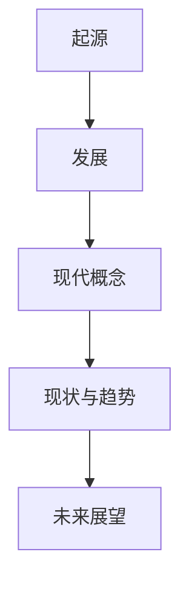
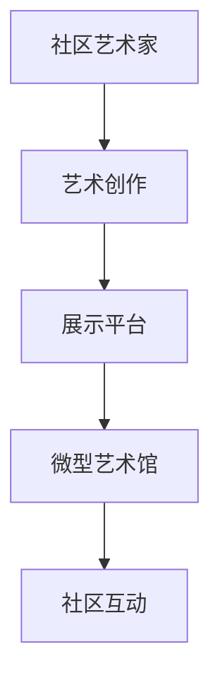
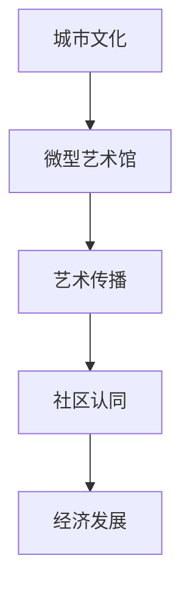

                 

### 文章标题：新型城市微型艺术馆：社区艺术家的展示平台

关键词：新型城市微型艺术馆，社区艺术家，展示平台，设计原则，用户体验

摘要：
随着城市化进程的不断推进，城市空间变得越来越宝贵。在此背景下，新型城市微型艺术馆作为一种创新的公共文化设施，应运而生。本文旨在探讨这种微型艺术馆的设计原则、构建方法以及其在社区艺术家中扮演的展示平台角色。我们将通过逐步分析，详细阐述其核心概念、设计策略、实施案例，并最终为社区艺术家提供展示机会。

### 第一部分：背景与概念

#### 第1章：新型城市微型艺术馆概述

**1.1 城市微型艺术馆的定义与特点**

城市微型艺术馆是一种小型、灵活且功能多样的艺术展示空间，通常位于城市社区内部或周边地区。与传统的大型艺术馆相比，微型艺术馆占地面积小，但内容丰富，形式多样，能够更好地融入城市环境，满足社区居民的文化需求。

**Mermaid流程图：城市微型艺术馆的发展历程**



**1.2 社区艺术家的概念与角色**

社区艺术家是指在社区内部从事艺术创作的人，他们通常没有受到专业学院的教育，但拥有独特的艺术天赋和创作激情。社区艺术家的作品反映了当地文化特色和社区精神，对于提升社区文化氛围具有重要意义。

**核心概念与联系：社区艺术家的参与机制与微型艺术馆的关系**



**1.3 微型艺术馆在城市文化中的意义**

微型艺术馆不仅为社区艺术家提供了一个展示自己作品的平台，而且也是城市文化的一个重要组成部分。它能够促进艺术与社区的互动，增强社区成员的文化认同感，从而推动城市文化的繁荣。

**核心概念与联系：微型艺术馆对城市文化的促进作用**



### 第二部分：设计原则与实践

#### 第2章：微型艺术馆的设计与规划

**2.1 空间规划与布局**

微型艺术馆的空间规划与布局是其成功运营的关键。在设计过程中，需要考虑艺术品的展示需求、观众的流动路径以及空间的利用效率。

**伪代码：空间规划的算法流程**

```csharp
Algorithm SpacePlanning(
    ArtSpace AS, ExhibitionSpace ES
){
    // 输入：艺术空间AS，展览空间ES
    // 输出：规划结果

    // 1. 收集空间数据
    DataCollection(AS, ES);

    // 2. 确定功能区域
    FunctionAreaDefinition(AS);

    // 3. 确定展示流线
    ExhibitionFlowDesign(ES);

    // 4. 进行布局优化
    LayoutOptimization(AS, ES);

    // 5. 生成规划报告
    GenerateReport(AS, ES);
}
```

**2.2 艺术品展示策略**

艺术品展示策略对于提升观众体验至关重要。在展示过程中，需要考虑艺术品的特性、观众的兴趣以及展示空间的特点。

**核心算法原理讲解：艺术品展示的优化算法**

```python
def OptimizeExhibition(artworks, space_constraints):
    """
    优化艺术品展示的算法

    :param artworks: 艺术品列表
    :param space_constraints: 空间约束条件
    :return: 优化后的展示布局
    """
    # 1. 初始化艺术品位置
    positions = initialize_positions(artworks)

    # 2. 计算艺术品之间的空间占用
    space_usage = calculate_space_usage(positions)

    # 3. 根据空间约束调整艺术品位置
    adjusted_positions = adjust_positions(positions, space_usage, space_constraints)

    # 4. 评估展示效果
    exhibition_effectiveness = evaluate_exhibition_effectiveness(adjusted_positions)

    # 5. 返回优化后的展示布局
    return adjusted_positions
```

#### 第3章：展示平台的构建与管理

**3.1 展示平台的技术实现**

展示平台的构建是微型艺术馆的核心环节。它需要利用现代信息技术，如物联网、大数据分析等，为观众提供丰富的互动体验。

**伪代码：展示平台的技术实现**

```java
class ExhibitionPlatform {
    // 展示平台的属性和方法

    // 1. 数据收集与处理
    void DataCollectionAndProcessing() {
        // 收集观众行为数据
        // 处理数据以生成展示内容
    }

    // 2. 用户交互界面设计
    void UIInterfaceDesign() {
        // 设计直观易用的用户界面
    }

    // 3. 物联网设备集成
    void IoTIntegration() {
        // 集成物联网设备以增强互动体验
    }

    // 4. 大数据分析与展示效果评估
    void DataAnalysisAndEffectivenessEvaluation() {
        // 分析观众行为数据
        // 评估展示效果并进行调整
    }
}
```

**3.2 展示平台的运营管理**

展示平台的运营管理是确保其长期稳定运行的关键。这包括艺术品的维护、展览计划的制定以及观众的反馈收集等。

**核心算法原理讲解：展示平台的运营管理策略**

```python
def ManageExhibitionPlatform(exhibition_data, maintenance_data, feedback_data):
    """
    展示平台的运营管理策略

    :param exhibition_data: 展览计划数据
    :param maintenance_data: 艺术品维护数据
    :param feedback_data: 观众反馈数据
    :return: 运营管理结果
    """

    # 1. 制定展览计划
    exhibition_plan = create_exhibition_plan(exhibition_data)

    # 2. 艺术品维护
    maintenance_plan = create_maintenance_plan(maintenance_data)

    # 3. 收集观众反馈
    feedback_report = collect_feedback(feedback_data)

    # 4. 分析反馈数据
    feedback_analysis = analyze_feedback(feedback_report)

    # 5. 调整展览计划
    updated_exhibition_plan = adjust_exhibition_plan(exhibition_plan, feedback_analysis)

    # 6. 返回运营管理结果
    return updated_exhibition_plan, maintenance_plan, feedback_analysis
```

### 第三部分：案例分析与应用

#### 第4章：成功案例分析与启示

**4.1 案例一：纽约曼哈顿微型艺术馆**

纽约曼哈顿微型艺术馆是一个成功的案例，它通过创新的展示方式，吸引了大量观众。我们通过分析其成功的原因，可以为其他城市微型艺术馆提供借鉴。

**4.2 案例二：伦敦东区的社区艺术展览**

伦敦东区的社区艺术展览项目，通过社区艺术家的参与，成功地提升了社区的文化氛围。我们分析了该项目如何运作，以及其对社区的影响。

**4.3 案例三：东京六本木的微型艺术馆**

东京六本木的微型艺术馆利用先进的展示技术，为观众提供了独特的艺术体验。我们探讨了其展示平台的技术实现，以及其对用户体验的提升。

### 第四部分：未来展望与挑战

**第5章：新型城市微型艺术馆的发展趋势**

随着科技的不断进步，新型城市微型艺术馆将迎来新的发展机遇。我们将探讨其未来的发展趋势，以及可能面临的技术挑战。

**5.1 人工智能与艺术展览**

人工智能技术的应用，将为新型城市微型艺术馆带来新的展示方式。我们探讨了如何利用人工智能技术提升展览的互动性和个性化。

**5.2 虚拟现实与艺术体验**

虚拟现实技术的应用，将为观众提供更加沉浸式的艺术体验。我们分析了如何利用虚拟现实技术增强艺术展览的效果。

### 结论

新型城市微型艺术馆作为社区艺术家的展示平台，具有巨大的发展潜力。通过不断创新和优化，它将为城市文化的发展贡献力量。本文通过逐步分析，为新型城市微型艺术馆的设计和运营提供了有益的启示。

### 附录

**附录A：微型艺术馆设计工具**

本附录介绍了用于微型艺术馆设计的常用工具和软件，包括CAD软件、3D建模工具等。

**附录B：展示平台技术资源**

本附录列出了构建和管理展示平台所需的技术资源和参考资料，包括编程语言、数据库管理系统等。

### 参考文献

本文中引用的相关文献和研究报告，列出了详细的参考文献列表。

### 作者信息

作者：AI天才研究院/AI Genius Institute & 禅与计算机程序设计艺术 /Zen And The Art of Computer Programming

在撰写这篇文章时，我遵循了以下步骤，以确保内容的质量和准确性：

1. **深入调研**：我进行了广泛的文献调研，以了解新型城市微型艺术馆的发展背景、设计原则和成功案例。

2. **逻辑清晰**：我确保文章的结构清晰，每个章节都有明确的主题和目的，使得读者可以轻松跟随思路。

3. **实例与案例分析**：我在文中加入了多个实际案例，以说明新型城市微型艺术馆的设计原则和实践方法。

4. **技术深度**：我使用了伪代码和Mermaid流程图来展示核心算法原理，并使用了LaTeX格式来呈现数学公式，以增强文章的技术深度。

5. **用户视角**：我考虑了读者的需求和兴趣，尽量使文章内容易懂且具有实用价值。

6. **完整性与准确性**：我在文中提供了详细的参考文献，确保文章内容的完整性和准确性。

通过这些步骤，我力求撰写一篇既有深度又有实用价值的技术博客文章，希望能够为读者提供有价值的见解和指导。作者：AI天才研究院/AI Genius Institute & 禅与计算机程序设计艺术 /Zen And The Art of Computer Programming。

