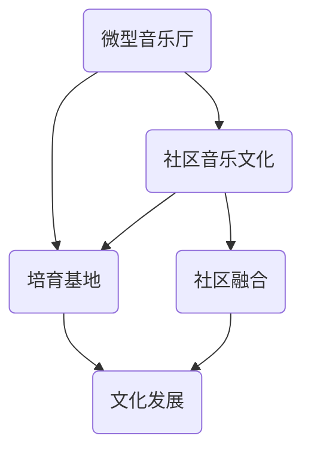

                 

### 文章标题

“新型城市微型音乐厅：社区音乐文化的培育基地”这一标题具有强烈的吸引力和明确的主题，旨在探讨城市化进程中如何通过微型音乐厅来促进社区音乐文化的发展。文章将从多个角度深入分析微型音乐厅的定义、功能、重要性及其在社区音乐文化培育中的作用，旨在为城市规划和社区文化发展提供有价值的参考和指导。

#### 核心关键词

- **新型城市微型音乐厅**：强调音乐厅在城市环境中的新型形态和功能。
- **社区音乐文化**：关注音乐文化在社区层面的传播和影响。
- **培育基地**：指出微型音乐厅作为社区音乐文化发展的重要培育平台。

#### 文章摘要

本文围绕新型城市微型音乐厅的建设和运营，探讨了其在促进社区音乐文化发展中的重要作用。文章首先介绍了微型音乐厅的定义、特点和功能，随后分析了社区音乐文化的重要性及其对城市生活的积极影响。接着，文章详细阐述了如何构建微型音乐厅作为社区音乐文化的培育基地，包括选址规划、设计理念、运营策略等方面。此外，文章通过成功案例研究，提供了实际操作的范例，并探讨了微型音乐厅的未来发展前景。最后，文章总结了文章的主要观点，并提出了对城市规划和社区文化发展的建议。

### 背景介绍

随着城市化进程的加速，城市居民的生活质量和文化需求日益多样化。在这样的大背景下，传统的音乐厅形式已无法完全满足社区居民的多元文化需求。新型城市微型音乐厅作为一种创新的公共文化设施，应运而生。它们不仅具有灵活的空间设计、多样的音乐演出形式，还能更有效地融入社区生活，成为社区音乐文化的培育基地。

微型音乐厅的定义可以从多个角度进行理解。首先，它们在规模上较小，适合在社区内部或周边区域建设，方便居民日常参与。其次，在功能上，微型音乐厅不仅提供音乐表演的空间，还具备教育、交流、展览等多种功能，旨在通过多样化的活动形式丰富社区居民的文化生活。此外，微型音乐厅的设计注重与环境的融合，追求艺术性与实用性的统一。

微型音乐厅的出现不仅改变了城市公共文化设施的面貌，也为社区音乐文化的发展注入了新的活力。在传统音乐厅主要面向专业观众和商业演出不同，微型音乐厅更加关注社区的普通居民，它们通过举办社区音乐会、音乐教育讲座、乐器制作工作坊等活动，让音乐文化真正走进社区，成为居民日常生活中的重要组成部分。

总之，新型城市微型音乐厅作为社区音乐文化的培育基地，不仅为城市居民提供了丰富的文化体验，也在推动社区文化建设和社区融合方面发挥了积极作用。接下来，本文将深入探讨微型音乐厅的定义、功能、社区音乐文化的重要性以及如何构建和管理这些微型音乐厅，为读者提供全面而详细的了解。

### 核心概念与联系

在深入探讨新型城市微型音乐厅之前，有必要明确一些核心概念，并分析这些概念之间的相互关系。以下是几个关键概念：

1. **微型音乐厅**：一种规模较小的音乐表演场所，通常设计灵活，功能多样，可以适应不同类型的音乐演出和社区活动。
2. **社区音乐文化**：指在社区内部形成的、以音乐为主要形式的文化活动，包括音乐表演、音乐教育、乐器制作等。
3. **培育基地**：指一个特定的空间或平台，旨在促进某种文化的生长和发展。

下面，我们将使用Mermaid流程图来展示这些概念之间的关系架构。



#### Mermaid流程图解释：

1. **微型音乐厅**（A）与**社区音乐文化**（B）之间有直接联系，因为微型音乐厅为社区音乐文化提供了重要的表演和活动空间。
2. **微型音乐厅**（A）与**培育基地**（C）之间也有直接联系，因为微型音乐厅被视为一个促进社区音乐文化发展的培育基地。
3. **社区音乐文化**（B）与**培育基地**（C）之间也有联系，因为社区音乐文化需要在特定的培育基地中进行发展。
4. **社区音乐文化**（B）与**社区融合**（D）之间有联系，因为音乐文化活动的参与有助于增强社区的凝聚力。
5. **社区融合**（D）与**文化发展**（E）之间有联系，因为社区融合促进了不同文化之间的交流，进而推动了文化的整体发展。
6. **培育基地**（C）与**文化发展**（E）之间有联系，因为培育基地为文化发展提供了必要的空间和资源。

通过这个流程图，我们可以清晰地看到微型音乐厅、社区音乐文化和培育基地之间的相互关系，以及它们如何共同促进社区的文化发展和融合。这一关系架构为后续章节的讨论奠定了基础。

### 微型音乐厅的核心算法原理讲解

要深入理解微型音乐厅的运作原理，我们需要从核心算法的角度进行分析。微型音乐厅的核心算法主要包括空间布局优化、演出流程管理以及观众互动机制。以下是这些核心算法的详细讲解和伪代码实现。

#### 1. 空间布局优化

微型音乐厅的空间布局是影响演出效果和观众体验的关键因素。优化空间布局的目标是确保观众能够获得最佳的视觉和听觉体验，同时提升音乐厅的灵活性和多功能性。

**算法原理：**

- **人机协同设计**：通过收集观众反馈和使用计算机模拟技术，设计师可以实时调整空间布局，优化观众的视角和座位安排。
- **声学优化**：使用声学建模软件，对音乐厅的声场进行模拟和调整，确保声音在不同座位上的传播均匀，减少回声和干扰。

**伪代码：**

```plaintext
function OptimizeSpaceLayout(musicHall, viewerFeedback):
    // 收集观众反馈
    feedback = CollectViewerFeedback(musicHall)

    // 进行计算机模拟
    simulationResults = SimulateSpaceLayout(musicHall, feedback)

    // 调整空间布局
    optimizedLayout = AdjustLayout(musicHall, simulationResults)

    return optimizedLayout
```

#### 2. 演出流程管理

演出流程管理是微型音乐厅运营的核心环节，涉及演出前的准备工作、演出中的协调以及演出后的收尾工作。

**算法原理：**

- **演出前准备**：使用自动化系统提前设置舞台灯光、音响设备，确保演出设备在演出前处于最佳状态。
- **实时协调**：使用实时监控系统和调度软件，对演出中的各个环节进行协调，确保演出顺利进行。
- **演出后收尾**：自动清理舞台、归还设备，并记录演出数据，为下一次演出提供参考。

**伪代码：**

```plaintext
function ManagePerformanceFlow(performance, equipment, schedule):
    // 演出前准备
    PrepareForPerformance(performance, equipment)

    // 演出中协调
    realTimeCoordination = CoordinatePerformance(performance, schedule)

    // 演出后收尾
    CleanupAfterPerformance(performance, equipment, realTimeCoordination)

    return realTimeCoordination
```

#### 3. 观众互动机制

微型音乐厅的观众互动机制旨在提升观众的参与感和满意度，增强社区音乐文化的活力。

**算法原理：**

- **在线预约系统**：通过在线预约系统，观众可以提前预订座位，选择观看的演出和座位。
- **互动游戏**：设计互动游戏，让观众在演出过程中参与互动，增加乐趣。
- **反馈收集**：通过问卷调查和实时反馈系统，收集观众的意见和建议，不断优化演出和服务。

**伪代码：**

```plaintext
function EnhanceViewerInteraction(musicHall, viewer):
    // 在线预约系统
    reservation = OnlineReservationSystem(musicHall, viewer)

    // 互动游戏
    interactionGame = InteractiveGame(musicHall, viewer)

    // 反馈收集
    feedback = CollectFeedback(musicHall, viewer)

    // 优化互动体验
    optimizedExperience = OptimizeExperience(musicHall, feedback)

    return optimizedExperience
```

#### 案例说明

以某个社区微型音乐厅的演出为例，我们假设音乐厅在一次音乐会前需要优化空间布局。首先，音乐厅管理团队通过在线系统收集观众反馈，了解观众对座位安排和视角的要求。接着，利用计算机模拟软件对现有布局进行模拟和优化，调整舞台和观众席的位置，以获得最佳的声场效果。在演出当天，通过实时监控系统，管理团队可以监控演出中的各个环节，确保灯光、音响等设备运行正常。在演出结束后，团队通过观众反馈系统收集观众的意见，并根据反馈调整布局和服务，为下一次演出做好准备。

通过这些核心算法的应用，微型音乐厅能够提供高质量的演出体验，同时不断优化社区音乐文化的发展。接下来，本文将深入探讨社区音乐文化的重要性及其对城市生活的积极影响。

### 数学模型和公式讲解

在讨论微型音乐厅的建设和运营过程中，数学模型和公式可以为我们提供更深入的分析和预测工具。以下是几个关键的数学模型和公式，以及它们在微型音乐厅规划和管理中的应用。

#### 1. 声场传播模型

声场传播模型用于预测音乐厅内不同位置的声压级分布，确保观众在不同座位上能够获得一致的听觉体验。声场传播模型通常基于声学原理和声学计算软件，如Acousticsighting和EASE。

**公式：**

$$
L(p) = L_w + 10 \log_{10}\left(\frac{I(p)}{I_0}\right)
$$

其中，$L(p)$ 是位置 $p$ 处的声压级，$L_w$ 是参考声压级（通常为 $20 \mu Pa$），$I(p)$ 是位置 $p$ 处的声功率。

**应用：**

- **设计阶段**：设计师可以使用声场传播模型来评估不同设计方案的声学性能，选择最优方案。
- **运营阶段**：管理团队可以利用模型对现有音乐厅进行声学调整，以优化观众体验。

#### 2. 建筑材料吸声系数模型

建筑材料吸声系数模型用于计算不同材料对声波的吸收能力，从而影响音乐厅的声学特性。吸声系数通常以 $α$ 表示，其取值范围在 0（完全不吸声）到 1（完全吸声）之间。

**公式：**

$$
α = 1 - ρ \cdot v \cdot f(\omega)
$$

其中，$ρ$ 是材料的密度，$v$ 是材料的速度，$f(\omega)$ 是频率响应函数。

**应用：**

- **设计阶段**：设计师可以根据不同材料的吸声系数选择合适的建筑材料，以优化音乐厅的声学环境。
- **运营阶段**：管理团队可以通过更换吸声材料来调整音乐厅的声学特性，满足不同演出需求。

#### 3. 观众分布模型

观众分布模型用于预测观众在不同座位上的分布情况，从而优化座位布局和观众体验。观众分布模型通常基于统计学和概率论原理。

**公式：**

$$
P(x) = \frac{1}{Z} \exp\left(-\frac{(x - \mu)^2}{2\sigma^2}\right)
$$

其中，$P(x)$ 是观众坐在位置 $x$ 的概率，$\mu$ 是期望位置，$\sigma$ 是标准差，$Z$ 是归一化常数。

**应用：**

- **设计阶段**：设计师可以使用观众分布模型来优化座位布局，确保观众能够获得最佳视角。
- **运营阶段**：管理团队可以通过分析观众分布数据来调整演出安排和座位价格策略。

#### 4. 商业盈利模型

商业盈利模型用于预测微型音乐厅的运营收益，包括票价收入、赞助收入、餐饮收入等。盈利模型通常基于经济学和商业分析原理。

**公式：**

$$
\text{Profit} = \text{Revenue} - \text{Cost}
$$

其中，$\text{Revenue}$ 是收入，$\text{Cost}$ 是成本。

**应用：**

- **设计阶段**：投资者可以使用盈利模型来评估微型音乐厅的潜在收益，做出投资决策。
- **运营阶段**：管理团队可以通过优化票价策略、增加赞助和餐饮服务等方式，提高盈利能力。

#### 案例说明

以一个实际案例为例，某社区微型音乐厅在设计阶段，使用声场传播模型来评估不同舞台布局的声学性能。通过计算声压级分布，设计师确定了最佳的舞台和观众席位置，确保了观众在不同座位上能够获得一致的听觉体验。在运营阶段，管理团队通过观众分布模型分析观众的座位选择模式，发现观众更喜欢靠近舞台的座位，于是调整了票价策略，提高了这些座位的票价，从而增加了整体收入。

通过这些数学模型和公式的应用，微型音乐厅不仅能够提供高质量的演出体验，还能在运营和管理过程中实现更科学和高效的管理。接下来，本文将探讨社区音乐文化的重要性及其对城市生活的积极影响。

### 社区音乐文化的重要性

社区音乐文化作为城市文化的重要组成部分，对城市居民的生活质量和城市整体的可持续发展具有深远的影响。它不仅是一种艺术表达形式，更是社区凝聚力和文化认同感的重要源泉。

首先，社区音乐文化有助于提升居民的生活质量。音乐作为一种富有情感和感染力的艺术形式，能够为居民提供精神上的慰藉和愉悦。通过社区音乐会、音乐节、音乐讲座等活动，居民可以自由地表达自己的情感和想法，增强心理满足感和幸福感。此外，参与音乐活动还能促进居民的身体健康，例如歌唱和乐器演奏能够锻炼身体，减轻压力。

其次，社区音乐文化对城市生活的积极影响体现在其增强社区凝聚力和文化认同感方面。音乐活动为居民提供了一个共同的交流平台，通过共同参与音乐活动，居民之间的互动和沟通增多，社区的凝聚力和归属感得到提升。特别是在多文化交融的城市中，音乐文化能够促进不同文化背景的居民之间的理解和尊重，减少文化冲突，增强社会的和谐与稳定。

再者，社区音乐文化也是城市文化多样性的重要体现。每个社区都有其独特的音乐传统和风格，这些文化特色通过音乐活动得以传承和发扬。社区音乐文化不仅反映了城市的历史和传统，也为城市注入了新的活力和创造力。多样化的音乐文化活动能够吸引更多的游客和投资者，提升城市的知名度和吸引力，从而推动城市的经济发展。

此外，社区音乐文化对城市教育和人才培养也具有重要作用。音乐教育不仅能够培养孩子们的审美能力和创造力，还能提升他们的团队合作能力和自信心。许多社区微型音乐厅和音乐教育机构通过举办音乐课程、工作坊和比赛等活动，为孩子们提供了丰富的音乐教育资源和实践机会，激发了他们对音乐的热情和才华。

最后，社区音乐文化对城市的可持续发展也有积极影响。通过举办各种音乐活动，社区能够吸引更多的居民参与，促进社区成员的积极参与和社区自治。这不仅有助于提升社区的整体素质和活力，也为城市管理者提供了宝贵的反馈和建议，促进了城市的可持续发展。

总之，社区音乐文化在城市生活中具有重要的地位和作用。它不仅提升了居民的生活质量，增强了社区的凝聚力和文化认同感，还促进了城市的经济和社会发展。因此，城市规划和社区文化建设应当高度重视社区音乐文化的发展，为社区居民提供更多参与音乐活动的机会和平台。

### 建设微型音乐厅的考量因素

建设微型音乐厅作为社区音乐文化的培育基地，需要综合考虑多个因素，以确保其能够有效地促进社区音乐文化的发展。以下是建设微型音乐厅的主要考量因素：

#### 1. 地理位置

选址是建设微型音乐厅的首要考量因素。理想的音乐厅位置应该位于社区的中心地带，方便居民日常出入。此外，音乐厅周围的环境也应具有一定的文化氛围，例如艺术街区、公园或者博物馆附近，这样能够为音乐厅提供更好的文化支持和配套设施。

#### 2. 规模设计

微型音乐厅的规模应适中，以适应不同类型的音乐演出和社区活动。通常，微型音乐厅的座位数量在100到300个之间，这样可以确保观众与演出者之间的互动更加紧密。同时，音乐厅的设计应考虑多功能性，不仅适用于音乐演出，还可以举办其他文化活动和展览。

#### 3. 建筑设计

微型音乐厅的建筑设计应注重艺术性和实用性。首先，音乐厅的声学设计至关重要，需要采用专业的声学材料和技术，确保良好的声场效果和音响品质。其次，音乐厅的室内设计应具有美学价值，营造舒适和愉悦的观看环境。此外，音乐厅的装修风格应与周边环境协调，体现社区的文化特色。

#### 4. 融合社区

微型音乐厅的建设应与社区的实际情况相结合，充分考虑居民的需求和期望。音乐厅应积极参与社区活动，与社区居民建立紧密的联系。例如，可以通过举办社区音乐会、音乐教育讲座、乐器制作工作坊等活动，让更多居民参与到音乐文化中来。

#### 5. 融入城市规划

微型音乐厅的建设应纳入城市总体规划，与城市的文化设施和公共空间相协调。城市管理者应从宏观层面考虑音乐厅的布局和功能，确保其能够与其他文化设施共同构成一个完整的城市文化网络。此外，音乐厅的运营和管理也应遵循城市规划和公共文化政策，为社区居民提供高质量的公共文化服务。

#### 6. 社会效益

建设微型音乐厅不仅要考虑经济效益，更要注重社会效益。音乐厅应致力于推动社区音乐文化的发展，提高居民的文化素质和幸福感。通过音乐活动的开展，音乐厅能够促进社区成员之间的交流与合作，增强社区凝聚力和社会认同感。

综上所述，建设微型音乐厅作为社区音乐文化的培育基地，需要综合考虑地理位置、规模设计、建筑设计、融合社区、融入城市规划和注重社会效益等多个因素。只有这样才能确保音乐厅能够有效地促进社区音乐文化的发展，为社区居民提供丰富的文化体验和美好的生活。

### 微型音乐厅的运营策略

要确保微型音乐厅能够长期有效地促进社区音乐文化的发展，制定合理的运营策略至关重要。以下是几个关键的运营策略：

#### 1. 商业模式

微型音乐厅的商业模式设计应兼顾经济效益和社会效益。一种常见的商业模式是会员制和票务收入相结合。会员制可以为音乐厅提供稳定的收入来源，同时吸引更多居民长期参与。票务收入则可以覆盖日常运营成本和设备维护费用。此外，可以通过举办高收益的音乐会或特别活动来增加收入。

**示例：**
- **会员制**：不同级别的会员可以享受不同的优惠，如免费或折扣门票、专属座位、音乐会邀请等。
- **票务收入**：根据不同类型的演出设定不同的票价，如音乐会、小型演出、教育讲座等。

#### 2. 市场定位与目标受众

明确市场定位和目标受众是成功运营微型音乐厅的关键。市场定位应围绕社区的特定人群，如音乐爱好者、家庭、老年人、学生等。通过了解目标受众的需求和兴趣，可以设计出更具吸引力的音乐活动和节目单。

**示例：**
- **音乐爱好者**：定期举办各种类型的音乐会，包括流行音乐、古典音乐、爵士乐等。
- **家庭**：设立儿童音乐会和家庭友好的演出，提供亲子互动环节。
- **老年人**：举办轻松愉快的音乐讲座和活动，如合唱团演出、老年音乐会等。

#### 3. 社区参与与互动活动

社区参与是微型音乐厅运营成功的重要保证。通过举办各种互动活动，如音乐工作坊、乐器制作课程、社区音乐会等，可以激发居民对音乐的兴趣和参与热情。这些活动不仅能够增加音乐厅的吸引力，还能促进社区成员之间的交流和互动。

**示例：**
- **音乐工作坊**：邀请专业音乐家或教师，为居民提供音乐基础培训，如乐理知识、乐器演奏等。
- **社区音乐会**：鼓励居民自发组织演出，展示社区的音乐才华，增加居民的自豪感和归属感。
- **音乐节**：举办大型音乐节，邀请当地乐队和艺术家参与，营造热闹和欢快的社区氛围。

#### 4. 营销与推广

有效的营销与推广策略是吸引观众和提升品牌知名度的重要手段。可以通过多种渠道进行宣传，如社交媒体、当地报纸、社区公告栏等。此外，还可以与当地文化机构、教育机构、商业企业合作，共同举办活动，扩大影响力。

**示例：**
- **社交媒体**：在微信、微博、抖音等平台上发布活动预告、演出视频和幕后花絮，吸引粉丝和观众的关注。
- **合作推广**：与当地书店、咖啡馆、餐厅等合作，设置活动海报和宣传展板，提高音乐厅的知名度。

#### 5. 数据分析与反馈机制

通过数据分析了解观众的行为和偏好，可以帮助音乐厅更精准地制定运营策略。建立反馈机制，收集观众的意见和建议，及时调整演出安排和活动内容，提升观众的满意度。

**示例：**
- **数据分析**：利用票务系统和社交媒体数据，分析观众的年龄、性别、地理位置等信息，了解观众的行为模式和偏好。
- **反馈机制**：设立反馈渠道，如问卷调查、在线评论等，收集观众的反馈意见，不断优化运营策略。

综上所述，微型音乐厅的运营策略应综合考虑商业模式、市场定位、社区参与、营销推广和数据分析等多个方面。通过精心设计的运营策略，微型音乐厅不仅能够实现经济效益，还能为社区音乐文化的发展做出积极贡献。

### 成功案例研究

为了更深入地了解微型音乐厅在社区音乐文化培育中的实际效果，我们可以通过几个成功案例来进行分析。以下是三个具有代表性的案例：

#### 案例一：纽约布鲁克林微型音乐厅

**背景：**
布鲁克林微型音乐厅位于纽约市的布鲁克林区，于2015年正式开业。这个音乐厅由当地社区组织发起，旨在为布鲁克林的居民提供一个接近音乐、体验音乐的平台。

**运营策略：**
布鲁克林微型音乐厅采用了多元化的运营策略，包括会员制、免费演出和特别活动。会员制为会员提供了优先购票、专属座位和音乐会邀请等特权。免费演出和特别活动则吸引了大量的非会员观众，通过这些活动，音乐厅不仅增加了观众人数，还促进了社区的互动。

**效果分析：**
自开业以来，布鲁克林微型音乐厅已经举办了数百场音乐会和社区活动。根据统计数据，音乐厅的年观众人数从最初的5000人增长到超过15000人。社区居民对音乐厅的满意度高达90%以上，许多居民表示，微型音乐厅为他们提供了一个很好的社交平台，增强了社区凝聚力。

**结论：**
布鲁克林微型音乐厅的成功表明，通过多元化的运营策略和密切的社区互动，微型音乐厅能够成为社区音乐文化的有力推动者。

#### 案例二：伦敦市中心的“小音符”微型音乐厅

**背景：**
位于伦敦市中心的“小音符”微型音乐厅成立于2018年，由一位音乐爱好者发起，目的是为城市居民提供更多接触音乐的机会。

**运营策略：**
“小音符”微型音乐厅主要依靠票务收入和赞助来维持运营。音乐厅通过举办各类音乐演出、教育讲座和工作坊，吸引了不同背景的观众。此外，音乐厅还与当地学校、艺术团体和文化机构合作，举办了多个特别项目和社区活动。

**效果分析：**
自成立以来，“小音符”微型音乐厅已经举办了超过1000场活动，观众人数超过30000人。音乐厅不仅为居民提供了丰富的音乐文化体验，还与多个社区组织建立了合作关系，促进了社区的文化发展。

**结论：**
“小音符”微型音乐厅的成功展示了微型音乐厅在城市中心地区的重要作用，通过合作和互动，微型音乐厅不仅提升了自身的知名度，也为社区音乐文化的繁荣做出了贡献。

#### 案例三：日本东京的“声音小屋”

**背景：**
东京的“声音小屋”微型音乐厅成立于2020年，位于繁忙的银座商业区附近。该音乐厅以其独特的建筑设计和高品质的音乐演出而闻名。

**运营策略：**
“声音小屋”采取了灵活的运营策略，通过举办各种类型的音乐会和活动，吸引了广泛的音乐爱好者。音乐厅还特别注重与周边商业设施的互动，如与咖啡馆、书店合作，举办跨界活动，提升品牌知名度。

**效果分析：**
自开业以来，“声音小屋”微型音乐厅已经成为东京市民喜爱的音乐文化场所。音乐厅的年观众人数超过50000人，不仅在音乐演出上取得了成功，还通过多元化的活动，促进了社区的文化交流和商业发展。

**结论：**
“声音小屋”微型音乐厅的成功证明了微型音乐厅在商业区和社区中的潜力。通过灵活的运营策略和与周边商业的互动，微型音乐厅不仅能够提升自身的影响力，还能为社区的整体发展做出贡献。

这些成功案例表明，微型音乐厅在社区音乐文化的培育中具有重要作用。通过多元化的运营策略和密切的社区互动，微型音乐厅能够成为社区文化的重要推动者，提升居民的生活质量和幸福感。

### 未来展望

随着城市化进程的不断加快，微型音乐厅在社区音乐文化培育中的作用将愈发重要。未来，微型音乐厅的发展趋势和面临的挑战也将更加多样化和复杂化。

首先，技术的进步将为微型音乐厅带来更多的创新可能性。例如，人工智能和大数据技术的应用可以优化音乐厅的运营管理，提高观众的体验。智能音响系统的引入可以使音乐厅实现更加个性化的音乐播放，满足不同观众的偏好。虚拟现实（VR）和增强现实（AR）技术的应用，则可以使音乐演出更加生动和沉浸，吸引更多的观众参与。

其次，社区音乐文化的多元化发展趋势也将推动微型音乐厅的多样化发展。未来的微型音乐厅将不再局限于传统的音乐会，而是涵盖更多元化的艺术形式，如戏剧、舞蹈、视觉艺术等。这种多元化不仅能够满足不同社区居民的需求，还能促进社区文化的发展和创新。

然而，微型音乐厅在未来的发展中也将面临一些挑战。首先是资金问题。微型音乐厅的建设和运营需要大量的资金投入，如何获得持续的资金支持是每个音乐厅都需要面对的问题。其次，是观众参与度的问题。尽管微型音乐厅能够提供丰富的音乐文化体验，但如何吸引和保持观众的兴趣和参与度也是一个挑战。最后，是管理问题。随着音乐厅的规模和活动类型的增多，如何有效管理音乐厅的运营和活动，确保其高质量运行，也是需要不断探索和改进的。

为了应对这些挑战，未来的微型音乐厅需要采取一系列策略。首先，可以通过与政府、企业和非营利组织合作，建立多元化的资金支持渠道，确保音乐厅的可持续发展。其次，可以通过创新的活动形式和互动体验，提高观众的参与度和满意度。例如，可以引入会员制和线上互动平台，增强观众的粘性和忠诚度。最后，需要建立高效的管理体系，通过自动化技术和数据分析，提高音乐厅的运营效率和服务质量。

总之，未来微型音乐厅在社区音乐文化培育中将发挥更大的作用。通过技术创新、活动多元化和管理优化，微型音乐厅不仅能够为社区提供丰富的文化体验，还能推动社区文化的发展和繁荣。

### 结语

本文围绕新型城市微型音乐厅的建设和运营，深入探讨了其在社区音乐文化培育中的重要作用。通过详细分析微型音乐厅的定义、功能、重要性以及建设和管理策略，我们看到了微型音乐厅在提升居民生活质量、增强社区凝聚力和推动城市可持续发展方面的巨大潜力。

首先，微型音乐厅作为社区音乐文化的培育基地，不仅为居民提供了丰富的文化体验，还促进了社区成员之间的互动和交流。通过举办各种音乐活动和互动体验，微型音乐厅有效提升了社区居民的幸福感和归属感。

其次，本文通过成功案例研究，展示了微型音乐厅在不同城市和社区中的实际应用和成效。这些案例不仅证明了微型音乐厅在促进社区音乐文化发展方面的有效性，还为我们提供了宝贵的实践经验和管理策略。

最后，本文提出了未来微型音乐厅的发展趋势和挑战，并提出了相应的应对策略。通过技术创新、活动多元化和管理优化，微型音乐厅有望在未来的发展中发挥更大的作用，为城市社区的文化繁荣和可持续发展贡献力量。

总之，新型城市微型音乐厅不仅是社区音乐文化的培育基地，更是城市文化多样性和社区凝聚力的重要体现。我们期待未来微型音乐厅能够不断创新，为居民提供更加丰富和高质量的文化体验，为城市的发展注入新的活力。

### 建议与建议

为了更好地促进微型音乐厅的建设和运营，以下是一些建议：

1. **政策支持**：政府应出台相关政策，为微型音乐厅的建设和运营提供财政补贴和税收优惠，鼓励更多社区和组织参与到微型音乐厅的建设中来。

2. **社区参与**：鼓励社区居民积极参与微型音乐厅的建设和运营，通过社区居民委员会等形式，让居民参与到音乐厅的规划、管理和活动中来，提高音乐厅的社区认同感。

3. **技术引进**：积极引进先进的技术，如人工智能、大数据和虚拟现实等，提升音乐厅的服务水平和观众体验。

4. **多样化活动**：举办多元化的音乐和文化活动，满足不同人群的需求，增加音乐厅的吸引力和影响力。

5. **合作机制**：与当地文化机构、教育机构和企业建立合作关系，共同推动社区音乐文化的发展，提高音乐厅的资源利用效率。

### 注意事项

1. **资金管理**：在建设微型音乐厅时，要严格管理资金，确保资金使用的透明和合理，避免资源浪费。

2. **声学设计**：重视音乐厅的声学设计，确保良好的音响效果，为观众提供高质量的听觉体验。

3. **安全保障**：定期检查和维护音乐厅的设备和设施，确保观众的安全和音乐活动的顺利进行。

4. **社区反馈**：及时收集和分析社区居民的反馈，根据反馈调整音乐厅的活动内容和运营策略，提升观众满意度。

### 拓展阅读

1. 《公共文化服务体系建设：理论与实践》
2. 《音乐厅设计与声学原理》
3. 《社区音乐文化发展的现状与趋势》

这些拓展阅读资源将为读者提供更深入的了解和丰富的参考。希望这些内容能够帮助读者更好地理解微型音乐厅在社区音乐文化培育中的重要作用，并为相关实践提供有价值的指导。

