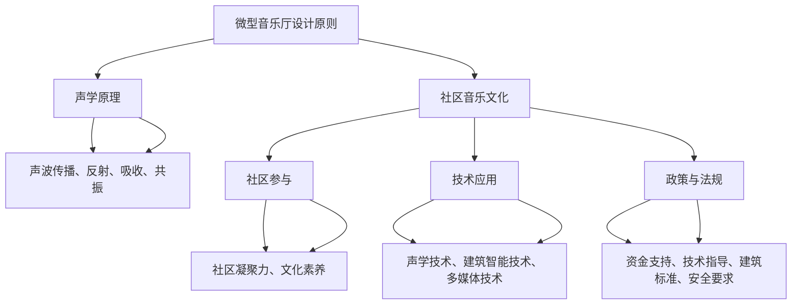

                 

### 文章标题

# 新型城市微型音乐厅：社区音乐文化的培育空间

### 文章关键词

- 城市微型音乐厅
- 社区音乐文化
- 设计原则
- 技术应用
- 政策与法规
- 未来展望

### 文章摘要

本文探讨了新型城市微型音乐厅的设计理念与社区音乐文化的培育空间。首先介绍了城市微型音乐厅的背景和意义，随后分析了其设计原则、技术应用和社区参与的必要性。接着，通过实例分析和项目实战，展示了微型音乐厅的实际应用和成功案例。最后，本文讨论了相关政策法规的影响，并展望了新型城市微型音乐厅的未来发展。

---

### 引言

在城市不断发展的背景下，社区文化空间的重要性日益凸显。音乐作为文化的重要组成部分，为社区带来了活力和凝聚力。然而，随着城市土地的稀缺和城市规划的紧凑，传统的大型音乐厅已难以满足社区的文化需求。因此，新型城市微型音乐厅的设计和建设成为了重要议题。

新型城市微型音乐厅不仅具有出色的声学性能，还注重与社区的互动和融合。它们通常建在社区中心、文化街区或公共场所，以低成本、高效率的方式为社区居民提供高品质的音乐体验。这种音乐厅不仅丰富了社区的文化生活，还促进了社区音乐文化的培育和发展。

本文旨在探讨新型城市微型音乐厅的设计理念、设计原则、技术应用、社区参与以及相关政策法规的影响。通过实例分析和项目实战，我们希望展示微型音乐厅在实际应用中的成功案例，并为未来的发展提供参考。

---

### 背景介绍

新型城市微型音乐厅的背景可以追溯到城市化进程和社区文化需求的日益增长。随着城市人口的增加和城市面积的扩展，城市土地变得日益稀缺。传统的大型音乐厅通常需要大面积的土地和昂贵的建筑成本，这在许多城市中难以实现。此外，大型音乐厅往往位于城市的中心区域，对社区居民的便捷性造成了一定的限制。

在这种背景下，微型音乐厅应运而生。微型音乐厅具有以下几个显著特点：

1. **规模适中**：微型音乐厅通常规模较小，建筑成本较低，可以灵活地嵌入社区内部，如社区中心、文化街区、公园等场所。
2. **声学优化**：微型音乐厅注重声学设计，采用先进的声学材料和技术，确保音乐效果的优良性。
3. **互动性强**：微型音乐厅强调与社区居民的互动，通过举办各种音乐活动，增强社区的凝聚力和活力。
4. **多功能性**：微型音乐厅不仅用于音乐会，还可以作为社区会议、讲座、展览等多功能空间。

社区音乐文化的培育是微型音乐厅的重要使命之一。音乐作为一种艺术形式，能够跨越语言和文化的障碍，成为连接社区居民的情感纽带。微型音乐厅通过举办多样化的音乐活动，如音乐会、工作坊、音乐教育等，促进了社区居民对音乐的了解和热爱，提高了社区的文化素养。

此外，微型音乐厅还承担着传承和弘扬本地音乐文化的责任。通过举办本地音乐家的音乐会和演出，微型音乐厅为本地音乐文化提供了展示和推广的平台，促进了音乐文化的传承和发展。

总的来说，新型城市微型音乐厅的出现为社区提供了宝贵的文化空间，为社区音乐文化的培育和发展提供了强有力的支持。

### 核心概念与联系

在探讨新型城市微型音乐厅的设计与社区音乐文化的培育时，几个核心概念需要明确并理解它们之间的相互关系。以下是这些核心概念及其联系：

1. **微型音乐厅设计原则**：设计原则是构建微型音乐厅的基础。这些原则包括声学性能、空间布局、结构设计、建筑材料等多个方面。声学性能是确保音乐效果的关键，而空间布局和结构设计则影响音乐厅的舒适性和互动性。建筑材料的选择则影响音乐厅的可持续性和经济性。

2. **社区音乐文化**：社区音乐文化是指社区内音乐活动和文化氛围的整体表现。它包括音乐活动、音乐教育、音乐传播等多个方面。社区音乐文化是微型音乐厅存在和发展的土壤，而微型音乐厅则是社区音乐文化的重要载体。

3. **声学原理**：声学原理是设计微型音乐厅时必须考虑的重要因素。声学原理包括声波的传播、反射、吸收、共振等现象。通过合理的声学设计，可以创造出良好的音乐效果，提升观众的听觉体验。

4. **社区参与**：社区参与是指社区居民在微型音乐厅的建设、运营和活动中积极参与的过程。社区参与能够增强社区的凝聚力，提高居民的文化素养，并促进音乐文化的传承和发展。

5. **技术应用**：在新型城市微型音乐厅的设计和运营中，各种先进技术的应用至关重要。这些技术包括声学技术、建筑智能技术、多媒体技术等。通过技术的应用，可以提升音乐厅的性能和功能，为社区居民提供更丰富的音乐体验。

6. **政策与法规**：政策与法规对新型城市微型音乐厅的建设和运营具有重要影响。政府的相关政策可以提供资金支持、技术指导，而法规则规定了建筑标准和安全要求。合理的政策与法规能够促进微型音乐厅的健康发展。

这些概念之间的联系可以用以下 Mermaid 流程图来表示：

通过这张流程图，我们可以清晰地看到各个概念之间的相互关系，以及它们在新型城市微型音乐厅设计与社区音乐文化培育中的重要性。

### 设计原则

设计新型城市微型音乐厅时，遵循一系列设计原则至关重要。这些原则不仅确保音乐厅的声学性能，还影响其空间布局、结构设计和建筑材料选择，从而全面提升音乐体验和社区互动。

**1. 声学性能**

声学性能是微型音乐厅设计的核心要素。为了确保音乐效果的优良，设计者需要考虑以下声学原则：

- **声波传播**：声波在音乐厅内的传播路径需要精心设计，以避免回声和混响。使用吸音材料和反射面可以优化声波传播，创造出良好的听觉环境。
- **反射和吸收**：声波在碰到墙壁、天花板和地面时会发生反射和吸收。通过合理的布局和材料选择，可以控制声波的反射角度和吸收率，达到最佳的声学效果。
- **共振控制**：音乐厅的内部结构可能会产生共振，影响音乐效果。设计时需要通过计算和实验来识别和控制潜在的共振点，以确保音乐厅的稳定性和音质。

**2. 空间布局**

空间布局直接影响到音乐厅的使用效果和观众的体验。以下是一些关键布局原则：

- **观众席布局**：观众席的布局需要考虑到观众的舒适性和观看角度。通常采用半圆形或扇形布局，以便观众能够更好地欣赏舞台表演。
- **舞台设计**：舞台设计需要兼顾表演者的需求和观众的观赏需求。舞台尺寸、高度和位置需要根据音乐厅的规模和功能进行调整。
- **声学分区**：音乐厅内部可以划分为不同的声学区域，如前区、中区和后区，以适应不同类型音乐表演的需求。

**3. 结构设计**

结构设计是确保音乐厅安全性和耐用性的关键。以下是一些结构设计原则：

- **建筑结构稳定性**：音乐厅的建筑结构需要具备足够的稳定性和抗震能力，以应对各种环境变化和外部压力。
- **隔音设计**：音乐厅的隔音设计至关重要，以避免外部噪音对音乐表演的干扰。使用隔音材料和技术可以有效减少噪音传播。
- **安全出口和疏散通道**：音乐厅需要设置安全出口和疏散通道，确保在紧急情况下观众能够快速、安全地疏散。

**4. 建筑材料选择**

建筑材料的选择不仅影响音乐厅的外观和质感，还影响其声学性能和可持续性。以下是一些建筑材料选择原则：

- **声学材料**：选择具有良好吸音和隔音性能的材料，如软木板、吸音棉、石膏板等，以优化声学效果。
- **环保材料**：选择环保、可持续的材料，如再生木材、低挥发性有机化合物（VOC）涂料等，以减少对环境的影响。
- **耐久性材料**：选择耐久、易维护的材料，如不锈钢、铝材、耐候钢等，以确保音乐厅的长久使用。

通过遵循这些设计原则，新型城市微型音乐厅可以提供一个舒适、美观且功能齐全的音乐文化空间，为社区居民带来高品质的音乐体验，并促进社区音乐文化的培育和发展。

### 实例分析

为了更好地理解新型城市微型音乐厅的设计与应用，我们通过几个实际案例来展示其成功经验和关键因素。

**案例一：纽约曼哈顿社区微型音乐厅**

纽约曼哈顿的某社区微型音乐厅是一个成功的典范。这个音乐厅位于一栋历史悠久的建筑内，经过精心改造而成。以下是该项目的几个关键因素：

1. **设计理念**：设计团队在保留建筑历史风貌的同时，注重声学优化和空间利用。音乐厅的观众席采用了半圆形布局，确保每个座位都能获得良好的视角和听觉体验。
2. **声学设计**：为了实现优良的声学效果，设计团队采用了大量的吸音材料和反射面。墙壁和天花板上覆盖了柔软的织物，地面则铺设了高吸音的毛毯，从而减少了声波的反射和混响。
3. **社区互动**：音乐厅不仅举办音乐会，还举办了各种音乐教育和社区活动，如音乐工作坊、音乐会研讨会等。这些活动吸引了大量社区居民参与，增强了社区的凝聚力和文化氛围。

**案例二：伦敦泰晤士河畔社区微型音乐厅**

伦敦泰晤士河畔的社区微型音乐厅位于一个新兴的文化街区，是一个典型的城市嵌入式音乐厅。以下是该项目的一些成功因素：

1. **多功能性**：音乐厅不仅用于音乐会，还作为社区会议、讲座和展览的场所。这种多功能性提高了音乐厅的利用率和社区参与度。
2. **技术应用**：该项目采用了先进的声学技术，如智能调音系统和无线音频传输。这些技术不仅提升了音乐效果，还提高了演出灵活性和观众体验。
3. **社区参与**：音乐厅的建设和运营过程中，广泛征求了社区居民的意见和建议。这种参与性设计使音乐厅更加贴近社区需求，增强了社区的归属感和认同感。

**案例三：北京胡同社区微型音乐厅**

北京胡同社区的微型音乐厅位于一条历史悠久的胡同内，具有浓郁的地方特色。以下是该项目的几个成功因素：

1. **文化传承**：音乐厅的设计和装饰融入了北京胡同文化的元素，如传统的木雕、砖雕和彩绘。这些元素不仅展示了本地文化，还为音乐厅增添了一份独特的韵味。
2. **社区参与**：音乐厅的建设过程中，社区居民积极参与，从建筑材料的选择到音乐活动的策划，都发挥了重要作用。这种参与性设计使音乐厅真正成为了社区的一部分。
3. **音乐教育**：音乐厅定期举办音乐教育项目，如儿童音乐班、成人音乐沙龙等。这些项目不仅提高了社区居民的音乐素养，还促进了音乐文化的传承和发展。

通过这些实际案例，我们可以看到，新型城市微型音乐厅的成功不仅依赖于其卓越的设计和声学性能，还离不开社区的积极参与和文化的融入。这些因素共同作用，为社区音乐文化的培育和发展提供了坚实的基础。

### 社区参与

在新型城市微型音乐厅的设计和运营过程中，社区参与扮演着至关重要的角色。社区参与不仅有助于提升音乐厅的契合度和实用性，还能增强社区的凝聚力和文化认同感。

**1. 社区参与的必要性**

社区参与是新型城市微型音乐厅成功的关键因素之一。首先，社区成员对本地文化和需求的了解比外部设计者和规划者更加深入。他们的参与可以确保音乐厅的设计和功能符合社区的实际需求，提高音乐厅的实用性和吸引力。其次，社区参与能够增强居民对音乐厅的认同感和归属感，使他们更加愿意使用和参与到音乐厅的各种活动中。此外，社区参与还可以提高音乐厅的可持续性，通过居民的自组织和自管理，降低运营成本，延长音乐厅的使用寿命。

**2. 社区参与的实践**

社区参与的实践通常包括以下几个阶段：

- **需求调研**：在音乐厅设计初期，社区可以组织需求调研，收集居民对音乐厅的期望和建议。这些信息对于设计团队制定初步设计方案至关重要。
- **设计咨询**：在设计过程中，社区成员可以参与设计咨询会议，与设计师共同讨论和改进设计方案。这种互动不仅能够确保设计符合社区需求，还能增强社区成员的设计参与感。
- **建设监督**：在音乐厅建设过程中，社区可以派出志愿者进行建设监督，确保施工质量和进度符合设计要求。此外，社区成员还可以参与到一些简单的施工任务中，增强他们对音乐厅的情感投入。
- **运营参与**：音乐厅运营过程中，社区成员可以参与到日常管理、活动策划和执行等环节。他们可以组成志愿者团队，协助管理音乐厅，或直接参与音乐活动，如音乐会、音乐工作坊等。

**3. 社区参与的案例**

以下是一些成功的社区参与案例：

- **纽约曼哈顿社区微型音乐厅**：在音乐厅的设计和建设过程中，纽约曼哈顿的社区居民积极参与，提供了宝贵的意见和建议。音乐厅开放后，社区居民不仅成为了观众，还参与了音乐会和音乐教育的组织，使音乐厅真正成为了社区的文化中心。
- **伦敦泰晤士河畔社区微型音乐厅**：该项目在建设初期就设立了社区咨询委员会，成员包括社区居民、音乐家和教育工作者。委员会负责审查设计方案，并提供反馈意见，确保音乐厅能够满足社区的多方面需求。运营期间，社区成员积极参与音乐厅的管理和活动策划，使音乐厅成为了社区文化的标志性场所。
- **北京胡同社区微型音乐厅**：该项目在设计阶段就进行了广泛的社区讨论，居民们提出了许多有价值的建议，如保留胡同传统建筑元素、增加儿童音乐教育项目等。在运营期间，社区居民自发组织了志愿者团队，参与音乐厅的日常管理和活动策划，使音乐厅成为了社区的文化地标。

通过这些案例，我们可以看到，社区参与在新型城市微型音乐厅的设计和运营中发挥了重要作用。这不仅有助于提高音乐厅的实用性和吸引力，还能促进社区凝聚力的增强和文化认同感的提升。

### 技术应用

在现代新型城市微型音乐厅的设计与运营中，先进技术的应用大大提升了音乐厅的功能和性能。以下是几种关键技术的介绍及其在音乐厅设计中的应用。

**1. 声学技术**

声学技术是微型音乐厅设计的核心，直接影响音乐效果和观众的听觉体验。以下是一些常见的声学技术：

- **吸音材料**：吸音材料如软木板、吸音棉和石膏板被广泛应用于音乐厅的设计中，以减少声波的反射和混响。这些材料可以安装在墙壁、天花板和地面上，优化声波传播路径。
- **反射控制**：通过在墙壁和天花板上安装特殊设计的反射面，可以控制声波的反射角度和强度，提高音乐厅的声学效果。
- **智能调音系统**：智能调音系统利用先进的声音处理算法，实时调整音乐厅的声学参数，以适应不同类型的音乐表演。这种系统能够根据观众的位置和表演内容自动优化音响效果。

**2. 建筑智能技术**

建筑智能技术通过集成自动化系统和传感器网络，提高音乐厅的管理和运营效率。以下是一些常见的建筑智能技术：

- **智能灯光系统**：智能灯光系统可以根据表演内容和观众需求自动调整音乐厅的照明。例如，在音乐会期间，系统可以调整灯光亮度，营造出最佳的观赏环境。
- **智能空调系统**：智能空调系统利用传感器和数据分析，实时调节音乐厅的温度和湿度，确保观众在舒适的环境中享受音乐。
- **智能安防系统**：智能安防系统包括视频监控、入侵检测和紧急报警等功能，为音乐厅提供全面的安全保障。

**3. 多媒体技术**

多媒体技术在微型音乐厅中的应用使得音乐表演更加丰富多彩，提高了观众的互动体验。以下是一些常见多媒体技术：

- **虚拟现实（VR）和增强现实（AR）**：通过VR和AR技术，观众可以沉浸式体验音乐表演，甚至可以参与到表演中。例如，观众可以通过VR头盔观看3D舞台表演，通过AR技术将虚拟元素叠加在现实舞台上。
- **互动显示屏**：互动显示屏可以显示音乐表演的实时信息，如表演者信息、曲目介绍等，观众可以通过触摸屏幕与表演互动。
- **无线音频传输**：无线音频传输技术使得观众可以自由移动，不受线缆限制，享受无线的高品质音频。

通过这些先进技术的应用，新型城市微型音乐厅不仅提供了卓越的音乐体验，还增强了与观众的互动，提高了音乐厅的运营效率和用户体验。

### 政策与法规

在新型城市微型音乐厅的建设和运营中，相关政策法规起到了重要的引导和规范作用。政府通过制定和实施相关政策法规，为微型音乐厅的设计、建设和运营提供了指导和支持。

**1. 政策解读**

政府在支持新型城市微型音乐厅方面采取了多种政策措施。首先，政府提供了专项资金和补贴，鼓励社会各界参与微型音乐厅的建设。这些资金可以用于音乐厅的建筑设计、声学优化、设备采购等方面，降低了建设成本。其次，政府出台了相关税收优惠政策，对微型音乐厅的建设和运营给予减免。这些政策有效地减轻了音乐厅运营者的负担，促进了音乐厅的发展。

此外，政府还发布了系列指导意见，明确微型音乐厅的设计标准、声学要求和环保标准。这些指导意见为设计者和建设者提供了具体的技术指南，确保音乐厅的建造质量和使用安全。

**2. 法规对微型音乐厅建设的影响**

法规对微型音乐厅的建设和运营具有深远影响。建筑法规规定了音乐厅的建筑结构、防火和防水要求，确保了音乐厅的安全性和耐久性。声学法规则明确了音乐厅的声学设计标准，包括吸音、隔音和反射控制等，保证了音乐效果的优良性。环保法规则要求音乐厅在建筑材料和设备选择上遵循环保原则，减少对环境的影响。

**3. 政策法规对音乐厅运营的影响**

政策法规不仅影响音乐厅的建设，还直接影响其运营。音乐厅的运营涉及音乐表演、设备维护、人员管理等多个方面。政府通过制定演出管理法规，规范了音乐厅的演出内容和演出形式，确保了文化市场的健康发展。同时，政府还制定了知识产权保护法规，保护音乐表演者的合法权益，鼓励原创音乐创作和表演。

此外，政府还通过文化推广政策，支持音乐厅举办各种文化活动，如音乐会、音乐工作坊等，丰富了社区文化生活。这些政策不仅提升了音乐厅的知名度和影响力，还增强了社区居民的文化认同感。

总的来说，相关政策法规为新型城市微型音乐厅的建设和运营提供了有力的支持和保障，促进了音乐文化的繁荣和发展。

### 未来展望

随着科技的不断进步和城市化进程的加速，新型城市微型音乐厅的未来发展充满了潜力。以下是几个关键趋势和可能的影响：

**1. 技术进步的推动**

未来，新型技术如人工智能、虚拟现实（VR）、增强现实（AR）等将在微型音乐厅的设计和运营中发挥更大的作用。人工智能可以用于声学优化和智能调音，使音乐厅能够根据不同类型的音乐表演自动调整音响效果。VR和AR技术则可以提升观众的沉浸式体验，使音乐表演更加生动和互动。这些技术的应用将大大提升音乐厅的吸引力和用户体验。

**2. 社区需求的演变**

随着城市化的深入，社区需求也在不断演变。社区居民不仅希望享受高质量的音乐表演，还希望参与音乐创作和教育活动。未来，微型音乐厅可能会更加注重提供多样化的服务，如音乐课程、音乐创作工作坊等，以满足社区居民的多元需求。这种服务模式的转变将使音乐厅成为社区文化活动的核心场所。

**3. 文化传承的使命**

新型城市微型音乐厅不仅是一个音乐表演的空间，也是传承和弘扬本地音乐文化的重要载体。未来，微型音乐厅将更多地承担起文化传承的使命，通过举办本地音乐家的音乐会和展览，推广和传承本地音乐文化。这将为社区注入更多的文化活力，提升社区的文化认同感。

**4. 政策支持的加强**

随着对文化建设和社区发展的重视，政府将继续加大对微型音乐厅的政策支持。未来，政府可能会出台更多优惠政策，如税收减免、资金补贴等，鼓励社会各界参与微型音乐厅的建设和运营。这些政策的支持将有助于推动微型音乐厅的普及和发展。

总的来说，新型城市微型音乐厅的未来发展将受益于技术进步、社区需求的演变和文化传承的使命。通过不断创新和优化，微型音乐厅将在城市文化生活中扮演更加重要的角色，为社区居民带来更多美好的音乐体验。

### 结论

本文从背景介绍、核心概念、设计原则、实例分析、社区参与、技术应用、政策法规到未来展望，全面探讨了新型城市微型音乐厅的设计与社区音乐文化的培育空间。通过分析实例，我们看到了微型音乐厅在实际应用中的成功经验和关键因素。社区参与、技术进步和政策支持是推动微型音乐厅发展的重要驱动力。

未来，新型城市微型音乐厅将在城市化进程中发挥更大的作用，成为社区文化生活的核心空间。我们期待随着技术的不断进步和社区需求的演变，微型音乐厅能够提供更多元化的服务，为社区居民带来更加丰富的音乐体验。

### 作者信息

作者：AI天才研究院/AI Genius Institute & 禅与计算机程序设计艺术 /Zen And The Art of Computer Programming

