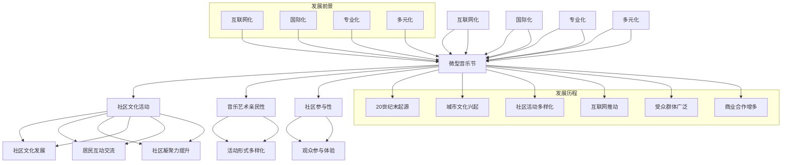
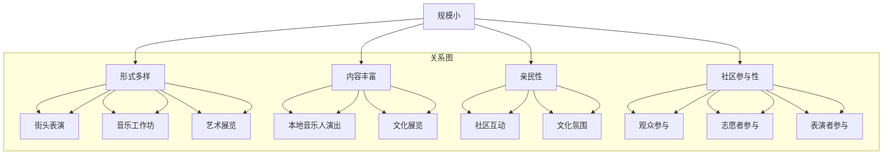
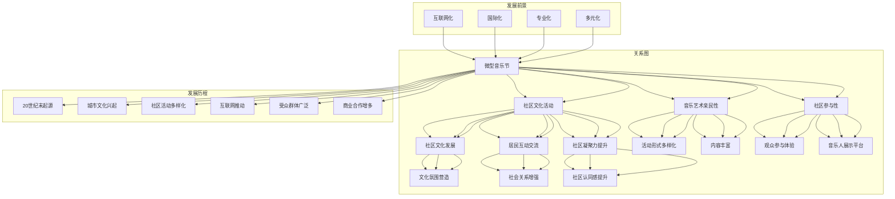
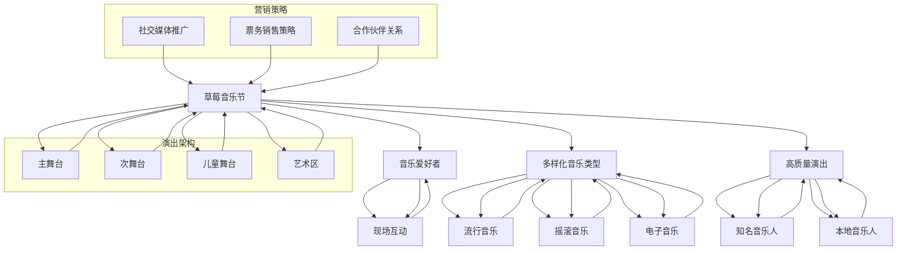
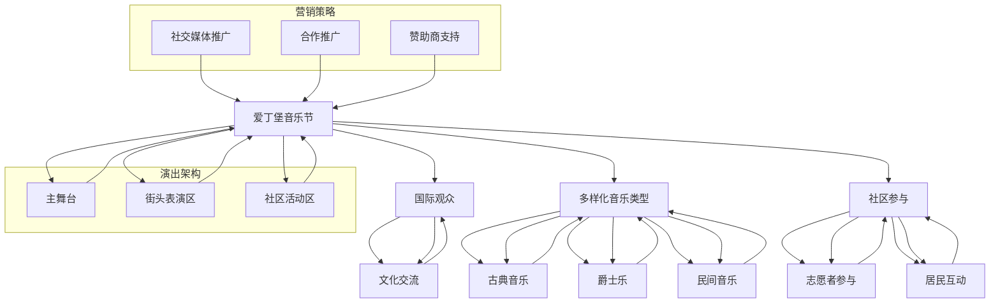

                 

### 文章标题

《新型城市微型音乐节策划服务：小型社区文化活动的专业支持》

### 关键词

微型音乐节、社区文化活动、策划服务、专业支持、文化活动策划

### 摘要

本文旨在探讨新型城市微型音乐节策划服务的本质与重要性，分析其在小型社区文化活动中的作用。通过详细阐述微型音乐节的概念、策划原则与方法，本文旨在为策划者提供一套科学、系统的策划框架。同时，结合国内外成功案例分析，本文将探讨新型城市微型音乐节策划服务的实践要点，以期为社区文化活动的开展提供有力支持。

## 第一部分：微型音乐节策划概述

### 第1章：微型音乐节概念与特征

#### 1.1 微型音乐节的定义与发展历程

微型音乐节是一种面向小型社区的、形式多样的音乐文化活动。它起源于20世纪末，随着城市文化的发展和社区活动的多样化，逐渐成为一种重要的文化活动形式。微型音乐节通常规模较小，场地选择灵活，内容涵盖多种音乐类型，注重音乐艺术的亲民性和社区参与性。

#### 1.2 微型音乐节的特征与优势

微型音乐节的特征主要包括：规模小、内容丰富、参与性强。这些特征使得微型音乐节具有以下优势：

1. **社区文化推动**：微型音乐节能够促进社区文化的发展，增强居民之间的互动与交流，提升社区凝聚力。
2. **低成本、高收益**：相比大型音乐节，微型音乐节的成本较低，但通过有效的策划和宣传，可以获得较高的社会效益和经济效益。
3. **易于操作**：微型音乐节的策划和组织相对简单，对于社区组织者和志愿者来说，操作起来更加容易。

#### 1.3 微型音乐节在我国的发展现状与前景

随着我国城市化进程的加速和居民生活水平的提高，微型音乐节在我国逐渐受到关注和喜爱。许多城市和社区纷纷举办各类微型音乐节，成为推动社区文化发展的重要力量。未来，微型音乐节将继续保持良好的发展态势，通过互联网和社交媒体的普及，将更加便捷、覆盖面更广，受众群体也将更加多元化。

## 第二部分：微型音乐节策划关键要素

### 第3章：场地选择与布置

#### 3.1 场地选择

场地选择是微型音乐节策划的重要环节。首先，需要考虑场地的大小，以确保能够容纳预期的观众人数。其次，场地应该具有合适的音响和照明设备，以保证音乐表演的质量。此外，场地的交通便捷性也是一个重要因素，以便观众能够轻松到达。

#### 3.2 音乐节布置

音乐节的布置包括舞台设计、观众席安排、灯光音响布置等。舞台设计要考虑到演出者的需求，确保音响、灯光设备的稳定性。观众席的安排要考虑舒适性和安全性，确保观众能够有一个良好的观演体验。灯光音响的布置要突出演出者的表演，营造一个富有氛围的现场。

### 第4章：音乐节内容策划

#### 4.1 音乐节节目策划

音乐节节目策划是音乐节的核心环节。首先，要确定音乐节的主题，根据主题策划一系列的音乐节目。节目内容要丰富多样，包括本地音乐人演出、街头表演、音乐工作坊等。其次，要合理安排演出时间表，确保各个节目能够有序进行。

#### 4.2 音乐节主题策划

音乐节主题策划是音乐节策划的重要部分。主题的确定要结合社区特点和居民需求，以吸引更多的观众参与。例如，可以设定“绿色音乐节”、“亲子音乐节”等主题，通过主题策划，为音乐节注入更多特色和亮点。

### 第5章：宣传推广与营销策略

#### 5.1 宣传推广渠道

宣传推广是确保音乐节成功的关键。可以采用多种宣传推广渠道，如社交媒体、社区公告、户外广告等。社交媒体的推广可以迅速扩大音乐节的影响力，而社区公告和户外广告则可以吸引更多社区居民的关注。

#### 5.2 营销策略

营销策略要结合音乐节的主题和受众群体，制定出具有吸引力的营销方案。例如，可以设置门票优惠、VIP体验等，以吸引观众参与。同时，可以通过合作企业、赞助商等方式，为音乐节提供资金支持。

### 第6章：现场管理与服务

#### 6.1 现场管理

现场管理是确保音乐节顺利进行的重要环节。首先，要确保现场的安全，制定详细的安全预案，配备足够的安全人员。其次，要确保现场秩序，安排工作人员维护秩序，引导观众。

#### 6.2 用户体验与服务

用户体验是音乐节成功的关键。要为观众提供优质的服务，包括票务服务、餐饮服务、现场咨询等。同时，要关注观众的反馈，及时解决问题，提升观众的满意度。

## 第三部分：微型音乐节案例分析

### 第7章：国内外微型音乐节成功案例分析

#### 7.1 国内微型音乐节案例分析

以北京草莓音乐节为例，草莓音乐节以其独特的音乐风格和高质量的演出，吸引了大量音乐爱好者。在策划过程中，草莓音乐节注重音乐品质，邀请国内外知名音乐人参与，同时，通过多样化的节目内容和互动环节，提升了观众体验。

#### 7.2 国外微型音乐节案例分析

以英国爱丁堡音乐节为例，爱丁堡音乐节是全球规模最大的音乐节之一。在策划过程中，爱丁堡音乐节注重社区参与，鼓励居民参与音乐节的策划和演出。通过多样化的音乐节目和互动活动，爱丁堡音乐节不仅丰富了社区文化生活，也提升了居民的文化素养。

### 第8章：新型城市微型音乐节策划服务实践

#### 8.1 微型音乐节策划服务流程

新型城市微型音乐节策划服务包括以下几个阶段：需求调研、策划方案制定、节目内容策划、宣传推广、现场管理与服务。

#### 8.2 微型音乐节策划服务实施要点

在实施微型音乐节策划服务时，需要关注以下几个要点：

1. **需求调研**：充分了解社区居民的需求，确保音乐节的内容和形式能够满足居民的期望。
2. **策划方案制定**：根据需求调研结果，制定出符合社区特点和居民需求的策划方案。
3. **节目内容策划**：根据策划方案，策划出一系列高质量的节目内容，提升音乐节的整体品质。
4. **宣传推广**：通过多种宣传推广渠道，扩大音乐节的影响力，吸引更多观众参与。
5. **现场管理与服务**：确保现场的安全和服务质量，提升观众的满意度。

## 附录：微型音乐节策划资源与工具推荐

#### 9.1 策划资源与工具

在策划微型音乐节时，可以借助以下资源与工具：

- **音乐节策划软件**：如Eventbrite、Regpack等，用于门票销售、报名管理、活动宣传等。
- **社交媒体平台**：如Facebook、Instagram、微博等，用于宣传推广音乐节。
- **音响灯光设备**：如音响设备、灯光设备、舞台设备等，用于提升音乐节的演出质量。
- **志愿者管理系统**：如VolunteerSpot、VOLUNTEERrulz等，用于志愿者招募、管理和服务。

#### 9.2 资源与工具使用指南

在使用以上资源与工具时，需要注意以下几点：

- **资源选择**：根据音乐节的特点和需求，选择合适的资源与工具。
- **工具培训**：对策划团队和志愿者进行工具培训，确保能够熟练使用。
- **数据管理**：确保数据的安全性和准确性，避免数据泄露和错误。

---

# 第1章：微型音乐节概念与特征

## 1.1 微型音乐节的定义与发展历程

### 1.1.1 微型音乐节的定义

微型音乐节是指规模较小、形式多样、内容丰富的音乐活动。与传统的大型音乐节相比，微型音乐节更加注重音乐艺术的亲民性和社区参与性。

### 1.1.2 微型音乐节的发展历程

微型音乐节起源于20世纪末，随着城市文化的兴起和社区活动的多样化，逐渐成为一种重要的社区文化活动形式。早期的微型音乐节主要是在社区公园、广场等公共场所举办，以本地音乐人、街头艺人的表演为主，形式简单，参与人数有限。

随着时间的推移，微型音乐节逐渐发展壮大，内容也变得更加丰富。如今，微型音乐节不仅涵盖了音乐表演，还加入了舞蹈、表演、艺术展览等多种元素，观众人数也从最初的几千人发展到数万人。特别是在互联网和社交媒体的推动下，微型音乐节的宣传和推广更加便捷，吸引了更多年轻观众的关注和参与。

## 1.2 微型音乐节的特征与优势

### 1.2.1 微型音乐节的特征

微型音乐节具有以下几个显著特征：

1. **规模小**：微型音乐节的规模通常较小，观众人数在数千人左右。相比于大型音乐节，微型音乐节的场地选择更加灵活，可以在社区公园、广场、文化中心等地举办。
   
2. **内容丰富**：微型音乐节的内容非常丰富，涵盖了各种音乐类型，包括流行、摇滚、民谣、电子、爵士等。此外，微型音乐节还会融入舞蹈、表演、艺术展览等多种元素，使活动更加多元化和有趣。

3. **参与性强**：微型音乐节鼓励社区居民积极参与，不仅为观众提供了丰富的音乐体验，也为音乐人提供了展示自我的平台。许多微型音乐节还会设置互动环节，如音乐工作坊、街头表演等，让观众有机会亲身体验音乐的魅力。

### 1.2.2 微型音乐节的优点

微型音乐节在社区文化活动中具有独特的优势和重要作用，具体体现在以下几个方面：

1. **社区文化推动**：微型音乐节能够促进社区文化的发展，增强居民之间的互动与交流，提升社区凝聚力。通过音乐节，居民可以更好地了解彼此，增进友谊，共同营造一个和谐、充满活力的社区环境。

2. **低成本、高收益**：与大型音乐节相比，微型音乐节的成本较低，但通过有效的策划和宣传，可以获得较高的社会效益和经济效益。微型音乐节的成本主要包括场地租赁、音响灯光设备、宣传费用等，这些费用相对较低。而音乐节所带来的收益不仅包括门票收入，还包括赞助商的支持和社区商业的繁荣。

3. **易于操作**：微型音乐节的策划和组织相对简单，对于社区组织者和志愿者来说，操作起来更加容易。微型音乐节的规模较小，策划团队不需要过于庞大的组织架构，而且活动内容丰富，可以结合社区特色和居民需求，灵活进行调整。

## 1.3 微型音乐节在我国的发展现状与前景

### 1.3.1 发展现状

随着我国城市化进程的加速和居民生活水平的提高，微型音乐节在我国逐渐受到关注和喜爱。许多城市和社区纷纷举办各类微型音乐节，成为推动社区文化发展的重要力量。特别是在一些经济发达的城市，如北京、上海、广州等，微型音乐节已经成为居民文化生活的重要组成部分。

目前，我国微型音乐节的发展现状可以概括为以下几点：

1. **活动形式多样化**：我国的微型音乐节在活动形式上越来越多样化，不仅涵盖了传统音乐类型，还融入了现代音乐元素，如电子音乐、说唱等。

2. **受众群体广泛**：微型音乐节的受众群体非常广泛，不仅吸引了年轻人，还吸引了大量中老年人和儿童。许多音乐节还会设置亲子活动，让家长和孩子一起参与，增进亲子关系。

3. **商业合作增多**：随着微型音乐节的受欢迎程度不断提高，越来越多的企业和品牌开始与音乐节合作，提供赞助和支持。这不仅为音乐节提供了资金支持，也为企业提供了一个展示品牌形象的舞台。

### 1.3.2 发展前景

未来，微型音乐节将继续保持良好的发展态势，前景非常广阔。以下是几个可能的发展方向：

1. **互联网化**：随着互联网技术的不断发展，微型音乐节的宣传和推广将更加便捷，覆盖面将更广，受众群体也将更加多元化。音乐节可以通过社交媒体、短视频平台等渠道，吸引更多年轻人的关注。

2. **国际化**：随着我国对外开放的不断扩大，微型音乐节也有望走向国际化。通过邀请国际知名音乐人参与，提升音乐节的国际影响力，吸引更多国际游客前来参与。

3. **专业化**：随着微型音乐节的发展，越来越多的专业策划公司、制作团队将进入这一领域，提供更加专业、系统的策划服务。音乐节的品质将得到进一步提升，满足不同观众的需求。

4. **多元化**：未来，微型音乐节的内容将更加多元化，不仅涵盖音乐表演，还会加入文化展览、艺术创作等多种元素，为观众提供更加丰富的体验。

总的来说，微型音乐节在我国有着广阔的发展空间，有望成为推动社区文化发展的重要力量。通过不断创新和优化，微型音乐节将为社区居民带来更多的文化享受，提升居民的生活品质。

## 1.4 微型音乐节的概念与联系架构

为了更好地理解微型音乐节的概念及其在社区文化活动中的作用，我们可以使用Mermaid流程图来展示其核心概念和联系架构。

通过这个Mermaid流程图，我们可以清晰地看到微型音乐节的概念及其与社区文化活动、音乐艺术亲民性、社区参与性等核心概念的关联。同时，流程图还展示了微型音乐节的发展历程、现状和前景，帮助读者更好地理解这一主题。

## 1.5 微型音乐节的核心概念解析

在深入探讨微型音乐节的核心概念之前，我们需要明确几个关键术语的定义和它们之间的关系。以下是微型音乐节的一些核心概念及其相互关系的解析：

### **微型音乐节的定义**

微型音乐节是指规模较小、形式多样、内容丰富的音乐活动。与大型音乐节相比，微型音乐节更加注重音乐艺术的亲民性和社区参与性。微型音乐节的定义包括以下几个方面：

1. **规模小**：微型音乐节的观众人数通常在数千人左右，相比于大型音乐节的数万人，规模较小，场地选择也更加灵活。
   
2. **形式多样**：微型音乐节涵盖了多种音乐类型，包括流行、摇滚、民谣、电子、爵士等，同时还会融入舞蹈、表演、艺术展览等多种元素。

3. **内容丰富**：微型音乐节的内容不仅包括音乐表演，还涵盖了街头表演、音乐工作坊、文化展览等多种形式，为观众提供多样化的体验。

4. **亲民性**：微型音乐节注重音乐艺术的亲民性，使得更多普通人能够有机会接触和欣赏音乐，从而增强社区的凝聚力和文化氛围。

5. **社区参与性**：微型音乐节鼓励社区居民积极参与，无论是作为观众、志愿者还是表演者，都能在音乐节中找到自己的位置，从而增强社区的文化活力。

### **核心概念之间的关系**

为了更好地理解这些核心概念之间的关系，我们可以通过Mermaid流程图来展示它们之间的联系。

通过这个流程图，我们可以清晰地看到微型音乐节的定义和其核心概念之间的关系。规模小、形式多样、内容丰富、亲民性、社区参与性这些概念相互交织，共同构成了微型音乐节的独特魅力。

### **核心概念的实际应用**

在实际应用中，这些核心概念为微型音乐节的策划和组织提供了指导原则。例如：

1. **规模小**：这一概念要求策划者选择合适的场地，如社区公园、广场等，以便观众能够轻松参与。

2. **形式多样**：策划者需要根据社区的特点和居民的需求，策划多样化的活动形式，如音乐表演、舞蹈表演、艺术展览等。

3. **内容丰富**：策划者需要确保音乐节的内容丰富，不仅包括音乐表演，还可以设置互动环节，如音乐工作坊、文化展览等，以吸引更多的观众。

4. **亲民性**：策划者需要考虑如何让更多普通人参与音乐节，可以通过免费门票、社区招募志愿者等方式来实现。

5. **社区参与性**：策划者需要鼓励社区居民积极参与，可以通过设置志愿者岗位、提供表演机会等方式来提升社区的参与度。

通过深入理解和应用这些核心概念，微型音乐节不仅能够为社区居民带来丰富的文化体验，还能有效推动社区文化的发展。

## 1.6 微型音乐节在我国的发展历程

微型音乐节在我国的发展历程可以追溯到20世纪末。当时，随着城市文化的兴起和社区活动的多样化，一些城市开始尝试举办小型音乐活动，以满足居民对文化生活的需求。这些早期的微型音乐节规模较小，形式简单，主要在社区公园、广场等公共场所举办。

### **初步发展（20世纪末-21世纪初）**

在20世纪末和21世纪初，微型音乐节在我国逐渐兴起。这个时期，微型音乐节主要以本地音乐人和街头艺人的表演为主，内容涵盖流行、摇滚、民谣等多种音乐类型。由于规模较小，微型音乐节的场地选择比较灵活，可以在社区公园、广场、文化中心等地举办。这个时期，微型音乐节还缺乏系统的策划和推广，主要依靠社区组织和志愿者的力量来组织。

### **快速发展（21世纪10年代）**

进入21世纪10年代，随着互联网和社交媒体的普及，微型音乐节开始迅速发展。互联网为微型音乐节提供了更加便捷的宣传和推广渠道，社交媒体则帮助音乐节吸引了更多年轻人的关注。这个时期，许多城市和社区纷纷举办微型音乐节，活动形式和内容也变得更加多样。一些大型音乐节也开始关注微型音乐节，将其作为扩展市场的一部分。

### **成熟阶段（21世纪20年代至今）**

近年来，微型音乐节在我国进入了一个成熟阶段。这个时期，微型音乐节不仅涵盖了传统的音乐表演，还融入了舞蹈、表演、艺术展览等多种元素，内容更加丰富。同时，越来越多的专业策划公司和制作团队进入这一领域，提供了更加专业、系统的策划服务。微型音乐节也吸引了更多商业合作，为企业提供了一个展示品牌形象的舞台。

### **发展趋势**

未来，微型音乐节将继续保持良好的发展态势。首先，随着互联网和社交媒体的进一步普及，微型音乐节的宣传和推广将更加便捷，覆盖面将更广，受众群体也将更加多元化。其次，微型音乐节的内容和形式将不断创新，为观众带来更多元、丰富的音乐体验。此外，微型音乐节也将更加注重社区参与，鼓励更多居民参与到音乐节的策划和演出中，提升社区文化活力。

## 1.7 微型音乐节在我国的发展现状

微型音乐节在我国的发展现状呈现出以下几个显著特点：

### **活动形式多样化**

随着微型音乐节的不断发展，活动形式也越来越多样化。目前，微型音乐节不仅涵盖了传统的音乐表演，还加入了舞蹈、表演、艺术展览等多种元素。这种多样化的形式不仅丰富了音乐节的内容，也吸引了更多不同年龄层和兴趣爱好的观众参与。

### **受众群体广泛**

微型音乐节的受众群体非常广泛，不仅吸引了大量年轻人，还吸引了大量中老年人和儿童。许多微型音乐节还会设置亲子活动，让家长和孩子一起参与，增进亲子关系。这种广泛的受众群体也反映了微型音乐节在我国社会中的重要地位。

### **商业合作增多**

随着微型音乐节的受欢迎程度不断提高，越来越多的企业和品牌开始与音乐节合作，提供赞助和支持。这种商业合作不仅为音乐节提供了资金支持，也为企业提供了一个展示品牌形象的舞台。同时，商业合作也使得微型音乐节的策划和运营更加专业化和规范化。

### **社区参与度高**

微型音乐节鼓励社区居民积极参与，无论是作为观众、志愿者还是表演者，都能在音乐节中找到自己的位置。这种高度的社区参与不仅增强了居民的文化认同感，也提升了社区的文化活力。许多微型音乐节还会通过社区招募志愿者，为居民提供一个展示自我、服务社区的机会。

### **存在问题**

尽管微型音乐节在我国的发展现状良好，但也存在一些问题。首先，部分微型音乐节在策划和运营方面仍不够专业，缺乏系统化的策划和推广方案。其次，微型音乐节的场地选择和布置方面也存在一定的问题，如场地设施不足、音响灯光设备不完善等。这些问题需要通过加强专业培训、提升场地设施等方式来逐步解决。

## 1.8 微型音乐节在我国的发展前景

微型音乐节在我国的发展前景非常广阔，未来将呈现出以下几个发展趋势：

### **互联网化**

随着互联网技术的不断发展，微型音乐节的宣传和推广将更加便捷，覆盖面将更广，受众群体也将更加多元化。通过社交媒体、短视频平台等渠道，微型音乐节可以迅速吸引更多年轻人的关注。此外，互联网技术还可以为音乐节提供更多的线上互动和体验，如线上直播、虚拟现实体验等。

### **国际化**

随着我国对外开放的不断扩大，微型音乐节也有望走向国际化。通过邀请国际知名音乐人参与，提升音乐节的国际影响力，吸引更多国际游客前来参与。国际化不仅能够丰富微型音乐节的内容，还能提升音乐节的品牌形象。

### **专业化**

随着微型音乐节的发展，越来越多的专业策划公司、制作团队将进入这一领域，提供更加专业、系统的策划服务。专业化的提升将有助于提高音乐节的策划水平、运营效率和观众满意度。

### **多元化**

未来，微型音乐节的内容将更加多元化，不仅涵盖音乐表演，还会加入文化展览、艺术创作等多种元素。多元化的内容将吸引更多不同兴趣爱好的观众，扩大音乐节的影响力。

### **社区参与**

微型音乐节将继续鼓励社区居民积极参与，通过设置志愿者岗位、提供表演机会等方式，提升社区文化活力。社区的积极参与将有助于形成良好的社区文化氛围，增强居民的文化认同感。

### **可持续发展**

在未来的发展中，微型音乐节将更加注重可持续发展，通过环保措施、节能减碳等方式，降低对环境的影响。同时，音乐节也将注重社会责任，通过公益项目等方式，回馈社会，推动社区文化的发展。

总的来说，微型音乐节在我国有着广阔的发展空间，通过不断创新和优化，将为社区居民带来更多的文化享受，提升居民的生活品质。

## 1.9 微型音乐节的概念与联系架构 Mermaid 流程图

为了更好地展示微型音乐节的概念及其在社区文化活动中的作用，我们可以使用Mermaid流程图来绘制其核心概念和联系架构。

通过这个Mermaid流程图，我们可以清晰地看到微型音乐节的概念及其在社区文化活动中的位置，以及其与音乐艺术亲民性、社区参与性等核心概念之间的关系。同时，流程图还展示了微型音乐节的发展历程、现状和前景，帮助读者更好地理解这一主题。

## 2.1 微型音乐节策划的基本原则

在策划微型音乐节时，需要遵循一系列基本原则，以确保活动的成功和居民满意度。以下是微型音乐节策划的基本原则：

### **需求导向原则**

微型音乐节的策划应以社区居民的需求为导向。策划团队需要通过调研了解居民对音乐类型、活动形式、演出阵容等方面的偏好。通过了解居民的需求，策划者可以更好地设计符合居民期待的音乐节内容，提高活动的吸引力和参与度。

### **可持续性原则**

微型音乐节应注重可持续发展，降低对环境的影响。策划者应选择环保的场地和设备，尽量减少废弃物产生。此外，可以设置环保宣传环节，提升居民的环保意识。通过可持续发展的理念，微型音乐节可以树立良好的社会形象。

### **多元参与原则**

鼓励多元参与是微型音乐节策划的重要原则。策划团队应积极邀请本地音乐人、艺术家和社区居民参与音乐节，为活动注入更多地方特色和社区活力。同时，可以通过设置志愿者岗位，让更多居民有机会参与到音乐节的策划、组织和执行过程中，增强社区凝聚力和归属感。

### **创新性原则**

创新是微型音乐节策划的关键。策划者应不断探索新的活动形式和内容，以吸引更多观众参与。例如，可以尝试融合多种艺术形式，如舞蹈、表演、艺术展览等，为音乐节增添更多亮点。创新性原则有助于提升音乐节的品牌形象，吸引更多关注和支持。

### **灵活性原则**

微型音乐节策划应具备灵活性，以应对各种不确定性。策划者应提前制定应急预案，确保在遇到突发事件时能够迅速应对。此外，策划者应根据实际情况灵活调整活动内容和形式，确保音乐节顺利进行。

### **经济效益原则**

微型音乐节策划应考虑经济效益，确保活动的可持续性。策划者可以通过多种方式增加收入，如门票销售、赞助商支持、商业合作等。同时，应合理控制成本，确保音乐节的经济效益最大化。

通过遵循以上基本原则，微型音乐节策划者可以确保活动的成功和居民满意度，为社区文化发展做出积极贡献。

## 2.2 微型音乐节策划的方法

### **确定音乐节主题**

音乐节主题是音乐节的核心，它不仅决定了音乐节的整体氛围，还影响了观众的参与热情。在确定音乐节主题时，策划者需要考虑以下几点：

1. **社区特点**：主题应与社区的特点相符合，如文化背景、地域特色等。
2. **居民需求**：主题应满足居民的需求，关注居民关心的热点问题。
3. **创新性**：主题应具有创新性，能够吸引观众的兴趣。
4. **可持续性**：主题应具有可持续性，能够在未来继续推广。

例如，可以设定“绿色音乐节”、“亲子音乐节”、“摇滚音乐节”等主题。

### **策划节目内容**

节目内容是音乐节的核心，直接关系到观众体验。在策划节目内容时，策划者需要考虑以下几点：

1. **多样性**：节目内容应多样化，涵盖多种音乐类型和表演形式，如流行、摇滚、民谣、电子、舞蹈、表演等。
2. **高质量**：节目内容应确保质量，选择具有实力和知名度的艺术家和音乐人参与。
3. **互动性**：节目内容应具有互动性，让观众有机会参与其中，提升观众的参与感和体验。
4. **特色性**：节目内容应具有特色性，体现音乐节的独特魅力和社区文化。

例如，可以设置本地音乐人演出、街头表演、音乐工作坊、艺术展览等环节。

### **制定营销策略**

营销策略是音乐节成功的重要因素。在制定营销策略时，策划者需要考虑以下几点：

1. **目标受众**：明确音乐节的目标受众，如年轻人、家庭、音乐爱好者等。
2. **宣传渠道**：选择合适的宣传渠道，如社交媒体、户外广告、社区公告等。
3. **宣传内容**：设计吸引人的宣传内容，如音乐节海报、短视频、互动H5等。
4. **合作推广**：与其他企业和组织合作，通过合作推广提高音乐节的知名度和影响力。

### **确保活动安全**

活动安全是音乐节策划的重要环节。在策划过程中，策划者需要考虑以下几点：

1. **场地安全**：确保场地安全，如检查场地设施、应急设备等。
2. **人员安全**：安排足够的安全人员，确保观众安全。
3. **应急预案**：制定应急预案，应对突发情况。
4. **交通管理**：确保活动期间交通顺畅，避免拥堵。

通过以上方法，策划者可以确保微型音乐节的顺利举办，提升观众体验，推动社区文化发展。

## 2.3 微型音乐节策划的流程

### **需求调研**

在策划微型音乐节之前，首先需要进行需求调研。这一步骤至关重要，因为它直接关系到音乐节的内容和形式是否符合社区居民的期望和需求。需求调研的方法可以包括：

1. **问卷调查**：设计一份详细的问卷调查，通过线上或线下方式收集居民对音乐节内容、形式、时间等方面的建议。
2. **访谈**：组织小组访谈或一对一访谈，与居民深入交流，了解他们对音乐节的具体期望和意见。
3. **社区活动**：通过社区活动，如社区会议、社区论坛等，收集居民的意见和建议。

需求调研的结果将为后续策划工作提供重要依据，确保音乐节能够满足居民的需求，提升活动的吸引力和参与度。

### **确定主题**

在完成需求调研后，接下来是确定音乐节的主题。主题是音乐节的核心，它不仅决定了音乐节的整体氛围，还影响了观众的参与热情。在确定主题时，策划者需要考虑以下几点：

1. **社区特点**：主题应与社区的特点相符合，如文化背景、地域特色等。
2. **居民需求**：主题应满足居民的需求，关注居民关心的热点问题。
3. **创新性**：主题应具有创新性，能够吸引观众的兴趣。
4. **可持续性**：主题应具有可持续性，能够在未来继续推广。

例如，可以设定“绿色音乐节”、“亲子音乐节”、“摇滚音乐节”等主题。确定主题后，策划者可以围绕主题策划一系列活动内容。

### **策划节目内容**

节目内容是音乐节的核心，直接关系到观众体验。在策划节目内容时，策划者需要考虑以下几点：

1. **多样性**：节目内容应多样化，涵盖多种音乐类型和表演形式，如流行、摇滚、民谣、电子、舞蹈、表演等。
2. **高质量**：节目内容应确保质量，选择具有实力和知名度的艺术家和音乐人参与。
3. **互动性**：节目内容应具有互动性，让观众有机会参与其中，提升观众的参与感和体验。
4. **特色性**：节目内容应具有特色性，体现音乐节的独特魅力和社区文化。

例如，可以设置本地音乐人演出、街头表演、音乐工作坊、艺术展览等环节。在策划节目内容时，策划者还可以邀请社区居民参与，提升活动的社区参与度。

### **制定宣传推广策略**

宣传推广是确保音乐节成功的重要因素。在制定宣传推广策略时，策划者需要考虑以下几点：

1. **目标受众**：明确音乐节的目标受众，如年轻人、家庭、音乐爱好者等。
2. **宣传渠道**：选择合适的宣传渠道，如社交媒体、户外广告、社区公告等。
3. **宣传内容**：设计吸引人的宣传内容，如音乐节海报、短视频、互动H5等。
4. **合作推广**：与其他企业和组织合作，通过合作推广提高音乐节的知名度和影响力。

例如，可以通过社交媒体平台发布音乐节海报，吸引年轻人的关注；在社区公告栏张贴宣传海报，吸引社区居民的关注；还可以与本地媒体合作，进行深度报道，提升音乐节的知名度。

### **准备场地和设备**

准备场地和设备是音乐节策划的重要环节。在策划过程中，策划者需要考虑以下几点：

1. **场地选择**：根据音乐节的主题和节目内容，选择合适的场地，如社区公园、文化中心、广场等。
2. **音响和灯光设备**：确保音响和灯光设备的稳定性，满足演出需求。
3. **设施准备**：准备必要的设施，如座椅、休息区、餐饮区等，提升观众的观演体验。

例如，可以选择社区公园作为音乐节场地，因为公园环境优美，空间宽敞，适合举办户外活动。同时，需要提前测试音响和灯光设备，确保其在音乐节期间能够正常运行。

### **确保活动安全**

活动安全是音乐节策划的重要环节。在策划过程中，策划者需要考虑以下几点：

1. **场地安全**：确保场地安全，如检查场地设施、应急设备等。
2. **人员安全**：安排足够的安全人员，确保观众安全。
3. **应急预案**：制定应急预案，应对突发情况。
4. **交通管理**：确保活动期间交通顺畅，避免拥堵。

例如，可以在活动场地设置多个安全检查点，确保观众携带的物品符合安全规定；安排安全人员进行巡逻，及时处理突发事件；制定详细的应急预案，如突发疾病、自然灾害等，确保能够迅速应对。

### **执行和监测**

在音乐节举办期间，策划者需要全程执行和监测活动。具体步骤包括：

1. **执行方案**：根据策划方案，组织各项活动，确保按照计划进行。
2. **现场管理**：确保现场秩序，安排工作人员维护秩序，引导观众。
3. **观众反馈**：收集观众的反馈，及时调整活动内容和形式。
4. **数据监测**：监测活动数据，如观众人数、收入、支出等，评估活动效果。

例如，可以设置观众反馈收集点，收集观众的意见和建议；通过现场数据监测系统，实时了解观众人数、活动热度等数据，以便及时调整活动安排。

### **总结和反思**

在音乐节结束后，策划者需要进行总结和反思。具体步骤包括：

1. **活动总结**：总结音乐节的整体表现，分析成功和不足之处。
2. **财务报告**：制作详细的财务报告，评估音乐节的经济效益。
3. **反馈收集**：收集观众的反馈，了解他们对音乐节的评价和建议。
4. **改进计划**：根据总结和反思，制定下一步的改进计划。

例如，可以召开总结会议，与策划团队成员一起回顾音乐节的过程，分析存在的问题，并提出改进措施；通过调查问卷，收集观众的反馈，了解他们对音乐节的意见和建议，为未来的音乐节策划提供参考。

通过以上流程，策划者可以确保微型音乐节的顺利进行，提升观众体验，推动社区文化发展。

## 2.4 微型音乐节策划中的关键问题及解决方案

在策划微型音乐节时，可能会遇到一些关键问题，这些问题需要提前预见并制定解决方案，以确保音乐节的顺利进行和成功。以下是微型音乐节策划中的几个关键问题及相应的解决方案：

### **场地选择问题**

**问题**：合适的场地选择是音乐节成功的关键，但在实际操作中可能会遇到场地不足、租赁费用高等问题。

**解决方案**：
- **提前规划**：在音乐节策划的早期阶段，就应开始场地考察和租赁谈判，以确保场地能够满足活动需求。
- **多方案选择**：制定多个备用场地方案，以防主要场地无法落实。
- **合作谈判**：与场地拥有者进行友好合作，通过优惠租赁或免费使用的方式降低成本。

### **节目内容安排问题**

**问题**：节目内容安排不当可能导致观众兴趣下降，影响音乐节的吸引力。

**解决方案**：
- **多样性与特色性相结合**：在节目安排上，既要保证多样性的同时，也要突出特色，满足不同观众的需求。
- **互动环节设计**：设计一些互动环节，如观众投票、现场表演等，提升观众的参与感和体验。
- **节目时间管理**：合理安排各个节目之间的时间，避免出现长时间的空档，确保观众能够持续保持兴趣。

### **宣传推广问题**

**问题**：宣传推广不到位可能导致音乐节知名度不足，影响观众的参与度。

**解决方案**：
- **多渠道宣传**：利用社交媒体、户外广告、社区公告等多种渠道进行宣传，扩大宣传范围。
- **合作推广**：与本地媒体、企业等合作，通过合作推广提高音乐节的知名度。
- **吸引目标受众**：明确目标受众，设计有针对性的宣传内容，吸引目标观众参与。

### **安全问题**

**问题**：活动期间的安全隐患可能导致意外发生，影响活动的顺利进行。

**解决方案**：
- **全面检查**：在活动前进行全面的安全检查，包括场地设施、音响灯光设备等，确保一切安全。
- **应急预案**：制定详细的应急预案，包括突发事件的应对措施，如医疗急救、紧急疏散等。
- **人员配备**：安排足够的安全人员和志愿者，确保活动期间的安全。

### **成本控制问题**

**问题**：音乐节策划和执行过程中，成本控制不当可能导致预算超支，影响活动的可持续发展。

**解决方案**：
- **预算规划**：在策划阶段，制定详细的预算规划，合理分配各项费用。
- **成本分析**：定期进行成本分析，监控各项费用的执行情况，及时发现并解决超支问题。
- **赞助与合作**：积极寻求赞助商和合作伙伴的支持，通过外部资金和资源缓解财务压力。

### **社区参与问题**

**问题**：社区居民的参与度不高，可能导致活动缺乏社区特色和凝聚力。

**解决方案**：
- **社区动员**：通过社区活动、宣传等方式，动员更多居民参与音乐节的策划和执行。
- **设置志愿者岗位**：设置多个志愿者岗位，让居民有机会参与音乐节的不同环节，增强归属感。
- **社区互动**：在音乐节中设置互动环节，鼓励居民积极参与，提升社区凝聚力。

通过以上解决方案，策划者可以有效地应对微型音乐节策划中的关键问题，确保音乐节的成功举办。

## 2.5 微型音乐节策划中的数据分析与效果评估

在微型音乐节策划过程中，数据分析与效果评估是确保活动成功的重要环节。通过科学的数据分析，策划者可以了解活动的实际效果，发现问题，从而不断优化和提升音乐节的品质。以下是微型音乐节策划中的数据分析与效果评估方法：

### **观众数据分析**

观众数据分析是评估音乐节成功与否的重要指标。以下是几种常见的观众数据分析方法：

1. **观众人数统计**：通过门票销售数据、现场观众签到等方式，统计观众总人数。这有助于了解音乐节的受欢迎程度。
2. **观众来源分析**：通过调查问卷、社交媒体互动等方式，了解观众的来源地，分析哪些地区和群体对音乐节有较高关注度。
3. **观众满意度调查**：在音乐节结束后，通过问卷调查或在线评分系统，收集观众的满意度反馈，评估音乐节的整体表现。

### **活动效果评估指标**

活动效果评估指标主要包括以下几个方面：

1. **观众参与度**：观众参与度是衡量音乐节成功的重要指标。可以通过观众签到数据、现场互动环节参与情况、社交媒体互动量等数据来评估观众的参与度。
2. **经济收益**：通过门票销售、赞助收入、商业合作收入等数据，评估音乐节的经济收益，确保活动能够实现财务平衡。
3. **媒体曝光度**：通过媒体报道数量、社交媒体转发量等数据，评估音乐节在媒体和公众中的曝光度，了解音乐节的社会影响力。
4. **社区参与度**：通过志愿者报名数据、社区居民参与活动情况等数据，评估音乐节对社区的带动作用，了解社区文化氛围的改善程度。

### **数据分析方法**

数据分析方法主要包括以下几种：

1. **统计分析**：使用统计学方法，对观众数据、活动效果评估指标等进行描述性分析和推断性分析，了解数据的分布特征和变化趋势。
2. **数据可视化**：通过图表、图形等方式，将数据可视化，使数据更加直观、易懂。
3. **预测分析**：利用历史数据和统计分析结果，建立预测模型，预测未来音乐节的效果和趋势。

### **效果评估流程**

音乐节策划中的效果评估通常包括以下几个步骤：

1. **数据收集**：在音乐节举办前、举办中和结束后，收集相关数据，如观众人数、满意度调查结果、媒体报道数量等。
2. **数据整理**：对收集到的数据进行整理和清洗，确保数据的质量和准确性。
3. **数据分析**：使用统计分析方法，对数据进行描述性分析和推断性分析，得出音乐节的效果评估结果。
4. **结果呈现**：通过数据可视化工具，将分析结果呈现出来，形成详细的效果评估报告。
5. **反馈与改进**：根据效果评估结果，总结音乐节的优点和不足，提出改进措施，为下一次音乐节策划提供参考。

通过上述流程，策划者可以全面、系统地评估微型音乐节的效果，不断优化策划方案，提升音乐节的质量和影响力。

### **数据收集与处理**

在微型音乐节策划过程中，数据收集与处理是确保活动成功的关键环节。以下是几种常见的数据收集与处理方法：

1. **问卷调查**：通过在线问卷或纸质问卷，收集观众对音乐节活动内容、组织形式、服务质量等方面的意见和建议。问卷设计应科学合理，确保数据的代表性和可靠性。

2. **社交媒体分析**：利用社交媒体平台，如微信、微博、抖音等，收集观众对音乐节的活动宣传、现场互动等方面的反馈。通过分析社交媒体互动数据，如点赞、评论、分享数量，可以了解观众的参与热情和活动的影响力。

3. **现场数据采集**：通过现场数据采集设备，如智能音响系统、摄像头等，记录音乐节的活动过程，如观众数量、观众互动情况等。这些数据可以通过数据分析软件进行整理和分析，为活动效果评估提供依据。

4. **票务系统数据**：通过音乐节的票务系统，收集门票销售数据，如观众来源、购票时间、购票渠道等。这些数据有助于了解观众的行为习惯和偏好，为后续活动策划提供参考。

5. **志愿者反馈**：通过志愿者的反馈，了解音乐节的组织和服务情况。志愿者的反馈可以涵盖多个方面，如活动流程、服务态度、设备设施等，为后续改进提供具体建议。

### **数据处理与分析工具**

在数据处理与分析方面，以下工具和方法可以帮助策划者高效地收集、整理和分析数据：

1. **Excel**：Excel是常用的数据处理工具，适用于对较小规模数据的整理和分析。通过使用Excel的各种函数和图表工具，可以快速生成统计报告和可视化图表。

2. **Python数据分析库**：Python是强大的数据分析工具，常用的库包括Pandas、NumPy、Matplotlib等。这些库提供了丰富的数据处理和分析功能，可以高效处理大规模数据，并生成高质量的统计图表。

3. **SQL**：SQL（结构化查询语言）是用于数据库查询的语言，适用于对大量结构化数据的管理和分析。通过SQL语句，可以快速查询和统计数据库中的数据，生成详细的报告。

4. **Tableau**：Tableau是一种数据可视化工具，可以通过直观的图形和图表展示数据，帮助用户理解和分析数据。Tableau支持多种数据源，可以轻松创建交互式的可视化报告。

5. **Google Analytics**：Google Analytics是一种免费的网站分析工具，适用于分析社交媒体和网站数据。通过Google Analytics，可以追踪用户行为、流量来源等关键指标，评估音乐节的在线影响力。

通过使用上述工具和方法，策划者可以高效地收集、整理和分析微型音乐节的相关数据，为活动效果评估和改进提供科学依据。

## 2.6 微型音乐节策划中的项目管理技巧

在微型音乐节策划过程中，项目管理是确保活动成功的关键。以下是一些项目管理技巧，帮助策划团队高效地完成音乐节策划工作：

### **明确目标**

在项目启动阶段，明确音乐节的目标至关重要。策划团队需要确定音乐节的总体目标，如提升社区文化氛围、增加居民参与度、实现经济收益等。此外，还需分解这些总体目标为具体可执行的任务，以确保每个团队成员都清楚自己的职责和目标。

### **团队协作**

微型音乐节策划涉及多个部门和团队，如市场营销、现场管理、技术支持等。为了确保项目顺利进行，策划团队需要建立有效的沟通机制，确保各部门之间的协作和配合。定期召开项目会议，及时解决问题，共享进度和成果，是提升团队协作效率的重要手段。

### **时间管理**

合理的时间管理是音乐节策划成功的关键。策划团队应制定详细的项目时间表，明确每个任务的开始和结束时间，以及关键节点的截止日期。使用项目管理工具，如Gantt图或甘特图，可以帮助团队可视化项目进度，及时调整计划，确保项目按时完成。

### **风险管理**

在策划过程中，可能会遇到各种风险，如场地租赁问题、设备故障、突发状况等。策划团队应提前识别潜在风险，制定相应的应对措施。建立应急预案，如备用场地、备用设备、紧急联系人等，可以有效地降低风险对项目的影响。

### **资源分配**

音乐节策划需要大量资源，包括人力、物力、财力等。策划团队应根据项目的需求和优先级，合理分配资源。在资源有限的情况下，应优先保障关键任务和核心活动的资源需求，确保项目的重点得到充分支持。

### **质量控制**

确保音乐节的质量是策划团队的重要任务。在项目过程中，应建立严格的质量控制机制，对每个任务和环节进行质量检查和评估。通过定期的项目审核和反馈，及时发现和解决质量问题，确保音乐节的整体品质。

### **持续改进**

音乐节策划不是一次性的工作，而是一个持续改进的过程。在音乐节结束后，策划团队应进行总结和反思，收集观众的反馈和建议，分析项目的优点和不足。根据这些反馈，制定改进计划，为下一次音乐节策划提供参考。

通过以上项目管理技巧，策划团队可以确保微型音乐节策划工作的顺利进行，提高项目的成功率和效率。

## 第3章：场地选择与布置

### 3.1 场地选择

场地选择是微型音乐节策划过程中至关重要的一环。合适的场地不仅能够满足音乐节的需求，还能提升观众的整体体验。以下是场地选择时需要考虑的几个关键因素：

1. **地理位置**：场地的地理位置是首要考虑因素。应选择交通便利的地点，以便观众能够方便到达。同时，场地周边应具备一定的停车设施，以满足观众停车需求。

2. **场地规模**：场地规模应与音乐节预计观众人数相匹配。确保场地足够宽敞，能够容纳所有观众，同时留有足够的通道和休息区域，避免观众拥挤。

3. **设施条件**：场地应具备必要的设施，如音响灯光设备、电力供应、卫生间等。此外，还需要考虑场地的地面条件，如是否平坦、有无障碍物等，以确保观众和表演者的安全。

4. **成本**：场地的租赁费用也是选择场地时的重要考虑因素。应在预算范围内选择性价比高的场地，同时考虑场地租赁合同的具体条款，如租赁期限、押金等。

5. **社区关系**：场地的选择还应考虑与社区的关系。选择位于社区中心或社区公园的场地，可以增加社区的参与度和支持，提高音乐节的社会影响力。

### 3.2 场地布置

在确定场地后，接下来是场地布置的工作。合理的场地布置可以提升音乐节的视觉效果和观众体验。以下是场地布置时需要考虑的几个方面：

1. **舞台设计**：舞台是音乐节的核心，应占据场地中央或显眼的位置。舞台设计应考虑到表演者的需求，包括音响设备、灯光布置、背景幕布等。舞台的尺寸和高度也应合理，确保表演者的表演效果。

2. **观众席安排**：观众席的安排应确保观众能够舒适地观看表演，同时方便现场管理。观众席可以采用固定的座位或可移动的座椅，根据场地和预算情况进行选择。观众席的布局应考虑到疏散通道和安全出口，确保紧急情况下的安全。

3. **音响灯光布置**：音响灯光的布置是提升音乐节氛围的关键。应选择高质量的音响设备，确保观众能够清晰地听到表演者的声音。灯光布置应与表演内容相协调，营造出良好的表演氛围。

4. **装饰与布置**：场地装饰可以增加音乐节的视觉效果和氛围。可以使用气球、彩带、横幅等装饰物，营造节日气氛。此外，还可以在场地周边设置艺术展览区、小吃区等，增加观众的互动体验。

5. **应急设施**：在场地布置时，应设置必要的应急设施，如急救站、灭火器、安全通道等，确保观众和表演者的安全。

通过合理的场地选择和布置，可以确保微型音乐节的成功举办，提升观众的整体体验，推动社区文化的发展。

### 第4章：音乐节内容策划

#### 4.1 音乐节节目策划

音乐节节目策划是微型音乐节成功的关键环节，它直接决定了音乐节的整体质量和观众的满意度。以下是音乐节节目策划时需要考虑的几个关键因素：

**1. 音乐类型多样性**：策划者应考虑不同音乐类型的平衡，以满足不同观众的口味。音乐类型可以包括流行、摇滚、民谣、电子、爵士等。多样化的音乐类型不仅能够吸引更广泛的观众群体，还可以提升音乐节的吸引力。

**2. 艺术家选择**：选择合适的艺术家是音乐节节目策划的重要一环。应优先考虑具有实力和知名度的艺术家，同时也可以邀请一些新兴艺术家和本地音乐人，增加音乐节的特色和多样性。艺术家选择应考虑他们的音乐风格、表演形式以及与音乐节主题的契合度。

**3. 节目时间安排**：合理的时间安排是确保音乐节顺利进行的重要保障。策划者应制定详细的时间表，包括各个节目的开始和结束时间，以及表演者之间的过渡时间。时间安排应考虑观众的观演习惯，避免长时间的空档，确保观众能够持续保持兴趣。

**4. 互动环节设计**：互动环节是提升观众参与度和体验的重要手段。可以设置观众投票、现场互动游戏、观众互动表演等环节，让观众有机会参与到音乐节中，增加互动性和趣味性。

**5. 特色表演和特别活动**：为了增加音乐节的独特性和吸引力，可以策划一些特色表演和特别活动。例如，可以邀请知名音乐人举办音乐工作坊，让观众有机会近距离接触音乐；或者组织街头表演、舞蹈表演等，为音乐节增添更多亮点。

#### 4.2 音乐节主题策划

音乐节主题策划是音乐节策划的核心，它决定了音乐节的整体氛围和特色。以下是音乐节主题策划时需要考虑的几个关键因素：

**1. 社区特点和需求**：主题应与社区的特点和需求相符合。例如，如果社区有浓厚的艺术氛围，可以设定“艺术音乐节”主题；如果社区注重环保，可以设定“绿色音乐节”主题。

**2. 创新性和可持续性**：主题应具有创新性和可持续性，能够吸引观众的兴趣，并能够在未来继续推广。创新性主题可以包括“未来音乐节”、“电子音乐节”等；可持续性主题可以包括“绿色音乐节”、“环保音乐节”等。

**3. 受众群体**：主题应考虑目标受众群体的需求和兴趣。例如，如果音乐节的主要受众是年轻人，可以设定“青春音乐节”主题；如果主要受众是家庭，可以设定“亲子音乐节”主题。

**4. 社会意义**：主题应具有一定的社会意义，能够传递正能量，推动社会进步。例如，“爱心音乐节”、“公益音乐节”等主题，可以通过音乐节的形式传递爱心和关怀。

**5. 合作与赞助**：主题策划还应考虑与赞助商的合作，通过赞助商的支持，提升音乐节的规模和影响力。例如，可以与环保组织合作，举办“环保音乐节”，通过赞助商的支持，增加活动的可持续性。

通过科学合理的音乐节主题策划，可以提升音乐节的吸引力，增强社区文化氛围，推动社区文化的发展。

### 第5章：宣传推广与营销策略

#### 5.1 宣传推广渠道

在微型音乐节的宣传推广中，选择合适的渠道至关重要。以下是几种常见的宣传推广渠道：

**1. 社交媒体**：社交媒体是音乐节宣传推广的重要渠道。可以通过微信公众号、微博、抖音、快手等平台发布音乐节的信息，包括海报、预告视频、演出阵容等。社交媒体的互动性强，可以迅速扩大音乐节的影响力，吸引更多潜在观众。

**2. 传统媒体**：传统媒体如报纸、电视、广播等仍具有一定的宣传效果。可以通过新闻发布、专题报道、广告投放等方式，提升音乐节的知名度。传统媒体的权威性和广泛覆盖面，有助于吸引更多观众和赞助商的关注。

**3. 公告栏和海报**：在社区公告栏、地铁站、公交车站等人流密集的地方张贴音乐节的海报和公告，可以吸引当地居民的注意。这种方式简单直接，成本低廉，适合宣传本地音乐节。

**4. 口碑传播**：通过口碑传播，让居民自发地宣传音乐节，是提高音乐节知名度的一种有效方式。可以通过举办预演活动、社区活动等方式，吸引居民参与，并通过他们的口碑传播，提升音乐节的知名度。

#### 5.2 营销策略

在制定营销策略时，应结合音乐节的主题、受众群体和宣传渠道，制定出具有吸引力的营销方案。以下是几种常见的营销策略：

**1. 门票销售策略**：通过门票销售，可以增加音乐节的经济收益。可以设置多种票价选项，如早鸟票、学生票、VIP票等，满足不同观众的需求。此外，可以通过预售、团购等方式，提高门票销售量。

**2. 互动营销**：通过互动营销，增加观众的参与感和体验。可以举办音乐节官方活动，如“最期待的演出”、“最美音乐节海报”等，鼓励观众参与互动，提升音乐节的知名度和影响力。

**3. 合作营销**：与相关企业、品牌合作，通过合作营销，提升音乐节的规模和影响力。可以邀请赞助商参与音乐节的策划和宣传，通过赞助商的品牌露出，提升音乐节的商业价值。

**4. 媒体合作**：与本地媒体、线上平台合作，通过媒体宣传，提升音乐节的知名度。可以邀请媒体进行现场报道、直播，将音乐节的信息传播到更广泛的受众群体。

**5. 精准营销**：通过大数据分析，了解观众的兴趣和行为习惯，进行精准营销。可以针对不同的观众群体，定制个性化的宣传内容，提高宣传效果。

通过以上宣传推广渠道和营销策略，可以有效提升微型音乐节的知名度，吸引更多观众参与，推动社区文化的发展。

### 第6章：现场管理与服务

#### 6.1 现场管理

现场管理是确保微型音乐节顺利进行的重要环节。以下是一些关键要素和注意事项：

**1. 安全管理**：确保现场安全是首要任务。在音乐节前，应进行全面的安全检查，包括场地设施、音响灯光设备、消防设施等。同时，应制定详细的安全预案，安排足够的安全人员，负责现场的安全巡逻和应急处理。

**2. 观众引导**：在活动开始前，应通过广播、标识牌等方式，引导观众有序入场和就坐。在活动期间，应设置多个引导员，协助观众找到座位，避免拥堵和混乱。

**3. 疏散管理**：制定详细的疏散预案，确保在紧急情况下，观众能够迅速、有序地疏散。应在现场设置多个疏散通道，并确保通道畅通无阻。

**4. 现场秩序**：安排足够的保安和志愿者，维护现场秩序，确保观众遵守活动规则，避免发生冲突和安全事故。

**5. 环境保护**：在音乐节期间，应加强环境保护，确保场地卫生，减少废弃物产生。可以设置垃圾分类点和回收站，鼓励观众参与环保活动。

#### 6.2 用户体验与服务

提升用户体验是音乐节成功举办的关键。以下是一些具体措施：

**1. 票务服务**：提供便捷的票务服务，确保观众能够顺利购票和入场。可以设置现场售票点，提供多种支付方式，如现金、银行卡、移动支付等。

**2. 餐饮服务**：在场地周边设置餐饮区，提供多样化的餐饮选择，满足观众的饮食需求。餐饮区应确保食品安全，并安排清洁人员定期清理。

**3. 演出指引**：在场地内设置演出指引牌，标明各个演出区域的位置和表演时间，方便观众找到感兴趣的演出。

**4. 紧急服务**：设置急救站和医疗服务点，确保观众在需要时能够及时获得医疗帮助。同时，应准备必要的急救药品和设备，如创可贴、绷带、急救包等。

**5. 服务热线**：设立服务热线，为观众提供咨询和帮助，解决他们在音乐节期间遇到的问题。

通过有效的现场管理和优质的服务，可以提升观众的整体体验，增强音乐节的成功率和满意度。

### 第7章：国内外微型音乐节成功案例分析

#### 7.1 国内微型音乐节案例分析

**北京草莓音乐节**

**背景介绍**：北京草莓音乐节是中国知名的微型音乐节之一，自2012年起每年在北京举行。草莓音乐节以其独特的音乐风格和高质量的演出，吸引了大量音乐爱好者。

**核心概念与联系架构**：

**核心算法原理讲解**：草莓音乐节的成功离不开其科学的营销策略和演出架构设计。

- **演出架构**：草莓音乐节设有主舞台、次舞台、儿童舞台和艺术区，各舞台分别承担不同的演出任务，确保观众能够享受到多样化的音乐体验。
- **票务销售策略**：草莓音乐节采用预售和现场售票相结合的方式，通过多种票价选项满足不同观众的需求，同时通过社交媒体推广和合作伙伴关系，提升票务销售量。
- **社交媒体推广**：草莓音乐节通过微博、微信等社交媒体平台，发布音乐节相关信息，吸引更多音乐爱好者的关注和参与。

**项目实战**：在草莓音乐节策划过程中，策划团队需要考虑以下几个方面：

1. **演出阵容**：根据音乐节的主题和受众群体，选择合适的演出阵容，包括知名音乐人和本地音乐人。
2. **票务销售**：制定详细的票务销售策略，通过预售、团购等方式提高销售量。
3. **宣传推广**：通过社交媒体、户外广告、媒体合作等多种渠道进行宣传推广，提升音乐节的知名度。

**代码应用解读与分析**：在实际操作中，策划团队可以使用以下代码工具进行票务销售和宣传推广：

- **票务销售系统**：使用Python和Flask框架搭建票务销售系统，实现票务的在线预订和支付功能。
- **社交媒体推广工具**：使用Python的Tweepy库和Facebook Graph API，实现社交媒体信息的自动发布和数据分析。

**实际案例分析和详细讲解剖析**：通过分析草莓音乐节的数据，可以发现以下几点：

1. **观众来源**：社交媒体是草莓音乐节的主要观众来源，特别是微博和微信平台，通过精准的推广策略，有效吸引了大量年轻观众。
2. **票务销售**：预售期间的销售量显著高于现场售票，通过预售优惠和团购活动，提高了整体销售量。
3. **现场反馈**：观众对草莓音乐节的演出质量和组织服务给予了高度评价，通过不断优化演出内容和现场服务，草莓音乐节的成功率不断提高。

**项目小结**：草莓音乐节的成功经验表明，科学的策划、高效的营销策略和优质的现场服务是确保微型音乐节成功的关键。通过不断优化和创新，草莓音乐节已经成为中国微型音乐节的典范。

#### 7.2 国外微型音乐节案例分析

**爱丁堡音乐节**

**背景介绍**：爱丁堡音乐节是世界上规模最大的音乐节之一，自1947年起每年在苏格兰爱丁堡举行。音乐节涵盖了各种音乐类型，包括古典音乐、民间音乐、爵士乐等，吸引了来自世界各地的观众。

**核心概念与联系架构**：

**核心算法原理讲解**：爱丁堡音乐节的成功离不开其独特的演出架构和营销策略。

- **演出架构**：爱丁堡音乐节设有主舞台、街头表演区和社区活动区，不同的区域承担不同的演出任务，确保观众能够享受到多样化的音乐体验。
- **社区参与**：爱丁堡音乐节鼓励居民和志愿者参与音乐节的策划和演出，通过社区居民的参与，提升了音乐节的文化氛围和社会影响力。
- **社交媒体推广**：爱丁堡音乐节通过社交媒体平台发布活动信息，吸引更多国际观众的关注和参与。

**项目实战**：在爱丁堡音乐节策划过程中，策划团队需要考虑以下几个方面：

1. **演出阵容**：根据音乐节的主题和受众群体，选择合适的演出阵容，包括国际知名音乐人和本地音乐人。
2. **社区参与**：通过社区活动、志愿者招募等方式，鼓励居民和志愿者参与音乐节的策划和演出。
3. **宣传推广**：通过社交媒体、户外广告、媒体合作等多种渠道进行宣传推广，提升音乐节的知名度。

**代码应用解读与分析**：在实际操作中，策划团队可以使用以下代码工具进行宣传推广和社区参与：

- **社交媒体推广工具**：使用Python的Tweepy库和Facebook Graph API，实现社交媒体信息的自动发布和数据分析。
- **社区参与平台**：使用WordPress搭建社区参与平台，提供志愿者招募和活动报名功能。

**实际案例分析和详细讲解剖析**：通过分析爱丁堡音乐节的数据，可以发现以下几点：

1. **观众来源**：社交媒体和社区活动是爱丁堡音乐节的主要观众来源，通过精准的推广策略，有效吸引了大量国际观众。
2. **志愿者参与**：爱丁堡音乐节吸引了大量志愿者参与，通过志愿者的参与，提升了音乐节的文化氛围和社会影响力。
3. **现场反馈**：观众对爱丁堡音乐节的演出质量和组织服务给予了高度评价，通过不断优化演出内容和现场服务，爱丁堡音乐节的成功率不断提高。

**项目小结**：爱丁堡音乐节的成功经验表明，多样化的演出架构、广泛的社区参与和高效的宣传推广是确保微型音乐节成功的关键。通过不断优化和创新，爱丁堡音乐节已经成为世界微型音乐节的典范。

## 第8章：新型城市微型音乐节策划服务实践

### 8.1 微型音乐节策划服务流程

新型城市微型音乐节策划服务流程可以分为以下几个阶段：

**1. 需求调研阶段**：在项目启动之初，策划团队需要对社区进行需求调研，了解居民对音乐节的需求和期望。通过问卷调查、访谈、社区活动等方式收集数据，为后续策划提供依据。

**2. 策划方案制定阶段**：根据需求调研结果，策划团队制定音乐节的策划方案，包括主题、节目内容、宣传推广策略等。策划方案应充分考虑社区特点和居民需求，确保音乐节的吸引力和参与度。

**3. 节目内容策划阶段**：在策划方案确定后，策划团队需要详细规划音乐节的节目内容，包括演出阵容、互动环节、特别活动等。节目内容应多样化，以满足不同观众的口味。

**4. 宣传推广阶段**：策划团队需要制定详细的宣传推广计划，通过多种渠道进行音乐节的宣传推广，包括社交媒体、传统媒体、公告栏等。宣传内容应具有吸引力，突出音乐节的主题和亮点。

**5. 场地选择与布置阶段**：策划团队需要选择合适的场地，并进行场地布置。场地选择应考虑地理位置、设施条件、成本等因素。场地布置应确保观众舒适、安全。

**6. 现场管理与服务阶段**：在音乐节举办期间，策划团队需要进行现场管理与服务。确保现场秩序、安全，提供优质的服务，提升观众体验。

**7. 总结与反思阶段**：在音乐节结束后，策划团队需要对音乐节进行总结和反思，收集观众的反馈和建议，分析活动的优点和不足。根据总结和反思，制定改进计划，为下一次音乐节策划提供参考。

### 8.2 微型音乐节策划服务实施要点

在实施新型城市微型音乐节策划服务时，需要注意以下几个要点：

**1. 充分了解社区需求**：需求调研是音乐节策划的重要基础。策划团队应深入了解社区的需求和期望，确保音乐节的内容和形式能够满足居民的期望。

**2. 制定详细的策划方案**：策划方案应包括音乐节的主题、节目内容、宣传推广策略等。方案应具有可操作性，确保能够顺利实施。

**3. 选择合适的场地**：场地选择应考虑地理位置、设施条件、成本等因素。合适的场地可以提升音乐节的整体效果，增加观众的参与度。

**4. 注重节目多样性**：节目内容应多样化，涵盖多种音乐类型和表演形式，以满足不同观众的口味。同时，应注重节目的互动性，提升观众的参与感。

**5. 精心设计宣传推广**：宣传推广是音乐节成功的关键。策划团队应制定详细的宣传推广计划，通过多种渠道进行宣传，提高音乐节的知名度。

**6. 确保现场管理与服务**：现场管理与服务是确保音乐节顺利进行的重要环节。策划团队应确保现场秩序、安全，提供优质的服务，提升观众体验。

**7. 及时总结和反思**：在音乐节结束后，策划团队应进行总结和反思，收集观众的反馈和建议，分析活动的优点和不足。根据总结和反思，制定改进计划，为下一次音乐节策划提供参考。

通过以上实施要点，策划团队可以确保新型城市微型音乐节策划服务的成功实施，提升音乐节的整体质量和影响力。

### 第9章：微型音乐节策划资源与工具推荐

#### 9.1 策划资源与工具

在微型音乐节的策划过程中，使用合适的资源与工具可以大大提升策划的效率和质量。以下是一些常用的策划资源与工具：

**1. 策划软件**：如Eventbrite、Regpack等，用于门票销售、报名管理、活动宣传等。这些软件提供了便捷的操作界面和强大的功能，可以帮助策划团队高效地管理活动。

**2. 社交媒体平台**：如Facebook、Instagram、微博等，用于宣传推广音乐节。这些平台拥有广泛的用户基础和强大的互动功能，可以帮助策划团队迅速扩大音乐节的影响力。

**3. 音响灯光设备**：如音响设备、灯光设备、舞台设备等，用于提升音乐节的演出质量。高质量的音响灯光设备可以提供更好的听觉和视觉体验，吸引更多观众。

**4. 志愿者管理系统**：如VolunteerSpot、VOLUNTEERrulz等，用于志愿者招募、管理和服务。这些系统可以帮助策划团队高效地管理志愿者资源，确保活动的顺利进行。

**5. 数据分析工具**：如Google Analytics、Tableau等，用于数据收集、整理和分析。这些工具可以帮助策划团队了解活动的效果，优化策划方案。

#### 9.2 资源与工具使用指南

**1. 策划软件使用指南**：

- **Eventbrite**：用于门票销售和报名管理。策划团队可以通过Eventbrite创建活动页面，设置门票价格和销售期限，并通过社交媒体和邮件发送活动通知。

- **Regpack**：用于报名管理。策划团队可以通过Regpack收集观众的报名信息，进行数据分析和统计，方便后续的沟通和跟进。

**2. 社交媒体平台使用指南**：

- **Facebook**：用于宣传推广。策划团队可以通过Facebook发布音乐节的相关信息，如海报、预告视频、演出阵容等，吸引更多观众的关注。

- **Instagram**：用于宣传推广。Instagram的图片和视频功能非常适合宣传音乐节，策划团队可以通过发布高质量的图片和视频，吸引观众的注意力。

- **微博**：用于宣传推广。微博是中国知名的社交媒体平台，策划团队可以通过微博发布音乐节的相关信息，与粉丝互动，扩大音乐节的影响力。

**3. 音响灯光设备使用指南**：

- **音响设备**：策划团队应选择高质量的音响设备，确保音响效果清晰、音量适中。在音乐节举办前，应对音响设备进行测试和调试，确保其在活动期间能够正常运行。

- **灯光设备**：策划团队应根据音乐节的表演内容，选择合适的灯光设备，如舞台灯、LED屏幕等。灯光设备应合理布置，营造出良好的表演氛围。

**4. 志愿者管理系统使用指南**：

- **VolunteerSpot**：用于志愿者招募和管理。策划团队可以通过VolunteerSpot发布志愿者招募信息，接受志愿者的报名，并管理志愿者的工作安排。

- **VOLUNTEERrulz**：用于志愿者管理和服务。策划团队可以通过VOLUNTEERrulz为志愿者提供培训资料，安排志愿者的工作，并记录志愿者的服务时间。

**5. 数据分析工具使用指南**：

- **Google Analytics**：用于数据收集和分析。策划团队可以通过Google Analytics收集音乐节的相关数据，如观众人数、互动量、页面访问量等，分析音乐节的效果，优化策划方案。

- **Tableau**：用于数据可视化。策划团队可以通过Tableau将数据分析结果可视化，生成图表和报表，更直观地了解音乐节的效果。

通过合理使用以上资源与工具，策划团队可以高效地完成微型音乐节的策划工作，提升音乐节的整体质量和影响力。

### 9.3 最佳实践 tips、小结、注意事项、拓展阅读

**最佳实践 tips**：

1. **提前规划**：在策划微型音乐节时，要提前规划各个阶段的工作，确保各个环节有序进行。
2. **多样性与特色性结合**：在节目策划中，既要保证节目内容的多样性，也要突出音乐节的特色，提升音乐节的吸引力。
3. **互动性**：增加互动环节，如观众投票、现场表演等，提升观众的参与度和体验。
4. **预算管理**：合理控制预算，确保活动经济可持续。

**小结**：

本文详细介绍了微型音乐节策划的概述、关键要素、案例分析、策划服务实践以及策划资源与工具。通过科学的策划和合理的资源利用，微型音乐节可以成为推动社区文化发展的重要力量。

**注意事项**：

1. **安全第一**：确保音乐节期间的安全，提前制定安全预案，配备足够的安全人员和设备。
2. **宣传推广**：充分利用多种宣传渠道，提升音乐节的知名度。
3. **居民参与**：鼓励居民积极参与音乐节的策划和组织，提升社区凝聚力。

**拓展阅读**：

1. **《音乐节策划与管理》**：了解音乐节策划的详细方法和技巧。
2. **《社区文化发展的实践与探索》**：了解社区文化活动的开展策略。
3. **《社交媒体营销实战》**：学习如何通过社交媒体平台进行有效宣传推广。

