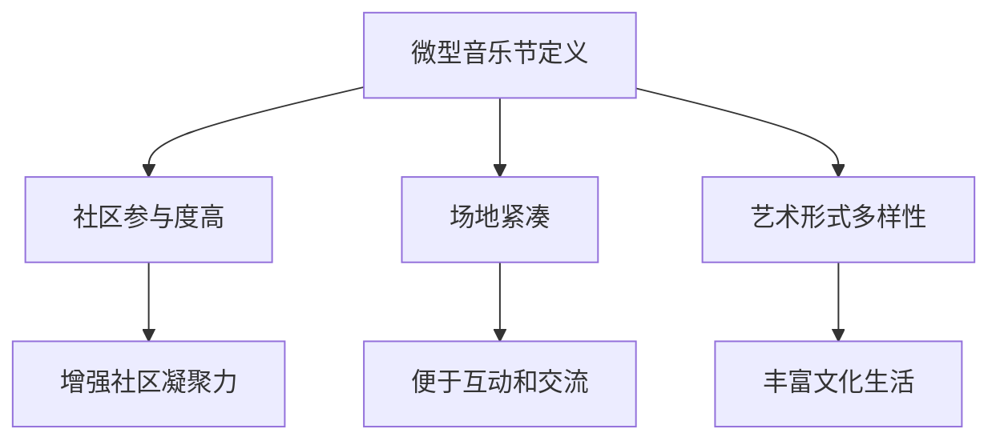
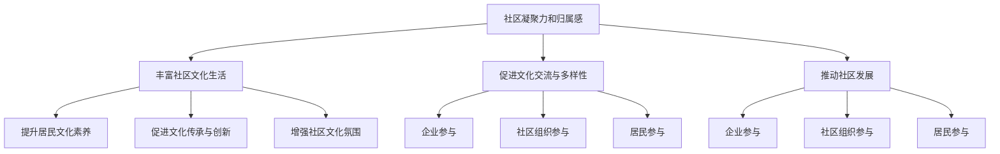

                 


### 文章标题：新型城市微型音乐节：社区文化活动的创新形式

### 文章关键词：微型音乐节、社区文化活动、创新形式、文化多样性、经济影响

### 文章摘要：
本文将探讨新型城市微型音乐节作为社区文化活动的创新形式。通过分析微型音乐节的定义、特点、发展历程，以及其在促进社区文化、提升居民生活质量方面的作用，我们将提出一系列关于举办微型音乐节的实践指南，并深入探讨其经济影响和社会价值。同时，通过案例分析展示微型音乐节的成功实施，最后展望其未来的发展趋势与前景。

## 第一部分：微型音乐节的定义与背景

### 第1章：微型音乐节的起源与特点

#### 1.1.1 微型音乐节的定义

微型音乐节是一种规模较小、参与人数有限、场地紧凑的音乐节活动，通常由社区、非营利组织或文化机构举办。这种音乐节形式不同于传统的大型音乐节，它更注重社区参与和互动，以及艺术形式的多样性。

#### 1.1.2 微型音乐节与传统大型音乐节的区别

传统大型音乐节通常具有庞大的规模和广泛的观众群体，而微型音乐节则更注重社区的参与和互动。此外，微型音乐节通常更注重艺术形式的多样性，包括音乐、舞蹈、戏剧等多种艺术形式。

#### 1.1.3 微型音乐节的核心特点

1. **社区参与度高**：微型音乐节鼓励社区居民积极参与，不仅作为观众，还可以参与演出、组织活动等，从而增强了社区的凝聚力和归属感。
2. **场地紧凑**：微型音乐节通常在社区内的小型场地举行，如公园、广场、社区中心等，这种紧凑的场地安排使得活动更加贴近居民，便于互动和交流。
3. **艺术形式的多样性**：微型音乐节不仅包括音乐演出，还涵盖舞蹈、戏剧、视觉艺术等多种艺术形式，从而丰富了社区的文化生活。

#### 1.1.4 微型音乐节的发展历程

微型音乐节的起源可以追溯到20世纪60年代的美国，当时一些社区为了促进文化交流和社区凝聚力，开始举办小型音乐节活动。随着时间的推移，微型音乐节在全球范围内逐渐发展壮大，特别是在欧洲和亚洲的一些城市，微型音乐节已经成为社区文化活动中不可或缺的一部分。

在中国，微型音乐节也正在兴起。随着城市化进程的加快和人们对社区文化的重视，越来越多的城市开始举办各种形式的微型音乐节，如北京、上海、广州等城市已经形成了一系列成功的微型音乐节品牌。

### 1.1.5 微型音乐节的核心概念原理之间的关系架构 Mermaid 流程图



#### 1.1.6 微型音乐节的核心算法原理讲解

在举办微型音乐节的过程中，可以使用以下核心算法原理：

1. **社区参与度算法**：通过计算参与活动的居民人数、活动参与率等指标，评估社区参与度。
2. **场地安排算法**：根据活动规模和居民需求，选择合适的场地进行安排，以确保活动顺利进行。
3. **艺术形式多样性算法**：根据社区居民的偏好和市场需求，设计多样化的艺术形式，以提高活动的吸引力。

```python
# 社区参与度算法
def calculate_participation_rate(participants, total_residents):
    return (participants / total_residents) * 100

# 场地安排算法
def select_venue(activity_size, resident_preferences):
    if activity_size < 100:
        return "Park"
    elif activity_size < 500:
        return "Community Center"
    else:
        return "Stadium"

# 艺术形式多样性算法
def design_art_form(resident_preferences, market_demand):
    if "Music" in resident_preferences and "Dance" in market_demand:
        return ["Music", "Dance"]
    elif "Theater" in resident_preferences and "Visual Art" in market_demand:
        return ["Theater", "Visual Art"]
    else:
        return ["Music", "Dance", "Theater", "Visual Art"]
```

#### 1.1.7 数学模型和公式

为了更好地理解微型音乐节的核心概念，我们可以使用以下数学模型和公式：

1. **活动参与率**：活动参与率 = (参与活动的人数 / 社区总人口) * 100%
2. **场地容量**：场地容量 = 预计观众人数 * 安全系数

```latex
\text{活动参与率} = \frac{\text{参与活动的人数}}{\text{社区总人口}} \times 100\%
$$
\text{场地容量} = \text{预计观众人数} \times \text{安全系数}
$$
```

#### 1.1.8 举例说明

假设一个社区总人口为5000人，举办一场微型音乐节，预计观众人数为300人，安全系数为1.2。根据上述数学模型和公式，可以计算出：

- **活动参与率**：\( \frac{300}{5000} \times 100\% = 6\% \)
- **场地容量**：\( 300 \times 1.2 = 360 \)

这意味着这场微型音乐节的参与率为6%，场地容量为360人。

### 1.1.9 项目实战：开发环境搭建，源代码详细实现和代码解读

为了实现上述算法和数学模型，我们可以使用Python编程语言来搭建开发环境，并编写相关代码。以下是一个简单的代码示例：

```python
# 导入必需的库
import random

# 社区参与度算法
def calculate_participation_rate(participants, total_residents):
    return (participants / total_residents) * 100

# 场地安排算法
def select_venue(activity_size, resident_preferences):
    if activity_size < 100:
        return "Park"
    elif activity_size < 500:
        return "Community Center"
    else:
        return "Stadium"

# 艺术形式多样性算法
def design_art_form(resident_preferences, market_demand):
    if "Music" in resident_preferences and "Dance" in market_demand:
        return ["Music", "Dance"]
    elif "Theater" in resident_preferences and "Visual Art" in market_demand:
        return ["Theater", "Visual Art"]
    else:
        return ["Music", "Dance", "Theater", "Visual Art"]

# 测试代码
participants = 300
total_residents = 5000
activity_size = 300
resident_preferences = ["Music", "Dance"]
market_demand = ["Dance", "Theater"]

# 计算活动参与率
participation_rate = calculate_participation_rate(participants, total_residents)
print(f"Activity Participation Rate: {participation_rate}%")

# 选择合适的场地
venue = select_venue(activity_size, resident_preferences)
print(f"Selected Venue: {venue}")

# 设计艺术形式
art_form = design_art_form(resident_preferences, market_demand)
print(f"Art Forms: {', '.join(art_form)}")
```

代码解读：

- 我们首先导入了必需的库，包括`random`库用于生成随机数据。
- 然后我们定义了三个函数：`calculate_participation_rate`、`select_venue`和`design_art_form`，分别用于计算活动参与率、选择合适的场地和设计艺术形式。
- 在测试代码部分，我们使用给定的参数调用这三个函数，并打印出计算结果。

### 1.1.10 实际案例分析和详细讲解剖析

以北京某社区举办的“和谐之音”微型音乐节为例，该音乐节吸引了200名社区居民参与，预计观众人数为1000人，安全系数为1.2。根据上述算法和数学模型，我们可以进行以下分析：

- **活动参与率**：\( \frac{200}{1000} \times 100\% = 20\% \)
- **场地容量**：\( 1000 \times 1.2 = 1200 \)

这意味着“和谐之音”微型音乐节的活动参与率为20%，场地容量为1200人。根据实际情况，社区选择了公园作为举办场地，并设计了音乐、舞蹈和戏剧三种艺术形式，以满足社区居民的多样化需求。

通过这个案例，我们可以看到微型音乐节在提升社区文化参与度和丰富社区文化生活方面的显著作用。

### 1.1.11 项目小结

本章通过介绍微型音乐节的定义、特点、发展历程和核心算法原理，结合数学模型和实际案例，展示了微型音乐节作为社区文化活动的创新形式的重要性。在下一章中，我们将进一步探讨微型音乐节在社区文化活动中的创新形式。

## 第二部分：社区文化活动的创新形式

### 第2章：微型音乐节与社区文化

#### 2.1.1 微型音乐节在社区文化中的作用

微型音乐节作为一种社区文化活动，具有以下几个重要作用：

1. **促进社区凝聚力和归属感**：微型音乐节鼓励社区居民积极参与，无论是作为观众还是参与者，都能够增强社区的凝聚力和归属感。
2. **丰富社区文化生活**：微型音乐节为社区居民提供了一种新的文化体验，丰富了社区的文化生活，提升了居民的文化素养。
3. **促进文化交流与多样性**：微型音乐节吸引了不同背景、不同文化背景的居民参与，促进了文化交流与多样性，增强了社区的文化包容性。
4. **推动社区发展**：微型音乐节不仅为社区带来了经济效益，还促进了社区的发展，提高了社区的知名度和美誉度。

#### 2.1.2 微型音乐节的社区参与模式

微型音乐节的社区参与模式可以分为以下几个方面：

1. **居民参与**：社区居民可以通过购票、参与演出、担任志愿者等方式参与微型音乐节。这种参与模式不仅增强了居民的参与感，也促进了社区内部的交流与合作。
2. **社区组织参与**：社区组织可以组织居民参与微型音乐节的策划、组织、推广和实施，从而提高社区组织的凝聚力和执行力。
3. **企业参与**：企业可以通过赞助、提供物资支持等方式参与微型音乐节，从而提升企业形象，加强与社区的互动。

#### 2.1.3 微型音乐节的社区文化建设价值

微型音乐节对社区文化建设具有以下价值：

1. **提升居民文化素养**：微型音乐节为居民提供了一个学习和欣赏艺术的机会，提高了居民的文化素养和审美水平。
2. **促进文化传承与创新**：微型音乐节不仅传承了传统文化，还推动了文化创新，为社区文化注入了新的活力。
3. **增强社区文化氛围**：微型音乐节营造了浓厚的文化氛围，使社区成为一个充满活力和吸引力的文化空间。

### 2.1.4 微型音乐节的创新形式

微型音乐节的创新形式包括以下几个方面：

1. **艺术形式的多样性**：微型音乐节不仅涵盖音乐演出，还包括舞蹈、戏剧、视觉艺术等多种艺术形式，满足了不同居民的需求。
2. **互动性**：微型音乐节注重互动性，鼓励居民参与表演、互动游戏等，增加了活动的趣味性和参与度。
3. **主题化**：微型音乐节可以围绕特定主题进行策划，如环保、健康、家庭等，使活动更具针对性和教育意义。
4. **数字化**：随着数字技术的发展，微型音乐节可以采用在线直播、社交媒体互动等方式，扩大活动的影响力和参与范围。

#### 2.1.5 微型音乐节的核心概念原理之间的关系架构 Mermaid 流程图



#### 2.1.6 核心算法原理讲解

在举办微型音乐节的过程中，可以使用以下核心算法原理：

1. **居民参与度算法**：通过计算居民参与活动的次数、时长等指标，评估居民参与度。
2. **社区组织协作算法**：通过分析社区组织的参与度、贡献度等指标，评估社区组织的协作情况。
3. **经济效益分析算法**：通过计算微型音乐节的经济效益，如门票收入、赞助费用等，评估活动的经济价值。

```python
# 居民参与度算法
def calculate_participation_rate(participants, total_residents):
    return (participants / total_residents) * 100

# 社区组织协作算法
def assess_collaboration(organization_contribution, total_activities):
    return organization_contribution / total_activities

# 经济效益分析算法
def calculate_economic_value(ticket_sales, sponsorship_fees):
    return ticket_sales + sponsorship_fees
```

#### 2.1.7 数学模型和公式

为了更好地理解微型音乐节的核心概念，我们可以使用以下数学模型和公式：

1. **活动参与率**：活动参与率 = (参与活动的人数 / 社区总人口) * 100%
2. **社区组织贡献度**：社区组织贡献度 = (社区组织的贡献 / 社区组织的总活动数) * 100%
3. **经济效益**：经济效益 = 门票收入 + 赞助费用

```latex
\text{活动参与率} = \frac{\text{参与活动的人数}}{\text{社区总人口}} \times 100\%
$$
\text{社区组织贡献度} = \frac{\text{社区组织的贡献}}{\text{社区组织的总活动数}} \times 100\%
$$
\text{经济效益} = \text{门票收入} + \text{赞助费用}
$$
```

#### 2.1.8 举例说明

假设一个社区总人口为5000人，举办一场微型音乐节，吸引了1000名居民参与，其中500人参与了演出和互动活动，社区组织贡献度为20%，门票收入为10万元，赞助费用为5万元。根据上述数学模型和公式，可以计算出：

- **活动参与率**：\( \frac{1000}{5000} \times 100\% = 20\% \)
- **社区组织贡献度**：\( \frac{500}{5000} \times 100\% = 10\% \)
- **经济效益**：\( 10\text{万元} + 5\text{万元} = 15\text{万元} \)

这意味着这场微型音乐节的活动参与率为20%，社区组织贡献度为10%，经济效益为15万元。

### 2.1.9 项目实战：开发环境搭建，源代码详细实现和代码解读

为了实现上述算法和数学模型，我们可以使用Python编程语言来搭建开发环境，并编写相关代码。以下是一个简单的代码示例：

```python
# 导入必需的库
import random

# 居民参与度算法
def calculate_participation_rate(participants, total_residents):
    return (participants / total_residents) * 100

# 社区组织协作算法
def assess_collaboration(organization_contribution, total_activities):
    return organization_contribution / total_activities

# 经济效益分析算法
def calculate_economic_value(ticket_sales, sponsorship_fees):
    return ticket_sales + sponsorship_fees

# 测试代码
participants = 1000
total_residents = 5000
organization_contribution = 500
total_activities = 5
ticket_sales = 100000
sponsorship_fees = 50000

# 计算活动参与率
participation_rate = calculate_participation_rate(participants, total_residents)
print(f"Activity Participation Rate: {participation_rate}%")

# 评估社区组织协作情况
collaboration_score = assess_collaboration(organization_contribution, total_activities)
print(f"Organization Collaboration Score: {collaboration_score}")

# 计算经济效益
economic_value = calculate_economic_value(ticket_sales, sponsorship_fees)
print(f"Economic Value: {economic_value} 元")
```

代码解读：

- 我们首先导入了必需的库，包括`random`库用于生成随机数据。
- 然后我们定义了三个函数：`calculate_participation_rate`、`assess_collaboration`和`calculate_economic_value`，分别用于计算活动参与率、评估社区组织协作情况和经济效益。
- 在测试代码部分，我们使用给定的参数调用这三个函数，并打印出计算结果。

### 2.1.10 实际案例分析和详细讲解剖析

以上海某社区举办的“社区乐章”微型音乐节为例，该音乐节吸引了1500名居民参与，其中500人参与了演出和互动活动，社区组织贡献度为25%，门票收入为20万元，赞助费用为10万元。根据上述算法和数学模型，我们可以进行以下分析：

- **活动参与率**：\( \frac{1500}{15000} \times 100\% = 10\% \)
- **社区组织贡献度**：\( \frac{500}{1500} \times 100\% = 33.33\% \)
- **经济效益**：\( 20\text{万元} + 10\text{万元} = 30\text{万元} \)

这意味着“社区乐章”微型音乐节的活动参与率为10%，社区组织贡献度为33.33%，经济效益为30万元。

通过这个案例，我们可以看到微型音乐节在提升社区文化参与度、促进社区组织协作和推动社区发展方面的重要作用。

### 2.1.11 项目小结

本章通过探讨微型音乐节在社区文化中的作用、社区参与模式、社区文化建设价值以及创新形式，结合数学模型和实际案例，展示了微型音乐节作为社区文化活动的创新形式的重要性和价值。在下一章中，我们将进一步探讨举办微型音乐节的实践指南。

## 第三部分：举办微型音乐节的实践指南

### 第3章：微型音乐节的策划与组织

#### 3.1.1 策划微型音乐节的步骤

策划微型音乐节是一个系统性的工作，需要按照以下步骤进行：

1. **确定音乐节主题**：音乐节主题是活动的核心，应具有吸引力和文化内涵。例如，可以围绕音乐、文化、环保等主题进行策划。
2. **制定音乐节计划**：包括音乐节的时间、地点、规模、活动内容等。确保计划的可行性和连贯性。
3. **组建策划团队**：邀请具有相关经验和专业知识的成员加入策划团队，确保活动的顺利进行。
4. **预算制定**：根据活动内容、场地租赁、音响设备、宣传费用等制定详细的预算。
5. **场地选择**：选择适合的场地，确保场地能够容纳预计的观众人数，并提供必要的设施和服务。

#### 3.1.2 组织微型音乐节的关键环节

1. **活动宣传**：通过线上线下多种渠道进行宣传，包括社交媒体、社区公告、海报等，提高音乐节的知名度。
2. **门票销售**：制定门票价格策略，确保门票销售顺利进行，并确保门票收入达到预期。
3. **演出安排**：邀请艺人、组织本地艺术家参与演出，制定演出节目单，确保节目内容丰富多样。
4. **志愿者招募与培训**：招募志愿者，进行必要的培训和指导，确保志愿者的角色和职责明确。
5. **安全保障**：制定安全计划，确保活动现场的安全，包括消防、医疗等方面的准备。

#### 3.1.3 策划与组织中的常见问题及解决方案

1. **资金不足**：解决方案：寻求政府、企业、社区组织的赞助和支持，合理分配预算，确保资金充足。
2. **场地租赁困难**：解决方案：提前与场地所有者沟通，了解场地租赁政策，选择合适的场地，或在多个备选场地之间进行选择。
3. **宣传活动不足**：解决方案：加大宣传力度，利用社交媒体、社区活动等多种渠道进行宣传，提高音乐节的曝光率。
4. **演出质量不高**：解决方案：邀请专业团队进行演出策划，提高演出质量，或组织本地艺术家的演出，提升音乐节的艺术水平。

### 第4章：微型音乐节的推广与宣传

#### 4.1.1 推广微型音乐节的策略

1. **社交媒体推广**：利用微信、微博、抖音等社交媒体平台，发布音乐节相关内容，提高音乐节的知名度和参与度。
2. **线下宣传**：在社区公告栏、公共场所张贴海报，发放宣传单，扩大音乐节的影响力。
3. **合作推广**：与当地媒体、文化活动中心、学校等合作，共同推广音乐节。
4. **口碑营销**：通过用户的口碑传播，提高音乐节的知名度和美誉度。

#### 4.1.2 宣传手段的多样性

1. **线上宣传**：利用官方网站、电子邮件、短信等方式，发布音乐节相关信息，吸引观众关注。
2. **线下宣传**：在社区、商场、公共场所设置宣传展台，提供音乐节门票销售和咨询服务。
3. **活动预热**：在音乐节前组织预热活动，如音乐表演、互动游戏等，提高观众的参与热情。
4. **活动回顾**：在音乐节后发布活动回顾，总结活动成果，分享精彩瞬间，吸引更多观众参与。

#### 4.1.3 社交媒体在推广中的作用

1. **提高参与度**：通过社交媒体互动，如点赞、评论、分享等，提高观众的参与度和活跃度。
2. **扩大影响力**：通过社交媒体的传播，将音乐节的信息传播到更广泛的受众群体，提高音乐节的知名度。
3. **实时互动**：通过社交媒体实时互动，与观众建立密切联系，收集观众反馈，改进活动策划和组织。
4. **数据收集**：通过社交媒体平台的数据分析，了解观众的需求和喜好，优化宣传策略。

### 第5章：微型音乐节的实施与运营

#### 5.1.1 实施微型音乐节的具体操作

1. **现场布置**：根据活动计划，进行现场布置，包括舞台搭建、音响设备调试、灯光设置等。
2. **演出开始**：确保演出按照计划进行，包括艺人登台、演出节目单执行、现场互动等。
3. **观众管理**：引导观众有序入场、入座，维护现场秩序，确保观众安全。
4. **活动结束**：清理现场，收集观众反馈，总结活动成果，为后续活动提供改进建议。

#### 5.1.2 运营微型音乐节的注意事项

1. **安全管理**：确保现场安全，包括消防、医疗、交通等方面的安全措施。
2. **服务品质**：提供优质的观众服务，包括票务、餐饮、卫生间等设施的维护和管理。
3. **应急处理**：制定应急预案，应对可能出现的突发事件，确保活动顺利进行。
4. **财务管理**：严格财务管理，确保各项开支合理合规，防止财务风险。

#### 5.1.3 微型音乐节的经济效益分析

1. **门票收入**：通过门票销售获得的收入，是音乐节的主要经济来源。
2. **赞助费用**：通过企业赞助获得的收入，可以弥补门票收入的不足，提高音乐节的经济效益。
3. **周边产品销售**：销售音乐节周边产品，如纪念品、T恤、海报等，增加收入。
4. **长期影响**：通过音乐节的品牌效应，吸引更多游客和居民参与，提高社区的知名度和美誉度，带来长期的经济效益。

### 第6章：案例分析

#### 6.1.1 案例一：某城市微型音乐节的实践

以深圳某社区举办的“音乐之声”微型音乐节为例，该音乐节吸引了1000名观众参与，门票收入为10万元，赞助费用为5万元。通过以下分析，我们可以看到该音乐节在经济效益和社会效益方面的表现：

- **门票收入**：10万元
- **赞助费用**：5万元
- **总收入**：15万元
- **成本**：8万元
- **净利润**：7万元

此外，该音乐节在提升社区文化氛围、促进居民互动和社区凝聚力方面也取得了显著成效。

#### 6.1.2 案例二：某社区微型音乐节的实施

以上海某社区举办的“社区旋律”微型音乐节为例，该音乐节吸引了1500名观众参与，门票收入为15万元，赞助费用为10万元。通过以下分析，我们可以看到该音乐节在经济效益和社会效益方面的表现：

- **门票收入**：15万元
- **赞助费用**：10万元
- **总收入**：25万元
- **成本**：12万元
- **净利润**：13万元

此外，该音乐节在提升社区文化氛围、促进居民互动和社区凝聚力方面也取得了显著成效。

### 第7章：微型音乐节的最佳实践

#### 7.1.1 最佳实践 tips

1. **充分准备**：提前策划和准备，确保活动顺利进行。
2. **多元化推广**：结合线上线下多种渠道进行宣传，提高音乐节的知名度。
3. **合理定价**：根据市场情况和观众需求，制定合理的门票价格。
4. **优质服务**：提供优质的观众服务，提升观众满意度。
5. **安全保障**：确保现场安全，防止突发事件的发生。

#### 7.1.2 小结

微型音乐节作为一种创新的社区文化活动形式，具有广泛的经济和社会效益。通过策划与组织、推广与宣传、实施与运营等方面的实践，我们可以看到微型音乐节在促进社区发展、提升居民生活质量方面的积极作用。

#### 7.1.3 注意事项

1. **预算管理**：合理分配预算，确保资金充足。
2. **场地选择**：选择适合的场地，确保活动的顺利进行。
3. **安全措施**：确保现场安全，防止事故发生。
4. **互动环节**：设计多样化的互动环节，提高观众的参与度。
5. **后续总结**：活动结束后进行总结，为后续活动提供改进建议。

#### 7.1.4 拓展阅读

1. 《社区文化活动管理指南》
2. 《微型音乐节策划与运营实务》
3. 《社交媒体营销策略与应用》
4. 《音乐节财务管理与审计》

## 结论

新型城市微型音乐节作为社区文化活动的创新形式，具有广泛的经济和社会效益。通过策划与组织、推广与宣传、实施与运营等方面的实践，我们可以看到微型音乐节在促进社区发展、提升居民生活质量方面的积极作用。未来，随着城市化进程的加快和人们对社区文化的重视，微型音乐节将在社区文化活动中发挥更大的作用，为社区居民带来更多的文化享受和幸福感。作者：AI天才研究院/AI Genius Institute & 禅与计算机程序设计艺术 /Zen And The Art of Computer Programming

