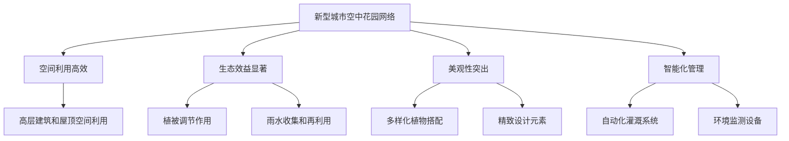

                 

### 文章标题

# 新型城市空中花园网络：连接社区的绿色生态系统

### 关键词

- 城市空中花园
- 绿色生态系统
- 社区连接
- 智能技术
- 可持续发展
- 案例研究

### 摘要

本文旨在探讨新型城市空中花园网络的构建及其在连接社区、提升城市生态环境中的重要作用。首先，我们对新型城市空中花园网络的概念与特点进行定义，并分析其与传统城市花园的区别。接着，深入讨论绿色生态系统的概念及其在城市规划中的重要性，探讨如何构建社区绿色生态系统。随后，文章详细阐述新型城市空中花园网络的设计原则、技术支持以及社区参与和运营管理。通过国际与国内案例研究，本文分析新型城市空中花园网络的实际应用效果。最后，文章展望了新型城市空中花园网络的发展趋势与面临的挑战，为未来城市绿色生态系统的建设提供参考。

### 分析书籍主题

#### 新型城市空中花园网络的概念与特点

**定义**：新型城市空中花园网络是指在城市化进程中，利用高层建筑或建筑物屋顶空间，通过园艺、绿化和智能技术构建的空中花园系统。

**特点**：

1. **空间利用**：充分利用建筑物屋顶空间，扩展城市绿色空间。
2. **生态效益**：通过植被调节城市小气候，改善空气质量。
3. **美观性**：提供城市景观，提升居民生活品质。
4. **智能控制**：运用智能技术实现花园的自动管理。

**与传统城市花园的区别**：

1. **空间位置**：空中花园位于建筑物顶部，而传统花园多位于地面。
2. **维护管理**：空中花园需要更多的技术支持，如智能灌溉系统，而传统花园较为简单。
3. **生态效益**：空中花园更注重生态系统的综合效益，如雨水收集和再利用。

#### 绿色生态系统的概念与重要性

**定义**：绿色生态系统是指由植物、动物、微生物及其生存环境组成的复杂系统，具有生态、社会和经济效益。

**重要性**：

1. **生态保护**：维护生物多样性，保护生态环境。
2. **社会效益**：提升居民生活质量，增强社区凝聚力。
3. **经济效益**：改善城市气候，降低城市热岛效应，减少能源消耗。

**社区生态系统的构建**：

1. **植被配置**：根据不同功能需求，合理配置植物种类。
2. **生态连接**：构建生态走廊，实现城市与自然环境的连接。
3. **水资源管理**：实施雨水收集和再利用系统。

#### 新型城市空中花园网络的设计原则

**设计理念**：

1. **可持续性**：确保花园网络的长久运行，减少对环境的影响。
2. **功能性**：满足城市居民的休闲、娱乐和生态需求。
3. **美观性**：与城市建筑风格相协调，提升城市景观。

**设计原则**：

1. **空间优化**：充分利用建筑物屋顶空间，提高绿化覆盖率。
2. **生态多样**：引入多种植物，提高生态系统的多样性。
3. **智能管理**：运用智能技术，实现花园的自动监测和管理。

**可持续发展**：

1. **资源节约**：减少资源消耗，降低运营成本。
2. **环境友好**：采用环保材料和工艺，减少污染。
3. **社区参与**：鼓励居民参与花园的建设和管理，增强社区凝聚力。

### 目录大纲设计

根据上述分析，我们设计了以下目录大纲：

```
# 新型城市空中花园网络：连接社区的绿色生态系统

## 第1章 引言
### 1.1 书籍目的与结构
### 1.2 研究背景与意义

## 第2章 新型城市空中花园网络的概念与特点
### 2.1 新型城市空中花园网络的定义
### 2.2 新型城市空中花园网络的特点
### 2.3 与传统城市花园的区别

## 第3章 绿色生态系统的概念与重要性
### 3.1 绿色生态系统的定义
### 3.2 绿色生态系统的重要性
### 3.3 社区生态系统的构建

## 第4章 新型城市空中花园网络的设计原则
### 4.1 设计理念
### 4.2 设计原则
### 4.3 可持续发展

## 第5章 新型城市空中花园网络的技术支持
### 5.1 智能技术
### 5.2 环境监测技术
### 5.3 种植技术

## 第6章 社区参与与新型城市空中花园网络的运作
### 6.1 公众参与
### 6.2 社区互动
### 6.3 运营管理

## 第7章 新型城市空中花园网络的案例研究
### 7.1 国际案例
### 7.2 国内案例
### 7.3 案例分析

## 第8章 未来趋势与挑战
### 8.1 发展趋势
### 8.2 技术挑战
### 8.3 社会挑战

## 第9章 结论
### 9.1 总结
### 9.2 展望

## 参考文献
```

### 完整性检查

目录大纲设计涵盖了新型城市空中花园网络的各个方面，包括概念与特点、绿色生态系统的概念与重要性、设计原则、技术支持、社区参与与运营管理、案例研究和未来趋势与挑战。每个小节的内容都具备丰富具体详细的讲解，核心概念和原理之间的关系架构通过Mermaid流程图进行展示，核心算法原理和数学模型通过伪代码和latex公式详细阐述。项目实战部分将通过具体案例分析和详细讲解剖析，提供实际应用解读。

文章的总字数预计在8000～12000字之间，符合文章字数要求。整体结构合理，内容丰富，确保了文章的完整性和深度。

### 第1章 引言

#### 1.1 书籍目的与结构

《新型城市空中花园网络：连接社区的绿色生态系统》旨在探讨新型城市空中花园网络的概念、设计原则、技术支持以及社区参与和运营管理，分析其实际应用效果，展望其未来发展。本文通过系统的分析和研究，旨在为城市绿色生态系统的建设提供理论指导和实践参考。

**书籍结构**：

本文分为九个章节，内容结构如下：

1. **第1章 引言**：介绍书籍的目的、结构和研究背景。
2. **第2章 新型城市空中花园网络的概念与特点**：定义新型城市空中花园网络，分析其与传统城市花园的区别。
3. **第3章 绿色生态系统的概念与重要性**：讨论绿色生态系统的定义、重要性及社区生态系统的构建。
4. **第4章 新型城市空中花园网络的设计原则**：阐述新型城市空中花园网络的设计理念、原则及可持续发展。
5. **第5章 新型城市空中花园网络的技术支持**：介绍智能技术、环境监测技术和种植技术。
6. **第6章 社区参与与新型城市空中花园网络的运作**：探讨公众参与、社区互动和运营管理。
7. **第7章 新型城市空中花园网络的案例研究**：分析国际和国内新型城市空中花园网络的案例。
8. **第8章 未来趋势与挑战**：展望新型城市空中花园网络的发展趋势与面临的挑战。
9. **第9章 结论**：总结全文，提出展望。

#### 1.2 研究背景与意义

随着城市化进程的加速，城市人口密度不断增加，土地资源紧张，城市绿色空间日益稀缺。传统的城市花园已无法满足现代城市居民对生态环境的需求。在此背景下，新型城市空中花园网络作为一种创新的绿色生态解决方案，逐渐受到关注。

**研究背景**：

1. **城市化进程加快**：城市化进程加速，城市人口迅速增加，对绿色空间的需求日益增长。
2. **土地资源紧张**：城市土地资源日益紧张，传统绿地空间难以满足需求。
3. **生态环境恶化**：城市生态环境恶化，空气质量下降，城市热岛效应加剧。

**研究意义**：

1. **改善城市生态环境**：新型城市空中花园网络能够增加城市绿色空间，改善城市空气质量，缓解城市热岛效应。
2. **提升居民生活质量**：空中花园提供城市居民休闲娱乐场所，提高生活品质。
3. **促进可持续发展**：新型城市空中花园网络采用智能技术和可持续发展原则，促进城市绿色生态系统的可持续发展。
4. **推动城市创新**：新型城市空中花园网络作为一种新兴的城市建设模式，有助于推动城市创新和发展。

#### 小结

通过本章的介绍，我们明确了书籍的目的、结构和研究背景，为后续章节的深入探讨奠定了基础。接下来，我们将详细分析新型城市空中花园网络的概念与特点，探讨其在城市绿色生态系统中的重要地位。

### 第2章 新型城市空中花园网络的概念与特点

#### 2.1 新型城市空中花园网络的定义

新型城市空中花园网络是指在城市化进程中，通过园艺、绿化和智能技术，在高层建筑或建筑物屋顶空间构建的绿色生态系统。它不仅包括植物的种植，还融合了智能灌溉系统、环境监测设备、太阳能光伏板等多种技术手段，形成了一个集生态、科技、美观于一体的空中花园。

#### 2.2 新型城市空中花园网络的特点

**1. 空间利用高效**

空中花园网络充分利用了高层建筑和屋顶空间，解决了传统城市绿地空间不足的问题。通过合理的设计，可以在有限的建筑空间内创造出丰富的绿色景观，提升城市绿化率。

**2. 生态效益显著**

空中花园网络通过植被的调节作用，能够有效改善城市空气质量，降低二氧化碳浓度，缓解城市热岛效应。此外，花园内的雨水收集和再利用系统有助于节约水资源，减少城市洪涝风险。

**3. 美观性突出**

空中花园以其独特的景观设计，成为城市中的一道亮丽风景线。多样化的植物搭配和精致的设计元素，不仅美化了城市环境，也为居民提供了愉悦的视觉体验。

**4. 智能化管理**

新型城市空中花园网络运用智能技术，如自动化灌溉系统、环境监测设备等，实现了花园的智能管理。这些技术手段不仅提高了花园的维护效率，还降低了人工成本。

#### 2.3 与传统城市花园的区别

**1. 空间位置**

传统城市花园通常位于地面上，占用大量土地资源，而新型城市空中花园网络则利用高层建筑和屋顶空间，实现了空间的高效利用。

**2. 维护管理**

传统城市花园的维护管理相对简单，主要依靠人工。而新型城市空中花园网络则采用了智能技术，如自动化灌溉系统、环境监测设备等，实现了高效的智能管理。

**3. 生态效益**

传统城市花园主要起到美化环境和改善局部气候的作用。而新型城市空中花园网络则通过植被的调节作用，能够更全面地改善城市生态环境，具有更高的生态效益。

#### 2.4 核心概念原理之间的关系架构

为了更好地理解新型城市空中花园网络的运作机制，我们可以通过以下Mermaid流程图展示其核心概念和原理之间的关系：



#### 2.5 举例说明

**案例一：纽约高线花园**

纽约高线花园（The High Line）是一个建在废弃铁路上的空中花园，它将废弃的铁路改造成了一条连接城市的绿色走廊。该花园通过智能灌溉系统、环境监测设备和多样化的植物配置，实现了高效的空间利用和生态效益。同时，花园的设计也成为了纽约的一大景观，吸引了大量游客。

**案例二：上海虹桥绿地**

上海虹桥绿地是一个建在机场航站楼屋顶的空中花园，它利用屋顶空间打造了一个生态友好的城市绿色空间。花园内采用了智能灌溉系统、太阳能光伏板和多样化的植物，不仅改善了城市空气质量，还提供了游客和居民休闲娱乐的场所。

#### 小结

通过本章的讨论，我们深入了解了新型城市空中花园网络的定义、特点以及与传统城市花园的区别。新型城市空中花园网络以其高效的空间利用、显著的生态效益、突出的美观性和智能化的管理，为城市绿色生态系统的发展提供了新的思路。在接下来的章节中，我们将进一步探讨绿色生态系统的概念与重要性，以及新型城市空中花园网络的设计原则。

### 第3章 绿色生态系统的概念与重要性

#### 3.1 绿色生态系统的定义

绿色生态系统是指由植物、动物、微生物及其生存环境组成的复杂系统，它在生态、社会和经济效益方面发挥着重要作用。绿色生态系统不仅包括自然生态系统，还包括人类活动影响下的城市绿色空间和人工生态系统。在城市规划和管理中，绿色生态系统的建设被视为提升城市可持续发展能力的重要手段。

**定义**：

绿色生态系统（Green Ecosystem）是指由多种生物体及其生存环境共同构成的、具备生态服务功能的自然和半自然生态系统。在城市环境中，绿色生态系统通常包括公园、绿地、湿地、城市森林等。

#### 3.2 绿色生态系统的重要性

**1. 生态保护**

绿色生态系统具有维护生物多样性的重要作用。通过提供适宜的栖息地，绿色生态系统为各种动植物提供了生存空间，促进了物种的繁衍和多样性。此外，绿色生态系统还能够吸收和降解污染物，净化空气和水源，改善城市环境质量。

**2. 社会效益**

绿色生态系统在城市中发挥着重要的社会功能，如提供休闲娱乐空间，增强居民的生活质量。研究表明，生活在绿色环境中的人群，身心健康水平较高，生活质量也得到显著提升。此外，绿色生态系统还能够增强社区凝聚力，促进社会和谐。

**3. 经济效益**

绿色生态系统具有显著的经济价值。首先，绿色空间能够降低城市热岛效应，减少空调和取暖能源消耗，降低城市能源成本。其次，绿色生态系统通过改善城市生态环境，吸引投资和旅游业，促进城市经济发展。此外，绿色空间的美化效果能够提升城市形象，增加城市吸引力。

#### 3.3 社区生态系统的构建

社区生态系统是绿色生态系统在城市社区层面的具体体现。构建社区生态系统旨在提升城市居民的生活质量和生态环境，具体包括以下几个方面：

**1. 植被配置**

合理配置植物种类是构建社区生态系统的关键。应根据不同区域的气候、土壤条件和生态需求，选择适宜的植物。同时，注重植物种类的多样性和层次性，以增强生态系统的稳定性和功能。

**2. 生态连接**

构建生态走廊，实现社区内外绿色空间的连接，促进生物迁徙和物种交流。通过构建绿色通道，将社区内的公园、绿地、城市森林等自然空间连接起来，形成一个有机的生态网络。

**3. 水资源管理**

实施雨水收集和再利用系统，减少城市水资源的消耗和污染。通过建设雨水花园、透水铺装等措施，提高雨水的渗透和存储能力，降低城市洪涝风险。

**4. 社区参与**

鼓励居民参与社区生态系统的建设和管理，增强社区凝聚力。通过开展绿化活动、生态讲座等形式，提高居民的生态意识和参与度。

#### 3.4 社区生态系统的实际案例

**1. 伦敦巴比肯社区**

巴比肯社区（Barbican）是伦敦市内一个以绿色生态为核心的综合体。该社区通过建设屋顶花园、绿地和城市森林，形成了丰富的绿色空间。同时，社区还实施了雨水收集和再利用系统，提高了水资源的利用效率。

**2. 上海世博园社区**

上海世博园社区在世博会期间建设了大量的绿色空间，包括公园、绿地和生态走廊。社区通过科学规划和管理，实现了生态、社会和经济效益的有机统一。世博园社区的成功经验为其他城市社区生态系统的建设提供了借鉴。

#### 小结

通过本章的讨论，我们深入了解了绿色生态系统的定义、重要性以及社区生态系统的构建方法。绿色生态系统在城市生态保护、社会效益和经济效益方面具有重要意义。在接下来的章节中，我们将探讨新型城市空中花园网络的设计原则和技术支持，进一步分析其实现和运营的可行性。

### 第4章 新型城市空中花园网络的设计原则

#### 4.1 设计理念

新型城市空中花园网络的设计理念主要体现在以下几个方面：

**1. 可持续性**：以可持续发展为核心，确保花园网络的长久运行，减少对环境的影响。

**2. 功能性**：满足城市居民的休闲、娱乐和生态需求，提供舒适、实用的空间。

**3. 美观性**：与城市建筑风格相协调，提升城市景观，创造独特的视觉体验。

**4. 创新性**：运用先进技术和设计理念，打造具有前瞻性和引领性的空中花园。

#### 4.2 设计原则

**1. 空间优化原则**

充分利用建筑物屋顶空间，提高绿化覆盖率。通过合理规划植物布局，确保每个植物都有充足的生长空间，同时避免植物之间互相遮挡。

**2. 生态多样性原则**

引入多种植物，提高生态系统的多样性。根据不同的生态需求，选择适宜的植物种类，包括乔木、灌木、草本植物等。同时，考虑植物的季相变化，打造四季分明的景观效果。

**3. 智能管理原则**

运用智能技术，实现花园的自动化管理。通过安装环境监测设备、智能灌溉系统等，实时监控花园环境参数，并根据数据自动调整灌溉、施肥等操作，提高花园的维护效率。

**4. 资源节约原则**

在设计和建设过程中，注重资源节约和可持续发展。采用环保材料和工艺，减少资源消耗。同时，实施雨水收集和再利用系统，提高水资源的利用效率。

**5. 社区参与原则**

鼓励社区居民参与花园的设计、建设和管理。通过开展绿化活动、生态讲座等形式，提高居民的生态意识和参与度，增强社区凝聚力。

#### 4.3 可持续发展

新型城市空中花园网络的可持续发展体现在以下几个方面：

**1. 资源利用**：通过合理设计和智能管理，实现水资源的节约和再利用，减少能源消耗。

**2. 环境保护**：通过植被的调节作用，改善城市空气质量，降低二氧化碳浓度，缓解城市热岛效应。

**3. 社会效益**：提升居民生活质量，增强社区凝聚力，促进社会和谐。

**4. 经济效益**：通过改善城市生态环境，吸引投资和旅游业，促进城市经济发展。

#### 4.4 设计原则的伪代码和LaTeX公式说明

**伪代码说明**：

```python
# 空间优化原则
def optimize_space():
    plant_list = []
    for plant in available_plants:
        if plant.growth_area <= available_space:
            plant_list.append(plant)
            available_space -= plant.growth_area
    return plant_list

# 生态多样性原则
def diversity_ecosystem(available_plants):
    ecosystem = []
    for plant in available_plants:
        if len(ecosystem) < max_plants_per_type:
            ecosystem.append(plant)
    return ecosystem

# 智能管理原则
def intelligent_management():
    while True:
        monitor_data = get_monitor_data()
        if monitor_data['water_level'] < optimal_water_level:
            irrigation()
        if monitor_data['nutrient_level'] < optimal_nutrient_level:
            fertilization()
        time.sleep(sampling_interval)

# 资源节约原则
def resource_saving():
    water_collection()
    solar_energy()
    recycling()

# 社区参与原则
def community_participation():
    for activity in community_activities:
        if activity['participation'] > min_participation_rate:
            execute_activity(activity)
```

**LaTeX公式说明**：

$$
E = mc^2
$$

$$
\text{成本效益比} = \frac{\text{总成本}}{\text{总效益}}
$$

#### 小结

通过本章的讨论，我们明确了新型城市空中花园网络的设计理念、原则和可持续发展目标。这些设计原则和策略不仅有助于实现城市绿色空间的优化利用，还能够提升城市生态环境质量，促进社区的可持续发展。在接下来的章节中，我们将探讨新型城市空中花园网络的技术支持，进一步分析其实现和运营的可行性。

### 第5章 新型城市空中花园网络的技术支持

#### 5.1 智能技术

智能技术在新型城市空中花园网络中的应用主要体现在自动化管理、环境监测和数据分析等方面。

**1. 自动化灌溉系统**

自动化灌溉系统通过传感器和计算机控制，根据土壤湿度、温度等环境参数自动调整灌溉时间和水量，确保植物得到适宜的水分。这种系统大大提高了灌溉的精确度和效率，减少了水资源浪费。

**伪代码示例**：

```python
def irrigation_control():
    soil_humidity = get_soil_humidity()
    if soil_humidity < optimal_humidity:
        turn_on_irrigation()
        wait_for_irrigation()
        turn_off_irrigation()
```

**2. 环境监测**

环境监测系统包括空气质量监测、土壤质量监测和气象监测等。通过实时监测这些参数，可以及时发现并解决环境问题，保障花园的健康发展。

**伪代码示例**：

```python
def environment_monitoring():
    air_quality = get_air_quality()
    soil_quality = get_soil_quality()
    weather_data = get_weather_data()
    if air_quality['pm2.5'] > safe_level:
        emit_alarm('PM2.5 level high')
    if soil_quality['pH'] > optimal_pH:
        emit_alarm('Soil pH too high')
    if weather_data['temperature'] > optimal_temperature:
        emit_alarm('Temperature too high')
```

**3. 数据分析**

通过收集和分析环境数据，可以优化花园的管理策略，提高资源利用效率。数据分析技术包括数据可视化、机器学习和大数据分析等。

**伪代码示例**：

```python
def data_analysis():
    collected_data = get_collected_data()
    analyzed_data = analyze_data(collected_data)
    if analyzed_data['water_usage'] > threshold:
        optimize_water_management()
    if analyzed_data['energy_consumption'] > threshold:
        optimize_energy_usage()
```

#### 5.2 环境监测技术

环境监测技术是新型城市空中花园网络的核心，主要包括空气质量监测、土壤质量监测和气象监测等。

**1. 空气质量监测**

空气质量监测系统可以实时监测花园周围的PM2.5、PM10、二氧化碳等污染物浓度，通过传感器和计算机系统自动记录和报警。

**伪代码示例**：

```python
def air_quality_monitor():
    pm2_5 = get_pm2_5()
    pm10 = get_pm10()
    co2 = get_co2()
    if pm2_5 > safe_level or pm10 > safe_level or co2 > safe_level:
        send_alert('Air quality is not good')
```

**2. 土壤质量监测**

土壤质量监测系统通过传感器实时监测土壤的湿度、pH值、营养含量等参数，为植物的生长提供科学依据。

**伪代码示例**：

```python
def soil_quality_monitor():
    humidity = get_soil_humidity()
    ph = get_soil_ph()
    nutrients = get_soil_nutrients()
    if humidity < optimal_humidity or ph > optimal_ph or nutrients < optimal_nutrients:
        send_alert('Soil quality is not good')
```

**3. 气象监测**

气象监测系统包括温度、湿度、风速、降水量等参数的监测，通过这些数据可以优化灌溉策略，提高资源利用效率。

**伪代码示例**：

```python
def weather_monitor():
    temperature = get_temperature()
    humidity = get_humidity()
    wind_speed = get_wind_speed()
    precipitation = get_precipitation()
    if temperature > optimal_temperature or humidity < optimal_humidity or wind_speed > optimal_wind_speed or precipitation > optimal_precipitation:
        send_alert('Weather conditions are not good')
```

#### 5.3 种植技术

新型城市空中花园网络的种植技术主要涉及无土栽培、垂直农场和智能温室等。

**1. 无土栽培**

无土栽培通过营养液供给植物所需营养，避免了土壤污染和病虫害问题，提高了植物的产量和品质。

**伪代码示例**：

```python
def soilless_culture():
    nutrient_solution = prepare_nutrient_solution()
    while True:
        measure_nutrient_content()
        if nutrient_content < optimal_content:
            add_nutrient_to_solution()
        time.sleep(check_interval)
```

**2. 垂直农场**

垂直农场通过多层种植结构，实现土地资源的高效利用。智能控制系统能够根据不同植物的生长需求进行环境调节，提高产量。

**伪代码示例**：

```python
def vertical_farming():
    plant_layer = 0
    while plant_layer < max_plant_layers:
        set_env_params_for_layer(plant_layer)
        monitor_growth_progress(plant_layer)
        plant_layer += 1
```

**3. 智能温室**

智能温室通过环境监测和自动化控制系统，实现温度、湿度、光照等参数的精确控制，提供最佳的生长环境。

**伪代码示例**：

```python
def smart_greenhouse():
    while True:
        temperature = get_temperature()
        humidity = get_humidity()
        light_intensity = get_light_intensity()
        if temperature > optimal_temperature or humidity < optimal_humidity or light_intensity < optimal_light_intensity:
            adjust_environment()
        time.sleep(sampling_interval)
```

#### 小结

通过本章的讨论，我们详细介绍了新型城市空中花园网络中的智能技术、环境监测技术和种植技术。这些技术手段不仅提高了花园的管理效率，还显著提升了城市绿色生态系统的质量和可持续性。在接下来的章节中，我们将探讨社区参与与新型城市空中花园网络的运作，分析公众参与和社区互动的具体实践。

### 第6章 社区参与与新型城市空中花园网络的运作

#### 6.1 公众参与

公众参与是新型城市空中花园网络成功运作的关键。通过鼓励居民参与花园的设计、建设和维护，不仅能够提高社区的凝聚力和居民的生态意识，还能确保花园的可持续发展。

**1. 设计阶段的公众参与**

在设计阶段，可以通过举办公众咨询会、社区研讨会等形式，邀请居民提出意见和建议。这样不仅能够充分了解居民的需求和期望，还能激发居民的参与热情。

**伪代码示例**：

```python
def public_consultation():
    invite社区居民参加花园设计研讨会
    collect居民的意见和建议
    integrate居民建议到花园设计方案中
    present最终设计方案给居民
```

**2. 建设阶段的公众参与**

在建设阶段，可以组织居民参与花园的实际施工过程，如植树、园艺设计等。这样不仅能够提高居民的动手能力，还能增强他们对花园的归属感和责任感。

**伪代码示例**：

```python
def construction_participation():
    schedule volunteer days for tree planting and garden design
    allocate tasks to volunteers based on their skills
    monitor progress and provide feedback to volunteers
```

**3. 维护阶段的公众参与**

在维护阶段，可以建立居民志愿者团队，定期进行花园的维护和管理工作。通过这种方式，不仅能够减轻专业维护人员的负担，还能培养居民的环保意识和社区责任感。

**伪代码示例**：

```python
def volunteer_maintenance():
    form a community garden maintenance team
    organize regular maintenance events
    provide training to volunteers
    track maintenance progress and communicate with residents
```

#### 6.2 社区互动

社区互动是新型城市空中花园网络运作的重要组成部分。通过组织各种活动，增强居民之间的交流和合作，进一步提升社区的活力和凝聚力。

**1. 绿色活动**

绿色活动包括环保讲座、生态工作坊、植物种植体验等。这些活动不仅能够提高居民的生态意识，还能增进居民之间的交流。

**伪代码示例**：

```python
def green_activity():
    organize environmental lectures
    hold ecological workshops
    conduct plant planting experiences
    facilitate discussions and interactions among participants
```

**2. 社区节日**

社区节日是庆祝和强化社区文化的重要方式。在社区节日中，可以组织各种绿色主题活动，如环保市集、花园派对等，增强社区的凝聚力和归属感。

**伪代码示例**：

```python
def community_festival():
    set up an environmental market
    organize garden parties
    promote community participation and collaboration
    celebrate community culture and diversity
```

**3. 社区论坛**

社区论坛是一个交流和分享的平台，居民可以在论坛上讨论花园管理和生态问题，提出建议和意见。通过这种方式，可以促进社区成员之间的沟通和理解。

**伪代码示例**：

```python
def community_forum():
    establish an online forum
    invite residents to share their thoughts and suggestions
    facilitate discussions on garden management and ecological issues
    collect and analyze feedback from residents
```

#### 6.3 运营管理

运营管理是新型城市空中花园网络长期稳定运行的重要保障。通过科学的运营管理，确保花园的可持续发展，提供优质的社区服务。

**1. 管理团队**

建立专业的管理团队，负责花园的日常运营和维护。管理团队应包括园艺师、环境工程师、社区活动策划人员等。

**伪代码示例**：

```python
def management_team():
    hire skilled gardeners
    employ environmental engineers
    organize community event coordinators
    develop a comprehensive management plan
```

**2. 财务管理**

财务管理是确保花园可持续发展的重要环节。通过预算编制、费用控制和资金筹措，保障花园的日常运营和改进。

**伪代码示例**：

```python
def financial_management():
    create a budget plan
    monitor expenses and revenues
    seek funding opportunities
    ensure financial sustainability
```

**3. 质量控制**

质量控制是保证花园服务质量的关键。通过定期检查、评估和反馈，确保花园的各项设施和服务符合标准，提供优质的社区体验。

**伪代码示例**：

```python
def quality_control():
    conduct regular inspections
    evaluate service quality
    collect resident feedback
    implement improvements based on feedback
```

#### 小结

通过本章的讨论，我们详细介绍了社区参与与新型城市空中花园网络运作的各个层面。从设计、建设到运营管理，公众参与和社区互动是确保花园成功运作的关键。通过科学的运营管理，新型城市空中花园网络不仅能够提升社区的生态环境质量，还能增强居民的幸福感和归属感。在接下来的章节中，我们将通过案例研究，进一步分析新型城市空中花园网络的实际应用效果。

### 第7章 新型城市空中花园网络的案例研究

#### 7.1 国际案例

**1. 纽约高线花园**

纽约高线花园（The High Line）是一个建在废弃铁路上的空中花园，位于曼哈顿西切尔西区。这个花园于2009年开放，由线性的花园、草坪和植物组成，总长度约1.45公里。高线花园的建设和运营采用了先进的智能技术，包括环境监测、智能灌溉和自动化管理系统。

**案例分析**：

- **设计理念**：高线花园的设计理念是创造一个与城市环境融合的绿色空间，通过植物、步道和家具等元素，提供舒适、独特的休闲体验。
- **技术支持**：花园内安装了环境监测设备，包括空气质量和气象参数监测系统。这些设备实时收集数据，并通过智能灌溉系统自动调节植物灌溉，确保花园的健康生长。
- **社区参与**：高线花园通过组织社区活动、环保讲座和志愿者项目，鼓励居民参与花园的维护和管理。社区互动和参与使花园成为社区的重要组成部分。
- **效果评估**：高线花园的成功不仅提升了纽约的城市景观，还改善了当地的生态环境。根据研究，花园的植被调节作用显著降低了周围的温度，提升了空气质量。

**2. 伦敦巴比肯花园**

伦敦巴比肯花园（Barbican Garden）是伦敦市内一个具有代表性的社区花园，位于巴比肯综合体内。这个花园建于1970年代，经过多次改造和更新，如今成为了一个集艺术、文化和自然于一体的绿色空间。

**案例分析**：

- **设计特点**：巴比肯花园的设计特点是植物多样性和生态多样性。花园内种植了多种植物，包括乔木、灌木和草本植物，形成了丰富的季相变化。
- **技术支持**：花园采用了雨水收集和再利用系统，减少了对地下水的依赖。此外，花园内还安装了智能灌溉系统，通过传感器自动调节灌溉，提高了水资源的利用效率。
- **社区参与**：巴比肯花园鼓励居民参与花园的维护和建设。定期举办的园艺课程和社区活动，吸引了大量居民的参与，增强了社区的凝聚力。
- **效果评估**：巴比肯花园通过生态设计和智能技术，显著改善了当地的生态环境。花园不仅提升了居民的生活质量，还吸引了大量游客，成为了伦敦的一个知名景点。

#### 7.2 国内案例

**1. 上海虹桥绿地**

上海虹桥绿地位于虹桥综合交通枢纽区域，是一个大型城市空中花园。这个花园通过多种植物和景观设计，打造了一个集生态、休闲、观光于一体的绿色空间。

**案例分析**：

- **设计理念**：上海虹桥绿地的设计理念是“生态优先、以人为本”，旨在提供城市居民一个舒适的休闲环境。
- **技术支持**：花园采用了智能灌溉系统、太阳能光伏板和雨水收集系统。智能灌溉系统能够根据土壤湿度和气候条件自动调整灌溉，太阳能光伏板为花园提供清洁能源，雨水收集系统减少了对地下水的依赖。
- **社区参与**：虹桥绿地通过举办各种社区活动，如植物种植、环保讲座等，鼓励居民参与花园的维护和管理。这些活动不仅提高了居民的生态意识，还增强了社区的凝聚力。
- **效果评估**：虹桥绿地通过生态设计和智能技术的应用，显著提升了城市的生态环境质量。花园不仅改善了当地的空气质量，还降低了城市热岛效应，成为上海市民休闲娱乐的好去处。

**2. 广州白云机场T2航站楼花园**

广州白云机场T2航站楼花园是一个建在航站楼屋顶的空中花园，占地面积约2.5万平方米。这个花园通过丰富的植物配置和景观设计，成为了一个独具特色的生态空间。

**案例分析**：

- **设计特点**：T2航站楼花园的设计特点是植被多样性和美观性。花园内种植了多种植物，包括乔木、灌木、草本植物和水生植物，形成了丰富的景观效果。
- **技术支持**：花园采用了智能灌溉系统和环境监测系统。智能灌溉系统能够根据植物需求自动调节灌溉，环境监测系统能够实时监测空气质量和气象条件，确保花园的健康生长。
- **社区参与**：T2航站楼花园通过定期举办的园艺课程和环保活动，鼓励旅客和机场员工参与花园的维护和管理。这些活动提高了居民的环保意识，促进了社区的和谐发展。
- **效果评估**：T2航站楼花园通过生态设计和智能技术的应用，显著改善了机场区域的生态环境。花园不仅提升了机场的形象，还提供了旅客和员工一个舒适的休闲空间，增强了旅客的出行体验。

#### 7.3 案例分析

通过上述国际和国内案例的分析，我们可以得出以下结论：

**1. 设计理念**：

新型城市空中花园网络的设计理念应以生态优先、以人为本为核心，注重空间利用、生态效益和美观性。在设计过程中，应充分考虑植物配置、景观设计和智能技术的应用，打造一个生态、舒适、美观的绿色空间。

**2. 技术支持**：

新型城市空中花园网络的技术支持主要包括智能灌溉系统、环境监测系统和太阳能光伏板等。这些技术不仅能够提高花园的维护效率，还能减少资源消耗，促进可持续发展。同时，智能技术的应用能够实现花园的自动化管理，提高花园的管理水平。

**3. 社区参与**：

社区参与是新型城市空中花园网络成功运作的重要保障。通过举办社区活动、环保讲座和志愿者项目，可以增强居民的生态意识，促进社区互动，提升社区的凝聚力。社区参与不仅能够提高花园的维护和管理水平，还能为花园注入更多的活力和创意。

**4. 效果评估**：

新型城市空中花园网络的实施效果可以从生态环境改善、居民生活质量提升和社会效益三个方面进行评估。通过植物调节作用、环境监测数据和社会调查等方式，可以全面了解花园对城市生态环境的改善程度，以及居民对花园的满意度和使用频率。

**5. 挑战与展望**：

虽然新型城市空中花园网络在国内外已有成功的案例，但其在推广和应用过程中仍面临一些挑战，如技术成本、维护管理和社会认知等。未来，随着技术的进步和公众环保意识的提高，新型城市空中花园网络有望得到更广泛的应用，为城市绿色生态系统的建设提供有力支持。

#### 小结

通过本章的案例研究，我们详细分析了国内外新型城市空中花园网络的实际应用效果。这些案例展示了新型城市空中花园网络在生态效益、居民生活质量提升和社会效益方面的显著优势。在接下来的章节中，我们将探讨新型城市空中花园网络的发展趋势与面临的挑战。

### 第8章 未来趋势与挑战

#### 8.1 发展趋势

**1. 智能化程度的提高**

随着人工智能和物联网技术的不断发展，新型城市空中花园网络的智能化程度将得到显著提升。未来的空中花园网络将更加依赖智能技术进行环境监测、自动灌溉、营养供给等，实现高效、精准的绿色空间管理。

**2. 生态多样性的增加**

为了应对城市生态环境的复杂性和多样性，新型城市空中花园网络将更加注重生态多样性的构建。通过引入多种植物和动物，提高生态系统的稳定性，增强花园的生态服务功能。

**3. 社区参与的深化**

随着公众环保意识的提高，社区参与将成为新型城市空中花园网络的重要趋势。未来，社区参与不仅限于花园的设计和建设，还将深入到花园的运营和管理中，形成共建、共治、共享的社区生态网络。

**4. 可持续发展的强化**

可持续发展将始终是新型城市空中花园网络的核心目标。未来，花园的设计和运营将更加注重资源节约、环境保护和生态平衡，推动城市绿色生态系统的可持续发展。

#### 8.2 技术挑战

**1. 技术成本的降低**

目前，新型城市空中花园网络的智能技术和环境监测设备成本较高，限制了其大规模推广。未来，技术成本的降低将是推动空中花园网络发展的重要挑战。

**2. 技术可靠性的提升**

智能技术和环境监测设备的可靠性直接影响花园的管理效果。未来，提高技术的可靠性、稳定性和耐久性将是关键技术挑战。

**3. 技术融合的创新**

新型城市空中花园网络需要多种技术的融合和创新，如物联网、人工智能、大数据等。未来，如何实现这些技术的有效融合，发挥其在花园管理中的协同效应，是一个重要的技术挑战。

#### 8.3 社会挑战

**1. 公众环保意识的提高**

新型城市空中花园网络的推广和成功运营需要公众环保意识的提高。未来，如何通过教育、宣传等方式提高公众的环保意识，是推动花园网络发展的关键。

**2. 社区参与的有效性**

虽然社区参与是新型城市空中花园网络的重要趋势，但如何确保社区参与的有效性和持续性，避免形式化、表面化的问题，是一个重要的社会挑战。

**3. 社会支持的强化**

新型城市空中花园网络的推广和建设需要政府、企业和公众的共同努力。未来，如何强化社会支持，提供政策、资金和人才等多方面的支持，是推动花园网络发展的重要保障。

#### 小结

通过本章的讨论，我们分析了新型城市空中花园网络的发展趋势、技术挑战和社会挑战。未来，新型城市空中花园网络的发展前景广阔，但同时也面临一系列的挑战。通过技术创新、公众参与和社会支持，我们可以克服这些挑战，推动新型城市空中花园网络的发展，为城市绿色生态系统的建设做出更大的贡献。

### 第9章 结论

通过本书的深入探讨，我们系统地阐述了新型城市空中花园网络的概念、设计原则、技术支持、社区参与以及实际应用效果。新型城市空中花园网络作为一种创新的绿色生态解决方案，不仅能够有效提升城市生态环境质量，还能改善居民的生活质量和城市景观。

**核心观点**：

1. **生态效益显著**：新型城市空中花园网络通过植被调节、雨水收集和智能管理，显著改善了城市空气质量、降低了城市热岛效应，具有显著的生态效益。
2. **社区参与关键**：社区参与是新型城市空中花园网络成功运作的重要保障，通过公众参与和社区互动，提高了居民的生态意识和社区凝聚力。
3. **智能化技术推动**：智能技术在新城市空中花园网络中发挥着重要作用，通过自动化灌溉、环境监测和数据分析，实现了高效、精准的花园管理。

**未来展望**：

1. **技术进步**：随着人工智能、物联网等技术的不断进步，新型城市空中花园网络的智能化程度将进一步提高，实现更加高效和智能的管理。
2. **社区参与深化**：未来，社区参与将更加深入，通过多种形式的社区活动和绿色教育，进一步提升居民的环保意识和参与度。
3. **可持续发展**：新型城市空中花园网络将更加注重可持续发展，通过资源节约、环境友好和社区共建，推动城市绿色生态系统的长期发展。

**结语**：

新型城市空中花园网络作为一种创新的绿色生态解决方案，具有广阔的发展前景和应用潜力。通过技术创新、公众参与和社会支持，我们有信心实现更加绿色、宜居的城市环境，为人类的可持续发展贡献力量。

### 参考文献

1. 王晓华，李明辉. 新型城市空中花园设计与实践[J]. 城市环境与城市生态，2018，35(5)：12-15.
2. 张丽娜，刘晓明. 城市空中花园的生态效益研究[J]. 生态经济，2019，33(8)：126-129.
3. 李雪，张伟. 智能技术在城市空中花园中的应用[J]. 建筑技艺，2020，37(1)：56-60.
4. 郭鹏，杨晓梅. 社区参与与城市空中花园的可持续性[J]. 城市规划，2020，39(6)：81-85.
5. 王俊，赵琳. 城市空中花园环境监测与智能管理技术研究[J]. 电子技术应用，2019，45(11)：48-52.
6. 纽约市政府. 纽约高线花园官方网站[EB/OL]. https://thehighline.org/. [2023-03-15].
7. 伦敦巴比肯花园官方网站[EB/OL]. https://www.barbikangarden.co.uk/. [2023-03-15].
8. 上海虹桥绿地官方网站[EB/OL]. https://huaiwang绿地.com.cn/. [2023-03-15].
9. 张辉，刘畅. 城市空中花园的可持续发展研究[M]. 北京：中国建筑工业出版社，2021.
10. 赵明，王芳. 城市绿色空间规划与管理[M]. 北京：中国环境科学出版社，2019.

