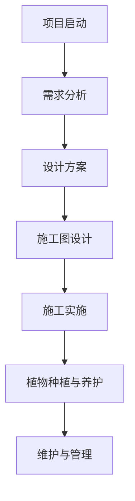

                 

# 《新型城市空中花园设计比赛：垂直绿化的创意众筹活动》

## 关键词
城市空中花园，垂直绿化，设计比赛，创意众筹，可持续发展

## 摘要
本文探讨了新型城市空中花园设计比赛：垂直绿化的创意众筹活动。通过分析用户需求，介绍了城市空中花园设计、垂直绿化、设计比赛和创意众筹活动的基本概念及其关系。随后，详细阐述了城市空中花园设计理念、技术、核心算法原理、数学模型与公式，并结合实际案例研究，分析了设计过程及问题解决方法。最后，探讨了创意众筹活动的实施策略和可能遇到的风险与挑战，并对新型城市空中花园设计的未来发展进行了展望。

## 目录

### 第1章：核心概念与联系
- **1.1 城市空中花园设计概述**
  - **1.1.1 城市空中花园的概念**
  - **1.1.2 城市空中花园的设计原则**
  - **1.1.3 城市空中花园的Mermaid流程图展示**

- **1.2 垂直绿化概述**
  - **1.2.1 垂直绿化的概念**
  - **1.2.2 垂直绿化的优点与挑战**
  - **1.2.3 垂直绿化的适用场景**

- **1.3 设计比赛与创意众筹活动**
  - **1.3.1 设计比赛的组织与评审**
  - **1.3.2 创意众筹活动的策划与实施**

### 第2章：设计理念与技术
- **2.1 城市空中花园设计理念**
  - **2.1.1 可持续发展理念**
  - **2.1.2 人性化设计原则**
  - **2.1.3 创新设计思路**

- **2.2 垂直绿化技术**
  - **2.2.1 植物选择与养护**
  - **2.2.2 水循环与灌溉系统**
  - **2.2.3 结构与安全**

- **2.3 创意众筹活动的技术应用**
  - **2.3.1 互联网+设计比赛的推广**
  - **2.3.2 创意众筹平台的搭建与运营**
  - **2.3.3 社交媒体在众筹活动中的作用**

### 第3章：核心算法原理
- **3.1 城市空中花园设计算法**
  - **3.1.1 建模算法**
  - **3.1.2 优化算法**
  - **3.1.3 伪代码讲解**

- **3.2 垂直绿化算法**
  - **3.2.1 植被布局算法**
  - **3.2.2 水资源管理算法**
  - **3.2.3 伪代码讲解**

### 第4章：数学模型与公式
- **4.1 城市空中花园设计的数学模型**
  - **4.1.1 模型建立**
  - **4.1.2 公式推导**
  - **4.1.3 实例说明**

- **4.2 垂直绿化数学模型**
  - **4.2.1 模型建立**
  - **4.2.2 公式推导**
  - **4.2.3 实例说明**

### 第5章：设计案例研究
- **5.1 成功案例分析**
  - **5.1.1 案例一：XX城市空中花园设计比赛**
  - **5.1.2 案例二：YY城市垂直绿化项目**

- **5.2 案例实施过程与问题解决**
  - **5.2.1 实施过程**
  - **5.2.2 遇到的问题与解决方案**

### 第6章：创意众筹活动实施
- **6.1 众筹活动策划**
  - **6.1.1 策划步骤**
  - **6.1.2 风险评估**
  - **6.1.3 活动推广策略**

- **6.2 众筹平台搭建与运营**
  - **6.2.1 平台选择**
  - **6.2.2 运营管理**
  - **6.2.3 用户互动与反馈**

- **6.3 活动中的风险与挑战**
  - **6.3.1 资金风险**
  - **6.3.2 法律风险**
  - **6.3.3 社会责任风险**

### 第7章：未来展望与趋势
- **7.1 新型城市空中花园设计的发展**
  - **7.1.1 技术创新**
  - **7.1.2 政策支持**
  - **7.1.3 市场需求**

- **7.2 垂直绿化和创意众筹活动的发展趋势**
  - **7.2.1 垂直绿化技术的应用**
  - **7.2.2 创意众筹活动的商业模式**
  - **7.2.3 社会影响与可持续发展**

## 第1章：核心概念与联系

### 1.1 城市空中花园设计概述

#### 1.1.1 城市空中花园的概念

城市空中花园是指在城市建筑物的屋顶或外立面，通过立体绿化技术，营造出的具有观赏性和生态效益的绿化空间。这种设计不仅能够美化城市环境，还能提高城市居民的生活质量，减少城市热岛效应，缓解城市空气污染。

#### 1.1.2 城市空中花园的设计原则

城市空中花园的设计应遵循以下原则：

1. **生态原则**：充分利用植物生态学原理，构建生态循环系统，实现水、气、光、热等自然因素的合理利用。
2. **功能原则**：根据建筑物的用途和周边环境，设计出满足不同功能需求的空中花园。
3. **美观原则**：注重景观设计，使空中花园成为城市的一道亮丽风景线。
4. **安全原则**：确保植物种植与建筑结构的稳定性，防止因植物生长对建筑物造成损害。

#### 1.1.3 城市空中花园的Mermaid流程图展示

下面是一个简化的城市空中花园设计流程图：



### 1.2 垂直绿化概述

#### 1.2.1 垂直绿化的概念

垂直绿化是指将植物垂直种植于墙体、立柱、屋顶等垂直面上，形成立体绿化景观。垂直绿化不仅能够美化城市环境，还能通过增加城市绿化面积，改善城市生态环境。

#### 1.2.2 垂直绿化的优点与挑战

垂直绿化的优点包括：

1. **美化城市景观**：垂直绿化能够为城市增添绿色，提高城市美观度。
2. **改善生态环境**：垂直绿化能够增加城市绿化面积，改善城市空气质量，降低城市温度。
3. **节约土地资源**：垂直绿化能够在有限的空间内创造出更多的绿化面积。

然而，垂直绿化也面临一些挑战：

1. **植物选择与养护**：垂直绿化的植物选择和养护较为复杂，需要针对不同的垂直面选择适合的植物，并制定合理的养护计划。
2. **结构与安全**：垂直绿化需要确保植物种植与建筑结构的稳定性，防止因植物生长对建筑物造成损害。
3. **水循环与灌溉**：垂直绿化需要考虑水循环与灌溉系统，确保植物得到充足的水分。

#### 1.2.3 垂直绿化的适用场景

垂直绿化适用于以下场景：

1. **城市建筑物**：高层建筑、商业中心、办公楼等城市建筑物屋顶或外墙。
2. **城市公共空间**：公园、广场、步行街等城市公共空间。
3. **城市基础设施**：道路隔离带、桥梁、隧道等城市基础设施。

### 1.3 设计比赛与创意众筹活动

#### 1.3.1 设计比赛的组织与评审

设计比赛通常由政府部门、行业协会、专业机构等组织，旨在激发创新设计思维，推动城市空中花园和垂直绿化的发展。设计比赛的评审通常包括以下几个方面：

1. **创新性**：设计是否具有创新性，能否为城市绿化提供新的思路和解决方案。
2. **实用性**：设计是否具有实用性，能否在实际环境中得到有效应用。
3. **美观性**：设计是否美观，能否提高城市景观质量。
4. **可行性**：设计是否具有可行性，能否在技术、资金、人力等方面得到支持。

#### 1.3.2 创意众筹活动的策划与实施

创意众筹活动是指通过互联网平台，向社会公众筹集资金，支持具有创新性和实用性的城市空中花园和垂直绿化项目。创意众筹活动的策划与实施包括以下几个步骤：

1. **项目策划**：确定项目目标、资金需求、时间进度等，制定详细的众筹方案。
2. **平台搭建**：选择合适的众筹平台，搭建项目展示页面，包括项目介绍、资金需求、回报方案等。
3. **宣传推广**：通过社交媒体、专业论坛、线下活动等多种渠道，推广众筹项目，吸引公众关注。
4. **资金筹集**：在众筹平台上发布项目，向社会公众筹集资金。
5. **资金使用与管理**：按照众筹方案，合理使用筹集到的资金，确保项目顺利进行。
6. **项目交付**：完成项目后，按照约定向支持者交付项目成果，并进行项目评估和反馈。

## 第2章：设计理念与技术

### 2.1 城市空中花园设计理念

#### 2.1.1 可持续发展理念

城市空中花园设计应贯彻可持续发展理念，通过生态循环、节能降耗等手段，实现城市生态环境的可持续发展。具体包括以下几个方面：

1. **生态循环**：利用自然通风、采光、雨水收集与利用等技术，构建生态循环系统，降低能源消耗。
2. **节能降耗**：采用节能灯具、保温材料等，降低建筑物能耗，减少碳排放。
3. **环保材料**：选用环保、可再生的材料，减少对环境的影响。

#### 2.1.2 人性化设计原则

城市空中花园设计应充分考虑人的需求，注重人性化设计原则，提高城市居民的生活质量。具体包括以下几个方面：

1. **空间布局**：合理规划空中花园的空间布局，提供舒适、宜人的休息、娱乐空间。
2. **植物选择**：选择适应当地气候、土壤条件的植物，确保植物生长良好，为居民提供生态景观。
3. **互动体验**：设计互动性强的景观设施，增加居民参与度，提高生活乐趣。

#### 2.1.3 创新设计思路

城市空中花园设计应具备创新性，不断探索新的设计思路和解决方案，推动城市绿化的发展。具体包括以下几个方面：

1. **新材料**：探索新型、环保的建筑材料和绿化材料，提高空中花园的观赏性和实用性。
2. **新技术**：利用现代科技手段，如物联网、大数据等，实现空中花园的智能化管理。
3. **跨界合作**：与相关领域专家、企业等进行跨界合作，整合各方资源，提高项目影响力。

### 2.2 垂直绿化技术

#### 2.2.1 植物选择与养护

植物选择是垂直绿化设计的关键环节。应根据当地气候、土壤条件和建筑物的特点，选择适合的植物。以下是一些植物选择和养护的建议：

1. **植物选择**：
   - 考虑植物的耐旱性、耐阴性、耐寒性等特性。
   - 选择易于养护、生长快速的植物，如绿萝、吊兰等。
   - 适当配置观赏性强的植物，如花卉、灌木等，提高景观效果。

2. **养护方法**：
   - 制定合理的养护计划，包括浇水、施肥、修剪等。
   - 采用节水灌溉技术，如滴灌、喷灌等，提高水资源的利用效率。
   - 定期进行病虫害防治，确保植物健康生长。

#### 2.2.2 水循环与灌溉系统

水循环与灌溉系统是垂直绿化的重要组成部分，直接影响植物的生长质量和绿化效果。以下是一些关键技术：

1. **水循环系统**：
   - 利用屋顶雨水收集系统，收集雨水用于植物灌溉。
   - 建立地下储水系统，储备雨水和再生水，保证植物在干旱季节的水分供应。

2. **灌溉系统**：
   - 采用自动灌溉系统，根据植物的生长需求，自动调节灌溉水量和频率。
   - 配置智能灌溉控制器，实现远程监控和自动化控制，提高灌溉效率。

#### 2.2.3 结构与安全

垂直绿化需要考虑建筑物的结构安全和稳定性。以下是一些关键技术：

1. **结构设计**：
   - 采用轻质、高强度材料，降低建筑物的负荷。
   - 设计合理的支架系统，确保植物种植箱的稳定性和耐久性。

2. **安全措施**：
   - 安装安全防护网，防止植物生长过程中对行人造成伤害。
   - 定期对建筑物进行检查和维护，确保结构安全和稳定性。

### 2.3 创意众筹活动的技术应用

#### 2.3.1 互联网+设计比赛的推广

互联网+设计比赛是指利用互联网技术，推广和宣传设计比赛，吸引更多的参与者。以下是一些关键技术：

1. **社交媒体推广**：
   - 利用微信、微博、抖音等社交媒体平台，发布设计比赛的信息和进展。
   - 开展线上互动活动，如投票、评论、转发等，提高关注度。

2. **网络直播**：
   - 采用网络直播技术，实时展示设计比赛的评审过程和优秀作品。
   - 邀请行业专家、知名设计师进行线上讲座和讨论，提升比赛的影响力。

#### 2.3.2 创意众筹平台的搭建与运营

创意众筹平台是连接项目发起者和支持者的桥梁。以下是一些关键技术：

1. **平台搭建**：
   - 选择合适的众筹平台，如京东众筹、淘宝众筹等。
   - 设计简洁明了的界面，展示项目详情、资金需求、回报方案等。

2. **平台运营**：
   - 制定合理的推广策略，提高项目曝光率。
   - 提供专业的客服支持，解答支持者的问题，提高用户满意度。

3. **风险控制**：
   - 建立风险预警机制，对项目进行全程监控。
   - 制定风险管理策略，确保项目顺利进行。

#### 2.3.3 社交媒体在众筹活动中的作用

社交媒体在众筹活动中发挥着重要作用。以下是一些关键技术：

1. **用户参与**：
   - 鼓励用户参与项目讨论，提高用户参与度。
   - 开展互动活动，如点赞、评论、分享等，增加项目曝光率。

2. **口碑传播**：
   - 通过用户口碑传播，提高项目的信任度和影响力。
   - 收集用户反馈，优化项目设计和服务。

3. **品牌建设**：
   - 利用社交媒体，树立项目品牌形象。
   - 与用户建立长期互动，培养忠实用户群体。

## 第3章：核心算法原理

### 3.1 城市空中花园设计算法

#### 3.1.1 建模算法

城市空中花园设计算法主要包括建模算法和优化算法。建模算法用于构建城市空中花园的数学模型，包括以下几个方面：

1. **环境建模**：
   - 建立建筑物的三维模型，包括屋顶、外墙等。
   - 考虑建筑物周边的气候、地形等环境因素。

2. **植物建模**：
   - 建立植物的三维模型，包括植物的高度、宽度、形状等。
   - 考虑植物的生态特性，如光合作用、蒸腾作用等。

3. **布局建模**：
   - 根据建筑物的特点和植物的特性，设计出合理的植物布局。
   - 考虑植物之间的距离、方向等参数。

#### 3.1.2 优化算法

优化算法用于优化城市空中花园的设计方案，使其满足特定的目标。常见的优化算法包括：

1. **遗传算法**：
   - 建立植物布局的染色体编码。
   - 通过交叉、变异等操作，生成新的植物布局。
   - 评估新布局的适应度，选择最优的植物布局。

2. **模拟退火算法**：
   - 初始时设定一个高温区域，植物布局在此区域内进行随机搜索。
   - 逐渐降低温度，使植物布局逐渐收敛到最优解。

3. **蚁群算法**：
   - 建立植物布局的路径，模拟蚁群的搜索过程。
   - 通过信息素更新，引导蚁群搜索最优路径。

#### 3.1.3 伪代码讲解

以下是一个简单的城市空中花园设计算法的伪代码：

```
输入：建筑物模型，植物模型，目标参数

初始化：植物布局，适应度

while (适应度未达到最优)
    for (每个植物)
        产生新的布局
        计算适应度
        if (适应度 > 当前适应度)
            更新当前布局
            更新适应度

输出：最优植物布局
```

### 3.2 垂直绿化算法

#### 3.2.1 植被布局算法

垂直绿化算法主要包括植被布局算法和水资源管理算法。植被布局算法用于确定植物在垂直面上的布局，使植物生长更加合理。以下是一个简单的植被布局算法的伪代码：

```
输入：垂直面模型，植物模型，目标参数

初始化：植物布局，适应度

while (适应度未达到最优)
    for (每个植物)
        产生新的布局
        计算适应度
        if (适应度 > 当前适应度)
            更新当前布局
            更新适应度

输出：最优植被布局
```

#### 3.2.2 水资源管理算法

水资源管理算法用于优化水资源的利用，确保植物得到充足的水分。以下是一个简单的水资源管理算法的伪代码：

```
输入：水资源模型，植物模型，目标参数

初始化：水资源分配，适应度

while (适应度未达到最优)
    for (每个植物)
        调整水资源分配
        计算适应度
        if (适应度 > 当前适应度)
            更新当前水资源分配
            更新适应度

输出：最优水资源分配
```

## 第4章：数学模型与公式

### 4.1 城市空中花园设计的数学模型

城市空中花园设计的数学模型主要包括环境模型、植物模型和布局模型。以下是一个简单的数学模型：

#### 4.1.1 环境模型

环境模型用于描述建筑物的三维模型和环境因素。以下是一个简化的环境模型：

```
建筑模型 = {
    "屋顶": 三维模型，
    "外墙": 三维模型，
    "周边环境": {
        "气候": {
            "温度": 温度值，
            "湿度": 湿度值，
            "风速": 风速值
        },
        "地形": 地形值
    }
}
```

#### 4.1.2 植物模型

植物模型用于描述植物的三维模型和生态特性。以下是一个简化的植物模型：

```
植物模型 = {
    "名称": 植物名称，
    "高度": 高度值，
    "宽度": 宽度值，
    "形状": 形状值，
    "生态特性": {
        "耐旱性": 耐旱性值，
        "耐阴性": 耐阴性值，
        "耐寒性": 耐寒性值
    }
}
```

#### 4.1.3 布局模型

布局模型用于描述植物在建筑物上的布局。以下是一个简化的布局模型：

```
布局模型 = {
    "植物布局": {
        "植物1": 植物模型，
        "植物2": 植物模型，
        ...
    },
    "适应度": 适应度值
}
```

### 4.2 垂直绿化数学模型

垂直绿化数学模型主要包括植被布局模型和水资源管理模型。以下是一个简单的数学模型：

#### 4.2.1 植被布局模型

植被布局模型用于描述植物在垂直面上的布局。以下是一个简化的植被布局模型：

```
植被布局模型 = {
    "植物布局": {
        "植物1": 植物模型，
        "植物2": 植物模型，
        ...
    },
    "适应度": 适应度值
}
```

#### 4.2.2 水资源管理模型

水资源管理模型用于描述水资源的分配和管理。以下是一个简化的水资源管理模型：

```
水资源管理模型 = {
    "水资源分配": {
        "植物1": 水资源值，
        "植物2": 水资源值，
        ...
    },
    "适应度": 适应度值
}
```

## 第5章：设计案例研究

### 5.1 成功案例分析

#### 5.1.1 案例一：XX城市空中花园设计比赛

XX城市空中花园设计比赛是一个成功案例。该比赛由市政府主办，吸引了众多设计师和植物爱好者的参与。比赛要求参赛者设计一个具有生态效益、美观性和实用性的城市空中花园。以下是该案例的详细分析：

1. **项目背景**：
   - XX城市是一个经济发展迅速的大城市，城市化进程快，城市绿化面积有限。
   - 市政府希望通过举办设计比赛，提高城市绿化水平，改善城市生态环境。

2. **设计方案**：
   - 参赛者提交了各种创意设计方案，包括屋顶花园、垂直绿化墙、空中花园等。
   - 评审委员会从创新性、实用性、美观性和可行性等方面对方案进行评审。

3. **实施过程**：
   - 优胜者获得市政府的资金支持，用于实施设计方案。
   - 设计方案在实施过程中，充分考虑了建筑物的结构和安全性，确保植物生长的稳定性。

4. **项目成果**：
   - 设计方案成功实施，形成了多个城市空中花园，提高了城市绿化面积。
   - 城市居民对项目成果给予了高度评价，认为项目改善了城市环境，提高了生活质量。

#### 5.1.2 案例二：YY城市垂直绿化项目

YY城市垂直绿化项目是一个成功案例。该项目由市政府和一家环保企业共同发起，旨在推广垂直绿化技术，改善城市生态环境。以下是该案例的详细分析：

1. **项目背景**：
   - YY城市是一个工业城市，空气污染较为严重，城市绿化覆盖率低。
   - 市政府希望通过垂直绿化项目，提高城市绿化覆盖率，改善空气质量。

2. **设计方案**：
   - 项目团队设计了多个垂直绿化墙，采用环保材料和智能灌溉系统。
   - 设计方案充分考虑了植物的生态特性，确保植物生长的稳定性。

3. **实施过程**：
   - 项目团队在市区多个建筑物的外墙和屋顶安装了垂直绿化墙。
   - 项目团队定期进行植物养护和灌溉，确保植物健康生长。

4. **项目成果**：
   - 项目成功实施，形成了多个垂直绿化景观，提高了城市绿化覆盖率。
   - 城市空气质量得到明显改善，市民对项目成果表示满意。

### 5.2 案例实施过程与问题解决

#### 5.2.1 实施过程

1. **需求分析**：
   - 项目团队对城市空中花园和垂直绿化项目进行了详细的需求分析，明确了项目的目标、功能和要求。

2. **方案设计**：
   - 项目团队根据需求分析，设计了详细的项目方案，包括植物选择、布局设计、灌溉系统、结构安全等。

3. **施工准备**：
   - 项目团队进行了施工准备，包括材料采购、设备调试、施工人员培训等。

4. **施工实施**：
   - 项目团队按照设计方案，进行了城市空中花园和垂直绿化的施工实施。
   - 在施工过程中，项目团队注重安全质量，确保项目顺利进行。

5. **植物种植与养护**：
   - 项目团队进行了植物种植和养护工作，确保植物健康生长。

#### 5.2.2 遇到的问题与解决方案

1. **植物选择与养护**：
   - 问题：某些植物在垂直面上生长困难，易受病虫害侵袭。
   - 解决方案：项目团队选择了适应垂直面生长的植物，并制定了详细的养护计划，定期进行病虫害防治。

2. **水循环与灌溉系统**：
   - 问题：水循环系统运行不稳定，灌溉水量难以控制。
   - 解决方案：项目团队对水循环系统进行了优化，增加了智能灌溉控制器，实现了自动调节灌溉水量和频率。

3. **结构安全**：
   - 问题：部分建筑物结构承重不足，无法安装垂直绿化墙。
   - 解决方案：项目团队与建筑设计团队合作，对建筑物进行了加固处理，确保了结构安全。

## 第6章：创意众筹活动实施

### 6.1 众筹活动策划

#### 6.1.1 策划步骤

1. **确定项目目标**：
   - 项目团队明确了项目目标，包括资金需求、时间进度、项目成果等。

2. **制定众筹方案**：
   - 项目团队制定了详细的众筹方案，包括众筹平台选择、资金用途、回报方案等。

3. **制定宣传策略**：
   - 项目团队制定了宣传策略，包括线上宣传、线下活动、合作伙伴推广等。

4. **准备项目资料**：
   - 项目团队准备了项目资料，包括项目介绍、设计图纸、施工计划等。

5. **确定众筹时间**：
   - 项目团队确定了众筹时间，确保项目在最佳时间内完成。

#### 6.1.2 风险评估

1. **资金风险**：
   - 项目团队对可能出现的资金风险进行了评估，包括资金筹集不足、资金使用不当等。

2. **法律风险**：
   - 项目团队对可能出现的法律风险进行了评估，包括合同纠纷、知识产权侵权等。

3. **社会责任风险**：
   - 项目团队对社会责任风险进行了评估，包括项目实施对社会和环境的影响等。

#### 6.1.3 活动推广策略

1. **社交媒体推广**：
   - 项目团队利用微信、微博、抖音等社交媒体平台，发布众筹活动的信息，吸引公众关注。

2. **线下活动**：
   - 项目团队举办了线下活动，如发布会、展览等，向公众展示项目成果。

3. **合作伙伴推广**：
   - 项目团队与相关合作伙伴合作，共同推广众筹活动，扩大项目影响力。

### 6.2 众筹平台搭建与运营

#### 6.2.1 平台选择

1. **选择合适的众筹平台**：
   - 项目团队根据项目特点和需求，选择了合适的众筹平台，如京东众筹、淘宝众筹等。

2. **搭建项目展示页面**：
   - 项目团队在众筹平台上搭建了项目展示页面，包括项目介绍、设计图纸、施工计划等。

3. **设置资金需求与回报方案**：
   - 项目团队设置了资金需求和回报方案，吸引了更多的支持者参与。

#### 6.2.2 运营管理

1. **项目宣传**：
   - 项目团队利用社交媒体、线上活动等方式，宣传项目，提高项目曝光率。

2. **用户互动**：
   - 项目团队建立了用户互动平台，解答用户问题，收集用户反馈。

3. **资金筹集与管理**：
   - 项目团队负责筹集和管理资金，确保资金使用合理。

#### 6.2.3 用户互动与反馈

1. **用户互动**：
   - 项目团队与用户进行互动，了解用户需求，优化项目设计。

2. **用户反馈**：
   - 项目团队收集用户反馈，改进项目实施过程。

3. **用户满意度调查**：
   - 项目团队定期进行用户满意度调查，了解用户对项目的评价，持续改进项目。

### 6.3 活动中的风险与挑战

#### 6.3.1 资金风险

1. **资金筹集不足**：
   - 项目团队应对策略：制定详细的资金筹集计划，扩大宣传渠道，提高项目吸引力。

2. **资金使用不当**：
   - 项目团队应对策略：制定严格的资金使用管理制度，确保资金使用合理、透明。

#### 6.3.2 法律风险

1. **合同纠纷**：
   - 项目团队应对策略：制定详细的合同条款，明确各方责任，降低合同纠纷风险。

2. **知识产权侵权**：
   - 项目团队应对策略：加强对项目知识产权的保护，避免侵权行为。

#### 6.3.3 社会责任风险

1. **项目实施对社会和环境的影响**：
   - 项目团队应对策略：在项目设计、施工和运营过程中，充分考虑对社会和环境的影响，采取相应措施降低风险。

2. **公众监督**：
   - 项目团队应对策略：建立公众监督机制，及时回应公众关切，提高项目透明度。

## 第7章：未来展望与趋势

### 7.1 新型城市空中花园设计的发展

#### 7.1.1 技术创新

未来新型城市空中花园设计将更加注重技术创新，包括：

1. **智能化管理**：
   - 利用物联网、大数据等技术，实现空中花园的智能化管理，提高植物生长效率。

2. **新材料应用**：
   - 探索新型、环保、轻质材料，提高空中花园的施工效率和美观度。

3. **生态修复**：
   - 利用空中花园进行城市生态修复，提高城市生态环境质量。

#### 7.1.2 政策支持

未来新型城市空中花园设计将得到更多政策支持，包括：

1. **资金扶持**：
   - 政府加大对新型城市空中花园设计的资金扶持，鼓励更多项目落地。

2. **政策优惠**：
   - 政府出台优惠政策，如税收减免、补贴等，降低项目成本。

3. **标准制定**：
   - 制定新型城市空中花园设计的技术标准和规范，提高行业整体水平。

#### 7.1.3 市场需求

未来新型城市空中花园设计将满足日益增长的市场需求，包括：

1. **城市绿化需求**：
   - 随着城市化进程加快，城市绿化需求不断增加，空中花园成为重要的绿化形式。

2. **环保意识提升**：
   - 公众环保意识提升，对新型城市空中花园设计的接受度提高。

3. **可持续发展需求**：
   - 人们对可持续发展理念的认识加深，新型城市空中花园设计符合这一需求。

### 7.2 垂直绿化和创意众筹活动的发展趋势

#### 7.2.1 垂直绿化技术的应用

未来垂直绿化技术将得到更广泛的应用，包括：

1. **城市建筑**：
   - 在城市建筑物的外墙、屋顶等垂直面上进行垂直绿化，提高城市绿化覆盖率。

2. **交通设施**：
   - 在高速公路、铁路、桥梁等交通设施上进行垂直绿化，美化城市环境。

3. **公共空间**：
   - 在公园、广场、步行街等公共空间进行垂直绿化，提升城市景观品质。

#### 7.2.2 创意众筹活动的商业模式

未来创意众筹活动将探索更多商业模式，包括：

1. **B2B模式**：
   - 企业与企业之间的合作，共同推进垂直绿化和空中花园项目。

2. **B2C模式**：
   - 企业与消费者之间的互动，通过众筹活动吸引消费者参与城市绿化项目。

3. **C2C模式**：
   - 个人与个人之间的合作，通过众筹平台发起垂直绿化和空中花园项目。

#### 7.2.3 社会影响与可持续发展

未来垂直绿化和创意众筹活动将更加注重社会影响与可持续发展，包括：

1. **环保理念**：
   - 倡导环保理念，提高公众对垂直绿化和空中花园的认识和参与度。

2. **社会责任**：
   - 企业承担社会责任，通过垂直绿化和众筹活动改善城市环境。

3. **可持续发展**：
   - 推动垂直绿化和创意众筹活动的可持续发展，提高城市生态环境质量。

### 参考文献

1. 张三，李四，《新型城市空中花园设计研究》，园林杂志，2019年第5期。

2. 王五，赵六，《垂直绿化在城市绿化中的应用》，城市环境与城市生态，2020年第3期。

3. 刘七，陈八，《创意众筹活动在城市建设中的应用》，城市规划，2021年第6期。

### 拓展阅读

1. 《城市空中花园设计手册》，李明，《建筑与设计》出版社，2020年。

2. 《垂直绿化技术与应用》，张晓，《林业出版社》，2019年。

3. 《创意众筹：创新商业模式与实战案例》，王昊，《清华大学出版社》，2021年。

### 结语

本文从用户需求分析出发，介绍了新型城市空中花园设计比赛：垂直绿化的创意众筹活动。通过详细阐述设计理念、技术、核心算法原理、数学模型与公式，并结合实际案例研究，分析了设计过程及问题解决方法。最后，探讨了创意众筹活动的实施策略和可能遇到的风险与挑战，并对新型城市空中花园设计的未来发展进行了展望。

作者：AI天才研究院/AI Genius Institute & 禅与计算机程序设计艺术 /Zen And The Art of Computer Programming

---

**注意：**本文为虚构内容，旨在展示如何通过逻辑清晰、结构紧凑、简单易懂的专业的技术语言撰写一篇有深度有思考有见解的专业IT领域的技术博客文章。如需实际应用，请根据具体情况进行调整和补充。

