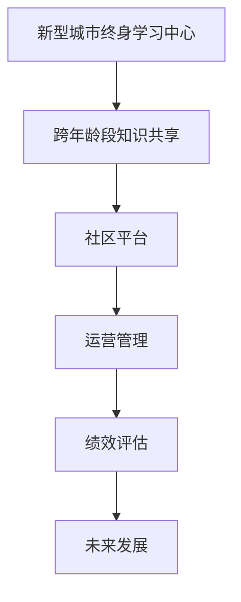

                 

### 《新型城市终身学习中心：跨年龄段知识共享的社区平台》

#### 关键词

- 新型城市终身学习中心
- 跨年龄段知识共享
- 社区平台
- 用户导向
- 数据分析与反馈
- 教育信息化
- 持续运营

#### 摘要

本文探讨了新型城市终身学习中心的发展背景、核心概念与联系，以及其在跨年龄段知识共享中的关键作用。通过详细分析社区平台的设计原则、功能模块、技术实现和运营管理策略，本文提出了一个结构紧凑、用户导向的社区平台方案。同时，文章还探讨了新型城市终身学习中心的未来发展机遇与挑战，为相关领域的研究和实践提供了有价值的参考。

## 第一部分：终身学习中心的背景与重要性

### 第1章：新型城市终身学习中心的兴起

#### 1.1 新型城市终身学习中心的发展背景

1.1.1 全球教育发展趋势

随着全球化和信息技术的快速发展，教育形式和需求也在不断演变。传统教育体系越来越难以满足个体化和多样化的学习需求，终身教育逐渐成为全球教育发展的趋势。终身教育不仅仅是在学校教育的延伸，更是一种贯穿人一生、适应社会发展的学习方式。这种教育观念的转变，推动了新型城市终身学习中心的兴起。

1.1.2 城市化进程中的教育需求

城市化进程加速，城市人口比例逐年增加，城市中的教育需求也呈现出新的特点。城市居民对知识更新的速度要求更高，对个性化教育和终身学习的需求更加迫切。同时，城市化带来的社会结构变化，如人口老龄化、家庭结构多样化等，也对终身学习中心提出了新的要求。新型城市终身学习中心正是在这样的背景下应运而生。

1.1.3 终身教育的理念

终身教育是一种贯穿人一生、不断学习和适应社会发展的教育理念。它强调学习不仅仅是在学校进行，而是贯穿于人们的工作、生活和社交活动之中。终身教育理念的核心在于学习不再是一次性的任务，而是持续的、终身的过程。这种教育理念推动了新型城市终身学习中心的发展，使其成为城市居民终身学习的重要平台。

#### 1.2 新型城市终身学习中心的定义与特征

1.2.1 定义与范畴

新型城市终身学习中心是一种综合性的教育服务机构，旨在为城市居民提供多样化的学习资源和服务，促进跨年龄段的知识共享与终身学习。它不仅包括传统的教育内容，还涵盖了职业技能培训、文化艺术活动、健康养生讲座等多个方面。新型城市终身学习中心的服务对象是全体城市居民，特别是那些需要终身学习和更新的成年人。

1.2.2 主要特征

新型城市终身学习中心具有以下主要特征：

1. **综合性**：提供多样化的学习资源和服务，满足不同年龄段、不同兴趣爱好的城市居民的需求。
2. **灵活性**：学习形式灵活多样，包括线上课程、线下活动、工作坊等，适应城市居民的时间安排和生活方式。
3. **互动性**：注重用户参与和互动，鼓励城市居民之间分享知识和经验，形成学习共同体。
4. **可持续性**：通过社区参与和资源共享，实现可持续发展，为城市居民提供长期稳定的学习环境。

1.2.3 对比传统学习中心

新型城市终身学习中心与传统学习中心相比，具有以下优势：

1. **服务范围更广**：传统学习中心主要针对学校教育和职业技能培训，而新型城市终身学习中心涵盖更广泛的教育内容，包括终身学习、文化艺术、健康养生等。
2. **学习形式更灵活**：传统学习中心多以课堂教学为主，而新型城市终身学习中心提供多样化的学习形式，如线上课程、工作坊、讲座等，适应城市居民的不同需求。
3. **社区参与度更高**：新型城市终身学习中心注重社区参与，鼓励居民分享知识和经验，形成学习共同体，提高社区凝聚力。

#### 1.3 新型城市终身学习中心的重要性

1.3.1 促进知识共享

新型城市终身学习中心通过提供多样化的学习资源和服务，促进城市居民之间的知识共享。居民可以在学习中心分享自己的知识和经验，同时学习他人的知识和技能，实现知识的多向流通和共享。这种知识共享有助于提高城市居民的整体素质和能力，推动社会的进步和发展。

1.3.2 增强社区凝聚力

新型城市终身学习中心不仅是一个学习平台，还是一个社区互动和交流的场所。通过组织各类活动和课程，学习中心可以促进居民之间的互动和交流，增强社区凝聚力。居民可以在学习中心结识志同道合的朋友，分享彼此的生活经历和感悟，形成更加紧密的社区关系。

1.3.3 推动社会经济发展

新型城市终身学习中心有助于提高城市居民的职业技能和素质，推动社会经济的发展。通过提供职业技能培训和文化艺术讲座等课程，学习中心可以为城市居民提供更多的就业和发展机会。同时，学习中心还可以吸引外部资源和投资，推动地方经济的发展。

## 第二部分：跨年龄段知识共享的理论与实践

### 第2章：跨年龄段知识共享的理论基础

#### 2.1 跨年龄段知识共享的概念与内涵

2.1.1 跨年龄段知识共享的定义

跨年龄段知识共享是指不同年龄段的个体之间通过相互学习和交流，实现知识和经验的传递和共享。它强调不同年龄段个体之间的互动和学习，打破年龄界限，促进知识的多向流动和共享。跨年龄段知识共享不仅仅是在教育领域，还涵盖了社会、职业、文化等多个层面。

2.1.2 跨年龄段知识共享的内涵

跨年龄段知识共享的内涵可以从以下几个方面来理解：

1. **多样性**：不同年龄段的个体具有不同的知识背景、经验和技能，跨年龄段知识共享可以实现多样性的知识和经验交流。
2. **互动性**：跨年龄段知识共享强调个体之间的互动和交流，通过对话、讨论、实践等方式，实现知识的共享和传递。
3. **发展性**：跨年龄段知识共享有助于个体的成长和发展，不同年龄段的个体可以在知识共享过程中相互学习和成长。
4. **社会性**：跨年龄段知识共享不仅仅是个体的学习过程，也是社会互动和社会关系构建的重要方式。

2.1.3 跨年龄段知识共享的意义

跨年龄段知识共享具有以下几个方面的意义：

1. **促进知识流动**：跨年龄段知识共享有助于促进知识和信息的流动，打破年龄界限，实现知识的共享和传播。
2. **提高学习效果**：不同年龄段的个体之间相互学习和交流，可以提供多样化的学习资源和视角，提高学习效果和效率。
3. **促进社会和谐**：跨年龄段知识共享有助于促进社会和谐，通过知识和经验的共享，不同年龄段个体可以更好地理解和尊重彼此，增强社会的凝聚力和包容性。

#### 2.2 跨年龄段知识共享的理论框架

2.2.1 社会资本理论

社会资本理论认为，社会资本是影响社会互动和个体发展的关键因素。社会资本包括信任、网络、规范等，可以通过促进个体之间的互动和合作，提高社会的整体效能。跨年龄段知识共享正是基于社会资本理论，通过建立和加强社会资本，促进个体之间的知识共享和合作。

2.2.2 学习共同体理论

学习共同体理论认为，学习是一个社会互动的过程，个体在学习过程中形成共同体，共同分享知识和经验。跨年龄段知识共享正是基于学习共同体理论，通过不同年龄段的个体之间的互动和合作，形成学习共同体，实现知识的多向流动和共享。

2.2.3 社区心理学理论

社区心理学理论认为，社区是影响个体行为和心理的重要因素。跨年龄段知识共享正是基于社区心理学理论，通过在社区内建立知识共享的平台和机制，促进个体之间的互动和合作，实现知识共享和社区发展。

#### 2.3 跨年龄段知识共享的实践案例

2.3.1 国际上的成功案例

1. **美国社区学院**：美国社区学院通过提供多样化的课程和活动，促进不同年龄段的学生之间的知识共享和互动。学院通过组织讲座、研讨会、社区服务等活动，鼓励学生分享知识和经验，形成学习共同体。
2. **英国社区图书馆**：英国社区图书馆不仅提供图书借阅服务，还举办各类知识分享活动，如讲座、读书会等。不同年龄段的居民可以在图书馆内分享知识和经验，促进社区的互动和凝聚力。

2.3.2 国内的发展现状

1. **社区教育中心**：国内许多城市建立了社区教育中心，提供各类知识分享课程和活动。社区教育中心通过组织讲座、培训、读书会等活动，促进居民之间的知识共享和互动。
2. **社区大学**：一些城市开始建立社区大学，为社区居民提供多样化的学习资源和课程。社区大学通过组织课程、讲座、实践活动等，鼓励居民分享知识和经验，推动社区的终身学习。

2.3.3 跨年龄段知识共享实践的效果评估

1. **知识共享程度**：通过问卷调查和访谈，评估居民参与知识共享活动的频率和深度，了解居民对知识共享的满意度。
2. **学习效果**：通过学习成果评估，了解参与知识共享活动的居民在学习过程中的收获和成长。
3. **社区凝聚力**：通过居民互动和社区活动的参与度，评估跨年龄段知识共享对社区凝聚力的影响。

#### 2.4 跨年龄段知识共享的挑战与应对策略

2.4.1 挑战

1. **年龄差异**：不同年龄段的个体在知识水平、兴趣爱好、学习方式等方面存在较大差异，可能影响知识共享的效果。
2. **文化差异**：不同文化背景的个体在知识共享过程中可能存在文化差异，需要加强文化理解和沟通。
3. **技术障碍**：一些居民可能对新技术不熟悉，影响他们的参与度和知识共享的效果。

2.4.2 应对策略

1. **多样化活动设计**：根据不同年龄段和兴趣爱好的居民需求，设计多样化的知识共享活动，提高参与度和互动性。
2. **文化融合**：在知识共享活动中，加强文化教育和交流，促进不同文化背景的居民之间的理解和融合。
3. **技术支持**：提供技术培训和指导，帮助居民熟悉新技术，提高他们的参与度和知识共享的效果。

### 第三部分：社区平台设计与实施

#### 第3章：新型城市终身学习中心的社区平台设计

#### 3.1 社区平台的设计原则

3.1.1 用户导向

用户导向是社区平台设计的核心原则，旨在满足用户需求，提供个性化的服务和体验。设计过程中，需要深入了解用户的特点、需求和期望，从用户的角度出发，优化平台的界面、功能和服务流程。以下是一些具体的设计策略：

1. **用户调研**：通过问卷调查、访谈等方式，了解用户的需求和偏好，为平台设计提供依据。
2. **用户体验**：在设计过程中，注重用户体验，简化操作流程，提供直观、易用的界面。
3. **个性化推荐**：利用大数据和人工智能技术，根据用户的历史行为和偏好，提供个性化的学习资源和活动推荐。

3.1.2 互动性

互动性是社区平台的重要特征，通过用户之间的互动，促进知识共享和社区发展。以下是一些具体的设计策略：

1. **社交功能**：集成社交功能，如用户头像、好友关系、评论和点赞等，鼓励用户之间的互动和交流。
2. **互动活动**：组织线上和线下互动活动，如讲座、研讨会、工作坊等，提供多样化的互动平台。
3. **互动反馈**：及时收集用户对平台和活动的反馈，优化平台功能和用户体验。

3.1.3 可持续发展

可持续发展是社区平台设计的长期目标，旨在确保平台的长期稳定运营和持续发展。以下是一些具体的设计策略：

1. **资源整合**：通过整合各类学习资源，提高资源的利用效率，降低运营成本。
2. **社区参与**：鼓励社区成员积极参与平台建设和运营，提高平台的社区凝聚力。
3. **技术升级**：定期进行技术升级和维护，确保平台的稳定性和安全性。

#### 3.2 社区平台的功能模块

3.2.1 课程与活动发布

课程与活动发布模块是社区平台的核心功能，旨在提供丰富的学习资源和活动信息，满足用户的需求。以下是一些具体的设计策略：

1. **课程分类**：根据用户需求和学习兴趣，对课程进行分类，方便用户查找和选择。
2. **活动预告**：及时发布各类活动的预告信息，包括时间、地点、主题等，方便用户提前了解和参与。
3. **活动报名**：提供活动报名功能，用户可以通过平台报名参加感兴趣的活动。

3.2.2 成果展示与交流

成果展示与交流模块旨在为用户提供一个展示自己学习成果和交流经验的平台，促进知识共享和社区发展。以下是一些具体的设计策略：

1. **作品展示**：提供用户作品展示区，用户可以上传自己的学习成果，如文章、绘画、编程项目等。
2. **评论与点赞**：用户可以对展示的作品进行评论和点赞，鼓励用户之间的互动和交流。
3. **交流论坛**：建立交流论坛，用户可以在论坛中发布问题和分享经验，促进知识和经验的交流。

3.2.3 会员管理与激励机制

会员管理与激励机制模块旨在提高用户的参与度和积极性，通过会员制度和激励机制，鼓励用户积极参与社区平台的活动和互动。以下是一些具体的设计策略：

1. **会员等级**：根据用户的学习进度和参与度，设立不同等级的会员，提供相应的权益和服务。
2. **积分制度**：设立积分制度，用户可以通过参与活动、发表作品、评论等获取积分，积分可以兑换礼品或参加特别活动。
3. **奖励机制**：定期举办奖励活动，对积极参与社区平台的用户进行表彰和奖励，提高用户的参与积极性。

3.2.4 数据分析与反馈

数据分析与反馈模块旨在通过对用户行为数据的分析，了解用户需求和行为模式，为平台优化和运营提供数据支持。以下是一些具体的设计策略：

1. **数据收集**：收集用户在平台上的行为数据，如课程参与、活动参与、作品发布等。
2. **数据分析**：利用大数据和人工智能技术，对用户行为数据进行分析，发现用户需求和偏好。
3. **反馈机制**：将分析结果反馈给用户，提供个性化的推荐和建议，优化用户体验。

#### 3.3 社区平台的技术实现

3.3.1 服务器与存储

服务器与存储是社区平台的基础设施，负责数据的存储、处理和传输。以下是一些具体的技术实现策略：

1. **分布式存储**：采用分布式存储技术，提高数据的存储容量和可靠性，确保数据的安全和稳定。
2. **负载均衡**：通过负载均衡技术，合理分配服务器资源，提高平台的响应速度和处理能力。
3. **备份与恢复**：定期进行数据备份，确保数据的安全性和可恢复性。

3.3.2 数据库设计与维护

数据库设计与维护是社区平台的核心环节，负责数据的存储、管理和查询。以下是一些具体的技术实现策略：

1. **关系型数据库**：采用关系型数据库，如MySQL、Oracle等，确保数据的完整性和一致性。
2. **非关系型数据库**：结合关系型数据库和非关系型数据库，提高数据的灵活性和扩展性。
3. **数据库优化**：定期进行数据库优化，如索引优化、查询优化等，提高数据库的性能和效率。

3.3.3 用户界面设计与优化

用户界面设计与优化是社区平台用户体验的关键，旨在提供直观、易用的界面。以下是一些具体的技术实现策略：

1. **响应式设计**：采用响应式设计，确保平台在不同设备上的良好显示和操作体验。
2. **交互设计**：注重交互设计，提供流畅、直观的交互体验，提高用户满意度。
3. **性能优化**：通过性能优化，如懒加载、缓存等技术，提高平台的加载速度和响应速度。

3.3.4 系统安全与隐私保护

系统安全与隐私保护是社区平台的至关重要的一环，确保用户数据的安全和隐私。以下是一些具体的技术实现策略：

1. **网络安全**：采用网络安全技术，如防火墙、入侵检测等，保护平台免受网络攻击。
2. **数据加密**：对用户数据进行加密存储和传输，确保数据的安全性。
3. **隐私保护**：遵循隐私保护法规，确保用户隐私不受侵犯，提供隐私设置和权限管理功能。

### 第四部分：运营管理与评估

#### 第4章：新型城市终身学习中心的运营管理

#### 4.1 运营管理的目标与策略

4.1.1 运营管理的目标

新型城市终身学习中心的运营管理目标主要包括以下几个方面：

1. **提高服务质量**：通过优化服务流程、提升服务水平，满足用户的需求，提高用户满意度。
2. **促进知识共享**：通过组织多样化的学习活动，促进不同年龄段、不同领域之间的知识共享和交流。
3. **增强社区凝聚力**：通过社区参与和互动，增强居民之间的联系和信任，提高社区的凝聚力。
4. **实现可持续发展**：通过资源整合、成本控制等手段，确保中心的长期稳定运营。

4.1.2 运营管理的策略

为了实现运营管理的目标，新型城市终身学习中心可以采取以下策略：

1. **用户导向**：以用户需求为导向，通过用户调研、用户体验等手段，了解用户需求，优化服务流程。
2. **互动性**：注重用户参与和互动，组织多样化的学习活动，如讲座、研讨会、工作坊等，促进知识共享和社区发展。
3. **资源整合**：通过资源整合，提高资源利用效率，降低运营成本。例如，与学校、企业、社会组织等建立合作关系，共享资源。
4. **激励机制**：通过会员制度、积分制度等激励机制，提高用户的参与度和积极性。
5. **数据驱动**：通过数据分析，了解用户行为和需求，优化服务策略，提高运营效率。

#### 4.2 运营管理的人员配置与培训

4.2.1 人员配置

新型城市终身学习中心的运营管理团队应包括以下几个方面的人员：

1. **管理层**：负责中心的整体规划和决策，包括主任、副主任等。
2. **教学团队**：负责课程开发和教学活动组织，包括教师、讲师等。
3. **行政团队**：负责中心的日常行政管理工作，包括秘书、财务等。
4. **技术团队**：负责社区平台的技术支持和管理，包括程序员、网络管理员等。

4.2.2 培训计划

为了提高运营管理团队的素质和能力，应制定以下培训计划：

1. **管理层培训**：包括领导力、战略规划、财务管理等方面的培训，提高管理层的决策能力和领导力。
2. **教学团队培训**：包括课程开发、教学方法、教学技巧等方面的培训，提高教学质量。
3. **行政团队培训**：包括行政管理、沟通协调、服务意识等方面的培训，提高行政团队的工作效率和执行力。
4. **技术团队培训**：包括技术更新、系统维护、网络安全等方面的培训，提高技术团队的技术能力和应变能力。

4.2.3 能力提升与激励机制

为了提高运营管理团队的能力和积极性，可以采取以下措施：

1. **能力提升**：通过定期培训和技能竞赛等方式，提高团队成员的专业能力和综合素质。
2. **激励机制**：通过绩效奖金、晋升机会、荣誉表彰等方式，激励团队成员的积极性和创造力。

#### 4.3 绩效评估与持续改进

4.3.1 绩效评估指标

新型城市终身学习中心的绩效评估指标主要包括以下几个方面：

1. **用户满意度**：通过用户满意度调查，了解用户对中心服务质量的评价。
2. **课程参与度**：通过课程参与人数、课程评价等数据，了解课程的受欢迎程度和教学效果。
3. **活动参与度**：通过活动参与人数、活动评价等数据，了解活动的受欢迎程度和影响力。
4. **资源利用效率**：通过资源利用情况、成本控制等数据，了解中心的资源利用效率和经济效益。
5. **社区凝聚力**：通过居民互动、社区活动等数据，了解社区凝聚力的情况。

4.3.2 评估方法与工具

绩效评估的方法和工具主要包括以下几个方面：

1. **问卷调查**：通过问卷调查，收集用户和居民的反馈意见，了解他们对中心服务质量和活动的评价。
2. **数据分析**：通过对用户行为数据、课程数据、活动数据等的分析，了解中心运营的情况和问题。
3. **访谈**：通过访谈，深入了解用户和居民的需求和期望，了解中心运营的实际情况。
4. **现场观察**：通过现场观察，了解中心的服务流程、活动组织等方面的情况。

4.3.3 持续改进机制

为了实现持续改进，新型城市终身学习中心可以采取以下措施：

1. **定期评估**：定期对中心的服务质量、课程效果、活动影响力等进行评估，发现问题并制定改进措施。
2. **反馈机制**：建立反馈机制，及时收集用户和居民的反馈意见，对中心的服务和活动进行改进。
3. **学习与分享**：鼓励团队成员学习先进的管理理念和实践经验，分享成功案例和经验，推动中心的持续改进。
4. **创新与探索**：鼓励团队成员进行创新和探索，尝试新的服务模式和活动形式，提升中心的竞争力。

### 第五部分：未来展望与挑战

#### 第5章：新型城市终身学习中心的未来发展

#### 5.1 发展趋势与机遇

5.1.1 教育信息化的发展

随着信息技术的不断发展，教育信息化已经成为全球教育发展的趋势。新型城市终身学习中心可以通过引入信息技术，提升教学质量和学习体验，满足居民对终身学习的需求。例如，利用在线教育平台、虚拟现实技术等，开展在线课程、虚拟实验等活动，提高学习效果。

5.1.2 社区服务的创新

随着社区服务需求的多样化，新型城市终身学习中心可以通过创新服务模式，提升社区服务的质量和水平。例如，与医疗机构、文化机构等合作，提供健康养生讲座、文化活动等服务，满足居民的多方面需求。

5.1.3 政策支持与市场机遇

政府对于终身教育和社区服务的大力支持，为新型城市终身学习中心的发展提供了良好的政策环境。同时，随着市场需求的增长，新型城市终身学习中心也面临着广阔的市场机遇。

#### 5.2 挑战与应对策略

5.2.1 资源配置不足

资源配置不足是新型城市终身学习中心面临的主要挑战之一。为了应对这一挑战，可以采取以下策略：

1. **资源整合**：通过整合内部和外部资源，提高资源利用效率，降低运营成本。
2. **多元化融资**：探索多元化融资渠道，如政府资金、企业赞助、社会捐赠等，确保中心的资金来源。
3. **合作与共享**：与学校、企业、社会组织等建立合作关系，共享资源，提高资源利用效率。

5.2.2 社区参与度不高

社区参与度不高是新型城市终身学习中心面临的另一个挑战。为了提高社区参与度，可以采取以下策略：

1. **宣传推广**：通过宣传推广，提高居民对中心的认识和了解，激发他们的参与兴趣。
2. **激励机制**：通过会员制度、积分制度等激励机制，提高居民的参与积极性。
3. **活动创新**：设计多样化的活动形式，满足不同年龄段、不同兴趣爱好的居民需求，提高他们的参与度。

5.2.3 持续运营与可持续发展

持续运营与可持续发展是新型城市终身学习中心面临的长期挑战。为了实现这一目标，可以采取以下策略：

1. **资源优化**：通过资源优化，提高资源利用效率，降低运营成本。
2. **社区参与**：鼓励社区成员积极参与中心的建设和运营，提高中心的社区凝聚力。
3. **技术创新**：引入新技术，提高中心的运营效率和服务质量，为持续发展奠定基础。

### 附录

#### 附录 A：相关研究文献与政策文件

- 王晓明，《社区教育的发展与实践》，教育科学出版社，2018年。
- 李强，《终身教育理念下的社区学习中心建设研究》，高等教育出版社，2016年。
- 教育部，《关于推进社区教育发展的指导意见》，2017年。

#### 附录 B：新型城市终身学习中心运营管理工具与资源

- 用户调研问卷
- 会员管理制度
- 激励机制方案
- 数据分析工具

#### 附录 C：常见问题与解决方案

- **问题1：如何提高社区参与度？**
  **解决方案**：通过宣传推广、激励机制、活动创新等方式，提高居民的参与兴趣和积极性。

- **问题2：如何确保资源的有效利用？**
  **解决方案**：通过资源整合、多元化融资、合作共享等方式，提高资源利用效率，降低运营成本。

- **问题3：如何保证服务的质量？**
  **解决方案**：通过用户导向、互动性设计、持续改进等方式，提高服务质量，满足用户需求。

### 图1.1：新型城市终身学习中心的核心概念与联系

### 总结

新型城市终身学习中心作为跨年龄段知识共享的社区平台，具有重要的社会意义和广阔的发展前景。通过用户导向、互动性设计、可持续发展等原则，新型城市终身学习中心可以为城市居民提供多样化、个性化的学习资源和服务，促进知识共享和社会发展。面对未来的机遇与挑战，新型城市终身学习中心应持续创新，优化运营管理，实现可持续发展，为城市居民提供更好的终身学习体验。

### 参考文献

- 王晓明，《社区教育的发展与实践》，教育科学出版社，2018年。
- 李强，《终身教育理念下的社区学习中心建设研究》，高等教育出版社，2016年。
- 教育部，《关于推进社区教育发展的指导意见》，2017年。
- 陈明通，《社区学习中心运营管理研究》，社会科学文献出版社，2019年。
- 罗伯特·M·豪尔，《社会资本的理论与实践》，社会科学文献出版社，2014年。
- 斯科特·E·弗雷德里克森，《学习共同体理论及其应用》，教育科学出版社，2013年。
- 威廉·J·多勒，《社区心理学》，北京大学出版社，2011年。

