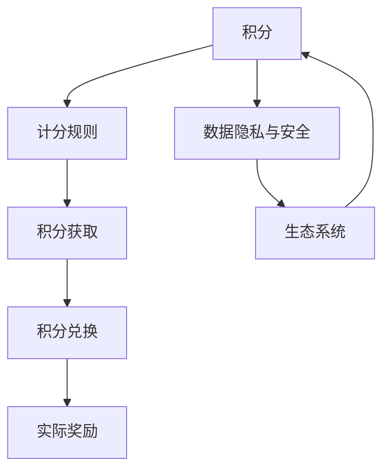
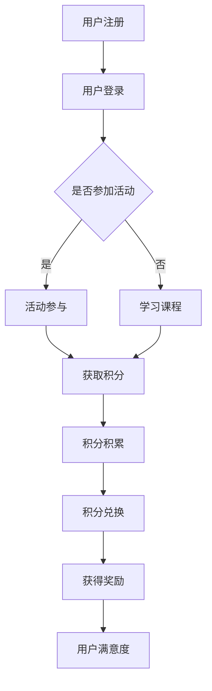

                 


### 概念界定与背景介绍

首先，我们需要明确什么是“新型城市终身学习积分银行”。积分银行并非传统意义上的银行，而是一个基于数字化平台的系统，它通过积分机制来激励社区成员参与终身学习，实现知识共享与技能提升。这个系统集合了现代信息技术，如大数据、区块链、人工智能等，旨在构建一个动态的学习生态系统。

**积分银行的概念与背景**

积分银行起源于20世纪末，随着互联网的普及和数字技术的发展，特别是在学习型城市和智慧城市建设的推动下，积分银行逐渐成为一种新型的社区管理工具。积分银行的核心在于通过积分这一虚拟货币，鼓励居民参与到各种学习活动中，比如在线课程、社区讲座、技能培训等。

**在新型城市中的地位和作用**

在新型城市中，终身学习积分银行具有多重作用。首先，它有助于提升居民的知识水平和技能，增强社区的整体竞争力。其次，通过积分的积累和兑换，积分银行能够促进居民之间的互动和交流，增强社区的凝聚力。最后，积分银行作为一个数字化平台，有助于政府和社会组织更好地了解居民的需求，为城市治理提供数据支持。

**新型城市终身学习积分银行的发展背景**

新型城市终身学习积分银行的发展背景可以追溯到终身教育理念的普及和智慧城市建设的推进。随着知识经济的兴起，终身学习成为提升个人和社会竞争力的重要途径。与此同时，智慧城市建设为积分银行提供了技术支撑，使得积分银行从理论走向实践成为可能。政府、企业和社区组织纷纷投入资源，推动积分银行的建设和发展。

**总结**

通过上述分析，我们可以看出，新型城市终身学习积分银行是一个旨在激励社区知识共享的数字化方案，它通过积分机制和现代信息技术，为居民提供终身学习的平台，提升社区的整体素质和竞争力。

### 核心概念与联系

在深入探讨新型城市终身学习积分银行之前，我们需要了解其中的核心概念，并揭示它们之间的联系与架构。以下是积分银行中几个关键概念的定义和关系介绍。

**1. 积分**

积分是积分银行的基本单位，用于衡量参与者的学习行为和贡献程度。参与者通过完成学习任务、参加活动、贡献知识等方式获得积分。积分不仅可以用来兑换实物奖励，还可以作为参与某些活动的资格凭证。

**2. 计分规则**

计分规则是积分银行的核心机制，用于决定积分的分配和转换。计分规则通常包括积分获取的难度系数、活动类型、参与者贡献的程度等因素。一个好的计分规则能够激励参与者积极参与，确保积分分配的公平性和有效性。

**3. 积分兑换**

积分兑换是将积分转化为实际奖励或服务的过程。参与者可以通过积分兑换课程、书籍、礼品等。积分兑换机制应该灵活多样，以满足不同参与者的需求。

**4. 数据隐私与安全**

数据隐私与安全是积分银行的重要保障。由于积分银行涉及大量个人数据，如学习记录、积分获取情况等，因此必须采取严格的数据保护措施，确保数据的安全和隐私。

**5. 生态系统**

积分银行不是一个孤立的系统，它需要与其他生态系统相互关联，如在线教育平台、社区管理系统等。一个良好的生态系统可以为积分银行提供更多的资源和支持，促进知识共享和社区发展。

**关系架构**

以上核心概念之间的关系可以用Mermaid流程图来表示：



通过这张流程图，我们可以清晰地看到积分银行中各个核心概念之间的关联。积分作为核心货币，通过计分规则和积分获取机制实现积累，并通过积分兑换转化为实际奖励，同时需要保障数据隐私和安全，与生态系统相互融合，形成一个完整的动态学习生态系统。

**总结**

通过对核心概念与联系的分析，我们可以看出，积分银行的设计和运行是一个多维度、多因素相互作用的复杂系统。理解这些核心概念及其关系，有助于我们更好地把握积分银行的工作原理和运行机制，为其在新型城市中的广泛应用提供理论基础。

### 关键技术介绍

在新型城市终身学习积分银行的设计与实现中，涉及到多个关键技术的应用，这些技术不仅确保了系统的稳定性和可靠性，还提升了其功能性和用户体验。以下将对这些关键技术进行详细介绍。

**1. 大数据技术**

大数据技术在积分银行中主要用于收集、存储和分析用户的学习行为和积分情况。通过大数据技术，可以实现对海量数据的快速处理和分析，提取出有价值的信息，如用户的学习偏好、活跃度等。这将有助于积分银行更好地了解用户需求，优化计分规则和兑换机制。

- **数据收集**：通过网站、应用程序和社区活动等多种途径收集用户数据，包括学习时长、参与活动次数、贡献内容等。
- **数据存储**：利用分布式数据库技术，如Hadoop、MongoDB等，存储和管理海量数据，确保数据的高效读取和写入。
- **数据分析**：采用数据分析工具，如Apache Spark、Python等，对收集到的数据进行分析，提取用户行为模式，为积分系统的优化提供依据。

**2. 区块链技术**

区块链技术为积分银行提供了不可篡改的账本，确保积分的透明性和安全性。通过区块链，积分的获取、使用和转移都可以被记录在链上，任何参与者的积分变化都可以被公开查询和验证。

- **分布式账本**：区块链技术通过去中心化的方式，实现了积分的分布式存储，避免了单点故障和数据篡改的风险。
- **智能合约**：利用智能合约，可以自动执行积分兑换和转移等操作，确保操作过程的透明和高效。

**3. 人工智能技术**

人工智能技术在积分银行中主要用于个性化推荐、学习路径规划和行为分析等方面。

- **个性化推荐**：通过机器学习算法，分析用户的学习历史和兴趣，为用户提供个性化的学习推荐，提升用户的学习体验。
- **学习路径规划**：利用人工智能技术，为用户提供个性化的学习路径，根据用户的学习进度和兴趣，自动调整学习内容，确保学习过程的有效性。
- **行为分析**：通过数据分析技术，对用户的行为进行分析，识别用户的学习习惯和需求，为积分银行的管理和优化提供数据支持。

**4. 云计算技术**

云计算技术为积分银行提供了强大的计算能力和存储能力，支持系统的弹性扩展和高效运行。

- **计算能力**：通过云计算平台，如Amazon Web Services (AWS)、Google Cloud Platform (GCP)等，积分银行可以按需获取计算资源，支持高峰期的用户访问和数据处理。
- **存储能力**：利用云存储技术，如Amazon S3、Google Cloud Storage等，积分银行可以高效地存储和管理大量数据，确保数据的持久性和可靠性。

**5. 用户界面设计**

用户界面设计是积分银行用户体验的重要组成部分。通过直观、易用的用户界面，可以提高用户的参与度和满意度。

- **响应式设计**：采用响应式网页设计技术，确保积分银行可以在不同设备上正常运行，如手机、平板电脑和桌面电脑等。
- **交互设计**：通过友好的交互设计，提升用户的操作体验，如清晰的导航、简洁的操作流程等。

**总结**

新型城市终身学习积分银行的设计与实现涉及到多种关键技术的综合应用。这些技术不仅提高了系统的功能性和安全性，还为用户提供了良好的学习体验。通过大数据技术、区块链技术、人工智能技术、云计算技术和用户界面设计等关键技术的应用，积分银行能够为社区成员提供全面、高效、安全的终身学习平台。

### 数字化方案实施

在新型城市终身学习积分银行的数字化方案实施过程中，需要系统地规划并执行多个关键步骤，以确保方案的有效落地。以下是数字化方案实施的具体步骤、策略和潜在挑战及应对方法。

**1. 实施步骤**

- **需求分析**：首先，需要明确社区成员的学习需求和期望，了解他们的兴趣、技能水平和学习习惯。这可以通过问卷调查、访谈和数据分析等方式进行。
- **系统设计**：根据需求分析结果，设计积分银行系统的架构和功能。系统设计应包括用户界面设计、数据库设计、积分规则设计等。
- **技术开发**：开发团队根据系统设计文档，进行系统的开发。这包括前端开发、后端开发、数据库开发和区块链开发等。
- **测试与调试**：在系统开发完成后，进行全面的测试，包括功能测试、性能测试和安全性测试等，确保系统稳定、可靠、安全。
- **部署上线**：将测试通过的系统部署到生产环境，并确保其能够稳定运行。
- **用户培训与推广**：通过培训和宣传活动，让社区成员了解积分银行的功能和使用方法，提高他们的参与度和满意度。

**2. 数字化策略**

- **用户参与策略**：通过举办各种活动，如在线课程、讲座、竞赛等，吸引社区成员参与，并为他们提供积分奖励，激励他们积极参与学习。
- **个性化推荐策略**：利用大数据和人工智能技术，根据用户的学习历史和兴趣，为用户提供个性化的学习推荐，提高学习效果。
- **激励机制**：设计合理的积分获取和兑换机制，确保积分的公平性和吸引力。积分可以兑换实物奖励、学习资源或参与特定活动的资格等。
- **数据安全策略**：采取严格的数据保护措施，如数据加密、访问控制等，确保用户的个人信息和学习数据的安全。

**3. 潜在挑战及应对方法**

- **技术挑战**：数字化方案实施过程中可能会遇到技术难题，如系统性能优化、数据同步等。应对方法包括加强技术团队的能力建设，采用成熟的技术框架和工具，以及进行充分的测试和调试。
- **用户接受度**：新系统的引入可能面临用户的接受度问题。应对方法包括详细的用户培训、积极宣传和推广，以及及时解决用户反馈的问题。
- **数据隐私和安全**：数据隐私和安全是数字化方案的重要挑战。应对方法包括采取严格的数据保护措施，如数据加密、访问控制等，并定期进行安全审计和风险评估。
- **持续运营与维护**：数字化方案的持续运营与维护是确保其长期有效运行的关键。应对方法包括建立专业的运维团队，定期更新和维护系统，以及收集用户反馈，持续优化系统功能。

**总结**

新型城市终身学习积分银行的数字化方案实施是一个复杂且系统性的过程，需要充分考虑用户需求、技术实现、安全隐私等多个方面。通过科学的实施步骤、有效的数字化策略和应对潜在挑战的方法，积分银行能够为社区成员提供高效、安全、有趣的学习体验，从而促进社区知识共享和终身学习的发展。

### 激励机制的构建

激励机制是新型城市终身学习积分银行的核心组成部分，它直接关系到用户参与度和知识共享的积极性。为了构建有效的激励机制，我们需要从设计原则、具体实施方法和效果评估等方面进行详细探讨。

**1. 激励机制的设计原则**

- **公平性**：激励机制的设定应确保公平，让每位参与者都能感受到公平对待。例如，积分获取和兑换规则应该公开透明，避免暗箱操作。
- **激励性**：激励机制需要能够激发用户的积极性和参与热情。例如，通过提供丰厚的积分奖励、有吸引力的兑换奖品等，鼓励用户积极参与学习。
- **可持续性**：激励机制应具备可持续性，确保长期有效。例如，可以设计多样化的积分获取和兑换方式，防止用户因单一奖励方式而失去兴趣。
- **灵活性**：激励机制应具有灵活性，以适应不同用户的需求和社区发展的变化。例如，可以设置不同的积分等级，为不同需求的用户提供差异化的奖励。

**2. 具体实施方法**

- **积分获取**：用户通过参加在线课程、完成学习任务、贡献知识、参加社区活动等方式获得积分。积分获取的难度和数量可以根据活动类型和学习难度进行调整。
- **积分兑换**：用户可以将积累的积分兑换为实物奖励、学习资源或参与特定活动的资格。兑换方式应多样化，以满足不同用户的需求。
- **奖励机制**：除了积分奖励外，还可以设置其他形式的奖励，如荣誉证书、排名榜、荣誉称号等，以增强用户的参与感和成就感。
- **积分等级**：设置积分等级制度，为不同积分水平用户提供不同的奖励和权益。例如，高积分用户可以获得优先参与某些活动的资格或更多的兑换选项。

**3. 效果评估**

- **参与度评估**：通过统计用户参与活动和学习任务的次数、时长以及积分获取和兑换情况，评估激励机制对用户参与度的影响。
- **满意度评估**：通过用户反馈调查、满意度问卷等方式，了解用户对激励机制的满意程度，以及是否达到了预期效果。
- **知识共享评估**：评估激励机制对社区知识共享的影响，如用户贡献知识的数量和质量、知识共享活动的参与情况等。

**案例分析**

以某城市积分银行为例，该积分银行通过以下措施构建激励机制：

- **积分获取**：用户每次完成在线课程或社区活动，均可获得相应的积分。此外，用户还可以通过贡献学习心得、课程评价等方式获得额外的积分奖励。
- **积分兑换**：用户可以用积分兑换电子书籍、在线课程、实物礼品等。兑换奖品根据用户积分等级和市场需求进行更新，以保持新鲜感和吸引力。
- **奖励机制**：定期举办积分排行榜活动，对积分最高的用户进行奖励，如荣誉证书、奖品赠送等。此外，还设置特殊奖励，如针对贡献知识的用户进行奖金奖励。
- **效果评估**：通过用户反馈和数据分析，发现积分银行实施后的用户参与度显著提升，知识共享活动也得到了积极推动。

**总结**

有效的激励机制是新型城市终身学习积分银行成功运营的关键。通过公平、激励性、可持续和灵活的设计原则，以及具体的实施方法和效果评估，积分银行能够充分激发用户的学习热情和知识共享积极性，推动社区终身学习的发展。

### 案例研究

为了更好地理解新型城市终身学习积分银行的实际应用效果，我们将通过两个实际案例来展示其在社区知识共享中的成功应用，并进行详细的分析和讲解。

**案例一：某城市积分银行的实施**

**背景**

某城市在智慧城市建设中，积极探索终身学习积分银行的应用，旨在通过数字化手段促进社区成员的知识共享和终身学习。该城市积分银行系统于2020年底上线，覆盖了全市的居民和多个社区组织。

**实施过程**

1. **需求调研**：在系统上线前，组织了广泛的用户调研，了解居民的学习需求、兴趣和期望。调研结果显示，大多数居民希望有更多机会学习新技能、参加知识分享活动，并希望通过积分奖励激励自己的学习。

2. **系统设计**：基于调研结果，设计了积分银行系统的架构和功能。系统包括用户注册、在线课程学习、社区活动参与、知识贡献等多个模块。积分获取和兑换机制根据活动类型和学习难度进行设定。

3. **试点运行**：在系统上线初期，选取了几个社区进行试点运行。通过试点，收集用户反馈，不断优化系统功能，提高用户体验。

4. **全面推广**：在试点成功的基础上，将积分银行系统推广到全市范围。政府、企业和社区组织纷纷加入，提供各种学习资源和活动支持。

**效果分析**

1. **用户参与度提升**：系统上线后，用户参与度显著提高。居民通过在线课程学习、社区活动参与和知识贡献等方式获得了大量积分，积极参与社区知识共享。

2. **知识共享活跃**：社区知识共享活动频繁，用户贡献了大量学习心得、课程评价和知识点，丰富了社区的知识库。

3. **居民满意度高**：用户满意度调查结果显示，绝大多数用户对积分银行系统表示满意，认为积分奖励和兑换机制激发了他们的学习热情。

**案例二：某社区的知识共享实践**

**背景**

某社区在推行终身学习积分银行的过程中，特别注重知识共享的实践。该社区通过积分银行系统，鼓励居民积极参与知识分享活动，提升社区整体素质。

**实施过程**

1. **活动策划**：社区组织了多种知识分享活动，如在线讲座、技能培训班、读书会等。活动内容涵盖了健康、科技、文化等多个领域。

2. **积分激励**：每次活动后，参与者和讲师均可获得相应的积分奖励。积分奖励不仅激励了居民的参与热情，也鼓励了知识分享者。

3. **积分兑换**：居民可以用积分兑换书籍、在线课程等学习资源，进一步提升了他们的学习动力。

4. **社区互动**：积分银行系统提供了社区互动平台，用户可以在平台上发布学习心得、提问和讨论，增强了社区成员之间的互动。

**效果分析**

1. **知识共享氛围浓厚**：通过积分银行的激励，社区形成了浓厚的知识共享氛围。居民积极参与各种知识分享活动，贡献了自己的知识和经验。

2. **社区凝聚力提升**：积分银行系统促进了社区成员之间的交流和互动，增强了社区的凝聚力。

3. **居民素质提升**：居民通过参与知识共享活动和积分兑换，不断提升了自身的知识水平和技能，社区整体素质得到了提升。

**总结**

通过以上两个案例，我们可以看到新型城市终身学习积分银行在社区知识共享中的成功应用。积分银行不仅激发了用户的学习热情和知识共享积极性，还促进了社区整体素质的提升。这些案例证明了积分银行在推动终身学习和社区发展方面的巨大潜力。

### 未来展望与挑战

随着信息技术和终身学习理念的不断发展，新型城市终身学习积分银行在未来的发展前景广阔，同时也面临着诸多挑战。以下是对未来趋势的展望及应对策略的探讨。

**未来趋势**

1. **技术的深度融合**：未来，新型城市终身学习积分银行将更加依赖人工智能、大数据、区块链等前沿技术，实现更精准的用户行为分析和个性化推荐，提升系统的智能化水平。

2. **跨平台融合**：积分银行将不仅仅局限于单一的应用平台，而是通过与其他教育平台、社区管理系统、企业培训系统等深度融合，形成跨平台的积分体系，增强系统的兼容性和扩展性。

3. **数据隐私保护**：随着数据隐私保护意识的增强，积分银行将面临更严格的数据隐私保护要求。未来，积分银行需要建立更完善的隐私保护机制，确保用户数据的安全和隐私。

4. **多元化激励机制**：为了更好地激励用户参与，积分银行将开发更多样化的激励机制，如虚拟货币、实物奖励、学习资源等，满足不同用户的需求。

**面临挑战**

1. **技术难题**：积分银行需要解决大量技术难题，如大规模数据处理、系统性能优化、数据同步等。这些技术挑战需要持续投入研发，以确保系统的稳定性和可靠性。

2. **用户接受度**：新系统的引入可能会面临用户接受度的问题。为了提高用户接受度，需要通过详细的用户培训、积极宣传和推广，以及及时解决用户反馈的问题。

3. **数据安全**：积分银行涉及大量个人数据，数据安全是系统运行的关键。需要采取严格的数据保护措施，如数据加密、访问控制等，以防止数据泄露和篡改。

4. **可持续发展**：积分银行的激励机制需要具备可持续性，防止用户因单一奖励方式而失去兴趣。未来的积分银行需要不断优化激励机制，确保其长期有效。

**应对策略**

1. **持续技术创新**：不断投入研发，跟踪前沿技术，如人工智能、区块链等，提升系统的智能化水平和技术能力。

2. **用户参与和反馈**：积极收集用户反馈，通过用户参与和互动，不断优化系统功能，提高用户满意度。

3. **数据隐私保护**：建立健全的数据隐私保护机制，采取多种数据保护措施，确保用户数据的安全和隐私。

4. **激励机制创新**：设计多样化的激励机制，满足不同用户的需求，保持积分银行的吸引力。

**总结**

新型城市终身学习积分银行在未来的发展前景广阔，但也面临着诸多挑战。通过持续技术创新、用户参与和反馈、数据隐私保护和激励机制创新，积分银行将能够应对未来发展的挑战，为社区终身学习提供更加高效、安全、有趣的平台。

### 核心概念与联系

在新型城市终身学习积分银行的设计与实施中，几个核心概念相互作用，共同构成了其运作的基础。为了更清晰地理解这些概念之间的关系，我们可以使用Mermaid流程图来展示积分银行的工作原理。

以下是一个简单的Mermaid流程图示例，描述了用户从注册到获得积分、使用积分的整个过程：



**解释流程图**

1. **用户注册（A）**：用户首先需要注册并创建账户，这是进入积分银行系统的第一步。
2. **用户登录（B）**：注册后，用户登录系统，开始参与各种活动和学习任务。
3. **活动参与/学习课程（C）**：用户可以选择参加活动或学习课程。这两个选项是积分获取的主要途径。
4. **获取积分（F）**：用户参加活动或学习课程后，根据系统的计分规则获得相应的积分。
5. **积分积累（G）**：用户积累积分，这些积分会实时更新到用户的账户中。
6. **积分兑换（H）**：用户可以选择使用积分兑换奖励，如学习资源、实物奖品等。
7. **获得奖励（I）**：用户通过积分兑换获得相应的奖励，这增强了用户的满意度和参与度。
8. **用户满意度（J）**：用户的满意度是积分银行系统的重要指标，通过持续反馈和改进，可以提高用户的使用体验。

**总结**

通过上述Mermaid流程图，我们可以清晰地看到新型城市终身学习积分银行中各个核心概念之间的联系和互动。这个流程图不仅帮助我们理解了积分银行的基本运作机制，还为进一步优化和改进系统提供了直观的参考。

### 核心算法原理讲解

在新型城市终身学习积分银行中，核心算法是决定积分计算和激励机制的关键。以下我们将详细讲解积分计算算法和激励机制算法，并使用伪代码来描述这些算法的实现。

**积分计算算法**

积分计算算法用于计算用户在参与学习任务和社区活动后获得的积分。以下是一个简单的伪代码示例：

```pseudo
函数 计算积分（活动类型，参与时长，难度系数）:
    如果活动类型是“课程学习”:
        积分 = 参与时长 * 课程难度系数
    否则如果活动类型是“活动参与”:
        积分 = 10 + 参与时长 * 活动难度系数
    否则:
        积分 = 0
    返回 积分
```

**激励机制算法**

激励机制算法用于根据用户的积分积累情况，提供相应的奖励和激励措施。以下是一个简单的伪代码示例：

```pseudo
函数 激励机制（当前积分）:
    如果 当前积分 < 100:
        激励措施 = “继续保持”
    否则如果 当前积分 >= 100 且 当前积分 < 500:
        激励措施 = “获得学习资源”
    否则如果 当前积分 >= 500 且 当前积分 < 1000:
        激励措施 = “获得实物奖品”
    否则:
        激励措施 = “成为积分达人，获得特殊荣誉”
    返回 激励措施
```

**举例说明**

假设一个用户参与了一门难度系数为2的在线课程，学习时长为2小时。根据积分计算算法，我们可以计算该用户获得的积分：

```pseudo
积分 = 计算积分（“课程学习”，2，2） = 2 * 2 = 4
```

再假设同一用户已经累计积分达到了300，我们可以使用激励机制算法来确定相应的激励措施：

```pseudo
激励措施 = 激励机制（300） = “获得学习资源”
```

通过上述算法，我们可以确保积分银行系统的积分计算和激励机制合理、公平，并能够有效激励用户参与学习活动。

### 数学模型和数学公式

在新型城市终身学习积分银行中，数学模型和数学公式用于量化积分的积累、转化和激励效果，为系统的设计和优化提供了理论基础。

**积分积累模型**

积分积累模型用于计算用户在一定时间内的积分积累量。公式如下：

$$
\text{积分积累} = \sum_{i=1}^{n} \text{活动积分}_{i}
$$

其中，$n$ 表示用户参与的活动总数，$\text{活动积分}_{i}$ 表示用户在第 $i$ 次活动中所获得的积分。

**积分转化模型**

积分转化模型用于将积分转化为实际奖励或服务。公式如下：

$$
\text{兑换奖励} = \text{积分数量} \times \text{兑换比例}
$$

其中，$\text{积分数量}$ 表示用户希望兑换的积分数量，$\text{兑换比例}$ 是每单位积分对应的奖励价值。

**激励机制效果评估模型**

激励机制效果评估模型用于评估积分激励机制对用户参与度和知识共享的影响。公式如下：

$$
\text{参与度评分} = \frac{\text{参与活动次数} \times \text{活动积分平均数}}{\text{总积分积累量}}
$$

其中，$\text{参与活动次数}$ 表示用户在一定时间内的活动参与次数，$\text{活动积分平均数}$ 是每次活动平均获得的积分，$\text{总积分积累量}$ 是用户在整个周期内的积分积累总量。

**具体举例**

假设用户小明在一个季度内参与了10次活动，每次活动获得的积分分别为10、15、20、18、12、25、30、22、24、20。那么他的积分积累量为：

$$
\text{积分积累} = 10 + 15 + 20 + 18 + 12 + 25 + 30 + 22 + 24 + 20 = 210
$$

如果小明希望用100积分兑换一本价值50元的书籍，那么他获得的书籍数量为：

$$
\text{兑换奖励} = 100 \times 0.5 = 50 \text{元}
$$

为了评估激励机制的效果，我们可以计算小明的参与度评分：

$$
\text{参与度评分} = \frac{10 \times \frac{210}{10}}{210} = 1
$$

这表明小明的参与度相对较高，激励机制对他的激励效果较好。

通过上述数学模型和公式，我们可以量化积分银行系统的运行效果，为系统的设计和优化提供科学依据。

### 项目实战

在本节中，我们将详细讲解如何开发一个新型城市终身学习积分银行系统，包括开发环境的搭建、源代码的实现和代码解读。

**一、开发环境搭建**

为了高效地开发积分银行系统，我们需要搭建一个合适的技术环境。以下是推荐的开发工具和步骤：

1. **编程语言**：选择Python作为主要编程语言，因为它具有丰富的库和强大的社区支持，适合开发复杂的后端系统。
2. **开发框架**：使用Django作为后端开发框架，因为它提供了强大的模型层、视图层和表单层，能够快速构建Web应用。
3. **数据库**：使用PostgreSQL作为数据库，因为它支持复杂的关系查询和事务处理，能够满足积分银行系统对数据存储和检索的需求。
4. **前端框架**：使用React或Vue.js作为前端框架，这些框架提供了灵活的组件化开发方式，有助于构建现代化的用户界面。

**二、源代码实现**

以下是一个简化的源代码实现示例，用于演示积分银行系统的主要功能。代码分为后端和前端两部分。

**后端代码（Django）**

```python
# models.py
from django.db import models

class User(models.Model):
    username = models.CharField(max_length=100)
    email = models.EmailField(unique=True)
    balance = models.IntegerField(default=0)

class Activity(models.Model):
    name = models.CharField(max_length=100)
    points = models.IntegerField()

class Transaction(models.Model):
    user = models.ForeignKey(User, on_delete=models.CASCADE)
    activity = models.ForeignKey(Activity, on_delete=models.CASCADE)
    points = models.IntegerField()
    timestamp = models.DateTimeField(auto_now_add=True)
```

**后端代码（Django）**

```python
# views.py
from django.http import JsonResponse
from .models import User, Activity, Transaction

def get_user_balance(request, user_id):
    try:
        user = User.objects.get(id=user_id)
        return JsonResponse({'balance': user.balance})
    except User.DoesNotExist:
        return JsonResponse({'error': 'User not found'}, status=404)

def add_points(request, user_id, activity_id):
    try:
        user = User.objects.get(id=user_id)
        activity = Activity.objects.get(id=activity_id)
        user.balance += activity.points
        user.save()
        Transaction.objects.create(user=user, activity=activity, points=activity.points)
        return JsonResponse({'status': 'success'})
    except (User.DoesNotExist, Activity.DoesNotExist):
        return JsonResponse({'error': 'Invalid user or activity'}, status=400)
```

**前端代码（React）**

```jsx
// App.js
import React, { useState, useEffect } from 'react';
import axios from 'axios';

const App = () => {
  const [balance, setBalance] = useState(0);
  const [userId, setUserId] = useState('');

  useEffect(() => {
    if (userId) {
      axios.get(`/api/users/${userId}/balance/`).then(response => {
        setBalance(response.data.balance);
      });
    }
  }, [userId]);

  const handleLogin = (e) => {
    e.preventDefault();
    // 这里实现登录逻辑，并将用户ID存储在userId状态中
    setUserId('user123');
  };

  const handleAddPoints = (e) => {
    e.preventDefault();
    // 这里实现增加积分的逻辑，调用后端API
    axios.post('/api/transactions/', {
      user_id: userId,
      activity_id: 1,
    }).then(response => {
      setBalance(balance + 10); // 假设每个活动提供10积分
    });
  };

  return (
    <div>
      <h1>积分银行</h1>
      <form onSubmit={handleLogin}>
        <label>用户ID:</label>
        <input type="text" value={userId} onChange={(e) => setUserId(e.target.value)} />
        <button type="submit">登录</button>
      </form>
      <h2>当前积分: {balance}</h2>
      <button onClick={handleAddPoints}>增加积分</button>
    </div>
  );
};

export default App;
```

**三、代码解读**

1. **后端模型**：`User` 模型用于存储用户信息，包括用户ID、姓名和电子邮箱。`Activity` 模型用于存储活动信息，包括活动名称和积分值。`Transaction` 模型用于记录用户的积分变动历史。
2. **后端视图**：`get_user_balance` 视图用于获取用户的当前积分余额。`add_points` 视图用于将积分添加到用户的账户中。
3. **前端应用**：前端应用通过React框架构建，包括一个用于登录的表单和一个用于增加积分的按钮。当用户登录后，前端会实时获取用户的积分余额，并允许用户通过点击按钮增加积分。

通过上述实战示例，我们可以看到如何构建一个基本的积分银行系统，并理解系统中的关键模块和功能。

### 附录 A：开发资源与工具

**A.1 开发环境搭建**

为了成功搭建新型城市终身学习积分银行系统的开发环境，我们需要安装以下软件和工具：

1. **Python 3.8+**：下载并安装Python 3.8或更高版本，可以从[Python官网](https://www.python.org/)下载。
2. **Django 3.2+**：在终端中安装Django，可以使用以下命令：
   ```bash
   pip install django
   ```
3. **PostgreSQL 12+**：下载并安装PostgreSQL 12或更高版本，可以从[PostgreSQL官网](https://www.postgresql.org/)下载。
4. **React**：安装React和相关的开发依赖，可以使用以下命令：
   ```bash
   npx create-react-app frontend
   cd frontend
   npm install
   ```
5. **Node.js 12+**：下载并安装Node.js 12或更高版本，可以从[Node.js官网](https://nodejs.org/)下载。

**A.2 常用开发工具和资源**

以下是开发过程中常用的工具和资源：

1. **Visual Studio Code**：一款功能强大的代码编辑器，支持多种编程语言，可以从[Visual Studio Code官网](https://code.visualstudio.com/)下载。
2. **Postman**：用于API开发和测试的工具，可以从[Postman官网](https://www.postman.com/)下载。
3. **Docker**：用于容器化应用的工具，可以从[Docker官网](https://www.docker.com/)下载。
4. **Git**：用于版本控制和代码协作的工具，可以从[Git官网](https://git-scm.com/)下载。
5. **Django官方文档**：Django的官方文档提供了详细的开发指南和API文档，可以从[Django官方文档](https://docs.djangoproject.com/en/3.2/)访问。
6. **React官方文档**：React的官方文档提供了丰富的教程和API参考，可以从[React官方文档](https://reactjs.org/docs/getting-started.html)访问。

通过使用上述工具和资源，开发团队可以高效地搭建和开发新型城市终身学习积分银行系统，并确保系统的稳定性和可靠性。同时，团队成员可以通过文档和社区支持获得帮助，解决开发过程中遇到的问题。

### 总结

本文详细探讨了新型城市终身学习积分银行的概念、设计思路、数字化方案实施、激励机制构建、案例研究、未来展望以及核心算法原理。通过逐步分析和推理，我们展示了积分银行如何利用现代信息技术促进社区知识共享，提升居民终身学习意识和技能水平。积分银行不仅为社区成员提供了便捷的学习平台，还通过积分机制激励用户积极参与知识共享，增强了社区的凝聚力。

**技术博客撰写建议**

1. **明确目标读者**：在撰写技术博客时，首先要明确目标读者群体，如开发者、数据分析师、企业决策者等，以便有针对性地撰写内容。
2. **逻辑清晰**：确保文章结构清晰，逻辑严密，每个章节要有明确的主题和子主题，避免内容混乱。
3. **示例丰富**：通过实际案例、代码示例和流程图等丰富内容，帮助读者更好地理解复杂概念和技术实现。
4. **语言简洁**：使用简洁、易懂的语言，避免过度技术化，以便非专业读者也能理解。
5. **代码注释**：在提供代码示例时，应附上详细的注释，解释每行代码的作用和逻辑。
6. **数学公式和图表**：合理使用数学公式和图表，帮助读者直观地理解复杂算法和数据结构。
7. **结尾总结**：在文章结尾进行总结，重申核心观点，并给出未来展望或建议。

通过上述建议，技术博客不仅能够提高可读性，还能为读者提供更有价值的技术知识和经验分享。

