                 

### 文章标题

《新型城市艺术家驻留交换计划：促进文化交流的创意人才流动项目》

### 关键词

- 艺术家驻留交换计划
- 文化交流
- 创意人才流动
- 城市文化发展
- 项目实施策略
- 评估与反馈

### 摘要

本文深入探讨了新型城市艺术家驻留交换计划的背景、核心概念、实施策略、参与者角色以及项目评估等方面。首先，我们介绍了艺术家驻留交换计划的定义及其在促进文化交流和培养创意人才方面的重要性。接着，我们详细阐述了该计划的核心概念与联系，包括项目的组成要素、文化交流的机制和创意人才流动的路径。随后，文章探讨了艺术家驻留交换计划的实施策略，包括项目类型、策划与筹备、实施与管理以及评估与反馈。最后，文章通过实际案例分析了项目成果与评估方法，并提出了相关最佳实践和建议，以期为相关领域的实践者提供有益的参考。通过本文的逐步分析，我们希望读者能够对艺术家驻留交换计划有更深入的理解，从而更好地推动文化交流和创意人才的发展。

## 引言

### 1. 艺术家驻留交换计划的背景

艺术家驻留交换计划作为一种新型的文化交流项目，近年来在全球范围内逐渐兴起。这一计划的起源可以追溯到20世纪末，当时许多国家开始认识到文化交流在促进国际理解、增进人民友谊以及推动文化多样性方面的重要作用。为了加强不同文化之间的互动与交流，各国纷纷推出了艺术家驻留交换计划，为艺术家提供了一个跨国界的创作和发展平台。

在全球化背景下，城市作为文化交流的重要载体，扮演着越来越重要的角色。城市不仅是经济的中心，也是文化创新和传播的枢纽。通过艺术家驻留交换计划，城市能够吸引和培养具有国际视野的创意人才，促进本土文化与外来文化的碰撞与融合，从而提升城市的文化软实力。此外，艺术家驻留交换计划还为城市带来了新的艺术形式和创作思路，激发了城市的文化活力和创新能力。

### 2. 艺术家驻留交换计划的重要性

艺术家驻留交换计划具有多方面的意义和重要性：

首先，它能够促进文化交流。通过艺术家之间的互动与交流，不同文化得以相互理解、尊重和欣赏，有助于消除文化隔阂，增进国际友谊。艺术家们通过创作和展示，向世界传递各自文化的独特魅力和价值观，为全球化背景下的文化交流提供了新的动力。

其次，艺术家驻留交换计划是培养创意人才的有效途径。在这一计划中，艺术家不仅有机会接触和吸收不同文化的艺术形式和创作理念，还能够与当地社区、文化机构和其他艺术家进行深度交流与合作。这种跨文化交流和合作能够激发艺术家的创新思维，提升其创作能力和国际竞争力。

再次，艺术家驻留交换计划有助于推动城市文化发展。城市通过吸引优秀的艺术家驻留，不仅能够提升城市的文化氛围，还能够带动相关产业的发展，如旅游业、文化产业等。艺术家们的创作活动和作品展示，也为城市带来了新的文化地标和品牌形象，提升了城市的知名度和吸引力。

### 3. 书籍的目标与结构概述

本文旨在深入探讨新型城市艺术家驻留交换计划的背景、核心概念、实施策略、参与者角色以及项目评估等方面。通过逐步分析，我们希望读者能够全面理解艺术家驻留交换计划的运作机制和实际效果，从而为其在实践中的应用提供有益的参考。

本书结构如下：

- **第一章：艺术家驻留交换计划概述**：介绍艺术家驻留交换计划的定义、历史与发展，以及其在促进文化交流和培养创意人才方面的意义。
- **第二章：艺术家驻留交换计划的核心概念与联系**：详细阐述艺术家驻留项目的组成要素、文化交流的机制和创意人才流动的路径。
- **第三章：艺术家驻留交换计划的实施策略**：探讨项目类型、策划与筹备、实施与管理以及评估与反馈的方法和策略。
- **第四章：参与者角色与互动**：分析艺术家的参与与成长、机构与管理者的角色以及社区的参与与影响。
- **第五章：项目成果与评估**：介绍项目成果展示与传播的方法、项目评估的方法与实践，以及项目成效分析与反馈。
- **第六章：案例研究**：通过国内外典型案例分析，展示艺术家驻留交换计划的具体实施过程和成果。

## 第一章：艺术家驻留交换计划概述

### 1.1 定义与基本概念

艺术家驻留交换计划（Artist Residency Exchange Program）是指通过组织机构和资金支持，为艺术家提供一个在特定地点进行创作、研究和交流的机会。这种计划通常涉及艺术家在不同城市或国家之间的流动，使得他们能够在不同的文化环境中进行创作和探索。艺术家驻留交换计划的定义包含以下几个关键要素：

- **艺术家**：参与驻留计划的主体，包括各类艺术领域的创作者，如画家、雕塑家、音乐家、舞者、作家等。
- **机构**：负责组织和实施驻留计划的文化机构、教育机构或非营利组织。
- **地点**：艺术家驻留的特定地点，可以是城市、乡村、文化中心、大学或其他艺术空间。
- **时间**：艺术家驻留的持续时间，可以是几个月到一年不等。
- **目的**：通过创作和交流，促进文化交流、培养创意人才、推动城市文化发展。

### 1.2 艺术家驻留交换计划的特点

艺术家驻留交换计划具有以下显著特点：

- **跨文化交流**：艺术家在不同文化环境中进行创作和交流，有助于促进不同文化之间的理解与尊重。
- **灵活性**：驻留计划的形式和内容可以根据具体需求进行调整，包括项目类型、时间和地点等。
- **互动性**：艺术家不仅与当地社区进行互动，还可以与其他艺术家、学者和文化机构进行合作。
- **创新性**：艺术家在驻留期间可以尝试新的艺术形式和创作方法，推动艺术创新。
- **可持续性**：通过长期规划和资源整合，艺术家驻留交换计划可以持续为艺术家和城市带来文化价值和经济效益。

### 1.3 艺术家驻留交换计划的历史与发展

艺术家驻留交换计划的发展历程可以追溯到20世纪末。最初，这类计划主要在发达国家之间展开，如美国、欧洲和澳大利亚等。随着全球化进程的加快，发展中国家也逐渐加入了这一潮流。近年来，艺术家驻留交换计划在全球范围内蓬勃发展，形成了以下趋势：

- **国际化**：越来越多的国家和城市开始建立艺术家驻留交换计划，使得全球范围内的艺术家有机会进行跨国交流。
- **多样性**：艺术家驻留计划的形式和内容日益多样化，包括短期驻留、长期驻留、主题驻留等。
- **数字技术**：随着数字技术的发展，线上艺术家驻留计划逐渐兴起，为艺术家提供了更多的创作和交流机会。
- **公共参与**：艺术家驻留计划越来越注重公众的参与，通过展览、讲座、工作坊等形式，将艺术创作与公众生活紧密联系。

### 1.4 艺术家驻留交换计划的目的与意义

艺术家驻留交换计划具有多重目的和意义，主要体现在以下几个方面：

- **促进文化交流**：通过艺术家之间的互动和创作，不同文化得以相互理解和尊重，有助于消除文化隔阂，增进国际友谊。
- **培养创意人才**：为艺术家提供创作和研究的机会，激发其创新思维和创作能力，培养具有国际竞争力的创意人才。
- **推动城市文化发展**：艺术家驻留计划可以提升城市的文化氛围和创新能力，带动相关文化产业的发展，增强城市的文化软实力。
- **促进社会创新**：艺术创作往往涉及对社会现象的反思和批判，通过艺术家的创作，可以激发社会的创新和进步。
- **经济价值**：艺术家驻留计划可以带动旅游业、文化产业等相关产业的发展，为城市带来经济收益。

总之，艺术家驻留交换计划作为一种新型文化交流项目，不仅具有深远的文化意义，还能够在经济、社会等多个层面产生积极影响。通过逐步分析和探讨，我们希望能够为读者提供全面的视角，深入了解这一计划的运作机制和实际效果。

### 1.5 艺术家驻留交换计划的核心概念与联系

艺术家驻留交换计划的核心概念包括艺术家、机构、地点、时间和目的。这些概念之间紧密联系，共同构成了一个复杂的生态系统。以下是对这些核心概念之间关系的详细解释：

#### 1.5.1 艺术家与机构的关系

艺术家与机构是艺术家驻留交换计划中的两个关键角色。机构通常负责策划、组织和资助艺术家驻留项目，为艺术家提供创作空间、资源和支持。而艺术家则通过参与驻留项目，实现个人的创作和研究目标。这种合作关系不仅促进了艺术家的个人成长，也为机构的品牌建设和文化推广提供了机会。

**Mermaid 流程图：**

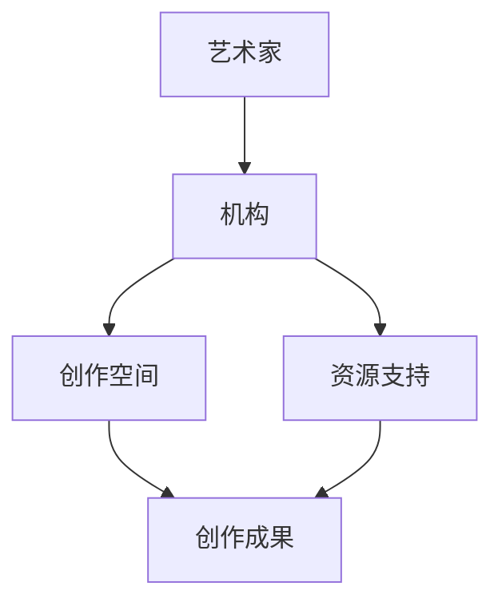

#### 1.5.2 地点与时间的重要性

地点和时间是艺术家驻留交换计划中的两个关键要素。地点决定了艺术家驻留的物理环境和文化背景，不同的地点可以提供独特的创作灵感和资源。时间则决定了艺术家驻留的持续时间，这直接影响艺术家在驻留期间的创作深度和广度。

**Mermaid 流程图：**

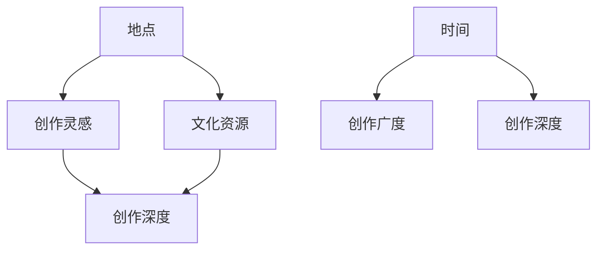

#### 1.5.3 目的与意义

目的与意义是艺术家驻留交换计划的出发点和归宿。通过促进文化交流、培养创意人才、推动城市文化发展等多重目的，艺术家驻留交换计划不仅为艺术家提供了创作和发展的平台，也为城市和社会带来了文化价值和经济收益。

**Mermaid 流程图：**

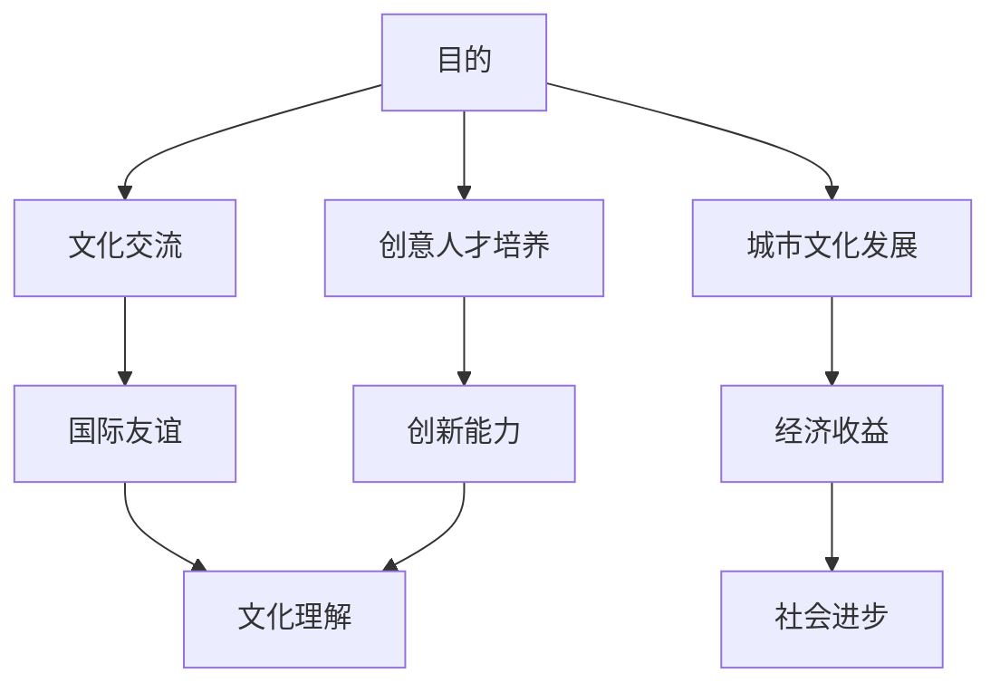

通过以上分析，我们可以看到，艺术家驻留交换计划的核心概念之间存在着紧密的联系和互动。这些概念共同构成了一个动态的生态系统，为艺术家和城市带来了多方面的收益。接下来，我们将进一步探讨艺术家驻留交换计划的实施策略，以深入了解这一计划的运作机制。

### 1.6 艺术家驻留交换计划的实施策略

艺术家驻留交换计划的实施策略是其成功的关键因素。合理的实施策略不仅能够确保项目的顺利进行，还能够最大化地实现项目的目标和效果。以下是对艺术家驻留交换计划实施策略的详细探讨：

#### 3.1 项目类型

艺术家驻留交换计划可以有多种类型，包括短期驻留、长期驻留、主题驻留等。每种类型都有其特定的特点和适用场景。

- **短期驻留**：通常为几个月，适用于艺术家快速获取灵感、开展研究和创作。这种类型的驻留适合那些需要短时间内深入研究的艺术家。
- **长期驻留**：通常为一年或更长时间，允许艺术家在较长时间内进行深度创作和研究。这种类型的驻留适合那些需要长期环境来孕育作品的艺术创作者。
- **主题驻留**：围绕特定主题或领域展开，如数字艺术、环境艺术、社会艺术等。这种类型的驻留能够引导艺术家在特定领域进行探索和创新。

**Mermaid 流程图：**

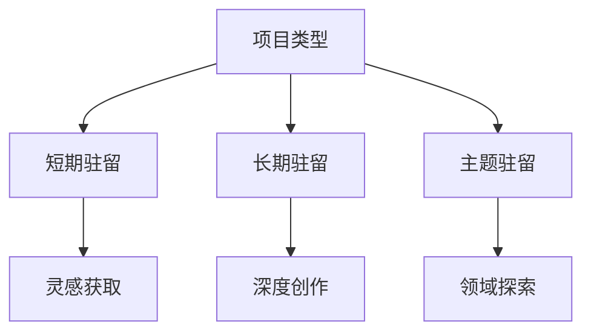

#### 3.2 项目策划与筹备

项目策划与筹备是艺术家驻留交换计划实施的第一步。这一阶段需要明确项目的目标、内容和资源，并制定详细的实施方案。

- **目标明确**：首先，需要明确项目的具体目标，包括促进文化交流、培养创意人才、推动城市文化发展等。
- **内容设计**：根据目标，设计项目的具体内容，包括艺术家的招募、创作活动的安排、展览和活动等。
- **资源整合**：整合项目所需的资源，包括资金、空间、设备、人力等，确保项目能够顺利实施。

**Mermaid 流程图：**

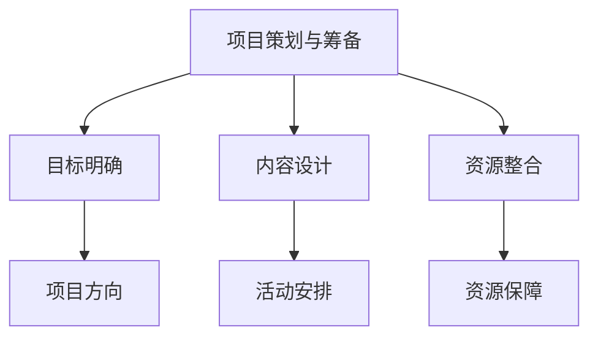

#### 3.3 项目实施与管理

项目实施与管理是艺术家驻留交换计划的核心环节。在这一阶段，需要确保项目的各项活动按计划进行，并为艺术家提供必要的支持和服务。

- **项目监督**：对项目的进展进行实时监督，确保项目按计划进行，并及时解决出现的问题。
- **艺术家支持**：为艺术家提供创作和生活上的支持，包括创作空间、设备、资金、后勤保障等。
- **互动与交流**：组织艺术家与当地社区、文化机构、其他艺术家等进行互动和交流，促进文化交流和创意碰撞。

**Mermaid 流程图：**

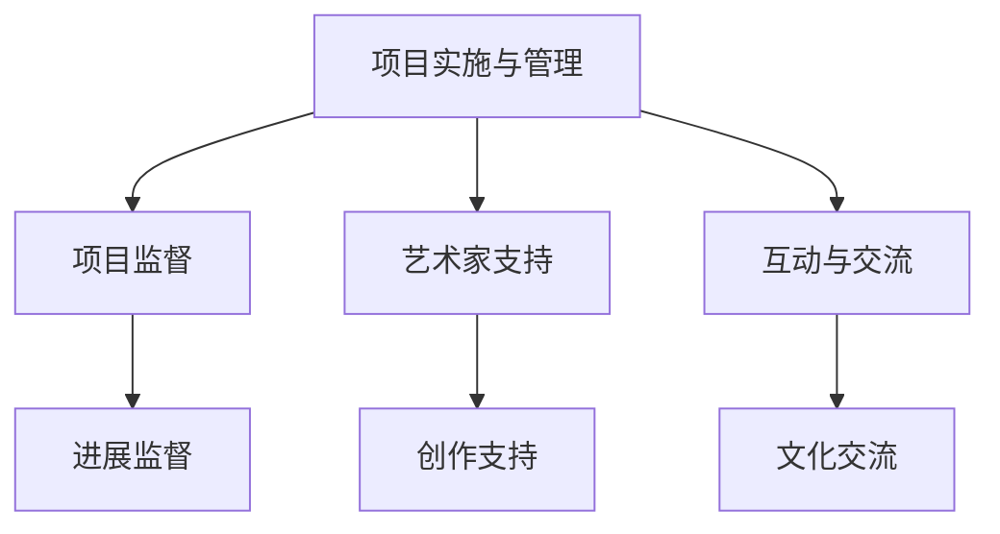

#### 3.4 项目评估与反馈

项目评估与反馈是艺术家驻留交换计划的最后一个关键环节。通过评估，可以了解项目的效果和存在的问题，为下一次项目提供改进的依据。

- **评估方法**：采用多种评估方法，包括定量评估和定性评估，如问卷调查、访谈、观察等。
- **评估指标**：设定具体的评估指标，如项目成果、艺术家满意度、社区参与度、经济效益等。
- **反馈机制**：建立反馈机制，及时收集和反馈评估结果，并根据评估结果进行项目优化。

**Mermaid 流程图：**

通过以上实施策略，艺术家驻留交换计划能够有序进行，实现其预期的目标。接下来，我们将进一步探讨参与者角色和互动，以全面了解这一计划的具体运作。

### 4. 参与者角色与互动

艺术家驻留交换计划的成功离不开各个参与者的积极参与和互动。这些参与者包括艺术家、机构管理者、社区成员和其他相关利益方。以下是这些参与者角色和互动的详细探讨：

#### 4.1 艺术家的参与与成长

艺术家是艺术家驻留交换计划的核心参与者。他们在驻留期间不仅有机会进行创作，还能够通过与当地社区、文化机构和其他艺术家的互动，实现个人成长和创作突破。

- **参与需求与动机**：艺术家参与驻留计划的需求和动机多种多样，包括寻求创作灵感、扩展艺术视野、提升创作能力、建立国际合作关系等。许多艺术家希望通过驻留计划，能够在不同文化环境中进行创作，从而丰富自己的艺术表达。
- **角色与责任**：在驻留期间，艺术家需要承担创作和交流的责任。他们需要充分利用驻留资源，进行创新性的艺术创作，并与当地社区和文化机构进行互动，分享创作经验和艺术见解。
- **成长与发展**：艺术家通过驻留计划，能够获得新的创作视角和灵感，提升创作技巧和艺术表达能力。同时，他们还能够在国际艺术舞台上建立自己的声誉，拓展职业发展空间。

**Mermaid 流程图：**

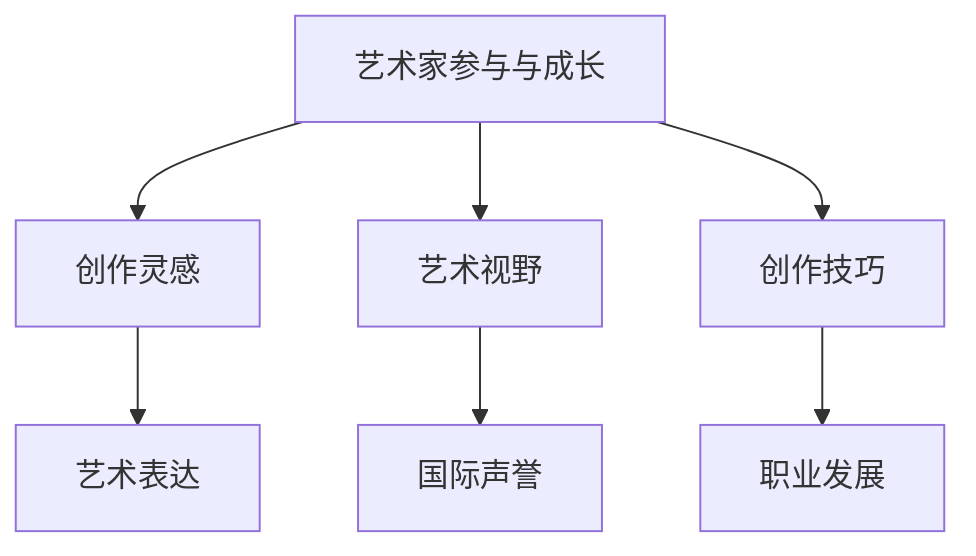

#### 4.2 机构与管理者的角色

机构和管理者在艺术家驻留交换计划中扮演着重要的组织和协调角色。他们负责策划、组织和资助项目，为艺术家提供必要的支持和服务。

- **角色与责任**：机构管理者负责项目的整体策划和实施，包括艺术家的招募、创作资源的配置、项目预算的管理等。他们需要确保项目的顺利进行，并为艺术家提供良好的创作环境和支持。
- **支持与协调**：机构管理者还需要协调艺术家与当地社区、文化机构和其他利益方的互动，确保各方能够在项目中发挥积极作用。同时，他们还需要为艺术家提供后勤保障，如住宿、交通、设备等。

**Mermaid 流程图：**

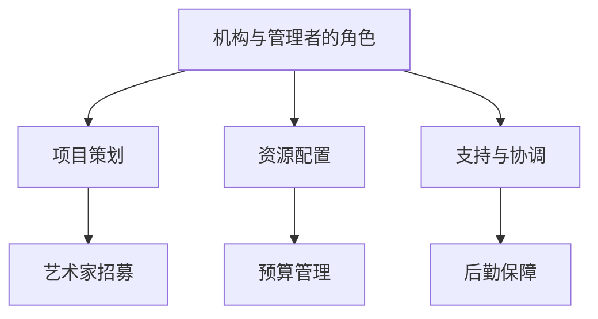

#### 4.3 社区的参与与影响

社区是艺术家驻留交换计划的重要参与者和受益者。社区的积极参与不仅能够提升项目的效果，还能够增强社区的文化活力和社会凝聚力。

- **参与形式**：社区可以通过多种形式参与艺术家驻留计划，包括提供创作空间、组织公共活动、参与艺术展览、提供志愿服务等。通过这些形式，社区能够直接参与到艺术创作和传播过程中，增强对艺术的理解和认同。
- **反馈与影响**：社区对项目的反馈和影响是多方面的。首先，社区的参与和反馈能够帮助项目团队了解项目的实际效果和受众需求，从而优化项目方案。其次，社区的支持和参与能够提升项目的社区影响力，增强艺术作品的社会价值。最后，社区通过参与项目，能够提升自身的文化素养和艺术欣赏能力，促进社区的文化发展。

**Mermaid 流程图：**

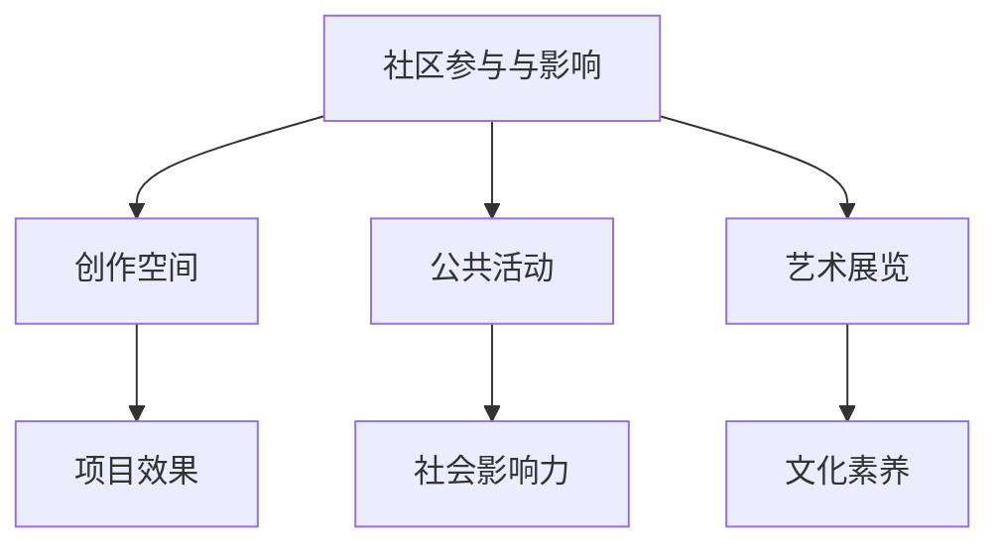

通过以上参与者角色和互动的探讨，我们可以看到，艺术家驻留交换计划是一个复杂的生态系统，各个参与者的积极参与和互动对于项目的成功至关重要。接下来，我们将进一步探讨项目成果与评估方法，以全面了解这一计划的实际效果。

### 5. 项目成果与评估

#### 5.1 项目成果展示与传播

艺术家驻留交换计划的成功离不开项目成果的展示与传播。通过有效的展示与传播，项目成果不仅能够得到社会的认可和关注，还能够进一步推动文化交流和创意人才的发展。

- **展示形式**：项目成果的展示形式多样，包括艺术展览、演出、出版物、社交媒体等。艺术展览是常见的形式，通过在画廊、博物馆等场所举办展览，艺术家可以将自己的作品公之于众。演出形式包括音乐会、戏剧表演、舞蹈演出等，适合那些表演艺术类的艺术家。出版物则包括画册、文集、音乐专辑等，通过出版物的形式，艺术家可以记录和分享自己的创作过程和思考。社交媒体平台的运用也越来越广泛，通过视频、图片、文字等形式，艺术家可以实时与观众互动，增强项目的传播效果。
- **传播渠道**：项目成果的传播渠道包括传统媒体和新媒体。传统媒体如报纸、杂志、电视台等，具有广泛的影响力，能够吸引大量观众。新媒体如社交媒体、博客、视频平台等，则具有互动性强、传播速度快的特点，适合快速传播和广泛覆盖。此外，社区活动也是重要的传播渠道，通过组织社区展览、讲座、工作坊等活动，项目成果能够更直接地与公众互动。

**Mermaid 流程图：**

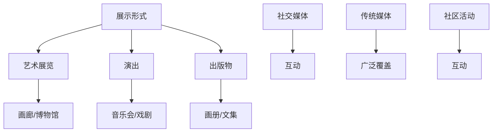

#### 5.2 项目评估方法与实践

项目评估是确保艺术家驻留交换计划有效实施和持续改进的重要环节。通过科学合理的评估方法，可以全面了解项目的效果和问题，为后续项目提供有价值的参考。

- **评估目的**：项目评估的主要目的是了解项目的实际效果，包括艺术创作成果、艺术家成长、社区影响、经济效益等方面。通过评估，可以判断项目是否实现了预期目标，发现存在的问题和不足，并提出改进建议。
- **评估原则**：项目评估应遵循客观性、科学性和全面性的原则。客观性要求评估方法应基于实际数据和事实，避免主观偏见。科学性要求评估方法应具有可操作性和可重复性，能够准确反映项目的效果。全面性要求评估应涵盖项目的各个方面，包括创作成果、社会影响、经济效益等。
- **评估方法**：项目评估的方法多种多样，包括定量评估和定性评估。定量评估主要通过数据统计和分析，如问卷调查、作品数量、展览参观人数等，定量评估能够提供客观的量化指标。定性评估主要通过访谈、观察和文档分析，如艺术家访谈、项目文档、媒体报道等，定性评估能够深入挖掘项目的实际效果和问题。

**Mermaid 流程图：**

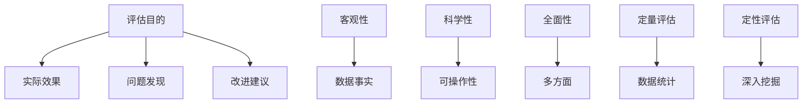

#### 5.3 项目成效分析与反馈

通过对项目成效的深入分析，可以全面了解项目在促进文化交流、培养创意人才、推动城市文化发展等方面的实际效果。

- **主要指标**：项目成效的主要指标包括艺术创作成果、艺术家成长、社区影响和经济效益等。艺术创作成果可以通过作品数量、展览质量、媒体报道等指标进行评估。艺术家成长可以通过创作能力提升、国际声誉提升、职业发展等指标进行评估。社区影响可以通过社区参与度、公众满意度、社区文化氛围改善等指标进行评估。经济效益可以通过项目带来的经济收入、相关产业发展等指标进行评估。
- **案例分析**：通过案例分析，可以更直观地了解项目成效。以下是一个具体案例：

某城市实施了一项为期一年的艺术家驻留交换计划，邀请了来自不同国家和地区的10名艺术家进行驻留创作。项目期间，艺术家们通过展览、演出、工作坊等形式，与当地社区和艺术家进行了广泛互动。项目结束后，通过对项目成果的评估，发现以下成效：

- **艺术创作成果**：艺术家们共创作了100多件作品，其中70%的作品在国内外展览中展出，得到了广泛的关注和好评。
- **艺术家成长**：通过驻留创作，艺术家的创作能力和国际声誉得到了显著提升，有6名艺术家在国际知名艺术节上获奖。
- **社区影响**：社区居民对艺术创作的参与度大幅提高，有超过500名社区居民参加了艺术家的工作坊和讲座。
- **经济效益**：项目带动了旅游业的发展，增加了城市的知名度和吸引力，预计为当地带来了1000多万元的旅游收入。

**Mermaid 流程图：**

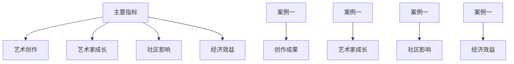

#### 5.4 反馈与改进建议

通过项目评估，可以收集到各种反馈信息，为项目的持续改进提供依据。以下是一些改进建议：

- **优化项目策划**：根据评估结果，可以优化项目策划，包括明确项目目标、完善项目内容、合理配置资源等。
- **提升管理能力**：加强项目团队的管理能力，包括项目监督、资源整合、互动协调等，确保项目顺利实施。
- **增加公众参与**：通过多种方式增加公众参与，提升项目的社会影响力，包括社区活动、公众讲座、社交媒体推广等。
- **加强国际合作**：加强与国际艺术机构和文化机构的合作，拓展艺术家和项目的国际视野和影响力。

**Mermaid 流程图：**

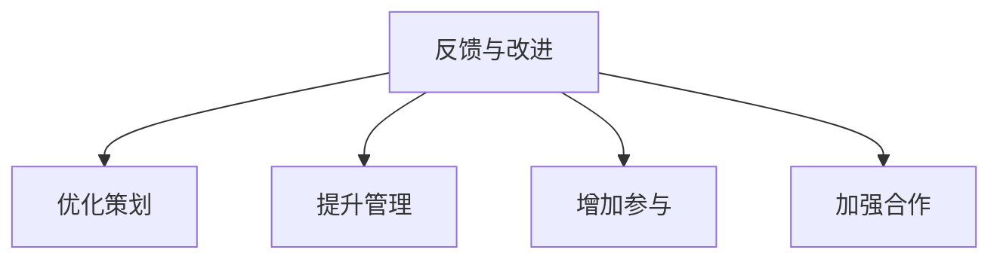

通过以上对项目成果与评估的详细探讨，我们可以看到，艺术家驻留交换计划在促进文化交流、培养创意人才、推动城市文化发展等方面具有显著效果。通过科学合理的评估方法和持续改进，项目可以更好地实现其预期目标，为相关领域的实践提供有益的参考。

### 6. 案例研究

#### 6.1 国内外典型案例分析

为了更深入地了解艺术家驻留交换计划的实施效果，我们选择了几个具有代表性的国内外案例进行分析。

**案例一：法国马赛艺术家驻留计划**

法国马赛市自2005年开始实施艺术家驻留计划，旨在通过艺术创作和社区互动，推动城市文化的多样性和活力。每年，马赛市会邀请来自世界各地的艺术家进行短期或长期驻留，为他们提供创作空间和资源支持。艺术家们在驻留期间不仅创作了大量的艺术作品，还积极参与社区活动，与当地居民互动交流。

评估结果显示，该计划极大地促进了马赛市的文化交流和社会融合。通过艺术展览、工作坊、讲座等形式，艺术家们的作品得到了广泛展示和传播，吸引了大量观众和游客。此外，社区居民对艺术的兴趣和参与度显著提升，社区的文化氛围更加活跃。

**Mermaid 流程图：**

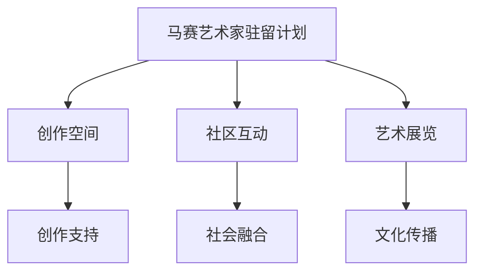

**案例二：中国北京798艺术家驻留计划**

中国的798艺术区是北京的一个知名艺术聚集地，自2000年起，这里开始实施艺术家驻留计划，吸引了大量国内外艺术家前来驻留创作。798艺术家驻留计划为艺术家提供了良好的创作环境和资源支持，包括工作室、设备、资金等。

通过多年的实践，798艺术家驻留计划取得了显著成效。首先，该计划为艺术家提供了展示自己作品的平台，提高了他们的知名度和影响力。其次，艺术家们的创作活动和作品展示吸引了大量游客，带动了798艺术区的旅游业发展。最后，798艺术区通过这一计划，吸引了更多国际艺术家和文化机构前来合作，提升了其国际影响力。

**Mermaid 流程图：**

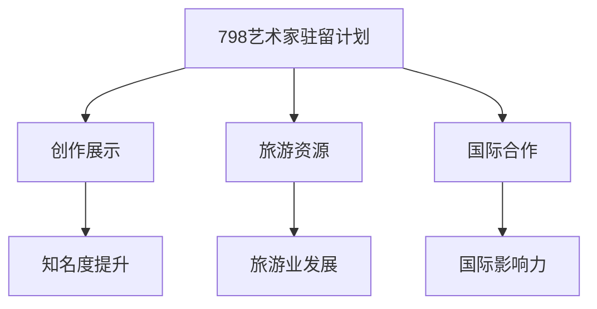

**案例三：美国纽约布鲁克林艺术家驻留计划**

纽约布鲁克林艺术家驻留计划是美国最为成功的艺术家驻留项目之一。该计划由布鲁克林艺术学院（Brooklyn Academy of Music）实施，每年邀请几十名艺术家进行短期驻留。艺术家们在这里不仅能够进行创作，还能够参加各类研讨会、工作坊和表演活动，与其他艺术家和专业人士进行互动。

评估结果显示，布鲁克林艺术家驻留计划在多个方面取得了显著成果。首先，通过丰富的创作活动和互动机会，艺术家们的创作水平和技能得到了显著提升。其次，艺术家们的作品在纽约市内外得到了广泛展示和传播，提高了他们的知名度和影响力。最后，该计划还促进了纽约市的文化多样性和创意产业的发展。

**Mermaid 流程图：**

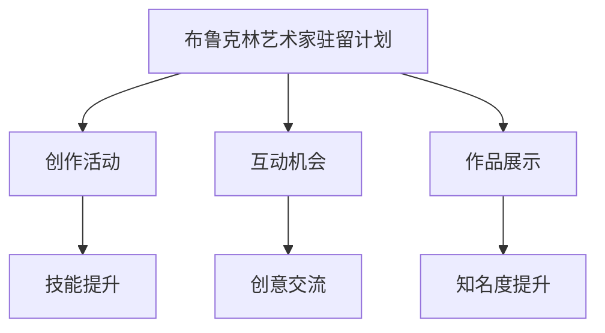

**案例四：日本东京六本木艺术家驻留计划**

日本东京六本木区自2008年开始实施艺术家驻留计划，旨在推动艺术与科技的融合。该计划每年邀请国内外艺术家和科技专家进行短期驻留，共同探讨和创作艺术与科技相结合的作品。

评估结果显示，六本木艺术家驻留计划在多个方面取得了显著成果。首先，艺术家们通过创作和展示，展示了艺术与科技的无穷可能性，吸引了大量观众。其次，通过科技专家的参与，艺术家们的创作方法和技能得到了显著提升。最后，该计划还促进了艺术与科技的跨界合作，推动了东京六本木区的文化创新和产业发展。

**Mermaid 流程图：**

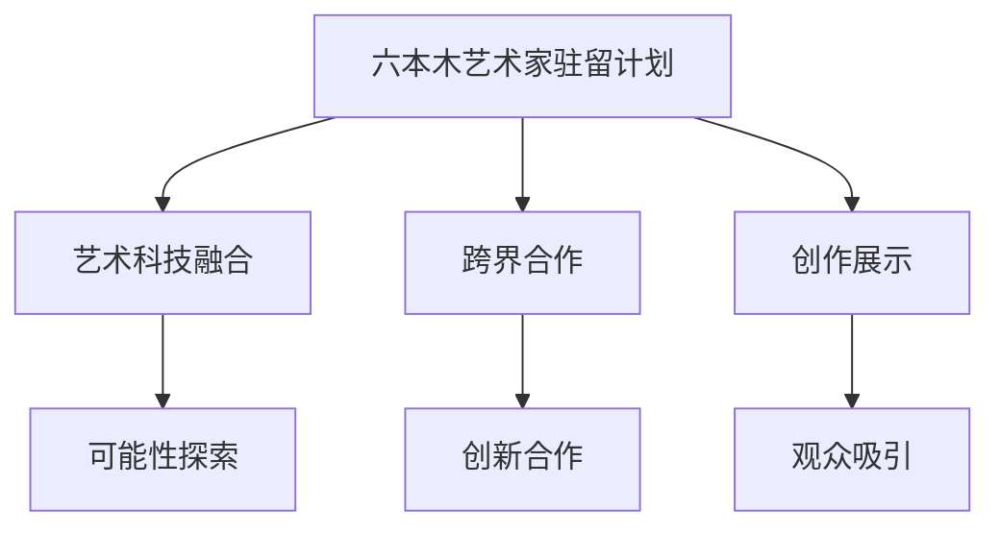

通过以上国内外典型案例的分析，我们可以看到，艺术家驻留交换计划在不同国家和地区的实施，都取得了显著的效果。这些案例不仅展示了艺术家驻留计划在促进文化交流、培养创意人才、推动城市发展等方面的作用，也为其他地区和国家的艺术家驻留计划提供了宝贵的经验和启示。

### 结论

通过本文的深入探讨，我们可以全面了解新型城市艺术家驻留交换计划的背景、核心概念、实施策略、参与者角色以及项目评估等方面。这一计划作为一种新型的文化交流项目，不仅有助于促进文化交流和培养创意人才，还能够推动城市文化发展，提升城市的软实力。

首先，艺术家驻留交换计划通过为艺术家提供一个跨国界的创作和发展平台，促进了不同文化之间的互动与交流。艺术家在驻留期间，不仅能够接触到新的艺术形式和创作理念，还能够通过与当地社区、文化机构和其他艺术家的互动，实现文化的多元融合。

其次，这一计划在培养创意人才方面具有显著作用。通过长期的驻留创作和交流，艺术家们的创作能力和国际竞争力得到了显著提升。同时，艺术家们在驻留期间所获得的经验和知识，也为他们未来的发展奠定了坚实基础。

此外，艺术家驻留交换计划在推动城市文化发展方面发挥了重要作用。艺术家们的创作活动和作品展示，不仅丰富了城市的文化生活，还带动了相关文化产业的发展，为城市带来了经济收益和文化品牌效应。

在实施策略方面，艺术家驻留交换计划需要注重项目类型的选择、策划与筹备、实施与管理以及评估与反馈等多个环节。通过合理的实施策略，项目能够更加有序地推进，实现预期目标。

最后，通过案例分析，我们可以看到，艺术家驻留交换计划在不同国家和地区都取得了显著成效。这些成功经验为其他地区和国家的实施提供了宝贵的参考。

总之，新型城市艺术家驻留交换计划作为一种创新的文化交流项目，具有深远的文化意义和实际效果。通过本文的探讨，我们希望为相关领域的实践者提供有益的参考，推动这一计划在全球范围内的进一步发展。

