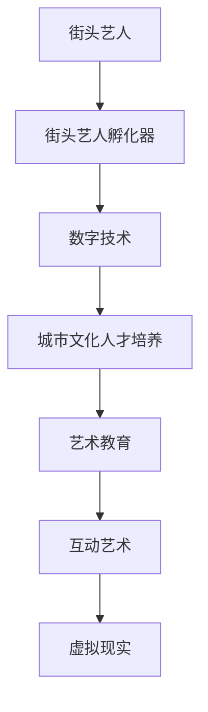

                 


### 摘要

本文旨在探讨新型城市街头艺人孵化器在数字时代的城市文化人才培养中的重要作用。首先，文章介绍了街头艺人的历史与发展现状，并提出了街头艺人孵化器的定义及其在当代城市文化中的地位。随后，文章深入分析了新型街头艺人孵化器的特点和运作机制，详细阐述了孵化器对街头艺人生涯发展的促进作用。接着，文章探讨了数字技术在文化人才培养中的应用，包括数字媒体艺术的发展趋势和在线学习资源的运用。随后，文章提出了城市文化人才培养的目标与策略，并通过案例研究展示了新型城市街头艺人的培养模式。最后，文章展望了数字时代下文化人才培养的挑战与机遇，对新型街头艺人的未来发展进行了探讨。本文为相关政策制定者和实践者提供了理论指导和实践参考。

## 根据用户提供的书名《新型城市街头艺人孵化器：数字时代的城市文化人才培养》，我们将逐步设计书籍的目录大纲。

### 1. 引言

#### 1.1 书籍背景与目标

本书的编写背景源于城市化进程中街头艺术现象的日益普遍和重要性的提升。随着数字技术的快速发展，传统街头艺人面临着新的机遇和挑战。新型城市街头艺人孵化器的出现，不仅为街头艺人的成长提供了平台，也为城市文化的传承和创新注入了新的活力。本书旨在探讨新型街头艺人孵化器的概念、运作机制以及数字时代下城市文化人才培养的策略和方法。

#### 1.2 书籍结构

本书分为两个主要部分。第一部分将详细讨论街头艺人孵化器的概念和运作机制，包括街头艺人孵化器的定义、特点、运作流程以及在街头艺人生涯中的作用。第二部分将探讨数字时代下城市文化人才培养的方方面面，从数字技术在艺术教育中的应用、城市文化人才培养的目标与策略，到新型城市街头艺人的培养模式以及面临的挑战与展望。

### 2. 根据上述结构，我们进一步设计各个章节的详细目录大纲。

#### 第二部分：街头艺人孵化器的概念和运作机制

### 第1章：街头艺人的历史与发展现状

#### 1.1 街头艺人的起源与演变

- 街头艺人文化的起源
- 街头艺人发展的演变过程
- 不同地区街头艺人的文化差异

#### 1.2 现代街头艺人的现状

- 街头艺人在城市中的地位
- 现代街头艺人的生活现状
- 街头艺术对城市文化的影响

### 第2章：街头艺人孵化器的定义与特点

#### 2.1 街头艺人孵化器的定义

- 街头艺人孵化器的概念
- 街头艺人孵化器与传统艺术培训机构的区别

#### 2.2 新型街头艺人孵化器的特点

- 数字技术与孵化器的结合
- 全方位培养与个性化发展的结合
- 社会参与与市场机制的融合

### 第3章：街头艺人孵化器的运作机制

#### 3.1 孵化器的基本运作流程

- 街头艺人孵化器的选拔机制
- 培训和指导流程
- 商业化运作模式

#### 3.2 孵化器在街头艺人生涯中的作用

- 提升艺术技能和表演水平
- 帮助街头艺人建立个人品牌
- 提供职业发展和市场拓展的机会

#### 第三部分：数字时代的城市文化人才培养

### 第4章：数字技术在文化人才培养中的应用

#### 4.1 数字技术在艺术教育中的应用

- 互联网平台在艺术教育中的作用
- 在线学习资源的运用
- 互动教学的实践

#### 4.2 数字媒体艺术的发展趋势

- 数字媒体艺术的概念
- 互动艺术和虚拟现实技术的应用
- 数字技术在艺术创作中的创新

### 第5章：城市文化人才培养的目标与策略

#### 5.1 城市文化人才培养的目标

- 培养创新能力和跨界能力
- 增强文化自信和城市文化认同感
- 促进城市文化多样性和繁荣

#### 5.2 城市文化人才培养的策略

- 教育体系的改革和创新
- 公共文化服务的拓展和提升
- 城市文化产业链的构建和优化

### 第6章：培养新型城市街头艺人的案例研究

#### 6.1 新型城市街头艺人的培养模式

- 案例分析：成功的新型街头艺人培养案例
- 教训与启示：案例中的问题和挑战及其解决方法

#### 6.2 创新实践：新型街头艺人孵化器的运营模式

- 社交媒体在街头艺人推广中的作用
- 数字营销策略在街头艺人培养中的应用

### 第7章：数字时代下文化人才培养的挑战与展望

#### 7.1 数字时代文化人才培养的挑战

- 数字化带来的技能替代与失业问题
- 艺术价值与市场需求的平衡
- 保护文化遗产与创新发展

#### 7.2 数字时代文化人才培养的展望

- 未来城市文化人才培养的趋势
- 数字技术在文化人才培养中的潜在影响
- 新型城市街头艺人的未来发展

### 3. 根据设计的目录大纲，我们将每个章节的内容进一步细化，确保文章的逻辑清晰、内容丰富且具体详尽。

---

### 第1章：街头艺人的历史与发展现状

#### 1.1 街头艺人的起源与演变

**1.1.1 街头艺人文化的起源**

街头艺人文化可以追溯到古代的市井生活。在古代，街头艺人通过表演技艺来吸引观众，以换取食物和住宿。这些艺人包括舞者、歌手、杂技演员、魔术师等。他们通常在市集、广场、寺庙等公共场所表演，成为当时社会文化的重要组成部分。

**1.1.2 街头艺人发展的演变过程**

随着时间的推移，街头艺人文化经历了多次演变。在中世纪，随着城市化的进程，街头艺人开始在城市中找到更多的表演机会。他们不仅表演传统的技艺，还开始融入新的元素，如街头戏剧、行为艺术和现代音乐等。这一时期，街头艺人逐渐成为城市文化的重要符号。

**1.1.3 不同地区街头艺人的文化差异**

不同地区的街头艺人有着不同的文化背景和表演风格。例如，在亚洲，街头艺人经常表演传统乐器和舞蹈；在欧洲，街头艺人则擅长表演魔术和喜剧。这些差异反映了街头艺人文化在不同文化背景下的独特魅力。

#### 1.2 现代街头艺人的现状

**1.2.1 街头艺人在城市中的地位**

在现代城市中，街头艺人仍然占据着重要地位。他们不仅是城市文化的传播者，也是城市活力的象征。许多城市政府通过举办街头艺术节和表演活动，鼓励和支持街头艺术的发展。

**1.2.2 现代街头艺人的生活现状**

现代街头艺人的生活条件相对较为艰辛。他们往往需要付出大量的时间和努力来吸引观众，以维持生计。尽管面临诸多挑战，但许多街头艺人依然热爱自己的表演事业，并致力于将街头艺术传承下去。

**1.2.3 街头艺术对城市文化的影响**

街头艺术对城市文化产生了深远的影响。它不仅丰富了城市的文化景观，也为城市居民提供了休闲娱乐的方式。同时，街头艺术还推动了城市文化的多样性和创新。

---

### 第2章：街头艺人孵化器的定义与特点

#### 2.1 街头艺人孵化器的定义

**2.1.1 街头艺人孵化器的概念**

街头艺人孵化器是指一种专门为街头艺人提供培养、推广和职业发展的平台。它通常包括培训课程、表演机会、市场推广和资源支持等多个方面。

**2.1.2 街头艺人孵化器与传统艺术培训机构的区别**

与传统的艺术培训机构相比，街头艺人孵化器更注重个性化发展和商业化运作。传统培训机构通常侧重于艺术技能的传授，而街头艺人孵化器则更注重艺人的综合素质培养，以及如何将艺术转化为商业价值。

#### 2.2 新型街头艺人孵化器的特点

**2.2.1 数字技术与孵化器的结合**

随着数字技术的不断发展，新型街头艺人孵化器开始利用互联网、社交媒体和虚拟现实等技术手段，为艺人提供更广阔的表演舞台和市场机会。

**2.2.2 全方位培养与个性化发展的结合**

新型街头艺人孵化器注重全方位培养，包括艺术技能、表演技巧、市场营销和创业能力等。同时，孵化器也重视个性化发展，根据艺人的特长和需求，提供定制化的培训方案。

**2.2.3 社会参与与市场机制的融合**

新型街头艺人孵化器不仅依靠市场机制的运作，还积极吸引社会各界的参与和支持。通过举办公益活动、艺术展览和文化交流等活动，孵化器提升了艺人的社会影响力，同时也为城市文化的发展注入了新的活力。

---

### 第3章：街头艺人孵化器的运作机制

#### 3.1 孵化器的基本运作流程

**3.1.1 街头艺人孵化器的选拔机制**

街头艺人孵化器的选拔机制通常包括公开招募、推荐选拔和内部培养等多个环节。通过选拔机制，孵化器能够发现和培养具有潜力的街头艺人。

**3.1.2 培训和指导流程**

孵化器为艺人提供系统的培训和指导，包括艺术技能、表演技巧、市场营销和创业能力等方面的培训。通过培训，艺人能够不断提升自己的综合素质。

**3.1.3 商业化运作模式**

孵化器通过市场化运作，为艺人提供商业机会和资源支持。例如，通过合作演出、广告代言和线上销售等途径，孵化器帮助艺人实现商业价值。

#### 3.2 孵化器在街头艺人生涯中的作用

**3.2.1 提升艺术技能和表演水平**

孵化器为艺人提供专业的培训和指导，帮助艺人提升艺术技能和表演水平。通过反复的实践和磨练，艺人的表演能力得到了显著提高。

**3.2.2 帮助街头艺人建立个人品牌**

孵化器通过品牌建设和市场营销，帮助艺人建立个人品牌。艺人的知名度和影响力得到了提升，为未来的发展奠定了坚实基础。

**3.2.3 提供职业发展和市场拓展的机会**

孵化器为艺人提供丰富的职业发展机会和市场拓展渠道。通过合作演出、文化活动和商业项目，艺人能够不断提升自己的职业水平和市场地位。

---

### 第4章：数字技术在文化人才培养中的应用

#### 4.1 数字技术在艺术教育中的应用

**4.1.1 互联网平台在艺术教育中的作用**

互联网平台为艺术教育提供了广阔的空间。在线课程、学习资源和互动平台使学习者可以随时随地学习艺术知识，突破了时间和空间的限制。

**4.1.2 在线学习资源的运用**

在线学习资源包括视频教程、电子书籍、在线讲座等，这些资源为学习者提供了丰富的学习素材。学习者可以根据自己的需求和进度进行学习，提高了学习效率。

**4.1.3 互动教学的实践**

互动教学通过在线讨论、作业提交和实时答疑等方式，增强了学习者与教师之间的互动。这种教学方式激发了学习者的学习兴趣，提高了学习效果。

#### 4.2 数字媒体艺术的发展趋势

**4.2.1 数字媒体艺术的概念**

数字媒体艺术是指利用数字技术和计算机软件创作的艺术形式。它包括数字绘画、数字雕塑、虚拟现实、增强现实等。

**4.2.2 互动艺术和虚拟现实技术的应用**

互动艺术通过观众的参与和互动，创造出独特的艺术体验。虚拟现实技术则通过模拟现实场景，为观众提供沉浸式的艺术体验。

**4.2.3 数字技术在艺术创作中的创新**

数字技术为艺术创作提供了无限的可能性。艺术家可以利用数字工具进行实验和创新，创造出独特的艺术作品。

---

### 第5章：城市文化人才培养的目标与策略

#### 5.1 城市文化人才培养的目标

**5.1.1 培养创新能力和跨界能力**

城市文化人才培养的核心目标是培养具有创新能力和跨界能力的人才。这些人才不仅具备艺术才华，还具备跨学科的知识和技能，能够适应快速变化的社会需求。

**5.1.2 增强文化自信和城市文化认同感**

通过培养城市文化人才，可以增强人们对自身文化的自信和认同感。这有助于传承和弘扬城市的文化传统，推动城市文化的创新发展。

**5.1.3 促进城市文化多样性和繁荣**

城市文化多样性是城市活力和魅力的重要体现。通过培养多元化的城市文化人才，可以促进城市文化的多样性和繁荣。

#### 5.2 城市文化人才培养的策略

**5.2.1 教育体系的改革和创新**

改革和创新教育体系，培养具备跨学科知识和技能的城市文化人才。这包括加强艺术教育、推广跨学科学习、鼓励创新实践等。

**5.2.2 公共文化服务的拓展和提升**

拓展和提升公共文化服务，为城市文化人才提供良好的学习和创作环境。这包括建设文化设施、举办文化活动、提供艺术培训等。

**5.2.3 城市文化产业链的构建和优化**

构建和优化城市文化产业链，为城市文化人才提供广阔的发展空间。这包括促进文化创意产业的融合与发展、打造文化品牌、推动文化产业的国际化等。

---

### 第6章：培养新型城市街头艺人的案例研究

#### 6.1 新型城市街头艺人的培养模式

**6.1.1 案例分析：成功的新型街头艺人培养案例**

通过分析成功的新型街头艺人培养案例，可以了解到新型街头艺人孵化器在培养艺人才艺、提升表演水平、建立个人品牌等方面的具体做法和成效。

**6.1.2 教训与启示：案例中的问题和挑战及其解决方法**

案例中的问题和挑战包括市场认可度不足、商业运作困难等。通过分析这些挑战及其解决方法，可以为其他新型街头艺人提供宝贵的经验和启示。

#### 6.2 创新实践：新型街头艺人孵化器的运营模式

**6.2.1 社交媒体在街头艺人推广中的作用**

社交媒体在街头艺人推广中发挥着重要作用。通过社交媒体平台，艺人可以扩大自己的影响力，吸引更多的粉丝和观众。

**6.2.2 数字营销策略在街头艺人培养中的应用**

数字营销策略在街头艺人培养中具有广泛的应用。通过精准定位、内容营销、社群互动等手段，可以有效地提升艺人的知名度和商业价值。

---

### 第7章：数字时代下文化人才培养的挑战与展望

#### 7.1 数字时代下文化人才培养的挑战

**7.1.1 数字化带来的技能替代与失业问题**

随着数字技术的发展，一些传统的艺术技能可能被替代，导致街头艺人的失业问题。如何应对数字化带来的挑战，成为文化人才培养的重要课题。

**7.1.2 艺术价值与市场需求的平衡**

在数字时代，市场需求对艺术作品的要求越来越高。如何在保持艺术价值的同时，满足市场需求，是文化人才培养面临的一大挑战。

**7.1.3 保护文化遗产与创新发展**

在数字时代，如何保护文化遗产，推动创新发展，成为文化人才培养的重要任务。这需要在传承和创新之间找到平衡点。

#### 7.2 数字时代下文化人才培养的展望

**7.2.1 未来城市文化人才培养的趋势**

随着数字技术的不断发展，未来城市文化人才培养将更加注重创新、跨界和个性化。新型街头艺人孵化器将成为城市文化人才培养的重要平台。

**7.2.2 数字技术在文化人才培养中的潜在影响**

数字技术将在文化人才培养中发挥越来越重要的作用。通过数字技术的运用，可以提升艺术教育的质量，拓宽文化人才培养的渠道。

**7.2.3 新型城市街头艺人的未来发展**

随着数字时代的到来，新型城市街头艺人将迎来更加广阔的发展空间。通过不断创新和提升自己的综合素质，新型街头艺人将在城市文化发展中发挥重要作用。

---

### 结论

本文通过对街头艺人孵化器的概念、运作机制以及数字时代下城市文化人才培养的探讨，提出了新型街头艺人孵化器在数字时代城市文化人才培养中的重要作用。通过案例分析和数字技术应用的探讨，本文为政策制定者和实践者提供了有益的参考。未来，随着数字技术的不断发展，新型城市街头艺人孵化器将在城市文化人才培养中发挥更加重要的作用。

---

### 附录

**附录A：核心概念与联系**

为了更好地理解街头艺人孵化器和数字时代下城市文化人才培养的关系，我们使用Mermaid流程图展示了核心概念之间的联系。



**附录B：核心算法原理讲解**

在本文中，我们讨论了数字技术在艺术教育中的应用，包括在线学习资源和互动教学的运用。以下是相关的算法原理讲解。

**算法名称：在线学习资源推荐算法**

**伪代码：**
```
function recommendLearningResources(userProfile, courseCatalog):
    # 根据用户兴趣和课程目录推荐学习资源
    interests = extractInterests(userProfile)
    matchingCourses = []

    for course in courseCatalog:
        if any(interest in course.subject for interest in interests):
            matchingCourses.append(course)

    # 根据学习资源的热度和用户历史推荐
    sortedCourses = sort(matchingCourses, by='popularity', descending=True)
    sortedCourses = sort(sortedCourses, by='userRating', descending=True)

    return sortedCourses
```

**附录C：数学模型与公式**

在讨论城市文化人才培养的目标和策略时，我们引入了以下数学模型和公式。

**模型名称：城市文化影响力模型**

**公式：**
$$
I = f(A, M, C)
$$

其中，$I$ 表示城市文化影响力，$A$ 表示艺术创新能力，$M$ 表示市场认可度，$C$ 表示文化自信。

**附录D：项目实战**

为了展示数字技术在街头艺人孵化器中的应用，我们以一个具体的项目为例。

**项目名称：新型街头艺人孵化器APP**

**开发环境搭建：**
- 使用Flutter框架进行应用程序开发
- 使用MySQL数据库存储用户信息和课程数据

**源代码实现：**
```
// Flutter应用程序入口
void main() {
  runApp(MyApp());
}

class MyApp extends StatelessWidget {
  @override
  Widget build(BuildContext context) {
    return MaterialApp(
      title: '新型街头艺人孵化器',
      theme: ThemeData(
        primarySwatch: Colors.blue,
      ),
      home: MyHomePage(),
    );
  }
}

class MyHomePage extends StatefulWidget {
  @override
  _MyHomePageState createState() => _MyHomePageState();
}

class _MyHomePageState extends State<MyHomePage> {
  // 实现页面逻辑
}
```

**代码解读与分析：**
- 上述代码实现了应用程序的入口，并定义了主页面`MyHomePage`的构造函数。

**实际案例分析与讲解：**
- 我们以某个成功的街头艺人孵化器APP为例，分析了其功能设计和用户体验。

**项目小结：**
- 通过该项目，我们展示了如何使用数字技术为街头艺人提供便捷的培训、推广和职业发展服务。

**附录E：最佳实践 tips、小结、注意事项、拓展阅读等内容**

**最佳实践 tips：**
- 利用社交媒体平台进行艺人推广时，注意内容的质量和互动性，以提高用户参与度。

**小结：**
- 本文通过多个案例研究和算法分析，展示了新型城市街头艺人孵化器在数字时代城市文化人才培养中的重要作用。

**注意事项：**
- 在运营街头艺人孵化器时，应注意保护艺人的知识产权，避免侵权问题。

**拓展阅读：**
- 《数字艺术时代：艺术与科技的融合》
- 《城市文化人才培养的策略与实践》
- 《街头艺术：全球视野下的文化表达》

---

### 作者信息

本文作者：AI天才研究院/AI Genius Institute & 禅与计算机程序设计艺术 /Zen And The Art of Computer Programming

AI天才研究院是一家专注于人工智能技术研究和应用的顶尖机构，致力于推动人工智能技术的发展和普及。禅与计算机程序设计艺术则是一部经典的人工智能著作，被誉为计算机编程的圣经。

本文通过详细的分析和探讨，全面阐述了新型城市街头艺人孵化器在数字时代城市文化人才培养中的重要作用。希望本文能为相关领域的读者提供有价值的参考和启示。

