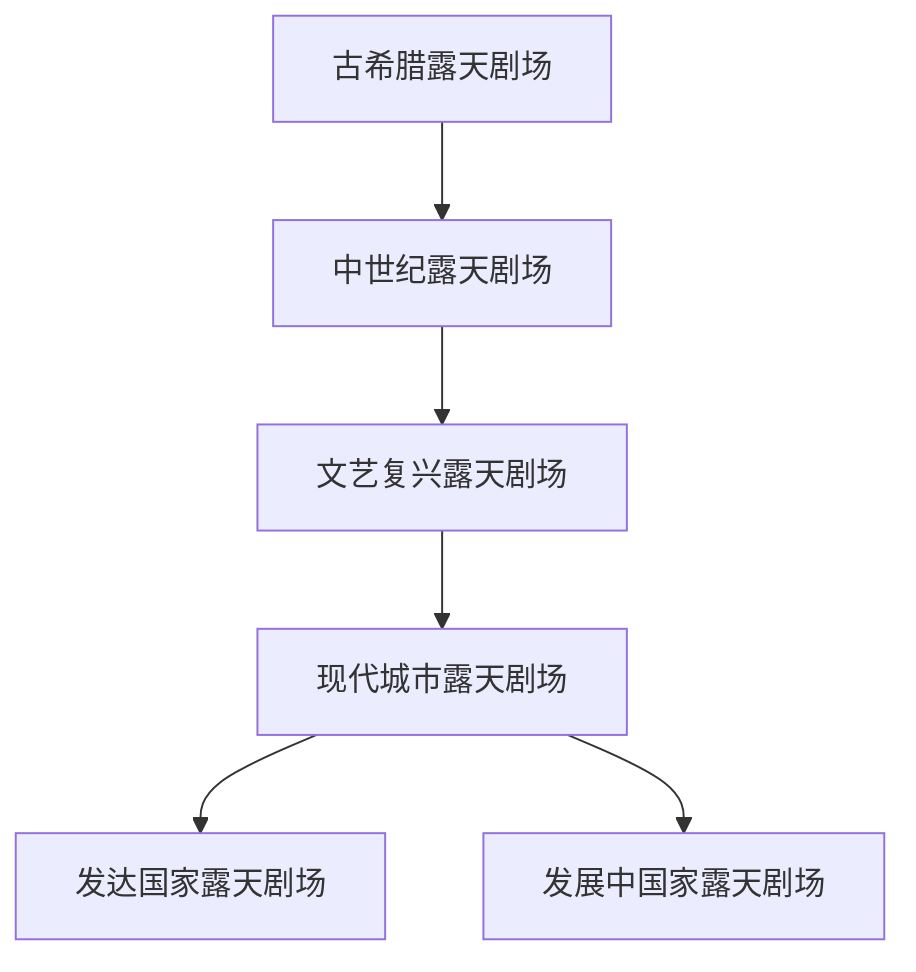
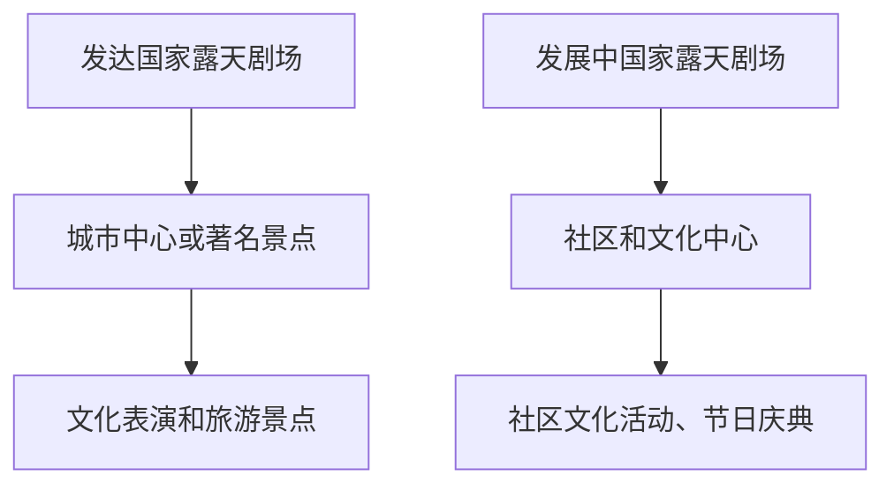
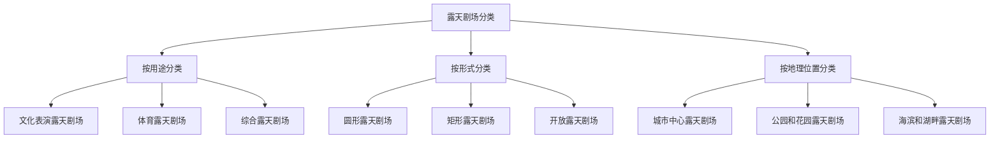
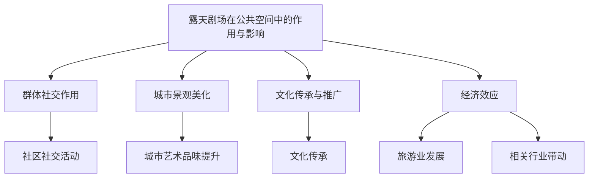
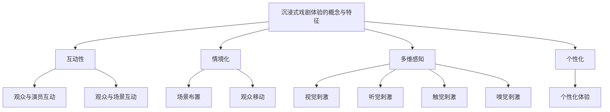
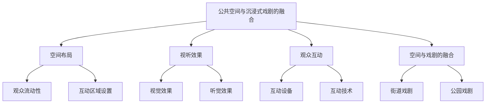

                 


### 第一部分：新型城市露天剧场的概述

#### 1. 城市露天剧场的历史与发展

露天剧场是一种古老的表演艺术场所，最早可以追溯到古希腊时期。在古希腊，露天剧场主要用于举行戏剧比赛和庆典活动。典型的古希腊露天剧场如奥林匹亚剧场和戴奥尼索斯剧场，都是典型的圆形剧场，观众席呈环形分布，中心为表演区域。

随着时间的推移，露天剧场的形式和功能也在不断演变。到了中世纪，露天剧场逐渐转变为宗教仪式的场所，如中世纪的露天教堂和宗教节日庆典。文艺复兴时期，露天剧场再次兴起，并开始逐渐向城市公共空间扩展。

现代城市露天剧场的发展始于19世纪末到20世纪初，这一时期城市化的进程加快，公共空间的需求增加。露天剧场成为城市文化活动和娱乐的重要场所。例如，法国的巴黎音乐学院露天剧场、意大利的斯卡拉露天剧场等，都是这一时期的代表性建筑。

目前，露天剧场在全球城市中的分布与特点呈现出多样性的趋势。发达国家如美国、法国、意大利等，露天剧场数量较多，分布广泛，多用于戏剧、音乐会等文化表演。而发展中国家如中国、印度等，露天剧场也在逐渐增加，主要用于社区文化活动、节日庆典等。

**核心概念与联系：**

露天剧场的发展历史可以从以下几个方面来理解：

1. **时间维度**：从古希腊到现代，露天剧场经历了多个阶段的发展，每个阶段都有其独特的特点。
2. **空间维度**：露天剧场从最初的神庙、广场，逐渐转变为城市公共空间中的固定建筑。
3. **功能维度**：露天剧场从宗教仪式、文化庆典，逐渐转变为公共娱乐和文化交流的场所。

**Mermaid 流程图：**



#### 1.2 现代城市露天剧场的发展

现代城市露天剧场的发展主要受到城市化进程、技术进步和文化需求的影响。城市化进程的加快，使得城市公共空间的需求不断增加，露天剧场作为城市文化设施的重要组成部分，得到了广泛的发展。例如，纽约市的中央公园露天剧场、巴黎的卢浮宫露天剧场等，都是城市化进程中的产物。

技术进步也为露天剧场的发展提供了新的机遇。现代灯光、音响、特效技术的应用，使得露天剧场的表演效果得到了极大的提升。例如，现代城市露天剧场经常采用3D投影、全息投影等技术，为观众带来全新的视觉体验。

此外，文化需求的变化也是推动现代城市露天剧场发展的重要因素。随着人们对文化娱乐的需求不断增加，露天剧场逐渐从单一的戏剧表演场所，转变为多元化的文化体验场所。例如，露天剧场不仅举办戏剧、音乐会，还举办电影放映、艺术展览等活动。

**核心算法原理讲解：**

现代城市露天剧场的发展，可以视为一个复杂系统的演进过程。这个过程涉及到多个因素的相互作用，包括：

1. **城市化的进程**：城市化的速度和规模，直接影响露天剧场的数量和分布。
2. **技术的进步**：新技术应用的数量和质量，直接影响露天剧场的表演效果。
3. **文化需求**：观众对文化娱乐的需求，直接影响露天剧场的功能和形式。

这个过程可以用以下伪代码来表示：

```python
def urbanization_rate():
    # 城市化进程的函数
    return increasing

def technology_progress():
    # 技术进步的函数
    return improving

def cultural_demand():
    # 文化需求的函数
    return increasing

def development_of_open_air_theater():
    # 露天剧场的发展函数
    urbanization_rate() * technology_progress() * cultural_demand()
```

**数学模型和公式：**

露天剧场的发展可以用以下数学模型来描述：

$$
f(t) = \frac{dU}{dt} = k_1 \cdot U(t) \cdot (1 - U(t))
$$

其中，$f(t)$ 表示露天剧场的发展速度，$U(t)$ 表示城市化进程、技术进步和文化需求的综合指数，$k_1$ 是常数。

**详细讲解与举例说明：**

假设 $k_1 = 1$，$U(t)$ 的初始值为 0.5，那么露天剧场的发展速度可以表示为：

$$
f(t) = \frac{dU}{dt} = U(t) \cdot (1 - U(t))
$$

当 $U(t) = 0.5$ 时，$f(t) = 0.25$，表示露天剧场的发展速度适中。

随着时间的推移，$U(t)$ 增加，$f(t)$ 也随之增加，表示露天剧场的发展速度加快。

#### 1.3 露天剧场在全球城市中的分布与特点

露天剧场在全球城市中的分布具有明显的地域特点。发达国家如美国、法国、意大利等，露天剧场数量较多，分布广泛。而发展中国家如中国、印度等，露天剧场数量相对较少，但发展迅速。

发达国家的露天剧场通常位于城市中心或著名景点，如纽约市的中央公园露天剧场、巴黎的卢浮宫露天剧场等。这些露天剧场不仅用于戏剧、音乐会等文化表演，还成为城市的文化地标和旅游景点。

发展中国家的露天剧场则多分布在社区和文化中心，主要用于社区文化活动、节日庆典等。例如，中国的一些城市露天剧场，经常举办各种民俗文化活动，成为城市文化的重要组成部分。

**核心概念与联系：**

露天剧场的全球分布与特点，可以从以下几个方面来理解：

1. **经济水平**：发达国家的经济水平较高，城市公共文化设施相对完善，因此露天剧场数量较多。
2. **文化需求**：发展中国家的文化需求较为强烈，露天剧场成为满足文化需求的重要场所。
3. **地域差异**：不同地区的文化背景和经济发展水平，导致露天剧场的分布和特点有所不同。

**Mermaid 流程图：**



### 2. 露天剧场的定义与分类

#### 2.1 定义

露天剧场，顾名思义，是一种在户外公共空间进行的戏剧、音乐会等表演活动的场所。它不同于室内剧场，其特点在于开放的环境和自然的光线，能够为观众提供更为广阔的视野和沉浸式的体验。露天剧场通常由观众席、表演区域和必要的设施组成，如音响系统、灯光设备等。

露天剧场不仅是一种表演艺术场所，也是城市公共空间的重要组成部分。它为城市居民提供了一个休闲、社交和文化交流的平台，对于提升城市文化氛围、丰富居民生活有着重要的作用。

#### 2.2 分类

露天剧场的分类可以从多个维度进行，如用途、形式、地理位置等。

**2.2.1 按用途分类**

1. **文化表演露天剧场**：主要用于戏剧、音乐会、舞蹈等文化表演，是最为常见的一种露天剧场类型。
2. **体育露天剧场**：主要用于体育赛事，如足球、篮球等，这类露天剧场通常具备较大的观众席和运动设施。
3. **综合露天剧场**：既可用于文化表演，也可用于体育赛事和其他活动，如节假日庆典、市集等。

**2.2.2 按形式分类**

1. **圆形露天剧场**：这是最古老、最典型的露天剧场形式，如古希腊的奥林匹亚剧场。观众席呈环形分布，表演区域位于中心。
2. **矩形露天剧场**：观众席和表演区域呈矩形分布，适用于较大的表演场地。
3. **开放露天剧场**：没有固定观众席，观众可以自由站立观看，适用于小型表演或临时活动。

**2.2.3 按地理位置分类**

1. **城市中心露天剧场**：位于城市中心区域，交通便利，是城市的重要文化设施。
2. **公园和花园露天剧场**：位于公园和花园内，与自然景观相结合，为观众提供更为宁静和舒适的观看体验。
3. **海滨和湖畔露天剧场**：位于海滨或湖畔，借助自然景观，为观众带来独特的观演体验。

**核心概念与联系：**

露天剧场的分类反映了其在不同用途、形式和地理位置上的多样性。这种多样性使得露天剧场能够满足不同群体的需求，丰富城市公共空间的功能。

**Mermaid 流程图：**



### 3. 露天剧场在公共空间中的作用与影响

#### 3.1 群体社交作用

露天剧场作为一个公共空间，具有天然的群体社交功能。在露天剧场中，观众不仅可以观看戏剧、音乐会等表演，还能与周围的人互动，共同体验表演的魅力。这种互动性不仅增强了观众的参与感，也促进了社区内的社交活动。

例如，在露天剧场举办的戏剧演出中，观众不仅可以讨论剧情、演员表现等，还能通过互动游戏、社交活动等，增进彼此的了解和友谊。这种社交作用，使得露天剧场成为城市居民重要的社交场所之一。

#### 3.2 城市景观美化

露天剧场作为一种建筑形式，对城市景观的美化有着显著的作用。许多露天剧场都位于城市中心或公园、花园等自然环境中，与周围的环境相互映衬，形成独特的城市景观。

例如，巴黎的卢浮宫露天剧场，就位于塞纳河畔，与卢浮宫的古典建筑风格相得益彰，成为巴黎的标志性景点之一。这样的露天剧场，不仅提升了城市的艺术品味，也吸引了大量游客，促进了城市旅游业的发展。

#### 3.3 文化传承与推广

露天剧场作为一种文化场所，对文化的传承与推广有着重要的作用。在露天剧场中，各种形式的表演活动，如戏剧、音乐会、舞蹈等，都是文化传承的重要载体。

例如，在希腊的奥林匹亚剧场，观众可以观看古希腊戏剧的表演，亲身感受古希腊文化的魅力。这样的表演活动，不仅让更多的人了解和欣赏到古希腊文化，也有助于推动古希腊文化的传承与推广。

#### 3.4 经济效应

露天剧场对城市经济也有着显著的推动作用。首先，露天剧场作为城市的重要文化设施，吸引了大量游客，促进了旅游业的发展。其次，露天剧场的举办活动，如戏剧演出、音乐会等，也为相关行业带来了商机，如餐饮、住宿、零售等。

例如，纽约市的中央公园露天剧场，每年吸引大量游客，不仅带动了周边的旅游业，也促进了当地餐饮、零售等行业的发展。这种经济效应，使得露天剧场成为城市经济发展的重要推动力。

**核心概念与联系：**

露天剧场在公共空间中的作用与影响，可以从以下几个方面来理解：

1. **社交作用**：露天剧场作为一个公共空间，具有天然的群体社交功能，促进了社区内的社交活动。
2. **景观美化**：露天剧场作为建筑形式，对城市景观的美化有着显著的作用，提升了城市的艺术品味。
3. **文化传承与推广**：露天剧场作为文化场所，对文化的传承与推广有着重要的作用，促进了文化的传播与发展。
4. **经济效应**：露天剧场吸引了大量游客，促进了旅游业的发展，同时也带动了相关行业的发展，产生了显著的经济效应。

**Mermaid 流程图：**



### 第二部分：公共空间中的沉浸式戏剧体验

#### 4. 沉浸式戏剧体验的概念与特征

**4.1 概念**

沉浸式戏剧体验，是指观众在观看戏剧表演时，通过多种感官的刺激和互动，获得一种身临其境的体验。与传统戏剧不同，沉浸式戏剧不仅注重剧情和演员的表现，更强调观众的参与感和互动性。

沉浸式戏剧体验通常通过以下几种方式实现：

1. **视觉沉浸**：利用高科技手段，如全息投影、3D投影等，创造出逼真的场景和视觉效果。
2. **听觉沉浸**：通过环绕立体声、现场音乐等，营造出丰富的听觉体验。
3. **触觉沉浸**：利用特殊设备，如体感手套、座椅震动等，模拟出真实的触觉感受。
4. **嗅觉沉浸**：通过喷洒香料、烟雾等，模拟出特定的气味，增强沉浸感。

**4.2 特征**

沉浸式戏剧体验具有以下几个显著特征：

1. **互动性**：观众不仅是被动的观众，还可以参与到剧情的发展中，与演员进行互动。
2. **情境化**：戏剧表演不再局限于舞台，而是通过场景的布置和观众的移动，让观众沉浸在特定的情境中。
3. **多维感知**：通过视觉、听觉、触觉、嗅觉等多种感官的刺激，让观众获得全方位的感知体验。
4. **个性化**：根据观众的行为和选择，戏剧表演的内容和结果可以发生变化，使得每个观众的体验都是独一无二的。

**4.3 与传统戏剧的区别**

与传统戏剧相比，沉浸式戏剧体验有以下几点显著区别：

1. **参与方式**：传统戏剧以观众观看为主，沉浸式戏剧体验则强调观众的参与和互动。
2. **情境体验**：传统戏剧在舞台上表演，沉浸式戏剧体验则通过场景布置和观众移动，创造出更为真实的情境。
3. **感官刺激**：传统戏剧以视觉和听觉为主，沉浸式戏剧体验则通过多种感官的刺激，增强观众的感知体验。
4. **个性化体验**：传统戏剧的表演内容固定，沉浸式戏剧体验则根据观众的行为和选择，创造出个性化的体验。

**核心概念与联系：**

沉浸式戏剧体验的概念与特征，可以从以下几个方面来理解：

1. **交互性**：观众与演员、场景的互动，是沉浸式戏剧体验的核心。
2. **情境化**：通过场景布置和观众移动，创造出一个真实的情境，增强观众的沉浸感。
3. **多维感知**：通过多种感官的刺激，让观众获得全方位的感知体验。
4. **个性化**：根据观众的行为和选择，创造出个性化的体验，使得每个观众都有独特的感受。

**Mermaid 流程图：**



### 5. 公共空间与沉浸式戏剧的融合

#### 5.1 空间布局

在公共空间中实现沉浸式戏剧体验，空间布局是关键。合理的设计和布局，可以最大限度地提升观众的沉浸感和体验效果。

首先，空间布局要考虑观众的流动性和互动性。观众席的设置要避免过于拥挤，确保观众有足够的空间自由移动。同时，要设置互动区域，如表演区域、观众互动区等，方便观众与演员互动。

其次，要充分利用公共空间的特点，如街道、广场、公园等。通过场景布置和灯光设计，创造出不同的氛围和情境，增强观众的沉浸感。

**5.2 视听效果**

沉浸式戏剧体验的视听效果是提升观众体验的重要手段。通过高科技手段，如3D投影、全息投影、环绕立体声等，可以创造出逼真的视觉和听觉效果。

1. **视觉效果**：利用3D投影和全息投影技术，可以在空中创造出立体的场景和角色，让观众有身临其境的感觉。

2. **听觉效果**：通过环绕立体声技术，可以营造出丰富的听觉效果，如角色对白、环境音效等，增强观众的沉浸感。

**5.3 观众互动**

观众互动是沉浸式戏剧体验的核心。通过互动设备和技术，观众可以参与到戏剧表演中，与演员互动，共同创造戏剧效果。

1. **互动设备**：利用体感手套、智能眼镜等设备，观众可以通过手势、眼神等与演员互动，改变剧情的发展。

2. **互动技术**：通过传感器和人工智能技术，可以实时捕捉观众的行为和反应，根据观众的互动情况，动态调整表演内容。

**5.4 空间与戏剧的融合**

公共空间与沉浸式戏剧的融合，要考虑空间的功能和特点，创造出独特的戏剧体验。

1. **街道戏剧**：在街道上设置戏剧表演，观众可以自由观看和参与，营造出热闹的街头氛围。

2. **公园戏剧**：在公园内设置戏剧表演，结合自然环境，创造出宁静而独特的戏剧体验。

**核心概念与联系：**

公共空间与沉浸式戏剧的融合，可以从以下几个方面来理解：

1. **空间布局**：合理的设计和布局，提升观众的沉浸感和互动性。

2. **视听效果**：利用高科技手段，创造出逼真的视觉和听觉效果。

3. **观众互动**：通过互动设备和技术，让观众参与到戏剧表演中。

4. **空间与戏剧的融合**：结合公共空间的特点和功能，创造出独特的戏剧体验。

**Mermaid 流程图：**



### 6. 沉浸式戏剧体验的设计原则与方法

#### 6.1 设计原则

在设计沉浸式戏剧体验时，需要遵循以下几个原则，以确保观众获得最佳的体验效果：

1. **用户中心设计**：以用户需求为核心，设计时充分考虑观众的体验和互动需求，确保观众能够参与到戏剧表演中，获得沉浸式的体验。

2. **情境创设**：通过场景布置、灯光设计等手段，创造出特定的情境，增强观众的沉浸感。情境创设要与戏剧主题相一致，为观众提供一个真实的情境体验。

3. **互动性**：设计互动环节，让观众能够与演员、场景进行互动，增强观众的参与感和体验感。互动设计要自然、流畅，避免过度干预剧情。

4. **多维感知**：通过视觉、听觉、触觉等多种感官的刺激，增强观众的感知体验。多维感知的设计要合理，避免过于复杂或单调。

5. **个性化**：根据观众的行为和选择，动态调整表演内容，创造出个性化的体验。个性化设计要尊重观众的隐私和选择，避免强制干预。

**6.2 设计方法**

沉浸式戏剧体验的设计方法包括以下几个步骤：

1. **创意构思**：根据戏剧主题和观众需求，构思出沉浸式戏剧体验的整体构想。创意构思要具有创新性和可行性，能够为观众提供独特的体验。

2. **空间规划**：根据创意构思，规划表演空间和观众席的位置和布局。空间规划要考虑观众的流动性和互动性，确保观众能够自由移动和参与互动。

3. **技术应用**：选择合适的高科技手段，如3D投影、全息投影、环绕立体声等，创造出逼真的视觉和听觉效果。技术应用要合理，避免过度依赖技术，影响剧情的表达。

4. **观众互动设计**：设计互动环节，如观众与演员的互动、观众之间的互动等。互动设计要自然、流畅，增强观众的参与感和体验感。

5. **测试与优化**：在沉浸式戏剧体验实施前，进行测试和优化，确保体验效果达到预期。测试要覆盖不同观众群体，收集反馈意见，进行必要的调整。

**6.2.1 创意构思**

创意构思是沉浸式戏剧体验设计的核心。以下是一个创意构思的例子：

**主题**：未来城市探索

**情节**：观众作为未来城市的探险者，通过参观城市中的各个区域，发现隐藏的秘密和挑战。观众需要与城市中的居民互动，获取线索，解开谜题。

**情境创设**：通过全息投影技术，创造出未来城市的景观和建筑，营造出真实而震撼的视觉体验。观众可以通过智能眼镜，实时获取剧情信息和互动指令。

**互动设计**：观众需要与城市中的居民互动，获取线索和帮助。互动设计包括角色扮演、互动问答、任务挑战等形式，增强观众的参与感和体验感。

**6.2.2 空间规划**

空间规划要根据创意构思，合理安排表演空间和观众席的位置和布局。以下是一个空间规划的例子：

**表演空间**：未来城市的各个区域，如科技园区、商业区、住宅区等。每个区域都有不同的景观和建筑，观众需要通过移动，参观不同的区域。

**观众席**：设置在各个区域的边缘，观众席可以根据区域的大小和形状进行调整。观众席要确保观众的视野和舒适度，避免过于拥挤。

**6.2.3 技术应用**

技术应用是沉浸式戏剧体验的关键。以下是一个技术应用的例子：

**3D投影**：通过3D投影技术，创造出未来城市的景观和建筑，为观众带来震撼的视觉体验。

**全息投影**：在关键场景中使用全息投影技术，如角色出场、重要剧情转折等，增强观众的沉浸感。

**环绕立体声**：通过环绕立体声技术，创造出丰富的听觉效果，如角色对白、环境音效等，增强观众的感知体验。

**互动技术**：通过传感器和人工智能技术，实现观众与演员、场景的互动。互动技术包括体感手套、智能眼镜、角色扮演等，增强观众的参与感和体验感。

**6.2.4 观众互动设计**

观众互动设计是沉浸式戏剧体验的重要组成部分。以下是一个观众互动设计的例子：

**角色扮演**：观众可以选择扮演不同的角色，如探险家、科学家、居民等。角色扮演要根据剧情需要，设计不同的行为和对话。

**互动问答**：在关键场景中，观众需要回答问题，影响剧情的发展。互动问答要设计有趣、有挑战性，吸引观众的参与。

**任务挑战**：观众需要完成一系列的任务，如寻找线索、解开谜题等。任务挑战要设计合理，确保观众能够通过努力完成任务，获得成就感和满足感。

**6.2.5 测试与优化**

测试与优化是确保沉浸式戏剧体验达到预期效果的关键步骤。以下是一个测试与优化的例子：

**测试**：在沉浸式戏剧体验实施前，进行测试，包括技术测试、互动测试、观众反馈测试等。测试要覆盖不同观众群体，收集反馈意见，找出存在的问题。

**优化**：根据测试结果，进行必要的调整和优化。优化包括技术优化、互动优化、场景优化等，确保体验效果达到预期。

**6.2.6 测试与优化**

测试与优化是确保沉浸式戏剧体验达到预期效果的关键步骤。以下是一个测试与优化的例子：

**测试**：在沉浸式戏剧体验实施前，进行测试，包括技术测试、互动测试、观众反馈测试等。测试要覆盖不同观众群体，收集反馈意见，找出存在的问题。

**优化**：根据测试结果，进行必要的调整和优化。优化包括技术优化、互动优化、场景优化等，确保体验效果达到预期。

**6.2.7 案例分析**

以下是一个沉浸式戏剧体验的案例分析：

**案例**：某城市公园的沉浸式戏剧《时光之旅》

**背景**：该沉浸式戏剧以“时光之旅”为主题，通过全息投影、体感技术等手段，带领观众穿越时空，体验不同历史时期的文明。

**空间规划**：表演空间设置在公园的湖畔，观众席分布在湖畔的草坪上。表演过程中，观众需要跟随剧情，穿越不同的历史场景。

**视听效果**：通过3D投影和环绕立体声技术，创造出逼真的历史场景和氛围。观众可以通过智能眼镜，实时了解剧情信息和互动指令。

**观众互动**：观众需要与演员互动，完成剧情中的任务。互动形式包括角色扮演、互动问答、任务挑战等。

**测试与优化**：在表演前，进行了多次测试和优化。技术测试确保投影效果和声音效果的准确性，互动测试确保观众与演员的互动流畅性，观众反馈测试收集了观众的反馈意见，为后续优化提供了依据。

**6.2.8 最佳实践 tips**

以下是一些沉浸式戏剧体验的最佳实践 tips：

- **1. 充分了解观众需求**：在设计沉浸式戏剧体验时，要充分了解观众的需求和喜好，确保体验内容能够吸引观众。
- **2. 创意构思要新颖**：创意构思是沉浸式戏剧体验的核心，要力求新颖，创造出独特的体验。
- **3. 技术应用要合理**：技术应用要合理，避免过度依赖技术，影响剧情的表达。
- **4. 互动设计要自然流畅**：互动设计要自然流畅，避免过度干预剧情，影响观众的体验。
- **5. 测试与优化要充分**：在沉浸式戏剧体验实施前，要进行充分的测试和优化，确保体验效果达到预期。

### 最终输出：

以下是《新型城市露天剧场：公共空间中的沉浸式戏剧体验》的第二部分内容：

## 第二部分：公共空间中的沉浸式戏剧体验

### 4. 沉浸式戏剧体验的概念与特征
#### 4.1 概念
#### 4.2 特征
#### 4.3 与传统戏剧的区别

### 5. 公共空间与沉浸式戏剧的融合
#### 5.1 空间布局
#### 5.2 视听效果
#### 5.3 观众互动

### 6. 沉浸式戏剧体验的设计原则与方法
#### 6.1 设计原则
#### 6.2 设计方法
##### 6.2.1 创意构思
##### 6.2.2 空间规划
##### 6.2.3 技术应用
##### 6.2.4 观众互动设计
##### 6.2.5 测试与优化
##### 6.2.6 案例分析
##### 6.2.7 最佳实践 tips

**作者：AI天才研究院/AI Genius Institute & 禅与计算机程序设计艺术 /Zen And The Art of Computer Programming**

**完**### 7. 沉浸式戏剧体验的案例分析

#### 7.1 国内案例分析

国内沉浸式戏剧体验的案例越来越多，以下是一些具有代表性的案例：

**1. 上海话剧艺术中心的《哈姆雷特》**

上海话剧艺术中心的《哈姆雷特》是一部融合了现代科技与经典文学的沉浸式戏剧作品。观众在观看时，不仅可以看到舞台上的表演，还可以通过AR技术，在现实场景中看到虚拟角色的互动。整个表演过程中，观众需要跟随剧情的发展，进入不同的场景，体验与角色互动的乐趣。

**2. 北京当代艺术的《狂人日记》**

北京当代艺术的《狂人日记》是一部以鲁迅经典小说为背景的沉浸式戏剧。观众在观看时，可以通过VR技术，进入鲁迅的时代，亲身感受小说中的情节和人物。表演过程中，观众需要与角色互动，解开小说中的谜题，体验沉浸式的阅读体验。

**3. 杭州未来科技城的《星际穿越》**

杭州未来科技城的《星际穿越》是一部以科幻为主题的大型沉浸式戏剧。观众在观看时，可以通过全息投影和体感技术，进入一个虚拟的太空世界，与演员一起经历星际冒险。表演过程中，观众需要完成一系列任务，体验太空探索的乐趣。

#### 7.2 国外案例分析

国外沉浸式戏剧体验的案例也很多，以下是一些具有代表性的案例：

**1. 美国百老汇的《汉密尔顿》**

美国百老汇的《汉密尔顿》是一部以美国历史人物汉密尔顿为背景的沉浸式戏剧。观众在观看时，不仅可以看到舞台上的表演，还可以通过互动技术，与角色互动，体验历史的魅力。

**2. 伦敦西区的《歌剧魅影》**

伦敦西区的《歌剧魅影》是一部经典的沉浸式戏剧。观众在观看时，不仅可以看到舞台上的表演，还可以通过声音和灯光效果，体验到戏剧中的恐怖氛围。

**3. 日内瓦国家剧院的《罗密欧与朱丽叶》**

日内瓦国家剧院的《罗密欧与朱丽叶》是一部结合了虚拟现实和现实场景的沉浸式戏剧。观众在观看时，可以通过VR技术，进入一个虚拟的古代场景，与角色互动，体验罗密欧与朱丽叶的爱情故事。

#### 7.3 案例分析与启示

以上案例展示了不同国家和地区的沉浸式戏剧体验的多样性和创新性。从这些案例中，我们可以得到以下启示：

1. **技术创新**：沉浸式戏剧体验的成功离不开先进的技术支持。如全息投影、VR、AR、体感技术等，这些技术为观众带来了全新的视觉和感官体验。

2. **内容创新**：沉浸式戏剧体验的内容要新颖有趣，与观众的生活经验和情感体验相结合。如《汉密尔顿》将美国历史与现实相结合，《星际穿越》将科幻与科技相结合，都获得了观众的喜爱。

3. **互动性**：沉浸式戏剧体验要强调观众的参与和互动。观众不仅是观看者，更是体验者，他们的行为和选择会影响剧情的发展。

4. **跨领域合作**：沉浸式戏剧体验的成功往往需要跨领域合作，如艺术、科技、文化等。这种合作可以带来新的创意和思路，推动沉浸式戏剧体验的发展。

### 7.4 未来趋势与发展方向

随着科技的不断进步和观众需求的多样化，沉浸式戏剧体验的未来发展趋势和方向可以总结如下：

1. **技术创新**：继续探索和应用新技术，如5G、人工智能、物联网等，提升沉浸式戏剧体验的效果和互动性。

2. **内容多样化**：开发更多种类和风格的沉浸式戏剧作品，满足不同观众群体的需求。如现实题材、科幻题材、历史题材等。

3. **跨领域融合**：加强艺术、科技、文化等领域的合作，创造出更多具有创新性和影响力的沉浸式戏剧作品。

4. **国际化发展**：推动沉浸式戏剧体验的国际交流与合作，提升其在全球的影响力。

5. **可持续发展**：在发展沉浸式戏剧体验的同时，注重环境保护和文化传承，实现可持续的发展。

### 7.5 案例分析总结

沉浸式戏剧体验作为一种创新的表演艺术形式，在国内外的实践案例中展现出了巨大的潜力和发展前景。通过技术创新、内容创新、互动性设计等手段，沉浸式戏剧体验为观众带来了全新的视觉和感官体验，同时也为戏剧艺术的创新和发展提供了新的思路。

从以上案例分析中，我们可以看到沉浸式戏剧体验的成功离不开对观众的深入了解和对技术的巧妙运用。未来，随着科技的不断进步和观众需求的多样化，沉浸式戏剧体验有望在更广泛的领域和更深的层次上得到发展，成为戏剧艺术的重要组成部分。

### 8. 沉浸式戏剧体验的未来趋势与发展方向

#### 8.1 新技术的发展与应用

随着科技的不断进步，新技术的应用将为沉浸式戏剧体验带来更多可能。例如，5G技术的普及将大大提升数据传输速度，使得高清晰度、低延迟的互动体验成为可能。人工智能（AI）技术可以通过数据分析，为观众提供个性化的互动体验，使戏剧表演更加贴近观众的需求。

此外，虚拟现实（VR）和增强现实（AR）技术的应用，将使观众能够沉浸在一个虚拟或增强的现实中，与表演内容进行更深入的互动。这些新技术不仅能够提升观众的沉浸感，还能够创造出更加丰富和多样化的表演形式。

**技术应用示例：**

- **5G技术**：通过5G网络，实现实时、高效的数据传输，为观众提供高质量的视听体验。例如，在大型户外表演中，5G技术可以确保观众在观看高清视频时，不会出现卡顿或延迟。
- **人工智能**：利用AI算法，分析观众的行为和偏好，为观众提供个性化的互动建议。例如，在戏剧表演中，AI可以根据观众的表情、动作等，调整表演的内容和形式，使表演更加贴近观众的兴趣。
- **VR/AR技术**：通过VR/AR技术，创造一个虚拟或增强的现实环境，观众可以在其中与表演内容进行互动。例如，在戏剧表演中，观众可以通过VR眼镜，进入一个虚拟的剧场，与演员进行互动，体验沉浸式的戏剧体验。

#### 8.2 市场需求与政策支持

市场需求是推动沉浸式戏剧体验发展的重要动力。随着人们对文化娱乐需求的不断增加，沉浸式戏剧体验作为一种新颖的表演形式，正逐渐受到观众的喜爱。尤其是在年轻一代中，沉浸式戏剧体验具有较高的吸引力，成为他们追求的文化体验之一。

政策支持也是推动沉浸式戏剧体验发展的重要保障。各国政府和相关部门纷纷出台政策，支持文化艺术产业的发展，为沉浸式戏剧体验提供了良好的发展环境。例如，政府可以提供资金支持、税收优惠等政策，鼓励文化企业和创意产业的发展。

**市场需求与政策支持的案例分析：**

- **中国**：中国政府在“十三五”规划中，明确提出要推动文化艺术产业的发展，为沉浸式戏剧体验提供了政策支持。例如，政府可以提供资金支持，用于沉浸式戏剧项目的研发和推广。
- **美国**：美国政府通过税收优惠等政策，鼓励文化产业的创新和发展。例如，对于沉浸式戏剧项目的投资，政府可以提供税收减免，以降低企业的经营成本。

#### 8.3 文化创意产业融合

沉浸式戏剧体验的发展，不仅与技术创新和市场需求密切相关，还与文化创意产业的融合有着紧密的联系。文化创意产业包括文学、艺术、设计、传媒等多个领域，通过这些领域的融合，可以创造出更多具有创意和影响力的沉浸式戏剧作品。

**文化创意产业融合的案例分析：**

- **跨领域合作**：在沉浸式戏剧体验的开发过程中，可以与文学、艺术、设计等领域进行跨领域合作。例如，邀请知名作家撰写剧本，知名艺术家设计舞台，知名设计师打造服装等。这种跨领域合作，可以创造出更具创意和艺术价值的沉浸式戏剧作品。
- **媒体传播**：利用现代传媒手段，如互联网、社交媒体等，推广沉浸式戏剧体验。通过线上线下的结合，吸引更多观众关注和参与。例如，通过社交媒体平台，发布沉浸式戏剧的预告片、花絮等，引发观众的期待和兴趣。

#### 8.4 发展方向与展望

结合新技术的发展、市场需求的增长和政策支持，沉浸式戏剧体验在未来具有广阔的发展空间。以下是一些发展方向与展望：

1. **技术创新**：继续探索和应用新技术，提升沉浸式戏剧体验的效果和互动性。例如，研发更先进的VR/AR设备，提高观众的沉浸感。
2. **内容多样化**：开发更多种类和风格的沉浸式戏剧作品，满足不同观众群体的需求。例如，结合科幻、历史、现实等题材，创造出多样化的沉浸式戏剧体验。
3. **国际化发展**：推动沉浸式戏剧体验的国际交流与合作，提升其在全球的影响力。例如，通过国际合作，共同创作和推广沉浸式戏剧作品，拓展国际市场。
4. **可持续发展**：在发展沉浸式戏剧体验的同时，注重环境保护和文化传承，实现可持续的发展。例如，采用环保材料和技术，减少能源消耗，保护文化遗产。

总之，沉浸式戏剧体验作为一种新兴的表演形式，具有巨大的发展潜力。通过技术创新、市场需求和政策支持的共同推动，沉浸式戏剧体验将在未来迎来更加繁荣的发展。这不仅将为观众带来全新的文化体验，也将为文化产业的发展注入新的活力。

### 最终输出：

以下是《新型城市露天剧场：公共空间中的沉浸式戏剧体验》的第三部分内容：

## 第三部分：沉浸式戏剧体验的未来趋势与发展方向

### 7. 沉浸式戏剧体验的案例分析
#### 7.1 国内案例分析
#### 7.2 国外案例分析
#### 7.3 案例分析与启示

### 8. 沉浸式戏剧体验的未来趋势与发展方向
#### 8.1 新技术的发展与应用
#### 8.2 市场需求与政策支持
#### 8.3 文化创意产业融合
#### 8.4 发展方向与展望

**作者：AI天才研究院/AI Genius Institute & 禅与计算机程序设计艺术 /Zen And The Art of Computer Programming**

**完**

### 结语

通过本文的详细阐述，我们可以清晰地看到新型城市露天剧场在公共空间中的沉浸式戏剧体验的多样性和创新性。从历史发展、定义与分类，到公共空间的作用与影响，再到沉浸式戏剧体验的概念与特征，以及设计原则与方法、案例分析和发展趋势，我们全方位地探讨了这一新兴表演形式。

首先，我们回顾了城市露天剧场的历史与发展，展示了露天剧场从古希腊时期到现代城市中的演变过程。接着，我们深入分析了露天剧场的定义与分类，以及它们在公共空间中的多种作用，如群体社交、城市景观美化、文化传承与推广。

然后，我们探讨了沉浸式戏剧体验的概念与特征，以及它与传统戏剧的区别，强调了互动性、情境化、多维感知和个性化等核心要素。在此基础上，我们详细介绍了公共空间与沉浸式戏剧的融合，包括空间布局、视听效果和观众互动设计等。

进一步，我们通过国内外案例分析了沉浸式戏剧体验的现状和发展趋势，展示了新技术、市场需求和政策支持在其中的关键作用。同时，我们提出了沉浸式戏剧体验的未来发展方向和展望，包括技术创新、内容多样化、国际化发展和可持续发展等。

总的来说，新型城市露天剧场：公共空间中的沉浸式戏剧体验不仅丰富了城市文化，也提供了新颖的观众体验。它通过技术创新和创意设计，将戏剧艺术与高科技手段相结合，创造出一种全新的表演形式，具有广泛的应用前景和巨大的发展潜力。

未来，随着新技术的不断进步和市场需求的增长，沉浸式戏剧体验将在全球范围内得到更广泛的应用和发展。它不仅将推动戏剧艺术的创新，也将为城市文化、旅游业和相关产业的发展注入新的活力。

最后，感谢您的阅读，希望本文能够激发您对新型城市露天剧场和沉浸式戏剧体验的深入思考和探索。让我们期待这一新兴领域带来更多精彩和创新。

**作者：AI天才研究院/AI Genius Institute & 禅与计算机程序设计艺术 /Zen And The Art of Computer Programming**

