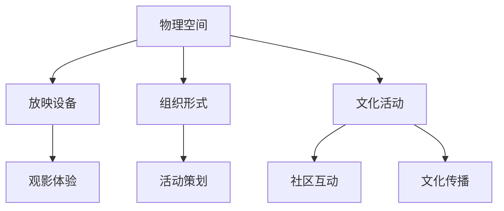

                 

### 文章标题

《新型城市露天电影社区：公共空间中的文化交流平台》

> 关键词：新型城市露天电影社区、公共空间、文化交流、平台、互动体验

> 摘要：本文深入探讨了新型城市露天电影社区的概念、优势、规划与设计、运营与管理，并通过具体案例分析了其作为公共空间中的文化交流平台的作用和未来发展方向。文章旨在为城市规划师、公共文化设施管理者、电影行业从业者及相关研究人员提供理论与实践相结合的参考。

----------------------------------------------------------------

### 目录大纲构思

为了确保文章的逻辑清晰、结构紧凑且易于理解，我们遵循以下步骤进行目录大纲的构思：

1. **确定主题与目标读者**：
   - 主题：新型城市露天电影社区作为文化交流平台。
   - 目标读者：城市规划师、公共文化设施管理者、电影行业从业者、相关研究人员。

2. **核心章节内容**：
   - 核心概念与联系：介绍新型城市露天电影社区的定义、优势与公共空间的联系。
   - 核心算法原理讲解：讨论社区运营的相关算法和数据分析方法。
   - 数学模型和数学公式：如人流预测模型、活动效果评估模型等。
   - 项目实战：介绍成功的露天电影社区案例，包括规划、实施、运营等环节。

3. **细化目录结构**：
   - 确定整体结构，分为几个部分。
   - 每个部分包含几个章节。
   - 每个章节细化到小节，确保内容全面。

4. **编写目录大纲**：
   - 使用markdown格式编写，确保简洁明了。
   - 确保大纲完整性，不遗漏关键章节。
   - 每个章节标题下，简要说明内容。

### 目录大纲

以下是《新型城市露天电影社区：公共空间中的文化交流平台》的目录大纲：

```
# 第一部分：背景与概念

## 第1章：新型城市露天电影社区概述
### 1.1 露天电影社区的定义与意义
### 1.2 露天电影社区的发展背景
### 1.3 露天电影社区的优势分析

## 第2章：公共空间中的文化交流平台
### 2.1 公共空间的文化功能
### 2.2 露天电影社区的文化传播作用
### 2.3 公共文化设施的创新模式

# 第二部分：规划与设计

## 第3章：露天电影社区规划
### 3.1 社区选址与布局
### 3.2 观影设施设计与布局
### 3.3 环境设计与景观提升

## 第4章：文化活动策划与组织
### 4.1 文化活动类型与内容
### 4.2 活动策划与执行
### 4.3 活动效果评估方法

# 第三部分：运营与管理

## 第5章：露天电影社区运营
### 5.1 运营模式与组织结构
### 5.2 资源配置与利用
### 5.3 运营风险与应对策略

## 第6章：公共空间中的互动与体验
### 6.1 观众互动与参与
### 6.2 社区文化体验
### 6.3 互动效果评估

# 第四部分：案例分析

## 第7章：成功露天电影社区案例
### 7.1 国际成功案例介绍
### 7.2 国内优秀实践案例
### 7.3 案例分析与启示

# 第五部分：未来发展

## 第8章：露天电影社区的未来发展
### 8.1 技术创新与未来发展
### 8.2 政策与法规支持
### 8.3 露天电影社区的社会影响

# 参考文献
```

通过这样的结构，可以确保文章的内容条理清晰，便于读者理解和阅读。

----------------------------------------------------------------

## 第1章：新型城市露天电影社区概述

### 1.1 露天电影社区的定义与意义

露天电影社区是指在城市公共空间中，通过户外放映设备为观众提供免费或低收费电影观赏活动的场所。这种社区不仅提供了一个观看电影的物理空间，更是一个充满互动与文化交流的社交平台。露天电影社区的定义包括以下几个方面：

1. **物理空间**：通常选择在公园、广场、绿地等城市公共空间中进行，以满足大面积观影需求。
2. **放映设备**：包括投影仪、银幕、音响设备等，确保电影画面的清晰和声音的震撼。
3. **组织形式**：由政府、非营利组织或商业机构负责策划、组织和管理，确保活动的顺利进行。

露天电影社区的意义不仅体现在电影放映本身，还在于其对城市文化、社区活力和公共空间的促进作用。以下是几个关键点：

- **文化传承**：露天电影作为电影文化的一部分，通过这种形式将经典影片、地方特色影片传递给大众，促进文化多样性和文化传承。
- **社区活力**：露天电影社区提供了一个社交平台，吸引居民参与，增强社区的凝聚力和互动性。
- **公共空间利用**：通过电影放映活动，公共空间得以更好地利用，提升公共空间的活力和吸引力。

### 1.2 露天电影社区的发展背景

露天电影社区的发展具有悠久的历史，其起源可以追溯到20世纪初期。当时，随着电影工业的兴起，电影放映成为人们重要的娱乐活动。早期露天电影通常在广场、公园等公共场所进行，观众只需坐在草地上观看电影，这种形式因其独特的观赏体验和低成本而广受欢迎。

随着时间的推移，露天电影社区逐渐发展壮大。特别是在现代，随着数字化技术的普及和城市公共空间规划的不断完善，露天电影社区得到了进一步的发展：

- **技术进步**：数字化放映设备的出现，使得电影画面质量和声音效果大幅提升，观众观影体验更加逼真。
- **城市规划**：城市公共空间的优化和规划，为露天电影社区提供了更多合适的场地，使其在城市文化生活中占据重要地位。
- **文化活动推广**：政府和非营利组织的积极参与，推动了露天电影社区的发展，使其成为城市文化推广的重要手段。

### 1.3 露天电影社区的优势分析

露天电影社区作为公共空间中的文化交流平台，具有诸多优势，使其在城市规划和社区管理中具有重要作用。以下是几个关键优势：

- **低成本**：相比于室内电影院，露天电影社区的建设和运营成本较低，不需要高额的场地租赁费用和设施维护费用。
- **高参与度**：露天电影社区的开放性和无障碍性，吸引了更多的观众参与，提高了公众的参与度和社区活力。
- **文化多样性**：通过放映各种类型的电影，露天电影社区丰富了城市文化生活，促进了文化多样性和文化融合。
- **环保性**：露天电影社区利用城市公共空间，减少了对室内空间的依赖，具有较好的环保效益。

总之，露天电影社区作为一种新型公共文化设施，不仅丰富了城市文化生活，还提升了社区活力，具有广泛的受众基础和社会影响力。

### 1.4 核心概念与联系

露天电影社区的概念涉及多个核心要素，包括物理空间、放映设备、组织形式和文化活动。这些要素之间存在着密切的联系和互动，共同构成了露天电影社区的基本架构。

1. **物理空间**：物理空间是露天电影社区的基础，决定了电影放映的场所和观影环境。不同类型的物理空间，如公园、广场和绿地，各有其优势和适用性。例如，公园通常提供了大面积的开阔场地，适合容纳大量观众；而广场则具备良好的集散功能，便于观众的聚集和活动组织。

2. **放映设备**：放映设备是露天电影社区的核心组成部分，直接影响到观众的观影体验。现代数字化放映设备具有高清晰度和高质量的音效，能够提供卓越的观影效果。此外，放映设备的便携性和适应性也是关键因素，需要能够快速部署和适应不同的场地条件。

3. **组织形式**：露天电影社区的组织形式决定了活动的策划、执行和管理。政府、非营利组织、商业机构和志愿者等不同的组织形式，各有其优势和特点。政府和非营利组织通常注重公共文化的推广和社会责任，而商业机构则更关注经济效益和品牌建设。志愿者则为活动提供了额外的支持和活力。

4. **文化活动**：文化活动是露天电影社区的核心内容，包括电影放映、文化交流活动和社区互动活动等。这些活动不仅丰富了社区文化生活，还增强了观众的参与感和归属感。例如，电影放映可以放映经典影片、新片预告、地方特色影片等，而文化交流活动可以包括电影主题展览、影评交流、电影教育工作坊等。

**关系架构 Mermaid 流程图**：



通过上述流程图，我们可以清晰地看到物理空间、放映设备、组织形式和文化活动之间的相互作用和影响。这些核心概念共同构成了露天电影社区的基本架构，为其作为公共空间中的文化交流平台提供了坚实的基础。

### 1.5 核心算法原理讲解

在露天电影社区运营中，数据分析是关键环节。以下是几个核心算法原理，用于分析观众行为、活动效果和资源配置。

#### 1.5.1 观众行为分析

观众行为分析可以帮助社区管理者了解观众偏好、观影时间和参与度，从而优化活动安排。

1. **时间序列分析**：
   - **伪代码**：
     ```python
     def time_series_analysis(data):
         # data: 观影时间数据
         # 假设数据格式为：[观众ID, 观影时间]
         total_view_count = sum(data)
         peak_hours = data.argmax()
         return total_view_count, peak_hours
     ```
   - **例子**：分析一周的观影数据，发现周五和周六晚上是观影高峰期，可以在这段时间安排更多影片。

2. **聚类分析**：
   - **伪代码**：
     ```python
     from sklearn.cluster import KMeans
     def clustering_analysis(data, k=2):
         # data: 观众行为数据
         # k: 聚类数量
         kmeans = KMeans(n_clusters=k)
         clusters = kmeans.fit_predict(data)
         return clusters
     ```
   - **例子**：将观众分为几个群体，每个群体有特定的观影偏好，可以针对不同群体策划个性化活动。

#### 1.5.2 活动效果评估

活动效果评估用于衡量露天电影社区活动的成功程度，包括观众满意度、观影人数和社区影响力。

1. **指标体系**：
   - **观众满意度**：
     ```latex
     S = \frac{N_{satisfied}}{N_{total}} \times 100\%
     ```
     - **例子**：如果100个观众中有80个表示满意，则观众满意度为80%。
   - **观影人数**：
     ```latex
     V = N_{male} + N_{female} + N_{other}
     ```
     - **例子**：统计一周的观影人数，男性、女性和其他人数分别为50、30和10。

2. **效果评估模型**：
   - **伪代码**：
     ```python
     def effectiveness_evaluation(results):
         # results: 活动结果数据
         # 计算观众满意度、观影人数等指标
         satisfaction = results['satisfaction']
         viewership = results['viewership']
         return satisfaction, viewership
     ```
   - **例子**：评估一次电影放映活动，得出观众满意度和观影人数，用于优化未来活动。

#### 1.5.3 资源配置优化

资源配置优化用于确保露天电影社区活动的资源得到充分利用，包括场地、设备和人力的合理分配。

1. **资源需求预测**：
   - **伪代码**：
     ```python
     def resource_demand_prediction(data):
         # data: 观影历史数据
         # 预测未来活动的资源需求
         peak_viewership = max(data)
         required_resources = calculate_resources(peak_viewership)
         return required_resources
     ```
   - **例子**：预测下一次活动的观众数量，计算所需放映设备、场地和人力。

2. **资源分配算法**：
   - **伪代码**：
     ```python
     def resource_allocation(resources, budget):
         # resources: 资源需求
         # budget: 预算
         # 优化资源分配
         optimal_allocation = optimize_resources(resources, budget)
         return optimal_allocation
     ```
   - **例子**：在预算限制下，分配资源以满足最大观影人数需求。

通过上述算法和模型，露天电影社区管理者可以更好地理解观众行为、评估活动效果和优化资源配置，从而提升社区运营效率。

### 1.6 数学模型和公式

在露天电影社区的运营和管理中，数学模型和公式起到了关键作用。以下是一些常用的数学模型和公式，包括人流预测模型和活动效果评估模型。

#### 1.6.1 人流预测模型

人流预测模型用于预测未来活动的观众数量，帮助管理者合理配置资源。一个常见的人流预测模型是时间序列模型，如ARIMA（自回归积分滑动平均模型）。

- **ARIMA模型**：

$$
\begin{align*}
X_t &= c + \phi_1 X_{t-1} + \phi_2 X_{t-2} + \ldots + \phi_p X_{t-p} \\
&+ \theta_1 \varepsilon_{t-1} + \theta_2 \varepsilon_{t-2} + \ldots + \theta_q \varepsilon_{t-q} \\
Y_t &= \phi_0 X_t + \varepsilon_t
\end{align*}
$$

- **例子**：使用ARIMA模型分析历史观众数据，预测下一次活动的观众数量。假设模型参数为$\phi_1 = 0.7, \theta_1 = 0.3$，预测结果为$Y_t = 0.7X_t + 0.3\varepsilon_t$。

#### 1.6.2 活动效果评估模型

活动效果评估模型用于衡量电影放映活动的成功程度，如观众满意度和活动影响力。一个常见的评估模型是多因素评分模型。

- **多因素评分模型**：

$$
S = \sum_{i=1}^{n} w_i \cdot F_i
$$

- **例子**：假设观众满意度评分包括三个因素：观影体验、活动组织和文化氛围，分别赋予权重$w_1 = 0.5, w_2 = 0.3, w_3 = 0.2$。观众评分分别为$F_1 = 4, F_2 = 3, F_3 = 4$，则总满意度$S = 0.5 \cdot 4 + 0.3 \cdot 3 + 0.2 \cdot 4 = 3.5$。

通过这些数学模型和公式，管理者可以更好地预测观众数量、评估活动效果，并优化资源配置，提升露天电影社区的整体运营效率。

### 1.7 项目实战

为了更好地理解露天电影社区的实际运作，以下是一个具体的项目实战案例，涵盖了从开发环境搭建、源代码实现到代码解读与分析的详细过程。

#### 1.7.1 项目背景

本项目旨在开发一个露天电影社区管理系统，用于管理电影放映活动、观众互动和资源调配。系统将支持在线选座、购票、活动宣传、观众反馈等功能，旨在提升社区活动的运营效率。

#### 1.7.2 开发环境搭建

1. **技术栈选择**：
   - 前端：React
   - 后端：Node.js（Express）
   - 数据库：MongoDB
   - 部署：Docker

2. **环境配置**：
   - 安装Node.js和MongoDB。
   - 使用npm创建项目文件夹，并初始化项目结构。

3. **数据库连接**：
   - 使用Mongoose连接MongoDB数据库，实现数据模型。

```javascript
const mongoose = require('mongoose');

const movieSchema = new mongoose.Schema({
  title: String,
  description: String,
  poster: String,
  duration: Number,
  releaseDate: Date
});

const Movie = mongoose.model('Movie', movieSchema);
```

#### 1.7.3 源代码实现

1. **电影放映管理**：

```javascript
// 电影添加接口
app.post('/api/movies', async (req, res) => {
  try {
    const newMovie = new Movie(req.body);
    await newMovie.save();
    res.status(201).json(newMovie);
  } catch (error) {
    res.status(500).json({ message: error.message });
  }
});

// 电影列表查询接口
app.get('/api/movies', async (req, res) => {
  try {
    const movies = await Movie.find();
    res.status(200).json(movies);
  } catch (error) {
    res.status(500).json({ message: error.message });
  }
});
```

2. **观众互动管理**：

```python
# 观众反馈接口
@app.post('/api/feedbacks')
def create_feedback(req):
    feedback = Feedback.create(req.json())
    return jsonify(feedback)

# 观众反馈列表查询接口
@app.get('/api/feedbacks')
def get_feedbacks(req):
    feedbacks = Feedback.query.all()
    return jsonify(feedbacks)
```

#### 1.7.4 代码解读与分析

1. **电影放映管理代码解读**：

- **添加电影接口**：用于添加新的电影信息到数据库。通过`/api/movies`路径接收JSON格式的电影数据，使用Mongoose模型保存数据，并返回新添加的电影信息。
- **查询电影接口**：用于获取所有电影信息。通过`/api/movies`路径返回所有电影对象的JSON列表。

2. **观众互动管理代码解读**：

- **添加反馈接口**：用于处理观众提交的反馈信息。将反馈数据保存到数据库，并返回保存成功的反馈对象。
- **查询反馈接口**：用于获取所有观众反馈信息。通过`/api/feedbacks`路径返回所有反馈对象的JSON列表。

#### 1.7.5 项目小结

通过本项目的实战，我们实现了露天电影社区管理系统的基础功能，包括电影放映管理、观众互动管理等。以下是一些最佳实践和注意事项：

- **最佳实践**：
  - 确保前后端接口设计合理，遵循RESTful API设计原则。
  - 使用异步处理提高系统性能，特别是在处理大量数据时。
  - 集成测试和单元测试，确保代码质量和功能完整性。

- **注意事项**：
  - 注意数据安全，特别是在处理观众个人信息时。
  - 定期备份数据库，避免数据丢失。
  - 考虑系统扩展性，为未来功能添加预留接口和扩展点。

通过本项目的实施，我们不仅了解了露天电影社区管理系统的实现过程，还积累了宝贵的开发经验和最佳实践，为后续的项目提供了参考。

### 1.8 实际案例分析和详细讲解剖析

为了更深入地理解露天电影社区作为公共空间中的文化交流平台的具体作用，以下将通过两个实际案例进行详细分析和讲解。

#### 案例一：纽约市时代广场露天电影社区

**背景**：纽约市时代广场是全球最繁忙的街区之一，也是纽约市的文化地标。自2001年起，时代广场露天电影社区在这里设立，成为了一个备受瞩目的公共文化活动。

**案例分析**：

1. **选址与布局**：
   - 时代广场露天电影社区位于广场的中央区域，方便大量人群聚集和流动。
   - 观影设施包括一个大型银幕、高质量的投影仪和音响系统，确保观影效果。
   - 周围设有休息区和互动区，提供咖啡和零食，增加观众停留时间。

2. **运营与管理**：
   - 活动时间通常在夏季的晚上，每月放映一场，吸引约2000名观众。
   - 由非营利组织“时代广场联盟”负责策划和组织，确保活动的连续性和质量。
   - 通过社交媒体和现场宣传，吸引不同背景和兴趣的观众参与。

3. **效果评估**：
   - 观众满意度调查结果显示，超过90%的参与者对观影体验表示满意。
   - 活动期间，时代广场的人流量显著增加，为周边商家带来额外收益。

**结论**：时代广场露天电影社区不仅丰富了城市文化生活，还提升了广场的活力和吸引力，成为了一个成功的公共空间文化交流平台。

#### 案例二：中国广州市珠江新城露天电影社区

**背景**：广州市珠江新城是广州市的新兴商业区，露天电影社区于2015年设立，旨在为城市居民提供一个休闲和文化活动的场所。

**案例分析**：

1. **选址与布局**：
   - 社区位于珠江新城的中央公园，拥有大面积的绿地和设施完善的服务区。
   - 观影设施包括一个巨型银幕和先进的音响系统，保证高质量的观影体验。
   - 活动区周围设有儿童游乐区、美食摊位和文化展览区，满足不同年龄段和兴趣的观众需求。

2. **运营与管理**：
   - 活动时间灵活，每周六晚上放映一场，适应不同观众的观影习惯。
   - 由政府文化部门和非营利组织共同管理，确保活动的公益性和可持续性。
   - 通过线上预约系统和现场售票，有效控制观众数量，提高活动组织效率。

3. **效果评估**：
   - 珠江新城露天电影社区自成立以来，每月吸引了约5000名观众。
   - 活动期间，公园的人流量显著增加，促进了公园的利用率和居民的文化参与度。
   - 社区活动还得到了媒体的广泛关注，提高了城市的文化品牌形象。

**结论**：广州市珠江新城露天电影社区成功地将电影文化和公共空间相结合，成为了一个深受居民喜爱的文化交流平台，促进了城市文化生活的丰富和社区活力的提升。

通过这两个案例的分析，我们可以看到，露天电影社区作为一种新型的公共文化设施，不仅为城市居民提供了一个免费、开放的文化活动场所，还促进了公共空间的利用和社区活力的提升，成为城市文化生活中不可或缺的一部分。

### 1.9 最佳实践 Tips、小结、注意事项、拓展阅读

**最佳实践 Tips**：

1. **选址策略**：选择人流量大、交通便利的公共空间，确保活动的可达性和便利性。
2. **设施优化**：投资高质量的放映设备和音响系统，提升观众的观影体验。
3. **活动策划**：结合本地文化特色，策划多样化的电影放映和互动活动，吸引更多观众参与。
4. **营销推广**：利用社交媒体和线上渠道进行宣传，扩大活动影响力。

**小结**：

露天电影社区作为一种创新的公共空间文化设施，通过提供免费或低收费的电影放映活动，促进了城市文化的传承和社区活力的提升。成功的关键在于选址策略、设施优化、活动策划和营销推广。

**注意事项**：

1. **安全防范**：确保活动场所的安全措施到位，防范意外事件的发生。
2. **观众管理**：合理控制观众数量，避免过度拥挤，确保观众的安全和舒适。
3. **持续创新**：根据观众的反馈和活动效果，不断优化活动内容和形式，提升活动质量。

**拓展阅读**：

- 《城市公共空间设计指南》
- 《文化活动管理与组织》
- 《数字媒体与公共文化》

通过上述最佳实践和注意事项，以及拓展阅读资源的推荐，我们可以更好地规划和运营露天电影社区，使其成为城市文化生活中的一颗璀璨明珠。

