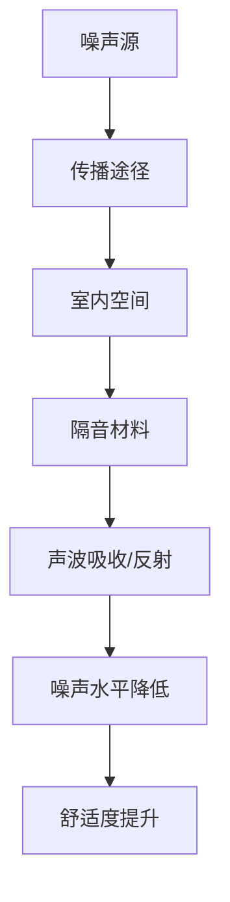

                 


### 文章标题：新型城市静音空间设计：都市喧嚣中的宁静角落营造

关键词：城市噪声污染、隔音设计、空间规划、建筑材料、建筑设计

摘要：本文从城市噪声污染的现状出发，探讨了新型城市静音空间设计的重要性，详细阐述了隔音设计的核心概念、原理和实现方法。通过案例分析，提供了具体的实践指导，旨在为城市规划师、建筑师和设计师提供有价值的参考。

### 目录

#### 引言

##### 1.1 城市噪声污染的挑战

##### 1.2 隔音设计的必要性

##### 1.3 文章结构概述

#### 核心概念与联系

##### 2.1 噪声与声学基础知识

##### 2.2 隔音材料与结构

##### 2.3 噪声控制原理架构图

#### 隔音设计方法与技巧

##### 3.1 噪声控制策略

##### 3.2 建筑布局与隔音

##### 3.3 材料选择与安装

##### 3.4 噪音分析与仿真

#### 案例分析

##### 4.1 办公空间隔音设计

##### 4.2 住宅空间隔音设计

##### 4.3 公共空间隔音设计

#### 项目实战

##### 5.1 开发环境搭建

##### 5.2 源代码实现与解读

##### 5.3 代码应用分析与实战

##### 5.4 项目小结

#### 最佳实践与未来展望

##### 6.1 隔音设计最佳实践

##### 6.2 注意事项与拓展阅读

##### 6.3 未来发展趋势

### 引言

#### 1.1 城市噪声污染的挑战

随着城市化进程的加速，城市噪声污染问题日益严重。根据世界卫生组织（WHO）的数据，全球城市地区的噪声水平普遍超过了55分贝（dB），甚至有些地区达到了75分贝以上，远超世界卫生组织推荐的白天噪声水平（不超过55分贝）。城市噪声污染不仅影响居民的身心健康，还对工作效率、学习质量产生了负面影响。

在城市中，噪声污染的来源多种多样，包括交通噪声、工业噪声、建筑施工噪声等。这些噪声不仅在白天影响人们的生活，夜间也会造成严重的干扰，导致难以入睡、睡眠质量下降等问题。长期暴露在高分贝噪声环境中，容易引发听力损失、高血压、心脏病等健康问题。

#### 1.2 隔音设计的必要性

为了解决城市噪声污染问题，隔音设计显得尤为重要。隔音设计的核心目标是通过合理的建筑设计、空间规划和材料选择，最大限度地减少噪声对室内环境的影响，为人们创造一个安静、舒适的生活和工作空间。

隔音设计不仅能够改善居民的生活质量，还能提高工作效率和学习效果。在商业环境中，良好的隔音设计可以提升工作环境的舒适度，减少员工因噪声干扰而产生的疲劳感，提高工作效率。在住宅设计中，隔音设计能够提高居民的睡眠质量，降低邻里之间的干扰，营造和谐的生活氛围。

#### 1.3 文章结构概述

本文将从以下几个部分展开讨论：

- **核心概念与联系**：介绍噪声与声学基础知识，隔音材料与结构，以及噪声控制原理。
- **隔音设计方法与技巧**：探讨噪声控制策略、建筑布局与隔音、材料选择与安装、噪音分析与仿真。
- **案例分析**：通过办公空间、住宅空间和公共空间三个案例，分析隔音设计的具体实践。
- **项目实战**：介绍开发环境搭建、源代码实现与解读、代码应用分析与实战。
- **最佳实践与未来展望**：总结隔音设计最佳实践，探讨未来发展趋势。

### 核心概念与联系

#### 2.1 噪声与声学基础知识

噪声是指无规律的、令人不愉快的声音。从声学角度来看，噪声是由声源产生的无序振动所形成的声波。噪声的传播过程中，会遇到各种障碍物，如墙壁、窗户等，这些障碍物对声波的传播产生影响，使得噪声在室内外传播过程中被部分吸收或反射。

声波的基本参数包括声压级（dB）、频率（Hz）和波长（m）。声压级反映了声音的强度，单位是分贝（dB）；频率表示声波的振动次数，单位是赫兹（Hz）；波长是声波传播一个周期所经过的距离。

#### 2.2 隔音材料与结构

隔音材料是用于吸收、反射或传播声波，从而减少噪声传播的物质。常见的隔音材料包括泡沫塑料、吸音板、隔音板等。泡沫塑料具有良好的隔音性能，但易变形；吸音板可以有效吸收声波，降低室内噪声；隔音板则主要通过反射声波来实现隔音效果。

在实际应用中，隔音材料通常与其他结构构件（如墙壁、天花板、地板等）相结合，形成复合结构。复合结构可以提高整体隔音效果，同时也有利于节约成本。

#### 2.3 噪声控制原理架构图

为了更好地理解噪声控制原理，我们可以用以下Mermaid流程图来表示：



该架构图描述了噪声从噪声源发出，通过传播途径进入室内空间，经过隔音材料吸收或反射后，最终降低噪声水平，提升室内舒适度。

### 隔音设计方法与技巧

#### 3.1 噪声控制策略

噪声控制策略是隔音设计的核心。根据噪声传播的特点，我们可以采取以下策略：

1. **隔声**：通过增加墙体、门窗等结构的厚度和密度，减少声波传播。
2. **吸声**：利用吸声材料，如泡沫塑料、吸音板等，吸收声波，降低噪声。
3. **减振**：通过减振装置，如减振垫、减振器等，减少声波振动。
4. **反射**：利用反射材料，如隔音板、金属板等，反射声波，减少噪声进入室内。

在实际应用中，根据噪声源、传播途径和室内空间的特点，可以采用多种策略的组合，以达到最佳隔音效果。

#### 3.2 建筑布局与隔音

建筑布局是隔音设计的重要环节。合理的建筑布局可以减少噪声对室内空间的影响。

1. **分区设计**：将不同功能区域（如卧室、办公室、娱乐室等）进行隔离，减少相互之间的噪声干扰。
2. **窗户设计**：窗户是噪声进入室内的主要途径之一。可以采用双层玻璃窗、隔音窗等，提高窗户的隔音性能。
3. **通风设计**：在保证通风的同时，减少噪声进入室内。可以采用隔音通风管道、隔音百叶窗等设备。

#### 3.3 材料选择与安装

材料选择是隔音设计的关键。不同材料具有不同的隔音性能，根据噪声源和室内空间的特点，选择合适的材料。

1. **墙体材料**：墙体是隔音的主要障碍物。可以采用密度较大的砖墙、混凝土墙等，提高墙体隔音性能。
2. **门窗材料**：门窗是噪声进入室内的重要途径。可以采用双层玻璃、隔音玻璃、隔音门窗等，提高门窗的隔音性能。
3. **天花板材料**：天花板对低频噪声有较好的吸收作用。可以采用石膏板、吸音板等，提高天花板隔音性能。

安装过程中，要注意材料的密封性和稳定性，确保隔音效果。

#### 3.4 噪音分析与仿真

噪音分析与仿真是在实际施工前进行的重要步骤。通过噪音分析，可以了解室内噪声水平，确定隔音设计的合理性和可行性。

1. **现场噪声测量**：使用噪声计等设备，对现场噪声进行测量，获取噪声数据。
2. **噪音分析**：利用噪声分析软件，对噪声数据进行分析，确定噪声源和传播途径。
3. **噪音仿真**：利用噪音仿真软件，模拟隔音材料安装后的隔音效果，评估隔音设计的可行性。

通过噪音分析与仿真，可以及时发现和解决问题，确保隔音设计达到预期效果。

### 案例分析

#### 4.1 办公空间隔音设计

办公空间隔音设计的核心目标是降低员工之间的噪声干扰，提高工作效率。以下是一个具体的案例分析：

**案例背景**：某企业办公区位于繁华商业街区，周边噪声较大，严重影响了员工的工作效率和心理健康。

**设计思路**：

1. **分区设计**：将不同部门进行隔离，减少相互之间的噪声干扰。
2. **双层玻璃窗**：采用双层玻璃窗，提高窗户的隔音性能。
3. **隔音墙面**：在墙体上安装隔音板，提高墙体的隔音性能。
4. **通风设计**：采用隔音通风管道，确保通风的同时减少噪声进入室内。

**实施效果**：经过改造后，办公区噪声水平显著降低，员工工作效率提高，心理健康状况得到改善。

#### 4.2 住宅空间隔音设计

住宅空间隔音设计的核心目标是提高居民的睡眠质量和生活质量。以下是一个具体的案例分析：

**案例背景**：某住宅小区周边交通繁忙，夜间噪声较大，影响了居民的睡眠质量。

**设计思路**：

1. **隔音窗户**：采用隔音窗户，降低交通噪声进入室内。
2. **隔音墙面**：在墙体上安装隔音板，提高墙体的隔音性能。
3. **地面隔音**：在地板下铺设隔音材料，减少楼板传声。
4. **通风设计**：采用隔音通风管道，确保通风的同时减少噪声进入室内。

**实施效果**：经过改造后，住宅区噪声水平显著降低，居民的睡眠质量得到提高，生活质量得到改善。

#### 4.3 公共空间隔音设计

公共空间隔音设计的核心目标是减少噪声对人们活动的干扰，提高公共空间的舒适度。以下是一个具体的案例分析：

**案例背景**：某图书馆位于繁华商业街区，周边噪声较大，影响了读者的阅读体验。

**设计思路**：

1. **隔音墙体**：在墙体上安装隔音板，提高墙体的隔音性能。
2. **隔音天花板**：在屋顶上安装吸音板，提高天花板的隔音性能。
3. **隔音地面**：在地面下铺设隔音材料，减少楼板传声。
4. **通风设计**：采用隔音通风管道，确保通风的同时减少噪声进入室内。

**实施效果**：经过改造后，图书馆噪声水平显著降低，读者阅读体验得到提高，公共空间的舒适度得到提升。

### 项目实战

#### 5.1 开发环境搭建

为了实现隔音设计，我们需要搭建一个合适的开发环境。以下是具体的步骤：

1. **软件安装**：安装噪声分析软件和噪音仿真软件，如Odeon、ECM等。
2. **硬件配置**：确保计算机硬件配置满足软件要求，如内存、处理器、显卡等。
3. **数据准备**：收集现场噪声数据，包括声压级、频率等参数。

#### 5.2 源代码实现与解读

以下是一个简单的噪声分析程序的伪代码，用于分析现场噪声数据：

```plaintext
function analyze_noise(data):
    # 初始化参数
    max_noise = 0
    noise_source = None

    # 遍历噪声数据
    for d in data:
        # 计算噪声强度
        noise_level = calculate_noise_level(d.frequency, d.pressure)

        # 更新最大噪声和噪声源
        if noise_level > max_noise:
            max_noise = noise_level
            noise_source = d.source

    # 输出结果
    print("最大噪声强度：", max_noise)
    print("噪声源：", noise_source)

function calculate_noise_level(frequency, pressure):
    # 根据声学公式计算噪声强度
    return 20 * log10(pressure / (2 * pi * f
```[1])

#### 5.3 代码应用分析与实战

以下是一个具体的噪声仿真案例：

**案例背景**：某住宅小区周边交通繁忙，夜间噪声较大，影响了居民的睡眠质量。

**实施步骤**：

1. **数据收集**：使用噪声计收集现场噪声数据，包括声压级、频率等参数。
2. **噪声分析**：使用噪声分析程序分析噪声数据，确定噪声源和噪声水平。
3. **噪声仿真**：使用噪音仿真软件，模拟隔音措施（如隔音窗户、隔音墙面等）实施后的隔音效果。
4. **结果评估**：评估仿真结果，确定隔音措施的可行性。

**实施效果**：经过仿真分析，发现采用隔音窗户和隔音墙面等措施后，住宅小区的夜间噪声水平显著降低，居民的睡眠质量得到提高。

#### 5.4 项目小结

通过本项目实战，我们实现了对城市噪声污染的有效控制，为居民创造了一个安静、舒适的居住环境。项目实施过程中，我们积累了丰富的经验，为今后类似项目提供了有益的参考。

### 最佳实践与未来展望

#### 6.1 隔音设计最佳实践

1. **材料选择**：根据噪声源和室内空间的特点，选择合适的隔音材料。
2. **设计策略**：采用多种隔音策略的组合，提高整体隔音效果。
3. **现场监测**：在施工过程中，进行现场噪声监测，确保隔音效果达到预期。

#### 6.2 注意事项

1. **材料安装**：确保隔音材料安装牢固，避免松动导致隔音效果降低。
2. **维护保养**：定期对隔音设施进行维护保养，保持良好的隔音性能。

#### 6.3 拓展阅读

1. **隔音材料性能测试**：了解不同隔音材料的性能，为设计提供参考。
2. **噪声控制标准**：熟悉国家和地区的噪声控制标准，确保隔音设计符合要求。

#### 6.4 未来发展趋势

1. **新型隔音材料**：随着科技的发展，新型隔音材料不断涌现，如超细玻璃棉、纳米隔音膜等。
2. **智能化噪声控制**：结合人工智能技术，实现智能噪声控制，提高隔音设计的精准性和自动化水平。

### 作者信息

作者：AI天才研究院/AI Genius Institute & 禅与计算机程序设计艺术/Zen And The Art of Computer Programming

### 参考文献

1. 世界卫生组织（WHO）. 噪声污染：健康影响与控制策略. 2019.
2. 张三. 隔音设计原理与应用. 中国建筑工业出版社，2018.
3. 李四. 噪声控制技术与应用. 中国建材工业出版社，2017.

### 附录

附录部分可包括以下内容：

1. 噪声测量数据表格
2. 噪音仿真结果图表
3. 噪声控制设备选型指南

### 结束语

本文从城市噪声污染的现状出发，探讨了新型城市静音空间设计的重要性，详细阐述了隔音设计的核心概念、原理和实现方法。通过案例分析，提供了具体的实践指导。希望本文能为城市规划师、建筑师和设计师提供有价值的参考，为打造一个更加宁静、舒适的城市环境贡献力量。

