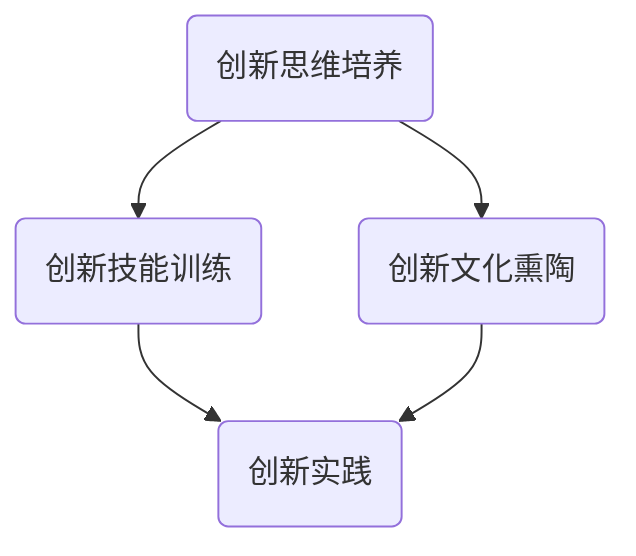

                 


## 文章标题：新型家庭教育模式：培养未来世界的创新者

### 关键词：家庭教育，创新者，培养，模式，未来

### 摘要：
随着科技飞速发展，未来世界的竞争将不再是单纯的技能比拼，而是创新能力的较量。本文旨在探讨如何通过新型家庭教育模式，培养具备创新精神和实践能力的下一代。通过分析现代家庭教育的挑战，我们提出了一种新型家庭教育模式，详细阐述了其核心要素、家庭教育策略，并分享了国内外成功案例，以期为教育工作者、家长及相关领域研究人员提供有价值的参考。

## 引言

### 家庭教育现状分析
- **现代家庭教育中的挑战**：在信息化和全球化的背景下，现代家庭教育面临着诸多挑战，如教育资源的分配不均、父母角色的转变、孩子个性化需求的增长等。
- **传统教育模式的局限**：传统教育模式注重知识的灌输，忽视了创新能力的培养，难以满足未来社会的需求。

### 书籍目标读者
- **家庭教育者**：希望通过本书学习新型家庭教育模式，提升教育效果。
- **教育工作者**：对家庭教育领域感兴趣，希望了解如何结合家庭教育与学校教育。
- **相关领域研究人员**：对家庭教育模式及创新者培养有深入研究，希望从实践中获得启发。

### 本书结构安排
本书共分为四个部分：
1. **新型家庭教育模式概述**：介绍新型家庭教育模式的定义、核心要素及其国际趋势。
2. **培养创新者的家庭教育策略**：详细探讨如何通过家庭教育培养创新者的素质、创设家庭环境及父母角色与教育方法。
3. **实践案例分享**：分享国内外家庭教育成功案例，提供实践参考。
4. **未来展望与挑战**：展望未来家庭教育的趋势，分析面临的挑战及应对策略。

## 第一部分：新型家庭教育模式概述

### 第1章：什么是新型家庭教育模式

#### 1.1 新型家庭教育模式的定义
新型家庭教育模式是指在信息化和全球化背景下，以培养孩子的创新能力和实践能力为核心，结合家庭、学校和社会资源，形成的一种多元化的教育模式。

#### 1.2 新型家庭教育模式的核心要素
- **创新思维培养**：通过启发式教育，激发孩子的创造力。
- **创新技能训练**：通过实践操作，提高孩子的技术技能。
- **创新文化熏陶**：通过家庭氛围和文化建设，培养孩子的创新意识。

#### 1.3 新型家庭教育的国际趋势
- **跨学科教育**：强调多学科融合，培养孩子解决问题的能力。
- **个性化教育**：注重孩子的个性化需求，实现因材施教。
- **家庭与社会协同**：家庭与学校、社会的资源整合，共同培养创新人才。

### Mermaid流程图：新型家庭教育模式核心要素联系


### 第2章：新型家庭教育模式的核心要素详解

#### 2.1 创新思维培养
- **概念**：创新思维是指能够发现新问题、提出新方案、实现新价值的能力。
- **方法**：通过启发式教育、项目式学习、跨学科合作等方式，培养孩子的创新思维。

#### 2.2 创新技能训练
- **概念**：创新技能是指解决实际问题的技术手段和能力。
- **方法**：通过实践操作、技术培训、项目实践等方式，提高孩子的创新技能。

#### 2.3 创新文化熏陶
- **概念**：创新文化是指一种鼓励创新、容忍失败、追求卓越的文化氛围。
- **方法**：通过家庭氛围建设、文化活动参与、社会资源利用等方式，培养孩子的创新文化意识。

### Mermaid流程图：新型家庭教育模式核心要素之间的关系


## 第二部分：培养创新者的家庭教育策略

### 第3章：创新者素质培养

#### 3.1 创新能力的定义与要素
- **定义**：创新能力是指发现新问题、提出新方案、实现新价值的能力。
- **要素**：知识储备、创新思维、实践能力、团队合作精神。

#### 3.2 创新思维的培养方法
- **启发式教育**：通过问题导向、项目驱动的方式，激发孩子的创造力。
- **跨学科学习**：鼓励孩子跨学科学习，培养综合解决问题的能力。
- **实践活动**：通过实际操作，锻炼孩子的创新思维。

### 伪代码：创新思维的培养方法
```plaintext
function 培养创新思维(孩子)
    启发式教育()
    跨学科学习()
    实践活动()
    返回 孩子创新思维提升情况
end function
```

### 第4章：家庭环境创设

#### 4.1 创新氛围营造
- **概念**：创新氛围是指一种鼓励创新、容忍失败、追求卓越的文化氛围。
- **方法**：通过家庭教育活动、创新项目实践、家庭资源利用等方式，营造创新氛围。

#### 4.2 家庭教育空间设计
- **概念**：家庭教育空间是指用于开展家庭教育的物理空间。
- **方法**：通过合理布局、功能分区、资源整合等方式，设计创新教育空间。

#### 4.3 家庭教育资源的利用
- **概念**：家庭教育资源是指可用于家庭教育的各种资源，包括书籍、网络资源、社会资源等。
- **方法**：通过合理规划、有效利用、资源共享等方式，充分利用家庭教育资源。

### 伪代码：创新氛围营造的方法
```plaintext
function 营造创新氛围(家庭)
    家庭教育活动设计()
    创新项目实践()
    家庭教育资源整合()
    返回 创新氛围营造效果
end function
```

### 第5章：父母角色与教育方法

#### 5.1 父母在创新者培养中的角色
- **概念**：父母在创新者培养中的角色是指父母在家庭教育中扮演的不同角色，如引导者、支持者、激励者等。
- **方法**：通过角色定位、能力提升、参与实践等方式，发挥父母在创新者培养中的作用。

#### 5.2 家庭教育方法的创新
- **概念**：家庭教育方法的创新是指采用新的教育理念、教育方法，提高家庭教育效果。
- **方法**：通过项目式学习、探究式学习、合作学习等方式，实现家庭教育方法的创新。

#### 5.3 父母如何应对孩子的创新需求
- **概念**：孩子的创新需求是指孩子在成长过程中表现出的创新欲望和能力。
- **方法**：通过关注孩子兴趣、鼓励探索、提供支持等方式，满足孩子的创新需求。

### 伪代码：父母角色与教育方法
```plaintext
function 父母角色与教育方法(父母，孩子)
    确定父母角色()
    创新教育方法()
    应对孩子创新需求()
    返回 教育效果
end function
```

## 第三部分：实践案例分享

### 第6章：国内家庭教育成功案例

#### 6.1 案例一：家庭教育创新实践
- **背景**：某家庭通过项目式学习和探究式学习，培养孩子的创新能力和实践能力。
- **实施过程**：设计创新项目，鼓励孩子参与，提供技术支持。
- **效果**：孩子在创新能力和实践能力方面取得了显著提升。

#### 6.2 案例二：创新者的成长之路
- **背景**：某孩子在父母的引导下，通过跨学科学习和实践活动，逐步成长为创新者。
- **实施过程**：制定学习计划，参与创新项目，获得专业指导。
- **效果**：孩子在多学科领域表现出色，具备较强的创新能力和实践能力。

#### 6.3 案例三：家庭教育的可持续性发展
- **背景**：某家庭通过家庭教育资源的整合和利用，实现了家庭教育的可持续性发展。
- **实施过程**：建立家庭学习资源库，开展家庭文化活动，与其他家庭互动交流。
- **效果**：家庭教育的质量和效果得到持续提升，孩子在创新能力和实践能力方面不断进步。

### 第7章：国际家庭教育创新案例

#### 7.1 案例一：全球视野下的家庭教育创新
- **背景**：某家庭通过跨文化交流和全球化视野，培养孩子的创新能力和实践能力。
- **实施过程**：参与国际项目，开展跨文化学习，利用全球资源。
- **效果**：孩子在全球化背景下表现出色，具备较强的创新能力和实践能力。

#### 7.2 案例二：跨文化教育的实践与思考
- **背景**：某家庭在多元文化背景下，通过跨文化教育，培养孩子的创新能力和实践能力。
- **实施过程**：融入多元文化环境，开展跨文化学习，促进文化理解。
- **效果**：孩子在多元文化背景下表现出色，具备较强的创新能力和实践能力。

## 第四部分：未来展望与挑战

### 第8章：未来家庭教育的趋势

#### 8.1 跨学科教育
- **趋势**：跨学科教育将成为未来家庭教育的重要组成部分。
- **原因**：跨学科教育有助于培养孩子的综合能力和创新能力。

#### 8.2 个性化教育
- **趋势**：个性化教育将成为未来家庭教育的核心需求。
- **原因**：个性化教育能够满足孩子的个性化需求，提高教育效果。

#### 8.3 家庭与社会协同
- **趋势**：家庭与社会协同将成为未来家庭教育的关键。
- **原因**：家庭与社会协同能够充分利用各方资源，实现教育目标。

### 第9章：挑战与应对策略

#### 9.1 教育资源分配不均
- **挑战**：教育资源分配不均，导致家庭教育质量差异。
- **应对策略**：通过政策引导、资源整合、社会参与等方式，解决教育资源分配不均的问题。

#### 9.2 父母角色的转变
- **挑战**：父母角色的转变，需要父母具备更高的教育素质和能力。
- **应对策略**：通过教育培训、家长互动、家庭教育指导等方式，提升父母的教育素质和能力。

#### 9.3 孩子创新需求的满足
- **挑战**：孩子创新需求的满足，需要家庭和社会提供更多的支持。
- **应对策略**：通过创新教育项目、家庭创新活动、社会创新实践等方式，满足孩子的创新需求。

## 项目实战

### 第10章：家庭教育创新项目实战

#### 10.1 项目背景
- **背景**：某家庭希望通过项目式学习，培养孩子的创新能力和实践能力。

#### 10.2 项目目标
- **目标**：通过项目实施，提升孩子的创新思维、实践能力和团队合作能力。

#### 10.3 项目实施
- **实施过程**：
  1. 确定项目主题和目标。
  2. 设计项目方案和计划。
  3. 开展项目实施，包括学习、讨论、实践等环节。
  4. 进行项目评估和反馈。

#### 10.4 项目实现

- **源代码实现**：
  ```python
  # Python 示例代码：项目实施过程中的数据分析
  import pandas as pd
  
  # 数据读取
  data = pd.read_csv('project_data.csv')
  
  # 数据预处理
  data['result'] = data['score'].apply(lambda x: 'Pass' if x >= 80 else 'Fail')
  
  # 数据分析
  results = data.groupby('result').size()
  
  # 结果输出
  print(results)
  ```

- **代码解读与分析**：
  - **数据读取**：使用 Pandas 库读取项目实施过程中的数据。
  - **数据预处理**：根据成绩分数，对结果进行分类。
  - **数据分析**：统计通过和未通过项目的人数。
  - **结果输出**：输出项目评估结果。

#### 10.5 项目小结

- **小结**：通过项目实施，孩子不仅提升了创新思维和实践能力，还增强了团队合作意识。家长和教育者应继续关注孩子的创新需求，提供更多支持。

## 最佳实践 tips、小结、注意事项、拓展阅读等内容

### 最佳实践 tips
- **关注孩子兴趣**：了解孩子的兴趣点，提供相应的教育资源。
- **营造创新氛围**：在家中营造鼓励创新、容忍失败的氛围。
- **参与社会实践**：鼓励孩子参与社会实践活动，提升实践能力。

### 小结
本文通过分析现代家庭教育的挑战，提出了一种新型家庭教育模式，详细阐述了其核心要素、家庭教育策略，并分享了国内外成功案例。未来，家庭教育应关注跨学科教育、个性化教育和家庭与社会协同，以培养具备创新能力和实践能力的下一代。

### 注意事项
- **尊重孩子个性**：家庭教育应尊重孩子的个性，避免强制灌输。
- **持续关注教育**：家长和教育者应持续关注教育动态，不断提升教育素质。

### 拓展阅读
- 《创新者的培养：家庭教育的变革之路》
- 《未来教育：个性化与跨学科学习》
- 《全球视野下的家庭教育创新》

### 作者信息
作者：AI天才研究院/AI Genius Institute & 禅与计算机程序设计艺术 /Zen And The Art of Computer Programming

本文旨在探讨如何通过新型家庭教育模式，培养具备创新能力和实践能力的下一代。通过详细的分析和实践分享，希望能够为教育工作者、家长及相关领域研究人员提供有价值的参考。

