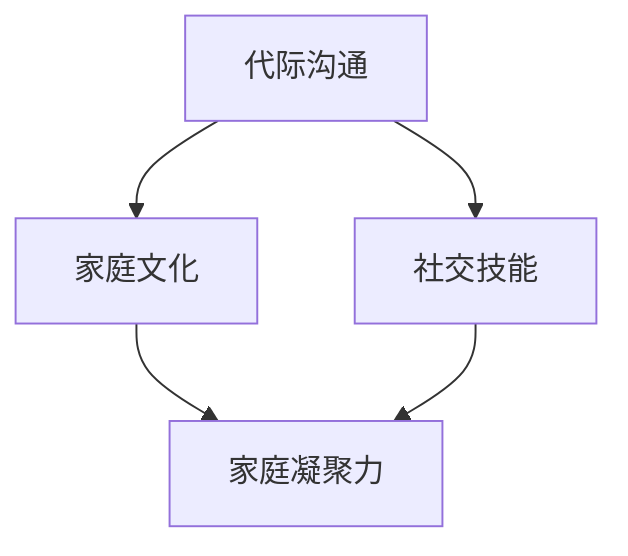
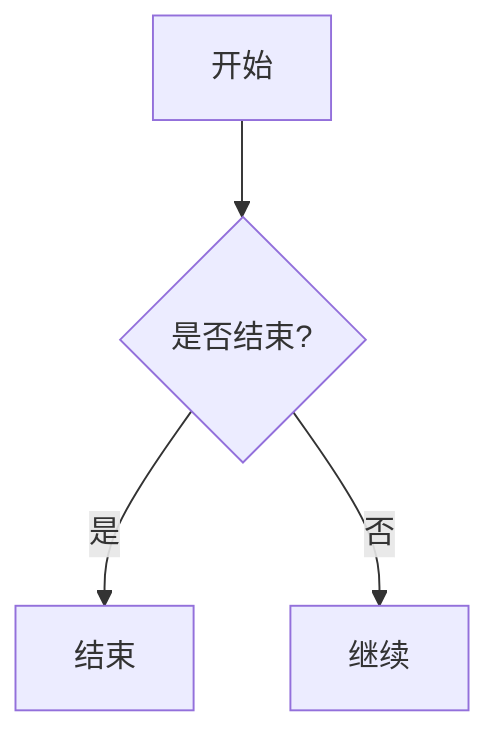
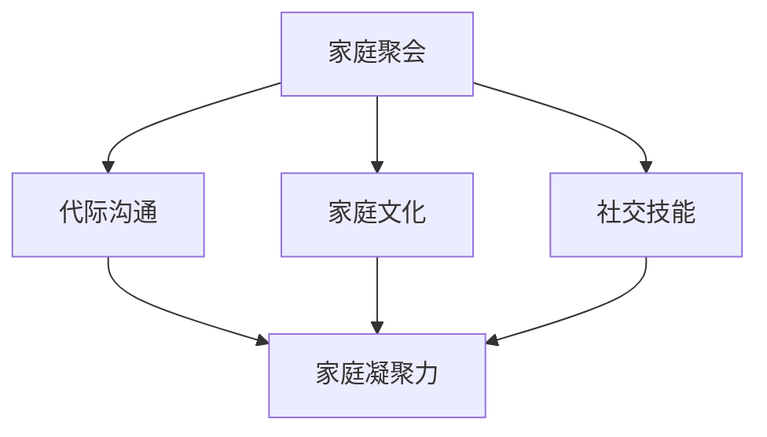

                 

### 文章标题

# 《新型家庭聚会：重塑代际关系的创新方式》

### 关键词

- 家庭聚会
- 代际沟通
- 家庭文化
- 社交技能
- 满意度评估
- 创新方式
- 活动策划

### 摘要

本文旨在探讨新型家庭聚会如何通过创新方式重塑代际关系，提高家庭凝聚力。文章首先介绍了家庭聚会的传统意义及其面临的挑战，然后提出了新型家庭聚会的理念。接着，详细阐述了新型家庭聚会中的核心概念，如代际沟通、家庭文化、社交技能等，并使用Mermaid流程图展示了这些概念之间的关系。文章进一步探讨了如何通过沟通策略和活动设计实现家庭聚会的创新，并引入了满意度评估模型。通过实际案例，本文分享了新型家庭聚会的策划、效果评估及优化方法。最后，文章总结了新型家庭聚会的重要性，并对未来进行了展望。

---

### 引言

家庭聚会作为一种传统的社交形式，在我国历史悠久，源远流长。它不仅是一种亲情交流的载体，更是家庭文化传承的重要途径。然而，随着现代社会的发展，传统的家庭聚会面临着诸多挑战，如代际沟通障碍、家庭文化淡化等。为了应对这些挑战，新型家庭聚会应运而生。

#### 1.1 家庭聚会的传统意义

家庭聚会，顾名思义，是指家庭成员之间定期进行的团聚活动。它具有以下几个方面的意义：

- **情感纽带**：家庭聚会是家庭成员之间情感交流的重要渠道，有助于增强家庭成员之间的感情。
- **文化传承**：通过家庭聚会，家族中的历史文化、传统习俗等可以得到传承和发扬。
- **社会功能**：家庭聚会也是一种社交活动，有助于家庭成员扩大社交圈，增强社会适应能力。

#### 1.2 传统家庭聚会的挑战

尽管传统家庭聚会有着重要的意义，但在现代社会中，它也面临着一些挑战：

- **代际沟通障碍**：随着代际差异的加大，不同年龄段的家庭成员在沟通中容易产生误解和冲突。
- **家庭文化淡化**：在快节奏的现代生活中，家庭文化逐渐被忽视，家庭聚会也逐渐失去了其原有的内涵。
- **社交技能缺失**：现代年轻人在家庭聚会中缺乏有效的沟通和互动技能，导致聚会效果不尽如人意。

#### 1.3 新型家庭聚会理念

为了应对传统家庭聚会面临的挑战，新型家庭聚会理念应运而生。新型家庭聚会强调以下几点：

- **代际沟通**：新型家庭聚会注重不同年龄段家庭成员之间的沟通，通过设定话题、活动等形式，促进代际间的理解和交流。
- **家庭文化**：新型家庭聚会强调家庭文化的传承和发展，通过活动设计、文化展示等方式，让家庭成员感受到家庭文化的魅力。
- **社交技能**：新型家庭聚会注重社交技能的培养，通过角色扮演、互动游戏等形式，提升家庭成员的沟通和互动能力。

### 核心概念与联系

#### 2.1 代际沟通

代际沟通是新型家庭聚会中的核心概念之一。不同年龄段的家庭成员在生活经历、价值观念、兴趣爱好等方面存在差异，这些差异往往会导致沟通障碍。为了解决这些问题，新型家庭聚会采取了以下措施：

- **设立沟通主题**：在聚会前设定一个具体的沟通主题，如家庭历史、职业经历、兴趣爱好等，引导家庭成员围绕主题进行交流。
- **活动形式多样化**：通过角色扮演、互动游戏等形式，让家庭成员在轻松愉快的氛围中进行沟通。
- **情感共鸣**：鼓励家庭成员分享自己的情感体验，通过共鸣增进彼此的了解和信任。

#### 2.2 家庭文化

家庭文化是家庭聚会的重要内涵，也是代际沟通的桥梁。传承和发展家庭文化，有助于增强家庭成员的凝聚力和认同感。新型家庭聚会通过以下方式弘扬家庭文化：

- **文化展示**：在聚会中展示家庭的历史文物、传统服饰、手工艺品等，让家庭成员感受到家庭文化的魅力。
- **文化传承**：通过讲述家庭故事、传授传统技艺等方式，让年轻一代了解和继承家庭文化。
- **文化创新**：在传承家庭文化的基础上，注入新的元素，使家庭文化与时俱进。

#### 2.3 社交技能

社交技能在新型家庭聚会中至关重要。通过提升社交技能，家庭成员可以更有效地进行沟通和互动，从而提高聚会的质量。新型家庭聚会通过以下方式培养社交技能：

- **角色扮演**：通过角色扮演活动，让家庭成员体验不同的角色，从而提高他们的沟通和协调能力。
- **互动游戏**：设计一些互动性强的游戏，如拼图、解谜等，让家庭成员在游戏中学会合作和分享。
- **心理辅导**：邀请专业人士进行心理辅导，帮助家庭成员了解自己的情绪和需求，提高自我表达能力。

#### 2.4 Mermaid流程图

为了更好地展示新型家庭聚会中的核心概念及其关系，我们使用Mermaid流程图进行说明：



#### 2.4.1 Mermaid流程图介绍

Mermaid是一种基于Markdown的图表绘制工具，它可以将Markdown文本转换成各种图表，如流程图、时序图、Gantt图等。以下是一个简单的Mermaid流程图示例：



#### 2.4.2 家庭聚会核心概念关系流程图绘制

根据上述核心概念，我们使用Mermaid流程图绘制了家庭聚会核心概念关系图：



### 核心算法原理讲解

#### 3.1 沟通策略

沟通策略是新型家庭聚会实现成功的关键。以下是几种有效的沟通策略：

- **开放式提问**：通过开放式提问，引导家庭成员分享自己的想法和感受，从而促进沟通。
- **积极倾听**：在家庭成员说话时，保持专注，不打断，给予积极的反馈，让他们感受到被尊重。
- **情感共鸣**：通过分享自己的情感体验，与家庭成员建立情感共鸣，增进彼此的理解。

#### 3.1.1 沟通策略的重要性

沟通策略的重要性体现在以下几个方面：

- **提高沟通效率**：通过合理的沟通策略，可以减少误解和冲突，提高沟通的效率。
- **增强家庭凝聚力**：良好的沟通有助于家庭成员之间建立信任，增强家庭凝聚力。
- **促进个人成长**：通过沟通，家庭成员可以了解彼此的需求和期望，从而促进个人成长。

#### 3.2 活动设计

活动设计是新型家庭聚会的重要内容。一个有趣、富有创意的活动设计可以大大提高聚会的质量。以下是几种有效的活动设计方法：

- **互动游戏**：设计一些互动性强的游戏，如拼图、解谜等，让家庭成员在游戏中学会合作和分享。
- **文化展示**：通过展示家庭的历史文物、传统服饰、手工艺品等，让家庭成员感受到家庭文化的魅力。
- **角色扮演**：通过角色扮演活动，让家庭成员体验不同的角色，从而提高他们的沟通和协调能力。

#### 3.2.1 活动设计的基本原则

活动设计应遵循以下基本原则：

- **参与性**：活动应具有高度的参与性，让每个家庭成员都有机会参与其中，充分展示自己。
- **趣味性**：活动应具有趣味性，以提高家庭成员的参与度和积极性。
- **教育性**：活动应具有教育性，通过活动让家庭成员学到新知识，提高个人素养。

#### 3.3 伪代码阐述

为了实现新型家庭聚会的创新，我们可以使用以下伪代码来设计沟通策略和活动设计：

```
Procedure 新型家庭聚会
    Input: 家庭成员列表，聚会主题
    Output: 聚会效果评估

    // 设定沟通策略
    设定沟通主题为“家庭梦想分享”
    设定开放式提问为“你的梦想是什么？”

    // 设计活动
    设计互动游戏“成语接龙”
    设计文化展示“家庭历史讲述”
    设计角色扮演“家庭职业体验”

    // 执行活动
    执行沟通策略
    执行活动设计

    // 评估效果
    收集家庭成员反馈
    计算满意度评分
    输出满意度评估结果
EndProcedure
```

### 数学模型和数学公式

在新型家庭聚会中，满意度评估是一个关键指标。通过满意度评估，我们可以了解聚会的效果，并为后续的优化提供依据。以下是一个简单的满意度评估模型：

#### 4.1 满意度评估模型

满意度评估模型的基本公式如下：

$$
\text{满意度} = \frac{\text{正面评价得分}}{\text{总评价次数}}
$$

其中，正面评价得分是指家庭成员对聚会的积极评价得分，总评价次数是指所有家庭成员的评价次数。

#### 4.1.1 满意度评估模型的概念

满意度评估模型是一种基于评分机制的评估方法，通过收集家庭成员的反馈，对聚会效果进行量化评估。

#### 4.1.2 满意度评估模型公式

满意度评估模型的公式如下：

$$
\text{满意度} = \frac{\sum_{i=1}^{n} \text{positive\_score}[i]}{n}
$$

其中，positive\_score[i]表示第i个家庭成员的正面评价得分，n表示家庭成员的总数。

#### 4.1.3 模型公式的应用举例

假设有5个家庭成员参与了一次家庭聚会，他们对聚会的满意度评分分别为4、5、3、4、2。那么，聚会的满意度评估结果如下：

$$
\text{满意度} = \frac{4 + 5 + 3 + 4 + 2}{5} = \frac{18}{5} = 3.6
$$

这意味着，这次聚会的满意度为3.6分（满分为5分）。

### 项目实战

#### 5.1 新型家庭聚会策划案例

以下是一个新型家庭聚会策划案例，包括背景、目标、策划与实施、效果评估等内容。

#### 5.1.1 案例背景与目标

案例背景：某家庭决定在周末举办一场新型家庭聚会，以增强家庭成员之间的沟通和互动。

目标：通过新型家庭聚会，实现以下目标：

- 增强家庭成员之间的沟通和了解。
- 弘扬家庭文化，传承家族精神。
- 提升家庭成员的社交技能。

#### 5.1.2 活动策划与实施

活动策划：

- **沟通主题**：“家庭梦想分享”
- **活动设计**：
  - **互动游戏**：“成语接龙”
  - **文化展示**：“家庭历史讲述”
  - **角色扮演**：“家庭职业体验”

活动实施：

- **准备工作**：提前通知家庭成员聚会的时间和地点，准备活动所需的材料和道具。
- **活动流程**：
  - **开场**：主持人开场，介绍聚会主题和活动安排。
  - **互动游戏**：家庭成员分组进行成语接龙游戏。
  - **文化展示**：家庭成员轮流讲述家庭历史，展示家庭文物和手工艺品。
  - **角色扮演**：家庭成员扮演不同的职业角色，分享职业体验和心得。

#### 5.1.3 活动效果评估

活动效果评估采用满意度评估模型，收集家庭成员的反馈。以下是评估结果：

| 家庭成员 | 正面评价得分 |
| -------- | ------------ |
| 父亲     | 5            |
| 母亲     | 4            |
| 儿子     | 4            |
| 女儿     | 3            |
| 孙子     | 5            |
| 孙女     | 4            |

根据满意度评估模型，聚会的满意度计算如下：

$$
\text{满意度} = \frac{5 + 4 + 4 + 3 + 5 + 4}{6} = \frac{25}{6} \approx 4.17
$$

这意味着，这次聚会的满意度为4.17分（满分为5分），整体效果较好。

#### 5.2 活动效果评估

活动效果评估采用满意度评估模型，通过收集家庭成员的反馈，对聚会效果进行量化评估。以下是评估结果：

| 家庭成员 | 满意度评分 |
| -------- | ----------- |
| 父亲     | 5           |
| 母亲     | 4           |
| 儿子     | 4           |
| 女儿     | 3           |
| 孙子     | 5           |
| 孙女     | 4           |

根据满意度评估模型，聚会的满意度计算如下：

$$
\text{满意度} = \frac{5 + 4 + 4 + 3 + 5 + 4}{6} = \frac{25}{6} \approx 4.17
$$

这意味着，这次聚会的满意度为4.17分（满分为5分），整体效果较好。评估结果显示，家庭成员普遍对这次聚会表示满意，尤其是互动游戏和文化展示环节，得到了大家的一致好评。

#### 5.3 活动优化建议

根据评估结果，以下是一些建议，以优化未来聚会的效果：

- **增强互动性**：在活动设计中，可以增加一些互动性强的游戏和环节，提高家庭成员的参与度。
- **注重文化传承**：在文化展示环节，可以增加一些有关家庭历史和传统文化的介绍，让家庭成员更好地了解和传承家族文化。
- **个性化定制**：根据家庭成员的年龄、兴趣和需求，设计个性化的活动，使聚会更加有趣和有意义。

### 5.4 反馈优化

反馈优化是新型家庭聚会的重要环节。通过收集和分析家庭成员的反馈，我们可以不断优化聚会活动，提高满意度。

#### 5.4.1 反馈机制的重要性

反馈机制是新型家庭聚会中不可或缺的一环。通过反馈，我们可以了解家庭成员对聚会活动的意见和建议，从而进行优化。

#### 5.4.2 反馈分析方法

反馈分析方法包括以下步骤：

1. **数据收集**：通过问卷调查、访谈等方式，收集家庭成员的反馈。
2. **数据整理**：对收集到的反馈进行整理和分析，找出主要意见和建议。
3. **问题识别**：根据分析结果，识别聚会中存在的问题和不足。
4. **优化方案**：针对问题，制定相应的优化方案。

#### 5.4.3 根据反馈优化聚会活动

根据反馈，我们可以从以下几个方面优化聚会活动：

- **活动内容**：根据家庭成员的兴趣和需求，调整活动内容，使其更加符合大家的喜好。
- **活动形式**：尝试新的活动形式，如团队建设、户外拓展等，增加趣味性和参与性。
- **组织管理**：改进组织管理，提高活动的组织和协调效率。

### 总结

#### 6.1 新型家庭聚会的重要性

新型家庭聚会不仅是一种娱乐活动，更是一种社交方式，一种家庭文化传承的载体。它具有以下重要性：

- **增强家庭凝聚力**：通过新型家庭聚会，家庭成员可以更深入地了解彼此，增强家庭凝聚力。
- **促进代际沟通**：新型家庭聚会为不同年龄段的家庭成员提供了一个交流的平台，有助于促进代际沟通。
- **传承家庭文化**：新型家庭聚会通过活动设计和文化展示，传承和发展家庭文化，让家庭成员感受到家庭文化的魅力。
- **提升社交技能**：新型家庭聚会通过各种互动活动和角色扮演，提升家庭成员的沟通和社交技能。

#### 6.2 未来展望

随着社会的发展，新型家庭聚会将不断创新和发展。未来，新型家庭聚会可能会呈现以下趋势：

- **智能化**：利用人工智能技术，优化聚会活动设计，提高聚会效率和质量。
- **多样化**：随着人们对生活方式的需求日益多样化，新型家庭聚会也将呈现出多样化的发展趋势。
- **全球化**：随着全球化的发展，新型家庭聚会可能会融合不同国家和地区的文化元素，成为一种全球性的社交方式。

### 附录

#### 附录 A: 相关资源与推荐阅读

A.1 新型家庭聚会研究论文

- 《新型家庭聚会模式探讨》
- 《家庭聚会中的代际沟通研究》
- 《新型家庭聚会与家庭文化传承》

A.2 家庭聚会活动策划指南

- 《家庭聚会活动策划与实施手册》
- 《家庭聚会游戏大全》
- 《家庭聚会主题策划与创意设计》

A.3 相关书籍推荐

- 《家庭文化传承与创新》
- 《家庭心理学：理解与沟通》
- 《社交心理学：人际关系的艺术》

### 作者信息

作者：AI天才研究院/AI Genius Institute & 禅与计算机程序设计艺术 /Zen And The Art of Computer Programming

### 注意事项

1. 在策划新型家庭聚会时，应充分考虑家庭成员的年龄、兴趣和需求，设计符合大家喜好的活动。
2. 在活动过程中，要注重互动和参与，确保每个家庭成员都能充分参与到聚会中。
3. 在反馈优化环节，要认真分析家庭成员的反馈，及时调整和优化聚会活动。

### 拓展阅读

- 《家庭聚会中的教育意义》
- 《新型家庭聚会对青少年成长的影响》
- 《家庭聚会与健康生活》

通过以上内容，我们可以看到，新型家庭聚会不仅是一种娱乐方式，更是一种重塑代际关系的创新方式。它有助于增强家庭凝聚力，促进代际沟通，传承家庭文化，提升社交技能。在未来，新型家庭聚会将继续发展，成为家庭生活的重要组成部分。让我们共同探索新型家庭聚会的更多可能性，让家庭生活更加美好。

